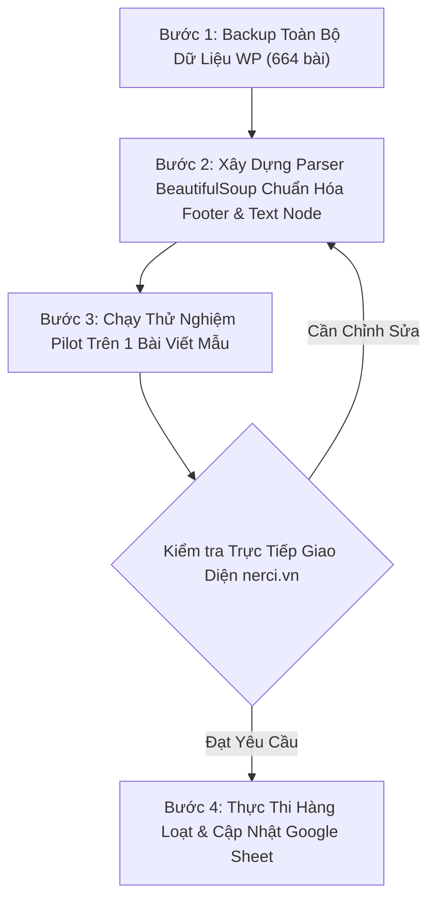

# 📋 Kế Hoạch Chuẩn Hóa Thương Hiệu NERCI & Thông Tin Liên Hệ Trên Website nerci.vn

> [!IMPORTANT]
> **Tài liệu Kế hoạch Triển khai & Phân tích Rủi ro Kỹ thuật**
> - **Dự án:** Chuẩn hóa nội dung, thông tin liên hệ và nhận diện thương hiệu trên 664 bài viết `nerci.vn`.
> - **Tham chiếu Google Sheet:** [Sheet Review Footer 128 Bài Viết (gid=1320603029)](https://docs.google.com/spreadsheets/d/1Wbz2r_YzrW9TqcYeqWGbL4AMXm0J4GEqvArl04mewtc/edit?gid=1320603029#gid=1320603029)
> - **Trạng thái:** Chờ phê duyệt phương án xử lý rủi ro trước khi chạy tự động trên WordPress.

---

## 🎯 1. Bối Cảnh & 4 Quy Tắc Chuẩn Hóa Người Dùng Yêu Cầu

Người dùng đề xuất bổ sung 4 quy tắc chuẩn hóa trên hệ thống bài viết của `nerci.vn`:
1. **Tên thương hiệu:** Tên đứng độc lập là `NRECI` (không phân biệt hoa/thường, đúng ký tự) $\rightarrow$ đổi thành chữ in hoa **`NERCI`**.
2. **Website:** Toàn bộ chỉnh về chữ thường `nerci` thay cho `nreci`, tên miền chính xác là **`nerci.vn`** (kèm `https://`).
3. **Facebook:** Mọi liên kết/nhắc đến Fanpage NERCI chuẩn hóa thành:
   - **Anchor Text:** `NERCI.vn - Viện Nghiên Cứu và Tư Vấn Dinh Dưỡng`
   - **URL:** `https://www.facebook.com/nerci.vn`
4. **Hotline & Email:** Đồng bộ toàn bộ về:
   - **Hotline:** `1900 633 690` (gắn link `tel:1900633690`)
   - **Email kinh doanh:** `kinhdoanh@nerci.vn` (gắn link `mailto:kinhdoanh@nerci.vn`)

---

## ⚠️ 2. Đánh Giá Chuyên Sâu: "Có Gì Đó Không Ổn Không?" (4 Rủi Ro Tiềm Ẩn & Giải Pháp)

Sau khi quét thực tế toàn bộ cơ sở dữ liệu bài viết và kiểm tra trực tiếp mã nguồn của `nerci.vn`, hệ thống phát hiện **4 điểm rủi ro kỹ thuật lớn** nếu thực hiện thay thế chuỗi tự động (naive string replacement / regex thông thường):

---

### 🔴 RỦI RO 1: Nguy cơ GÃY LINK ẢNH HÀNG LOẠT (Lỗi HTTP 404) khi đổi `NRECI` $\rightarrow$ `NERCI`
* **Hiện trạng thực tế:** 
  Có hàng chục bài viết đang sử dụng các hình ảnh được tải lên từ năm 2023–2024 có chứa từ `nreci` trong tên tệp tin, ví dụ:
  - `https://nerci.vn/wp-content/uploads/2023/07/kham-dd-nreci-1.jpg`
  - `https://nerci.vn/wp-content/uploads/2024/11/NRECI-298.webp`
  - `https://nerci.vn/wp-content/uploads/2023/05/logo-nreci.png`
* **Hậu quả nếu replace tự động không chọn lọc:** 
  Nếu kịch bản tìm và thay `nreci` $\rightarrow$ `nerci`, đường dẫn ảnh sẽ bị biến thành `kham-dd-nerci-1.jpg`. Tuy nhiên, tệp tin vật lý lưu trên máy chủ hosting WordPress **vẫn mang tên gốc `kham-dd-nreci-1.jpg`**! Điều này sẽ khiến **toàn bộ hình ảnh trong bài bị lỗi gãy (ảnh vỡ, HTTP 404)**.
* **Biện pháp xử lý kỹ thuật (Bắt buộc):**
  - **Chỉ thay thế trên Text Nodes (Nội dung chữ hiển thị với người đọc):** Sử dụng thư viện `BeautifulSoup` để bóc tách riêng các chuỗi văn bản (NavigableString).
  - **Bảo vệ tuyệt đối các thuộc tính HTML:** Không can thiệp vào `src`, `srcset`, `data-src`, `class`, `id` của bất kỳ thẻ ``, `<a>` hay `<div>` nào.
  - Sử dụng regex ranh giới từ chính xác: `\b(?i)nreci\b` chỉ áp dụng trong text node.

---

### 🔴 RỦI RO 2: Chuyển đổi Subdomain cũ sang Subdomain mới chính xác
* **Hiện trạng thực tế:**
  Quét thực tế phát hiện trong các bài viết khóa học (ví dụ Post 1851, 9811, 9821) có chứa các subdomain cũ bọc quanh các banner đăng ký:
  - `https://tuvansanphamdinhduong.nreci.org/`
  - `https://tuvandinhduongcongdong.nreci.org/`
  - Domain chính `http://nreci.org` đã được cấu hình Redirect 301 tự động về `https://nerci.vn/`.
* **Chỉ đạo cập nhật từ người dùng:**
  Người dùng đã cấu hình hoàn tất 2 hệ thống tên miền phụ tương ứng. Do đó:
  - `https://tuvandinhduongcongdong.nreci.org/` $\rightarrow$ **chuyển thành `https://tuvandinhduongcongdong.nerci.vn/`** (Đã kiểm tra: Status 200 OK).
  - `https://tuvansanphamdinhduong.nreci.org/` $\rightarrow$ **chuyển thành `https://tuvansanphamdinhduong.nerci.vn/`** (Đã kiểm tra: Status 200 OK).
  - Đối với `nreci.org` hoặc `http://nreci.org` $\rightarrow$ Đổi thành `https://nerci.vn/`.

---

### 🔴 RỦI RO 3: GHI ĐÈ NHẦM Fanpage cá nhân của Bác sĩ / Chuyên gia
* **Hiện trạng thực tế:**
  Trong rất nhiều bài viết chuyên môn (đặc biệt là các bài của Bác sĩ Nguyễn Ngọc Hưng - Viện trưởng), ở cuối bài có đính kèm Fanpage cá nhân của Bác sĩ:
  - `https://www.facebook.com/BsNgocHungOfficial`
  - `https://www.facebook.com/bacsihungdinhduong`
  Bên cạnh đó mới là Fanpage cũ của Viện: `https://www.facebook.com/nreci.org`.
* **Hậu quả nếu quy tắc quá rộng:**
  Nếu kịch bản tìm từ khóa "Facebook" hoặc link facebook chung chung rồi thay thế bằng Fanpage Viện, **Fanpage cá nhân của Bác sĩ Hùng sẽ bị xóa mất**, làm mất kênh tương tác cá nhân của chuyên gia.
* **Biện pháp xử lý kỹ thuật:**
  - **White-list / Target cụ thể:** Chỉ thay thế các URL trỏ về fanpage Viện:
    - `https://www.facebook.com/nreci.org`
    - `https://www.facebook.com/nreci`
    - `https://www.facebook.com/nerci.org`
  - Giữ nguyên 100% các liên kết Facebook cá nhân có slug `BsNgocHungOfficial` hoặc `bacsihungdinhduong`.
  - **Lưu ý về Anchor Text:** Anchor text `NERCI.vn - Viện Nghiên Cứu và Tư Vấn Dinh Dưỡng` rất trang trọng, phù hợp nhất khi đặt trong danh sách thông tin liên hệ (dấu gạch đầu dòng `<li>...</li>`). Nếu từ "Facebook" nằm lửng lơ giữa một câu văn trong thân bài, chỉ nên cập nhật URL href, giữ anchor text tự nhiên để không làm gãy văn phong.

---

### 🔴 RỦI RO 4: GHI ĐÈ NHẦM Hotline / Email của Bệnh Viện Đối Tác & Xung Đột Kiến Trúc Footer
* **Hiện trạng thực tế:**
  Trong 664 bài viết, có hàng chục bài viết cẩm nang hướng dẫn khám dinh dưỡng trích dẫn địa chỉ, số điện thoại bàn và email của các đơn vị y tế lớn:
  - Bệnh viện Nhi Đồng 1, Nhi Đồng 2: email `bvnhidong@nhidong.org.vn`
  - Trung tâm Dinh dưỡng TP.HCM: email `tt.dinhduong@tphcm.gov.vn`
  - Hotline đối tác khám H&H Nutrition: `1900 638 308`
* **Hậu quả nếu thay thế toàn cục:**
  Nếu script tìm mọi định dạng số điện thoại hoặc email trên bài viết để thay bằng `1900 633 690` và `kinhdoanh@nerci.vn`, **thông tin liên hệ cấp cứu/khám của Bệnh viện Nhi Đồng sẽ bị biến thành Hotline của NERCI!**
* **Biện pháp xử lý kỹ thuật:**
  - Chỉ thay thế các số hotline `0888 334 478`, `0888 844 732`, `1900 633 690` khi nó đứng sau các nhãn: `Hotline:`, `Điện thoại:`, `Liên hệ NERCI:`, `Viện Nghiên cứu...`.
  - Chỉ thay thế email `viendinhduong@nreci.org`, `viendinhduong@nerci.vn` khi nằm trong khối thông tin của Viện. Tuyệt đối không chạm vào email đuôi `.gov.vn` hay `@nhidong.org.vn`.

---

## 🏛️ 3. Quyết Định Kiến Trúc Chính Thức: Giữ Nguyên Khối Footer & Chuẩn Hóa Liên Kết

Theo chỉ đạo của người dùng: **Khối footer ở cuối bài viết được GIỮ NGUYÊN, nhưng BẮT BUỘC phải chuẩn hóa 100% nội dung và quy tắc dẫn link**.

### Quy chuẩn mẫu cho Khối Footer Cuối Bài Viết:
```html
Thông tin liên hệ:
<ul>
  <li><strong>Địa chỉ:</strong> <a href="https://maps.google.com/?cid=11269675784466588840" target="_blank" rel="noopener">7A/47 Thành Thái, phường Diên Hồng, Thành phố Hồ Chí Minh</a></li>
  <li><strong>Hotline:</strong> <a href="tel:1900633690">1900 633 690</a></li>
  <li><strong>Email:</strong> <a href="mailto:kinhdoanh@nerci.vn">kinhdoanh@nerci.vn</a></li>
  <li><strong>Website:</strong> <a href="https://nerci.vn/" target="_blank" rel="noopener">https://nerci.vn/</a></li>
  <li><strong>Fanpage:</strong> <a href="https://www.facebook.com/nerci.vn" target="_blank" rel="noopener">NERCI.vn - Viện Nghiên Cứu và Tư Vấn Dinh Dưỡng</a></li>
</ul>
```

### Các quy tắc dẫn link bắt buộc trong khối:
1. **Địa chỉ:** Toàn bộ địa chỉ cũ (Trần Thiện Chánh, CMT8, P.14 Q.10...) $\rightarrow$ Đổi thành `7A/47 Thành Thái, phường Diên Hồng, Thành phố Hồ Chí Minh` và gắn link Google Maps CID `https://maps.google.com/?cid=11269675784466588840`.
2. **Hotline:** Toàn bộ hotline cũ (`0888 334 478`, `0888 844 732`, `1900 638 308`) $\rightarrow$ Đổi thành `1900 633 690` và gắn link `tel:1900633690`.
3. **Email:** Toàn bộ email cũ (`viendinhduong@nreci.org`, `viendinhduong@nerci.vn`) $\rightarrow$ Đổi thành `kinhdoanh@nerci.vn` và gắn link `mailto:kinhdoanh@nerci.vn`.
4. **Website:** `nreci.org` / `http://nerci.vn` $\rightarrow$ `https://nerci.vn/` (bắt buộc có `https://`).
5. **Facebook:** Fanpage Viện $\rightarrow$ `https://www.facebook.com/nerci.vn` (Anchor: `NERCI.vn - Viện Nghiên Cứu và Tư Vấn Dinh Dưỡng`). **Bảo vệ nguyên vẹn link FB cá nhân của Bác sĩ Hùng**.
6. **Subdomain:**
   - `tuvandinhduongcongdong.nreci.org` $\rightarrow$ `https://tuvandinhduongcongdong.nerci.vn/`
   - `tuvansanphamdinhduong.nreci.org` $\rightarrow$ `https://tuvansanphamdinhduong.nerci.vn/`

---

## 🚀 4. Lộ Trình Triển Khai Chi Tiết (Pipeline 4 Bước An Toàn)



### Bước 1: Sao lưu dữ liệu an toàn (Pre-run Backup)
- Xuất toàn bộ 664 bài viết (ID, slug, content thô) ra file JSON cục bộ có đóng dấu thời gian: `01 Projects/NERCI-WP-MCP/backup_posts_YYYYMMDD_HHMMSS.json`.
- Đảm bảo có thể Rollback (khôi phục nguyên trạng 100%) bất kỳ lúc nào nếu có sự cố.

### Bước 2: Xây dựng bộ lọc BeautifulSoup chuẩn xác
- Viết script `clean_and_standardize_nerci_posts.py`:
  - **Lớp 1 (Chuẩn hóa Khối Footer):** Tìm khối liên hệ ở cuối bài, viết lại/cập nhật các dòng Địa chỉ (kèm link Maps), Hotline (kèm link tel), Email (kèm link mailto), Website (kèm link https), Facebook (kèm link nerci.vn).
  - **Lớp 2 (Chuẩn hóa Thân bài):**
    - Thay thế `\b(?i)nreci\b` $\rightarrow$ `NERCI` (trong Text Nodes và thẻ `alt`/`title`).
    - Thay thế `http://nreci.org` hoặc `https://nreci.org` $\rightarrow$ `https://nerci.vn/`.
    - Thay thế `tuvandinhduongcongdong.nreci.org` $\rightarrow$ `https://tuvandinhduongcongdong.nerci.vn/`.
    - Thay thế `tuvansanphamdinhduong.nreci.org` $\rightarrow$ `https://tuvansanphamdinhduong.nerci.vn/`.
    - Thay thế `https://www.facebook.com/nreci.org` $\rightarrow$ `https://www.facebook.com/nerci.vn`.
  - **Lớp 3 (Bảo vệ):** Khóa cứng toàn bộ thuộc tính `src`, `srcset`, link ảnh, link Fanpage cá nhân của Bác sĩ (`BsNgocHungOfficial`).

### Bước 3: Chạy thử nghiệm Pilot (1 Bài Viết Mẫu)
- Chọn bài viết tiêu biểu: **Post ID 1849** (`https://nerci.vn/thong-tin-khoa-hoc-dinh-duong-co-ban/`) hoặc **Post ID 4468** (`https://nerci.vn/khi-nao-can-cho-tre-di-kham-dinh-duong/`).
- Cập nhật bài viết qua REST API WordPress.
- So sánh Diff nội dung trước/sau, kiểm tra hiển thị thực tế trên trình duyệt đảm bảo:
  - Không gãy bất kỳ ảnh nào.
  - Chữ `NERCI` hiển thị in hoa đẹp mắt.
  - Link Facebook, Website click vào dẫn đến đúng địa chỉ.

### Bước 4: Thực thi hàng loạt & Báo cáo
- Chạy batch update cho 128 bài viết (hoặc toàn bộ các bài cần xử lý).
- Tự động cập nhật cột `Trạng thái duyệt` trong Google Sheet `gid=1320603029` thành `Đã hoàn thành`.
- Bàn giao báo cáo tổng kết chi tiết cho người dùng.
