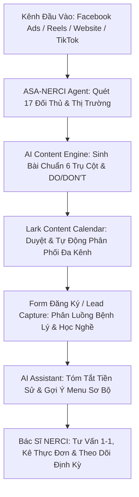

# 🏛️ NERCI BRAND IDENTITY & ECOSYSTEM MASTER STRATEGY (2025 – 2030)
*Kế Hoạch Định Hướng Thương Hiệu, Chuẩn Hóa Vận Hành Lark Suite, Content Matrix, Ads Funnel & Hệ Thống AI Automation*

---

## 🧭 I. TỔNG QUAN ĐỊNH VỊ THƯƠNG HIỆU & HỆ SINH THÁI NERCI

Theo tài liệu định hướng nhận diện thương hiệu 2025–2030 của **H&H Nutrition & Viện NERCI (NRECI)**:

### 1. Bản sắc & Tầm nhìn đến năm 2030
* **Tầm nhìn:** Tiên phong dẫn dắt xu hướng **"Healing Nutrition – Dinh dưỡng Chữa lành"** tại Việt Nam, kết hợp khoa học y học hiện đại với sự nuôi dưỡng toàn diện **Thân – Tâm – Trí** nhằm phục hồi và nuôi dưỡng sức khỏe bền vững từ gốc.
* **Sứ mệnh:** Khơi mở nhận thức đúng đắn về dinh dưỡng trên hệ giá trị kiềng 3 chân: **Khoa học – Nuôi dưỡng – Nhân văn**.
* **Định vị cốt lõi:** Viện Dinh dưỡng tiên phong chữa lành sức khỏe từ gốc dựa trên mô hình cá thể hóa 100% (xét nghiệm, hành vi lối sống) và phương pháp 3D (*Đúng – Đủ – Điều*).
* **Giá trị cảm nhận mong muốn:** *Tin cậy – Tỉnh thức – Được nâng đỡ – Được chữa lành – Được đồng hành*.

---

### 2. Ý Nghĩa Tên Gọi & Logo NERCI
* **Cách đọc chuẩn:** `/nɜːr-si/` (phát âm: **Nơ-xi**). *Tránh đọc sai dạng N-E-R-C-I hay Nờ-rê-si.*
* **Cấu trúc ký tự NERCI:**
  * **N**: *Nutrition – Nurture – Nature* (Dinh dưỡng, Nuôi dưỡng, Tự nhiên).
  * **ERCI**: *Education – Research – Consultation – Innovation* (Đào tạo, Nghiên cứu, Tư vấn, Đổi mới).
* **Biểu tượng Logo:** Sự hòa quyện của 3 yếu tố: **Giọt nước** (Sự sống) + **Chiếc lá** (Tự nhiên) + **Con người** (Trung tâm của mọi nghiên cứu).

---

### 3. Triết Lý Dinh Dưỡng UBANDs & Ngũ Uẩn
| Thành tố UBANDs | Diễn giải triết lý | Ứng dụng Content & Tư vấn |
| :--- | :--- | :--- |
| **U** — Universal | Phổ quát, ai cũng có thể tiếp cận và thấu hiểu | Bài viết đại chúng, giải mã thuật ngữ y khoa phức tạp |
| **B** — Balance | Cân bằng dưỡng chất, cân bằng thân tâm | Thực đơn hài hòa, không kiêng khem cực đoan |
| **A** — Actionable | Thực tiễn, dễ áp dụng vào đời sống hàng ngày | Công thức món ăn, bảng quy đổi định lượng chuẩn |
| **N** — Naturally | Ưu tiên thực phẩm nguyên bản, tự nhiên | Khuyến khích chế biến tối giản, giữ trọn vi chất |
| **D** — Diverse | Đa dạng hóa nguồn dưỡng chất thực vật & động vật | Đa dạng màu sắc thực phẩm, phong phú đạm |
| **S** — Supplementation | Bổ sung vi chất đúng trường hợp, đúng liều lượng | Dược dinh dưỡng y học, sữa chuyên biệt (F1–F4) |

* **Tinh thần Ngũ Uẩn trong Dinh dưỡng:**
  1. **Sắc (Cơ thể & Giác quan):** Ăn uống cảm nhận bằng mọi giác quan, thấu hiểu tín hiệu cơ thể.
  2. **Thọ (Cảm xúc & Trải nghiệm):** Bữa ăn mang lại sự dễ chịu, bình an, không áp lực kiêng khem.
  3. **Tưởng (Nhận thức & Suy nghĩ):** Hiểu rõ cơ chế bệnh lý, loại bỏ nỗi sợ vô căn cứ.
  4. **Hành (Động lực & Ý chí):** Quyết tâm thay đổi lối sống, kiên trì theo phác đồ dinh dưỡng.
  5. **Thức (Tỉnh thức & Kết nối):** Lắng nghe cơ thể, sống hòa hợp với thiên nhiên.

---

### 4. Quy Chuẩn Ngôn Từ Bắt Buộc (DO & DON'T)
Để đảm bảo đúng luật Y tế, định vị chuyên gia và thông điệp thương hiệu nhân văn:

| NÊN DÙNG (DO) ✅ | TUYỆT ĐỐI TRÁNH (DON'T) ❌ |
| :--- | :--- |
| **Viện Dinh dưỡng NRECI / NERCI** | Viện Nghiên cứu & Tư vấn Dinh dưỡng NRECI (rườm rà) |
| **Tư vấn dinh dưỡng / Can thiệp dinh dưỡng** | Khám dinh dưỡng / Điều trị bằng dinh dưỡng / Điều trị bệnh |
| **Hỗ trợ điều trị / Đồng hành hồi phục** | Cam kết điều trị khỏi bệnh / Chữa dứt điểm |
| **Bảo tồn độ lọc cầu thận / Bảo tồn chức năng thận** | Tăng độ lọc cầu thận / Chữa khỏi suy thận mạn |
| **Khách hàng / Học viên** | Bệnh nhân |
| **Khóa sơ cấp nghề / Liệu trình dinh dưỡng** | Trở thành chuyên gia sau khóa học |
| **Tone:** Ấm áp, khoa học, gần gũi, trao quyền | Giáo điều, phán xét, hù dọa bệnh tật |

---

## 🏢 II. CẤU TRÚC HỆ SINH THÁI THƯƠNG HIỆU & ĐỐI TƯỢNG MỤC TIÊU

### 1. Kiến trúc Tổ chức
```
                    ┌─────────────────────────────────────────┐
                    │      CÔNG TY TNHH Y TẾ H&H              │
                    │         (H&H Nutrition)                 │
                    └────────────────────┬────────────────────┘
             ┌───────────────────────────┼───────────────────────────┐
             │                           │                           │
┌────────────┴────────────┐ ┌────────────┴────────────┐ ┌────────────┴────────────┐
│   H&H Communication     │ │   VIỆN DINH DƯỠNG       │ │  PHÒNG KHÁM DINH DƯỠNG │
│    (Event - Booking)    │ │   NERCI / NRECI         │ │        NERCI            │
└─────────────────────────┘ └────────────┬────────────┘ └─────────────────────────┘
                    ┌────────────────────┼────────────────────┐
                    │                    │                    │
          ┌─────────┴─────────┐ ┌────────┴─────────┐ ┌────────┴─────────┐
          │  NERCI Academy    │ │  Viện Dinh Dưỡng │ │  NERCI Research  │
          │(Đào tạo dinh dưỡng│ │   (Can thiệp &   │ │(Hợp tác nghiên   │
          │   sơ cấp nghề)    │ │    Tư vấn)       │ │      cứu)        │
          └───────────────────┘ └──────────────────┘ └──────────────────┘
```

### 2. Đối tượng Mục tiêu (Target Audience)
1. **B2C - Khách Hàng Can Thiệp & Điều Trị Dinh Dưỡng:**
   * *Nhóm bệnh lý:* Thận mạn (CKD giai đoạn 1–5), Đái tháo đường, Tim mạch, Ung thư, Rối loạn chuyển hóa, Tiêu hóa.
   * *Nhóm lối sống & chữa lành:* Tăng/giảm cân lành mạnh, mẹ & bé, người cần phục hồi năng lượng thân tâm.
   * *Chân dung người ra quyết định:* Nữ/Nam 35+, phân khúc thu nhập AB+, sống tại HCM, Hà Nội, đô thị lớn hoặc Việt Kiều; thường là người chăm sóc chính cho cha mẹ hoặc người thân mang bệnh.
2. **B2C - Học Viên / Người Theo Đuổi Nghề Dinh Dưỡng:**
   * Người muốn chuyển nghề (Wellness, Tư vấn sức khỏe, Spa, Dinh dưỡng ứng dụng).
   * PT, HLV Yoga, Fitness.
   * Chủ doanh nghiệp F&B healthy, Spa, Phòng khám.
   * Sinh viên Y - Dược - Dinh dưỡng - Công tác xã hội.
3. **B2B - Doanh Nghiệp & Tổ Chức:**
   * Doanh nghiệp Thực phẩm chức năng, Sữa y tế, Thiết bị y tế, Wellness.
   * Bệnh viện, Phòng khám, Trường học, Trung tâm cộng đồng.
   * Kênh Bảo hiểm, Banca, Chuỗi Mẹ & Bé, F&B.

---

## 🎯 III. CONTENT MATRIX THEO 6 TRỤ CỘT TRUYỀN THÔNG

| Trụ cột | Bản chất nội dung | Content Angle AI / Hook | Kênh & Định dạng tối ưu |
| :--- | :--- | :--- | :--- |
| **1. Healing Nutrition** | Chữa lành tự nhiên, thân tâm trí, triết lý UBANDs, ngũ uẩn | "Lắng nghe cơ thể: Vì sao kiêng khem cực đoan lại khiến bệnh thận nặng hơn?" | Facebook Reel, TikTok, Infographic, Blog |
| **2. Dinh Dưỡng Bệnh Lý** | Case study thực tế, phác đồ cá thể hóa, giải thích chỉ số xét nghiệm | "Bảo tồn eGFR: Hành trình 6 tháng cải thiện chỉ số Creatinine nhờ dinh dưỡng 3D" | Carousel, Bài chuyên sâu Website, Video Bác sĩ |
| **3. Giải Pháp NERCI** | Gói tư vấn 1-1, thiết kế thực đơn F1–F4, phân phối sản phẩm chính hãng | "Khám phá quy trình can thiệp dinh dưỡng 5 bước chuẩn y khoa tại NERCI" | Bitable Form, Landing Page, Video Tour |
| **4. Cộng Đồng & Học Viên** | Câu chuyện học nghề, phỏng vấn học viên sơ cấp, lan tỏa giá trị | "Từ một HLV Yoga đến học viên xuất sắc lớp Dinh dưỡng Chữa lành NERCI" | Phỏng vấn, Livestream, Video tốt nghiệp |
| **5. NutriNews** | Tin tức viện, hội thảo khoa học, thông báo tuyển sinh, ra mắt sách | "ThS.BS Đặng Ngọc Hùng ra mắt sách: 'Từ đối đầu đến hòa hợp - Bệnh thận mạn'" | Thông cáo báo chí, Event Banner, Email Marketing |
| **6. NutriTalk** | Giải đáp thắc mắc, bóc trần ngộ nhận dinh dưỡng, phản biện khoa học | "Bác sĩ NERCI giải đáp: Bị tiểu đường có bắt buộc phải cắt hoàn toàn tinh bột?" | Short-form Video (Reap/TikTok), Q&A Live |

---

## ⚡ IV. KẾ HOẠCH TÁI CẤU TRÚC HỆ THỐNG LARK SUITE CHO NERCI

### 1. Đồng Bộ & Tối Ưu Bảng Tính Base Hiện Có
1. **Lark Base `Marketing Content Calendar Nerci` (`Nbn4beOzWa1tVLs7yzxjkeLjpyV`):**
   * Bổ sung trường Single Select **`Trụ Cột Truyền Thông`** gồm đúng 6 giá trị: `Healing Nutrition`, `Dinh Dưỡng Bệnh Lý`, `Giải Pháp NERCI`, `Cộng Đồng & Học Viên`, `NutriNews`, `NutriTalk`.
   * Bổ sung trường Single Select **`Triết Lý UBANDs`** (`Universal`, `Balance`, `Actionable`, `Naturally`, `Diverse`, `Supplementation`).
   * Gắn nhãn **`DO/DON'T Compliance`** (Checkbox: Đã kiểm tra không vi phạm từ khóa y tế nhạy cảm).
2. **Lark Base `Nerci CRM` (`AUCebLJ2baYgHXsu9F4jTBnypsc`):**
   * Chuẩn hóa bảng `Leads` & `Deals` theo đúng 3 nhóm đối tượng: (1) Tư vấn can thiệp bệnh lý, (2) Đào tạo sơ cấp nghề / Học viên, (3) B2B Hợp tác viện.
   * Thêm trường phân loại giai đoạn bệnh lý (CKD 1–5, Đái tháo đường, Tiêu hóa, Thừa cân béo phì).
3. **Lark Base `[DATABASE] Matrix Ads, CRO & GA4 Tracking` (`CPmObDWUOaxv8JsyFYBj4MG6pbs`):**
   * Đồng bộ trường `Angle ID` khớp với 5 Content Angles của ASA-NERCI: `Promotion`, `Science/Ingredients`, `Trust/Expert`, `Health/Benefits`, `Growth/Kids`.

---

## 🤖 V. KIẾN TRÚC TỰ ĐỘNG HÓA AI & MARKETING FUNNEL



1. **AI Content Generator Bot:**
   * Nhúng bộ quy tắc DO/DON'T và giọng điệu *Ấm áp – Khoa học – Lắng nghe – Trao quyền*.
   * Tự động quét kiểm tra và chặn các từ cấm (*cam kết khỏi bệnh, khám bệnh, tăng độ lọc cầu thận*) trước khi nội dung được xuất bản.
2. **ASA-NERCI Monitoring Engine:**
   * Duy trì chạy tự động định kỳ qua Apify Task `vcztOplUQh7F1IA5o` quét 17 Fanpage đối thủ y tế/dược phẩm, so sánh biến động và xuất báo cáo vào `Wiki/Logs/`.
3. **Smart Lead Routing & CRM Automation:**
   * Tự động phân loại lead đổ về từ Landing page hoặc Chatbot theo đúng chuyên khoa và phân bổ cho Bác sĩ / Tư vấn viên phù hợp nhất.
