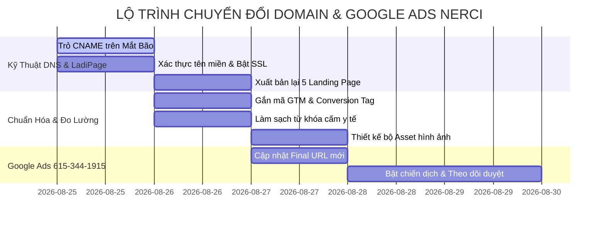

# 🛡️ KẾ HOẠCH CHUYỂN ĐỔI DOMAIN DNS & CHUẨN HÓA ASSET GOOGLE ADS (NERCI)
*Tài khoản Google Ads mới: `NERCI 615-344-1915` | Đích đến tên miền: `nerci.vn`*

> 🔗 **Lark Base Bảng Mapping 5 Tên Miền & Landing Page:** [Danh Sách Domain & Landing Page (`tblZ10E97CyTBfCj`)](https://ajpi82edbxhs.jp.larksuite.com/base/AUCebLJ2baYgHXsu9F4jTBnypsc?table=tblZ10E97CyTBfCj)  
> 🔗 **Lark Base Bảng Tiến Độ Công Việc:** [Kế Hoạch Domain & Google Ads (`tblpuFdMelDTibEA`)](https://ajpi82edbxhs.jp.larksuite.com/base/AUCebLJ2baYgHXsu9F4jTBnypsc?table=tblpuFdMelDTibEA)  
> 🌐 **Cổng Thông Tin NERCI Wiki:** [nerci.goccuaduong.com](https://nerci.goccuaduong.com)

---

## ⚠️ I. BỐI CẢNH & NGUY CƠ VI PHẠM CHÍNH SÁCH GOOGLE ADS

Tài khoản Google Ads mới tạo (**NERCI `615-344-1915`**) đang gặp phải xung đột nghiêm trọng giữa URL cũ và mới:
1. **Lỗi "Đích đến không khớp" (Destination Mismatch):** Mẫu quảng cáo hiển thị URL `nreci.org` nhưng khi người dùng click vào lại chuyển hướng (Redirect 301/302) sang `nerci.vn`.
2. **Lỗi "Tránh né hệ thống" (Circumventing Systems):** Việc chuyển hướng chéo tên miền trên tài khoản mới có thể dẫn đến việc tài khoản bị **Tạm ngưng vĩnh viễn (Suspended)**.
3. **Mục tiêu:** Di dời 100% Landing Page trên LadiPage về Subdomain chính thức của `nerci.vn`, đảm bảo khi bot Google quét trả về mã **HTTP 200 OK (Không redirect)**.

---

## 🌐 II. BẢNG QUY HOẠCH CHI TIẾT 5 TÊN MIỀN CẦN CHUYỂN ĐỔI

Dưới đây là 5 đường link cụ thể đã được đồng bộ vào bảng Lark Base `tblZ10E97CyTBfCj`:

| STT | Nghiệp Vụ / Khóa Học | Link Cũ Cần Đổi (`nreci.org`) | Link Mới Hoạt Động (`nerci.vn`) | Host CNAME (Mắt Bão) | Target Trỏ Về | Trạng Thái Xử Lý |
| :---: | :--- | :--- | :--- | :--- | :--- | :---: |
| **1** | **Khóa Học Dinh Dưỡng Cơ Bản** | `https://dinhduongcoban.nreci.org/` | `https://dinhduongcoban.nerci.vn/` | `dinhduongcoban` | `dns.ladipage.com` | 🟡 Chờ trỏ DNS |
| **2** | **Khóa Sơ Cấp Nghề Dinh Dưỡng** | `https://socapnghedinhduong.nreci.org/` | `https://socapnghedinhduong.nerci.vn/` | `socapnghedinhduong` | `dns.ladipage.com` | 🟡 Chờ trỏ DNS |
| **3** | **Khóa TVDD Cộng Đồng** | `https://tuvandinhduongcongdong.nreci.org/` | `https://tuvandinhduongcongdong.nerci.vn/` | `tuvandinhduongcongdong` | `dns.ladipage.com` | 🟡 Chờ trỏ DNS |
| **4** | **Liệu Trình Dinh Dưỡng Y Khoa** | `https://lieutrinhdinhduong.nreci.org/` | `https://lieutrinhdinhduong.nerci.vn/` | `lieutrinhdinhduong` | `dns.ladipage.com` | 🟡 Chờ trỏ DNS |
| **5** | **Tư Vấn Dinh Dưỡng Tổng Thể** | `https://tuvandinhduong.nreci.org/` | `https://tuvandinhduong.nerci.vn/` | `tuvandinhduong` | `dns.ladipage.com` | 🟡 Chờ trỏ DNS |

---

## 📋 III. BẢNG REQUEST TÀI NGUYÊN (ASSET REQUEST MATRIX)

### 1. Request Team IT & Quản Trị LadiPage
* [ ] Cấp quyền Editor/Admin trên LadiPage chứa 5 trang đích cũ để nhân bản và đổi tên miền xuất bản.
* [ ] Cấu hình Webhook Form: Tự động gửi dữ liệu đăng ký sang **Lark Base CRM Leads (`tblg4HVuKmLu57CI`)**.
* [ ] Cài đặt mã đo lường: GTM Container ID, GA4 Measurement ID và Google Ads Conversion Tracking mới cho tài khoản `615-344-1915`.

### 2. Request Team Content & Y Khoa (Chính Sách Y Tế Google Ads)
* [ ] Rà soát và loại bỏ các từ ngữ bị cấm trong quảng cáo y tế (*"cam kết 100%", "chữa dứt điểm", "thần dược"*).
* [ ] Bổ sung thông tin pháp nhân đầy đủ ở Footer: Tên Viện NERCI, Hotline, Địa chỉ trụ sở, Giấy phép hoạt động và Tuyên bố miễn trừ trách nhiệm y khoa.

### 3. Request Team Design (Visual Assets)
* [ ] **Ảnh ngang (Landscape 1.91:1):** `1200 x 628 px` (Ảnh Bác sĩ Đặng Ngọc Hùng, phòng khám NERCI, lớp học thực hành).
* [ ] **Ảnh vuông (Square 1:1):** `1200 x 1200 px` (Logo Viện, chứng chỉ đào tạo, ảnh tư vấn 1-1).
* [ ] **Logo thương hiệu:** File PNG nền trong suốt `1:1` và `4:1`.

---

## 📅 IV. TIẾN ĐỘ THỰC THI TRÊN LARK BASE (`tblpuFdMelDTibEA`)

---
*Ghi chú được cập nhật và đồng bộ tự động bởi Antigravity AI Agent.*
