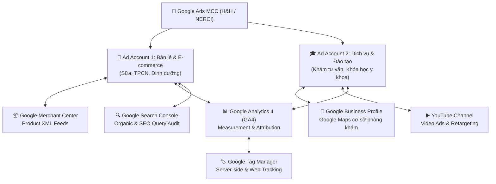
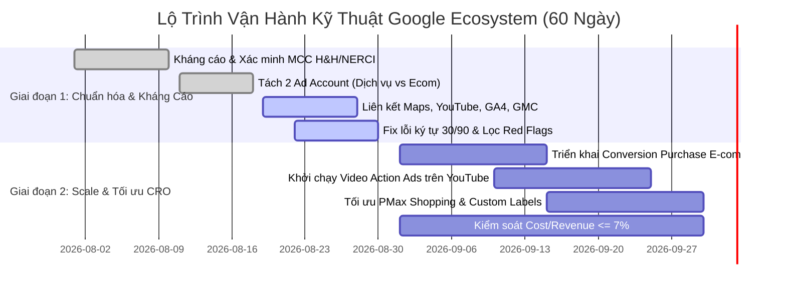

  
NERCI GOOGLE ECOSYSTEM & MEDICAL ADS SPECIFICATION

  <h1 style="margin: 0 0 8px 0; color: white; border: none; padding: 0; font-size: 24px;">NHẬT KÝ HÀNH ĐỘNG CHI TIẾT TỪNG TÀI KHOẢN GOOGLE & PLAYBOOK QUẢNG CÁO Y TẾ NERCI</h1>
  

    <strong>Người phụ trách:</strong> Lê Đại Dương (Performance & Automation) • <strong>Ngày cập nhật:</strong> 24/08/2026 • <strong>Phạm vi:</strong> Toàn bộ Google Ecosystem (H&H / NERCI)
  

> [!abstract] MỤC TIÊU VẬN HÀNH & QUẢN TRỊ HỆ SINH THÁI GOOGLE
> Báo cáo này đóng vai trò là **Sổ tay Vận hành Kỹ thuật (Technical Action Log)** và **Bộ Quy chuẩn Nội dung Y tế (Medical Compliance Playbook)** cho toàn bộ hệ sinh thái Google của NERCI. Tài liệu định rõ từng bước hành động trên từng tài khoản độc lập, quy trình liên kết chéo dữ liệu (Google Ads $\longleftrightarrow$ Maps $\longleftrightarrow$ YouTube $\longleftrightarrow$ GA4 $\longleftrightarrow$ GMC), phương án kháng cáo tài khoản và bộ dữ liệu quảng cáo mẫu tuân thủ tuyệt đối chính sách y tế của Google.

---

## 🧭 1. MA TRẬN HÀNH ĐỘNG KỸ THUẬT THEO TỪNG TÀI KHOẢN (GOOGLE ECOSYSTEM LOG)

---

### 1.1. Tài khoản Google Ads MCC & Sub-Accounts (Quản lý Chiến dịch)

| STT | Phân Loại Tài Khoản | Hành Động Kỹ Thuật Chi Tiết | Mục Đích & Chuẩn Đầu Ra | Đầu Mối Phối Hợp | Trạng Thái |
| :---: | :--- | :--- | :--- | :--- | :---: |
| **1.1.1** | **Tài khoản MCC Chung** | • **Kháng cáo & Xác minh nhà quảng cáo (Advertiser Verification):** Nộp hồ sơ pháp lý H&H/NERCI, giấy phép hoạt động y tế, giấy phép quảng cáo. • Thiết lập phân quyền truy cập: Cấp quyền View/Analyst cho nhân sự quản lý, giữ quyền Admin tập trung. | Tài khoản verified 100%, không bị tạm ngưng vì lỗi danh tính hoặc thanh toán. | Pháp chế H&H, Google Support | ⏳ Đang xử lý |
| **1.1.2** | **Ad Account 1 (Bán lẻ / E-com)** | • Tách biệt hoàn toàn ngân sách cho nhóm thực phẩm bổ sung, sữa y tế. • Cài đặt Primary Conversion Action = **Purchase** (giá trị động theo từng đơn hàng). • Cấu hình Enhanced Conversions for Web (băm SHA256 email, phone). | Thuật toán Smart Bidding học đúng giá trị đơn hàng thực tế, tính đúng ROAS. | TDCX, Google AM | 🚀 Sẵn sàng |
| **1.1.3** | **Ad Account 2 (Dịch vụ & Đào tạo)** | • Quản lý chiến dịch Khóa học (Dinh dưỡng Ung thư, Dinh dưỡng Thận...) và Đặt lịch khám. • Primary Conversion Action = **Submit Lead Form** & **Phone Call Clicks**. • Secondary Conversion = Chat Zalo / Messenger. | Tối ưu hóa tệp học viên và bệnh nhân chất lượng, đo lường CPL chuẩn. | Anh Dương, TDCX | 🚀 Sẵn sàng |
| **1.1.4** | **MCC Level / Security** | • Lọc trừ định kỳ placement rác (kênh game, truyện tranh, app trẻ em). • Cài đặt Negative Keyword Lists dùng chung cấp MCC để chặn click tặc/từ khóa phản cảm. | Tiết kiệm 15% - 20% ngân sách bị lãng phí do hiển thị sai đối tượng. | Team Performance | 🔄 Định kỳ |

---

### 1.2. Thiết lập & Tối ưu Liên kết Tài khoản Chéo (Cross-Account Linkages)

#### A. Google Ads $\longleftrightarrow$ Google Business Profile (Google Maps)
* **Hành động:** Gửi yêu cầu liên kết từ Google Ads sang tài khoản Quản lý Trang doanh nghiệp Google (cơ sở phòng khám / viện dinh dưỡng).
* **Ứng dụng:**
  * Kích hoạt tự động **Tiện ích vị trí (Location Assets)** trên quảng cáo Tìm kiếm & Bản đồ (Local Search Ads).
  * Hiển thị địa chỉ, chỉ đường và nút gọi trực tiếp khi người dùng tìm kiếm cụm từ: *"khám dinh dưỡng ở đâu"*, *"phòng khám dinh dưỡng gần đây"*.

#### B. Google Ads $\longleftrightarrow$ YouTube Channel
* **Hành động:** Liên kết kênh YouTube chính thức của NERCI/H&H vào tài khoản Google Ads.
* **Ứng dụng:**
  * Trích xuất các tệp đối tượng tương tác: Người đã xem video bài giảng của bác sĩ, người đã đăng ký kênh.
  * Triển khai chiến dịch **Video Action Campaigns (VAC)** và **In-feed Video Ads** hướng dẫn dinh dưỡng để xây dựng uy tín chuyên gia (Expertise/Trust).

#### C. Google Ads $\longleftrightarrow$ Google Merchant Center (GMC)
* **Hành động:** Kết nối mã Merchant ID vào Ad Account Bán lẻ.
* **Ứng dụng:**
  * Đồng bộ Feed sản phẩm tự động để khởi chạy chiến dịch **Performance Max (PMax) Shopping**.
  * Quản trị nhãn tùy chỉnh (Custom Labels: Best Seller, Cao Huyết Áp, Thận, Ung Thư) để chia nhóm chạy quảng cáo linh hoạt.

#### D. Google Ads $\longleftrightarrow$ Google Analytics 4 (GA4)
* **Hành động:** Bật tính năng Tự động gắn thẻ (Auto-tagging / GCLID) và liên kết Property GA4.
* **Ứng dụng:**
  * Nhập khẩu các Custom Audiences từ GA4 (Khách vào trang ung thư > 2 phút, khách bỏ giỏ hàng).
  * Theo dõi và phân tích chỉ số sai lệch Conversion giữa GA4 và Google Ads (mục tiêu giữ mức chênh lệch $< 10\%$).

#### E. Google Ads $\longleftrightarrow$ Google Search Console (GSC)
* **Hành động:** Liên kết Domain GSC vào Google Ads.
* **Ứng dụng:** Đọc báo cáo **Paid & Organic Report** để phát hiện các từ khóa đã lên Top 1 SEO Organic thì giảm giá thầu Google Ads, tối ưu ngân sách tổng thể.

---

## 🛡️ 2. PLAYBOOK QUY CHUẨN NỘI DUNG QUẢNG CÁO Y TẾ (MEDICAL COMPLIANCE)

### 2.1. Nguyên tắc Kỹ thuật Bắt buộc về Ký tự & Trình bày
* **Tiêu đề (Headlines):** Tối đa **30 ký tự** (bao gồm khoảng trắng và dấu tiếng Việt).
* **Mô tả (Descriptions):** Tối đa **90 ký tự** mỗi dòng.
* **Quy tắc đếm ký tự tiếng Việt:** Luôn tính toán độ giãn ký tự an toàn (nên viết ở mức 26–28 ký tự để tránh lỗi hiển thị trên thiết bị di động).

### 2.2. Các Ranh giới Chính sách Bắt buộc Không Được Vượt Qua
1. **Tuyệt đối không cam kết hiệu quả y tế:** Không dùng các từ *"chữa khỏi"*, *"đặc trị"*, *"tiêu diệt tế bào u"*, *"cam kết 100%"*.
2. **Không dùng ngôn ngữ kích động nỗi sợ hoặc tạo áp lực:** Không đặt câu hỏi nhắm vào tình trạng bệnh cá nhân (Ví dụ cấm: *"Bạn đang bị ung thư?"*, *"Đừng để ung thư cướp đi sự sống"*).
3. **Không quảng bá khóa học/dinh dưỡng như phương pháp thay thế:** Luôn định vị khóa học là **đào tạo kiến thức & hỗ trợ chăm sóc**, không thay thế phác đồ điều trị Tây y (hóa trị, xạ trị, phẫu thuật).
4. **Quy định về Thảo dược/TPCN:** Chỉ sử dụng cụm từ *"tìm hiểu về thảo dược hỗ trợ sức khỏe"*, cấm tuyệt đối *"điều trị ung thư bằng thảo dược"*.
5. **Disclaimer Y khoa bắt buộc trên Trang đích (Landing Page):**
   > *“Nội dung khóa học mang tính chất giáo dục kiến thức khoa học, không thay thế việc chẩn đoán, tư vấn và điều trị y khoa của bác sĩ chuyên khoa.”*

---

## 📝 3. BỘ MẪU QUẢNG CÁO TỐI ƯU CHI TIẾT (CASE STUDY: KHÓA HỌC DINH DƯỠNG UNG THƯ)

### 3.1. Danh mục 30 Tiêu Đề Tìm Kiếm Chuẩn Hóa Ký Tự (Headlines $\le 30$ ký tự)

| STT | Tiêu Đề Quảng Cáo (Search Headline) | Số Ký Tự | Trạng Thái Đánh Giá | Ghi Chú Tối Ưu |
| :---: | :--- | :---: | :---: | :--- |
| 1 | `Khóa Học Dinh Dưỡng Ung Thư` | 28 | ✅ An toàn | Trực diện từ khóa tìm kiếm chính |
| 2 | `Dinh Dưỡng Trong Ung Thư` | 25 | ✅ An toàn | Khái niệm chuyên môn |
| 3 | `Học Dinh Dưỡng Ung Thư` | 23 | ✅ An toàn | Ngắn gọn, chuẩn hành động |
| 4 | `Kiến Thức Dinh Dưỡng Ung Thư` | 29 | ✅ An toàn | Nhấn mạnh tính giáo dục |
| 5 | `Dinh Dưỡng Cho Người Bệnh` | 26 | ✅ An toàn | Tệp người chăm sóc gia đình |
| 6 | `Chăm Sóc Dinh Dưỡng Ung Thư` | 28 | ✅ An toàn | Đạt chuẩn y khoa hỗ trợ |
| 7 | `Hiểu Đúng Về Dinh Dưỡng` | 25 | ✅ An toàn | Góc nhìn khoa học chuẩn |
| 8 | `Nguyên Tắc Dinh Dưỡng Ung Thư` | 30 | ✅ Đạt chuẩn | Chạm trần 30 ký tự |
| 9 | `Lựa Chọn Thực Phẩm Phù Hợp` | 28 | ✅ An toàn | Hướng dẫn thực hành |
| 10 | `Dinh Dưỡng Sau Điều Trị` | 24 | ✅ Đã tối ưu | *Bản thay thế an toàn cho dòng 33 ký tự* |
| 11 | `Dinh Dưỡng Trong Điều Trị` | 27 | ✅ An toàn | Hỗ trợ trong giai đoạn trị liệu |
| 12 | `Học Cùng Bác Sĩ Dinh Dưỡng` | 27 | ✅ An toàn | Khẳng định uy tín chuyên gia |
| 13 | `Học Cùng Chuyên Gia Dinh Dưỡng` | 30 | ✅ Đạt chuẩn | Chạm trần 30 ký tự |
| 14 | `Khóa Học Từ Chuyên Gia` | 24 | ✅ An toàn | Ngắn gọn, tạo tin cậy |
| 15 | `Khóa Học Dinh Dưỡng NRECI` | 26 | ✅ An toàn | Định vị thương hiệu viện |
| 16 | `Học Dinh Dưỡng Cùng NRECI` | 27 | ✅ An toàn | Brand Name Search |
| 17 | `Học Ngoài Giờ Hành Chính` | 25 | ✅ An toàn | Nêu bật tiện ích thời gian |
| 18 | `Học Lại Miễn Phí Tại NRECI` | 27 | ✅ An toàn | Quyền lợi học viên hấp dẫn |
| 19 | `Cấp Chứng Nhận Hoàn Thành` | 27 | ✅ An toàn | Giá trị sau khóa đào tạo |
| 20 | `Khóa Học Cho Người Chăm Sóc` | 29 | ✅ An toàn | Nhắm đúng tệp Persona |
| 21 | `Tìm Hiểu Dinh Dưỡng Ung Thư` | 28 | ✅ Đã tối ưu | *Bản thay thế an toàn cho dòng 30 ký tự sát viền* |
| 22 | `Lựa Chọn Thực Phẩm An Toàn` | 28 | ✅ An toàn | Thực hành thực tế |
| 23 | `Hiểu Về Thực Phẩm Bổ Sung` | 27 | ✅ An toàn | Giải đáp băn khoăn TPCN |
| 24 | `Tìm Hiểu Về Thảo Dược` | 23 | ✅ An toàn | Góc nhìn khoa học, không cam kết trị bệnh |
| 25 | `Kiến Thức Dinh Dưỡng Thực Tiễn` | 30 | ✅ Đạt chuẩn | Tính ứng dụng cao |
| 26 | `Dinh Dưỡng Và Sức Khỏe` | 24 | ✅ An toàn | Tổng quan sức khỏe |
| 27 | `Đào Tạo Dinh Dưỡng Chuyên Môn` | 30 | ✅ Đạt chuẩn | Nhắm đến nhân viên y tế / chuyên gia |
| 28 | `Đăng Ký Khóa Học Dinh Dưỡng` | 29 | ✅ An toàn | Call To Action trực tiếp |
| 29 | `Nhận Tư Vấn Khóa Học` | 22 | ✅ An toàn | Nút kêu gọi đăng ký |
| 30 | `Hotline 1900 633 690` | 21 | ✅ An toàn | Hiển thị số liên hệ trực tiếp |

---

### 3.2. Danh mục 30 Mô Tả Tìm Kiếm Chuẩn Hóa Ký Tự (Descriptions $\le 90$ ký tự)

| STT | Nội Dung Mô Tả (Search Description) | Ký Tự | Định Hướng Thông Điệp |
| :---: | :--- | :---: | :--- |
| **1** | Học kiến thức dinh dưỡng ung thư cùng bác sĩ và chuyên gia giàu kinh nghiệm. | 79 | Uy tín chuyên gia & Viện |
| **2** | Tìm hiểu nguyên tắc dinh dưỡng cho người bệnh trong từng giai đoạn điều trị. | 77 | Kiến thức cá nhân hóa theo giai đoạn |
| **3** | Cập nhật kiến thức lựa chọn thực phẩm phù hợp với tình trạng sức khỏe. | 71 | Thực hành thực tế trong bữa ăn |
| **4** | Tìm hiểu vai trò của dinh dưỡng trong chăm sóc và phục hồi sức khỏe. | 69 | Phục hồi và nâng cao thể trạng |
| **5** | Nội dung được xây dựng từ kinh nghiệm của bác sĩ dinh dưỡng và chuyên gia. | 75 | Nguồn gốc giáo trình khoa học |
| **6** | Phù hợp với người chăm sóc, nhân viên y tế và người quan tâm đến dinh dưỡng. | 78 | Định vị đúng đối tượng học viên |
| **7** | Học từ 19:00–21:00, phù hợp với người đi làm và người chăm sóc gia đình. | 72 | Thời gian học linh hoạt online |
| **8** | Nhận tài liệu bài giảng và ghi âm hỗ trợ học tập trước và sau buổi học. | 73 | Hỗ trợ tài liệu học tập trọn gói |
| **9** | Hoàn thành khóa học và bài thi để nhận giấy chứng nhận từ NRECI. | 64 | Chứng nhận giá trị chuyên môn |
| **10** | Được học lại miễn phí và tham gia cộng đồng hỗ trợ kiến thức dinh dưỡng. | 73 | Quyền lợi & Môi trường cộng đồng |
| **11** | Tìm hiểu bản chất khối u và các yếu tố liên quan đến ung thư. | 61 | Hiểu đúng bản chất bệnh lý |
| **12** | Cập nhật kiến thức về một số loại ung thư thường gặp. | 53 | Nội dung phổ quát, dễ áp dụng |
| **13** | Học cách lựa chọn thực phẩm phù hợp trong quá trình chăm sóc người bệnh. | 73 | Thực đơn chăm sóc an toàn |
| **14** | Nhận diện những sai lầm thường gặp khi áp dụng chế độ ăn hỗ trợ sức khỏe. | 74 | Cảnh báo sai lầm ăn kiêng mù quáng |
| **15** | Tìm hiểu thực phẩm bổ sung và thảo dược dưới góc nhìn dinh dưỡng khoa học. | 74 | Phân tích khoa học về TPCN/Thảo dược |
| **16** | Nội dung dễ hiểu, có tính ứng dụng trong chăm sóc dinh dưỡng hằng ngày. | 71 | Dễ hiểu cho đại chúng |
| **17** | Trang bị kiến thức để đồng hành cùng người thân trong quá trình điều trị. | 74 | Khơi gợi sự gắn kết tình thân gia đình |
| **18** | Học cùng đội ngũ bác sĩ và chuyên gia đang làm việc trong lĩnh vực dinh dưỡng. | 78 | Đội ngũ bác sĩ thực chiến |
| **19** | Cập nhật kiến thức từ giảng viên có kinh nghiệm tại bệnh viện và cơ sở y tế. | 77 | Kinh nghiệm lâm sàng bệnh viện |
| **20** | Học dinh dưỡng ung thư bài bản, tránh áp dụng thông tin thiếu căn cứ. | 70 | Khắc phục tin giả, mẹo truyền miệng |
| **21** | Tìm hiểu cách hỗ trợ duy trì dinh dưỡng trong quá trình điều trị. | 65 | Duy trì cân nặng, tránh suy kiệt |
| **22** | Học nguyên tắc xây dựng chế độ ăn theo từng giai đoạn chăm sóc. | 63 | Thiết kế khẩu phần chuẩn |
| **23** | Phù hợp cho người mới bắt đầu và người đã có kiến thức về ung thư. | 66 | Mở rộng mọi cấp độ đầu vào |
| **24** | Đăng ký tư vấn khóa học qua hotline 1900 633 690. | 47 | Call to action ngắn gọn |
| **25** | Nâng cao kiến thức chăm sóc dinh dưỡng cho bản thân và gia đình. | 64 | Lợi ích chăm sóc lâu dài |
| **26** | Nội dung gồm ung thư thường gặp, thực phẩm và thảo dược hỗ trợ sức khỏe. | 73 | Tóm tắt module khóa học |
| **27** | Tìm hiểu nguy cơ suy dinh dưỡng và cách chăm sóc phù hợp. | 57 | Nhận diện nguy cơ suy mòn |
| **28** | Nội dung mang tính giáo dục, không thay thế tư vấn và điều trị y khoa. | 71 | Disclaimer bảo vệ chính sách Google |
| **29** | Để lại thông tin để được tư vấn chương trình và lịch học phù hợp. | 66 | Kêu gọi điền Form tư vấn |
| **30** | Liên hệ NRECI để tìm hiểu khóa học Dinh dưỡng Ung thư. | 54 | Liên hệ viện trực tiếp |

---

### 3.3. Bảng Phân Tích Các Cụm Từ Vi Phạm Cấm Kỵ (Red Flags & Policy Risks)

> [!danger] CÁC CỤM TỪ CẤM TUYỆT ĐỐI KHI VIẾT QUẢNG CÁO & LANDING PAGE
> Sử dụng các cụm từ dưới đây sẽ khiến tài khoản Google Ads bị cảnh báo **Vi phạm Chính sách Y tế (Healthcare Policy)** hoặc bị **Tạm ngưng tài khoản (Account Suspension)** ngay lập tức.

| Cụm Từ Vi Phạm Cấm Tuyệt Đối | Lý Do Vi Phạm Chính Sách Google Ads | Giải Pháp / Cách Diễn Đạt Thay Thế Hợp Lệ |
| :--- | :--- | :--- |
| ❌ *“Chữa khỏi ung thư bằng dinh dưỡng”* | Cam kết sai sự thật, phóng đại hiệu quả điều trị y tế | ✅ *“Vai trò của dinh dưỡng trong hỗ trợ phục hồi sức khỏe”* |
| ❌ *“Đẩy lùi ung thư không cần điều trị”* | Khuyến khích bệnh nhân từ bỏ điều trị y khoa chính thống | ✅ *“Chăm sóc dinh dưỡng song hành cùng phác đồ y khoa”* |
| ❌ *“Cam kết khỏi bệnh 100%”* | Vi phạm nghiêm trọng về tính trung thực trong quảng cáo | ✅ *“Giúp người bệnh duy trì thể trạng và sức đề kháng tốt hơn”* |
| ❌ *“Điều trị ung thư bằng thảo dược”* | Quảng bá thảo dược như thuốc đặc trị bệnh hiểm nghèo | ✅ *“Tìm hiểu về thảo dược và thực phẩm bổ sung dưới góc nhìn khoa học”* |
| ❌ *“Phương pháp chữa ung thư hiệu quả nhất”* | Dùng từ so sánh nhất vô căn cứ, không có kiểm chứng | ✅ *“Nguyên tắc dinh dưỡng được nghiên cứu và khuyến nghị y khoa”* |
| ❌ *“Bạn đang bị ung thư?”* | Thu thập/ám chỉ dữ liệu sức khỏe cá nhân (Personalized Health) | ✅ *“Kiến thức dinh dưỡng dành cho người bệnh và gia đình”* |
| ❌ *“Đừng để ung thư cướp đi sự sống”* | Dùng ngôn từ giật gân, đe dọa, gây tâm lý hoảng loạn | ✅ *“Đồng hành nâng cao chất lượng sống cho người thân yêu”* |
| ❌ *“Giảm chắc chắn biến chứng ung thư”* | Khẳng định tuyệt đối kết quả lâm sàng chưa được cấp phép | ✅ *“Hỗ trợ giảm thiểu nguy cơ suy kiệt do thiếu hụt dinh dưỡng”* |
| ❌ *“Thay thế hóa trị, xạ trị bằng ăn uống”* | Hành vi nguy hiểm đe dọa trực tiếp tính mạng người bệnh | ✅ *“Giải pháp dinh dưỡng hỗ trợ người bệnh trước và sau hóa - xạ trị”* |
| ❌ *“Dinh dưỡng giúp tiêu diệt khối u”* | Tuyên bố phi khoa học về cơ chế dược lý của thực phẩm | ✅ *“Chế độ ăn khoa học giúp cung cấp năng lượng và tăng đề kháng”* |

---

## 🚀 4. CHECKLIST THIẾT LẬP CHIẾN DỊCH & BÀN GIAO TIẾN ĐỘ THỬ VIỆC

### 📋 Checklist Nghiệm Thu Bàn Giao Từng Tuần:
- [x] **Tuần 1:** Hoàn thiện bảng phân quyền tài sản số H&H; gửi yêu cầu cấp quyền Google Ads MCC, GA4, GSC, GMC, Maps, YouTube.
- [x] **Tuần 2:** Lập báo cáo phân tích ngân sách H2/2026 và cấu trúc hệ thống báo cáo khống chế Cost Ads $\le 7\%$ Doanh thu.
- [ ] **Tuần 3:** Hoàn tất liên kết chéo hệ sinh thái: Google Ads $\longleftrightarrow$ Google Maps (Location Assets), YouTube Channel, Google Merchant Center.
- [ ] **Tuần 4:** Rà soát 100% Text Ads Search theo bộ quy chuẩn $\le 30$ ký tự tiêu đề, $\le 90$ ký tự mô tả; làm sạch Landing Page không còn từ cấm y khoa.
- [ ] **Tuần 5–8:** Chạy tối ưu hóa chuyển đổi thực tế, xuất báo cáo Performance định kỳ và bàn giao trọn gói cho Trưởng phòng Marketing.

---
*Tài liệu được quản lý và cập nhật thường xuyên trên hệ thống Obsidian Wiki NERCI.*
