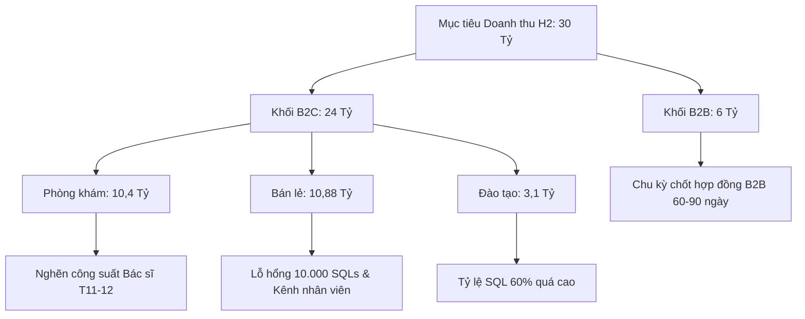

# 📊 BÁO CÁO PHÂN TÍCH & ĐÁNH GIÁ KẾ HOẠCH KINH DOANH - MARKETING H2/2026
*Hệ Sinh Thái Viện Nghiên Cứu Dinh Dưỡng NERCI & H&H Nutrition*

---

> [!abstract] TỔNG QUAN ĐÁNH GIÁ CHIẾN LƯỢC
> Kế hoạch H2/2026 của NERCI đặt mục tiêu tăng trưởng doanh thu đầy tham vọng từ **13,96 tỷ VNĐ (H1)** lên **30,00 tỷ VNĐ (H2)** (+114,8%). Tuy nhiên, qua rà soát chi tiết 9 bảng tính dữ liệu, mô hình hiện tại đang đối mặt với **3 nút thắt chí mạng**:
> 1. **Lỗ hổng 10.013 SQLs** (đặc biệt mảng Bán lẻ thiếu >65% chỉ tiêu) nhưng giải pháp lại ép 6 nhân viên bán hàng tự gánh 10.000 SQL qua kênh cá nhân.
> 2. **Tỷ lệ chuyển đổi Lead ➔ SQL gán cứng ở mức 60% – 80%** (quá cao so với chuẩn ngành Y tế/Dược phẩm 20%–35%), tạo kỳ vọng ảo về chất lượng lead.
> 3. **Hiện tượng Lợi suất giảm dần (Diminishing Returns) khi tăng ngân sách gấp 5 lần** vào Q4 nhưng giữ nguyên CPA/Cost per SQL, dẫn đến nguy cơ vỡ ngân sách quảng cáo.

---

## 🧭 I. TỔNG QUAN CHỈ TIÊU & SO SÁNH H1 vs H2/2026

### 1. Bảng Tổng Hợp Doanh Thu & Ngân Sách

| Hạng mục Phân bổ | Thực hiện H1/2026 | Kế hoạch H2/2026 | Tăng trưởng (%) | Tỷ trọng DT H2 |
| :--- | :---: | :---: | :---: | :---: |
| **A. TOÀN CÔNG TY** | **13.963.351.431 đ** | **30.000.000.000 đ** | **+114,8%** | **100,0%** |
| **I. KHỐI B2C (Tổng)** | **12.000.176.311 đ** | **24.000.000.000 đ** | **+100,0%** | **80,0%** |
| • 1. Bán lẻ (H&H Nutrition) | 5.428.226.440 đ | 10.883.535.181 đ | +100,5% | 36,3% |
| &nbsp;&nbsp;&nbsp;&nbsp;↳ *Sàn TMĐT* | 1.308.615.771 đ | 2.337.687.181 đ | +78,6% | 7,8% |
| &nbsp;&nbsp;&nbsp;&nbsp;↳ *CSKH (Tái tiêu dùng)* | 2.685.530.755 đ | 3.799.400.000 đ | +41,5% | 12,7% |
| &nbsp;&nbsp;&nbsp;&nbsp;↳ *Kênh khác (Social + Trực tiếp)* | 1.432.979.644 đ | 4.789.320.000 đ | +234,2% | 16,0% |
| • 2. Phòng khám Dinh dưỡng 24T | 4.835.795.771 đ | 10.400.000.000 đ | +115,1% | 34,7% |
| &nbsp;&nbsp;&nbsp;&nbsp;↳ *Dịch vụ khám & Gói khám* | 2.609.559.576 đ | 6.700.000.000 đ | +156,7% | 22,3% |
| &nbsp;&nbsp;&nbsp;&nbsp;↳ *Sản phẩm khám / Can thiệp* | 2.106.339.245 đ | 3.000.000.000 đ | +42,4% | 10,0% |
| &nbsp;&nbsp;&nbsp;&nbsp;↳ *Xét nghiệm* | 119.896.950 đ | 700.000.000 đ | +483,8% | 2,3% |
| • 3. Đào tạo (NERCI Academy) | 1.736.154.100 đ | 3.100.000.000 đ | +78,6% | 10,3% |
| **II. KHỐI B2B (Tổng)** | **1.963.175.120 đ** | **6.000.000.000 đ** | **+205,6%** | **20,0%** |
| • Hợp đồng Doanh nghiệp | 468.301.840 đ | 1.400.000.000 đ | +198,9% | 4,7% |
| • Brand / Co-branding / Tài trợ | 86.778.000 đ | 1.000.000.000 đ | +1052,4% | 3,3% |
| • Booking Bác sĩ / Chuyên gia | 533.632.000 đ | 1.100.000.000 đ | +106,1% | 3,7% |
| • Sự kiện Y tế & Cộng đồng | 1.010.247.120 đ | 2.500.000.000 đ | +147,5% | 8,3% |
| • Bảo hiểm / Ngân hàng (Insur/Bank) | — | 1.410.000.000 đ | Mới | 4,7% |
| **III. NGÂN SÁCH MARKETING** | **587.128.074 đ (4,2%)** | **1.825.136.620 – 2.925.136.620 đ** | **+210,9% – +398,2%** | **6,08% – 9,75%** |

---

### 2. Tiến Độ Phân Bổ Doanh Thu Theo Từng Tháng (H2/2026)

Mục tiêu doanh thu tăng tốc liên tục qua từng tháng, tạo áp lực cực lớn lên Quý 4:
* **Tháng 7:** 2,40 tỷ đ (8,0%)
* **Tháng 8:** 3,12 tỷ đ (10,4%)
* **Tháng 9:** 3,60 tỷ đ (12,0%)
* **Tháng 10:** 4,32 tỷ đ (14,4%)
* **Tháng 11:** 5,04 tỷ đ (16,8%)
* **Tháng 12:** 5,52 tỷ đ (18,4%) ➔ *Hai tháng cuối năm gánh tới 35,2% tổng doanh thu H2!*

---

## 🔍 II. PHÂN TÍCH TÍNH LOGIC & KỸ THUẬT MÔ HÌNH (FUNNEL & INTEGRITY)

### 1. Phễu Chuyển Đổi (Funnel Logic) Đang Bị Lý Tưởng Hóa Quá Mức

| Ngành hàng / Kênh | Lead Target | SQL Target | %SQL/Lead Giả định | Benchmark Thực tế Ngành | Đơn hàng / HV / Lượt khám | %CR (Chốt / SQL) |
| :--- | :---: | :---: | :---: | :---: | :---: | :---: |
| **Đào tạo (Academy)** | 11.433 | 6.860 | **60,0%** | 20% – 30% | 343 Học viên | 5,0% |
| **Phòng khám (24T)** | 9.492 | 5.695 | **60,0%** | 25% – 35% | 1.595 Lượt/Gói | **28,0%** |
| **Bán lẻ (Social)** | 18.389 | 14.711 | **80,0%** | 30% – 45% | 3.236 Đơn hàng | **22,0%** |
| **TỔNG B2C** | **39.314** | **27.266** | **69,3%** | **~30%** | **5.174 Chuyển đổi** | **19,0%** |

> [!WARNING] CẢNH BÁO TỶ LỆ CHUYỂN ĐỔI ẢO
> * Trong ngành Dược, Thực phẩm chức năng và Khám dinh dưỡng, tỷ lệ Lead ➔ SQL (Khách hàng đủ điều kiện tư vấn sâu) thực tế từ quảng cáo mạng xã hội chỉ đạt từ **20% đến 35%**. 
> * Việc áp dụng cứng **60% (Đào tạo, Khám)** và **80% (Bán lẻ)** sẽ khiến doanh nghiệp tính thiếu số lượng Lead thực tế cần mua. Để có 27.266 SQLs thực tế, doanh nghiệp cần tới **75.000 – 90.000 Leads** chứ không phải 39.314 Leads như bảng tính.

---

### 2. Sự Không Nhất Quán Giữa Các Bảng Tính (Discrepancies)

1. **Chênh lệch Ngân sách Marketing 1,1 tỷ VNĐ:**
   * Sheet `Lead - SQL - Ngân sách` tổng hợp ngân sách MKT là **1.825.136.620 đ**.
   * Sheet `Ngân sách MKT` tính tổng ngân sách là **2.925.136.620 đ** (bao gồm Web 300tr, SEO 180tr, B2B 200tr, Threads 60tr, Nerci x KH 25tr, Tool AI 25tr, v.v.).
   * *Hậu quả:* Chưa rõ 1,825 tỷ là Pure Ads hay Total MKT Cost. Nếu chi phí cố định (Web, SEO, Brand) bị trừ vào ngân sách Ads thì số Lead thực tế thu về sẽ giảm thêm 35%.

2. **Dữ liệu B2B mâu thuẫn giữa Tổng và Chi tiết:**
   * Tổng B2B được chốt là **6,0 tỷ VNĐ**, nhưng tổng các dòng dự án con cộng lại là **8,38 tỷ VNĐ**. Cần điều chỉnh để tránh phân bổ KPI chồng chéo.

---

### 3. Lỗ Hổng Mục Tiêu (The 10.013 SQL Gap) & Điểm Gãy Kênh Nhân Viên

Theo bảng đối soát tại sheet `OVERVIEW` và sheet `Grow Hack`:
* **Thực trạng thiếu hụt:**
  * Đào tạo: Đạt mục tiêu (6.860 SQL).
  * Phòng khám: Thiếu **349 SQL**.
  * Bán lẻ: Thiếu **9.664 SQL** (Mục tiêu 14.710, Ads chỉ tải được 5.046 ➔ **Thiếu 65,7%**).
  * **Tổng thiếu: 10.013 SQL.**
* **Giải pháp trong sheet `Grow Hack`:**
  * Phân bổ 10.000 SQL thiếu hụt cho **6 nhân viên** (Nam, Đạt, Cúc, Đào, Huệ, Hồng) tự làm kênh cá nhân (Facebook + TikTok) để mỗi người tự mang về **336 khách/6 tháng** (~1,86 khách/ngày/người).
  * Đặt KPI sản xuất: **74 sản phẩm nội dung/ngày** (gồm 30 short video, 30 bài content + hình, 4 buổi quay, 8 giờ dựng).

> [!CAUTION] ĐIỂM NGHẼN VẬN HÀNH NGHIÊM TRỌNG
> * Nhân viên bán hàng và tư vấn y tế không thể vừa làm chuyên môn/chốt sale vừa tự quay dựng video đạt 2 khách mới mỗi ngày.
> * Ép đội ngũ sản xuất 74 nội dung/ngày sẽ làm suy giảm nghiêm trọng chiều sâu chuyên môn y khoa, biến kênh của Viện thành "nội dung rác" và gây kiệt sức (burnout) toàn bộ nhân sự.

---

## 💡 III. ĐÁNH GIÁ ĐA CHIỀU TỪ KINH NGHIỆM LẬP KẾ HOẠCH

### 1. Góc Nhìn Tài Chính & Quy Luật Lợi Suất Giảm Dần (Diminishing Returns)
* Ngân sách Ads tăng từ **146 triệu (Tháng 7) lên 456 – 741 triệu/tháng (Tháng 11 – 12)** (gấp 4 – 5 lần).
* Khi scale ngân sách đột ngột trong ngách Dược & Dinh dưỡng bệnh lý (suy thận, tiểu đường, trẻ biếng ăn), giá thầu CPM/CPA sẽ **tăng từ 30% đến 60%**.
* Việc giữ nguyên định mức chi phí per SQL (59k Đào tạo, 110k Khám, 42k Bán lẻ) sẽ làm vỡ bảng cân đối ngân sách trong Quý 4.

### 2. Góc Nhìn Kênh & Phễu Tăng Trưởng
* **Lệch pha thời gian Kênh Dài Hạn:** Website TMĐT mới (`dinduongtoiuu.com` - 300tr) và SEO (180tr) bắt đầu chạy từ Tháng 9–10. Kênh SEO và Web mới cần ít nhất **3 – 6 tháng** để sinh ra chuyển đổi tự nhiên, không thể kịp gánh doanh thu cho năm 2026.
* **Sàn TMĐT bị xem nhẹ:** Mục tiêu sàn H2 tăng 78% (đạt 2,33 tỷ) nhưng ngân sách quảng cáo sàn chỉ có 158 triệu (26,4 tr/tháng, chiếm 6,7% DT sàn) kèm ghi chú *"Không đẩy mạnh sàn"*. Khi sàn TMĐT Shopee/Lazada tăng phí sàn lên 12–16%, nếu không có chiến lược combo và ads tối ưu thì rất khó đạt mục tiêu.

### 3. Góc Nhìn Vận Hành & Năng Lực Tiếp Nhận (Capacity Constraint)
* Tháng 12/2026 phải tiếp nhận **328 lượt khám bệnh lý chuyên sâu, 1.800 SQL đào tạo, 2.665 SQL bán lẻ**.
* Cần tính toán ngay: Phòng khám 24T có bao nhiêu ghế khám, bao nhiêu Bác sĩ/Thạc sĩ trực tiếp tư vấn 1-1 để phục vụ lượng khách này mà không làm giảm thời lượng và chất lượng can thiệp dinh dưỡng?

### 4. Góc Nhìn Khối B2B
* Hợp đồng B2B (Insur/Bank, Sự kiện, Gói B2B) có chu kỳ thanh toán và phê duyệt ngân sách kéo dài từ **2 – 3 tháng**. Toàn bộ hợp đồng mục tiêu của Quý 4 phải được làm việc và chốt khung (Master Agreement) ngay trong Tháng 8 – Tháng 9.

---

## 🛠️ IV. ĐỀ XUẤT HÀNH ĐỘNG & TỐI ƯU CHIẾN LƯỢC (ACTION PLAN)

### 1. Hiệu Chỉnh Lại Mô Hình Phễu Về Mức Thực Tế
* **Điều chỉnh tỷ lệ Lead ➔ SQL:** Hạ xuống **35% – 40%** cho Khám & Đào tạo; **45% – 50%** cho Bán lẻ.
* **Tăng ngân sách dự phòng MKT (Contingency Budget):** Nâng tỷ lệ MKT/DT B2C từ 7,6% lên **9% – 11%** (tổng ngân sách khoảng 2,4 – 2,6 tỷ VNĐ) để đảm bảo an toàn khi chi phí quảng cáo tăng vào mùa cao điểm cuối năm.

### 2. Tái Cấu Trúc Giải Pháp Bù Đắp 10.000 SQL Cho Bán Lẻ
* **Không để nhân viên "tự bơi" làm kênh cá nhân:**
  * Marketing phải xây dựng **Content Bank (Kho nội dung chuẩn y khoa)**: Bộ kịch bản mẫu, video Bác sĩ Đặng Ngọc Hùng cắt sẵn, hình ảnh feedback bệnh nhân trước - sau can thiệp, infographics hướng dẫn sử dụng.
  * Nhân viên tư vấn chỉ tập trung đăng tải, gắn link tracking và tư vấn chuyên sâu.
* **Khai thác Tệp Khách Hàng Cũ (Customer Retention & LTV):**
  * Thiết kế chính sách **Gói Dinh Dưỡng Định Kỳ (Subscription / Auto-ship)** cho các dòng Y-med (Cudo cho bệnh thận, CoQ10, Deprogen, sữa chuyên biệt).
  * Khách hàng bệnh thận và chuyển hóa có vòng đời dùng sản phẩm 6–12 tháng. Tăng tỷ lệ mua lại thêm 20% sẽ bù đắp được ít nhất 3.000 – 4.000 đơn hàng mà không tốn thêm chi phí quảng cáo.
* **Phát triển Mạng Lưới KOC Y - Dược (Affiliate Marketing):**
  * Hợp tác với Dược sĩ nhà thuốc, Điều dưỡng, Huấn luyện viên thể hình qua cơ chế hoa hồng rõ ràng để kéo traffic ngoài sàn.

### 3. Tinh Gọn Kế Hoạch Nội Dung (Quality over Quantity)
* Thay vì chạy theo số lượng 74 bài/ngày, áp dụng công thức **1 Trụ Cột (Pillar Content) ➔ 10 Phái Sinh (Micro Content)**:
  * Mỗi tuần sản xuất **2 video chuyên sâu chất lượng cao cùng Bác sĩ**.
  * Dùng công cụ tự động cắt thành **6–8 video ngắn (Reels/TikTok/Shorts)**, **3 bài viết Facebook chuyên sâu**, **1 bài blog chuẩn SEO** và **bộ ảnh trích dẫn y khoa**.

### 4. Kiểm Soát Tiến Độ B2B Theo Từng Cột Mốc
* **Tháng 8:** Hoàn tất toàn bộ Proposal, Sales Kit và tiếp cận danh sách 50 doanh nghiệp / ngân hàng / đối tác bảo hiểm mục tiêu.
* **Tháng 9 - 10:** Chốt hợp đồng khung và tiến hành tạm ứng 30% - 50%.
* **Trước 15/12:** Hoàn tất nghiệm thu để kịp hạch toán doanh thu năm 2026.

---

> [!NOTE] ⚠️ TUYÊN BỐ MIỄN TRỪ TRÁCH NHIỆM (DISCLAIMER)
> * Báo cáo phân tích trên được xây dựng tự động dựa trên dữ liệu trích xuất từ bảng tính Google Spreadsheet của Ban Kế hoạch NERCI & H&H Nutrition ngày 22/08/2026.
> * Các khuyến nghị chiến lược và đánh giá phễu chuyển đổi mang tính chất tham vấn chuyên môn quản trị kinh doanh & marketing, phục vụ cho quá trình rà soát và ra quyết định nội bộ của Ban Lãnh đạo.
