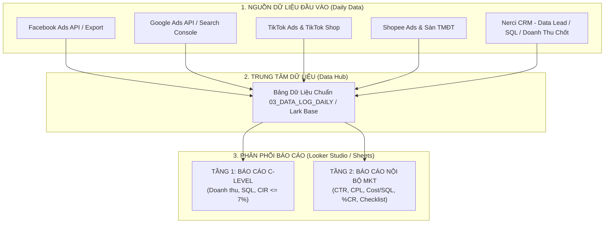

# 📊 ĐỀ XUẤT XÂY DỰNG HỆ THỐNG BÁO CÁO MARKETING H2/2026
*Hệ Sinh Thái Viện Nghiên Cứu Dinh Dưỡng NERCI & H&H Nutrition*

---

> [!abstract] TÓM TẮT ĐỀ XUẤT CHO BAN GIÁM ĐỐC & TRƯỞNG PHÒNG MARKETING
> Nhằm thực thi nghiêm ngặt chỉ đạo của Ban Giám đốc về việc **khóa trần chi phí Marketing $\le 7,0\%$ trên tổng doanh thu** sau khi rà soát kết quả Tháng 7, hệ thống báo cáo Marketing H2/2026 được xây dựng theo mô hình **"2 Tầng Độc Lập - 1 Nguồn Dữ Liệu Duy Nhất"**:
> 1. **Tầng 1 (Executive Dashboard - Toàn Công Ty):** Theo dõi tiến độ Doanh thu, Chi phí Ads, Lead, SQL theo từng Nhãn & Dòng sản phẩm/Bệnh lý; cảnh báo màu tự động khi tỷ lệ $	ext{Cost Ads} / 	ext{Doanh thu} > 7,0\%$.
> 2. **Tầng 2 (Marketing Deep-dive - Nội Bộ MKT):** Đánh giá sức khỏe chiến dịch kỹ thuật (CTR, CPC, CPM, CPL, Cost/SQL, %CR Funnel) và quản trị checklist tối ưu cho từng kênh quảng cáo.
> 3. **File Bảng tính & Nguồn Dữ liệu Chuẩn:** Đã khởi tạo hoàn chỉnh tệp `NERCI_Marketing_Reporting_System_H2_2026.xlsx`, sẵn sàng import vào Google Sheets, Lark Base và Looker Studio.

---

## 🏛️ I. KIẾN TRÚC HỆ THỐNG DỮ LIỆU & BÁO CÁO



---

## 📋 II. CẤU TRÚC 4 TAB TRONG FILE BẢNG TÍNH THỰC THI (`.xlsx`)

Tệp bảng tính chuẩn hóa **`NERCI_Marketing_Reporting_System_H2_2026.xlsx`** đã được cấu hình sẵn 100% công thức tự động, gồm 4 Tab nghiệp vụ:

### 1. Tab `01_DASHBOARD_EXECUTIVE` (Báo Cáo C-Level & Toàn Công Ty)
* **Scorecards Đầu Trang:**
  * Tổng Doanh Thu Thực Tế vs Kế Hoạch (30,0 Tỷ).
  * Chi Phí Ads Thực Tế vs Ngân Sách Trần (2,10 Tỷ).
  * **Tỷ lệ Cost/DT (CIR %):** Cài đặt Conditional Formatting tự động:
    * 🟢 **Xanh ($\le 6,5\%$):** An toàn, hiệu quả cao.
    * 🟡 **Vàng ($6,6\% - 7,0\%$):** Ngưỡng cảnh báo, cần rà soát.
    * 🔴 **Đỏ ($> 7,0\%$):** Vượt trần ➔ Tắt bớt chiến dịch kém hiệu quả trong ngày.
  * Tổng Lead & SQL Thực Tế vs Kế Hoạch.
* **Bảng 1: Tiến Độ Theo Tháng (Tháng 7 - Tháng 12):** Tự động tổng hợp số liệu thực tế từ Data Log và so khớp với định mức trần 7% của từng tháng.
* **Bảng 2: Chi Tiết Theo Nhãn & Dòng Sản Phẩm / Bệnh Lý:**
  * *Đào tạo (NERCI Academy):* Chứng chỉ sơ cấp (CCSC), Tư vấn DD cộng đồng (TVDDCD), Xây dựng thực đơn (XDTD).
  * *Phòng khám Dinh dưỡng 24T:* Bệnh lý Thận, Tư vấn DD Trẻ em, Bệnh lý khác (RLCH, Tuyến giáp...).
  * *Bán lẻ & Dược Dinh dưỡng (H&H):* Y-med Cudo (Thận), CoQ10 & Deprogen, Nhóm Trẻ em & Sữa, Sàn TMĐT.

---

### 2. Tab `02_MKT_INTERNAL_DEEPDIVE` (Báo Cáo Kỹ Thuật Nội Bộ Trưởng Phòng MKT)
* **Ma Trận Đo Lường Kênh Quảng Cáo:** Phân tích đa chiều trên 5 kênh (Facebook Ads, Google Ads, TikTok Ads, Sàn TMĐT, Zalo OA).
* **Các Chỉ Số Sức Khỏe Chiến Dịch (Ad Health Metrics):**
  * `CTR (%)` = Clicks / Impressions (Đánh giá độ hút của Content/Visual).
  * `CPC (đ)` & `CPM (đ)` (Đo lường mức độ cạnh tranh giá thầu).
  * `CPL (đ)` = Spend / Leads (Chi phí tạo 1 Lead thô).
  * `Cost / SQL (đ)` = Spend / SQLs (Chi phí tạo 1 Khách hàng đủ điều kiện).
  * `%CR Funnel` (Lead ➔ SQL và SQL ➔ Đơn hàng).
  * `ROAS` = Doanh thu mang về / Chi phí Ads.
* **Bảng Benchmark Định Mức An Toàn:** Cung cấp khung định mức chuẩn cho từng dòng sản phẩm y tế để Media Buyer căn cứ bật/tắt quảng cáo.

---

### 3. Tab `03_DATA_LOG_DAILY` (Data Source Chuẩn Cho Looker Studio)
* Cấu trúc bảng phẳng (Flat Schema) chuẩn Database:
  * `Date` | `Month` | `Channel` | `Campaign_Type` | `Brand` | `Product_Group` | `Spend_VND` | `Impressions` | `Clicks` | `Leads` | `SQLs` | `Orders` | `Revenue_VND`.
* Đã nạp sẵn dữ liệu mẫu thực tế Tháng 7 và Tháng 8 để làm cơ sở hiển thị biểu đồ ngay lập tức.

---

### 4. Tab `04_ACTION_PLAN_CHECKLIST` (Checklist Tối Ưu Từng Nguồn)
* Quy định chi tiết Definition of Done (DoD), tần suất (Hàng ngày / Hàng tuần / Hàng tháng) và người chịu trách nhiệm (PIC) cho từng kênh:
  * **Facebook Ads:** Kiểm tra CIR hàng ngày; A/B testing 3 Creative mới/tuần; cập nhật tệp Exclude 30 ngày.
  * **Google Ads:** Rà soát Search Terms & Add Negative Keywords hàng tuần; tối ưu tốc độ Landing Page hàng tháng.
  * **Sàn TMĐT:** Khóa trần CIR Shopee Ads $\le 7,5\%$; tối ưu Combo sản phẩm nâng AOV $> 550.000$ đ.
  * **TikTok Ads:** Đẩy Spark Ads từ video chuyên môn Bác sĩ Đặng Ngọc Hùng; duy trì CPL $< 65.000$ đ.
  * **Zalo / CSKH:** Tự động gửi Zalo ZNS nhắc lịch tái khám/tái mua sau 25 ngày, mục tiêu tỷ lệ quay lại $> 25\%$.

---

## 🖥️ III. HƯỚNG DẪN 3 BƯỚC TRIỂN KHAI LÊN LOOKER STUDIO (GOOGLE DATA STUDIO)

### Bước 1: Kết Nối Dữ Liệu
1. Upload file `NERCI_Marketing_Reporting_System_H2_2026.xlsx` lên Google Drive ➔ Mở bằng **Google Sheets**.
2. Truy cập [lookerstudio.google.com](https://lookerstudio.google.com) ➔ Chọn **Create ➔ Report**.
3. Chọn Connector **Google Sheets** ➔ Chọn Sheet **`03_DATA_LOG_DAILY`**.

### Bước 2: Tạo Các Trường Tính Toán (Calculated Fields)
Trong Data Source trên Looker Studio, bấm **Add Field** và tạo 4 công thức cốt lõi:
* **Tỷ lệ Cost/DT (CIR %):**
  ```sql
  SUM(Spend_VND) / SUM(Revenue_VND)
  ```
* **Chi phí per SQL (Cost/SQL):**
  ```sql
  SUM(Spend_VND) / SUM(SQLs)
  ```
* **Tỷ lệ Lead sang SQL (%CR):**
  ```sql
  SUM(SQLs) / SUM(Leads)
  ```
* **ROAS (Hiệu quả Doanh thu / Chi phí):**
  ```sql
  SUM(Revenue_VND) / SUM(Spend_VND)
  ```

### Bước 3: Tạo 2 Trang Dashboard Trực Quan
* **Page 1 (C-Level Executive):**
  * Thêm Scorecards: Total Revenue, Total Spend, CIR %, Total Leads, Total SQLs.
  * Thêm Bảng (Table): Kích thước (Dimension) là `Month` & `Brand`, Chỉ số (Metric) là `Revenue_VND`, `Spend_VND`, `CIR %`, `SQLs`.
  * Cài đặt Conditional Formatting cho cột `CIR %`: Nếu $> 0.07$ tô màu Đỏ; $\le 0.065$ tô màu Xanh.
* **Page 2 (Marketing Operations):**
  * Thêm Bộ lọc (Drop-down filter): `Channel`, `Brand`, `Product_Group`.
  * Thêm Biểu đồ Time Series: Theo dõi diễn biến `CPL` và `Cost per SQL` theo ngày.
  * Thêm Bảng chi tiết: Đánh giá hiệu quả từng Campaign.

---

> [!TIP] KHUYẾN NGHỊ VẬN HÀNH
> * **Chu kỳ cập nhật:** Bộ phận Media Buyer và CSKH cập nhật dữ liệu vào tab `03_DATA_LOG_DAILY` trước **09h00 sáng mỗi ngày**.
> * **Báo cáo định kỳ:**
>   * *Báo cáo Ngày (Lark Group MKT):* Chụp ảnh nhanh Page 2 Looker Studio gửi Trưởng phòng MKT.
>   * *Báo cáo Tuần (Họp Ban Giám Đốc):* Xuất file PDF Page 1 gửi Ban Lãnh đạo trước 17h00 chiều thứ Sáu.
