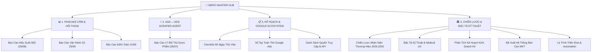

# 🌿 TRUNG TÂM QUẢN TRỊ DỰ ÁN & VẬN HÀNH SỐ NERCI (MASTER HUB)
*Hệ Sinh Thái Viện Nghiên Cứu & Tư Vấn Dinh Dưỡng NERCI & H&H Nutrition*

> 🌐 **Cổng Thông Tin Trực Tuyến (Quartz Digital Garden):** [**nerci.goccuaduong.com**](https://nerci.goccuaduong.com)  
> 🔗 **Lark Base CRM Leads:** [Bitable Table Leads (`tblg4HVuKmLu57CI`)](https://ajpi82edbxhs.jp.larksuite.com/base/AUCebLJ2baYgHXsu9F4jTBnypsc?table=tblg4HVuKmLu57CI)  
> 📊 **Bảng Tính Hệ Thống Báo Cáo:** `NERCI_Marketing_Reporting_System_H2_2026.xlsx`

---

## 🧭 CẤU TRÚC TOÀN DIỆN DỰ ÁN NERCI



---

## 📊 I. HỆ THỐNG BÁO CÁO & KIỂM TOÁN PANCAKE (PCA)
*Quản trị hội thoại, chăm sóc khách hàng và tối ưu phân luồng Lead trên 4 kênh (TikTok Bác sĩ Hùng, Zalo OA Viện NERCI, Web Chat NERCI, Web Chat H&H).*

| Ngày Báo Cáo | Tiêu Đề Báo Cáo Chi Tiết | Phạm Vi Dữ Liệu | Liên Kết Obsidian |
| :---: | :--- | :--- | :--- |
| **25/08/2026** | **Báo Cáo Hiệu Suất Đa Kênh Pancake NERCI — Chu Kỳ 30 Ngày & MTD** *(Mới nhất)* | 4.941 khách hàng mới, 9.953 tương tác, 180 SĐT, SLA từng tư vấn viên | [[2026-08-25-NERCI-Pancake-Omnichannel-Performance-Report]] |
| **24/08/2026** | **Báo Cáo Vận Hành & Tương Tác Khách Hàng Pancake 4 Kênh (22/08 – 23/08/2026)** | Phân tích biến động 2 ngày cuối tuần, phát hiện điểm nghẽn chuyển đổi | [[2026-08-24-PCA-Pancake-Operations-Report-22-23-Aug]] |
| **21/08/2026** | **Báo Cáo Đánh Giá Hiện Trạng & Kiểm Toán Pancake 4 Kênh (21/08/2026)** | Đánh giá tổng thể cấu trúc thẻ gắn, phân quyền tài khoản & quy trình trực chat | [[2026-08-21-PCA-Pancake-Audit-Report]] |

---

## 📢 II. GIÁM SÁT QUẢNG CÁO ĐỐI THỦ DƯỢC PHẨM (ASA-NERCI)
*Theo dõi và phân tích chiến lược Content Angles, Format và phân bổ kênh quảng cáo của 17 đối thủ lớn (Long Châu, Pharmacity, Nutrilite, Nutricare, Thu Cúc, Tâm Anh...).*

- 📊 [[2026-07-28-ASA-NERCI-FB-Detailed-Comparison|Báo Cáo So Sánh Chi Tiết Chiến Dịch Quảng Cáo 17 Fanpage Dược & Dinh Dưỡng (28/07/2026)]]

---

## 📋 III. KẾ HOẠCH VẬN HÀNH & HỆ SINH THÁI GOOGLE
- 📝 [[nerci-probation-checklist-and-google-ecosystem-action-log|Kế Hoạch 60 Ngày Thử Việc & Checklist Chi Tiết Hệ Sinh Thái Google]]
- 🛡️ [[nerci-google-ecosystem-action-log-and-compliance-playbook|Nhật Ký Hành Động Chi Tiết Từng Tài Khoản Google & Playbook Quảng Cáo Y Tế]]
- 🔑 [[nerci-access-and-automation-list|Danh Sách Quyền Truy Cập & Tích Hợp Vận Hành NERCI]]

---

## 🏛️ IV. CHIẾN LƯỢC THƯƠNG HIỆU & ĐẶC TẢ KỸ THUẬT
- 📜 [[nerci-brand-identity-and-ai-automation-master-strategy|Chiến Lược Nhận Diện Thương Hiệu NERCI & Khung Vận Hành AI Automation (2025-2030)]]
- 🏥 [[nerci-advanced-medical-ux-and-automation-spec|Đặc Tả Kỹ Thuật Chuyên Sâu & Medical UX Hệ Sinh Thái Số NERCI]]
- 📈 [[nerci-h2-2026-business-and-mkt-plan-analysis|Phân Tích Kế Hoạch Kinh Doanh & Marketing H2/2026 (Trần Ngân Sách 7%)]]
- 📊 [[nerci-marketing-reporting-system-proposal-and-spec|Đề Xuất Hệ Thống Báo Cáo Marketing Đa Tầng H2/2026]]
- ⏱️ [[nerci-project-timeline-and-automation-roadmap|Lộ Trình Triển Khai Kỹ Thuật & Tự Động Hóa Hệ Sinh Thái]]
- 🗺️ [[nerci-event-style-roadmap|Roadmap Sự Kiện & Lễ Ra Mắt Thương Hiệu NERCI]]

---

## ⚙️ V. KỊCH BẢN AUTOMATION & LỆNH ĐIỀU HÀNH
*Các câu lệnh vận hành nhanh dành cho Agent & Kỹ sư hệ thống:*

```bash
# 1. Sinh Báo Cáo Pancake Mới Nhất
.venv/bin/python scripts/generate_nerci_pancake_report.py

# 2. Chạy Cào Quảng Cáo Đối Thủ ASA-NERCI
.venv/bin/python "01 Projects/ASA-NERCI/run_asa.py"

# 3. Đồng Bộ Toàn Bộ Báo Cáo Lên Website nerci.goccuaduong.com
.venv/bin/python scripts/publish_nerci_wiki.py

# 4. Biên Dịch Catalog & Cập Nhật Index Obsidian
python3 scripts/wiki_tool.py build
```

---
*Ghi chú được cập nhật và duy trì tự động bởi Antigravity AI Agent.*
