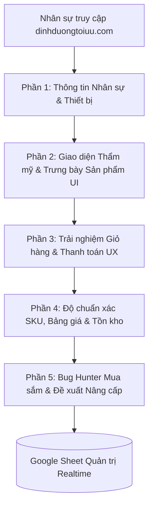

# 🛒 Đặc Tả Khảo Sát & Kiểm Thử Nội Bộ Website Bán Lẻ (dinhduongtoiuu.com)

> 📅 **Thời gian lập kế hoạch & ban hành:** 2026-10-02 08:56:00 (GMT+7)  
> 🕒 **Thời gian cập nhật:** 2026-10-02 09:18:00 (GMT+7)  
> 👤 **Người lập đặc tả:** Lê Đại Dương · Performance & Operations  
> 🏢 **Đơn vị vận hành:** H&H Nutrition & Viện Nghiên Cứu và Tư Vấn Dinh Dưỡng (NERCI)  
> 🌐 **Website kiểm thử:** `https://dinhduongtoiuu.com/` (Website Thương mại Điện tử / Bán lẻ Sản phẩm Dinh dưỡng Y học)  
> 📋 **Google Form Quản Trị Trực Tiếp:** [Biểu mẫu Khảo sát dinhduongtoiuu.com trên Google Forms](https://docs.google.com/forms/d/17TIoIWLTQwcQXYufkYT3bPB6OnrU7ZRkjoPU8uDEDFM/edit)

---

## 🧭 I. ĐỊNH VỊ BẢN CHẤT & NGUYÊN TẮC VẬN HÀNH

Khác với website dịch vụ khám và đào tạo (`nerci.vn`), **`dinhduongtoiuu.com`** là kênh bán lẻ thương mại điện tử (E-Commerce / WooCommerce) trọng điểm của H&H Nutrition, chuyên phân phối các dòng sản phẩm dinh dưỡng y học chuyên biệt:
* Sữa y học bệnh lý: Sữa cho bệnh nhân suy thận (Nepro 1, Nepro 2), ung thư (Supportan, Forticare), tiểu đường, tiêu hóa.
* Thực phẩm bảo vệ sức khỏe & Dinh dưỡng chuyên sâu: ProtiMedic, Canxi Citrate, Cudo Forte, Centrum, vitamin và khoáng chất.
* Dinh dưỡng tăng cân, hồi phục thể trạng cho người lớn và trẻ nhỏ.

### Mục Tiêu Khảo Sát & Kiểm Thử Nội Bộ (Internal UAT):
1. **Trải nghiệm Mua sắm Toàn trình:** Đánh giá tính thuận tiện từ lúc tìm kiếm sản phẩm $\rightarrow$ xem thành phần/hướng dẫn $\rightarrow$ thêm giỏ hàng $\rightarrow$ thanh toán $\rightarrow$ xác nhận đơn.
2. **Độ Chuẩn Xác Dữ Liệu Sản Phẩm:** Rà soát giá niêm yết, giá khuyến mãi, thông tin tồn kho và hướng dẫn sử dụng chuyên môn.
3. **Hiệu Quả Luồng Hỗ Trợ Tư Vấn:** Đánh giá độ tiện lợi của các nút liên hệ Hotline, Zalo OA, Chat tư vấn Dược sĩ trước khi khách chốt mua.
4. **Săn Lỗi Kỹ Thuật E-Commerce (Bug Hunter):** Bóc tách các lỗi gãy link sản phẩm (404), lỗi không cập nhật giỏ hàng, lỗi tính sai phí vận chuyển hoặc lỗi hiển thị trên thiết bị di động.

---

## 📊 II. MA TRẬN 15 TIÊU CHÍ KHẢO SÁT CHUẨN E-COMMERCE

---

### PHẦN 1: THÔNG TIN NHÂN SỰ & THIẾT BỊ KIỂM THỬ (3 CÂU)

#### Câu 1: Họ và tên nhân sự
* **Loại câu hỏi:** Văn bản ngắn (Short text)
* **Bắt buộc:** Có (`Required: true`)
* **Mục đích:** Ghi nhận người báo cáo để đội ngũ kỹ thuật tiện đối chiếu khi xử lý lỗi giỏ hàng / đơn hàng.

#### Câu 2: Khối phòng ban công tác
* **Loại câu hỏi:** Trắc nghiệm 1 lựa chọn (Multiple Choice)
* **Bắt buộc:** Có (`Required: true`)
* **Các lựa chọn:**
  1. `Khối Dược sĩ & Chuyên môn Dinh dưỡng`
  2. `Khối Tư vấn Bán hàng, Telesales & CSKH`
  3. `Khối Kho vận, Đóng gói & Xử lý Đơn hàng`
  4. `Khối Marketing, E-Commerce & Media`
  5. `Khối Kỹ thuật Web, IT & Vận hành`
  6. `Ban Giám đốc / Quản lý`

#### Câu 3: Thiết bị kiểm thử chính
* **Loại câu hỏi:** Trắc nghiệm 1 lựa chọn (Multiple Choice)
* **Bắt buộc:** Có (`Required: true`)
* **Các lựa chọn:** `Điện thoại iPhone (iOS)` | `Điện thoại Android` | `Máy tính / Laptop` | `Cả hai thiết bị`

---

### PHẦN 2: ĐÁNH GIÁ GIAO DIỆN & TRƯNG BÀY SẢN PHẨM (UI/MERCHANDISING) (3 CÂU)

#### Câu 4: Thẩm mỹ & Nhận diện thương hiệu bán lẻ y tế
* **Nội dung:** Giao diện website `dinhduongtoiuu.com` có toát lên được sự uy tín, chính hãng, chuyên nghiệp và đúng chuẩn thương hiệu bán lẻ dinh dưỡng y học của H&H Nutrition không?
* **Thang điểm:** Tuyến tính 1 - 5 (`1 = Kém, thiếu chuyên nghiệp` $\longleftrightarrow$ `5 = Rất đẹp, chuyên nghiệp chuẩn y khoa`)

#### Câu 5: Phân loại danh mục & Trưng bày sản phẩm
* **Nội dung:** Danh mục sản phẩm (phân chia theo Bệnh lý: Thận, Ung thư, Tiểu đường, Tiêu hóa; theo Đối tượng: Trẻ em, Người lớn...) có khoa học, trực quan và dễ tiếp cận không?
* **Thang điểm:** Tuyến tính 1 - 5 (`1 = Rất khó tìm, rối mắt` $\longleftrightarrow$ `5 = Rất khoa học, dễ tìm thấy sản phẩm`)

#### Câu 6: Tốc độ tải trang & Xem chi tiết sản phẩm
* **Nội dung:** Tốc độ tải trang chủ, danh mục sản phẩm và trang chi tiết sản phẩm khi lướt web trên thiết bị của Anh/Chị:
* **Thang điểm:** Tuyến tính 1 - 5 (`1 = Rất chậm, giật lag` $\longleftrightarrow$ `5 = Cực kỳ nhanh, mượt mà`)

---

### PHẦN 3: TRẢI NGHIỆM GIỎ HÀNG, ĐẶT HÀNG & THANH TOÁN (E-COMMERCE UX) (3 CÂU)

#### Câu 7: Đánh giá thao tác Thêm giỏ hàng & Quy trình Đặt hàng (Checkout)
* **Nội dung:** Khi Anh/Chị thử nghiệm bấm "Thêm vào giỏ hàng" hoặc "Mua ngay", điền thông tin người nhận và tiến hành thanh toán, trải nghiệm thực tế như thế nào?
* **Lựa chọn:**
  1. `Rất mượt mà, dễ thao tác, các bước rõ ràng`
  2. `Quy trình còn nhiều bước rườm rà, gây phân vân cho khách`
  3. `Gặp lỗi giỏ hàng không nhận sản phẩm / không bấm thanh toán được`
  4. `Chưa thử nghiệm tính năng này`

#### Câu 8: Độ minh bạch về Phí vận chuyển & Phương thức thanh toán
* **Nội dung:** Các phương thức thanh toán (COD nhận hàng trả tiền, Chuyển khoản QR ngân hàng) và chính sách tính phí vận chuyển hiển thị có rõ ràng, minh bạch không?
* **Lựa chọn:**
  1. `Rất rõ ràng, dễ hiểu`
  2. `Chưa rõ ràng cách tính phí ship hoặc thông tin thanh toán chuyển khoản`
  3. `Gặp lỗi khi chọn phương thức thanh toán`

#### Câu 9: Nút liên hệ tư vấn Dược sĩ trước khi mua
* **Nội dung:** Các nút tiện ích liên hệ nhanh (Hotline bán lẻ, Chat Zalo OA, Chat Messenger/Pancake) hiển thị trên trang sản phẩm:
* **Lựa chọn:**
  1. `Bố trí nổi bật, tiện lợi khi khách cần tư vấn liều lượng trước khi chốt đơn`
  2. `Vị trí nút che khuất nút "Mua ngay" hoặc gây vướng víu trên di động`
  3. `Có nút bị gãy link hoặc không chuyển tiếp đúng nhân sự trực chat`

---

### PHẦN 4: ĐỘ CHUẨN XÁC DỮ LIỆU SẢN PHẨM & TỒN KHO (CATALOG INTEGRITY) (3 CÂU)

#### Câu 10: Độ chính xác về Giá bán, Khuyến mãi & Tồn kho
* **Nội dung:** Dưới góc nhìn nghiệp vụ của Anh/Chị, giá bán lẻ niêm yết, các chương trình giảm giá/combo và trạng thái còn hàng/hết hàng trên web đã chuẩn xác theo chính sách của H&H chưa?
* **Thang điểm:** Tuyến tính 1 - 5 (`1 = Còn sai lệch nhiều` $\longleftrightarrow$ `5 = Rất chuẩn xác và đồng bộ`)

#### Câu 11: Nội dung mô tả sản phẩm, thành phần & Hướng dẫn y khoa
* **Nội dung:** Thông tin thành phần dinh dưỡng, công dụng, đối tượng sử dụng và hướng dẫn dùng thuốc/sữa trên từng sản phẩm có đầy đủ, chuẩn y khoa và dễ hiểu không?
* **Thang điểm:** Tuyến tính 1 - 5 (`1 = Sơ sài/Thiếu hướng dẫn` $\longleftrightarrow$ `5 = Rất đầy đủ, chuẩn chuyên môn`)

#### Câu 12: Báo cáo sai lệch dữ liệu sản phẩm cụ thể
* **Nội dung:** Nếu phát hiện sản phẩm nào bị sai giá, sai ảnh, sai mô tả hoặc chưa cập nhật tồn kho, Anh/Chị vui lòng ghi rõ tên sản phẩm / link bài viết và nội dung cần sửa:
* **Loại câu hỏi:** Đoạn văn bản dài (Paragraph Text - Tùy chọn)

---

### PHẦN 5: BÁO CÁO LỖI KỸ THUẬT & ĐỀ XUẤT PHÁT TRIỂN E-COMMERCE (3 CÂU)

#### Câu 13: Đánh giá độ sẵn sàng đẩy mạnh bán hàng (E-Commerce Readiness)
* **Nội dung:** Anh/Chị chấm điểm mức độ hoàn thiện của website `dinhduongtoiuu.com` để chính thức chạy chiến dịch quảng cáo và truyền thông bán hàng rầm rộ:
* **Thang điểm:** Tuyến tính 1 - 10 (`1 = Chưa sẵn sàng, còn nhiều lỗi` $\longleftrightarrow$ `10 = Rất xuất sắc, sẵn sàng bùng nổ doanh số`)

#### Câu 14: Săn lỗi kỹ thuật Mua hàng (Bug Hunter)
* **Nội dung:** BÁO CÁO LỖI MUA HÀNG (BUG HUNTER): Anh/Chị có phát hiện lỗi nào không? *(Gãy link 404, giỏ hàng không lưu sản phẩm, tính sai tiền ship, chữ tràn viền trên điện thoại, v.v. - Vui lòng mô tả chi tiết kèm link)*:
* **Loại câu hỏi:** Đoạn văn bản dài (Paragraph Text - Tùy chọn)

#### Câu 15: Ý tưởng nâng cấp trải nghiệm mua sắm
* **Nội dung:** Đề xuất sáng tạo & Tính năng bán hàng mong muốn: Anh/Chị mong muốn website bổ sung thêm tính năng gì để tăng tỷ lệ chốt đơn và giữ chân khách hàng? *(Ví dụ: Mua sắm định kỳ tự động giao hàng tháng, tích điểm thành viên, gợi ý combo sản phẩm cùng liệu trình, v.v.)*:
* **Loại câu hỏi:** Đoạn văn bản dài (Paragraph Text - Tùy chọn)

---

## ⚡ III. QUẢN TRỊ BIỂU MẪU & LIÊN KẾT GOOGLE SHEET

Biểu mẫu chính thức đã được thiết lập trực tiếp tại Google Drive:
* 📝 **Link Quản trị Google Form:** [docs.google.com/forms/d/17TIoIWLTQwcQXYufkYT3bPB6OnrU7ZRkjoPU8uDEDFM/edit](https://docs.google.com/forms/d/17TIoIWLTQwcQXYufkYT3bPB6OnrU7ZRkjoPU8uDEDFM/edit)
* 📊 **Đồng bộ Google Sheets:** Toàn bộ phản hồi khi nhân sự gửi bài sẽ tự động đổ về Google Sheet liên kết trong tab **"Câu trả lời" (Responses)** của biểu mẫu.
* 💾 **Mã Nguồn Sao Lưu Nội Bộ:** Lưu trữ tại `01 Projects/NERCI-Automation/scripts/create_google_form_nerci_survey.js`.

---

## 🔗 Nguồn Trích Dẫn & Liên Kết Nội Bộ
* [[ke-hoach-chuan-hoa-va-dong-bo-sku-dinhduongtoiuu-pancake]] — Kế hoạch chuẩn hóa & đồng bộ SKU bán lẻ hệ thống `dinhduongtoiuu.com`.
* [[nerci-master-project-hub]] — Trung tâm điều phối dự án & vận hành đa kênh NERCI & H&H Nutrition.
