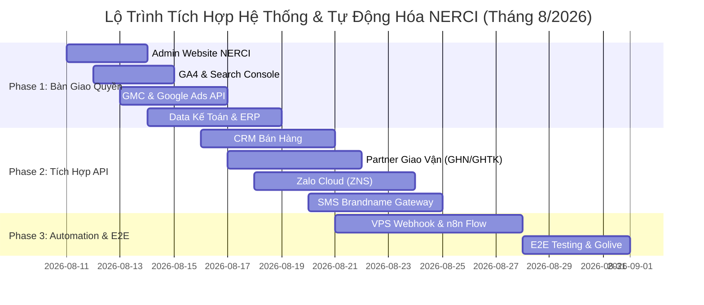

# 📅 NERCI PROJECT TIMELINE & AUTOMATION ROADMAP 2026

> 🔗 **Lark Sheet Link (Tệp Kế Hoạch Đầy Đủ):** [NERCI - Danh Sách Quyền Truy Cập & Tích Hợp Vận Hành](https://ajpi82edbxhs.jp.larksuite.com/sheets/F7Qus3hllhw3ovtQPs3jhCOWppg)  
> 📌 *Dữ liệu đã được nạp trực tiếp vào tab **`Timeline Kế Hoạch`** trong Lark Sheet.*

---

### 📊 1. SƠ ĐỒ TIẾN ĐỘ DỰ ÁN (MERMAID GANTT CHART)

---

### 📋 2. CHI TIẾT MOCKUP TIMELINE & PHÂN CÔNG NHÂN SỰ

| STT | Hạng Mục Công Việc | Bộ Phận | Nhân Sự Phụ Trách (Mockup) | Ngày BD | Ngày KT | Trạng Thái | Ưu Tiên | Đầu Ra Kỹ Thuật (Deliverables) |
| :---: | :--- | :--- | :--- | :---: | :---: | :---: | :---: | :--- |
| **1** | Tiếp nhận Admin Web NERCI | IT / Dev Web | Nguyễn Văn A (IT Lead) | 11/08 | 13/08 | 🔵 Đang xin quyền | **P0** | API Key kết nối Landing Page & giỏ hàng |
| **2** | Cấu hình GA4 & Search Console | Marketing / IT | Trần Thị B (Data Lead) | 12/08 | 14/08 | 🟡 Chờ bàn giao | **P0** | GA4 Property ID, E-commerce & UTM Tracking |
| **3** | GMC Feed & Google Ads API | Marketing / Ecom | Đại Dương (Performance) | 13/08 | 16/08 | ⚪ Chưa bắt đầu | **P1** | Content API sync tồn kho/giá real-time cho PMax |
| **4** | Trích xuất Data Kế Toán / ERP | Kế Toán / IT | Lê Văn C (Kế toán trưởng) | 14/08 | 18/08 | ⚪ Chưa bắt đầu | **P0** | SQL Database View / Auto CSV bóc tách LTV |
| **5** | Tích hợp CRM Bán Hàng | Cửa Hàng / IT | Phạm Thị D (CRM Specialist) | 16/08 | 20/08 | ⚪ Chưa bắt đầu | **P1** | Webhook đẩy Lead tự động cho Telesale |
| **6** | Kết nối Giao Vận (GHN/GHTK) | Logistics / Ops | Hoàng Văn E (Ops Lead) | 17/08 | 21/08 | ⚪ Chưa bắt đầu | **P1** | Auto tạo đơn & cập nhật mã vận đơn qua API |
| **7** | Kích hoạt Zalo Cloud (ZNS) | Marketing / CSKH | Vũ Thị F (CSKH Lead) | 18/08 | 23/08 | ⚪ Chưa bắt đầu | **P0** | Auto gửi tin nhắn ZNS xác nhận & CSKH |
| **8** | Cấu hình SMS Brandname | Marketing / CSKH | Đỗ Văn G (Digital Marketer) | 20/08 | 24/08 | ⚪ Chưa bắt đầu | **P2** | OTP & SMS dự phòng khi khách không dùng Zalo |
| **9** | Dựng VPS Webhook & n8n Flow | Technical Lead | Đại Dương (Automation) | 21/08 | 27/08 | ⚪ Chưa bắt đầu | **P0** | Webhook Server 24/7 + n8n Workflow trung gian |
| **10** | E2E Testing & Golive | Toàn Đội Ngũ | Đại Dương & Team NERCI | 28/08 | 31/08 | ⚪ Chưa bắt đầu | **P0** | Golive toàn bộ hệ thống Automation NERCI |

---

### 💡 3. QUY TRÌNH VẬN HÀNH DỮ LIỆU TỰ ĐỘNG (AUTOMATION ARCHITECTURE)

1. **Khách hàng phát sinh giao dịch trên Web / Lead Quảng cáo:**
   - Webhook đẩy thông tin trực tiếp về **VPS Server (Python Receiver / n8n)**.
2. **Xử lý dữ liệu trung gian & Phân luồng:**
   - Tự động tạo đơn hàng trên **CRM / Phần mềm bán hàng**.
   - Tự động tạo đơn giao vận trên hệ thống **Đối Tác Giao Vận (GHN / GHTK / ViettelPost)**.
3. **Chăm sóc & Thông báo tự động:**
   - Bắn tin **ZNS (Zalo)** xác nhận đơn hàng + mã vận đơn cho khách hàng.
   - Nếu không có Zalo, hệ thống tự động fallback qua **SMS Brandname**.
4. **Đối soát & Báo cáo Real-time:**
   - Dữ liệu bán hàng & doanh thu được tự động trích xuất từ Kế toán, kết hợp với chi phí quảng cáo từ Google Ads API để xuất báo cáo ROAS / LTV tự động lên **Lark Sheet Dashboard**.

---
*Tài liệu kế hoạch được cập nhật tự động cho dự án NERCI.*
