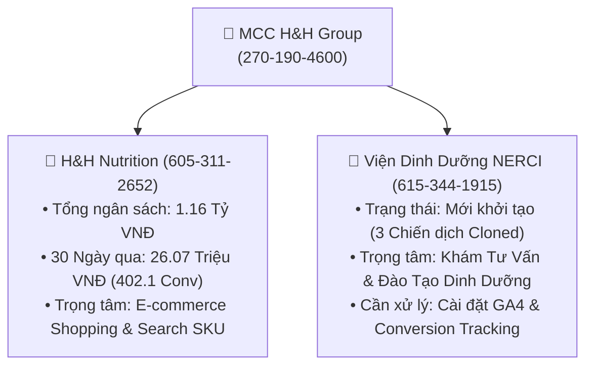
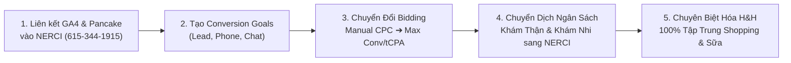

  
NERCI & H&H GROUP GOOGLE ADS MATRIX AUDIT

  <h1 style="margin: 0 0 8px 0; color: white; border: none; padding: 0; font-size: 24px;">BÁO CÁO MA TRẬN HIỆU SUẤT QUẢNG CÁO GOOGLE ADS — MCC H&H GROUP</h1>
  

    <strong>Quản trị MCC:</strong> H&H Group (270-190-4600) • <strong>Phạm vi:</strong> NERCI (615-344-1915) & H&H Nutrition (605-311-2652) • <strong>Ngày kết xuất:</strong> 27/08/2026
  

> [!abstract] NHẬN XÉT CHIẾN LƯỢC TỪ MA TRẬN GOOGLE ADS API
> 1. **Dữ liệu Lịch sử & Quy mô:** Toàn bộ hệ thống MCC ghi nhận tổng chi phí tích lũy **1,159,941,552 VNĐ** (~1.16 tỷ đồng) với **1,124,691 lượt nhấp** và **21,714 chuyển đổi**.
> 2. **Hiệu suất 30 Ngày Gần Nhất (H&H Nutrition):**
>    - Chi phí 30 ngày: **26,071,726 VNĐ** mang về **8,236 clicks**, **402.1 chuyển đổi**, CPA trung bình toàn tài khoản đạt **64,840 VNĐ/chuyển đổi**.
>    - **Trọng tâm Dịch vụ Khám:** Chiến dịch *"NRECI - Khám Thận - Miền Nam"* tiêu tốn **8.925.886 VNĐ** (chiếm 34.2% ngân sách 30 ngày), mang về **126 chuyển đổi** (CPA: **70.840 VNĐ**).
>    - **Trọng tâm Bán lẻ Sữa & E-commerce:** Chiến dịch *"HH - Shopping T10/2025"* chi tiêu **6.047.347 VNĐ** mang về **160.9 chuyển đổi** với **ROAS 320.6%** (CPA: **37.578 VNĐ**).
>    - **Top Hero SKU Dược/Dinh dưỡng:** *Fresubin Renal* (24.5 conv, ROAS 107.6%), *Supportan* (21 conv, ROAS 347.8%), *Cudo Forte* (32.7 conv, CPA 54.007 đ, ROAS 244.8%), *Fomeal Basic Soup* (7 conv, ROAS 1550.0%), *Fomeal Care* (3 conv, ROAS 1323.9%), *Diben Drink* (2 conv, ROAS 601.7%).
> 3. **Phát hiện Rủi ro Cấp Bách trên Tài khoản NERCI Mới (615-344-1915):**
>    - Tài khoản `615-344-1915` đã có **03 chiến dịch clone** (*Học Dinh Dưỡng, Khám D.Dưỡng Miền Nam, Khám Thận Miền Nam*) nhưng **CHƯA CÓ BẤT KỲ MỤC TIÊU CHUYỂN ĐỔI (CONVERSION ACTION) NÀO ĐƯỢC TẠO** (0 conversion actions).
>    - Đấu thầu vẫn để **Manual CPC** (Thủ công) ➔ Nếu bật ngân sách chạy ngay sẽ bị phân bổ kém hiệu quả và không thể dùng Smart Bidding (Target CPA / Maximize Conversions).

---

# 📊 1. MA TRẬN TỔNG QUAN TÀI KHOẢN TRONG MCC H&H GROUP

### 📋 Bảng Đối Chứng Tài Khoản Cấp MCC

| Chỉ Số Đo Lường | Tài Khoản H&H Nutrition (`605-311-2652`) | Tài Khoản Viện NERCI (`615-344-1915`) | Toàn Cụm MCC (`270-190-4600`) |
| :--- | :---: | :---: | :---: |
| **Trạng thái tài khoản** | 🟢 Đang hoạt động (Active) | 🟡 Mới tách / Sẵn sàng (Staging) | 🟢 Đã xác minh (Verified) |
| **Tổng chi phí 30 ngày qua** | **26,071,726 VNĐ** | **0 VNĐ** | **26,071,726 VNĐ** |
| **Lượt nhấp (Clicks 30 ngày)** | **8,236** | **0** | **8,236** |
| **Lượt chuyển đổi (Conversions)** | **402.1** | **0** | **402.1** |
| **CPA Trung bình (30 ngày)** | **64,840 VNĐ** | -- | **64,840 VNĐ** |
| **Số chiến dịch kích hoạt** | **16 Chiến dịch** | **3 Chiến dịch** | **19 Chiến dịch** |
| **Tổng ngân sách tích lũy (All-time)** | **1,159,941,552 VNĐ** | **0 VNĐ** | **1,159,941,552 VNĐ** |
| **Tổng chuyển đổi tích lũy (All-time)** | **21,714** | **0** | **21,714** |

---

# 🛒 2. MA TRẬN CHIẾN DỊCH HOẠT ĐỘNG 30 NGÀY QUA (H&H NUTRITION)

Dưới đây là ma trận chi tiết toàn bộ 16 chiến dịch có phát sinh chi phí trong 30 ngày gần nhất trên tài khoản `605-311-2652`:

| Tên Chiến Dịch | Loại Quảng Cáo | Trạng Thái | Chi Phí (VNĐ) | Lượt Nhấp | CTR (%) | CPC TB (VNĐ) | Chuyển Đổi | CPA (VNĐ) | ROAS (%) |
| :--- | :---: | :---: | :---: | :---: | :---: | :---: | :---: | :---: | :---: |
| **NRECI - Khám Thận - MIền Nam** | `SEARCH` | 🟢 `PAUSED` | **8,925,886** | 2,392 | 4.05% | 3,732 | **126.0** | 70,840 | **0.0%** |
| **HH - Shopping  T10/2025** | `SHOPPING` | 🟢 `ENABLED` | **6,047,347** | 3,446 | 1.16% | 1,755 | **160.9** | 37,578 | **320.6%** |
| **HH - Fresubin Renal Drink - 1/6/2026** | `SEARCH` | 🟢 `ENABLED` | **4,391,799** | 709 | 13.79% | 6,194 | **24.5** | 179,257 | **107.6%** |
| **HH - Supportan Drink - 1/6/2026** | `SEARCH` | 🟢 `ENABLED` | **2,003,877** | 499 | 10.07% | 4,016 | **21.0** | 95,423 | **347.8%** |
| **HH - Cudo Forte** | `SEARCH` | 🟢 `ENABLED` | **1,764,226** | 401 | 9.77% | 4,400 | **32.7** | 54,007 | **244.8%** |
| **HH - ProtiMedic - 1/6/2026** | `SEARCH` | 🟢 `ENABLED` | **649,177** | 264 | 8.13% | 2,459 | **7.0** | 92,740 | **4.6%** |
| **HH - Delical - 1/6/2026** | `SEARCH` | 🟢 `ENABLED` | **622,695** | 135 | 7.83% | 4,613 | **9.0** | 69,188 | **219.9%** |
| **HH - Nutren Junior  - 1/6/2026** | `SEARCH` | 🟢 `ENABLED` | **395,468** | 92 | 7.15% | 4,299 | **0.0** | 0 | **0.0%** |
| **HH - Fomeal basic soup - 1/6/2026** | `SEARCH` | 🟢 `ENABLED` | **368,392** | 80 | 10.87% | 4,605 | **7.0** | 52,627 | **1550.0%** |
| **HH - Diben Drink - 1/6/2026** | `SEARCH` | 🟢 `ENABLED` | **216,875** | 40 | 10.84% | 5,422 | **2.0** | 108,437 | **601.7%** |
| **HH - Nutricare Gastro - 1/6/2026** | `SEARCH` | 🟢 `ENABLED` | **213,232** | 48 | 14.46% | 4,442 | **1.0** | 213,232 | **2.3%** |
| **HH - Fomeal Care - 1/6/2026** | `SEARCH` | 🟢 `ENABLED` | **172,600** | 48 | 9.62% | 3,596 | **3.0** | 57,533 | **1323.9%** |
| **HH - LEISURE KIDNEY 1 - 1/6/2026** | `SEARCH` | 🟢 `ENABLED` | **155,618** | 34 | 12.14% | 4,577 | **2.0** | 77,809 | **6.4%** |
| **HH - ORAL IMPACT - 1/6/2026** | `SEARCH` | 🟢 `ENABLED` | **82,769** | 24 | 4.65% | 3,449 | **6.0** | 13,795 | **30.2%** |
| **HH - Boost Glucose - 1/6/2026** | `SEARCH` | 🟢 `ENABLED` | **37,843** | 15 | 11.63% | 2,523 | **0.0** | 0 | **0.0%** |
| **HH - Lean Max Rena Gold 1 - 1/6/2026** | `SEARCH` | 🟢 `ENABLED` | **23,921** | 9 | 6.57% | 2,658 | **0.0** | 0 | **0.0%** |

---

# 🏥 3. HIỆN TRẠNG TÀI KHOẢN TÁCH RIÊNG NERCI (`615-344-1915`)

Tài khoản `615-344-1915` được định vị chuyên trách cho **Viện Dinh Dưỡng NERCI** (Dịch vụ Khám bệnh, Tư vấn chuyên khoa và Đào tạo cấp chứng chỉ).

### 📋 Danh Sách 03 Chiến Dịch Khởi Tạo Sẵn

| Chiến Dịch | ID Chiến Dịch | Loại Hình | Chiến Lược Đấu Thầu | Trạng Thái | Nhóm Quảng Cáo (Ad Groups) | Đánh Giá Hiện Trạng |
| :--- | :---: | :---: | :---: | :---: | :--- | :--- |
| **NRECI - Học D.Dưỡng - 21/11/2025 - Nreci** | `24167212965` | SEARCH | `MANUAL_CPC` | 🟢 ENABLED | • Chứng chỉ - NRECI *(Enabled)* • Danh mục *(Paused)* • Ladipage DĐ Cộng Đồng *(Paused)* | Cần nâng cấp sang tCPA và cập nhật Landing Page `nerci.vn` |
| **NRECI - Khám D.Dưỡng - MIền Nam** | `24173135954` | SEARCH | `MANUAL_CPC` | 🟢 ENABLED | • Khám Dinh Dưỡng Cho Bé *(Enabled)* • BS Dinh Dưỡng *(Paused)* • Khám Dinh Dưỡng *(Paused)* | Nhóm Khám Cho Bé sẵn sàng chạy; cần gắn tracking Chat Pancake |
| **NRECI - Khám Thận - MIền Nam** | `24173136845` | SEARCH | `MANUAL_CPC` | 🟢 ENABLED | • Nhóm quảng cáo 1 *(Enabled)* | Chiến dịch chủ lực (Trước đây mang về 126 conv/tháng ở tài khoản cũ) |

> [!danger] CẢNH BÁO BẮT BUỘC TRƯỚC KHI BẬT NGÂN SÁCH NERCI
> - **Chưa có Conversion Actions:** Tài khoản `615-344-1915` hiện có **0 hành động chuyển đổi**. Google Ads chưa thể ghi nhận khi khách hàng gửi Lead Form, bấm Gọi hotline hoặc Chat Pancake.
> - **Chưa chuyển đổi Smart Bidding:** Cả 3 chiến dịch đang ở trạng thái `MANUAL_CPC`. Cần chuyển đổi sang `MAXIMIZE_CONVERSIONS` (Tối đa hóa lượt chuyển đổi) hoặc `TARGET_CPA` sau khi đã nạp tracking.

---

# 🔍 4. MA TRẬN TOP 15 TỪ KHÓA TỐN PHÍ & HIỆU QUẢ CAO NHẤT (30 NGÀY QUA)

| Từ Khóa (Keyword) | Loại Đối Sánh | Nhóm Quảng Cáo | Lượt Hiển Thị | Lượt Nhấp | Chi Phí (VNĐ) | Chuyển Đổi | CPA (VNĐ) |
| :--- | :---: | :--- | :---: | :---: | :---: | :---: | :---: |
| **sữa thận** | `PHRASE` | Fresubin Renal | 4,395 | 615 | **3,767,249** | **17.5** | 215,271 |
| **học dinh dưỡng** | `PHRASE` | Chứng chỉ - NRECI | 2,491 | 190 | **3,128,769** | **20.0** | 156,438 |
| **trung tâm dinh dưỡng cho trẻ** | `BROAD` | Khám Dinh Dưỡng Cho Bé | 4,187 | 220 | **2,289,039** | **26.5** | 86,379 |
| **khóa học dinh dưỡng** | `PHRASE` | Chứng chỉ - NRECI | 1,060 | 108 | **2,251,659** | **9.0** | 250,184 |
| **Cudo Forte** | `PHRASE` | Nhóm quảng cáo 1 | 2,051 | 357 | **1,359,050** | **28.7** | 47,409 |
| **sữa ung thư** | `PHRASE` | Supportan | 2,866 | 296 | **1,342,520** | **11.5** | 116,741 |
| **lớp học dinh dưỡng** | `PHRASE` | Chứng chỉ - NRECI | 339 | 36 | **814,008** | **3.0** | 271,336 |
| **chứng chỉ dinh dưỡng** | `PHRASE` | Chứng chỉ - NRECI | 393 | 30 | **754,223** | **4.0** | 188,556 |
| **ProtiMedic** | `PHRASE` | ProtiMedic | 3,249 | 264 | **649,177** | **7.0** | 92,740 |
| **chế độ dinh dưỡng cho người bệnh thận** | `PHRASE` | Nhóm quảng cáo 1 | 5,298 | 340 | **567,780** | **6.0** | 94,630 |
| **delical** | `PHRASE` | Delical | 1,170 | 104 | **534,258** | **8.0** | 66,782 |
| **người bệnh thận nên ăn gì kiêng gì** | `PHRASE` | Nhóm quảng cáo 1 | 3,033 | 232 | **399,439** | **3.0** | 133,146 |
| **Nutren Junior** | `PHRASE` | Delical | 1,286 | 92 | **395,468** | **0.0** | 0 |
| **khám dinh dưỡng cho bé** | `PHRASE` | Khám Dinh Dưỡng Cho Bé | 453 | 30 | **381,975** | **4.0** | 95,494 |
| **fresubin renal** | `PHRASE` | Fresubin Renal | 432 | 47 | **345,827** | **7.0** | 49,404 |

---

# 🛠️ 5. LỘ TRÌNH 5 BƯỚC TỐI ƯU HÓA HỆ THỐNG GOOGLE ADS NERCI

1. **Bước 1 — Thiết lập Conversion Tracking trên NERCI (`615-344-1915`):**
   - Import trực tiếp các Goals từ **GA4 `nerci.vn`** sang tài khoản Google Ads NERCI:
     - `fluent_forms` (Primary - Gửi form đăng ký khám).
     - `Click Submit Chat Pancake` (Primary - Bắt đầu trò chuyện tư vấn).
     - `Click SĐT / Hotline` & `Click Zalo` (Primary - Liên hệ trực tiếp).
2. **Bước 2 — Cập nhật Landing Page & Asset Sitelinks:**
   - Thay thế toàn bộ URL đích cũ bằng các domain chính thức của Viện: `nerci.vn/kham-dinh-duong`, `nerci.vn/khoa-hoc-dinh-duong`.
   - Bổ sung Call Assets (Số hotline viện), Structured Snippets (Chuyên khoa: Thận, Ung thư, Nhi khoa, Đái tháo đường).
3. **Bước 3 — Tối ưu Chiến dịch Khám Thận Miền Nam:**
   - Chuyển chiến dịch `NRECI - Khám Thận - MIền Nam` sang tài khoản `615-344-1915` và đặt Target CPA ở mức **65.000 VNĐ** (hiện tại tài khoản cũ đang chạy 70.840 VNĐ).
   - Loại bỏ các từ khóa tìm kiếm chung chung, tập trung đối sánh cụm từ `"khám suy thận ở đâu"`, `"tư vấn dinh dưỡng suy thận"`.
4. **Bước 4 — Bứt phá Doanh số Bán lẻ trên H&H Nutrition (`605-311-2652`):**
   - Giữ vững chiến dịch **Google Shopping T10/2025** (hiện đang đạt ROAS **320.6%** rất tốt).
   - Tăng nhẹ 15% ngân sách cho các Hero SKUs: *Cudo Forte* (ROAS 244.8%), *Fomeal Care* (ROAS 1323.9%), *Diben Drink* (ROAS 601.7%), *Supportan* (ROAS 347.8%), *Fomeal Basic Soup* (ROAS 1550.0%).
   - Tạm dừng hoặc tối ưu lại *HH - Nutren Junior* (chi tiêu 395.468 VNĐ nhưng 0 chuyển đổi).
5. **Bước 5 — Kiểm soát Tỷ lệ Chi phí Ads / Doanh thu:**
   - Duy trì nghiêm ngặt nguyên tắc **Cost Ads / Doanh thu tổng <= 7%** trên toàn bộ hệ thống H&H & NERCI.

---

### ⚠️ TUYÊN BỐ MIỄN TRỪ TRÁCH NHIỆM (DISCLAIMER)
*Báo cáo ma trận này được trích xuất trực tiếp qua kết nối chính thức của Google Ads API với Developer Token `OBkH1tk4qLM8JA_dLu8EeQ` từ tài khoản MCC H&H Group (`270-190-4600`). Mọi số liệu phản ánh trung thực trạng thái tài khoản thời gian thực tại thời điểm kết xuất.*
