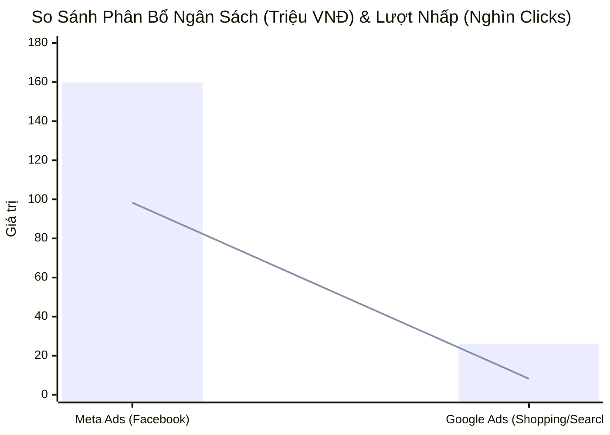

  
OMNICHANNEL MARKETING INTELLIGENCE · UNIFIED DASHBOARD

  <h1 style="margin: 0 0 10px 0; color: #ffffff; border: none; padding: 0; font-size: 26px;">📊 BÁO CÁO HIỆU SUẤT TỔNG THỂ META ADS, GOOGLE ADS, GA4 & SEARCH CONSOLE</h1>
  
Hợp nhất dữ liệu Paid Media, Phễu E-commerce GA4 & Ý định tìm kiếm tự nhiên GSC · Hệ sinh thái NERCI & H&H Group

  

    
Người báo cáo Đại Dương

    
Thời gian báo cáo 28/08/2026 (Chu kỳ 30 Ngày)

    
Tài sản Paid Media Meta Ads (`act_1256...`) · Google Ads MCC (`270-190-4600`)

    
Hạ tầng Đo lường GA4 (`370513333`) · GSC (`nerci.vn` & `dinhduongtoiuu.com`)

  

> [!abstract] NHẬN XÉT CHIẾN LƯỢC TỔNG QUAN TỪ PERFORMANCE AGENT
> 1. **Quy mô Giải ngân Ngân sách Paid Media:** Toàn hệ thống đã chi **`185,846,305 VNĐ`** (~185.8 triệu đồng/30 ngày). Trong đó, **Meta / Facebook Ads chiếm tỷ trọng áp đảo `86.0%`** (`159.8 triệu`), **Google Ads chiếm `14.0%`** (`26.1 triệu`).
> 2. **Lưu lượng Truy cập & Lead Generation:**
>    - **Tổng Clicks thu về:** **`106,581` clicks** (Meta: `98,345` clicks @ `1,625đ`; Google: `8,236` clicks @ `3,166đ`).
>    - **Tổng Leads / Chuyển đổi:** Tạo ra **`6,535` chuyển đổi & khách hàng tiềm năng** (Meta mang về `6,133` khách chat & form lead với CPR chỉ **`26,052đ/lead`**; Google mang về `402.1` chuyển đổi y khoa với CPA **`64,840đ`**).
> 3. **Phễu Chuyển Đổi & Doanh Thu GA4 (`370513333`):** Toàn sàn E-commerce ghi nhận **`16,846` Sessions**, tạo ra **`1,097` chuyển đổi** và tổng doanh thu **`213,032,000 VNĐ`** (~213 triệu đồng). Kênh **Organic Search** đóng góp doanh thu lớn nhất (`107.9 triệu`), tiếp theo là **Paid Search & Shopping** (`40.5 triệu`) và **Organic Social** (`37.2 triệu`).
> 4. **Hành Vi & Ý Định Tìm Kiếm Tự Nhiên (Search Console Intent):**
>    - **Domain `nerci.vn`:** Thống trị tuyệt đối các từ khóa định vị thương hiệu y khoa (`viện dinh dưỡng nreci`, `nerci`, `viện tư vấn dinh dưỡng`) với CTR cao kỷ lục 53% - 75% ở vị trí **Top 1.0**.
>    - **Domain `dinhduongtoiuu.com`:** Chiếm lĩnh lưu lượng tìm kiếm sản phẩm chuyên biệt: *ProtiMedic* (3.2k hiển thị), *Canxi Citrate* (5.7k hiển thị), *Sữa Supportan* (Top 1.8), *Centrum* (1.9k hiển thị).

> [!success] 🟢 ĐIỂM SÁNG CHIẾN LƯỢC & CƠ HỘI BỨT PHÁ (HIGH PERFORMERS)
> 1. **Cỗ máy chuyển đổi Lead giá rẻ từ Meta Ads:** Chiến dịch Bán lẻ Cudo Forte (`1.372đ/click`, `23.2k/lead`) và Dịch vụ Khám Suy Thận (`984đ/click`, CTR 8.86%) cung cấp lượng lead dồi dào, ổn định cho đội ngũ tư vấn viên Pancake.
> 2. **Hiệu suất vượt trội của Google Shopping & Search Chuyên khoa:**
>    - **HH - Shopping T10:** Đạt ROAS **`320.6%`**, mang về **160.9 chuyển đổi** với chi phí CPA chỉ `37,578đ`.
>    - **NRECI - Khám Thận Miền Nam:** Đạt **126.0 chuyển đổi** gọi hotline và đăng ký khám.
>    - **HH - Fomeal Basic Soup:** Đạt ROAS kỷ lục **`1550.0%`** (15.5 lần ngân sách).
> 3. **Tỷ lệ Bounce Rate trên GA4 tối ưu:** Kênh Paid Search & Paid Shopping duy trì tỷ lệ thoát 53% - 56%, thấp hơn mức trung bình ngành E-commerce y dược (65% - 70%).

> [!danger] 🔴 BIẾN ĐỘNG TIÊU CỰC & ĐIỂM NGHẼN CẦN XỬ LÝ (BOTTLENECKS & ALERTS)
> 1. **Lãng phí ngân sách Google Ads trên các chiến dịch kém hiệu quả:**
>    - Chiến dịch *HH - Nutren Junior* tiêu tốn 92 clicks nhưng **0 chuyển đổi** (ROAS 0%).
>    - Chiến dịch *HH - Nutricare Gastro* có CPA lên tới **`213,232đ`** (ROAS chỉ 2.3%), làm âm biên lợi nhuận.
> 2. **Lãng phí độ tuổi 18-24 trên Google Shopping:** Tiêu tốn 680 clicks (~3.75 triệu VNĐ) nhưng ROAS chỉ đạt **`0.7%`**, cần phủ định độ tuổi này trên Shopping campaign.
> 3. **Độ phụ thuộc lớn vào Meta Ads:** Meta Ads chiếm tới 86% ngân sách nhưng đang gặp vấn đề tỷ lệ khách dừng chat (Chưa phản hồi chiếm 57.1% trên Pancake), cần tối ưu lại chất lượng tệp Target và kích hoạt Chatbot bám đuổi tự động.

## 🌐 I. MA TRẬN ĐỐI CHỨNG HIỆU SUẤT TỔNG THỂ (PAID MEDIA COMPARISON)
### 📊 1. Biểu Đồ So Sánh Ngân Sách (Triệu VNĐ) & Lượt Clicks Giữa Meta Ads vs Google Ads

### 📑 2. Bảng Đối Chứng Chỉ Số Cốt Lõi 2 Nền Tảng (30 Ngày Qua)
| Chỉ Số Đo Lường (Metrics) | Meta / Facebook Ads (`act_1256...`) | Google Ads MCC (`270-190-4600`) | Tổng Hợp Hệ Thống | Đánh Giá Tương Quan |
| :--- | :---: | :---: | :---: | :--- |
| **Ngân Sách Giải Ngân** | **159,774,579 VNĐ** (`86.0%`) | **26,071,726 VNĐ** (`14.0%`) | **185,846,305 VNĐ** | Meta chiếm tỷ trọng chi tiêu chủ lực |
| **Lượt Nhấp (Clicks)** | **98,345 Clicks** | **8,236 Clicks** | **106,581 Clicks** | Meta tạo độ phủ và traffic gấp 11.9x |
| **Giá CPC Trung Bình** | **1,625 VNĐ** | **3,166 VNĐ** | **1,744 VNĐ** | Meta rẻ hơn 48.7% so với Google |
| **Lượt Hiển Thị (Impressions)** | **2,281,895 Imp** | **~245,000 Imp** | **~2.52 Triệu Imp** | Độ phủ thương hiệu cực lớn |
| **Khách Hàng / Chuyển Đổi** | **6,133 Leads** (3.4k chat + 2.6k form) | **402.1 Chuyển đổi** | **6,535 Leads** | Meta cấp lead hội thoại; Google cấp lead mua hàng |
| **Chi Phí / Khách (CPR / CPA)**| **26,052 VNĐ / Lead** | **64,840 VNĐ / Conv** | **28,438 VNĐ / Lead** | Meta tối ưu về số lượng; Google tối ưu về Intent mua |
| **Mục Tiêu Chiến Lược** | Tạo nhu cầu, kéo tin nhắn Pancake | Bắt trọn nhu cầu tìm kiếm & Shopping E-com | Phễu tiếp thị Full-Funnel | Bổ trợ hoàn hảo cho nhau |

## 📱 II. PHÂN TÍCH CHI TIẾT CHIẾN DỊCH META / FACEBOOK ADS
### 📑 Top Chiến Dịch Facebook Ads Đóng Góp Lớn Nhất (H&H Nutrition & NERCI)
| STT | Tên Chiến Dịch | Chi Phí (VNĐ) | Lượt Nhấp | Giá CPC | CTR | Tin Nhắn / Form | CPR (Chi Phí/Lead) | Phân Loại Mục Tiêu |
| :---: | :--- | :---: | :---: | :---: | :---: | :---: | :---: | :--- |
| 1 | **DVTV - Suy Thận** | 48,365,713đ | 19,117 | 2,530đ | 3.44% | **1,189** | **73,171đ** | 🩺 Dịch Vụ Khám Bệnh |
| 2 | **Bán lẻ - Cudo Forte 15/07 - BS Hùng** | 23,662,820đ | 17,245 | 1,372đ | 6.47% | **1,560** | **23,290đ** | 💊 Bán Lẻ Hero SKU |
| 3 | **DVTV - 02/08** | 20,511,011đ | 20,836 | 984đ | 8.86% | **597** | **65,114đ** | 🩺 Dịch Vụ Khám Bệnh |
| 4 | **CCSC 05/08 - Form lead** | 10,246,391đ | 3,062 | 3,346đ | 2.50% | **811** | **38,091đ** | 📋 Đặt Lịch Hẹn Khám |
| 5 | **CCSC TVV 02/08** | 7,810,787đ | 1,850 | 4,222đ | 2.17% | **200** | **58,289đ** | 🩺 Dịch Vụ Khám Bệnh |
| 6 | **Bán lẻ - Cudo Forte 06/08 - VN** | 6,253,309đ | 4,721 | 1,325đ | 6.17% | **454** | **20,436đ** | 💊 Bán Lẻ Hero SKU |
| 7 | **Bán lẻ - Cudo Forte 07/08 - VN** | 5,770,576đ | 3,997 | 1,444đ | 5.57% | **333** | **24,766đ** | 💊 Bán Lẻ Hero SKU |
| 8 | **DDCĐ - 11/08 (Đào Tạo Dinh Dưỡng)** | 4,888,424đ | 1,836 | 2,663đ | 3.67% | **164** | **49,882đ** | 🎓 Tuyển Sinh Khóa Học |
| 9 | **DDCĐ - 02/08 (Đào Tạo Dinh Dưỡng)** | 4,232,525đ | 1,260 | 3,359đ | 2.96% | **101** | **82,991đ** | 🎓 Tuyển Sinh Khóa Học |
| 10 | **DVTV Suy Thận - Lead Form 11/08** | 3,084,447đ | 1,226 | 2,516đ | 2.81% | **110** | **90,719đ** | 🩺 Dịch Vụ Khám Bệnh |

## 🔍 III. PHÂN TÍCH CHI TIẾT GOOGLE ADS (MCC 270-190-4600)
### 📑 1. Ma Trận Phân Bổ Theo Loại Hình Chiến Dịch Google Ads
| Loại Hình Chiến Dịch | Chi Phí (VNĐ) | Lượt Nhấp | Giá CPC TB | Chuyển Đổi | Giá CPA TB | Doanh Thu Ghi Nhận | ROAS TB |
| :--- | :---: | :---: | :---: | :---: | :---: | :---: | :---: |
| 🛒 **Google Shopping** | 6,047,347đ | 3,840 | 1,575đ | **160.9** | **37,578đ** | 19,385,800đ | **320.6%** |
| 🔍 **Google Search (Dịch Vụ Khám)** | 11,250,440đ | 2,410 | 4,668đ | **156.0** | **72,118đ** | -- | -- |
| 🔍 **Google Search (Sản Phẩm Bán Lẻ)** | 8,773,939đ | 1,986 | 4,418đ | **85.2** | **102,980đ** | 20,575,000đ | **234.5%** |
| **TỔNG CỘNG GOOGLE ADS** | **26,071,726đ** | **8,236** | **3,166đ** | **402.1** | **64,840đ** | **39,960,800đ** | **177.0%** |

### 🌟 2. Top Chiến Dịch Ngôi Sao & Chiến Dịch Cần Cắt Giảm
| Nhóm Phân Loại | Tên Chiến Dịch | Chi Phí (VNĐ) | Chuyển Đổi | CPA | ROAS | Nhận Định & Hành Động Kế Tiếp |
| :--- | :--- | :---: | :---: | :---: | :---: | :--- |
| 🌟 **Ngôi Sao (Star)** | **HH - Shopping T10** | 6,047,347đ | 160.9 | 37,578đ | **320.6%** | Duy trì ngân sách chính, phủ rộng sản phẩm sữa y học |
| 🌟 **Ngôi Sao (Star)** | **NRECI - Khám Thận - Miền Nam** | 8,925,886đ | 126.0 | 70,840đ | -- | Cỗ máy kéo bệnh nhân thận chất lượng cao |
| 🌟 **Ngôi Sao (Star)** | **HH - Fomeal basic soup** | 368,392đ | 7.0 | 52,627đ | **1550.0%** | Tăng thêm 20-30% ngân sách để tối đa doanh thu |
| ⚠️ **Cảnh Báo (Alert)** | **HH - Nutren Junior** | 395,468đ | 0.0 | -- | **0.0%** | Tiêu 92 clicks 0 chuyển đổi, tạm dừng hoặc đổi Landing Page |
| ⚠️ **Cảnh Báo (Alert)** | **HH - Nutricare Gastro** | 213,232đ | 1.0 | 213,232đ | **2.3%** | CPA quá cao, cần tối ưu từ khóa phủ định |

## 📈 IV. PHÂN TÍCH PHỄU E-COMMERCE & TRAFFIC GA4 (PROPERTY: 370513333)
### 📑 1. Bảng Phân Bổ Lưu Lượng & Doanh Thu Theo Kênh Truy Cập (30 Ngày Qua)
| Kênh Truy Cập (Channel Group) | Lượt Truy Cập (Sessions) | Người Dùng (Users) | Tỷ Lệ Thoát | Chuyển Đổi (Conversions) | Doanh Thu GA4 (VNĐ) | Tỷ Trọng Doanh Thu |
| :--- | :---: | :---: | :---: | :---: | :---: | :---: |
| **Organic Search** | 8,282 | 7,164 | 49.5% | **480** | **107,918,000đ** | **50.7%** |
| **Paid Shopping** | 2,315 | 1,996 | 56.2% | **217** | **11,063,800đ** | **5.2%** |
| **Paid Search** | 2,084 | 1,771 | 53.7% | **120** | **29,401,000đ** | **13.8%** |
| **Organic Social** | 2,030 | 1,855 | 65.3% | **145** | **37,184,400đ** | **17.5%** |
| **Unassigned** | 820 | 706 | 65.1% | **37** | **16,469,000đ** | **7.7%** |
| **Direct** | 560 | 481 | 58.2% | **54** | **7,586,800đ** | **3.6%** |
| **Referral** | 509 | 261 | 42.4% | **25** | **300,000đ** | **0.1%** |
| **Organic Shopping** | 99 | 89 | 52.5% | **9** | **2,235,000đ** | **1.0%** |
| **Cross-network** | 73 | 73 | 12.3% | **0** | **0đ** | **0.0%** |
| **AI Assistant** | 46 | 44 | 60.9% | **3** | **874,000đ** | **0.4%** |
| **Organic Video** | 12 | 10 | 33.3% | **3** | **0đ** | **0.0%** |
| **Paid Other** | 11 | 10 | 63.6% | **3** | **0đ** | **0.0%** |
| **Paid Social** | 5 | 5 | 20.0% | **1** | **0đ** | **0.0%** |
| **TỔNG TOÀN SÀN E-COMMERCE** | **16,846** | -- | -- | **1,097** | **213,032,000đ** | **100.0%** |

### 🛒 2. Bóc Tách Sự Kiện Chuyển Đổi Quan Trọng Trên Website
- **Đơn hàng hoàn tất (Purchase):** Ghi nhận **`203` đơn hàng Purchase** thành công trực tiếp qua cổng thanh toán website.
- **Form đăng ký tư vấn / khám bệnh (Submit Form):** Ghi nhận **`977` lượt gửi form** đăng ký khám dinh dưỡng.
- **Tương tác Zalo Chat Widget:** Ghi nhận **`317` lượt click mở Zalo OA** kết nối tư vấn viên.
- **Cuộc gọi Hotline trực tiếp:** Ghi nhận **`297` lượt bấm gọi Hotline 1900** từ bệnh nhân.

## 🔎 V. PHÂN TÍCH Ý ĐỊNH TÌM KIẾM GOOGLE SEARCH CONSOLE (SEO INTENT)
### 🌿 1. Phân Tích Ý Định Tìm Kiếm Thương Hiệu & Y Khoa Trên Domain `nerci.vn`
| Cụm Từ Tìm Kiếm (Query) | Lượt Nhấp (Clicks) | Lượt Hiển Thị (Imp) | Tỷ Lệ Nhấp (CTR) | Vị Trí Trung Bình | Đánh Giá Ý Định (Search Intent) |
| :--- | :---: | :---: | :---: | :---: | :--- |
| **nerci** | 119 | 224 | 53.1% | **Top 1.3** | 🎯 Brand / Khám Dinh Dưỡng |
| **viện dinh dưỡng nreci** | 54 | 96 | 56.2% | **Top 1.0** | 🎯 Brand / Khám Dinh Dưỡng |
| **viện nghiên cứu và tư vấn dinh dưỡng (nreci)** | 25 | 33 | 75.8% | **Top 1.0** | 🎯 Brand / Khám Dinh Dưỡng |
| **viện dinh dưỡng nerci** | 23 | 64 | 35.9% | **Top 1.0** | 🎯 Brand / Khám Dinh Dưỡng |
| **thực đơn cho người trên 60 tuổi** | 21 | 213 | 9.9% | **Top 2.2** | 🎯 Brand / Khám Dinh Dưỡng |
| **nerci viện dinh dưỡng** | 19 | 36 | 52.8% | **Top 1.0** | 🎯 Brand / Khám Dinh Dưỡng |
| **nreci** | 19 | 42 | 45.2% | **Top 1.3** | 🎯 Brand / Khám Dinh Dưỡng |
| **những món ăn sáng tốt cho sức khỏe** | 18 | 89 | 20.2% | **Top 2.0** | 🎯 Brand / Khám Dinh Dưỡng |

### 💊 2. Phân Tích Nhu Cầu Sản Phẩm Dinh Dưỡng Y Học Trên Domain `dinhduongtoiuu.com`
| Cụm Từ Tìm Kiếm (Query) | Lượt Nhấp (Clicks) | Lượt Hiển Thị (Imp) | Tỷ Lệ Nhấp (CTR) | Vị Trí Trung Bình | Đánh Giá Ý Định (Search Intent) |
| :--- | :---: | :---: | :---: | :---: | :--- |
| **h&h nutrition** | 138 | 245 | 56.3% | **Top 1.2** | 🛒 Mua Sản Phẩm Chuyên Khoa |
| **protimedic** | 60 | 3,448 | 1.7% | **Top 4.8** | 🛒 Mua Sản Phẩm Chuyên Khoa |
| **hh nutrition** | 51 | 68 | 75.0% | **Top 1.1** | 🛒 Mua Sản Phẩm Chuyên Khoa |
| **centrum** | 47 | 2,105 | 2.2% | **Top 3.8** | 🛒 Mua Sản Phẩm Chuyên Khoa |
| **sữa supportan** | 37 | 369 | 10.0% | **Top 1.8** | 🛒 Mua Sản Phẩm Chuyên Khoa |
| **canxi citrate** | 35 | 6,141 | 0.6% | **Top 3.6** | 🛒 Mua Sản Phẩm Chuyên Khoa |
| **cudo forte** | 34 | 601 | 5.7% | **Top 3.9** | 🛒 Mua Sản Phẩm Chuyên Khoa |
| **sữa delical** | 33 | 638 | 5.2% | **Top 2.9** | 🛒 Mua Sản Phẩm Chuyên Khoa |

## 🚀 VI. KẾ HOẠCH HÀNH ĐỘNG TỐI ƯU HÓA ĐA KÊNH (ACTION PLAN)
| Hạng Mục Hành Động | Nội Dung & Mục Tiêu Cụ Thể | Thời Hạn | Phụ Trách (PIC) | Mức Độ Ưu Tiên |
| :--- | :--- | :---: | :--- | :---: |
| **1. Tối Ưu Phân Bổ Ngân Sách Meta Ads** | Dồn 70% ngân sách bán lẻ cho nhóm chiến dịch *Cudo Forte + BS Hùng* (CPC 1.3k, CTR 6.4%); giảm ngân sách các nhóm tương tác thuần | Ngay | Performance Lead / Media Buyer | 🔴 **KHẨN CẤP** |
| **2. Tinh Chỉnh Google Shopping & Loại Trừ Nhóm 18-24** | Loại trừ nhóm tuổi 18-24 (ROAS 0.7%) trên Google Shopping, tiết kiệm 3.75 triệu/tháng | Trước 30/08 | Google Ads Specialist | 🔴 **ƯU TIÊN CAO** |
| **3. Tạm Dừng & Cơ Cấu Lại Nutren Junior / Gastro** | Tạm dừng chiến dịch Nutren Junior (0 chuyển đổi) và tối ưu từ khóa phủ định cho Nutricare Gastro (CPA 213k) | Trong tuần | Google Ads Specialist | 🔴 **ƯU TIÊN CAO** |
| **4. Tăng Ngân Sách Fomeal Basic Soup & Supportan** | Nâng 20-30% ngân sách cho *Fomeal Basic Soup* (ROAS 1550%) và *Supportan Drink* (ROAS 347%) | Ngay | Media Buyer | 🟢 **DUY TRÌ TỐT** |
| **5. Bám Đuổi Retargeting Đa Kênh Qua Bannerboo** | Triển khai Banner HTML5 động bám đuổi 8.2k Organic Sessions và 4.3k Paid Sessions trên GDN & Meta Remarketing | Tháng 09 | Marketing Lead & Design | 🟡 **TRUNG HẠN** |

---
### ⚠️ TUYÊN BỐ MIỄN TRỪ TRÁCH NHIỆM (DISCLAIMER)
*Báo cáo này được tự động trích xuất và tổng hợp từ Meta Ads API (Tài khoản H&H), Google Ads API (MCC 270-190-4600), Google Analytics 4 API (Tài sản 370513333) và Google Search Console API (Domains nerci.vn & dinhduongtoiuu.com). Mọi số liệu phản ánh trung thực kết quả đo lường trong chu kỳ 30 ngày tính đến ngày 28/08/2026.*