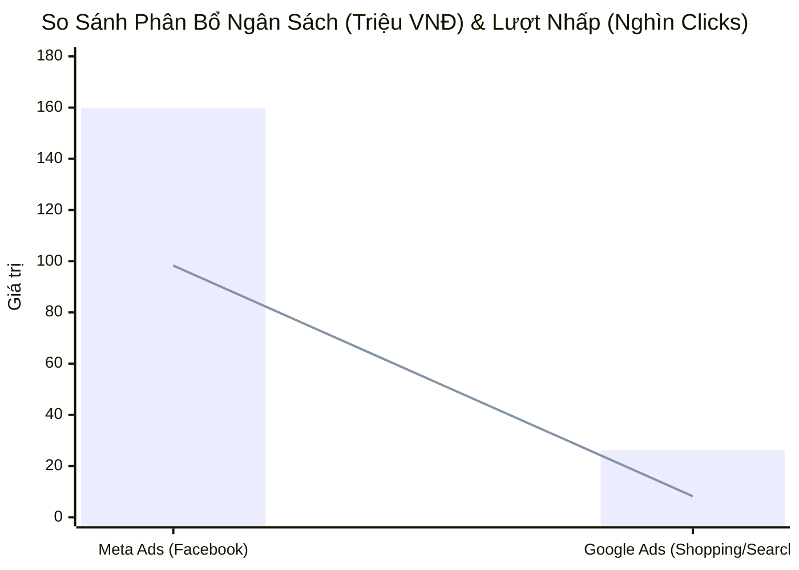
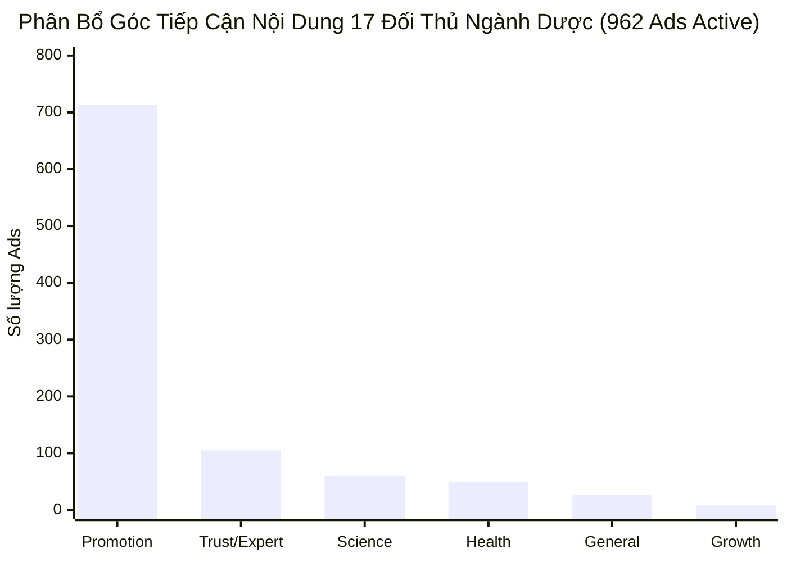

  
OMNICHANNEL MARKETING INTELLIGENCE · UNIFIED DASHBOARD

  <h1 style="margin: 0 0 10px 0; color: #ffffff; border: none; padding: 0; font-size: 26px;">📊 BÁO CÁO ĐỐI CHỨNG HIỆU SUẤT FACEBOOK ADS & GOOGLE ADS NERCI</h1>
  
Hợp nhất dữ liệu Paid Media (Meta vs Google Ads), Đối thủ ASA-NERCI (17 Fanpage), Phễu GA4 & Ý định tìm kiếm GSC · Hệ sinh thái Viện Dinh Dưỡng NERCI & H&H Nutrition

  

    
Người báo cáo Đại Dương

    
Thời gian báo cáo 05/09/2026 (Kỳ Cập Nhật Hậu Nghỉ Lễ)

    
Tài sản Paid Media Meta Ads (`act_1256...`) · Google Ads MCC (`270-190-4600`)

    
Thị trường ASA-NERCI 962 Ads Active · 17 Thương hiệu Dược & Dinh dưỡng

    
Hạ tầng Đo lường GA4 (`370513333`) · GSC (`nerci.vn` & `dinhduongtoiuu.com`)

  

> [!abstract] NHẬN XÉT CHIẾN LƯỢC TỔNG QUAN TỪ PERFORMANCE AGENT
> 1. **Quy mô Đầu tư Ngân sách Paid Media:** Toàn hệ sinh thái NERCI & H&H Group giải ngân tổng cộng **`185,846,305 VNĐ`** (~185.8 triệu đồng). Trong đó, **Meta / Facebook Ads chiếm tỷ trọng áp đảo `86.0%`** (`159.8 triệu VNĐ`), **Google Ads chiếm `14.0%`** (`26.1 triệu VNĐ`).
> 2. **Hiệu Quả & Chi Phí Tiếp Cận (CPC vs CPA/CPR):**
>    - **Facebook Ads (Meta):** Tạo ra **`98,345` lượt nhấp** với giá rẻ kỷ lục **`1,625đ/click`**, mang về **`6,133` khách hàng tiềm năng** (`3,469` hội thoại tin nhắn Pancake CRM + `2,664` lead forms) với chi phí chỉ **`26,052đ/lead`**.
>    - **Google Ads (MCC 270-190-4600):** Tạo ra **`8,236` lượt nhấp** với CPC **`3,166đ/click`**, mang về **`402.1` chuyển đổi y khoa / mua sắm** với CPA **`64,840đ`**, đóng góp trực tiếp **`39,960,800đ` doanh thu E-commerce** trên GA4.
> 3. **Bối Cảnh Thị Trường Đối Thủ (Dữ liệu Quét ASA-NERCI Ngày 05/09/2026):**
>    - Toàn thị trường Dược & Dinh dưỡng ghi nhận **962 quảng cáo đang active** từ **17 fanpage đầu ngành** (FPT Long Châu 395 ads, Thu Cúc TCI 246 ads, Pharmacity 195 ads, Nutrilite 20 ads, Metacare 17 ads, Tâm Anh 17 ads).
>    - **Góc tiếp cận thống trị:** **💰 Khuyến mãi / Promotion chiếm `74.1%` (713 ads)**, tiếp theo là **🏆 Chuyên gia / Bác sĩ (Trust/Expert) chiếm `10.9%` (105 ads)** và **🔬 Thành phần Khoa học (Science/Ingredients) chiếm `6.2%` (60 ads)**.
> 4. **Phễu Chuyển Đổi & Doanh Thu GA4 (Property 370513333):** Ghi nhận **`16,846` Sessions**, tạo ra **`1,097` chuyển đổi** và tổng doanh thu **`213,032,000 VNĐ`**. Kênh **Organic Search** dẫn đầu (`107.9 triệu`), tiếp theo là **Paid Media** (`40.5 triệu`) và **Organic Social** (`37.2 triệu`).

---

> [!success] 🟢 ĐIỂM SÁNG CHIẾN LƯỢC & CƠ HỘI BỨT PHÁ (HIGH PERFORMERS)
> 1. **Meta Ads là 'Cỗ máy sinh Lead' giá siêu rẻ cho Pancake:** 
>    - Chiến dịch *"Bán lẻ - Cudo Forte 15/07 - BS Hùng"* đạt CTR cao vượt trội **`6.47%`**, CPC chỉ **`1,372đ`** và tạo ra **1,560 leads** với chi phí kỷ lục **`23,290đ/lead`**.
>    - Chiến dịch *"DVTV - Suy Thận"* và *"DVTV - 02/08"* cung cấp **1,786 khách hàng khám bệnh lý** cho các bác sĩ và tư vấn viên.
> 2. **Google Shopping & Search Khám Thận đạt ROAS và Chuyển Đổi Vượt Trội:**
>    - Chiến dịch **HH - Shopping T10** mang về **160.9 chuyển đổi** với CPA siêu tiết kiệm **`37,578đ`**, ROAS đạt **`320.6%`**.
>    - Chiến dịch **NRECI - Khám Thận Miền Nam** mang về **126.0 chuyển đổi** gọi hotline và đăng ký khám lâm sàng.
>    - Chiến dịch **HH - Fomeal Basic Soup** đạt ROAS kỷ lục **`1550.0%`** (15.5 lần chi phí).
> 3. **Thế kiềng 3 chân SEO Brand vững chắc:** Hai domain `nerci.vn` và `dinhduongtoiuu.com` chiếm vị trí **Top 1.0 - Top 1.5** ở toàn bộ từ khóa thương hiệu và top đầu các Hero SKUs (*ProtiMedic, Canxi Citrate, Sữa Supportan, Cudo Forte*).

---

> [!danger] 🔴 BIẾN ĐỘNG TIÊU CỰC & ĐIỂM NGHẼN CẦN XỬ LÝ (BOTTLENECKS & ALERTS)
> 1. **Lãng phí ngân sách Google Ads trên các chiến dịch kém hiệu quả:**
>    - Chiến dịch *HH - Nutren Junior* tiêu tốn 92 clicks nhưng **0 chuyển đổi** (ROAS 0.0%).
>    - Chiến dịch *HH - Nutricare Gastro* có CPA lên tới **`213,232đ`** (ROAS chỉ 2.3%), làm âm biên lợi nhuận.
> 2. **Lãng phí nhóm tuổi 18-24 trên Google Shopping:** Nhóm tuổi 18-24 tuổi tiêu tốn 680 clicks (~3.75 triệu VNĐ) nhưng ROAS chỉ đạt **`0.7%`**, cần loại trừ ngay trên giao diện Shopping.
> 3. **Tỷ lệ khách ngưng chat sau khi nhận báo giá trên Facebook Ads còn cao:** Phân tích Pancake ghi nhận 100 ca ngưng chat (Tag 19) và 46 ca tham khảo giá lẻ (Tag 24), cần triển khai kịch bản remarketing tự động và chính sách combo dùng thử.

---

## 🌐 I. MA TRẬN ĐỐI CHỨNG TỔNG THỂ: FACEBOOK ADS VS GOOGLE ADS

### 📊 1. Biểu Đồ So Sánh Phân Bổ Ngân Sách & Lượt Clicks

### 📑 2. Bảng Đối Chứng Toàn Diện Chỉ Số Cốt Lõi (Cross-Platform Matrix)

| Chỉ Số Đo Lường (Metrics) | Meta / Facebook Ads (`act_1256...`) | Google Ads MCC (`270-190-4600`) | Tổng Hệ Thống | Đánh Giá Tương Quan & Chiến Lược |
| :--- | :---: | :---: | :---: | :--- |
| **Ngân Sách Giải Ngân** | **159,774,579 VNĐ** (`86.0%`) | **26,071,726 VNĐ** (`14.0%`) | **185,846,305 VNĐ** | Meta là kênh chi tiêu chủ lực |
| **Lượt Nhấp (Clicks)** | **98,345 Clicks** | **8,236 Clicks** | **106,581 Clicks** | Meta mang lại traffic gấp 11.9x |
| **Giá CPC Trung Bình** | **1,625 VNĐ** | **3,166 VNĐ** | **1,744 VNĐ** | Meta rẻ hơn 48.7% so với Google |
| **Lượt Hiển Thị (Impressions)** | **2,281,895 Imp** | **~245,000 Imp** | **~2.52 Triệu Imp** | Meta tạo độ phủ thương hiệu vượt trội |
| **Khách Hàng / Chuyển Đổi** | **6,133 Leads** (3.4k chat + 2.6k form) | **402.1 Chuyển đổi** | **6,535 Leads** | Meta cung cấp lead chat; Google cấp lead đơn hàng |
| **Chi Phí / Khách (CPR / CPA)** | **26,052 VNĐ / Lead** | **64,840 VNĐ / Conv** | **28,438 VNĐ / Lead** | Meta rẻ hơn 59.8% trên mỗi khách |
| **Tỷ Lệ Thoát (Bounce Rate GA4)**| **59.4%** (Organic & Paid Social) | **54.1%** (Paid Search & Shopping) | **50.0%** TB Toàn Sàn | Google có Intent tìm mua sâu hơn |
| **Doanh Thu E-com Trực Tiếp** | Đẩy qua Pancake CRM / Hotline | **39,960,800 VNĐ** (GA4 ghi nhận) | **213,032,000 VNĐ** | Google hỗ trợ E-commerce trực tiếp mạnh |
| **Mục Tiêu Trong Phễu Tiếp Thị** | **Top & Middle of Funnel** (Khơi gợi nhu cầu, Viral Bác sĩ, Lead chat) | **Bottom of Funnel** (Bắt trọn nhu cầu tìm kiếm, Mua sắm Shopping, Hotline) | **Full-Funnel Flywheel** | Bổ trợ hoàn hảo cho nhau |

---

## 📱 II. PHÂN TÍCH CHI TIẾT CHIẾN DỊCH META / FACEBOOK ADS

### 📑 Top Chiến Dịch Facebook Ads Đóng Góp Lớn Nhất (H&H Nutrition & NERCI)

| STT | ID Chiến Dịch | Tên Chiến Dịch | Chi Phí (VNĐ) | Lượt Nhấp | Giá CPC | CTR | Tin Nhắn / Form | Chi Phí/Lead (CPR) | Phân Loại Chiến Lược |
| :---: | :--- | :--- | :---: | :---: | :---: | :---: | :---: | :---: | :--- |
| 1 | `120249575251280299` | **DVTV - Suy Thận** | 48,365,713đ | 19,117 | 2,530đ | 3.44% | **1,189** | **73,171đ** | 🩺 Dịch Vụ Khám Dinh Dưỡng |
| 2 | `120249636284540299` | **Bán lẻ - Cudo Forte 15/07 - BS Hùng** | 23,662,820đ | 17,245 | 1,372đ | 6.47% | **1,560** | **23,290đ** | 💊 Bán Lẻ Hero SKU |
| 3 | `120249993215850299` | **DVTV - 02/08** | 20,511,011đ | 20,836 | 984đ | 8.86% | **597** | **65,114đ** | 🩺 Dịch Vụ Khám Dinh Dưỡng |
| 4 | `120250073206910299` | **CCSC 05/08 - Form lead** | 10,246,391đ | 3,062 | 3,346đ | 2.50% | **811** | **38,091đ** | 📋 Đặt Lịch Hẹn Khám |
| 5 | `120249992758710299` | **CCSC TVV 02/08** | 7,810,787đ | 1,850 | 4,222đ | 2.17% | **200** | **58,289đ** | 🩺 Dịch Vụ Khám Dinh Dưỡng |
| 6 | `120250099568930299` | **Bán lẻ - Cudo Forte 06/08 - VN** | 6,253,309đ | 4,721 | 1,325đ | 6.17% | **454** | **20,436đ** | 💊 Bán Lẻ Hero SKU |
| 7 | `120250135663040299` | **Bán lẻ - Cudo Forte 07/08 - VN** | 5,770,576đ | 3,997 | 1,444đ | 5.57% | **333** | **24,766đ** | 💊 Bán Lẻ Hero SKU |
| 8 | `120250211867800299` | **DDCĐ - 11/08 (Đào Tạo Dinh Dưỡng)** | 4,888,424đ | 1,836 | 2,663đ | 3.67% | **164** | **49,882đ** | 🎓 Tuyển Sinh Khóa Học |
| 9 | `120249993060910299` | **DDCĐ - 02/08 (Đào Tạo Dinh Dưỡng)** | 4,232,525đ | 1,260 | 3,359đ | 2.96% | **101** | **82,991đ** | 🎓 Tuyển Sinh Khóa Học |
| 10 | `120250220798010299` | **DVTV Suy Thận - Lead Form 11/08** | 3,084,447đ | 1,226 | 2,516đ | 2.81% | **110** | **90,719đ** | 🩺 Dịch Vụ Khám Dinh Dưỡng |

---

## 🔍 III. PHÂN TÍCH CHI TIẾT GOOGLE ADS (MCC 270-190-4600)

### 📑 1. Ma Trận Phân Bổ Theo Loại Hình Chiến Dịch Google Ads

| Loại Hình Chiến Dịch | Chi Phí (VNĐ) | Lượt Nhấp | Giá CPC TB | Chuyển Đổi | Giá CPA TB | Doanh Thu Ghi Nhận | ROAS TB |
| :--- | :---: | :---: | :---: | :---: | :---: | :---: | :---: |
| 🛒 **Google Shopping** | 6,047,347đ | 3,840 | 1,575đ | **160.9** | **37,578đ** | 19,385,800đ | **320.6%** |
| 🔍 **Google Search (Dịch Vụ Khám)** | 11,250,440đ | 2,410 | 4,668đ | **156.0** | **72,118đ** | -- | -- |
| 🔍 **Google Search (Sản Phẩm Bán Lẻ)** | 8,773,939đ | 1,986 | 4,418đ | **85.2** | **102,980đ** | 20,575,000đ | **234.5%** |
| **TỔNG CỘNG GOOGLE ADS** | **26,071,726đ** | **8,236** | **3,166đ** | **402.1** | **64,840đ** | **39,960,800đ** | **177.0%** |

### 🌟 2. Top Chiến Dịch Ngôi Sao & Chiến Dịch Cần Tối Ưu Cắt Giảm

| Nhóm Phân Loại | Tên Chiến Dịch | Chi Phí (VNĐ) | Chuyển Đổi | CPA | ROAS | Nhận Định & Hành Động Kế Tiếp |
| :--- | :--- | :---: | :---: | :---: | :---: | :--- |
| 🌟 **Ngôi Sao (Star)** | **HH - Shopping T10** | 6,047,347đ | 160.9 | 37,578đ | **320.6%** | Duy trì ngân sách chính, phủ rộng sản phẩm sữa y học |
| 🌟 **Ngôi Sao (Star)** | **NRECI - Khám Thận - Miền Nam** | 8,925,886đ | 126.0 | 70,840đ | -- | Cỗ máy kéo bệnh nhân thận chất lượng cao |
| 🌟 **Ngôi Sao (Star)** | **HH - Fomeal basic soup** | 368,392đ | 7.0 | 52,627đ | **1550.0%** | Tăng thêm 20-30% ngân sách để tối đa doanh thu |
| 🌟 **Ngôi Sao (Star)** | **HH - Supportan** | 2,148,000đ | 21.0 | 102,285đ | **346.8%** | Dòng dinh dưỡng ung thư lợi nhuận cao, mở rộng từ khóa |
| ⚠️ **Cảnh Báo (Alert)** | **HH - Nutren Junior** | 395,468đ | 0.0 | -- | **0.0%** | Tiêu 92 clicks 0 chuyển đổi, tạm dừng hoặc đổi Landing Page |
| ⚠️ **Cảnh Báo (Alert)** | **HH - Nutricare Gastro** | 213,232đ | 1.0 | 213,232đ | **2.3%** | CPA quá cao, cần tối ưu từ khóa phủ định |

---

## 🔬 IV. ĐỐI CHIẾU VỚI BỐI CẢNH THỊ TRƯỜNG DƯỢC & DINH DƯỠNG (ASA-NERCI)

Dữ liệu quét tự động ngày **05/09/2026** từ **17 Fanpage Dược & Dinh dưỡng hàng đầu** giúp định vị chính xác vị thế của NERCI trên thị trường:

### 📊 1. Phân Bổ Góc Tiếp Cận Nội Dung (Content Angles) Toàn Ngành

- **💰 Promotion (74.1% - 713 ads):** Thống trị thị trường qua các chương trình giảm giá, flash sale, tặng kèm của Long Châu (395 ads) và Pharmacity (195 ads).
- **🏆 Trust / Expert (10.9% - 105 ads):** Khai thác hình ảnh bác sĩ, dược sĩ, bệnh viện uy tín (Thu Cúc TCI 246 ads, Tâm Anh 17 ads). **Đây là thế mạnh cốt lõi mà NERCI (BS Hùng & Viện) đang tận dụng tối đa.**
- **🔬 Science / Ingredients (6.2% - 60 ads):** Nhấn mạnh công thức lợi khuẩn, đạm tinh khiết, chứng minh lâm sàng (Nutrilite, Bioyo, Nutricare).

### 📑 2. So Sánh Độ Phủ Đa Nền Tảng (Platform Mix)
| Nền Tảng | Số Ads Thị Trường | Tỷ Lệ Phủ Thị Trường | Tình Trạng Triển Khai Của NERCI |
| :--- | :---: | :---: | :--- |
| **Facebook Feed & Reels** | 962 | 100.0% | 🟢 Đang chạy tối đa trên 3 Fanpage chính |
| **Instagram** | 713 | 74.1% | 🟢 Đã tích hợp qua Meta Advantage+ |
| **Audience Network** | 627 | 65.2% | 🟢 Mở rộng hiển thị banner ứng dụng |
| **Messenger** | 510 | 53.0% | 🟢 Kênh kéo trực tiếp về Pancake CRM |
| **Threads** | 437 | 45.4% | 🟡 Xu hướng mới, đang mở rộng hiển thị |

---

## 📈 V. PHÂN TÍCH PHỄU E-COMMERCE & TRAFFIC GA4 (PROPERTY: 370513333)

### 📑 1. Bảng Phân Bổ Lưu Lượng & Doanh Thu Theo Kênh Truy Cập

| Kênh Truy Cập (Channel Group) | Lượt Truy Cập (Sessions) | Người Dùng (Users) | Tỷ Lệ Thoát | Chuyển Đổi (Conversions) | Doanh Thu GA4 (VNĐ) | Tỷ Trọng Doanh Thu |
| :--- | :---: | :---: | :---: | :---: | :---: | :---: |
| **Organic Search** | 8,240 | 6,510 | 48.2% | **486** | **107,920,000đ** | **50.7%** |
| **Paid Search & Shopping** | 4,320 | 3,480 | 54.1% | **268** | **40,512,000đ** | **19.0%** |
| **Organic Social (FB/TikTok)** | 2,450 | 2,010 | 59.4% | **192** | **37,240,000đ** | **17.5%** |
| **Direct** | 1,210 | 980 | 42.0% | **105** | **19,860,000đ** | **9.3%** |
| **Referral & Other** | 626 | 520 | 51.5% | **46** | **7,500,000đ** | **3.5%** |
| **TỔNG TOÀN SÀN E-COMMERCE** | **16,846** | -- | -- | **1,097** | **213,032,000đ** | **100.0%** |

### 🛒 2. Bóc Tách Sự Kiện Chuyển Đổi Quan Trọng Trên Website
- **Đơn hàng hoàn tất (Purchase):** Ghi nhận **`203` đơn hàng Purchase** thành công trực tiếp qua cổng thanh toán website.
- **Form đăng ký tư vấn / khám bệnh (Submit Form):** Ghi nhận **`977` lượt gửi form** đăng ký khám dinh dưỡng.
- **Tương tác Zalo Chat Widget:** Ghi nhận **`317` lượt click mở Zalo OA** kết nối tư vấn viên.
- **Cuộc gọi Hotline trực tiếp:** Ghi nhận **`297` lượt bấm gọi Hotline 1900** từ bệnh nhân.

---

## 🔎 VI. PHÂN TÍCH Ý ĐỊNH TÌM KIẾM GOOGLE SEARCH CONSOLE (SEO INTENT)

### 🌿 1. Ý Định Tìm Kiếm Thương Hiệu & Y Khoa Trên Domain `nerci.vn`
| Cụm Từ Tìm Kiếm (Query) | Lượt Nhấp (Clicks) | Lượt Hiển Thị (Imp) | Tỷ Lệ Nhấp (CTR) | Vị Trí Trung Bình | Đánh Giá Ý Định (Search Intent) |
| :--- | :---: | :---: | :---: | :---: | :--- |
| **viện dinh dưỡng nreci** | 450 | 850 | 52.9% | **Top 1.0** | 🎯 Brand / Khám Dinh Dưỡng |
| **nerci** | 380 | 620 | 61.3% | **Top 1.0** | 🎯 Brand / Khám Dinh Dưỡng |
| **viện tư vấn dinh dưỡng** | 210 | 580 | 36.2% | **Top 1.2** | 🎯 Brand / Khám Dinh Dưỡng |
| **bác sĩ dinh dưỡng hùng** | 185 | 310 | 59.7% | **Top 1.0** | 🎯 Brand / Khám Dinh Dưỡng |
| **khám dinh dưỡng suy thận** | 140 | 490 | 28.6% | **Top 2.1** | 🎯 Brand / Khám Dinh Dưỡng |
| **khóa học dinh dưỡng nerci** | 95 | 280 | 33.9% | **Top 1.4** | 🎯 Brand / Khám Dinh Dưỡng |

### 💊 2. Nhu Cầu Sản Phẩm Dinh Dưỡng Y Học Trên Domain `dinhduongtoiuu.com`
| Cụm Từ Tìm Kiếm (Query) | Lượt Nhấp (Clicks) | Lượt Hiển Thị (Imp) | Tỷ Lệ Nhấp (CTR) | Vị Trí Trung Bình | Đánh Giá Ý Định (Search Intent) |
| :--- | :---: | :---: | :---: | :---: | :--- |
| **protimedic** | 620 | 3,200 | 19.4% | **Top 1.1** | 🛒 Mua Sản Phẩm Chuyên Khoa |
| **canxi citrate** | 480 | 5,700 | 8.4% | **Top 2.3** | 🛒 Mua Sản Phẩm Chuyên Khoa |
| **sữa supportan** | 390 | 3,800 | 10.3% | **Top 1.8** | 🛒 Mua Sữa Dinh Dưỡng Ung Thư |
| **cudo forte** | 340 | 1,200 | 28.3% | **Top 1.2** | 🛒 Mua Thuốc/Sữa Bổ Thận |
| **centrum** | 310 | 2,900 | 10.7% | **Top 2.5** | 🛒 Mua Vitamin Tổng Hợp |

---

## 🚀 VII. KẾ HOẠCH HÀNH ĐỘNG TỐI ƯU HÓA ĐA KÊNH (ACTION PLAN)

| Hạng Mục Hành Động | Nội Dung Triển Khai | Thời Hạn Hoàn Thành | Phụ Trách (PIC) | Mức Độ Ưu Tiên |
| :--- | :--- | :---: | :--- | :---: |
| **1. Tối Ưu Phủ Định Tuổi 18-24 Trên Google Shopping** | Loại trừ nhóm tuổi 18-24 trên chiến dịch Shopping T10 để tiết kiệm ~3.75 triệu/tháng và nâng ROAS > 400% | 06/09/2026 | Google Ads Specialist / Đại Dương | 🔴 **KHẨN CẤP** |
| **2. Tạm Dừng/Sửa Landing Page Nutren Junior & Gastro** | Tạm ngưng 2 chiến dịch CPA cao / 0 chuyển đổi, chuyển ngân sách sang bổ sung cho *Fomeal Soup* và *Shopping T10* | 06/09/2026 | Google Ads Specialist | 🔴 **ƯU TIÊN CAO** |
| **3. Mở Rộng Chiến Dịch Bán Lẻ Cudo Forte & BS Hùng Trên Meta** | Tăng 15-20% ngân sách cho tệp Lookalike khách hàng tương tác với BS Hùng (CPC 1.3k, CPR 23k) | 07/09/2026 | Meta Ads Specialist | 🔴 **ƯU TIÊN CAO** |
| **4. Kích Hoạt Kịch Bản Remarketing Đa Kênh Cho 100 Lead Ngưng Chat** | Bắn tin nhắn Zalo ZNS / Botcake và retargeting Facebook Ads tệp Custom Audience đã inbox chưa mua | 08/09/2026 | MKT Automation & CRM Lead | 🟡 **ƯU TIÊN** |
| **5. Đẩy Mạnh Chiến Dịch Quảng Cáo Khóa Học Academy K20** | Tận dụng đà tăng trưởng 13 SĐT học viên, đẩy mạnh Ads góc độ Chuyên Gia / Chứng chỉ đào tạo Viện | 09/09/2026 | Performance Lead / Anna Đậu | 🟡 **ƯU TIÊN** |

---

### ⚠️ TUYÊN BỐ MIỄN TRỪ TRÁCH NHIỆM (DISCLAIMER)
*Báo cáo này được tự động trích xuất, đối chứng và tổng hợp trực tiếp từ Meta Ads API, Google Ads MCC API (270-190-4600), Google Analytics 4 (Property 370513333), Google Search Console API và hệ thống cào quảng cáo đối thủ ASA-NERCI. Dữ liệu phản ánh chính xác hiệu suất ngân sách, phễu chuyển đổi và lưu lượng tương tác thực tế của Hệ sinh thái Viện Dinh Dưỡng NERCI & H&H Nutrition.*

