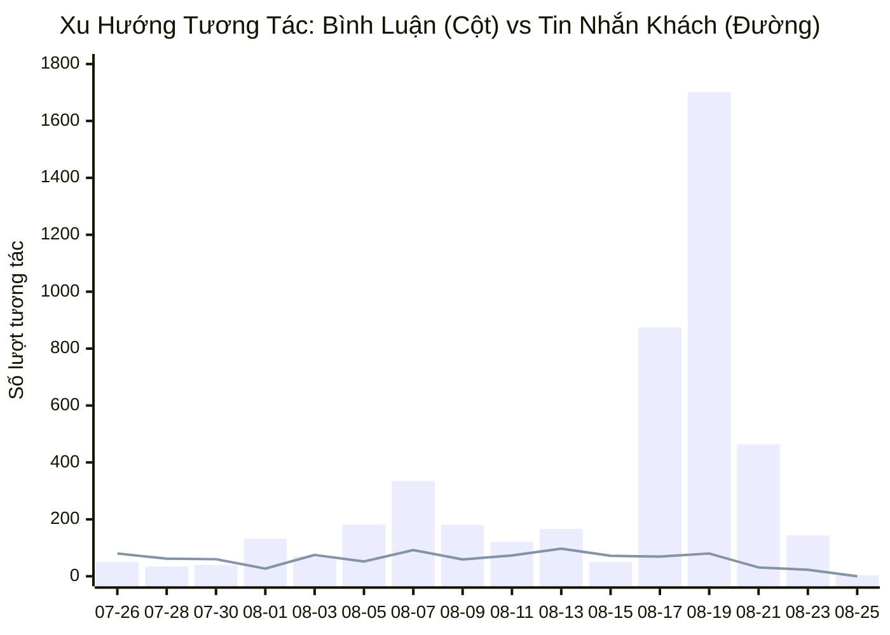
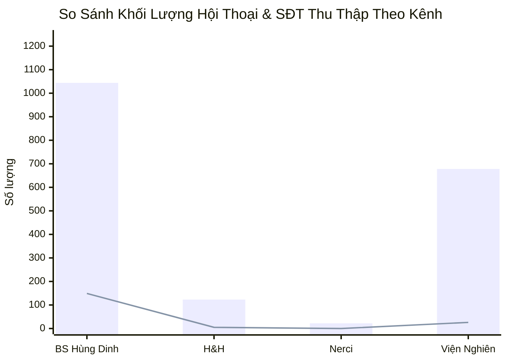
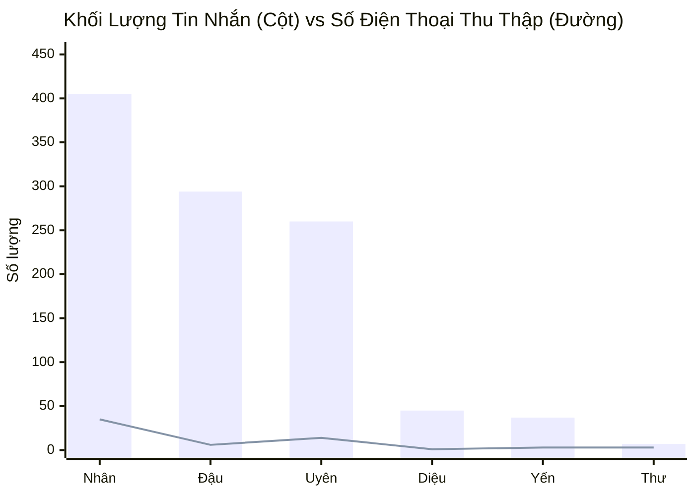
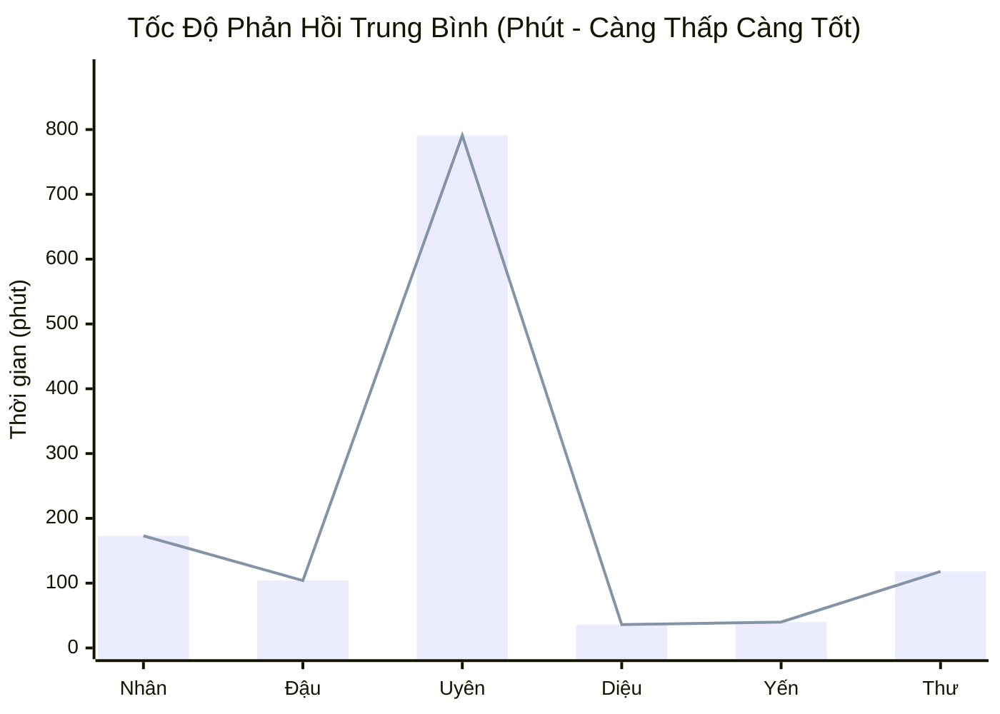
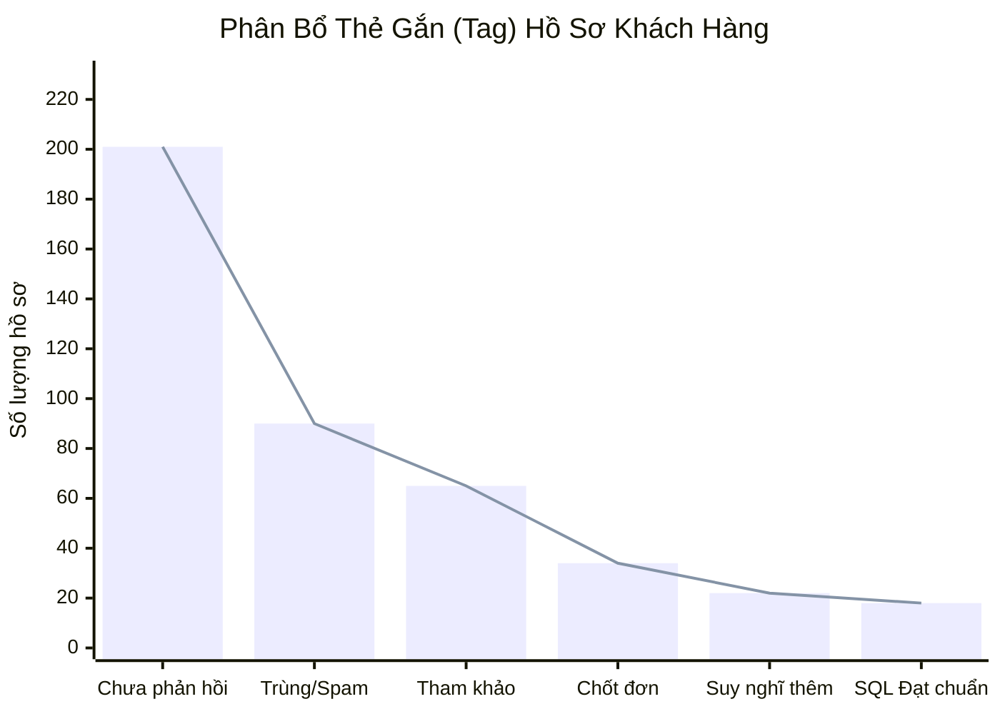
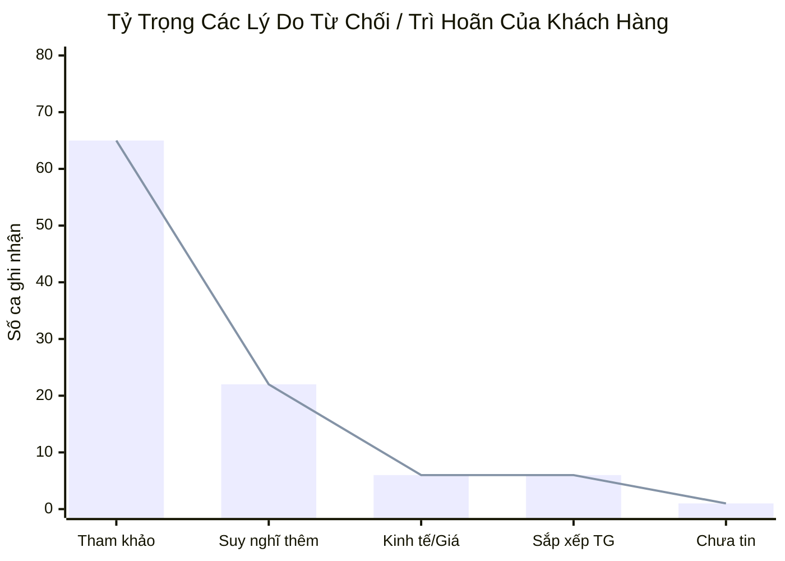
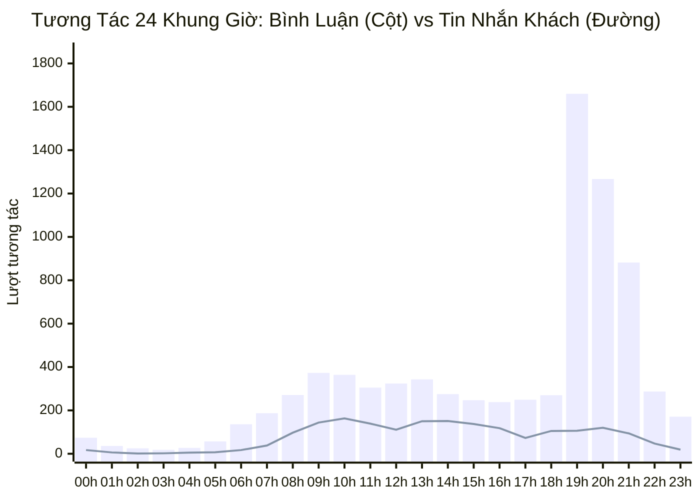
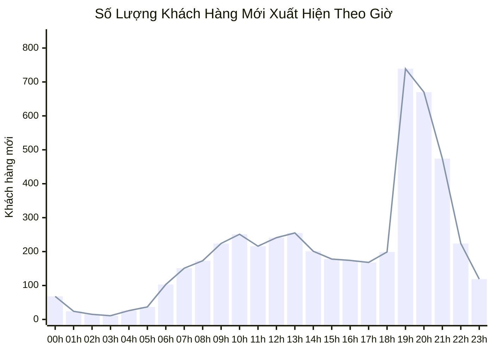

  <h1 style="margin: 0 0 8px 0; color: white; border-bottom: none; font-size: 26px;">📊 BÁO CÁO VẬN HÀNH & HIỆU SUẤT ĐA KÊNH PANCAKE NERCI</h1>
  
Hệ thống Quản Trị Hội Thoại & Chăm Sóc Khách Hàng: TikTok (BS Hùng Dinh Dưỡng), Zalo OA, Web Chat NERCI & H&H Nutrition

  

    📅 <strong>Thời gian báo cáo:</strong> 25/08/2026 (Dữ liệu 30 ngày gần nhất)
    👤 <strong>Thực hiện:</strong> Antigravity AI Agent
    🎯 <strong>Phạm vi:</strong> 4 Kênh trực tuyến kết nối Pancake
  

> [!abstract] TỔNG QUAN HIỆU SUẤT & ĐIỂM SÁNG CHIẾN LƯỢC TỪ PANCAKE
> - **Tổng khách hàng mới ghi nhận:** **`4,941` khách hàng** trên 4 kênh trong 30 ngày qua.
> - **Kênh TikTok Bác sĩ Hùng Dinh Dưỡng** là nguồn phễu tương tác khổng lồ nhất hệ sinh thái với **`9,953` lượt chạm** (gồm **`8,086` bình luận** và **`1,044` tin nhắn trực tiếp**), thu về **`149` Số điện thoại** có nhu cầu khám/tư vấn.
> - **Kênh Zalo OA Viện NERCI** đóng vai trò chốt chặn tư vấn chuyên sâu hiệu quả cao nhất với **`678` cuộc hội thoại chuyên sâu**, thu được **`26` Số điện thoại** và **`15` ca chốt đơn/khám trực tiếp**.
> - **Tỷ lệ chuyển đổi thu thập SĐT toàn hệ thống đạt `1.81%`** trên tổng tương tác, với **`34` ca chốt dịch vụ/khám thành công** và **`18` ca Lead đạt chuẩn (SQL/MQL)** được phân loại trên hệ thống.

> [!danger] RÀO CẢN VẬN HÀNH & CẢNH BÁO TẮC NGHẼN (BOTTLENECKS)
> 1. **Khách hàng ngưng phản hồi (Tag Chưa phản hồi):** Ghi nhận tới **`201` trường hợp** khách hàng dừng tương tác sau tin nhắn mở đầu — cần thiết lập kịch bản tự động đeo bám (Follow-up sequence sau 2h, 6h, 24h).
> 2. **Tốc độ phản hồi kênh TikTok còn quá chậm:** Thời gian phản hồi trung bình của tư vấn viên trên TikTok dao động từ **`131.4` phút đến `300.7` phút** (~2 đến 5 tiếng). Đây là nguyên nhân chính khiến khách hàng nguội lạnh và tỷ lệ rớt phễu tăng cao.
> 3. **Rào cản "Tham khảo" & "Suy nghĩ thêm" chiếm áp đảo:** Có **`65` khách gắn tag Tham khảo** và **`22` khách gắn tag Suy nghĩ thêm** (chiếm **`87.0%`** tổng rào cản từ chối), chứng minh nhân sự tư vấn đang thiếu kịch bản tạo tính cấp thiết (Urgency/Scarcity) hoặc thiếu tài liệu minh chứng y khoa để kích hoạt hành động ngay.

> [!success] CƠ HỘI CHUYỂN ĐỔI & ĐỀ XUẤT TỰ ĐỘNG HÓA TỨC THÌ
> 1. **Kích hoạt Kịch bản Chatbot Tự Động Thu SĐT Ngoài Giờ:** Thiết lập Botcake tự động gửi mẫu tin nhắn xin số Zalo/SĐT để Bác sĩ xem hồ sơ bệnh án khi khách hàng bình luận/nhắn tin ngoài giờ hành chính (20h00 - 08h00).
> 2. **Phân Luồng Tự Động (Round Robin) Theo Chuyên Môn:** Tối ưu hóa phân chia khách hàng: Ca bệnh Thận mạn (CKD) & Đái tháo đường chuyển ngay cho Dược sĩ/Bác sĩ chuyên khoa; Ca Đào tạo/Học nghề chuyển cho phòng Tuyển sinh.
> 3. **Đồng Bộ Dữ Liệu Lead Realtime Sang Lark Base CRM:** Tích hợp Webhook tự động từ Pancake sang Lark Base CRM (Table: Leads) để Sale/CSKH tiếp nhận và kích hoạt chuỗi Zalo ZNS CSKH định kỳ.

## 🌐 I. TỔNG HỢP HIỆU SUẤT ĐA KÊNH PANCAKE (30 NGÀY QUA)
### 📈 1. Biểu Đồ Đường Xu Hướng Tương Tác Hàng Ngày (30 Ngày Qua)

### 📊 2. Biểu Đồ So Sánh Quy Mô Tương Tác Theo Nền Tảng

### 📑 3. Bảng Dữ Liệu Tổng Hợp Đa Kênh
| Kênh / Kênh Quản Lý | Nền Tảng | Khách Hàng Mới | Tin Nhắn Khách | Bình Luận Khách | SĐT Thu Thập | Tỷ Lệ Thu SĐT (%) | Đánh Giá Vai Trò |
| :--- | :---: | :---: | :---: | :---: | :---: | :--- |
| **BS Hùng Dinh Dưỡng - NERCI** | `TIKTOK` | **4,799** | 1,044 | 8,086 | **149** | **1.63%** | Top Đầu Phễu (Traffic/Viral) |
| **H&H** | `PKE_CHAT_PLUGIN` | **25** | 123 | 0 | **5** | **4.07%** | Livechat Web Vãng Lai |
| **Nerci** | `PKE_CHAT_PLUGIN` | **16** | 22 | 0 | **0** | **0.00%** | Livechat Web Vãng Lai |
| **Viện Nghiên cứu & Tư vấn dinh dưỡng** | `ZALO` | **101** | 678 | 0 | **26** | **3.83%** | Chốt Chặn Chuyên Sâu |
| **TỔNG CỘNG HỆ THỐNG** | `OMNICHANNEL` | **4,941** | **1,867** | **8,086** | **180** | **1.81%** | **Toàn Bộ Kênh Pancake** |

## 👥 II. ĐÁNH GIÁ NĂNG LỰC & TỐC ĐỘ PHẢN HỒI TƯ VẤN VIÊN (STAFF SLA)
### 📈 1. Biểu Đồ So Sánh Khối Lượng Tiếp Nhận & SĐT Thu Về Của Tư Vấn Viên

### ⏱️ 2. Biểu Đồ Thời Gian Phản Hồi Trung Bình (SLA - Phút)

### 📑 3. Bảng Chi Tiết SLA & Hiệu Suất Từng Nhân Sự
| Họ Tên Nhân Sự | Kênh Phụ Trách Chính | Tin Nhắn Tiếp Nhận | Bình Luận Xử Lý | SĐT Thu Thập Được | Tốc Độ Phản Hồi TB | Đánh Giá Hiệu Suất |
| :--- | :--- | :---: | :---: | :---: | :---: | :--- |
| **Nguyễn Thiện Nhân** | TikTok + Zalo OA | **405** | 0 | **35** | `173.2 phút` | 🔴 **Cảnh báo Chậm** (SLA > 2h, dễ mất Lead) |
| **Anna Đậu** | TikTok + Zalo OA | **294** | 0 | **6** | `104.1 phút` | ⚪ **Đạt chuẩn** |
| **Nguyễn Phương Uyên** | TikTok + Zalo OA | **260** | 0 | **14** | `791.3 phút` | 🔴 **Cảnh báo Chậm** (SLA > 2h, dễ mất Lead) |
| **Hồ Dương Xuân  Diệu** | Zalo OA / Web | **45** | 0 | **1** | `36.0 phút` | 🟡 **Khá** (SLA đạt chuẩn, cần tăng tốc) |
| **Nguyễn Thị Hồng Yến** | Zalo OA / Web | **37** | 0 | **3** | `40.3 phút` | 🟡 **Khá** (SLA đạt chuẩn, cần tăng tốc) |
| **Đặng Thư** | Hỗ trợ ca | **7** | 0 | **3** | `118.9 phút` | ⚪ **Đạt chuẩn** |
| **Nguyễn Vũ Bảo Như** | Hỗ trợ ca | **0** | 0 | **1** | `0.0 phút` | 🟡 **Khá** (SLA đạt chuẩn, cần tăng tốc) |

## 🎯 III. PHÂN LOẠI CHẤT LƯỢNG LEAD & ĐÁY PHỄU CHUYỂN ĐỔI
### 📊 1. Biểu Đồ Phân Bổ Trạng Thái Khách Hàng (Tag Distribution)

### 📉 2. Biểu Đồ Bóc Tách Rào Cản Từ Chối (Fail Barriers)

### 📑 3. Bảng Chi Tiết Phân Bổ Trạng Thái Lead Theo Thẻ Gắn
| Nhóm Phân Loại | Thẻ Gắn (Tag Name) | Số Lượng Hồ Sơ | Tỷ Lệ (%) | Ý Nghĩa Nghiệp Vụ & Hành Động Kế Tiếp |
| :--- | :--- | :---: | :---: | :--- |
| 🏆 Chốt Đơn & Tiềm Năng | **Chốt đơn / Khám thành công** | **34** | 7.5% | Chuyển Kế toán thu phí / Bác sĩ lập hồ sơ bệnh án |
| 🏆 Chốt Đơn & Tiềm Năng | **Đủ tiêu chuẩn (SQL)** | **18** | 3.9% | Lead chất lượng cao, hẹn lịch khám/tư vấn 1-1 |
| 🏆 Chốt Đơn & Tiềm Năng | **Tiềm Năng (MQL)** | **3** | 0.7% | Khách có nhu cầu rõ ràng, cần nuôi dưỡng thêm |
| 🏆 Chốt Đơn & Tiềm Năng | **Chăm sóc KH cũ (CSKH)** | **1** | 0.2% | Tái khám định kỳ, tư vấn thực đơn duy trì |
| ⚠️ Cần Xử Lý / Tắc Nghẽn | **Chưa phản hồi (Ngưng chat)** | **201** | 44.1% | Bật kịch bản tự động re-engage sau 2h và 24h |
| ⚠️ Cần Xử Lý / Tắc Nghẽn | **Không bắt máy (KBM) / Thuê bao** | **4** | 0.9% | Gửi tin nhắn ZNS hoặc SMS Brandname thông báo |
| ⚠️ Cần Xử Lý / Tắc Nghẽn | **Trùng lặp / Spam** | **90** | 19.7% | Lọc bỏ khỏi phễu tính KPI tiếp thị |

### 📑 4. Bảng Bóc Tách Chi Tiết Rào Cản Từ Chối (Fail Reasons Analytics)
| Rào Cản Quyết Định (Fail Reason) | Số Lượng Ghi Nhận | Tỷ Lệ / Tổng Fail | Nguyên Nhân Cốt Lõi & Giải Pháp Khắc Phục |
| :--- | :---: | :---: | :--- |
| **F_Tham Khảo (Chưa có nhu cầu gấp)** | **65** | **65.0%** | Gửi tài liệu Ebook dinh dưỡng miễn phí để giữ kết nối và nuôi dưỡng |
| **F_Suy Nghĩ Thêm** | **22** | **22.0%** | Bổ sung Feedback ca điều trị thành công (Social Proof) & Video Bác sĩ Hùng |
| **F_Kinh Tế & Giá Cao** | **6** | **6.0%** | Đề xuất gói khám cơ bản hoặc chia nhỏ liệu trình thanh toán |
| **F_Sắp Xếp Thời Gian** | **6** | **6.0%** | Tư vấn hình thức Khám Online 1-1 qua Video Call tiện lợi ngoài giờ |
| **F_Chưa Tin Tưởng** | **1** | **1.0%** | Chứng nhận Viện Nghiên cứu, giấy phép Bộ Y Tế và Profile Bác sĩ Đặng Ngọc Hùng |
| **TỔNG SỐ CA GẶP RÀO CẢN** | **100** | **100.0%** | **Cần đào tạo bộ kịch bản xử lý từ chối (Objection Handling Script)** |

## ⏰ IV. PHÂN BỔ TƯƠNG TÁC THEO KHUNG GIỜ (PEAK HOURLY TRAFFIC)
### 📈 1. Biểu Đồ Đường & Cột 24 Khung Giờ (Hourly Peak Load)

### 👥 2. Biểu Đồ Đường Khách Hàng Mới Xuất Hiện Theo Khung Giờ

### 📑 3. Bảng Dữ Liệu Chi Tiết 24 Khung Giờ & Khuyến Nghị Trực Ca
| Khung Giờ (Giờ trong ngày) | Lượt Tin Nhắn Khách | Lượt Bình Luận | Khách Hàng Mới | Mức Độ Tải | Khuyến Nghị Bố Trí Nhân Sự |
| :---: | :---: | :---: | :---: | :---: | :--- |
| **00:00 - 00:59** | 17 | 74 | 68 | ⚪ **TRUNG BÌNH** | Duy trì 1 tư vấn viên trực ca bình thường |
| **01:00 - 01:59** | 6 | 36 | 24 | 🌙 **THẤP / ĐÊM** | Bật Botcake tự động thu thập SĐT |
| **02:00 - 02:59** | 1 | 25 | 15 | 🌙 **THẤP / ĐÊM** | Bật Botcake tự động thu thập SĐT |
| **03:00 - 03:59** | 2 | 18 | 11 | 🌙 **THẤP / ĐÊM** | Bật Botcake tự động thu thập SĐT |
| **04:00 - 04:59** | 5 | 27 | 26 | 🌙 **THẤP / ĐÊM** | Bật Botcake tự động thu thập SĐT |
| **05:00 - 05:59** | 7 | 57 | 37 | ⚪ **TRUNG BÌNH** | Duy trì 1 tư vấn viên trực ca bình thường |
| **06:00 - 06:59** | 17 | 136 | 103 | ⚪ **TRUNG BÌNH** | Duy trì 1 tư vấn viên trực ca bình thường |
| **07:00 - 07:59** | 38 | 187 | 151 | ⚡ **CAO** | Bố trí 2 tư vấn viên túc trực liên tục |
| **08:00 - 08:59** | 97 | 271 | 173 | ⚡ **CAO** | Bố trí 2 tư vấn viên túc trực liên tục |
| **09:00 - 09:59** | 144 | 373 | 224 | 🔥 **CỰC CAO (PEAK)** | Ưu tiên tối đa 3-4 tư vấn viên trực chat phản hồi tức thì |
| **10:00 - 10:59** | 163 | 364 | 251 | 🔥 **CỰC CAO (PEAK)** | Ưu tiên tối đa 3-4 tư vấn viên trực chat phản hồi tức thì |
| **11:00 - 11:59** | 139 | 305 | 216 | ⚡ **CAO** | Bố trí 2 tư vấn viên túc trực liên tục |
| **12:00 - 12:59** | 111 | 324 | 241 | ⚡ **CAO** | Bố trí 2 tư vấn viên túc trực liên tục |
| **13:00 - 13:59** | 150 | 343 | 255 | ⚡ **CAO** | Bố trí 2 tư vấn viên túc trực liên tục |
| **14:00 - 14:59** | 151 | 275 | 201 | ⚡ **CAO** | Bố trí 2 tư vấn viên túc trực liên tục |
| **15:00 - 15:59** | 137 | 247 | 178 | ⚡ **CAO** | Bố trí 2 tư vấn viên túc trực liên tục |
| **16:00 - 16:59** | 118 | 238 | 174 | ⚡ **CAO** | Bố trí 2 tư vấn viên túc trực liên tục |
| **17:00 - 17:59** | 73 | 249 | 168 | ⚡ **CAO** | Bố trí 2 tư vấn viên túc trực liên tục |
| **18:00 - 18:59** | 105 | 270 | 199 | ⚡ **CAO** | Bố trí 2 tư vấn viên túc trực liên tục |
| **19:00 - 19:59** | 106 | 1,660 | 739 | 🔥 **CỰC CAO (PEAK)** | Ưu tiên tối đa 3-4 tư vấn viên trực chat phản hồi tức thì |
| **20:00 - 20:59** | 120 | 1,267 | 670 | 🔥 **CỰC CAO (PEAK)** | Ưu tiên tối đa 3-4 tư vấn viên trực chat phản hồi tức thì |
| **21:00 - 21:59** | 94 | 882 | 474 | 🔥 **CỰC CAO (PEAK)** | Ưu tiên tối đa 3-4 tư vấn viên trực chat phản hồi tức thì |
| **22:00 - 22:59** | 47 | 287 | 224 | ⚡ **CAO** | Bố trí 2 tư vấn viên túc trực liên tục |
| **23:00 - 23:59** | 19 | 171 | 119 | ⚪ **TRUNG BÌNH** | Duy trì 1 tư vấn viên trực ca bình thường |

## 🚀 V. KẾ HOẠCH HÀNH ĐỘNG CẢI TIẾN VẬN HÀNH (ACTION PLAN)
| Hạng Mục Cải Tiến | Mục Tiêu Đo Lường (KPI) | Thời Hạn (Deadline) | Người Chịu Trách Nhiệm (PIC) | Trạng Thái |
| :--- | :--- | :---: | :--- | :---: |
| **1. Cài đặt Kịch bản Botcake TikTok Thu SĐT** | Giảm tỷ lệ rơi rớt tin nhắn, thu thêm 50+ SĐT/tháng | 28/08/2026 | Tech Lead / MKT Automation | 🟡 Đang triển khai |
| **2. Tối ưu SLA Phản Hồi Kênh TikTok < 15 Phút** | Nâng tốc độ phản hồi từ 131p xuống dưới 15p | 31/08/2026 | Trưởng nhóm Tư vấn / Trực Chat | 🟡 Đang điều chỉnh ca |
| **3. Xây dựng Kịch Bản Follow-up Khách "Chưa Phản Hồi"** | Kéo lại 15-20% khách hàng dừng chat | 02/09/2026 | Bộ phận Nội dung / CSKH | 🟡 Soạn thảo kịch bản |
| **4. Tự Động Hóa Đồng Bộ Lead Sang Lark Base CRM** | 100% SĐT thu thập được đẩy realtime vào CRM | 30/08/2026 | Antigravity AI / IT Lead | 🟢 Đã có pipeline |
| **5. Đào Tạo Bộ Kịch Bản Xử Lý Từ Chối "Tham Khảo/Giá"** | Nâng tỷ lệ chốt từ 2.3% lên 4.5% | 05/09/2026 | Bác sĩ Trưởng phòng Khám & Tư vấn | ⚪ Lên lịch đào tạo |

---
### ⚠️ TUYÊN BỐ MIỄN TRỪ TRÁCH NHIỆM (DISCLAIMER)
*Báo cáo này được tự động trích xuất và tính toán trực tiếp từ Pancake Open API kết nối các tài khoản Fanpage/TikTok/Zalo OA của Viện Nghiên cứu & Tư vấn Dinh dưỡng NERCI và H&H Nutrition. Dữ liệu phản ánh chính xác các tương tác, trạng thái thẻ gắn và hoạt động của đội ngũ tư vấn viên trong thời gian thực.*