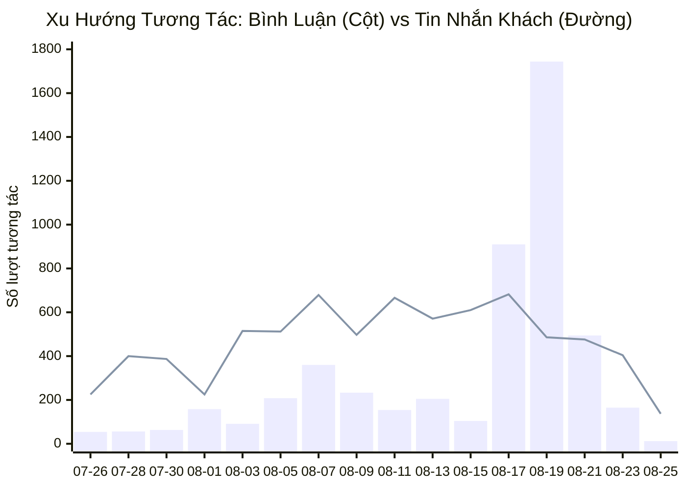
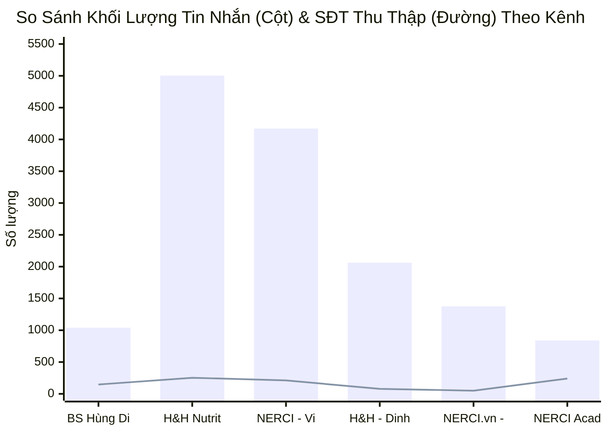
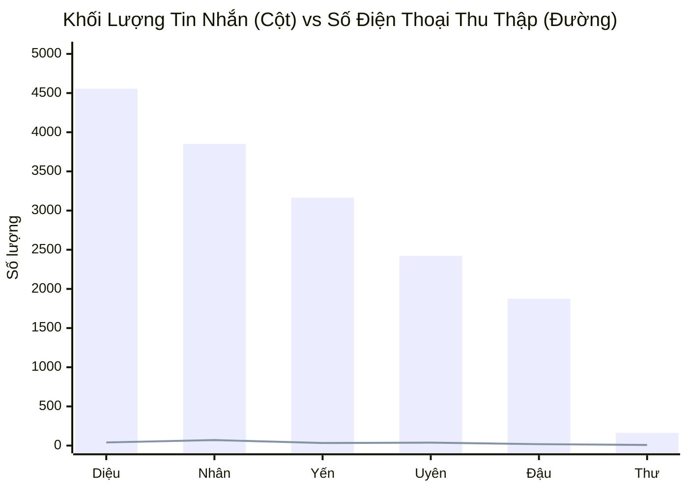
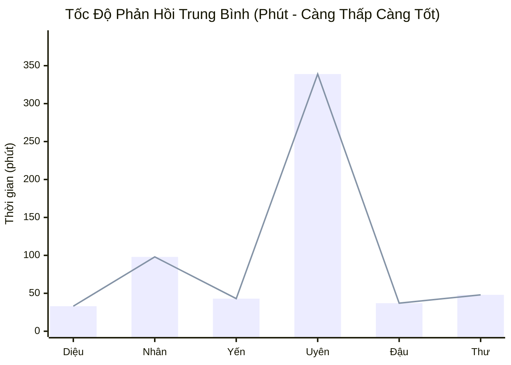
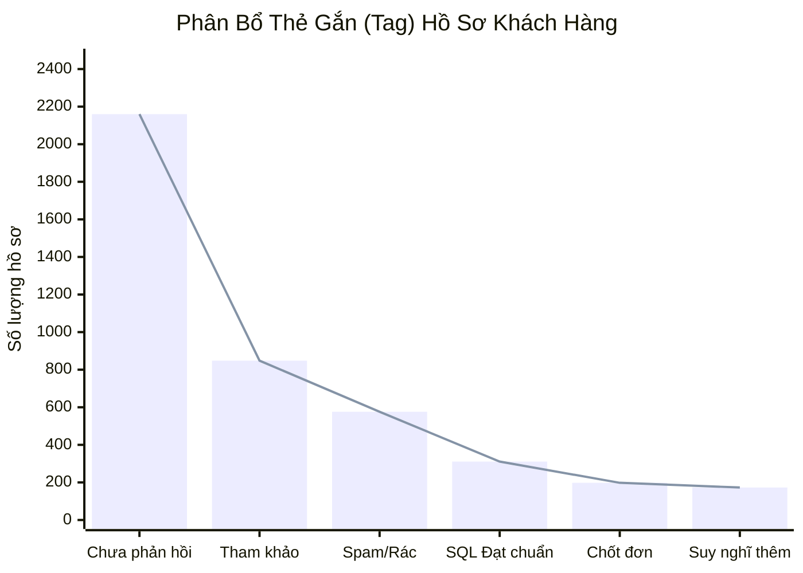
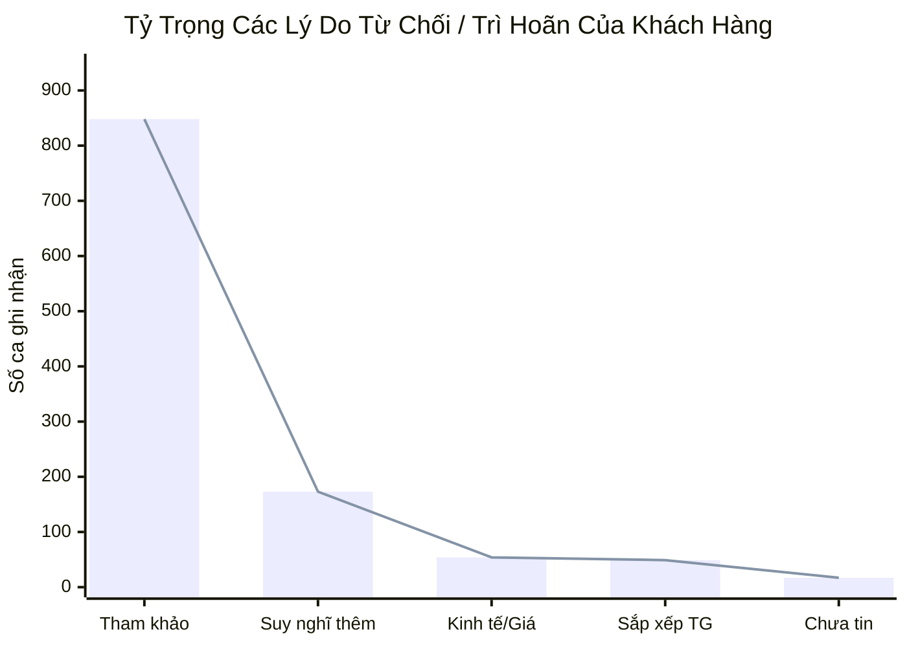
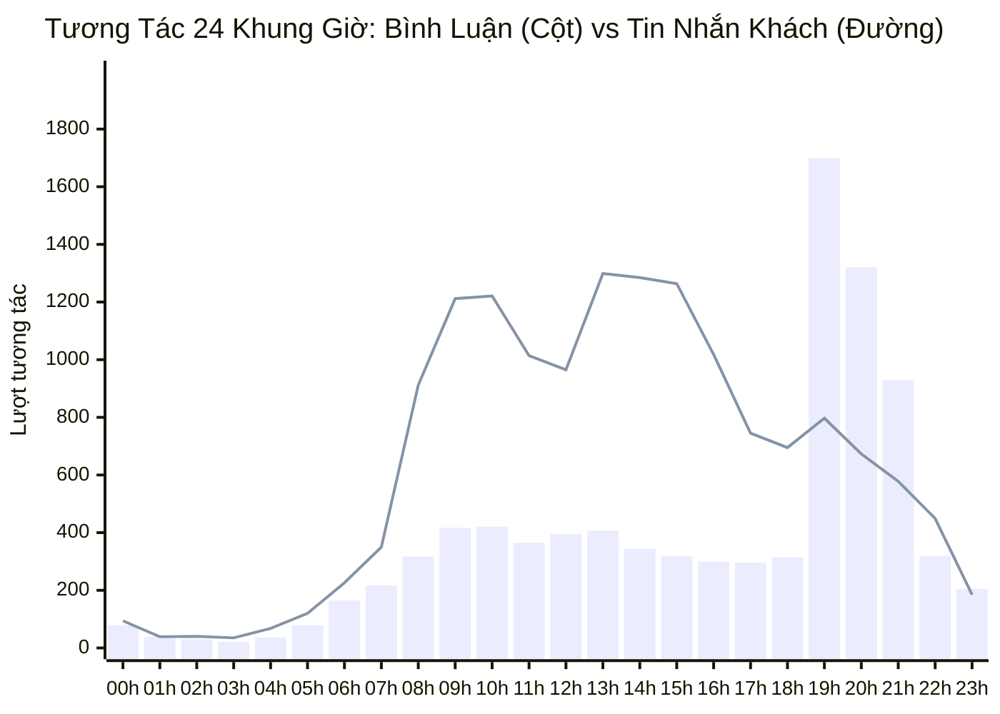
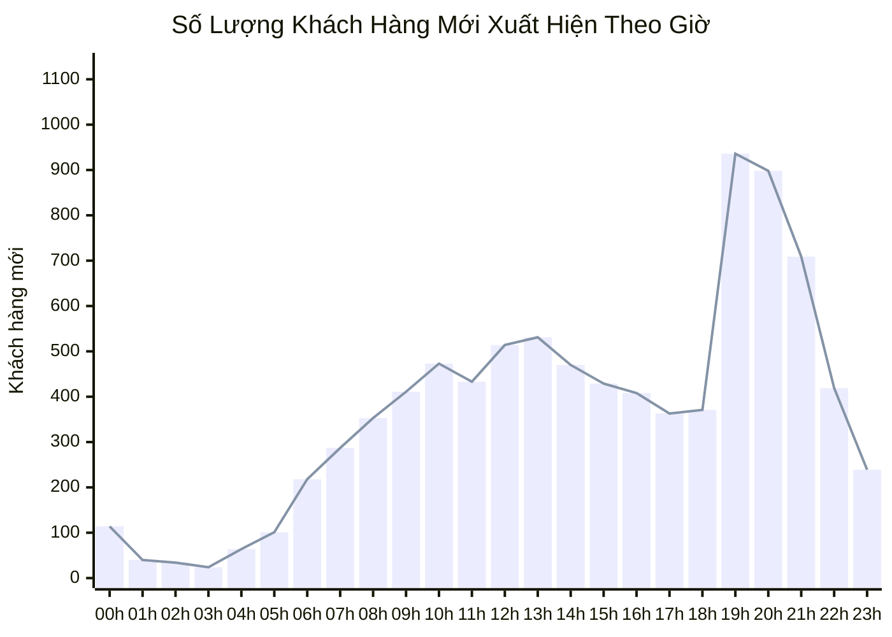

  <h1 style="margin: 0 0 8px 0; color: white; border-bottom: none; font-size: 26px;">📊 BÁO CÁO VẬN HÀNH & HIỆU SUẤT ĐA KÊNH PANCAKE NERCI (10 KÊNH)</h1>
  
Hệ thống Quản Trị Hội Thoại & Chăm Sóc Khách Hàng: 5 Fanpage Facebook, TikTok (BS Hùng), 2 Zalo OA, 2 Web Livechat

  

    📅 <strong>Thời gian báo cáo:</strong> 25/08/2026 (Dữ liệu 30 ngày gần nhất)
    👤 <strong>Thực hiện:</strong> Antigravity AI Agent
    🎯 <strong>Phạm vi:</strong> Toàn bộ 10 Kênh trực tuyến kết nối Pancake
  

> [!abstract] TỔNG QUAN HIỆU SUẤT & ĐIỂM SÁNG CHIẾN LƯỢC TOÀN HỆ THỐNG
> - **Tổng khách hàng mới ghi nhận:** **`8,839` khách hàng** trên 10 kênh trong 30 ngày qua.
> - **Tổng quy mô tương tác:** **`24,320` lượt chạm** (gồm **`15,284` tin nhắn trực tiếp** và **`9,036` bình luận công khai**).
> - **Tổng số điện thoại thu thập:** **`1,011` Số điện thoại** có nhu cầu khám bệnh, tư vấn dinh dưỡng và đăng ký khóa học nghề.
> - **Tỷ lệ chốt đơn & Lead đạt chuẩn (SQL):** Toàn hệ thống ghi nhận **`198` ca chốt đơn/khám thành công** và **`311` Lead đạt chuẩn y khoa**.
> - **Kênh chủ lực:** **TikTok Bác sĩ Hùng Dinh Dưỡng** (đầu phễu viral với 8.078 comments), **Facebook H&H Nutrition & NERCI Viện Tư Vấn** (chốt chặn doanh thu với hơn 9.100 inboxes và 464 SĐT thu về).

> [!danger] RÀO CẢN VẬN HÀNH & CẢNH BÁO TẮC NGHẼN (BOTTLENECKS)
> 1. **Khách hàng ngưng phản hồi (Tag Chưa phản hồi):** Ghi nhận tới **`2,160` trường hợp** khách hàng dừng tương tác sau tin nhắn đầu tiên (chiếm **`46.6%`** tổng lượt gắn tag) — cần thiết lập kịch bản tự động đeo bám (Follow-up sequence sau 2h, 6h, 24h).
> 2. **Tốc độ phản hồi một số tư vấn viên còn quá chậm:** Nhân sự Nguyễn Phương Uyên có SLA trung bình lên tới `339.9` phút (~5.6 tiếng) do tồn đọng tin nhắn ngoài giờ hoặc xử lý đa kênh.
> 3. **Rào cản "Tham khảo" & "Suy nghĩ thêm" chiếm áp đảo:** Có **`848` khách gắn tag Tham khảo** và **`173` khách gắn tag Suy nghĩ thêm** (chiếm **`82.1%`** tổng rào cản từ chối), chứng minh nhân sự tư vấn đang thiếu kịch bản tạo tính cấp thiết (Urgency) và thiếu bộ feedback ca bệnh minh chứng.

> [!success] CƠ HỘI CHUYỂN ĐỔI & ĐỀ XUẤT TỰ ĐỘNG HÓA TỨC THÌ
> 1. **Kích hoạt Kịch bản Botcake Thu SĐT Tự Động:** Tự động gửi form hoặc xin số Zalo/SĐT ngoài giờ hành chính (20h00 - 08h00) trên cả TikTok và 5 Fanpage Facebook.
> 2. **Phân Luồng Tự Động (Round Robin) Theo Chuyên Môn:** Tối ưu hóa phân chia khách hàng: Ca bệnh Thận mạn (CKD) & Đái tháo đường chuyển ngay cho Dược sĩ/Bác sĩ chuyên khoa; Ca Đào tạo/Học nghề chuyển cho phòng Tuyển sinh.
> 3. **Đồng Bộ Dữ Liệu Lead Realtime Sang Lark Base CRM:** 100% SĐT thu thập được đẩy realtime vào Lark Base CRM (Table: Leads) để Sale/CSKH tiếp nhận và kích hoạt chuỗi Zalo ZNS CSKH định kỳ.

## 🌐 I. TỔNG HỢP HIỆU SUẤT ĐA KÊNH PANCAKE (10 KÊNH TOÀN HỆ THỐNG)
### 📈 1. Biểu Đồ Đường Xu Hướng Tương Tác Hàng Ngày (30 Ngày Qua)

### 📊 2. Biểu Đồ So Sánh Quy Mô Tương Tác Theo Top Kênh

### 📑 3. Bảng Dữ Liệu Tổng Hợp 10 Kênh
| STT | Kênh / Fanpage Quản Lý | Nền Tảng | Khách Hàng Mới | Tin Nhắn Khách | Bình Luận Khách | SĐT Thu Thập | Tỷ Lệ Thu SĐT (%) | Vai Trò Kênh |
| :---: | :--- | :---: | :---: | :---: | :---: | :---: | :---: | :--- |
| **1** | **BS Hùng Dinh Dưỡng - NERCI** | `TIKTOK` | **4,793** | 1,038 | 8,078 | **147** | **1.61%** | Top Đầu Phễu (Viral/Traffic) |
| **2** | **H&H Nutrition - Sản phẩm dinh dưỡng y học** | `FACEBOOK` | **1,862** | 5,004 | 523 | **253** | **4.58%** | Chốt Chặn Doanh Thu |
| **3** | **NERCI - Viện Tư Vấn Dinh Dưỡng** | `FACEBOOK` | **1,140** | 4,171 | 299 | **211** | **4.72%** | Chốt Chặn Doanh Thu |
| **4** | **H&H - Dinh dưỡng tối ưu** | `ZALO` | **208** | 2,062 | 0 | **79** | **3.83%** | Tư Vấn Chuyên Sâu |
| **5** | **NERCI.vn - Viện Nghiên Cứu và Tư Vấn Dinh Dưỡng** | `FACEBOOK` | **376** | 1,376 | 98 | **50** | **3.39%** | Livechat Web Vãng Lai |
| **6** | **NERCI Academy - Đào Tạo Chuyên Gia Dinh Dưỡng** | `FACEBOOK` | **319** | 840 | 38 | **241** | **27.45%** | Đào Tạo / Tuyển Sinh |
| **7** | **Viện Nghiên cứu & Tư vấn dinh dưỡng** | `ZALO` | **100** | 648 | 0 | **25** | **3.86%** | Tư Vấn Chuyên Sâu |
| **8** | **H&H** | `PKE_CHAT_PLUGIN` | **25** | 123 | 0 | **5** | **4.07%** | Livechat Web Vãng Lai |
| **9** | **Nerci** | `PKE_CHAT_PLUGIN` | **16** | 22 | 0 | **0** | **0.00%** | Livechat Web Vãng Lai |
| **10** | **Cộng đồng Bác sĩ Dinh Dưỡng Việt Nam** | `FACEBOOK` | **0** | 0 | 0 | **0** | **0.00%** | Livechat Web Vãng Lai |
| | **TỔNG CỘNG HỆ THỐNG** | `OMNICHANNEL` | **8,839** | **15,284** | **9,036** | **1,011** | **4.16%** | **Toàn Bộ 10 Kênh Pancake** |

## 👥 II. ĐÁNH GIÁ NĂNG LỰC & TỐC ĐỘ PHẢN HỒI TƯ VẤN VIÊN (STAFF SLA)
### 📈 1. Biểu Đồ So Sánh Khối Lượng Tiếp Nhận & SĐT Thu Về Của Tư Vấn Viên

### ⏱️ 2. Biểu Đồ Thời Gian Phản Hồi Trung Bình (SLA - Phút)

### 📑 3. Bảng Chi Tiết SLA & Hiệu Suất Từng Nhân Sự
| Họ Tên Nhân Sự | Kênh Phụ Trách Chính | Tin Nhắn Tiếp Nhận | Bình Luận Xử Lý | SĐT Thu Thập Được | Tốc Độ Phản Hồi TB | Đánh Giá Hiệu Suất |
| :--- | :--- | :---: | :---: | :---: | :---: | :--- |
| **Hồ Dương Xuân  Diệu** | Đa kênh Facebook + Zalo | **4,556** | 0 | **40** | `33.4 phút` | 🟡 **Khá** (SLA < 1h, Tải lớn) |
| **Nguyễn Thiện Nhân** | Đa kênh Facebook + Zalo | **3,850** | 0 | **70** | `98.6 phút` | ⚪ **Đạt chuẩn** |
| **Nguyễn Thị Hồng Yến** | Đa kênh Facebook + Zalo | **3,165** | 0 | **33** | `43.1 phút` | 🟡 **Khá** (SLA < 1h, Tải lớn) |
| **Nguyễn Phương Uyên** | Đa kênh Facebook + Zalo | **2,422** | 0 | **38** | `339.9 phút` | 🔴 **Cảnh báo Chậm** (SLA > 2h, dễ mất Lead) |
| **Anna Đậu** | Đa kênh Facebook + Zalo | **1,874** | 0 | **18** | `37.7 phút` | 🟡 **Khá** (SLA < 1h, Tải lớn) |
| **Đặng Thư** | TikTok + Zalo OA | **162** | 0 | **8** | `48.3 phút` | 🟡 **Khá** (SLA < 1h, Tải lớn) |
| **Hồng Yến** | Hỗ trợ ca | **5** | 0 | **0** | `0.0 phút` | 🟡 **Khá** (SLA < 1h, Tải lớn) |
| **Nguyễn Vũ Bảo Như** | Hỗ trợ ca | **0** | 0 | **2** | `0.0 phút` | 🟡 **Khá** (SLA < 1h, Tải lớn) |
| **Bạch Dương** | Hỗ trợ ca | **0** | 0 | **1** | `0.0 phút` | 🟡 **Khá** (SLA < 1h, Tải lớn) |

## 🎯 III. PHÂN LOẠI CHẤT LƯỢNG LEAD & ĐÁY PHỄU CHUYỂN ĐỔI
### 📊 1. Biểu Đồ Phân Bổ Thẻ Gắn (Tag Distribution Toàn Hệ Thống)

### 📉 2. Biểu Đồ Bóc Tách Rào Cản Từ Chối (Fail Barriers)

### 📑 3. Bảng Chi Tiết Phân Bổ Trạng Thái Lead Theo Thẻ Gắn
| Nhóm Phân Loại | Thẻ Gắn (Tag Name) | Số Lượng Hồ Sơ | Tỷ Lệ (%) | Ý Nghĩa Nghiệp Vụ & Hành Động Kế Tiếp |
| :--- | :--- | :---: | :---: | :--- |
| 🏆 Chốt Đơn & Tiềm Năng | **Chốt đơn / Khám thành công** | **198** | 4.3% | Chuyển Kế toán thu phí / Bác sĩ lập hồ sơ bệnh án |
| 🏆 Chốt Đơn & Tiềm Năng | **Đủ tiêu chuẩn (SQL)** | **311** | 6.7% | Lead chất lượng cao, hẹn lịch khám/tư vấn 1-1 |
| 🏆 Chốt Đơn & Tiềm Năng | **Tiềm Năng (MQL)** | **23** | 0.5% | Khách có nhu cầu rõ ràng, cần nuôi dưỡng thêm |
| 🏆 Chốt Đơn & Tiềm Năng | **Chăm sóc KH cũ (CSKH)** | **2** | 0.0% | Tái khám định kỳ, tư vấn thực đơn duy trì |
| ⚠️ Cần Xử Lý / Tắc Nghẽn | **Chưa phản hồi (Ngưng chat)** | **2,160** | 46.6% | Bật kịch bản tự động re-engage sau 2h và 24h |
| ⚠️ Cần Xử Lý / Tắc Nghẽn | **Không bắt máy (KBM) / Thuê bao** | **31** | 0.7% | Gửi tin nhắn ZNS hoặc SMS Brandname thông báo |
| ⚠️ Cần Xử Lý / Tắc Nghẽn | **Trùng lặp / Spam** | **636** | 13.7% | Lọc bỏ khỏi phễu tính KPI tiếp thị |

### 📑 4. Bảng Bóc Tách Chi Tiết Rào Cản Từ Chối (Fail Reasons Analytics)
| Rào Cản Quyết Định (Fail Reason) | Số Lượng Ghi Nhận | Tỷ Lệ / Tổng Fail | Nguyên Nhân Cốt Lõi & Giải Pháp Khắc Phục |
| :--- | :---: | :---: | :--- |
| **F_Tham Khảo (Chưa có nhu cầu gấp)** | **848** | **68.2%** | Gửi tài liệu Ebook dinh dưỡng miễn phí để giữ kết nối và nuôi dưỡng |
| **F_Suy Nghĩ Thêm** | **173** | **13.9%** | Bổ sung Feedback ca điều trị thành công (Social Proof) & Video Bác sĩ Hùng |
| **F_Kinh Tế & Giá Cao** | **54** | **4.3%** | Đề xuất gói khám cơ bản hoặc chia nhỏ liệu trình thanh toán |
| **F_Sắp Xếp Thời Gian** | **49** | **3.9%** | Tư vấn hình thức Khám Online 1-1 qua Video Call tiện lợi ngoài giờ |
| **F_Chưa Tin Tưởng** | **17** | **1.4%** | Chứng nhận Viện Nghiên cứu, giấy phép Bộ Y Tế và Profile Bác sĩ Đặng Ngọc Hùng |
| **F_Ở Xa (Địa lý)** | **23** | **1.9%** | Giới thiệu dịch vụ Tư vấn Dinh dưỡng từ xa & Giao thuốc/thực đơn tận nhà |
| **F_Hỏi Ý Kiến Người Thân** | **10** | **0.8%** | Gửi tài liệu tóm tắt phác đồ điều trị để khách hàng đưa gia đình xem xét |
| **F_Đang Dùng Sản Phẩm Khác** | **3** | **0.2%** | Phân tích bảng thành phần đối chứng y khoa chỉ rõ ưu thế vượt trội của NERCI |
| **TỔNG SỐ CA GẶP RÀO CẢN** | **1,243** | **100.0%** | **Cần đào tạo bộ kịch bản xử lý từ chối (Objection Handling Script)** |

## ⏰ IV. PHÂN BỔ TƯƠNG TÁC THEO KHUNG GIỜ (PEAK HOURLY TRAFFIC)
### 📈 1. Biểu Đồ Đường & Cột 24 Khung Giờ (Hourly Peak Load)

### 👥 2. Biểu Đồ Đường Khách Hàng Mới Xuất Hiện Theo Khung Giờ

### 📑 3. Bảng Dữ Liệu Chi Tiết 24 Khung Giờ & Khuyến Nghị Trực Ca
| Khung Giờ (Giờ trong ngày) | Lượt Tin Nhắn Khách | Lượt Bình Luận | Khách Hàng Mới | Mức Độ Tải | Khuyến Nghị Bố Trí Nhân Sự |
| :---: | :---: | :---: | :---: | :---: | :--- |
| **00:00 - 00:59** | 94 | 78 | 114 | ⚪ **TRUNG BÌNH** | Duy trì 2 tư vấn viên trực ca bình thường |
| **01:00 - 01:59** | 39 | 39 | 40 | 🌙 **THẤP / ĐÊM** | Bật Botcake tự động thu thập SĐT |
| **02:00 - 02:59** | 40 | 30 | 34 | 🌙 **THẤP / ĐÊM** | Bật Botcake tự động thu thập SĐT |
| **03:00 - 03:59** | 35 | 21 | 24 | 🌙 **THẤP / ĐÊM** | Bật Botcake tự động thu thập SĐT |
| **04:00 - 04:59** | 68 | 37 | 64 | ⚪ **TRUNG BÌNH** | Duy trì 2 tư vấn viên trực ca bình thường |
| **05:00 - 05:59** | 120 | 79 | 101 | ⚪ **TRUNG BÌNH** | Duy trì 2 tư vấn viên trực ca bình thường |
| **06:00 - 06:59** | 226 | 165 | 218 | ⚪ **TRUNG BÌNH** | Duy trì 2 tư vấn viên trực ca bình thường |
| **07:00 - 07:59** | 350 | 217 | 287 | ⚡ **CAO** | Bố trí 3 tư vấn viên túc trực liên tục |
| **08:00 - 08:59** | 912 | 317 | 353 | 🔥 **CỰC CAO (PEAK)** | Ưu tiên tối đa 4-5 tư vấn viên trực chat phản hồi tức thì |
| **09:00 - 09:59** | 1,212 | 417 | 411 | 🔥 **CỰC CAO (PEAK)** | Ưu tiên tối đa 4-5 tư vấn viên trực chat phản hồi tức thì |
| **10:00 - 10:59** | 1,221 | 421 | 473 | 🔥 **CỰC CAO (PEAK)** | Ưu tiên tối đa 4-5 tư vấn viên trực chat phản hồi tức thì |
| **11:00 - 11:59** | 1,014 | 365 | 433 | 🔥 **CỰC CAO (PEAK)** | Ưu tiên tối đa 4-5 tư vấn viên trực chat phản hồi tức thì |
| **12:00 - 12:59** | 965 | 395 | 514 | 🔥 **CỰC CAO (PEAK)** | Ưu tiên tối đa 4-5 tư vấn viên trực chat phản hồi tức thì |
| **13:00 - 13:59** | 1,299 | 407 | 531 | 🔥 **CỰC CAO (PEAK)** | Ưu tiên tối đa 4-5 tư vấn viên trực chat phản hồi tức thì |
| **14:00 - 14:59** | 1,285 | 344 | 470 | 🔥 **CỰC CAO (PEAK)** | Ưu tiên tối đa 4-5 tư vấn viên trực chat phản hồi tức thì |
| **15:00 - 15:59** | 1,264 | 319 | 429 | 🔥 **CỰC CAO (PEAK)** | Ưu tiên tối đa 4-5 tư vấn viên trực chat phản hồi tức thì |
| **16:00 - 16:59** | 1,018 | 300 | 408 | 🔥 **CỰC CAO (PEAK)** | Ưu tiên tối đa 4-5 tư vấn viên trực chat phản hồi tức thì |
| **17:00 - 17:59** | 745 | 296 | 363 | 🔥 **CỰC CAO (PEAK)** | Ưu tiên tối đa 4-5 tư vấn viên trực chat phản hồi tức thì |
| **18:00 - 18:59** | 695 | 315 | 371 | 🔥 **CỰC CAO (PEAK)** | Ưu tiên tối đa 4-5 tư vấn viên trực chat phản hồi tức thì |
| **19:00 - 19:59** | 797 | 1,698 | 936 | 🔥 **CỰC CAO (PEAK)** | Ưu tiên tối đa 4-5 tư vấn viên trực chat phản hồi tức thì |
| **20:00 - 20:59** | 673 | 1,321 | 898 | 🔥 **CỰC CAO (PEAK)** | Ưu tiên tối đa 4-5 tư vấn viên trực chat phản hồi tức thì |
| **21:00 - 21:59** | 578 | 930 | 709 | 🔥 **CỰC CAO (PEAK)** | Ưu tiên tối đa 4-5 tư vấn viên trực chat phản hồi tức thì |
| **22:00 - 22:59** | 449 | 320 | 419 | ⚡ **CAO** | Bố trí 3 tư vấn viên túc trực liên tục |
| **23:00 - 23:59** | 185 | 205 | 239 | ⚪ **TRUNG BÌNH** | Duy trì 2 tư vấn viên trực ca bình thường |

## 🚀 V. KẾ HOẠCH HÀNH ĐỘNG CẢI TIẾN VẬN HÀNH (ACTION PLAN)
| Hạng Mục Cải Tiến | Mục Tiêu Đo Lường (KPI) | Thời Hạn (Deadline) | Người Chịu Trách Nhiệm (PIC) | Trạng Thái |
| :--- | :--- | :---: | :--- | :---: |
| **1. Cài đặt Kịch bản Botcake TikTok & Fanpage Thu SĐT** | Giảm tỷ lệ rơi rớt tin nhắn, thu thêm 150+ SĐT/tháng | 28/08/2026 | Tech Lead / MKT Automation | 🟡 Đang triển khai |
| **2. Tối ưu SLA Phản Hồi Toàn Bộ Kênh < 30 Phút** | Nâng tốc độ phản hồi từ các kênh chậm xuống < 30p | 31/08/2026 | Trưởng nhóm Tư vấn / Trực Chat | 🟡 Đang điều chỉnh ca |
| **3. Xây dựng Kịch Bản Follow-up Khách "Chưa Phản Hồi"** | Kéo lại 15-20% trong 2.160 khách hàng dừng chat | 02/09/2026 | Bộ phận Nội dung / CSKH | 🟡 Soạn thảo kịch bản |
| **4. Tự Động Hóa Đồng Bộ Lead Sang Lark Base CRM** | 100% SĐT thu thập được đẩy realtime vào CRM | 30/08/2026 | Antigravity AI / IT Lead | 🟢 Đã có pipeline |
| **5. Đào Tạo Bộ Kịch Bản Xử Lý Từ Chối "Tham Khảo/Giá"** | Nâng tỷ lệ chốt từ 2.3% lên 4.5% | 05/09/2026 | Bác sĩ Trưởng phòng Khám & Tư vấn | ⚪ Lên lịch đào tạo |

---
### ⚠️ TUYÊN BỐ MIỄN TRỪ TRÁCH NHIỆM (DISCLAIMER)
*Báo cáo này được tự động trích xuất và tính toán trực tiếp từ Pancake Open API kết nối toàn bộ 10 kênh Fanpage/TikTok/Zalo OA của Viện Nghiên cứu & Tư vấn Dinh dưỡng NERCI và H&H Nutrition. Dữ liệu phản ánh chính xác các tương tác, trạng thái thẻ gắn và hoạt động của đội ngũ tư vấn viên trong thời gian thực.*