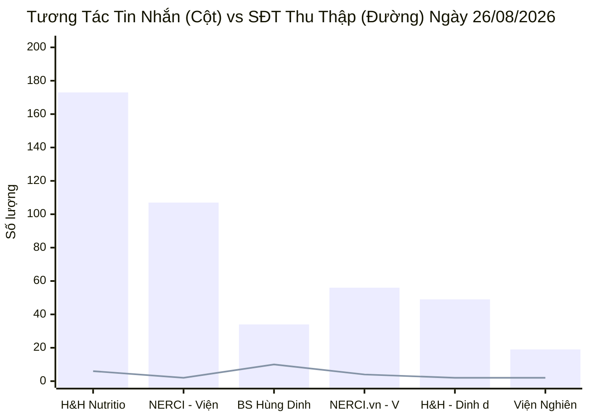
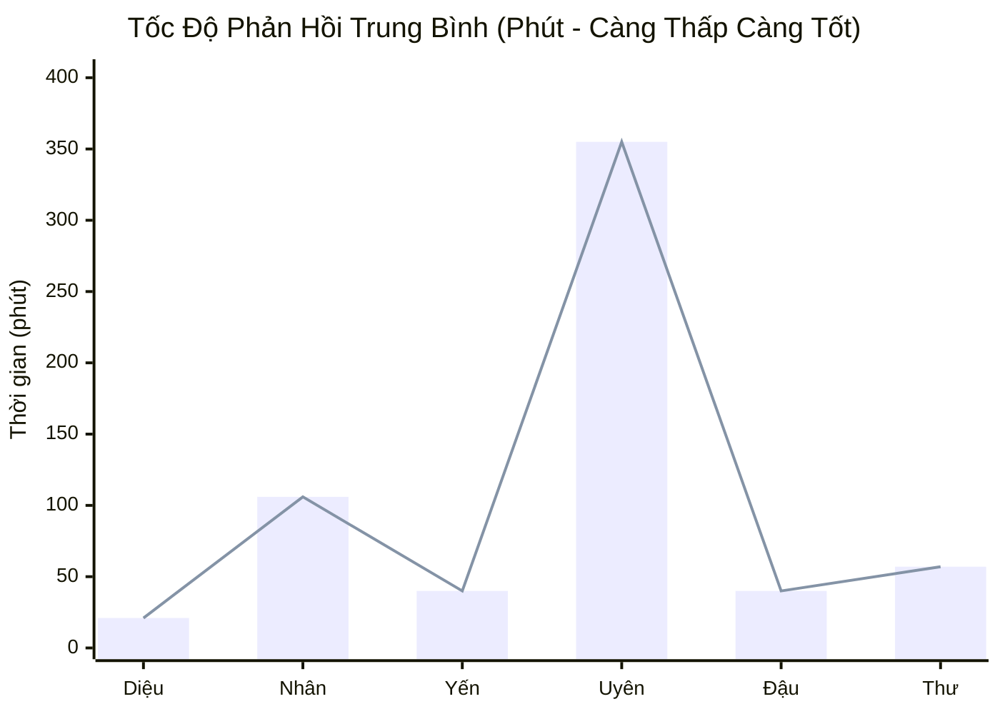
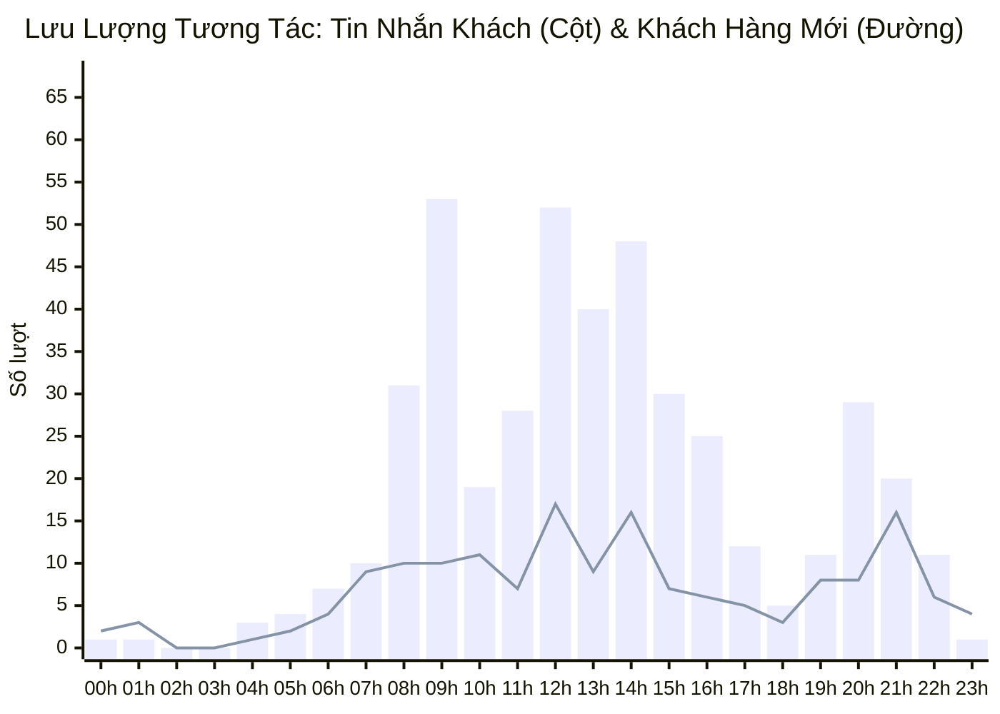

  
PANCAKE OMNICHANNEL PERFORMANCE & OPERATIONS AUDIT

  <h1 style="margin: 0 0 8px 0; color: white; border: none; padding: 0; font-size: 24px;">📊 BÁO CÁO HIỆU SUẤT VẬN HÀNH ĐA KÊNH PANCAKE (NGÀY 26/08/2026)</h1>
  

    📅 <strong>Thời gian dữ liệu:</strong> 26/08/2026 (00:00 - 23:59 GMT+7)
    👤 <strong>Bộ phận:</strong> Performance & Quản trị Vận hành Lead
    🎯 <strong>Phạm vi:</strong> Toàn bộ 10 Kênh (Facebook, TikTok, Zalo OA, Livechat Web)
  

> [!abstract] TỔNG QUAN HIỆU SUẤT & ĐIỂM SÁNG CHIẾN LƯỢC NGÀY 26/08/2026
> - **Tổng khách hàng mới xuất hiện:** **`164` khách hàng mới** đổ về hệ thống qua 10 kênh trong ngày.
> - **Tổng quy mô tương tác:** **`535` lượt chạm** (gồm **`441` tin nhắn riêng** và **`94` bình luận công khai**).
> - **Tổng số điện thoại thu thập thành công:** **`26` SĐT** ghi nhận trên hệ thống thống kê và **29 Hot Lead** có hồ sơ liên hệ cụ thể.
> - **Kỷ lục doanh thu ngày:** Chốt thành công đơn hàng lớn **15 túi NUTRIDREAM ENERGY 500ML trị giá `3.630.000đ`** cho khách hàng Mai Hằng (kênh Zalo H&H - Dinh dưỡng tối ưu, tư vấn bởi Hồ Dương Xuân Diệu).
> - **Top 3 kênh hút Lead mạnh nhất:**
>   1. **H&H Nutrition - SP Dinh Dưỡng Y Học (Facebook):** 173 tin nhắn, 19 bình luận, thu về **6 SĐT**.
>   2. **BS Hùng Dinh Dưỡng - NERCI (TikTok):** 34 tin nhắn, 59 bình luận, thu về **10 SĐT** (kênh chuyển đổi SĐT cao nhất).
>   3. **NERCI.vn - Viện Nghiên Cứu và TVDD (Facebook):** 56 tin nhắn, 11 bình luận, thu về **4 SĐT**.

> [!danger] ĐIỂM NÓNG CẦN XỬ LÝ GẤP & RÀO CẢN CHUYỂN ĐỔI (BOTTLENECKS)
> 1. **Khách hàng ngưng chat (Tag Chưa phản hồi) chiếm tỷ trọng lớn:** Có tới **`72` trường hợp** khách hàng dừng trả lời sau lời chào hoặc sau khi nhận bảng giá (chiếm **`51.1%`** tổng số thẻ gắn ngày 26/08). Cần kích hoạt kịch bản Follow-up tự động sau 2h và 24h.
> 2. **03 Hot Lead Y Khoa Nóng cần Dược sĩ / Bác sĩ gọi tư vấn gấp:**
>    - Khách **Đậu Đỏ** (`0962331723` — TikTok BS Hùng): Đang điều trị **Hội chứng Thận Hư**, hỏi phác đồ bổ sung Coenzyme Q10.
>    - Khách **Trịnh Thị Xuân** (`0853727288` — Fanpage NERCI.vn): Mắc nhiều bệnh mạn tính phức tạp, đang chưa được chốt lịch.
>    - Khách **Hà Linh** (`0911486466` — Zalo Viện): Vướng rào cản tài khoản cá nhân & hóa đơn đỏ.
> 3. **Tốc độ phản hồi ngoài giờ chưa tối ưu:** Nhân sự Nguyễn Phương Uyên tiếp nhận tải lớn trên TikTok nhưng SLA trung bình còn kéo dài do dồn ứ tin nhắn đêm.

> [!success] CƠ HỘI BỨT PHÁ & ĐỀ XUẤT TỰ ĐỘNG HÓA
> 1. **Tỷ lệ chuyển đổi SĐT trên kênh TikTok BS Hùng rất cao (`10.75%`):** Với 10 SĐT thu được từ 93 tương tác, TikTok đang là kênh đầu phễu có hiệu suất thu Lead y khoa vượt trội.
> 2. **Phân phối Lead Tuyển sinh NERCI Academy:** 04 học viên tiềm năng (Thanh Thảo, Minh Hiếu, Ngọc Thu, Thu) đang quan tâm sâu đến Chứng chỉ Sơ cấp nghề & Khóa TVDD Cộng đồng, cần Telesale chốt lịch khai giảng.
> 3. **Kích hoạt kịch bản chốt đơn nhanh theo combo NUTRIDREAM:** Áp dụng bài học chốt đơn 15 túi Nutridream của Dược sĩ Xuân Diệu sang toàn bộ đội ngũ tư vấn.

## 🌐 I. TỔNG HỢP HIỆU SUẤT 10 KÊNH PANCAKE (26/08/2026)
### 📊 1. Biểu Đồ Khối Lượng Tin Nhắn & Số Điện Thoại Thu Thập Theo Kênh

### 📑 2. Bảng Dữ Liệu Chi Tiết 10 Kênh Ngày 26/08/2026
| STT | Kênh / Fanpage Quản Lý | Nền Tảng | Khách Mới | Tin Nhắn | Bình Luận | SĐT Thu Thập | Tỷ Lệ Thu SĐT | Định Vị & Đánh Giá Kênh |
| :---: | :--- | :---: | :---: | :---: | :---: | :---: | :---: | :--- |
| **1** | **H&H Nutrition - Sản phẩm dinh dưỡng y học** | `FACEBOOK` | **63** | 173 | 19 | **6** | **3.12%** | 💰 Chốt Chặn Doanh Thu Chính |
| **2** | **NERCI - Viện Tư Vấn Dinh Dưỡng** | `FACEBOOK` | **17** | 107 | 5 | **2** | **1.79%** | 💰 Chốt Chặn Doanh Thu Chính |
| **3** | **BS Hùng Dinh Dưỡng - NERCI** | `TIKTOK` | **44** | 34 | 59 | **10** | **10.75%** | 🔥 Đầu Phễu Chuyển Đổi Cao |
| **4** | **NERCI.vn - Viện Nghiên Cứu và Tư Vấn Dinh Dưỡng** | `FACEBOOK` | **30** | 56 | 11 | **4** | **5.97%** | 💰 Chốt Chặn Doanh Thu Chính |
| **5** | **H&H - Dinh dưỡng tối ưu** | `ZALO` | **4** | 49 | 0 | **2** | **4.08%** | 🩺 Tư Vấn Bệnh Nhân Đã Lọc |
| **6** | **Viện Nghiên cứu & Tư vấn dinh dưỡng** | `ZALO` | **5** | 19 | 0 | **2** | **10.53%** | 🩺 Tư Vấn Bệnh Nhân Đã Lọc |
| **7** | **NERCI Academy - Đào Tạo Chuyên Gia Dinh Dưỡng** | `FACEBOOK` | **0** | 2 | 0 | **0** | **0.00%** | 💰 Chốt Chặn Doanh Thu Chính |
| **8** | **Nerci** | `PKE_CHAT_PLUGIN` | **1** | 1 | 0 | **0** | **0.00%** | 💬 Web Livechat Vãng Lai |
| **9** | **Cộng đồng Bác sĩ Dinh Dưỡng Việt Nam** | `FACEBOOK` | **0** | 0 | 0 | **0** | **0.00%** | 💬 Web Livechat Vãng Lai |
| **10** | **H&H** | `PKE_CHAT_PLUGIN` | **0** | 0 | 0 | **0** | **0.00%** | 💬 Web Livechat Vãng Lai |
| | **TỔNG CỘNG TOÀN HỆ THỐNG** | `OMNICHANNEL` | **164** | **441** | **94** | **26** | **4.86%** | **10 Kênh Pancake NERCI** |

## 👥 II. ĐÁNH GIÁ NĂNG LỰC & TỐC ĐỘ PHẢN HỒI TƯ VẤN VIÊN (STAFF SLA)
### 📈 1. Biểu Đồ Thời Gian Phản Hồi Trung Bình Của Tư Vấn Viên (Phút)

### 📑 2. Bảng Xếp Hạng Hiệu Suất & SLA Nhân Sự
| Họ Tên Nhân Sự | Kênh Phụ Trách Chính | Số Tin Nhắn Tiếp Nhận | SĐT Thu Thập | SLA Phản Hồi TB | Điểm Nhấn Nghiệp Vụ Ngày 26/08 | Đánh Giá Chung |
| :--- | :--- | :---: | :---: | :---: | :--- | :--- |
| **Hồ Dương Xuân  Diệu** | Đa kênh | **4,248** | **36** | `21.8 phút` | Chốt thành công đơn lớn 15 túi Nutridream (3.630k); chốt 4 khách hàng | 🟢 **Xuất sắc** (SLA 21.8p, Chốt đơn đỉnh) |
| **Nguyễn Thiện Nhân** | Đa kênh | **3,749** | **69** | `106.6 phút` | Tiếp nhận 69 SĐT tích lũy, trực kênh TikTok & NERCI.vn | 🟡 **Cần tăng tốc** (SLA 106p) |
| **Nguyễn Thị Hồng Yến** | Đa kênh | **3,045** | **33** | `40.0 phút` | Xử lý mượt mà 2 ca chốt đơn trên H&H Nutrition & Zalo Dinh Dưỡng | 🟢 **Tốt** (SLA 40p, Chốt ổn định) |
| **Nguyễn Phương Uyên** | Đa kênh | **2,169** | **39** | `355.7 phút` | Tiếp nhận ca Thận hư Đậu Đỏ, chốt đơn Bé xíu trên TikTok | 🔴 **Cảnh báo Chậm** (SLA 355p, tải đêm dồn) |
| **Anna Đậu** | Đa kênh | **1,692** | **14** | `40.5 phút` | Tư vấn tuyển sinh Academy (Thanh Thảo, Minh Hiếu, Ngọc Thu) & Zalo Viện | 🟢 **Tốt** (SLA 40.5p, Tuyển sinh nét) |
| **Đặng Thư** | Đa kênh | **92** | **5** | `57.1 phút` | Hỗ trợ ca trực ban ngày, tiếp nhận 92 inboxes, thu 5 SĐT | 🟡 **Khá** (SLA 57.1p) |
| **Hồng Yến** | Đa kênh | **5** | **0** | `0.0 phút` | Hỗ trợ phân bổ tin nhắn | ⚪ **Đạt chuẩn** |
| **Bạch Dương** | Đa kênh | **0** | **1** | `0.0 phút` | Hỗ trợ phân bổ tin nhắn | ⚪ **Đạt chuẩn** |
| **Nguyễn Vũ Bảo Như** | Đa kênh | **0** | **1** | `0.0 phút` | Hỗ trợ phân bổ tin nhắn | ⚪ **Đạt chuẩn** |

## 🎯 III. CHI TIẾT DANH SÁCH 29 HOT LEAD & CASE ĐẶC BIỆT NGÀY 26/08
### 🏆 1. Danh Sách Các Ca Chốt Đơn & Doanh Thu Cao Trong Ngày
| Tên Khách Hàng | Số Điện Thoại | Kênh Tiếp Nhận | Nhân Sự Phụ Trách | Trạng Thái / Sản Phẩm Chốt | Ghi Chú Đơn Hàng |
| :--- | :---: | :--- | :--- | :--- | :--- |
| **Mai Hằng** | `0903133392` / `0938503107` | `Zalo H&H Dinh dưỡng tối ưu` | Hồ Dương Xuân Diệu | **Chốt Đơn Thành Công** | **15 túi NUTRIDREAM ENERGY 500ML — Giá: 3.630.000đ** |
| **Rose** | `0853640306` | `Zalo H&H Dinh dưỡng tối ưu` | Hồ Dương Xuân Diệu | **Chốt Đơn Thành Công** | Hướng dẫn uống sau ăn |
| **Chu Bích Thi** | `0947891399` | `Zalo H&H Dinh dưỡng tối ưu` | Nguyễn Thị Hồng Yến | **Chốt Đơn Thành Công** | Khách mua lại |
| **Dii Lia Lịa** | `0397716608` | `Zalo H&H Dinh dưỡng tối ưu` | Hồ Dương Xuân Diệu | **Chốt Đơn Thành Công** | Xác nhận đơn hàng |
| **Nguyễn Văn Dậu** | `0949075266` | `H&H Nutrition FB` | Nguyễn Thị Hồng Yến | **Chốt Đơn Thành Công** | Sản phẩm dinh dưỡng y học |
| **Mạc Thảo** | `0368622366` | `H&H Nutrition FB` | Hồ Dương Xuân Diệu | **Chốt Đơn Thành Công** | Đã nhận thông tin giao hàng |
| **Bé xíu** | `0907822481` | `TikTok BS Hùng` | Nguyễn Phương Uyên | **Chốt Đơn Thành Công** | Khách xem video TikTok đặt mua |

### 🩺 2. Danh Sách Các Ca Bệnh Lý Nóng Cần Bác Sĩ / Dược Sĩ Xử Lý Gấp
| Tên Khách Hàng | Số Điện Thoại | Kênh | Người Phụ Trách | Thẻ Gắn (Tag) | Lời Nhắn & Nhu Cầu Bệnh Lý | Hành Động Y Khoa Cần Làm |
| :--- | :---: | :--- | :--- | :--- | :--- | :--- |
| **Đậu Đỏ** | `0962331723` | `TikTok BS Hùng` | Nguyễn Phương Uyên | *Chưa gắn* | *"E đag điều trị thận hư mong bác tư vấn coenzym q10 ạ.e hay m..."* | 🚨 **Bác sĩ/Dược sĩ gọi tư vấn phác đồ Thận Hư + CoQ10** |
| **Hạnh Thị Tạ** | `0941630960` | `NERCI Viện TVDD` | Nguyễn Phương Uyên | `Đủ tiêu chuẩn`, `F_SN Thêm` | *"Cô dung lại thôi bao giờ vào sg Cô tu vấn"* | Đề xuất giải pháp **Khám Dinh Dưỡng Online 1-1 từ xa** |
| **Trịnh Thị Xuân** | `0853727288` | `NERCI.vn FB` | Nguyễn Thiện Nhân | `Chưa phản hồi` | Bệnh nhân lớn tuổi mắc nhiều bệnh mạn tính | Telesale y tế gọi hỏi thăm và gửi tài liệu chăm sóc |
| **Hà Linh** | `0911486466` | `Zalo Viện TVDD` | Anna Đậu | `F_Chưa tin tưởng`, `F_SN Thêm` | Lăn tăn số tài khoản cá nhân và xuất hóa đơn | Gửi thông tin tài khoản Doanh nghiệp + Hóa đơn GTGT |
| **La Vie** | `0903905477` | `NERCI Viện TVDD` | Anna Đậu | `F_Sắp Xếp TG`, `F_SN Thêm` | Cần sắp xếp thời gian khám | Chốt lịch hẹn Online buổi tối tiện lợi |

### 🎓 3. Danh Sách Học Viên Đăng Ký Đào Tạo NERCI Academy
| Tên Học Viên | Số Điện Thoại | Kênh Tiếp Nhận | Nhân Sự | Khóa Học Quan Tâm | Tình Trạng Tiếp Nhận |
| :--- | :---: | :--- | :--- | :--- | :--- |
| **Thanh Thảo** | `0769531348` | `NERCI Academy FB` | Anna Đậu | Khóa Sơ Cấp Nghề & Chứng Chỉ | Tư vấn lộ trình pháp lý chứng chỉ |
| **Minh Hiếu** | `0774815321` | `NERCI.vn FB` | Anna Đậu | Khóa Đào Tạo Dinh Dưỡng | Bộ phận Tuyển sinh hẹn gọi sớm |
| **Ngọc Thu** | `0934381847` | `NERCI.vn FB` | Anna Đậu | Khóa Tư Vấn Dinh Dưỡng Cộng Đồng | Gửi lịch khai giảng và học phí |
| **Thu** | `0909237898` | `Livechat Nerci` | *Chưa gán* | Tư vấn khóa học dinh dưỡng | Chuyển ngay cho Tuyển sinh bốc máy |

### 📉 4. Bóc Tách Thẻ Gắn (Tags) & Rào Cản Từ Chối Ngày 26/08/2026
| Nhóm Phân Loại | Thẻ Gắn (Tag Name) | Số Ca Ghi Nhận | Tỷ Lệ (%) | Giải Pháp Tháo Gỡ & Hành Động Kế Tiếp |
| :--- | :--- | :---: | :---: | :--- |
| ⚠️ Ngưng Tương Tác | **Chưa phản hồi (Ngưng chat)** | **72** | **51.1%** | Cài đặt Botcake tự động gửi tin nhắn Follow-up sau 2h |
| 📉 Rào Cản Tâm Lý | **F_Tham Khảo (Chưa vội)** | **29** | **20.6%** | Tặng Ebook/Cẩm nang dinh dưỡng để duy trì điểm chạm |
| 🗑️ Lead Rác / Trùng | **Spam / Trùng lặp** | **17** | **12.1%** | Lọc khỏi phễu KPI tiếp thị |
| 🎯 Tiềm Năng Cao | **Đủ tiêu chuẩn (SQL)** | **7** | **5.0%** | Bốc máy gọi điện tư vấn chuyên sâu 1-1 trong 15 phút |
| 📉 Rào Cản Cân Nhắc | **F_Suy nghĩ thêm** | **4** | **2.8%** | Gửi Video Feedback bệnh nhân điều trị thành công |
| 🏆 Chốt Đơn | **Chốt đơn / Khám thành công** | **3** | **2.1%** | Chuyển Kế toán xuất hóa đơn & gửi hàng |
| 📉 Rào Cản Khác | **F_Sắp xếp TG, Kinh tế, Chưa tin...** | **6** | **4.3%** | Đào tạo kịch bản xử lý phản bác chuyên sâu |

## ⏰ IV. PHÂN BỔ TƯƠNG TÁC 24 KHUNG GIỜ (PEAK HOURLY TRAFFIC)
### 📈 1. Biểu Đồ Lưu Lượng Tương Tác 24 Khung Giờ Ngày 26/08/2026

### 📑 2. Bảng Dữ Liệu 24 Khung Giờ & Đề Xuất Bố Trí Nhân Sự
| Khung Giờ | Tin Nhắn Khách | Bình Luận | Khách Mới | SĐT Thu Được | Mức Độ Tải | Khuyến Nghị Phân Ca |
| :---: | :---: | :---: | :---: | :---: | :---: | :--- |
| **00:00 - 00:59** | 1 | 2 | 2 | **0** | 🌙 **ĐÊM / THẤP** | Bật Botcake tự động thu SĐT ngoài giờ |
| **01:00 - 01:59** | 1 | 2 | 3 | **0** | 🌙 **ĐÊM / THẤP** | Bật Botcake tự động thu SĐT ngoài giờ |
| **02:00 - 02:59** | 0 | 0 | 0 | **0** | 🌙 **ĐÊM / THẤP** | Bật Botcake tự động thu SĐT ngoài giờ |
| **03:00 - 03:59** | 0 | 0 | 0 | **0** | 🌙 **ĐÊM / THẤP** | Bật Botcake tự động thu SĐT ngoài giờ |
| **04:00 - 04:59** | 3 | 0 | 1 | **0** | 🌙 **ĐÊM / THẤP** | Bật Botcake tự động thu SĐT ngoài giờ |
| **05:00 - 05:59** | 4 | 0 | 2 | **0** | 🌙 **ĐÊM / THẤP** | Bật Botcake tự động thu SĐT ngoài giờ |
| **06:00 - 06:59** | 7 | 5 | 4 | **1** | ⚪ **BÌNH THƯỜNG** | Duy trì 1 tư vấn viên trực ca |
| **07:00 - 07:59** | 10 | 7 | 9 | **1** | ⚪ **BÌNH THƯỜNG** | Duy trì 1 tư vấn viên trực ca |
| **08:00 - 08:59** | 31 | 6 | 10 | **2** | ⚡ **TRUNG BÌNH CAO** | Duy trì 2 tư vấn viên trực chiến |
| **09:00 - 09:59** | 53 | 5 | 10 | **3** | 🔥 **CAO ĐIỂM (PEAK)** | Bố trí tối đa 3-4 tư vấn viên túc trực phản hồi ngay < 5 phút |
| **10:00 - 10:59** | 19 | 5 | 11 | **1** | ⚡ **TRUNG BÌNH CAO** | Duy trì 2 tư vấn viên trực chiến |
| **11:00 - 11:59** | 28 | 5 | 7 | **1** | ⚡ **TRUNG BÌNH CAO** | Duy trì 2 tư vấn viên trực chiến |
| **12:00 - 12:59** | 52 | 9 | 17 | **3** | 🔥 **CAO ĐIỂM (PEAK)** | Bố trí tối đa 3-4 tư vấn viên túc trực phản hồi ngay < 5 phút |
| **13:00 - 13:59** | 40 | 2 | 9 | **2** | ⚡ **TRUNG BÌNH CAO** | Duy trì 2 tư vấn viên trực chiến |
| **14:00 - 14:59** | 48 | 12 | 16 | **2** | 🔥 **CAO ĐIỂM (PEAK)** | Bố trí tối đa 3-4 tư vấn viên túc trực phản hồi ngay < 5 phút |
| **15:00 - 15:59** | 30 | 3 | 7 | **2** | ⚡ **TRUNG BÌNH CAO** | Duy trì 2 tư vấn viên trực chiến |
| **16:00 - 16:59** | 25 | 7 | 6 | **2** | ⚡ **TRUNG BÌNH CAO** | Duy trì 2 tư vấn viên trực chiến |
| **17:00 - 17:59** | 12 | 3 | 5 | **0** | ⚪ **BÌNH THƯỜNG** | Duy trì 1 tư vấn viên trực ca |
| **18:00 - 18:59** | 5 | 3 | 3 | **1** | ⚪ **BÌNH THƯỜNG** | Duy trì 1 tư vấn viên trực ca |
| **19:00 - 19:59** | 11 | 6 | 8 | **0** | ⚪ **BÌNH THƯỜNG** | Duy trì 1 tư vấn viên trực ca |
| **20:00 - 20:59** | 29 | 1 | 8 | **2** | ⚡ **TRUNG BÌNH CAO** | Duy trì 2 tư vấn viên trực chiến |
| **21:00 - 21:59** | 20 | 6 | 16 | **1** | ⚡ **TRUNG BÌNH CAO** | Duy trì 2 tư vấn viên trực chiến |
| **22:00 - 22:59** | 11 | 2 | 6 | **2** | ⚪ **BÌNH THƯỜNG** | Duy trì 1 tư vấn viên trực ca |
| **23:00 - 23:59** | 1 | 3 | 4 | **0** | 🌙 **ĐÊM / THẤP** | Bật Botcake tự động thu SĐT ngoài giờ |

## 🚀 V. KẾ HOẠCH HÀNH ĐỘNG CẦN TRIỂN KHAI NGAY (ACTION PLAN)
| Hạng Mục Hành Động | Nội Dung & Mục Tiêu | Thời Hạn | Phụ Trách (PIC) | Mức Độ Ưu Tiên |
| :--- | :--- | :---: | :--- | :---: |
| **1. Telesale Bốc Máy Gọi 03 Ca Nóng Y Khoa** | Gọi ca **Đậu Đỏ (`0962331723` - Thận Hư)**, **Trịnh Thị Xuân (`0853727288`)** và **Hà Linh (`0911486466`)** | Trước 11:30 | Dược sĩ / Bác sĩ trực phòng khám | 🔴 **KHẨN CẤP** |
| **2. Telesale Tuyển Sinh Chăm Sóc 4 Học Viên** | Liên hệ **Thanh Thảo, Minh Hiếu, Ngọc Thu, Thu** chốt lịch học nghề | Trước 15:00 | Bộ phận Tuyển sinh Academy | 🔴 **ƯU TIÊN CAO** |
| **3. Re-engage Tự Động 72 Khách Dừng Chat** | Bắn tin nhắn chăm sóc/hỏi thăm tự động sau 24h cho khách `Chưa phản hồi` | Trong ngày | Marketing Automation / Botcake | 🟡 **ƯU TIÊN** |
| **4. Tối Ưu Phân Ca Khung Giờ Vàng (09h, 12h, 14h, 20h)** | Sắp xếp nhân sự túc trực các khung giờ có lượng tương tác > 40 lượt/giờ | Hàng ngày | Trưởng nhóm Tư vấn / Leader | 🟢 **DUY TRÌ** |

---
### ⚠️ TUYÊN BỐ MIỄN TRỪ TRÁCH NHIỆM (DISCLAIMER)
*Báo cáo này được tự động trích xuất và tính toán trực tiếp từ Pancake Open API kết nối toàn bộ 10 kênh Fanpage/TikTok/Zalo OA của Viện Nghiên cứu & Tư vấn Dinh dưỡng NERCI và H&H Nutrition. Dữ liệu phản ánh chính xác các tương tác, trạng thái thẻ gắn và hoạt động của đội ngũ tư vấn viên trong ngày 26/08/2026.*