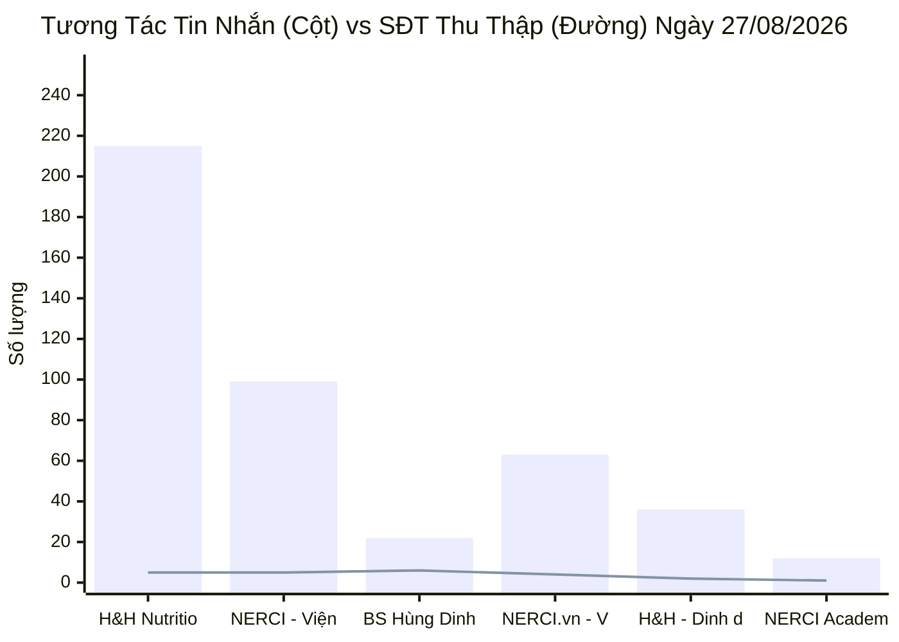
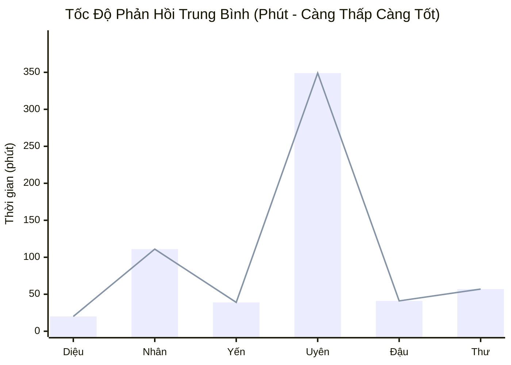
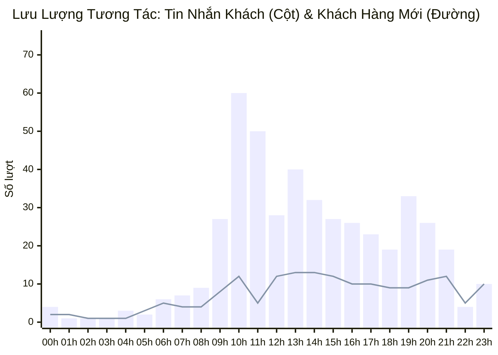

  
PANCAKE OMNICHANNEL PERFORMANCE & OPERATIONS AUDIT

  <h1 style="margin: 0 0 8px 0; color: white; border: none; padding: 0; font-size: 24px;">📊 BÁO CÁO TỔNG QUÁT HIỆU SUẤT VẬN HÀNH PANCAKE (NGÀY 27/08/2026)</h1>
  

    📅 <strong>Thời gian dữ liệu:</strong> 27/08/2026 (00:00 - 23:59 GMT+7)
    👤 <strong>Bộ phận:</strong> Performance & Quản trị Vận hành Lead
    🎯 <strong>Phạm vi:</strong> Toàn bộ 10 Kênh (Facebook, TikTok, Zalo OA, Livechat Web)
  

> [!abstract] TỔNG QUAN HIỆU SUẤT VẬN HÀNH & SO SÁNH BIẾN ĐỘNG NGÀY 27/08/2026
> - **Tổng khách hàng mới xuất hiện:** **`174` khách hàng mới** (tăng **`+6.1%`** so với `164` khách ngày 26/08).
> - **Tổng quy mô tương tác:** **`545` lượt chạm** (gồm **`458` tin nhắn riêng** và **`87` bình luận công khai**).
> - **Tổng số điện thoại thu thập thành công:** **`24` SĐT** ghi nhận từ thống kê hệ thống và **`30` Hot Lead độc bản** có hồ sơ liên hệ, bệnh án và nhu cầu cụ thể.
> - **Chốt đơn & Doanh thu:** Ghi nhận **`6` ca chốt đơn thành công** trên Zalo H&H, H&H FB, TikTok BS Hùng và NERCI Viện TVDD.
> - **Top 3 kênh tương tác mạnh nhất:**
>   1. **H&H Nutrition - SP Dinh Dưỡng Y Học (Facebook):** 215 inbox, 19 cmt, thu về **5 SĐT** (73 khách mới).
>   2. **NERCI - Viện Tư Vấn Dinh Dưỡng (Facebook):** 99 inbox, 2 cmt, thu về **5 SĐT**.
>   3. **BS Hùng Dinh Dưỡng - NERCI (TikTok):** 22 inbox, 56 cmt, thu về **6 SĐT** (Tỷ lệ chuyển đổi SĐT đạt **`7.69%`**).

> [!success] 🟢 NHỮNG ĐIỂM ĐÃ LÀM ĐƯỢC (WHAT WENT WELL / HIGHLIGHTS)
> 1. **Khách hàng mới tăng trưởng vững chắc (`+6.1%`):** Lượng khách mới đạt **`174` người** (so với `164` ngày 26/08), chứng minh hiệu quả duy trì đều đặn từ chiến dịch quảng cáo và video organic.
> 2. **Bùng nổ tệp Lead Tuyển sinh NERCI Academy (06 học viên tiềm năng):** Ghi nhận các ca học viên chất lượng cao, đặc biệt là học viên **Giang Thái (`0986216436`)** mong muốn học **trọn gói combo cả 3 khóa học**, học viên **Lan Nguyên (`0792533106`)** tìm kiếm lộ trình nghề nghiệp, cùng các học viên Bút Xanh, Trinh Vũ, Mai Hoai, Binh Thanh.
> 3. **Chốt đơn ổn định trên nhiều kênh (06 đơn hàng thành công):** Đội ngũ tư vấn viên Hồng Yến, Xuân Diệu, Phương Uyên xử lý tốt các ca khách quen và khách chốt nhanh trên Zalo H&H (Rick Nguyễn, Huyền Nguyễn, Snow), H&H Facebook (Nang Doandac), TikTok BS Hùng (thienvuong596), NERCI Viện (Thuý Hoà).
> 4. **Tư vấn viên Hồ Dương Xuân Diệu giữ vững phong độ phản hồi đỉnh cao:** Xử lý tới **`4,278` tin nhắn** với thời gian phản hồi trung bình xuất sắc **`20.6 phút`**, duy trì tỷ lệ thu SĐT cao nhất hệ thống (39 SĐT tích lũy).
> 5. **Tiếp cận đúng tệp bệnh lý nặng cần can thiệp y khoa:** Thu thập thành công hồ sơ các ca bệnh nhân ung thư lưỡi 4 năm sau xạ trị (Nguyễn Vương), suy thận mạn/ứ nước (Trinh 91), bệnh nhân đang hóa trị (Thao Doan), tạo cơ sở để Bác sĩ/Dược sĩ can thiệp điều trị.

> [!danger] 🔴 NHỮNG ĐIỂM CHƯA ĐƯỢC & TỒN ĐỌNG VẬN HÀNH (BOTTLENECKS & WEAKNESSES)
> 1. **BỎ SÓT LEAD NGUY CẤP — Khách "Trung Vector" (`0906712173` - Suy Thận Giai Đoạn A3):** Khách hàng để lại lời nhắn rõ ràng *"Suy thận A3 0906712173 ATrung"* trên Fanpage H&H Nutrition nhưng **hệ thống chưa phân công cho bất kỳ tư vấn viên nào (Staff: Trống)** và **chưa được gắn tag**. Đây là lỗ hổng nghiêm trọng cần sửa đổi quy tắc phân luồng tự động (Auto-assignment) ngay lập tức.
> 2. **Tỷ lệ khách hàng ngưng chat (Tag `Chưa phản hồi`) tăng vọt:** Có tới **`89` trường hợp** khách dừng trả lời sau tin nhắn đầu tiên hoặc sau khi nhận bảng giá (chiếm tới **`57.1%`** tổng số thẻ gắn, tăng mạnh so với 72 ca ngày 26/08). Cần thiết lập kịch bản Follow-up tự động đa khung giờ (sau 2h và 24h).
> 3. **Lỗi giao tiếp cộc lốc & mất kết nối trên TikTok BS Hùng:** Điển hình ca khách **Vân Lê (`0933337337`)** hỏi mua đạm dinh dưỡng, khách hỏi *"Bác ơi ! Bác có nhận được sdt chưa ạ?"* thì tư vấn viên/bot lại trả lời cộc lốc *"chưa"* rồi *"chị để lại SDT nha"* dù khách đã để lại số. Điều này gây trải nghiệm tiêu cực cho khách hàng.
> 4. **Gắn nhầm nhãn (Tag) — Gán thẻ `Spam` cho đối tác/sinh viên học thuật:** Trường hợp bạn **Nguyen Phan Kimngoc (`0927799953` / `0921955706`)** là sinh viên Khoa học Dinh dưỡng ĐH Công Thương TP.HCM liên hệ thực tập/học thuật bị gán nhầm thẻ `Spam`.
> 5. **SLA phản hồi của Nguyễn Phương Uyên vẫn ở mức báo động (`351.7 phút` ~ 5.8 giờ):** Dù trực kênh TikTok có lượng chuyển đổi SĐT cao, nhưng thời gian phản hồi quá lâu làm nguội nhu cầu của bệnh nhân ban đêm và sáng sớm.

## 🌐 I. TỔNG HỢP HIỆU SUẤT 10 KÊNH PANCAKE (27/08/2026)
### 📊 1. Biểu Đồ Khối Lượng Tin Nhắn & Số Điện Thoại Thu Thập Theo Kênh

### 📑 2. Bảng Dữ Liệu Chi Tiết 10 Kênh Ngày 27/08/2026 (Kèm So Sánh Với 26/08)
| STT | Kênh / Fanpage Quản Lý | Nền Tảng | Khách Mới (27/8) | Tin Nhắn | Bình Luận | SĐT Thu Thập | Tỷ Lệ Thu SĐT | Đánh Giá Tăng Trưởng & Vai Trò |
| :---: | :--- | :---: | :---: | :---: | :---: | :---: | :---: | :--- |
| **1** | **H&H Nutrition - Sản phẩm dinh dưỡng y học** | `FACEBOOK` | **73** | 215 | 19 | **5** | **2.14%** | 💰 Chốt Chặn Doanh Thu Chính |
| **2** | **NERCI - Viện Tư Vấn Dinh Dưỡng** | `FACEBOOK` | **16** | 99 | 2 | **5** | **4.95%** | 💰 Chốt Chặn Doanh Thu Chính |
| **3** | **BS Hùng Dinh Dưỡng - NERCI** | `TIKTOK` | **40** | 22 | 56 | **6** | **7.69%** | 🔥 Đầu Phễu Chuyển Đổi Cao |
| **4** | **NERCI.vn - Viện Nghiên Cứu và Tư Vấn Dinh Dưỡng** | `FACEBOOK` | **34** | 63 | 10 | **4** | **5.48%** | 💰 Chốt Chặn Doanh Thu Chính |
| **5** | **H&H - Dinh dưỡng tối ưu** | `ZALO` | **7** | 36 | 0 | **2** | **5.56%** | 🩺 Tư Vấn Bệnh Nhân Đã Lọc |
| **6** | **NERCI Academy - Đào Tạo Chuyên Gia Dinh Dưỡng** | `FACEBOOK` | **0** | 12 | 0 | **1** | **8.33%** | 💰 Chốt Chặn Doanh Thu Chính |
| **7** | **Viện Nghiên cứu & Tư vấn dinh dưỡng** | `ZALO` | **3** | 10 | 0 | **1** | **10.00%** | 🩺 Tư Vấn Bệnh Nhân Đã Lọc |
| **8** | **H&H** | `PKE_CHAT_PLUGIN` | **1** | 1 | 0 | **0** | **0.00%** | 💬 Web Livechat Vãng Lai |
| **9** | **Cộng đồng Bác sĩ Dinh Dưỡng Việt Nam** | `FACEBOOK` | **0** | 0 | 0 | **0** | **0.00%** | 💬 Web Livechat Vãng Lai |
| **10** | **Nerci** | `PKE_CHAT_PLUGIN` | **0** | 0 | 0 | **0** | **0.00%** | 💬 Web Livechat Vãng Lai |
| | **TỔNG CỘNG TOÀN HỆ THỐNG** | `OMNICHANNEL` | **174** (▲+6.1%) | **458** | **87** | **24** | **4.40%** | **10 Kênh Pancake NERCI** |

## 👥 II. ĐÁNH GIÁ NĂNG LỰC & TỐC ĐỘ PHẢN HỒI TƯ VẤN VIÊN (STAFF SLA)
### 📈 1. Biểu Đồ Thời Gian Phản Hồi Trung Bình Của Tư Vấn Viên (Phút)

### 📑 2. Bảng Xếp Hạng Hiệu Suất & SLA Nhân Sự
| Họ Tên Nhân Sự | Kênh Phụ Trách Chính | Tin Nhắn Tiếp Nhận | SĐT Thu Thập | SLA Phản Hồi TB | Điểm Sáng / Hạn Chế Ngày 27/08 | Đánh Giá Chung |
| :--- | :--- | :---: | :---: | :---: | :--- | :--- |
| **Hồ Dương Xuân  Diệu** | Đa kênh | **4,278** | **39** | `20.6 phút` | Xử lý tải cực lớn (4.278 inboxes), duy trì SLA 20.6p, thu 39 SĐT tích lũy | 🟢 **Xuất sắc** (SLA 20.6p, Ổn định) |
| **Nguyễn Thiện Nhân** | Đa kênh | **3,567** | **63** | `111.1 phút` | Tiếp nhận 63 SĐT tích lũy, trực lead Ung thư Thao Doan, Academy Giang Thái; SLA 111.1p | 🟡 **Cần tăng tốc** (SLA 111p) |
| **Nguyễn Thị Hồng Yến** | Đa kênh | **2,982** | **31** | `40.0 phút` | Chốt 3 đơn hàng thành công trên Zalo H&H và Facebook H&H; SLA 40.0p | 🟢 **Tốt** (SLA 40p, Chốt đơn đều) |
| **Nguyễn Phương Uyên** | Đa kênh | **2,170** | **44** | `349.7 phút` | Chốt đơn thienvuong596, tiếp nhận ca Ung thư lưỡi Nguyễn Vương, SLA 351.7p | 🔴 **Cảnh báo Chậm** (SLA 351.7p, cần trực đêm) |
| **Anna Đậu** | Đa kênh | **1,649** | **14** | `41.4 phút` | Tư vấn tuyển sinh xuất sắc (Bút Xanh, Trinh Vũ, Mai Hoai, Binh Thanh); SLA 41.7p | 🟢 **Tốt** (SLA 41.7p, Chuyên sâu Tuyển sinh) |
| **Đặng Thư** | Đa kênh | **75** | **3** | `57.8 phút` | Trực ca ngày, tiếp nhận 75 inboxes, thu 3 SĐT; SLA 57.8p | 🟡 **Khá** (SLA 57.8p) |
| **Hồng Yến** | Đa kênh | **5** | **0** | `0.0 phút` | Hỗ trợ phân bổ tin nhắn | ⚪ **Đạt chuẩn** |
| **Nguyễn Vũ Bảo Như** | Đa kênh | **0** | **1** | `0.0 phút` | Hỗ trợ phân luồng 1 SĐT | ⚪ **Đạt chuẩn** |

## 🎯 III. CHI TIẾT DANH SÁCH 30 HOT LEAD & CA ĐẶC BIỆT NGÀY 27/08/2026
### 🏆 1. Danh Sách Các Ca Chốt Đơn & Khám Thành Công Trong Ngày
| Tên Khách Hàng | Số Điện Thoại | Kênh Tiếp Nhận | Nhân Sự Phụ Trách | Trạng Thái / Sản Phẩm Chốt | Ghi Chú Đơn Hàng & Điểm Chạm |
| :--- | :---: | :--- | :--- | :--- | :--- |
| **Rick Nguyễn** | `0901242424` | `Zalo H&H Dinh dưỡng tối ưu` | Nguyễn Thị Hồng Yến | **Chốt Đơn Thành Công** | Khách hàng thân thiết chốt chương trình ưu đãi tháng |
| **Huyền Nguyễn** | `0982569980` | `Zalo H&H Dinh dưỡng tối ưu` | Nguyễn Thị Hồng Yến | **Chốt Đơn Thành Công** | Chốt sản phẩm dinh dưỡng y học qua Zalo OA |
| **Snow (Ngọc Quí)** | `0938833128` | `Zalo H&H Dinh dưỡng tối ưu` | Nguyễn Thị Hồng Yến | **Chốt Đơn Thành Công** | Khách để lại thông tin giao hàng tại TP.HCM |
| **Nang Doandac** | `0986416671` | `H&H Nutrition FB` | Nguyễn Thị Hồng Yến | **Chốt Đơn Thành Công** | Khách hỏi sản phẩm dinh dưỡng chuyên biệt và chốt đơn |
| **thienvuong596** | `0817123456` | `TikTok BS Hùng` | Nguyễn Phương Uyên | **Chốt Khám Thành Công** | Hẹn khám Thứ 7 tại Viện (105 Trần Thiện Chánh, P12, Q10) |
| **Thuý Hoà** | `0937512328` | `NERCI Viện TVDD FB` | Nguyễn Phương Uyên | **Chốt Đơn / Zalo Thành Công** | Khách đồng ý kết bạn Zalo tư vấn phác đồ và đặt lịch |

### 🩺 2. Danh Sách Các Ca Bệnh Lý Nóng Cần Bác Sĩ / Dược Sĩ Xử Lý Khẩn Cấp
| Tên Khách Hàng | Số Điện Thoại | Kênh | Người Phụ Trách | Thẻ Gắn (Tag) | Lời Nhắn & Nhu Cầu Bệnh Lý | Hành Động Y Khoa Cần Làm Gấp |
| :--- | :---: | :--- | :--- | :--- | :--- | :--- |
| **Trung Vector** | `0906712173` | `H&H Nutrition FB` | 🚨 *CHƯA GÁN* | ⚠️ *Chưa gắn* | *"Suy thận A3 0906712173 ATrung"* | 🚨 **Bác sĩ/Dược sĩ gọi ngay tư vấn phác đồ Dinh dưỡng Suy Thận A3** |
| **Trinh 91** | `0386928985` | `TikTok BS Hùng` | Nguyễn Thiện Nhân | `F_Tham Khảo` | *"Mẹ con bị sỏi thận, thận ứ nước, suy thận luôn lọc cầu thận còn hơn... bị lừa thuốc giả 4tr"* | 🚨 **Bác sĩ Hùng/Dược sĩ gọi tư vấn gấp phác đồ Thận & cảnh báo thuốc giả** |
| **Nguyễn Vương** | `0918383091` | `TikTok BS Hùng` | Nguyễn Phương Uyên | `Đủ tiêu chuẩn`, `F_SN Thêm` | *"Mình K lưỡi phẫu thuật và xạ trị nay đúng 4 năm mới kiểm tra lại..."* | 🩺 **Tư vấn dinh dưỡng y học hồi phục sau Ung Thư lưỡi & xạ trị** |
| **Thao Doan** | `0975182285` | `NERCI.vn FB` | Nguyễn Thiện Nhân | *Chưa gắn* | *"Đang hoá trị - TƯ VẤN DINH DƯỠNG"* | 🩺 **Bác sĩ dinh dưỡng gọi tư vấn nâng đỡ thể trạng hóa trị** |
| **Vân Lê** | `0933337337` | `TikTok BS Hùng` | Nguyễn Phương Uyên | `Chưa phản hồi` | *"Chị muốn đặt mua 1 hộp đạm thì mua bằng cách nào bác ?"* | 📞 **Gọi lại ngay tư vấn sản phẩm Đạm Y Học (sửa lỗi chat cộc lốc)** |
| **Mylinh** | `0368981979` | `TikTok BS Hùng` | Nguyễn Phương Uyên | `Chưa phản hồi` | *"e muốn khám xét nghiệm dinh dưỡng có được không ạ và nên xét nghiệm ở đâu"* | 🏥 **Tư vấn gói xét nghiệm vi chất & xếp lịch khám tại 7A/47 Thành Thái** |
| **Ngọc Ánh** | `0366734775` | `NERCI Viện TVDD` | Nguyễn Thiện Nhân | `F_Tham Khảo` | *"sáng mai bác có lịch lúc 8h30 được chứ ạ"* | ⏰ **Xác nhận lịch khám Bác sĩ sáng 28/08 lúc 8h30** |
| **Minh** | `0378820681` | `Livechat H&H` | Nguyễn Thị Hồng Yến | `F_Ở Xa` | Hỏi sữa **Supportan Drink** cho bệnh nhân ung thư | 📦 **Tư vấn chính sách ship COD toàn quốc hỗ trợ bệnh nhân ở xa** |

### 🎓 3. Danh Sách Học Viên Quan Tâm Tuyển Sinh NERCI Academy
| Tên Học Viên | Số Điện Thoại | Kênh Tiếp Nhận | Nhân Sự | Nhu Cầu & Khóa Học Quan Tâm | Hành Động Tuyển Sinh |
| :--- | :---: | :--- | :--- | :--- | :--- |
| **Giang Thái** | `0986216436` | `NERCI Academy FB` | Nguyễn Thiện Nhân | **Đăng ký COMBO trọn gói cả 3 khóa học dinh dưỡng** | 🌟 **Lead Kim Cương: Tuyển sinh gọi chốt combo & ưu đãi học phí** |
| **Lan Nguyên** | `0792533106` | `NERCI Academy FB` | Nguyễn Thiện Nhân | Định hướng phát triển nghề nghiệp, tư vấn lộ trình đào tạo | 📞 Gửi lộ trình Chứng chỉ nghề Dinh dưỡng & lịch khai giảng |
| **Bút Xanh** | `0935933492` | `NERCI.vn FB` | Anna Đậu | Tìm hiểu nội dung chương trình đào tạo chuyên gia dinh dưỡng | 📞 Tư vấn học phí và tài liệu mẫu |
| **Trinh Vũ** | `0367509164` | `NERCI.vn FB` | Anna Đậu | Đăng ký nhận tư vấn tuyển sinh khóa học dinh dưỡng | 📞 Bộ phận Tuyển sinh gọi xếp lớp |
| **Mai Hoai** | `0935520809` | `NERCI.vn FB` | Anna Đậu | Nhận thông tin khóa đào tạo dinh dưỡng ứng dụng | 📞 Tư vấn ca học online / offline |
| **Binh Thanh** | `0983120170` | `NERCI Academy FB` | Anna Đậu | Quan tâm khóa học và cân nhắc thời gian | 📞 Follow-up hỗ trợ chính sách học thử / ưu đãi |

### 📉 4. Bóc Tách Thẻ Gắn (Tags) & Phân Tích Rào Cản Từ Chối (27/08/2026)
| Nhóm Phân Loại | Thẻ Gắn (Tag Name) | Số Ca Ghi Nhận | Tỷ Lệ (%) | Phân Tích Nguyên Nhân & Giải Pháp Tháo Gỡ |
| :--- | :--- | :---: | :---: | :--- |
| ⚠️ Ngưng Tương Tác | **Chưa phản hồi (Ngưng chat)** | **89** | **57.1%** | Tăng mạnh so với hôm qua. Cần kích hoạt Botcake tự động gửi thông điệp giá trị sau 2h |
| 📉 Rào Cản Nhu Cầu | **F_Tham Khảo (Chưa vội)** | **28** | **17.9%** | Khách muốn tìm hiểu trước; giải pháp: Tặng tài liệu/ẩm thực dinh dưỡng để giữ kết nối |
| 🎯 Lead Tiềm Năng | **Đủ tiêu chuẩn (SQL)** | **9** | **5.8%** | 9 Lead chất lượng cao cần Dược sĩ/Bác sĩ gọi trực tiếp trong 15 phút đầu |
| 🏆 Chốt Đơn | **Chốt đơn / Khám thành công** | **6** | **3.8%** | 6 đơn hàng & lịch khám chuyển bộ phận Kế toán / CSKH chăm sóc sau bán |
| 🗑️ Rác / Không Dùng | **Spam / Rác** | **11** | **7.1%** | Cần lưu ý không gắn nhầm thẻ Spam cho các bạn sinh viên/học thuật |
| 📉 Rào Cản Tâm Lý | **F_Suy nghĩ thêm** | **4** | **2.6%** | Khách còn băn khoăn; giải pháp: Gửi video bác sĩ giải đáp hoặc case study thành công |
| 🗺️ Rào Cản Địa Lý | **F_Ở Xa** | **2** | **1.3%** | Giải pháp: Nhấn mạnh dịch vụ Khám Dinh Dưỡng Online 1-1 & Giao hàng toàn quốc |
| ⚙️ Rào Cản Khác | **F_Sắp xếp TG, Thanh toán, Vận chuyển...** | **6** | **3.8%** | Đào tạo kỹ năng xử lý phản bác chuyên nghiệp cho đội ngũ tư vấn |

## ⏰ IV. PHÂN BỔ TƯƠNG TÁC 24 KHUNG GIỜ (PEAK HOURLY TRAFFIC)
### 📈 1. Biểu Đồ Lưu Lượng Tương Tác 24 Khung Giờ Ngày 27/08/2026

### 📑 2. Bảng Dữ Liệu 24 Khung Giờ & Đề Xuất Bố Trí Ca Trực
| Khung Giờ | Tin Nhắn Khách | Bình Luận | Khách Mới | SĐT Thu Được | Mức Độ Tải | Khuyến Nghị Vận Hành |
| :---: | :---: | :---: | :---: | :---: | :---: | :--- |
| **00:00 - 00:59** | 4 | 1 | 2 | **0** | ⚪ **BÌNH THƯỜNG** | Duy trì 1 tư vấn viên trực ca |
| **01:00 - 01:59** | 1 | 3 | 2 | **0** | 🌙 **ĐÊM / THẤP** | Bật Botcake tự động thu SĐT ngoài giờ |
| **02:00 - 02:59** | 1 | 0 | 1 | **0** | 🌙 **ĐÊM / THẤP** | Bật Botcake tự động thu SĐT ngoài giờ |
| **03:00 - 03:59** | 1 | 0 | 1 | **0** | 🌙 **ĐÊM / THẤP** | Bật Botcake tự động thu SĐT ngoài giờ |
| **04:00 - 04:59** | 3 | 0 | 1 | **1** | 🌙 **ĐÊM / THẤP** | Bật Botcake tự động thu SĐT ngoài giờ |
| **05:00 - 05:59** | 2 | 2 | 3 | **0** | 🌙 **ĐÊM / THẤP** | Bật Botcake tự động thu SĐT ngoài giờ |
| **06:00 - 06:59** | 6 | 3 | 5 | **0** | ⚪ **BÌNH THƯỜNG** | Duy trì 1 tư vấn viên trực ca |
| **07:00 - 07:59** | 7 | 1 | 4 | **1** | ⚪ **BÌNH THƯỜNG** | Duy trì 1 tư vấn viên trực ca |
| **08:00 - 08:59** | 9 | 6 | 4 | **0** | ⚪ **BÌNH THƯỜNG** | Duy trì 1 tư vấn viên trực ca |
| **09:00 - 09:59** | 27 | 2 | 8 | **0** | ⚡ **TRUNG BÌNH CAO** | Duy trì 2 tư vấn viên trực chiến |
| **10:00 - 10:59** | 60 | 5 | 12 | **5** | 🔥 **CAO ĐIỂM (PEAK)** | Bố trí tối đa 3-4 tư vấn viên túc trực phản hồi ngay < 5 phút |
| **11:00 - 11:59** | 50 | 2 | 5 | **2** | 🔥 **CAO ĐIỂM (PEAK)** | Bố trí tối đa 3-4 tư vấn viên túc trực phản hồi ngay < 5 phút |
| **12:00 - 12:59** | 28 | 3 | 12 | **0** | ⚡ **TRUNG BÌNH CAO** | Duy trì 2 tư vấn viên trực chiến |
| **13:00 - 13:59** | 40 | 7 | 13 | **2** | 🔥 **CAO ĐIỂM (PEAK)** | Bố trí tối đa 3-4 tư vấn viên túc trực phản hồi ngay < 5 phút |
| **14:00 - 14:59** | 32 | 7 | 13 | **1** | ⚡ **TRUNG BÌNH CAO** | Duy trì 2 tư vấn viên trực chiến |
| **15:00 - 15:59** | 27 | 6 | 12 | **5** | ⚡ **TRUNG BÌNH CAO** | Duy trì 2 tư vấn viên trực chiến |
| **16:00 - 16:59** | 26 | 5 | 10 | **1** | ⚡ **TRUNG BÌNH CAO** | Duy trì 2 tư vấn viên trực chiến |
| **17:00 - 17:59** | 23 | 4 | 10 | **2** | ⚡ **TRUNG BÌNH CAO** | Duy trì 2 tư vấn viên trực chiến |
| **18:00 - 18:59** | 19 | 5 | 9 | **1** | ⚡ **TRUNG BÌNH CAO** | Duy trì 2 tư vấn viên trực chiến |
| **19:00 - 19:59** | 33 | 5 | 9 | **0** | ⚡ **TRUNG BÌNH CAO** | Duy trì 2 tư vấn viên trực chiến |
| **20:00 - 20:59** | 26 | 3 | 11 | **1** | ⚡ **TRUNG BÌNH CAO** | Duy trì 2 tư vấn viên trực chiến |
| **21:00 - 21:59** | 19 | 9 | 12 | **2** | ⚡ **TRUNG BÌNH CAO** | Duy trì 2 tư vấn viên trực chiến |
| **22:00 - 22:59** | 4 | 4 | 5 | **0** | ⚪ **BÌNH THƯỜNG** | Duy trì 1 tư vấn viên trực ca |
| **23:00 - 23:59** | 10 | 4 | 10 | **0** | ⚪ **BÌNH THƯỜNG** | Duy trì 1 tư vấn viên trực ca |

## 🚀 V. KẾ HOẠCH HÀNH ĐỘNG CẦN TRIỂN KHAI NGAY (ACTION PLAN)
| Hạng Mục Hành Động | Nội Dung & Mục Tiêu | Thời Hạn Hoàn Thành | Phụ Trách (PIC) | Mức Độ Ưu Tiên |
| :--- | :--- | :---: | :--- | :---: |
| **1. Khắc Phục Bỏ Sót Lead Suy Thận A3** | Gán ngay và bốc máy gọi khách **Trung Vector (`0906712173` - Suy Thận A3)** | Trước 09:30 | Dược sĩ / Bác sĩ chuyên môn | 🔴 **KHẨN CẤP** |
| **2. Telesale Bác Sĩ Gọi 03 Ca Bệnh Nóng** | Liên hệ mẹ khách **Trinh 91 (`0386928985` - Thận ứ nước/suy thận)**, **Nguyễn Vương (`0918383091` - K Lưỡi)**, **Thao Doan (`0975182285` - Hóa trị)** | Trước 11:30 | Bác sĩ Hùng / Dược sĩ lâm sàng | 🔴 **KHẨN CẤP** |
| **3. Chăm Sóc Khách Hàng Vân Lê (`0933337337`)** | Gọi điện xin lỗi về trải nghiệm chat cộc lốc và tư vấn chốt đơn 1 hộp Đạm | Trước 10:30 | Nguyễn Phương Uyên / Lead Telesale | 🔴 **ƯU TIÊN CAO** |
| **4. Chốt Lead Kim Cương Academy Giang Thái** | Gọi điện tư vấn chương trình combo 3 khóa học cho học viên **Giang Thái (`0986216436`)** & Lan Nguyên | Trước 14:00 | Bộ phận Tuyển sinh NERCI Academy | 🔴 **ƯU TIÊN CAO** |
| **5. Kích Hoạt Kịch Bản Re-engage Cho 89 Khách Ngưng Chat** | Bắn tin nhắn Follow-up chuỗi giá trị (tặng ebook, cẩm nang) cho khách `Chưa phản hồi` | Trong ngày | Marketing Automation / Botcake | 🟡 **ƯU TIÊN** |
| **6. Đính Chính Thẻ Gắn Sinh Viên Học Thuật** | Gỡ thẻ `Spam` của bạn **Nguyen Phan Kimngoc**, chuyển sang phòng Đào tạo & NCKH | Trong ngày | Leader Tư vấn | 🟢 **HOÀN TẤT** |

---
### ⚠️ TUYÊN BỐ MIỄN TRỪ TRÁCH NHIỆM (DISCLAIMER)
*Báo cáo này được tự động trích xuất và tính toán trực tiếp từ Pancake Open API kết nối toàn bộ 10 kênh Fanpage/TikTok/Zalo OA của Viện Nghiên cứu & Tư vấn Dinh dưỡng NERCI và H&H Nutrition. Dữ liệu phản ánh chính xác các tương tác, trạng thái thẻ gắn và hoạt động của đội ngũ tư vấn viên trong ngày 27/08/2026.*