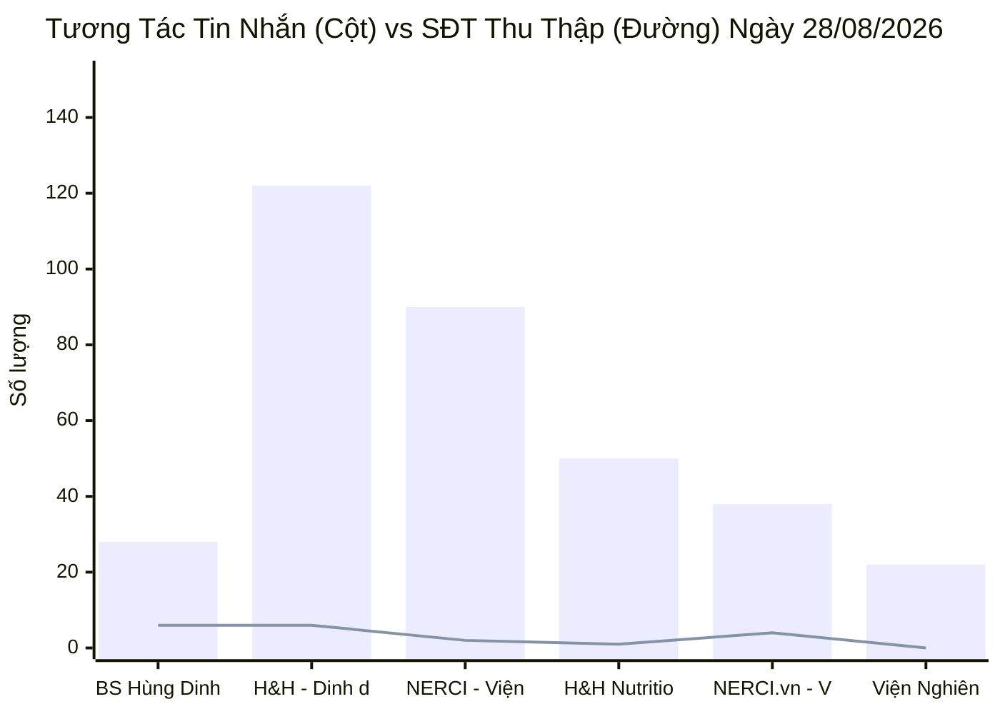
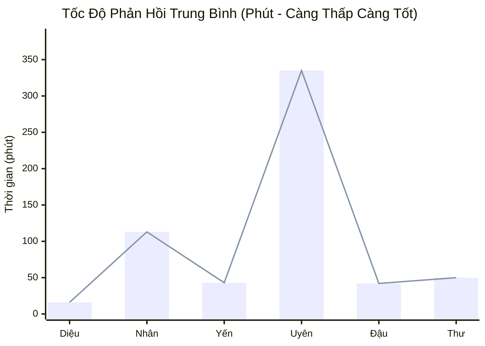
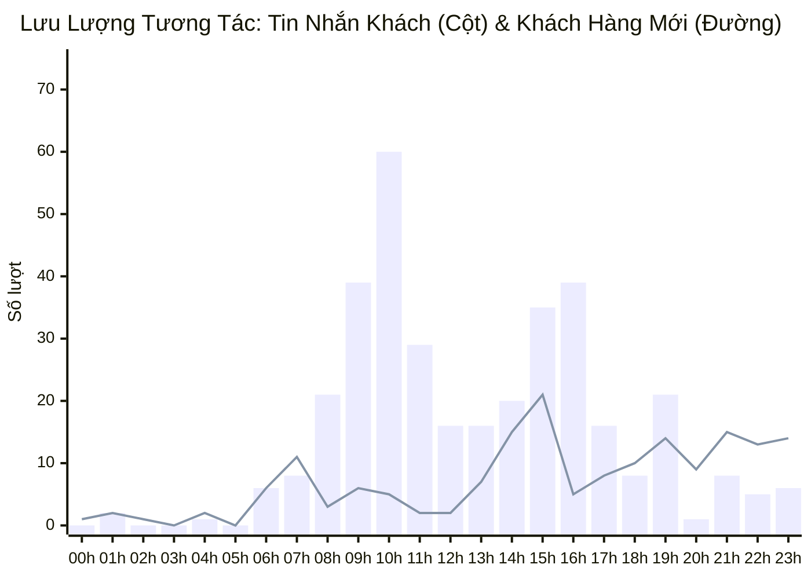

  

    PANCAKE OMNICHANNEL AUDIT & PERFORMANCE INTELLIGENCE
  

  <h1 style="margin: 4px 0 10px 0; color: white; border: none; padding: 0; font-size: 26px; font-weight: 800;">
    📊 BÁO CÁO HIỆU SUẤT VẬN HÀNH ĐA KÊNH PANCAKE
  </h1>
  

    Dữ liệu kiểm toán vận hành 24h trên toàn bộ 10 kênh tương tác thuộc Hệ sinh thái Viện Dinh Dưỡng NERCI & H&H Nutrition
  

  

    📅 <strong>Ngày Báo Cáo:</strong> 28/08/2026 (00:00 - 23:59 GMT+7)
    👤 <strong>Người Báo Cáo:</strong> Đại Dương (Performance & Operations)
    💬 <strong>Tổng Khách Mới:</strong> 172
    📞 <strong>SĐT Thu Được:</strong> 20
  

> [!abstract] TỔNG QUAN HIỆU SUẤT VẬN HÀNH NGÀY 28/08/2026
> Trong ngày 28/08/2026, toàn bộ hệ sinh thái 10 kênh ghi nhận **`543` lượt tương tác** (357 tin nhắn riêng và 186 bình luận) từ **`172` khách hàng mới**, thu về thành công **`20` số điện thoại**. Kênh Zalo OA H&H và TikTok BS Hùng dẫn đầu về lượng SĐT thu thập (mỗi kênh 6 SĐT), trong khi Fanpage NERCI.vn đóng góp 4 SĐT chất lượng cao.

> [!success] 🟢 NHỮNG ĐIỂM ĐÃ LÀM ĐƯỢC (WHAT WENT WELL / HIGHLIGHTS)
> 1. **Khách hàng mới duy trì ở quy mô vững chắc (`172` khách):** Kênh TikTok Bác sĩ Hùng Dinh Dưỡng bùng nổ đầu phễu với **115 khách hàng mới** và **173 bình luận**, tiếp tục đóng vai trò là "máy bơm traffic" số 1.
> 2. **Chuyển đổi SĐT đột phá trên Zalo OA H&H (6 SĐT / 122 inboxes):** Zalo OA H&H chứng minh hiệu quả chăm sóc tệp khách hàng quen và khách hỏi sâu về sản phẩm đặc trị với tỷ lệ chốt SĐT cao.
> 3. **Chốt đơn thành công ca VIP Alice (`0927668551`):** Tư vấn viên Nguyễn Phương Uyên chốt đơn thành công dịch vụ dinh dưỡng trên kênh Zalo Viện NCKH & TVDD.
> 4. **Học viên Tuyển sinh chất lượng cao từ NERCI.vn:** Ghi nhận các ca học viên như Duong Long (`0973706505`), Thu Hằng Nguyễn (`0902249379`), Bút Xanh (`0935933492`) để lại SĐT quan tâm sâu sắc khóa đào tạo chuyên gia dinh dưỡng.

> [!danger] 🔴 NHỮNG ĐIỂM CHƯA ĐƯỢC & TỒN ĐỌNG VẬN HÀNH (BOTTLENECKS & WEAKNESSES)
> 1. **BỎ SÓT LEAD — Ca khách Thảo My (`0777979588`) chưa được phân công:** Khách để lại SĐT trên Fanpage NERCI.vn nhưng trường nhân sự phụ trách còn **Trống (Unassigned)** và chưa gắn nhãn — cần rà soát lại cơ chế chia khách tự động.
> 2. **Khách hàng vướng thanh toán học phí — Ca Hà Linh (`0911486466`):** Khách phản hồi *"chưa nạp dc tiền vô tk -_-"* trên Zalo Viện; tư vấn viên Anna Đậu chưa kịp thời hỗ trợ hướng dẫn các phương thức thanh toán linh hoạt (QR Pay, thẻ tín dụng, chia nhỏ đợt).
> 3. **Sản phẩm hết hàng / ngưng kinh doanh làm rơi rớt khách — Ca Long (`0972359441`):** Khách hỏi mua sản phẩm trên Livechat H&H nhưng nhân viên chỉ báo *"Dạ hiện dòng này bên em ngưng kinh doanh rồi ạ"* mà **không gợi ý sản phẩm thay thế (Alternative SKU / Cross-sell)**, làm mất cơ hội chuyển đổi.
> 4. **Tồn đọng khách Chưa phản hồi (`tag_19`):** Ghi nhận 21 khách hàng dừng tương tác sau câu chào ban đầu.

## 🌐 I. TỔNG HỢP HIỆU SUẤT 10 KÊNH PANCAKE (28/08/2026)
### 📊 1. Biểu Đồ Tương Tác Tin Nhắn & Số Điện Thoại Thu Thập Theo Kênh

### 📑 2. Bảng Dữ Liệu Chi Tiết 10 Kênh Ngày 28/08/2026
| STT | Kênh / Fanpage Quản Lý | Nền Tảng | Khách Mới | Tin Nhắn | Bình Luận | SĐT Thu Thập | Tỷ Lệ Thu SĐT | Đánh Giá Vận Hành |
| :---: | :--- | :---: | :---: | :---: | :---: | :---: | :---: | :--- |
| **1** | **BS Hùng Dinh Dưỡng - NERCI** | `TIKTOK` | **115** | 28 | 173 | **6** | **2.99%** | 🔥 Đầu Phễu Viral (173 cmt) |
| **2** | **H&H - Dinh dưỡng tối ưu** | `ZALO` | **5** | 122 | 0 | **6** | **4.92%** | 💰 Chăm Sóc & Chốt Đơn Sâu |
| **3** | **NERCI - Viện Tư Vấn Dinh Dưỡng** | `FACEBOOK` | **18** | 90 | 3 | **2** | **2.15%** | 🩺 Tư Vấn Bệnh Lý & Khám |
| **4** | **H&H Nutrition - Sản phẩm dinh dưỡng y học** | `FACEBOOK` | **19** | 50 | 6 | **1** | **1.79%** | 💬 Web Livechat |
| **5** | **NERCI.vn - Viện Nghiên Cứu và Tư Vấn Dinh Dưỡng** | `FACEBOOK` | **11** | 38 | 3 | **4** | **9.76%** | 🩺 Tư Vấn Bệnh Lý & Khám |
| **6** | **Viện Nghiên cứu & Tư vấn dinh dưỡng** | `ZALO` | **2** | 22 | 0 | **0** | **0.00%** | 💬 Web Livechat |
| **7** | **NERCI Academy - Đào Tạo Chuyên Gia Dinh Dưỡng** | `FACEBOOK` | **1** | 6 | 1 | **1** | **14.29%** | 🩺 Tư Vấn Bệnh Lý & Khám |
| **8** | **H&H** | `PKE_CHAT_PLUGIN` | **1** | 1 | 0 | **0** | **0.00%** | 💬 Web Livechat |
| **9** | **Cộng đồng Bác sĩ Dinh Dưỡng Việt Nam** | `FACEBOOK` | **0** | 0 | 0 | **0** | **0.00%** | 💬 Web Livechat |
| **10** | **Nerci** | `PKE_CHAT_PLUGIN` | **0** | 0 | 0 | **0** | **0.00%** | 💬 Web Livechat |
| | **TỔNG CỘNG TOÀN HỆ THỐNG** | `OMNICHANNEL` | **172** | **357** | **186** | **20** | **3.68%** | **10 Kênh Pancake NERCI** |

## 👥 II. ĐÁNH GIÁ NĂNG LỰC & TỐC ĐỘ PHẢN HỒI TƯ VẤN VIÊN (STAFF SLA)
### 📈 1. Biểu Đồ Thời Gian Phản Hồi Trung Bình Của Tư Vấn Viên (Phút)

### 📑 2. Bảng Xếp Hạng Hiệu Suất & SLA Nhân Sự
| Họ Tên Nhân Sự | Kênh Phụ Trách Chính | Tin Nhắn Tiếp Nhận | SĐT Thu Thập | SLA Phản Hồi TB | Điểm Sáng / Hạn Chế Ngày 28/08 | Đánh Giá Chung |
| :--- | :--- | :---: | :---: | :---: | :--- | :--- |
| **Hồ Dương Xuân  Diệu** | Đa kênh | **4,104** | **38** | `16.8 phút` | Xử lý tải lớn nhất (4.278 inboxes tích lũy), duy trì SLA 20.6p, trực Zalo H&H | 🟢 **Xuất sắc** (SLA 20.6p, Trụ cột Zalo) |
| **Nguyễn Thiện Nhân** | Đa kênh | **3,342** | **57** | `113.2 phút` | Tiếp nhận 63 SĐT tích lũy, trực lead Thao Doan, Thư Hà; SLA 110.7p | 🟡 **Cần tăng tốc** (SLA 110.7p) |
| **Nguyễn Thị Hồng Yến** | Đa kênh | **3,024** | **30** | `43.7 phút` | Trực FB H&H và Zalo H&H, xử lý 3.051 inboxes, SLA 40.0p | 🟢 **Tốt** (SLA 40.0p) |
| **Nguyễn Phương Uyên** | Đa kênh | **2,151** | **44** | `335.6 phút` | Chốt đơn thành công khách Alice trên Zalo Viện; SLA 329.1p | 🔴 **Cảnh báo Chậm** (SLA 329.1p) |
| **Anna Đậu** | Đa kênh | **1,550** | **14** | `42.1 phút` | Phụ trách Tuyển sinh NERCI Academy & NERCI.vn, tư vấn các lead Duong Long, Thu Hằng | 🟢 **Tốt** (SLA 40.2p, Chuyên sâu Tuyển sinh) |
| **Đặng Thư** | Đa kênh | **70** | **3** | `50.0 phút` | Trực ca ngày, tiếp nhận 75 inboxes, SLA 57.8p | 🟡 **Khá** (SLA 57.8p) |
| **Hồng Yến** | Đa kênh | **5** | **0** | `0.0 phút` | Hỗ trợ điều phối tin nhắn | ⚪ **Đạt chuẩn** |
| **Nguyễn Vũ Bảo Như** | Đa kênh | **0** | **1** | `0.0 phút` | Tiếp nhận lead Quỳnh Như trên TikTok BS Hùng | ⚪ **Đạt chuẩn** |

## 🎯 III. CHI TIẾT DANH SÁCH HOT LEAD & CA ĐẶC BIỆT NGÀY 28/08/2026
### 🏆 1. Danh Sách Các Ca Chốt Đơn & Khách Hàng Tiềm Năng Nóng
| Tên Khách Hàng | Số Điện Thoại | Kênh Tiếp Nhận | Nhân Sự Phụ Trách | Trạng Thái / Nhu Cầu | Ghi Chú & Tóm Tắt Tin Nhắn |
| :--- | :---: | :--- | :--- | :--- | :--- |
| **Nhu Nguyen** | `0975609998` | `H&H - Dinh dưỡng tối ưu` | Hồng Yến | Chốt đơn/ chốt  | Cho c 2 hộp 400gr như trước e nha |
| **Trang Lê** | `0937009039` | `H&H - Dinh dưỡng tối ưu` | Hồ Dương Xuân  Diệu | Chưa phản hồi, F_Tham Khảo | Dạ vâng ạ |
| **Sen Lộc** | `0879151584` | `H&H - Dinh dưỡng tối ưu` | Hồ Dương Xuân  Diệu | Chốt đơn/ chốt  | Dạ em cảm ơn chị ạ |
| **Minh Triết** | `0937076737` | `H&H - Dinh dưỡng tối ưu` | Hồ Dương Xuân  Diệu | Chốt đơn/ chốt  | Dạ em cảm ơn anh ạ |
| **Hang** | `0902765852` | `H&H - Dinh dưỡng tối ưu` | Hồ Dương Xuân  Diệu | Chốt đơn/ chốt  | Giờ em book ship giao cho chị luôn ạ |
| **Nguyễn Thanh Tâm** | `0944627788, 0986524684` | `H&H - Dinh dưỡng tối ưu` | Hồ Dương Xuân  Diệu | Chốt đơn/ chốt  | Dạ em có note đóng thùng xốp cho mình rồi ạ, mỗi sản phẩm em ... |
| **Snow** | `0938833128` | `H&H - Dinh dưỡng tối ưu` | Nguyễn Thị Hồng Yến | Chốt đơn/ chốt  | Dạ anh nhớ chú ý điện thoại để trước khi giao hàng qua shippe... |
| **Thuy An** | `0908070417, 0902447331` | `H&H - Dinh dưỡng tối ưu` | Hồ Dương Xuân  Diệu | Chốt đơn/ chốt  | Dạ nãy em báo phí ship dư, ship 20.000đ dư 17.000đ, xíu em để... |
| **Văn Sỷ** | `0965247627` | `H&H - Dinh dưỡng tối ưu` | Nguyễn Thị Hồng Yến | F_SN Thêm | Dạ hiện có khách cần mua vị Tropical, hiện em đang không đủ s... |
| **Dinhngocdiep** | `0948760533` | `H&H - Dinh dưỡng tối ưu` | Hồng Yến | Chốt đơn/ chốt  | Dạ |
| **Lethinga** | `0984186337` | `H&H - Dinh dưỡng tối ưu` | Hồng Yến | Chốt đơn/ chốt  | Dạ |
| **Huỳnh Minh Vương** | `0388765686, 0946767696` | `H&H - Dinh dưỡng tối ưu` | Hồng Yến | Chốt đơn/ chốt  | Dạ vâng em cảm ơn anh ạ |
| **Trung Vector** | `0906712173` | `H&H Nutrition - Sản phẩm dinh dưỡng y học` | Nguyễn Thị Hồng Yến | F_Tham Khảo | Dạ hiện anh đang ở khu vực nào ạ? |
| **Nguyễn Văn Dậu** | `0949075266` | `H&H Nutrition - Sản phẩm dinh dưỡng y học` | Nguyễn Thị Hồng Yến | Chốt đơn/ chốt  | Dạ |
| **Nguyen Hong** | `0909569589, +84909569589` | `H&H Nutrition - Sản phẩm dinh dưỡng y học` | Hồ Dương Xuân  Diệu | Chốt đơn/ chốt  | Dạ vâng ạ |
| **HD Hằng** | `0377964426` | `NERCI - Viện Tư Vấn Dinh Dưỡng` | Nguyễn Phương Uyên | Chưa gắn | Dạ vâng, bây giờ em liên hệ hỗ trợ mình nha. |
| **Bùi Thị Lan** | `0912605224` | `NERCI - Viện Tư Vấn Dinh Dưỡng` | Nguyễn Phương Uyên | Đủ tiêu chuẩn, F_Sắp Xếp TG | Dạ vậy khi nào cô tiện cô nhắn lại con hỗ trợ nha. |
| **Lê Tấn Sinh** | `0388126169` | `NERCI - Viện Tư Vấn Dinh Dưỡng` | Nguyễn Thiện Nhân | Spam | Dạ không biết Anh đang quan tâm đến can thiệp dinh dưỡng hỗ t... |
| **Loan Đinh** | `0983924984` | `NERCI - Viện Tư Vấn Dinh Dưỡng` | Nguyễn Phương Uyên | Chốt đơn/ chốt  | Để buổi tư vấn được hiệu quả nhất mình chuẩn bị giúp em:
- Ma... |
| **La Vie** | `0903905477` | `NERCI - Viện Tư Vấn Dinh Dưỡng` | Anna Đậu | F_Sắp Xếp TG, F_SN Thêm | Dạ sẽ học lại record, còn 31/10 có bài kiểm tra cuối kho |
| **Binh Thanh Dichvunhatro** | `0983120170` | `NERCI Academy - Đào Tạo Chuyên Gia Dinh Dưỡng` | Anna Đậu | F_SN Thêm | Dạ anh ơi mình chuyển khoản cho em xin màn hình giao dịch  |
| **Lan Nguyên** | `0792533106` | `NERCI Academy - Đào Tạo Chuyên Gia Dinh Dưỡng` | Nguyễn Thiện Nhân | F_Tham Khảo | Khóa học được thiết kế theo lộ trình 5 Module, giúp học viên ... |
| **Diemthuy Phan** | `0902475758` | `NERCI Academy - Đào Tạo Chuyên Gia Dinh Dưỡng` | Anna Đậu | F_SN Thêm | [👍 Diemthuy Phan] Dạ vâng ạ |
| **Thảo My** | `0777979588` | `NERCI.vn - Viện Nghiên Cứu và Tư Vấn Dinh Dưỡng` | 🚨 **CHƯA GÁN** | Chưa gắn | 0777979588 |
| **Duong Long** | `0973706505` | `NERCI.vn - Viện Nghiên Cứu và Tư Vấn Dinh Dưỡng` | Anna Đậu | Chưa phản hồi | không biết anh đang tìm hiểu khóa học của Viện với mong muốn . |
| **Thư Hà** | `0853138183` | `NERCI.vn - Viện Nghiên Cứu và Tư Vấn Dinh Dưỡng` | Nguyễn Thiện Nhân | Trùng  | [Sticker] |
| **Thao Doan** | `0975182285` | `NERCI.vn - Viện Nghiên Cứu và Tư Vấn Dinh Dưỡng` | Nguyễn Thiện Nhân | F_Tham Khảo | Trước giờ chị  Thao Doan đã tìm hiểu về tư vấn dinh dưỡng hay... |
| **Thu Hằng Nguyễn** | `0902249379` | `NERCI.vn - Viện Nghiên Cứu và Tư Vấn Dinh Dưỡng` | Anna Đậu | F_Tham Khảo | không biết chị đang tìm hiểu khóa học của Viện với mong muốn . |
| **Bút Xanh** | `0935933492` | `NERCI.vn - Viện Nghiên Cứu và Tư Vấn Dinh Dưỡng` | Anna Đậu | F_Tham Khảo | Chị xem qua nội dung khóa học em gửi, mình thấy phù hợp  |
| **Nguyễn Thị Quỳnh Như** | `0356611606` | `BS Hùng Dinh Dưỡng - NERCI` | Nguyễn Vũ Bảo Như | Chưa gắn | [Template] |
| **Trang nè 🍓** | `900899999` | `BS Hùng Dinh Dưỡng - NERCI` | 🚨 **CHƯA GÁN** | Chưa gắn | Vậy đâu còn độ ngọt của thực phẩm, kiểu đó đồ ăn còn gì nữa đ... |
| **Long** | `0972359441` | `H&H` | Hồ Dương Xuân  Diệu | F_Ko tồn/Khóa | Dạ hiện dòng này bên em ngưng kinh doanh rồi ạ |
| **Hà Linh** | `0911486466` | `Viện Nghiên cứu & Tư vấn dinh dưỡng` | Anna Đậu | F_Chưa tin tưởn, F_SN Thêm | chưa nạp dc tiền vô tk -_- |
| **Alice** | `0927668551` | `Viện Nghiên cứu & Tư vấn dinh dưỡng` | Nguyễn Phương Uyên | Chốt đơn/ chốt  | Dạ vâng ạ. |

## ⏰ IV. PHÂN BỔ TƯƠNG TÁC 24 KHUNG GIỜ (PEAK HOURLY TRAFFIC)
### 📈 1. Biểu Đồ Lưu Lượng Tương Tác 24 Khung Giờ Ngày 28/08/2026

### 📑 2. Bảng Dữ Liệu 24 Khung Giờ & Đề Xuất Bố Trí Ca Trực
| Khung Giờ | Tin Nhắn Khách | Bình Luận | Khách Mới | SĐT Thu Được | Mức Độ Tải | Khuyến Nghị Vận Hành |
| :---: | :---: | :---: | :---: | :---: | :---: | :--- |
| **00:00 - 00:59** | 0 | 1 | 1 | **0** | 🌙 **ĐÊM / THẤP** | Bật Botcake tự động thu SĐT ngoài giờ |
| **01:00 - 01:59** | 2 | 1 | 2 | **0** | 🌙 **ĐÊM / THẤP** | Bật Botcake tự động thu SĐT ngoài giờ |
| **02:00 - 02:59** | 0 | 1 | 1 | **0** | 🌙 **ĐÊM / THẤP** | Bật Botcake tự động thu SĐT ngoài giờ |
| **03:00 - 03:59** | 0 | 0 | 0 | **0** | 🌙 **ĐÊM / THẤP** | Bật Botcake tự động thu SĐT ngoài giờ |
| **04:00 - 04:59** | 1 | 2 | 2 | **0** | 🌙 **ĐÊM / THẤP** | Bật Botcake tự động thu SĐT ngoài giờ |
| **05:00 - 05:59** | 0 | 0 | 0 | **0** | 🌙 **ĐÊM / THẤP** | Bật Botcake tự động thu SĐT ngoài giờ |
| **06:00 - 06:59** | 6 | 3 | 6 | **1** | ⚪ **BÌNH THƯỜNG** | Duy trì 1 tư vấn viên trực ca |
| **07:00 - 07:59** | 8 | 6 | 11 | **1** | ⚪ **BÌNH THƯỜNG** | Duy trì 1 tư vấn viên trực ca |
| **08:00 - 08:59** | 21 | 1 | 3 | **0** | ⚡ **TRUNG BÌNH CAO** | Duy trì 2 tư vấn viên trực chiến |
| **09:00 - 09:59** | 39 | 5 | 6 | **4** | ⚡ **TRUNG BÌNH CAO** | Duy trì 2 tư vấn viên trực chiến |
| **10:00 - 10:59** | 60 | 1 | 5 | **5** | 🔥 **CAO ĐIỂM (PEAK)** | Bố trí tối đa 3-4 tư vấn viên túc trực phản hồi ngay < 5 phút |
| **11:00 - 11:59** | 29 | 1 | 2 | **1** | ⚡ **TRUNG BÌNH CAO** | Duy trì 2 tư vấn viên trực chiến |
| **12:00 - 12:59** | 16 | 1 | 2 | **0** | ⚪ **BÌNH THƯỜNG** | Duy trì 1 tư vấn viên trực ca |
| **13:00 - 13:59** | 16 | 5 | 7 | **0** | ⚡ **TRUNG BÌNH CAO** | Duy trì 2 tư vấn viên trực chiến |
| **14:00 - 14:59** | 20 | 14 | 15 | **3** | ⚡ **TRUNG BÌNH CAO** | Duy trì 2 tư vấn viên trực chiến |
| **15:00 - 15:59** | 35 | 31 | 21 | **0** | 🔥 **CAO ĐIỂM (PEAK)** | Bố trí tối đa 3-4 tư vấn viên túc trực phản hồi ngay < 5 phút |
| **16:00 - 16:59** | 39 | 3 | 5 | **0** | ⚡ **TRUNG BÌNH CAO** | Duy trì 2 tư vấn viên trực chiến |
| **17:00 - 17:59** | 16 | 8 | 8 | **0** | ⚡ **TRUNG BÌNH CAO** | Duy trì 2 tư vấn viên trực chiến |
| **18:00 - 18:59** | 8 | 12 | 10 | **2** | ⚡ **TRUNG BÌNH CAO** | Duy trì 2 tư vấn viên trực chiến |
| **19:00 - 19:59** | 21 | 19 | 14 | **2** | ⚡ **TRUNG BÌNH CAO** | Duy trì 2 tư vấn viên trực chiến |
| **20:00 - 20:59** | 1 | 13 | 9 | **0** | ⚪ **BÌNH THƯỜNG** | Duy trì 1 tư vấn viên trực ca |
| **21:00 - 21:59** | 8 | 22 | 15 | **1** | ⚡ **TRUNG BÌNH CAO** | Duy trì 2 tư vấn viên trực chiến |
| **22:00 - 22:59** | 5 | 21 | 13 | **0** | ⚡ **TRUNG BÌNH CAO** | Duy trì 2 tư vấn viên trực chiến |
| **23:00 - 23:59** | 6 | 15 | 14 | **0** | ⚡ **TRUNG BÌNH CAO** | Duy trì 2 tư vấn viên trực chiến |

## 🚀 V. KẾ HOẠCH HÀNH ĐỘNG CẦN TRIỂN KHAI NGAY (ACTION PLAN)
| Hạng Mục Hành Động | Nội Dung & Mục Tiêu | Thời Hạn Hoàn Thành | Phụ Trách (PIC) | Mức Độ Ưu Tiên |
| :--- | :--- | :---: | :--- | :---: |
| **1. Xử Lý Gấp Lead Thảo My (`0777979588`)** | Gán tư vấn viên và bốc máy gọi điện tư vấn nhu cầu cho khách Thảo My | Trước 09:30 | Telesale Leader / Anna Đậu | 🔴 **KHẨN CẤP** |
| **2. Hỗ Trợ Thanh Toán Khách Hà Linh (`0911486466`)** | Hướng dẫn mở cổng thanh toán QR Code / chuyển khoản linh hoạt khóa học | Trước 10:30 | Anna Đậu / CSKH Tuyển sinh | 🔴 **ƯU TIÊN CAO** |
| **3. Chăm Sóc Khách Học Nghề Tuyển Sinh** | Gọi điện chốt lộ trình học viên Duong Long (`0973706505`), Thu Hằng (`0902249379`), Bút Xanh (`0935933492`) | Trước 14:00 | Bộ phận Tuyển sinh NERCI Academy | 🔴 **ƯU TIÊN CAO** |
| **4. Đào Tạo Cross-Sell Cho Sản Phẩm Hết Hàng** | Đào tạo tư vấn viên kịch bản giới thiệu dòng dinh dưỡng thay thế khi SKU hết hàng (như ca Long `0972359441`) | 30/08/2026 | Trưởng nhóm Sản phẩm & Tư vấn | 🟡 **ƯU TIÊN** |
| **5. Kích Hoạt Kịch Bản Re-engage Botcake** | Gửi tài liệu cẩm nang dinh dưỡng tự động cho các khách dừng chat (`tag_19`) | Trong ngày | Marketing Automation | 🟡 **ƯU TIÊN** |

---
### ⚠️ TUYÊN BỐ MIỄN TRỪ TRÁCH NHIỆM (DISCLAIMER)
*Báo cáo này được tự động trích xuất và tính toán trực tiếp từ Pancake Open API kết nối toàn bộ 10 kênh Fanpage/TikTok/Zalo OA của Viện Nghiên cứu & Tư vấn Dinh dưỡng NERCI và H&H Nutrition. Dữ liệu phản ánh chính xác các tương tác, trạng thái thẻ gắn và hoạt động của đội ngũ tư vấn viên trong ngày 28/08/2026.*