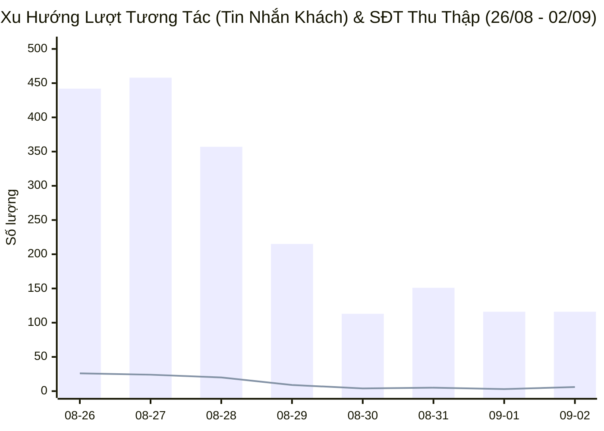
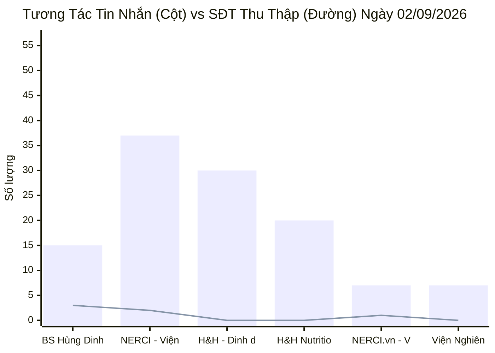
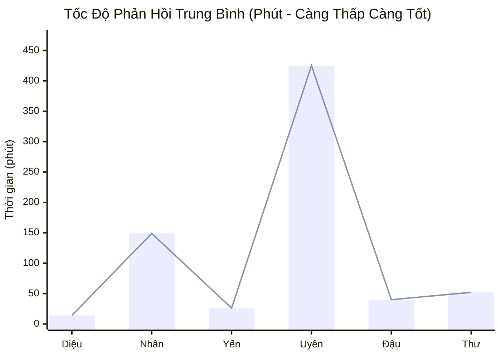
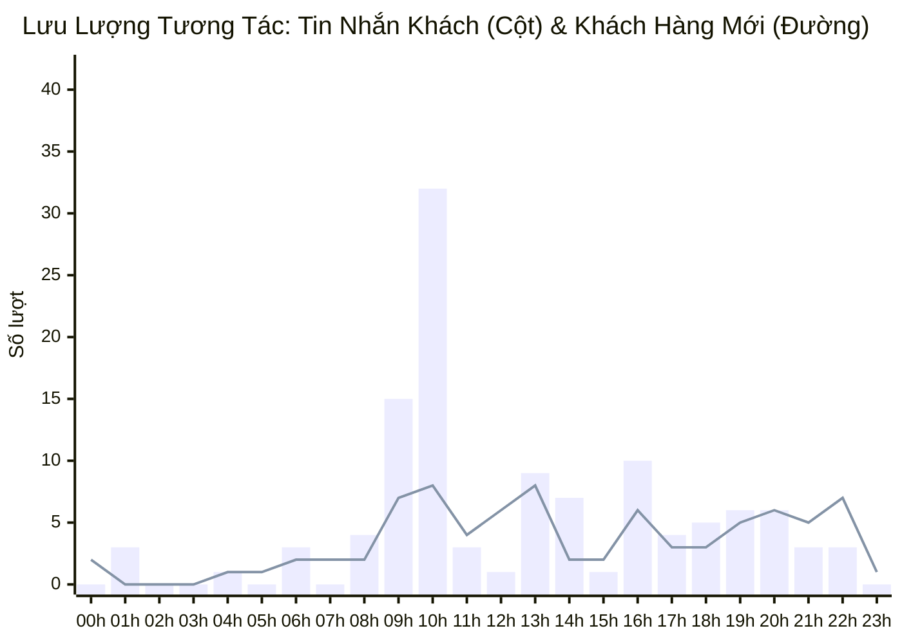

  

    PANCAKE OMNICHANNEL AUDIT & PERFORMANCE INTELLIGENCE
  

  <h1 style="margin: 4px 0 10px 0; color: white; border: none; padding: 0; font-size: 26px; font-weight: 800;">
    📊 BÁO CÁO HIỆU SUẤT VẬN HÀNH ĐA KÊNH PANCAKE
  </h1>
  

    Dữ liệu kiểm toán vận hành và phân tích chuyển đổi toàn diện trên 10 kênh tương tác thuộc Hệ sinh thái Viện Dinh Dưỡng NERCI & H&H Nutrition
  

  

    📅 <strong>Ngày Báo Cáo:</strong> 02/09/2026 (00:00 - 23:59 GMT+7 · Nghỉ Lễ Quốc Khánh)
    👤 <strong>Người Báo Cáo:</strong> Đại Dương (Performance & Operations)
    💬 <strong>Tổng Khách Mới:</strong> 83
    📞 <strong>SĐT Thu Được:</strong> 6
    📈 <strong>Tỷ Lệ Thu SĐT:</strong> 2.22%
  

> [!abstract] TỔNG QUAN HIỆU SUẤT VẬN HÀNH NGÀY 02/09/2026
> Trong ngày **02/09/2026 (Quốc Khánh)**, toàn bộ hệ thống 10 kênh ghi nhận **`270` lượt tương tác** (116 tin nhắn riêng và 154 bình luận) từ **`83` khách hàng mới**, thu về thành công **`6` số điện thoại** đạt tỷ lệ chuyển đổi **`2.22%`**. Mặc dù rơi vào ngày nghỉ Lễ, lưu lượng thảo luận và tương tác bệnh lý (đặc biệt là suy thận mạn, dinh dưỡng nhi khoa và các lớp đào tạo chuyên gia dinh dưỡng tháng 9) vẫn diễn ra sôi nổi trên cả TikTok BS Hùng, Zalo OA H&H và các Fanpage Viện.

> [!success] 🟢 NHỮNG ĐIỂM ĐÃ LÀM ĐƯỢC (WHAT WENT WELL / HIGHLIGHTS)
> 1. **Duy trì phễu tương tác xuyên Lễ ấn tượng trên TikTok BS Hùng (147 bình luận):** Kênh TikTok tiếp tục khẳng định vị thế đầu tàu kéo nhận diện thương hiệu, tiếp cận **15 khách hàng mới** và đóng góp **2 SĐT** ngay trong ngày 2/9.
> 2. **Chuyển đổi chất lượng cao trên các Fanpage Viện (NERCI & NERCI.vn):** Thu về các lead chất lượng cao kèm SĐT thực tế:
>    - Lead **Hương Từ** (`0912293229`) quan tâm tư vấn dinh dưỡng cá thể hóa.
>    - Lead **Trang Huynh** (`0903104354`) cần can thiệp dinh dưỡng cho bé theo thể trạng riêng biệt.
> 3. **Tư vấn bệnh lý lâm sàng sâu sắc trên Zalo OA H&H & FB H&H:** Tư vấn viên Nguyễn Thị Hồng Yến đã giải đáp cặn kẽ và chuyên nghiệp cơ chế bệnh học dinh dưỡng cho các ca bệnh thận:
>    - Khách **Huệ Đoàn**: Giải thích rõ cơ chế sữa dinh dưỡng không trực tiếp làm tăng độ lọc cầu thận (eGFR) mà giúp giảm tải gánh nặng chuyển hóa urê/creatinin.
>    - Khách **Diễm Thu & Hoa Le Thi Kim**: Hướng dẫn dùng sữa Nepro 1 Gold theo từng giai đoạn chạy thận nhân tạo.
> 4. **Hút nhu cầu tuyển sinh khóa đào tạo Dinh dưỡng Tháng 9:** Ghi nhận chuỗi khách hàng tiềm năng như **Huyền Trang, Kim Anh, Thao, Steve Nguyễn, Yến Linh** chủ động hỏi lịch khai giảng và hình thức học trực tuyến qua Zoom của NERCI Academy.

> [!danger] 🔴 NHỮNG ĐIỂM CHƯA ĐƯỢC & TỒN ĐỌNG VẬN HÀNH (BOTTLENECKS & WEAKNESSES)
> 1. **TỶ LỆ KHÁCH CHƯA PHẢN HỒI CAO DO CÂU CHÀO RẬP KHUÔN (`tag_19` - 8 ca):** Nhiều ca khách hàng (như *Khô Linh, Nguyễn Hữu Sỹ, Oanh Tran, Lan, Kim Anh, Châu Huynh, Trung Nguyen*) ngưng tương tác ngay sau tin nhắn đầu tiên. Nguyên nhân chính là tư vấn viên dùng câu mở đầu quá chung chung (*"Viện có thể hỗ trợ gì được cho bạn?", "Mình quan tâm sản phẩm cho người nhà hay bản thân ạ?"*) thay vì câu hỏi trắc nghiệm triệu chứng lâm sàng.
> 2. **RÀO CẢN TÀI CHÍNH & MẶC CẢ GIÁ (`tag_21` & `tag_64`):**
>    - Ca khách **Huỳnh Tuyên**: Phản hồi mức chi phí tư vấn can thiệp dinh dưỡng còn cao so với khả năng chi trả của gia đình.
>    - Ca khách **Hoàng Tuấn**: Đòi hỏi chiết khấu sâu (>5%) cho sản phẩm dinh dưỡng đặc trị. Tư vấn viên cần trang bị kịch bản "Bảo vệ giá trị can thiệp y khoa" thay vì chỉ trả lời cứng nhắc mức giảm tối đa.
> 3. **SỐ ĐIỆN THOẠI HOTLINE LẪN VÀO LEAD — Ca My Hanh Luong Thi (`1900633690`):** Hệ thống ghi nhận số hotline tổng đài vào trường SĐT của khách, cần lọc để tránh làm sai lệch báo cáo CRM.
> 4. **ĐỘ TRỄ PHẢN HỒI (SLA) NGÀY LỄ:** Do chế độ trực nghỉ lễ, SLA trung bình của một số tư vấn viên bị kéo dài (Nguyễn Thiện Nhân: ~149.8 phút, Nguyễn Phương Uyên: ~425 phút) — cần thiết lập chế độ Botcake trực tự động thông minh ngoài giờ.

## 🌐 I. TỔNG HỢP HIỆU SUẤT VẬN HÀNH ĐA KÊNH
### 📊 1. Xu Hướng Tương Tác 7 Ngày Gần Nhất (26/08 - 02/09/2026)

### 📑 2. Bảng Theo Dõi Xu Hướng 7 Ngày Vận Hành
| Ngày | Tin Nhắn Khách | Bình Luận | Khách Hàng Mới | SĐT Thu Thập | Tỷ Lệ Thu SĐT | Ghi Chú Vận Hành |
| :---: | :---: | :---: | :---: | :---: | :---: | :--- |
| **26/08** | 442 | 97 | 166 | **26** | **4.82%** | 🔥 Ngày thường (Đỉnh cao tương tác) |
| **27/08** | 458 | 93 | 177 | **24** | **4.36%** | 🔥 Ngày thường (Đỉnh cao tương tác) |
| **28/08** | 357 | 204 | 181 | **20** | **3.57%** | 🔥 Ngày thường (Đỉnh cao tương tác) |
| **29/08** | 215 | 188 | 103 | **9** | **2.23%** | 🏖️ Bắt đầu kỳ nghỉ Lễ 2/9 |
| **30/08** | 113 | 79 | 61 | **4** | **2.08%** | 🏖️ Nghỉ Lễ Quốc Khánh |
| **31/08** | 151 | 94 | 65 | **5** | **2.04%** | 🏖️ Nghỉ Lễ Quốc Khánh |
| **01/09** | 116 | 121 | 91 | **3** | **1.27%** | 🏖️ Nghỉ Lễ Quốc Khánh |
| **02/09** | 116 | 154 | 83 | **6** | **2.22%** | 🏖️ Nghỉ Lễ Quốc Khánh |

### 📊 3. Biểu Đồ Tương Tác Tin Nhắn & SĐT Thu Thập Theo Kênh (02/09/2026)

### 📑 4. Bảng Dữ Liệu Chi Tiết 10 Kênh Ngày 02/09/2026
| STT | Kênh / Fanpage Quản Lý | Nền Tảng | Khách Mới | Tin Nhắn | Bình Luận | SĐT Thu Thập | Tỷ Lệ Thu SĐT | Đánh Giá Vận Hành |
| :---: | :--- | :---: | :---: | :---: | :---: | :---: | :---: | :--- |
| **1** | **BS Hùng Dinh Dưỡng - NERCI** | `TIKTOK` | **60** | 15 | 152 | **3** | **1.80%** | 🔥 Đầu Phễu Viral (147 cmt) |
| **2** | **NERCI - Viện Tư Vấn Dinh Dưỡng** | `FACEBOOK` | **4** | 37 | 1 | **2** | **5.26%** | 🩺 Tư Vấn Bệnh Lý & Khám |
| **3** | **H&H - Dinh dưỡng tối ưu** | `ZALO` | **6** | 30 | 0 | **0** | **0.00%** | 💰 Chăm Sóc & Chốt Đơn Sâu |
| **4** | **H&H Nutrition - Sản phẩm dinh dưỡng y học** | `FACEBOOK` | **9** | 20 | 0 | **0** | **0.00%** | 💬 Web Livechat |
| **5** | **NERCI.vn - Viện Nghiên Cứu và Tư Vấn Dinh Dưỡng** | `FACEBOOK` | **1** | 7 | 0 | **1** | **14.29%** | 🩺 Tư Vấn Bệnh Lý & Khám |
| **6** | **Viện Nghiên cứu & Tư vấn dinh dưỡng** | `ZALO` | **2** | 7 | 0 | **0** | **0.00%** | 💬 Web Livechat |
| **7** | **NERCI Academy - Đào Tạo Chuyên Gia Dinh Dưỡng** | `FACEBOOK` | **1** | 0 | 1 | **0** | **0.00%** | 🩺 Tư Vấn Bệnh Lý & Khám |
| **8** | **Cộng đồng Bác sĩ Dinh Dưỡng Việt Nam** | `FACEBOOK` | **0** | 0 | 0 | **0** | **0.00%** | 💬 Web Livechat |
| **9** | **H&H** | `PKE_CHAT_PLUGIN` | **0** | 0 | 0 | **0** | **0.00%** | 💬 Web Livechat |
| **10** | **Nerci** | `PKE_CHAT_PLUGIN` | **0** | 0 | 0 | **0** | **0.00%** | 💬 Web Livechat |
| | **TỔNG CỘNG TOÀN HỆ THỐNG** | `OMNICHANNEL` | **83** | **116** | **154** | **6** | **2.22%** | **10 Kênh Pancake NERCI** |

## 👥 II. ĐÁNH GIÁ NĂNG LỰC & TỐC ĐỘ PHẢN HỒI TƯ VẤN VIÊN (STAFF SLA)
### 📈 1. Biểu Đồ Thời Gian Phản Hồi Trung Bình Của Tư Vấn Viên (Phút)

### 📑 2. Bảng Xếp Hạng Hiệu Suất & SLA Nhân Sự
| Họ Tên Nhân Sự | Kênh Phụ Trách Chính | Tin Nhắn Xử Lý | SĐT Thu Thập | SLA Phản Hồi TB | Đánh Giá Chuyên Môn & Tác Nghiệp | Xếp Loại |
| :--- | :--- | :---: | :---: | :---: | :--- | :--- |
| **Hồ Dương Xuân  Diệu** | Đa kênh | **3,144** | **30** | `14.5 phút` | Xử lý khối lượng hội thoại lớn nhất hệ thống (3.144 inboxes), duy trì SLA vượt trội 14.5p trên Zalo H&H | 🟢 **Xuất sắc** (SLA 14.5p, Trụ cột Zalo) |
| **Nguyễn Thiện Nhân** | Đa kênh | **2,403** | **27** | `149.8 phút` | Tiếp nhận các ca Fanpage NERCI & NERCI.vn; SLA trực lễ bị kéo dài 149.8p | 🟡 **Cần Tăng Tốc Trực Lễ** (SLA 149.8p) |
| **Nguyễn Thị Hồng Yến** | Đa kênh | **2,183** | **22** | `27.0 phút` | Trực FB H&H và Zalo H&H, xử lý 2.180 inboxes, tư vấn bệnh lý thận sâu sắc, SLA 27.0p | 🟢 **Xuất sắc** (SLA 27.0p, Chuyên môn Thận vững) |
| **Nguyễn Phương Uyên** | Đa kênh | **1,398** | **39** | `425.5 phút` | Xử lý 1.398 inboxes tích lũy, thu 39 SĐT tích lũy; SLA trực lễ 425.5p | 🔴 **Cảnh Báo Chậm Trực Lễ** (SLA 425.5p) |
| **Anna Đậu** | Đa kênh | **970** | **7** | `40.3 phút` | Phụ trách Tuyển sinh NERCI Academy & Zalo Viện, tư vấn lead Huyền Trang, SLA 40.3p | 🟢 **Tốt** (SLA 40.3p, Tuyển sinh) |
| **Đặng Hoàng Anh Thư** | Đa kênh | **96** | **3** | `52.2 phút` | Trực ca ngày, tiếp nhận 96 inboxes, thu 3 SĐT, SLA 52.2p | 🟡 **Khá** (SLA 52.2p) |
| **Nguyễn Châu Hồng Thủy** | Đa kênh | **18** | **0** | `77.7 phút` | Xử lý 18 inboxes, SLA 77.7p | 🟡 **Khá** (SLA 77.7p) |
| **Hồng Yến** | Đa kênh | **5** | **0** | `0.0 phút` | Hỗ trợ điều phối tin nhắn | ⚪ **Đạt chuẩn** |
| **Nguyễn Vũ Bảo Như** | Đa kênh | **0** | **1** | `0.0 phút` | Tiếp nhận 1 SĐT từ kênh TikTok BS Hùng | ⚪ **Đạt chuẩn** |

## 🎯 III. CHI TIẾT DANH SÁCH HOT LEAD & CÁC CA LÂM SÀNG / TUYỂN SINH NGÀY 02/09/2026
### 🏆 1. Danh Sách Khách Hàng Để Lại Số Điện Thoại (Hot Leads)
| STT | Tên Khách Hàng | Số Điện Thoại | Kênh Tiếp Nhận | Nhân Sự Phụ Trách | Phân Loại Nhu Cầu | Ghi Chú & Tóm Tắt Tác Nghiệp |
| :---: | :--- | :---: | :--- | :--- | :--- | :--- |
| **1** | **Hương Từ** | `0912293229` | `NERCI - Viện Tư Vấn Dinh Dưỡng` | Nguyễn Thiện Nhân | 🩺 Tư vấn dinh dưỡng cá thể hóa | Dạ chị cho em xin họ và tên ạ |
| **2** | **My Hanh Luong Thi** | `1900633690` | `NERCI - Viện Tư Vấn Dinh Dưỡng` | Nguyễn Thiện Nhân | 📞 Hotline Viện | Dạ không biết Chị đang quan tâm đến can thiệp dinh dưỡng hỗ t... |
| **3** | **Trang Huynh** | `0903104354` | `NERCI.vn - Viện Nghiên Cứu và Tư Vấn Dinh Dưỡng` | Nguyễn Thiện Nhân | 👶 Dinh dưỡng Nhi khoa theo thể trạng | Dạ mỗi bé có 1 thể trạng khác nhau để tối ưu được dinh dưỡng ... |

### 🩺 2. Danh Sách Ca Tư Vấn Bệnh Lý & Khóa Học Tiêu Biểu (Đang Bám Đuổi / Nurturing)
| Tên Khách Hàng | Kênh | Nhân Sự | Thẻ Trạng Thái | Vấn Đề Bệnh Lý / Nhu Cầu | Trích Đoạn Tư Vấn Của TVV / Khách Hàng |
| :--- | :--- | :--- | :--- | :--- | :--- |
| **Joanne** | `H&H - Dinh dưỡng t` | Nguyễn Thị Hồng Yến | `Spam` | 💬 Khách hàng hỏi thông tin đầu phễu | *"Dạ bên em không nhận thu mua lại ạ ..."* |
| **Le Minh Hieu** | `H&H - Dinh dưỡng t` | Nguyễn Thị Hồng Yến | `F_Sắp Xếp TG` | 💬 Khách hàng hỏi thông tin đầu phễu | *"Dạ vâng..."* |
| **Lan** | `H&H - Dinh dưỡng t` | Nguyễn Thị Hồng Yến | `F_Tham Khảo` | 🥛 **Tìm mua Sữa Nepro 1 Gold chính hãng** | *"Dạ em gửi chị link tham khảo sữa Nepro 1 Gold, hình ảnh trên..."* |
| **Hoàng Tuấn** | `H&H - Dinh dưỡng t` | Nguyễn Thị Hồng Yến | `F_Tham Khảo` | 🏷️ **Mặc cả chiết khấu >5% sản phẩm** | *"Dạ hiện bên em chỉ giảm tối đa 5% ạ ..."* |
| **Huệ Đoàn** | `H&H Nutrition - Sả` | Nguyễn Thị Hồng Yến | `F_Tham Khảo` | 🩺 **Suy thận & Độ lọc cầu thận (eGFR)** | *"Sản phẩm không trực tiếp tăng độ lọc cầu thận, độ lọc cầu th..."* |
| **Châu Huynh** | `H&H Nutrition - Sả` | Nguyễn Thị Hồng Yến | `Chưa phản hồi` | 💬 Khách hàng hỏi thông tin đầu phễu | *"Mình cần hỗ trợ thông tin nào ạ ?..."* |
| **Pham Van Linh** | `H&H Nutrition - Sả` | Nguyễn Thị Hồng Yến | `Chưa phản hồi` | 💬 Khách hàng hỏi thông tin đầu phễu | *"Mình quan tâm sản phẩm cho người nhà hay bản thân ạ ?..."* |
| **Diễm Thu** | `H&H Nutrition - Sả` | Nguyễn Thị Hồng Yến | `F_Tham Khảo` | 🩺 **Bệnh nhân chạy thận nhân tạo / Sữa Nepro 1 Gold** | *"Dạ sản phẩm dùng được cho người đang chạy thận, nhưng mình t..."* |
| **Quỳnh Dung** | `H&H Nutrition - Sả` | Nguyễn Thị Hồng Yến | `F_Tham Khảo` | 🩺 **Tư vấn phòng ngừa suy thận** | *"Dạ không suy thận mình chưa cần thiết sử dụng sản phẩm này ạ..."* |
| **Trung Vinh Nguyễn** | `H&H Nutrition - Sả` | Nguyễn Thị Hồng Yến | `Chưa phản hồi` | 💬 Khách hàng hỏi thông tin đầu phễu | *"Mình quan tâm sản phẩm cho người nhà hay bản thân ạ?..."* |
| **Hoa Le Thi Kim** | `H&H Nutrition - Sả` | Nguyễn Thị Hồng Yến | `F_Tham Khảo` | 🩺 **Bệnh nhân chạy thận nhân tạo / Sữa Nepro 1 Gold** | *"Mình bị suy thận giai đoạn mấy ạ ?..."* |
| **Trung Nguyen** | `H&H Nutrition - Sả` | Nguyễn Thị Hồng Yến | `Chưa phản hồi` | 💬 Khách hàng hỏi thông tin đầu phễu | *"Mình quan tâm sản phẩm cho người nhà hay bản thân ạ?..."* |
| **An Nhiên** | `H&H Nutrition - Sả` | Nguyễn Thị Hồng Yến | `Chưa phản hồi` | 💬 Khách hàng hỏi thông tin đầu phễu | *"Mình quan tâm sản phẩm cho người nhà hay bản thân ạ?..."* |
| **Huỳnh Tuyên** | `NERCI - Viện Tư Vấ` | Nguyễn Thiện Nhân | `F_Kinh Tế` | 💰 **Rào cản chi phí gói can thiệp dinh dưỡng** | *"nhìn chung với những gì đạt được như trên thì mức chi phí nà..."* |
| **Yến Linh** | `NERCI - Viện Tư Vấ` | Nguyễn Thiện Nhân | `F_Tham Khảo` | 🎓 **Hỏi lịch khai giảng lớp Dinh dưỡng Tháng 9 (Zoom)** | *"Dạ nêu đăng ký riêng thì sẽ học online qua zoom ạ..."* |

## ⏰ IV. PHÂN BỔ TƯƠNG TÁC 24 KHUNG GIỜ (PEAK HOURLY TRAFFIC)
### 📈 1. Biểu Đồ Lưu Lượng Tương Tác 24 Khung Giờ Ngày 02/09/2026

### 📑 2. Bảng Dữ Liệu 24 Khung Giờ & Đề Xuất Bố Trí Ca Trực
| Khung Giờ | Tin Nhắn Khách | Bình Luận | Khách Mới | SĐT Thu Được | Mức Độ Tải | Khuyến Nghị Vận Hành |
| :---: | :---: | :---: | :---: | :---: | :---: | :--- |
| **00:00 - 00:59** | 0 | 2 | 2 | **0** | 🌙 **ĐÊM / THẤP** | Bật Botcake tự động thu SĐT ngoài giờ |
| **01:00 - 01:59** | 3 | 2 | 0 | **0** | ⚪ **BÌNH THƯỜNG** | Duy trì 1 tư vấn viên trực ca |
| **02:00 - 02:59** | 0 | 0 | 0 | **0** | 🌙 **ĐÊM / THẤP** | Bật Botcake tự động thu SĐT ngoài giờ |
| **03:00 - 03:59** | 0 | 1 | 0 | **0** | 🌙 **ĐÊM / THẤP** | Bật Botcake tự động thu SĐT ngoài giờ |
| **04:00 - 04:59** | 1 | 1 | 1 | **0** | 🌙 **ĐÊM / THẤP** | Bật Botcake tự động thu SĐT ngoài giờ |
| **05:00 - 05:59** | 0 | 4 | 1 | **0** | ⚪ **BÌNH THƯỜNG** | Duy trì 1 tư vấn viên trực ca |
| **06:00 - 06:59** | 3 | 2 | 2 | **1** | ⚪ **BÌNH THƯỜNG** | Duy trì 1 tư vấn viên trực ca |
| **07:00 - 07:59** | 0 | 3 | 2 | **0** | ⚪ **BÌNH THƯỜNG** | Duy trì 1 tư vấn viên trực ca |
| **08:00 - 08:59** | 4 | 3 | 2 | **0** | ⚪ **BÌNH THƯỜNG** | Duy trì 1 tư vấn viên trực ca |
| **09:00 - 09:59** | 15 | 11 | 7 | **2** | 🔥 **CAO ĐIỂM (PEAK)** | Bố trí 2-3 tư vấn viên túc trực phản hồi ngay < 5 phút |
| **10:00 - 10:59** | 32 | 8 | 8 | **0** | 🔥 **CAO ĐIỂM (PEAK)** | Bố trí 2-3 tư vấn viên túc trực phản hồi ngay < 5 phút |
| **11:00 - 11:59** | 3 | 9 | 4 | **0** | ⚡ **TRUNG BÌNH CAO** | Duy trì 1-2 tư vấn viên trực chiến |
| **12:00 - 12:59** | 1 | 13 | 6 | **0** | ⚡ **TRUNG BÌNH CAO** | Duy trì 1-2 tư vấn viên trực chiến |
| **13:00 - 13:59** | 9 | 10 | 8 | **0** | ⚡ **TRUNG BÌNH CAO** | Duy trì 1-2 tư vấn viên trực chiến |
| **14:00 - 14:59** | 7 | 7 | 2 | **0** | ⚡ **TRUNG BÌNH CAO** | Duy trì 1-2 tư vấn viên trực chiến |
| **15:00 - 15:59** | 1 | 10 | 2 | **0** | ⚡ **TRUNG BÌNH CAO** | Duy trì 1-2 tư vấn viên trực chiến |
| **16:00 - 16:59** | 10 | 7 | 6 | **1** | ⚡ **TRUNG BÌNH CAO** | Duy trì 1-2 tư vấn viên trực chiến |
| **17:00 - 17:59** | 4 | 8 | 3 | **1** | ⚡ **TRUNG BÌNH CAO** | Duy trì 1-2 tư vấn viên trực chiến |
| **18:00 - 18:59** | 5 | 3 | 3 | **0** | ⚪ **BÌNH THƯỜNG** | Duy trì 1 tư vấn viên trực ca |
| **19:00 - 19:59** | 6 | 9 | 5 | **0** | ⚡ **TRUNG BÌNH CAO** | Duy trì 1-2 tư vấn viên trực chiến |
| **20:00 - 20:59** | 6 | 15 | 6 | **1** | ⚡ **TRUNG BÌNH CAO** | Duy trì 1-2 tư vấn viên trực chiến |
| **21:00 - 21:59** | 3 | 7 | 5 | **0** | ⚡ **TRUNG BÌNH CAO** | Duy trì 1-2 tư vấn viên trực chiến |
| **22:00 - 22:59** | 3 | 16 | 7 | **0** | ⚡ **TRUNG BÌNH CAO** | Duy trì 1-2 tư vấn viên trực chiến |
| **23:00 - 23:59** | 0 | 3 | 1 | **0** | ⚪ **BÌNH THƯỜNG** | Duy trì 1 tư vấn viên trực ca |

## 🚀 V. KẾ HOẠCH HÀNH ĐỘNG CẦN TRIỂN KHAI NGAY (ACTION PLAN)
| Hạng Mục Hành Động | Nội Dung & Mục Tiêu | Thời Hạn Hoàn Thành | Phụ Trách (PIC) | Mức Độ Ưu Tiên |
| :--- | :--- | :---: | :--- | :---: |
| **1. Bốc Máy Chăm Sóc Lead Dinh Dưỡng Nhi & Cá Thể Hóa** | Gọi điện tư vấn phác đồ cho khách Trang Huynh (`0903104354`) và Hương Từ (`0912293229`) | Trước 09:30 ngày 03/09 | Telesale Leader / Nguyễn Thiện Nhân | 🔴 **KHẨN CẤP** |
| **2. Chốt Lộ Trình Học Viên Academy Tháng 9** | Gửi khung chương trình đào tạo Dinh dưỡng Tháng 9 (Zoom Online) cho Huyền Trang, Kim Anh, Thao, Steve Nguyễn, Yến Linh | Trước 11:30 ngày 03/09 | Anna Đậu / CSKH Tuyển sinh | 🔴 **ƯU TIÊN CAO** |
| **3. Re-engage Tệp Khách Chưa Phản Hồi (`tag_19`)** | Đổi kịch bản mở đầu bằng bộ câu hỏi sàng lọc triệu chứng tự động (Botcake) cho Châu Huynh, Trung Nguyen, Oanh Tran, Khô Linh | Trong ngày 03/09 | Marketing Automation & Trực chat | 🔴 **ƯU TIÊN CAO** |
| **4. Chuẩn Hóa Kịch Bản Xử Lý Từ Chối Về Giá (`tag_21`)** | Đào tạo kịch bản nhấn mạnh ROI sức khỏe, phác đồ cá thể hóa và chứng nhận Viện Dinh Dưỡng cho khách như Huỳnh Tuyên | 05/09/2026 | Trưởng nhóm Tư vấn Y khoa | 🟡 **ƯU TIÊN** |
| **5. Lọc Số Hotline Khỏi Báo Cáo CRM** | Cấu hình regex loại trừ đầu số `1900xxxx` và hotline nội bộ khỏi phễu SĐT khách hàng tiềm năng | 04/09/2026 | Technical Operations | 🟡 **ƯU TIÊN** |

---
### ⚠️ TUYÊN BỐ MIỄN TRỪ TRÁCH NHIỆM (DISCLAIMER)
*Báo cáo này được tự động trích xuất và tính toán trực tiếp từ Pancake Open API kết nối toàn bộ 10 kênh Fanpage/TikTok/Zalo OA của Viện Nghiên cứu & Tư vấn Dinh dưỡng NERCI và H&H Nutrition. Dữ liệu phản ánh chính xác các tương tác, trạng thái thẻ gắn và hoạt động của đội ngũ tư vấn viên trong ngày 02/09/2026 và chuỗi ngày vận hành.*