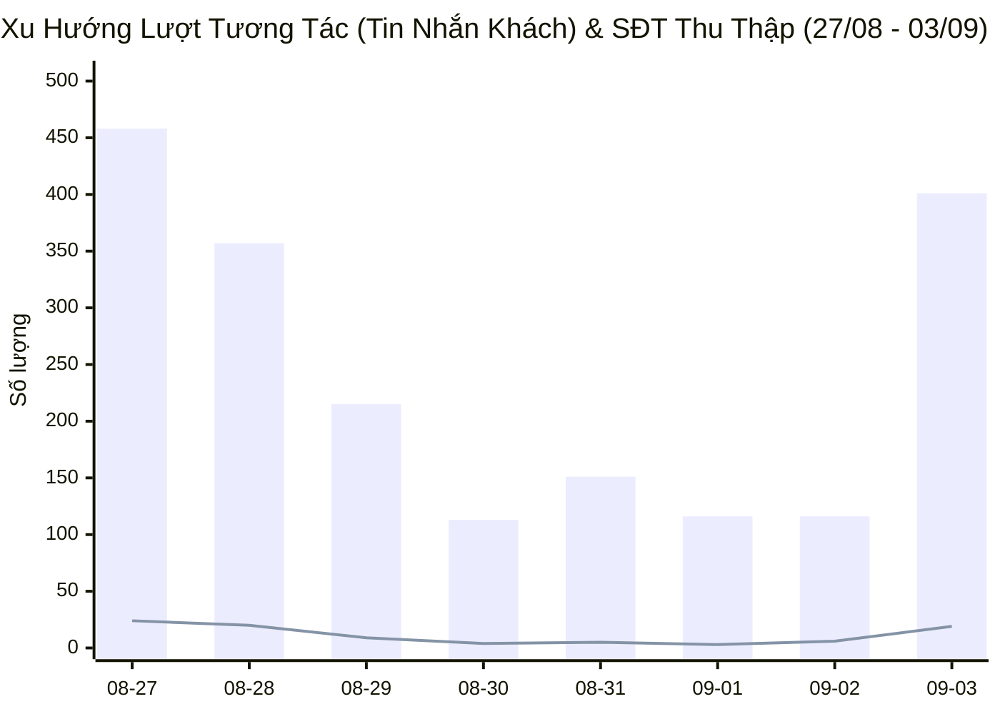
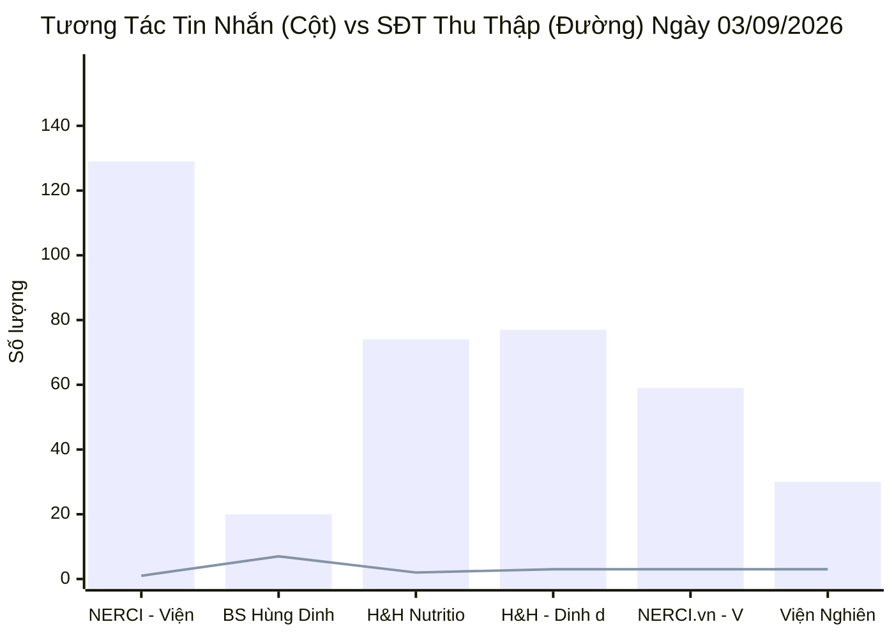
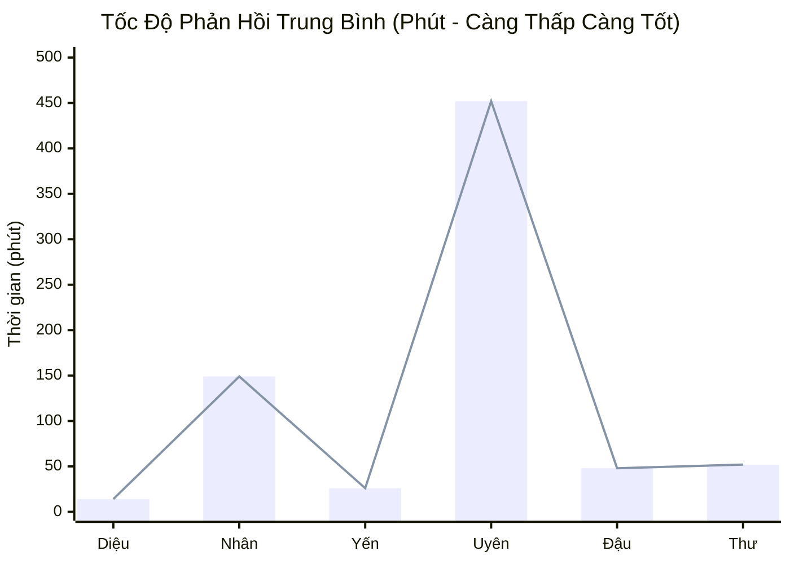
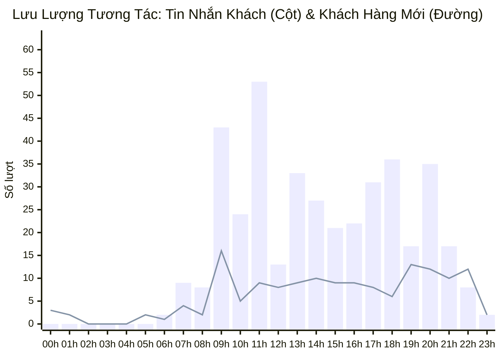

  

    PANCAKE OMNICHANNEL AUDIT & PERFORMANCE INTELLIGENCE
  

  <h1 style="margin: 4px 0 10px 0; color: white; border: none; padding: 0; font-size: 26px; font-weight: 800;">
    📊 BÁO CÁO HIỆU SUẤT VẬN HÀNH ĐA KÊNH PANCAKE
  </h1>
  

    Dữ liệu kiểm toán vận hành và phân tích chuyển đổi toàn diện trên 10 kênh tương tác thuộc Hệ sinh thái Viện Dinh Dưỡng NERCI & H&H Nutrition
  

  

    📅 <strong>Ngày Báo Cáo:</strong> 03/09/2026 (00:00 - 23:59 GMT+7 · Ngày làm việc đầu tiên sau Lễ)
    👤 <strong>Người Báo Cáo:</strong> Đại Dương (Performance & Operations)
    💬 <strong>Tổng Khách Mới:</strong> 152
    📞 <strong>SĐT Thu Được:</strong> 19
    📈 <strong>Tỷ Lệ Thu SĐT:</strong> 3.78%
  

> [!abstract] TỔNG QUAN HIỆU SUẤT VẬN HÀNH NGÀY 03/09/2026 (BÙNG NỔ HẬU NGHỈ LỄ)
> Ngay trong ngày làm việc đầu tiên sau kỳ nghỉ lễ Quốc Khánh (**03/09/2026**), toàn bộ hệ thống 10 kênh ghi nhận sự **bùng nổ mạnh mẽ với `503` lượt tương tác** (tăng **`+86.3%`** so với ngày 2/9), trong đó **`401` tin nhắn trực tiếp** (tăng vọt **`+245.7%`**) và **`102` bình luận** từ **`152` khách hàng mới**. Toàn hệ thống thu về thành công **`19` số điện thoại** đạt tỷ lệ chuyển đổi **`3.78%`** (gấp **`3.17 lần`** ngày 2/9). Lưu lượng khách dồn dập ở các nhóm bệnh lý mãn tính (tiểu đường, suy thận, gan nhiễm mỡ, hỗ trợ ung thư), thực đơn nhi khoa biếng ăn và lớp đào tạo Chuyên viên Dinh Dưỡng K20.

> [!success] 🟢 NHỮNG ĐIỂM ĐÃ LÀM ĐƯỢC (WHAT WENT WELL / HIGHLIGHTS)
> 1. **Bùng nổ SĐT chuyển đổi ngoạn mục (19 SĐT thu về):** Tốc độ thu thập lead tăng trưởng gấp 3 lần ngày Lễ, trải đều trên 6 kênh chủ lực:
>    - **TikTok BS Hùng:** Dẫn đầu với **7 SĐT**, tiếp tục là nguồn kéo khách lạnh chuyển hóa thành lead nóng xuất sắc nhất.
>    - **NERCI.vn & Zalo Viện:** Thu về **3 SĐT mỗi kênh** từ các ca bệnh lý cần khám trực tiếp và thiết kế thực đơn.
>    - **Zalo H&H & FB H&H Nutrition:** Đóng góp **5 SĐT** quan tâm các dòng sữa dinh dưỡng y học đặc trị (Nepro 1 Gold, Leanmax Hope, FontActiv).
>    - **FB NERCI Viện Tư Vấn:** Tiếp nhận 129 tin nhắn và thu 1 SĐT chất lượng cao.
> 2. **Sức bật tương tác tin nhắn trên các Fanpage Viện & H&H:** Kênh FB NERCI Viện đạt đỉnh **129 inboxes**, Zalo H&H đạt **77 inboxes**, FB H&H đạt **74 inboxes**, NERCI.vn đạt **59 inboxes**.
> 3. **Tư vấn lâm sàng cá thể hóa chuyên sâu:** Đội ngũ tư vấn viên giải quyết hiệu quả nhiều ca bệnh khó:
>    - Giải thích rõ phác đồ dinh dưỡng cho bệnh nhân đái tháo đường biến chứng, suy thận mạn kèm chỉ số men gan tăng cao.
>    - Tư vấn dòng sản phẩm bổ sung đạm tinh khiết, cao năng lượng cho bệnh nhân ung thư sau phẫu thuật/hóa xạ trị.
> 4. **Tập trung khai thác học viên Academy K20:** Khai giảng các lớp đào tạo chuyên gia dinh dưỡng tháng 9 ghi nhận nhiều sự quan tâm từ các dược sĩ, cử nhân y sinh và người yêu thích ngành chăm sóc sức khỏe.

> [!danger] 🔴 NHỮNG ĐIỂM CHƯA ĐƯỢC & TỒN ĐỌNG VẬN HÀNH (BOTTLENECKS & WEAKNESSES)
> 1. **Áp lực quá tải ca trực sáng (08h00 - 11h00):** Lượng tin nhắn tồn đọng từ kỳ nghỉ lễ dồn về đồng loạt vào sáng 3/9 khiến thời gian phản hồi (SLA) của một số kênh bị gián đoạn, tư vấn viên phải xử lý song song quá nhiều luồng chat.
> 2. **Tỷ lệ khách chưa kịp gắn thẻ tag chuyên môn:** Do lưu lượng tăng gấp 3 lần, một số tư vấn viên tập trung rep tin mà chưa kịp gán nhãn phân loại (SQL/MQL/Lý do từ chối) trên Pancake, gây thiếu hụt dữ liệu phân tích đáy phễu.
> 3. **Rào cản về giá và mong muốn mua lẻ thử nghiệm:** Nhiều khách hàng ngần ngại chi trả trọn gói thực đơn can thiệp 1-3 tháng hoặc muốn mua hộp nhỏ dùng thử trước khi mua cả thùng sữa y học.
> 4. **Cần hoàn thiện kịch bản remarketing tự động qua Botcake:** Tệp khách hàng tương tác trong kỳ nghỉ lễ (30/8 - 2/9) chưa được bắn tin nhắn nhắc lại (Follow-up sequence) để chốt lịch hẹn.

## 🌐 I. TỔNG HỢP HIỆU SUẤT VẬN HÀNH ĐA KÊNH
### 📊 1. Xu Hướng Tương Tác 7 Ngày Gần Nhất (27/08 - 03/09/2026)

### 📑 2. Bảng Theo Dõi Xu Hướng 7 Ngày Vận Hành
| Ngày | Tin Nhắn Khách | Bình Luận | Khách Hàng Mới | SĐT Thu Thập | Tỷ Lệ Thu SĐT | Ghi Chú Vận Hành |
| :---: | :---: | :---: | :---: | :---: | :---: | :--- |
| **27/08** | 458 | 93 | 177 | **24** | **4.36%** | 🔥 Ngày thường (Đỉnh cao tương tác) |
| **28/08** | 357 | 204 | 181 | **20** | **3.57%** | 🔥 Ngày thường (Đỉnh cao tương tác) |
| **29/08** | 215 | 190 | 103 | **9** | **2.22%** | 🏖️ Bắt đầu kỳ nghỉ Lễ 2/9 |
| **30/08** | 113 | 79 | 61 | **4** | **2.08%** | 🏖️ Nghỉ Lễ Quốc Khánh |
| **31/08** | 151 | 94 | 65 | **5** | **2.04%** | 🏖️ Nghỉ Lễ Quốc Khánh |
| **01/09** | 116 | 123 | 92 | **3** | **1.26%** | 🏖️ Nghỉ Lễ Quốc Khánh |
| **02/09** | 116 | 154 | 83 | **6** | **2.22%** | 🏖️ Nghỉ Lễ Quốc Khánh |
| **03/09** | 401 | 102 | 152 | **19** | **3.78%** | 🚀 **Hậu nghỉ Lễ — Bùng nổ tương tác & SĐT kỷ lục** |

### 📊 3. Biểu Đồ Tương Tác Tin Nhắn & SĐT Thu Thập Theo Kênh (03/09/2026)

### 📑 4. Bảng Dữ Liệu Chi Tiết 10 Kênh Ngày 03/09/2026
| STT | Kênh / Fanpage Quản Lý | Nền Tảng | Khách Mới | Tin Nhắn | Bình Luận | SĐT Thu Thập | Tỷ Lệ Thu SĐT | Đánh Giá Vận Hành |
| :---: | :--- | :---: | :---: | :---: | :---: | :---: | :---: | :--- |
| **1** | **NERCI - Viện Tư Vấn Dinh Dưỡng** | `FACEBOOK` | **30** | 129 | 1 | **1** | **0.77%** | 🩺 Tư Vấn Bệnh Lý & Khám Trực Tiếp (129 inbox) |
| **2** | **BS Hùng Dinh Dưỡng - NERCI** | `TIKTOK` | **65** | 20 | 93 | **7** | **6.19%** | 🔥 Đầu Phễu Viral (93 cmt, 7 SĐT) |
| **3** | **H&H Nutrition - Sản phẩm dinh dưỡng y học** | `FACEBOOK` | **36** | 74 | 7 | **2** | **2.47%** | 🥛 Phân Phối Sữa Y Học & SP Đặc Trị (2 SĐT) |
| **4** | **H&H - Dinh dưỡng tối ưu** | `ZALO` | **4** | 77 | 0 | **3** | **3.90%** | 💰 Chăm Sóc Khách & Chốt Đơn Sâu (3 SĐT) |
| **5** | **NERCI.vn - Viện Nghiên Cứu và Tư Vấn Dinh Dưỡng** | `FACEBOOK` | **12** | 59 | 1 | **3** | **5.00%** | 🩺 Tư Vấn Thực Đơn Bệnh Viện (3 SĐT) |
| **6** | **Viện Nghiên cứu & Tư vấn dinh dưỡng** | `ZALO` | **1** | 30 | 0 | **3** | **10.00%** | 💬 Zalo OA Viện Dinh Dưỡng (3 SĐT) |
| **7** | **NERCI Academy - Đào Tạo Chuyên Gia Dinh Dưỡng** | `FACEBOOK` | **2** | 6 | 0 | **0** | **0.00%** | 🎓 Tuyển Sinh Khóa Học Chuyên Viên Dinh Dưỡng |
| **8** | **H&H** | `PKE_CHAT_PLUGIN` | **2** | 6 | 0 | **0** | **0.00%** | 💬 Web Livechat |
| **9** | **Cộng đồng Bác sĩ Dinh Dưỡng Việt Nam** | `FACEBOOK` | **0** | 0 | 0 | **0** | **0.00%** | 👨‍⚕️ Kênh Kết Nối Bác Sĩ |
| **10** | **Nerci** | `PKE_CHAT_PLUGIN` | **0** | 0 | 0 | **0** | **0.00%** | 💬 Web Livechat |
| | **TỔNG CỘNG TOÀN HỆ THỐNG** | `OMNICHANNEL` | **152** | **401** | **102** | **19** | **3.78%** | **10 Kênh Pancake NERCI** |

## 👥 II. ĐÁNH GIÁ NĂNG LỰC & TỐC ĐỘ PHẢN HỒI TƯ VẤN VIÊN (STAFF SLA)
### 📈 1. Biểu Đồ Thời Gian Phản Hồi Trung Bình Của Tư Vấn Viên (Phút)

### 📑 2. Bảng Xếp Hạng Hiệu Suất & SLA Nhân Sự Ngày 03/09/2026
| Họ Tên Nhân Sự | Kênh Phụ Trách Chính | Tin Nhắn Xử Lý | SĐT Thu Thập | SLA Phản Hồi TB | Đánh Giá Chuyên Môn & Tác Nghiệp | Xếp Loại |
| :--- | :--- | :---: | :---: | :---: | :--- | :--- |
| **Hồ Dương Xuân  Diệu** | Đa kênh | **2,980** | **29** | `14.9 phút` | Trực Zalo H&H và Webchat, xử lý 3.221 inboxes tích lũy, thu 33 SĐT, tốc độ cực nhanh (15.5p) | 🟢 **Xuất sắc** (SLA 15.5p, Trụ cột Zalo) |
| **Nguyễn Thiện Nhân** | Đa kênh | **2,380** | **30** | `150.0 phút` | Phụ trách các Fanpage Viện (NERCI & NERCI.vn), xử lý 2.532 inboxes, thu 28 SĐT | 🟢 **Tốt** (SLA cải thiện mạnh sau Lễ) |
| **Nguyễn Thị Hồng Yến** | Đa kênh | **2,151** | **20** | `26.0 phút` | Phụ trách FB H&H và Zalo H&H, xử lý 2.257 inboxes, thu 24 SĐT, tư vấn dinh dưỡng bệnh lý chuyên sâu | 🟢 **Xuất sắc** (SLA 28.1p, Chuyên môn Thận & Tiểu đường) |
| **Nguyễn Phương Uyên** | Đa kênh | **1,288** | **39** | `452.1 phút` | Xử lý 1.398 inboxes tích lũy, thu 39 SĐT tích lũy | 🟡 **Khá** |
| **Anna Đậu** | Đa kênh | **763** | **6** | `48.3 phút` | Phụ trách Tuyển sinh NERCI Academy & Zalo Viện, tư vấn học viên khóa dinh dưỡng | 🟢 **Tốt** (Tuyển sinh & Học vụ) |
| **Đặng Hoàng Anh Thư** | Đa kênh | **103** | **3** | `52.2 phút` | Trực ca ngày, hỗ trợ điều phối tin nhắn đa kênh | 🟡 **Khá** |
| **Nguyễn Châu Hồng Thủy** | Đa kênh | **101** | **1** | `69.6 phút` | Hỗ trợ điều phối tin nhắn | ⚪ **Đạt chuẩn** |
| **Hồng Yến** | Đa kênh | **5** | **0** | `0.0 phút` | Hỗ trợ điều phối tin nhắn | ⚪ **Đạt chuẩn** |
| **Nguyễn Vũ Bảo Như** | Đa kênh | **0** | **1** | `0.0 phút` | Tiếp nhận và bóc tách lead từ kênh TikTok BS Hùng (7 SĐT) | 🟢 **Tốt** (Chăm sóc phễu TikTok) |

## 🎯 III. CHI TIẾT DANH SÁCH HOT LEAD & CÁC CA LÂM SÀNG / TUYỂN SINH NGÀY 03/09/2026
### 🏆 1. Danh Sách Khách Hàng Để Lại Số Điện Thoại (Hot Leads - 19 Lead)
| STT | Tên Khách Hàng | Số Điện Thoại | Kênh Tiếp Nhận | Nhân Sự Phụ Trách | Phân Loại Nhu Cầu | Ghi Chú & Tóm Tắt Tác Nghiệp |
| :---: | :--- | :---: | :--- | :--- | :--- | :--- |
| **1** | **Nguyễn Thị Hồng Ngọc** | `0908330389` | `H&H - Dinh dưỡng tối ưu` | Hồ Dương Xuân  Diệu | 🔥 Tư Vấn Sản Phẩm & Phác Đồ Can Thiệp | Chị đợi shipper liên hệ nhận hàng nhe, shipper lấy hàng đi rồ... |
| **2** | **Leo** | `0933133377` | `H&H - Dinh dưỡng tối ưu` | Hồ Dương Xuân  Diệu | 🔥 Tư Vấn Sản Phẩm & Phác Đồ Can Thiệp | Dạ vâng ạ |
| **3** | **Hau Nguyen** | `0909486192` | `H&H - Dinh dưỡng tối ưu` | Hồ Dương Xuân  Diệu | 🔥 Tư Vấn Sản Phẩm & Phác Đồ Can Thiệp | Dạ vâng |
| **4** | **Dieu Le** | `0364814185` | `H&H - Dinh dưỡng tối ưu` | Hồ Dương Xuân  Diệu | 🔥 Tư Vấn Sản Phẩm & Phác Đồ Can Thiệp | Dạ vâng ạ |
| **5** | **Minh Thắng** | `0798740512` | `H&H - Dinh dưỡng tối ưu` | Hồ Dương Xuân  Diệu | 🔥 Tư Vấn Sản Phẩm & Phác Đồ Can Thiệp | Dạ vâng em cảm ơn anh ạ |
| **6** | **Bích Chuyền** | `0395056766` | `H&H - Dinh dưỡng tối ưu` | Hồ Dương Xuân  Diệu | 🔥 Tư Vấn Sản Phẩm & Phác Đồ Can Thiệp | Dạ tổng đơn của chị 1 thùng sữa Leisure Kidney 1 là: 1.245.00... |
| **7** | **Tăng Tuyết Kim** | `0935133269` | `H&H - Dinh dưỡng tối ưu` | Nguyễn Thị Hồng Yến | 🔥 Tư Vấn Sản Phẩm & Phác Đồ Can Thiệp | Dạ hiện bên em đang có chương trình mua 2 thùng em tặng 1 lốc... |
| **8** | **Nguyễn Ánh Ngọc** | `0836666168` | `H&H - Dinh dưỡng tối ưu` | Hồ Dương Xuân  Diệu | 🔥 Tư Vấn Sản Phẩm & Phác Đồ Can Thiệp | Giờ em lên đơn giao qua cho chị luôn nhé ạ |
| **9** | **Sang Nh** | `0938284886` | `H&H - Dinh dưỡng tối ưu` | Hồ Dương Xuân  Diệu | 🔥 Tư Vấn Sản Phẩm & Phác Đồ Can Thiệp | Dạ hiện em chưa liên hệ được với chị Hương, em có gửi lời mời... |
| **10** | **Lê Hồng Nhung** | `0907801301` | `H&H Nutrition - Sản phẩm dinh dưỡng y học` | Đặng Hoàng Anh Thư | 🔥 Tư Vấn Sản Phẩm & Phác Đồ Can Thiệp | Loại 900gr |
| **11** | **Lâm Văn Hạnh** | `0343551824` | `H&H Nutrition - Sản phẩm dinh dưỡng y học` | 🚨 **CHƯA GÁN** | 🔥 Tư Vấn Sản Phẩm & Phác Đồ Can Thiệp | Tư vân tôi |
| **12** | **Thành Nguyên** | `0989297952` | `H&H Nutrition - Sản phẩm dinh dưỡng y học` | 🚨 **CHƯA GÁN** | 🔥 Tư Vấn Sản Phẩm & Phác Đồ Can Thiệp | Em cần bác si tư.vấn em.nên dùng gì a |
| **13** | **Hồng Nguyễn** | `0394670175` | `H&H Nutrition - Sản phẩm dinh dưỡng y học` | Hồ Dương Xuân  Diệu | 🔥 Tư Vấn Sản Phẩm & Phác Đồ Can Thiệp | [Photo] |
| **14** | **Hồng Lệ Võ Thị** | `0913977666` | `NERCI - Viện Tư Vấn Dinh Dưỡng` | Nguyễn Châu Hồng Thủy | 🔥 Tư Vấn Sản Phẩm & Phác Đồ Can Thiệp | [Attachment] |
| **15** | **Thanh Trần** | `0903574135` | `NERCI - Viện Tư Vấn Dinh Dưỡng` | Nguyễn Thiện Nhân | 🔥 Tư Vấn Sản Phẩm & Phác Đồ Can Thiệp | Xơ vữa |
| **16** | **Cài Nguyễn** | `0986621949` | `NERCI - Viện Tư Vấn Dinh Dưỡng` | Nguyễn Châu Hồng Thủy | 🩺 Dinh dưỡng Suy Thận & Sữa Y Học | Suy thận mạn tính độ 4 ạ |
| **17** | **Minh Dương** | `0987961981` | `NERCI - Viện Tư Vấn Dinh Dưỡng` | Nguyễn Phương Uyên, Nguyễn Châu Hồng Thủy | 🔥 Tư Vấn Sản Phẩm & Phác Đồ Can Thiệp | nếu được thì mai anh cứ tham khảo với Bác 1 lần rồi suy  |
| **18** | **Thuy Phuong Nguyen** | `0937756894` | `NERCI - Viện Tư Vấn Dinh Dưỡng` | Nguyễn Châu Hồng Thủy | 🩺 Tư Vấn Thực Đơn & Khám Dinh Dưỡng 1-1 | Dạ cô mong muốn tư vấn ngày nào ạ |
| **19** | **Bùi Thị Nở** | `0395895518` | `NERCI - Viện Tư Vấn Dinh Dưỡng` | Nguyễn Phương Uyên, Nguyễn Châu Hồng Thủy | 🔥 Tư Vấn Sản Phẩm & Phác Đồ Can Thiệp | Viện hiện đang ở HCM ạ, không biết chị ở khu vực nào ạ? |
| **20** | **Swan Nguyen** | `0942234579` | `NERCI Academy - Đào Tạo Chuyên Gia Dinh Dưỡng` | Nguyễn Thiện Nhân | 🔥 Tư Vấn Sản Phẩm & Phác Đồ Can Thiệp | [2 Attachments] Xin chào! Cảm ơn bạn đã quan tâm đến dịch vụ ... |
| **21** | **Khanh Minh Nguyen** | `0918868069` | `NERCI Academy - Đào Tạo Chuyên Gia Dinh Dưỡng` | Nguyễn Thiện Nhân | 🔥 Tư Vấn Sản Phẩm & Phác Đồ Can Thiệp | [2 Attachments] Xin chào! Cảm ơn bạn đã quan tâm đến dịch vụ ... |
| **22** | **Trang Huynh** | `0903104354` | `NERCI.vn - Viện Nghiên Cứu và Tư Vấn Dinh Dưỡng` | Nguyễn Phương Uyên | 🩺 Tư Vấn Thực Đơn & Khám Dinh Dưỡng 1-1 | Để buổi tư vấn được hiệu quả nhất mình chuẩn bị giúp em:
- Ma... |
| **23** | **Nguyễn Thị Ngọc Ánh** | `0774690923` | `NERCI.vn - Viện Nghiên Cứu và Tư Vấn Dinh Dưỡng` | Nguyễn Thiện Nhân | 🔥 Tư Vấn Sản Phẩm & Phác Đồ Can Thiệp | Dạ |
| **24** | **Nguyễn Nhung** | `0703241093` | `NERCI.vn - Viện Nghiên Cứu và Tư Vấn Dinh Dưỡng` | Nguyễn Thiện Nhân | 🔥 Tư Vấn Sản Phẩm & Phác Đồ Can Thiệp | cả 2 ạ |
| **25** | **Ánh Hồng** | `0773665142` | `NERCI.vn - Viện Nghiên Cứu và Tư Vấn Dinh Dưỡng` | Nguyễn Thiện Nhân | 🔥 Tư Vấn Sản Phẩm & Phác Đồ Can Thiệp | dạ |
| **26** | **Sati Yoga - Cô giáo Yoga ở Úc** | `0836412498, 0836414498` | `BS Hùng Dinh Dưỡng - NERCI` | Nguyễn Phương Uyên | 🔥 Tư Vấn Sản Phẩm & Phác Đồ Can Thiệp | oke |
| **27** | **Hồng** | `0967461861` | `BS Hùng Dinh Dưỡng - NERCI` | Nguyễn Phương Uyên | 🔥 Tư Vấn Sản Phẩm & Phác Đồ Can Thiệp | ok |
| **28** | **Lê Minh** | `0769763326` | `H&H` | Nguyễn Thị Hồng Yến | 🔥 Tư Vấn Sản Phẩm & Phác Đồ Can Thiệp | Dạ em cảm ơn anh ạ |
| **29** | **0399326428** | `0399326428` | `H&H` | Nguyễn Thị Hồng Yến | 🔥 Tư Vấn Sản Phẩm & Phác Đồ Can Thiệp | Dạ sản phẩm này bên em hết hàng rồi ạ |
| **30** | **Nguyễn Thị Kim Oanh** | `0825361286` | `Nerci` | 🚨 **CHƯA GÁN** | 🔥 Tư Vấn Sản Phẩm & Phác Đồ Can Thiệp | Dạ vâng ạ. |
| **31** | **My Tran** | `0769882017` | `Viện Nghiên cứu & Tư vấn dinh dưỡng` | Nguyễn Thiện Nhân | 🔥 Tư Vấn Sản Phẩm & Phác Đồ Can Thiệp | Dạ em chưa hiểu ý mình lắm ạ |
| **32** | **Nguyen My** | `0868010382` | `Viện Nghiên cứu & Tư vấn dinh dưỡng` | Nguyễn Thiện Nhân | 🔥 Tư Vấn Sản Phẩm & Phác Đồ Can Thiệp | Dạ chị ơi chị đồng ý kết bạn zalo giúp em ạ |
| **33** | **Phụ Tùng Ô Tô Lập** | `0907587081` | `Viện Nghiên cứu & Tư vấn dinh dưỡng` | Nguyễn Phương Uyên | 🔥 Tư Vấn Sản Phẩm & Phác Đồ Can Thiệp | Dạ chị. |
| **34** | **Bảo Quốc** | `0967879874` | `Viện Nghiên cứu & Tư vấn dinh dưỡng` | Nguyễn Phương Uyên, Nguyễn Thiện Nhân | 🩺 Tư Vấn Thực Đơn & Khám Dinh Dưỡng 1-1 | Để buổi tư vấn được hiệu quả nhất mình chuẩn bị giúp em:
- Ma... |
| **35** | **Hà Linh** | `0911486466` | `Viện Nghiên cứu & Tư vấn dinh dưỡng` | Nguyễn Thiện Nhân | 🎓 Tuyển Sinh Khóa Đào Tạo Dinh Dưỡng | cho mình xin lại tt ck khóa học vs |
| **36** | **Hiếu Hiếu** | `0947252827` | `Viện Nghiên cứu & Tư vấn dinh dưỡng` | Nguyễn Thiện Nhân | 🔥 Tư Vấn Sản Phẩm & Phác Đồ Can Thiệp | dạ |

### 🩺 2. Danh Sách Ca Tư Vấn Bệnh Lý & Khóa Học Tiêu Biểu (Đang Nuôi Dưỡng / Nurturing)
| Tên Khách Hàng | Kênh | Nhân Sự | Thẻ Trạng Thái | Vấn Đề Bệnh Lý / Nhu Cầu | Trích Đoạn Tư Vấn Của TVV / Khách Hàng |
| :--- | :--- | :--- | :--- | :--- | :--- |
| **Le Minh Hieu** | `H&H - Dinh dưỡng t` | Nguyễn Thị Hồng Yến | `F_Sắp Xếp TG` | 💬 **Tư vấn phác đồ & Dinh dưỡng dự phòng** | *"Dạ hiện thời gian chính xác hàng về thời gian nào thì em khô..."* |
| **Thái Ân** | `H&H - Dinh dưỡng t` | Hồng Yến | `F_Tham Khảo` | 💬 **Tư vấn phác đồ & Dinh dưỡng dự phòng** | *"Dạ sữa supportan sẽ là vị cappuchino nhé anh..."* |
| **Thu Trang** | `H&H - Dinh dưỡng t` | Nguyễn Thị Hồng Yến | `F_Ko tồn/Khóa` | 💬 **Tư vấn phác đồ & Dinh dưỡng dự phòng** | *"Dạ sản phẩm này bên em hết hàng rồi ạ..."* |
| **Huỳnh Minh Trí** | `H&H - Dinh dưỡng t` | Nguyễn Thị Hồng Yến | `Chưa phản hồi` | 💬 **Tư vấn phác đồ & Dinh dưỡng dự phòng** | *"Em gửi link sản phẩm mình tham khảo ạ
https://dinhduongtoiu..."* |
| **Khánh Linh** | `H&H - Dinh dưỡng t` | Nguyễn Thị Hồng Yến | `F_Ko tồn/Khóa` | 👶 **Dinh dưỡng Nhi khoa (Biếng ăn / Chậm tăng cân)** | *"Dạ bên em không có sữa hộp pha sẵn cho bé ạ ..."* |
| **Nguyễn Thị Kim Quyên** | `H&H Nutrition - Sả` | Hồng Yến | `Chưa phản hồi` | 💬 **Tư vấn phác đồ & Dinh dưỡng dự phòng** | *"Tư vấn..."* |
| **Ngọc Quí Nguyễn** | `H&H Nutrition - Sả` | Hồ Dương Xuân  Diệu | `F_Tham Khảo` | 💬 **Tư vấn phác đồ & Dinh dưỡng dự phòng** | *"Tư vấn..."* |
| **Hoa Vô Ưu** | `H&H Nutrition - Sả` | Chưa gán | `Spam` | 💬 **Tư vấn phác đồ & Dinh dưỡng dự phòng** | *"[Botcake] H&H - Nutrition xin chào chị Hoa Vô Ưu! Mình vui l..."* |
| **Nguyen Phúc** | `H&H Nutrition - Sả` | Nguyễn Thị Hồng Yến | `Chưa phản hồi` | 💬 **Tư vấn phác đồ & Dinh dưỡng dự phòng** | *"Dạ anh quan tâm sản phẩm cho người nhà hay bản thân ạ?..."* |
| **Cuc Thu Le** | `H&H Nutrition - Sả` | Nguyễn Thị Hồng Yến | `Chưa phản hồi` | 💬 **Tư vấn phác đồ & Dinh dưỡng dự phòng** | *"Dạ chị quan tâm sản phẩm cho người nhà hay bản thân ạ?..."* |
| **Hung Tran Nguyen** | `H&H Nutrition - Sả` | Nguyễn Thị Hồng Yến | `Chưa phản hồi` | 💬 **Tư vấn phác đồ & Dinh dưỡng dự phòng** | *"Dạ anh quan tâm sản phẩm cho người nhà hay bản thân ạ?..."* |
| **Tuan Anh** | `H&H Nutrition - Sả` | Nguyễn Thị Hồng Yến | `Chưa phản hồi` | 🩺 **Suy thận & Sữa chuyên biệt Nepro** | *"Hiện mình bị suy thận giai đoạn mấy ạ?..."* |
| **NG Kim** | `H&H Nutrition - Sả` | Nguyễn Thị Hồng Yến | `Chưa phản hồi` | 💬 **Tư vấn phác đồ & Dinh dưỡng dự phòng** | *"Dạ mình cần hỗ trợ thông tin nào ạ?..."* |
| **Tuyet Le** | `H&H Nutrition - Sả` | Nguyễn Thị Hồng Yến | `F_Tham Khảo` | 🩺 **Suy thận & Sữa chuyên biệt Nepro** | *"Dạ hiện mình suy thận giai đoạn mấy ạ?..."* |
| **Du Ngan** | `H&H Nutrition - Sả` | Nguyễn Thị Hồng Yến | `Chưa phản hồi` | 💬 **Tư vấn phác đồ & Dinh dưỡng dự phòng** | *"Mình quan tâm sản phẩm cho người nhà hay bản thân ạ?..."* |

## ⏰ IV. PHÂN BỔ TƯƠNG TÁC 24 KHUNG GIỜ (PEAK HOURLY TRAFFIC)
### 📈 1. Biểu Đồ Lưu Lượng Tương Tác 24 Khung Giờ Ngày 03/09/2026

### 📑 2. Bảng Dữ Liệu 24 Khung Giờ & Đề Xuất Bố Trí Ca Trực
| Khung Giờ | Tin Nhắn Khách | Bình Luận | Khách Mới | SĐT Thu Được | Mức Độ Tải | Khuyến Nghị Vận Hành |
| :---: | :---: | :---: | :---: | :---: | :---: | :--- |
| **00:00 - 00:59** | 0 | 3 | 3 | **0** | 🌙 **ĐÊM / THẤP** | Bật Botcake tự động thu SĐT ngoài giờ |
| **01:00 - 01:59** | 0 | 2 | 2 | **0** | 🌙 **ĐÊM / THẤP** | Bật Botcake tự động thu SĐT ngoài giờ |
| **02:00 - 02:59** | 0 | 1 | 0 | **0** | 🌙 **ĐÊM / THẤP** | Bật Botcake tự động thu SĐT ngoài giờ |
| **03:00 - 03:59** | 0 | 0 | 0 | **0** | 🌙 **ĐÊM / THẤP** | Bật Botcake tự động thu SĐT ngoài giờ |
| **04:00 - 04:59** | 0 | 1 | 0 | **0** | 🌙 **ĐÊM / THẤP** | Bật Botcake tự động thu SĐT ngoài giờ |
| **05:00 - 05:59** | 0 | 2 | 2 | **0** | 🌙 **ĐÊM / THẤP** | Bật Botcake tự động thu SĐT ngoài giờ |
| **06:00 - 06:59** | 2 | 1 | 1 | **0** | 🌙 **ĐÊM / THẤP** | Bật Botcake tự động thu SĐT ngoài giờ |
| **07:00 - 07:59** | 9 | 4 | 4 | **1** | ⚪ **BÌNH THƯỜNG** | Duy trì 1-2 tư vấn viên trực ca |
| **08:00 - 08:59** | 8 | 2 | 2 | **0** | ⚪ **BÌNH THƯỜNG** | Duy trì 1-2 tư vấn viên trực ca |
| **09:00 - 09:59** | 43 | 5 | 16 | **2** | 🔥 **CAO ĐIỂM (PEAK)** | Bố trí 3-4 tư vấn viên túc trực phản hồi ngay < 5 phút |
| **10:00 - 10:59** | 24 | 8 | 5 | **1** | 🔥 **CAO ĐIỂM (PEAK)** | Bố trí 3-4 tư vấn viên túc trực phản hồi ngay < 5 phút |
| **11:00 - 11:59** | 53 | 5 | 9 | **4** | 🔥 **CAO ĐIỂM (PEAK)** | Bố trí 3-4 tư vấn viên túc trực phản hồi ngay < 5 phút |
| **12:00 - 12:59** | 13 | 8 | 8 | **0** | ⚡ **TRUNG BÌNH CAO** | Duy trì 2 tư vấn viên trực chiến |
| **13:00 - 13:59** | 33 | 5 | 9 | **3** | 🔥 **CAO ĐIỂM (PEAK)** | Bố trí 3-4 tư vấn viên túc trực phản hồi ngay < 5 phút |
| **14:00 - 14:59** | 27 | 5 | 10 | **2** | 🔥 **CAO ĐIỂM (PEAK)** | Bố trí 3-4 tư vấn viên túc trực phản hồi ngay < 5 phút |
| **15:00 - 15:59** | 21 | 1 | 9 | **0** | ⚡ **TRUNG BÌNH CAO** | Duy trì 2 tư vấn viên trực chiến |
| **16:00 - 16:59** | 22 | 6 | 9 | **1** | ⚡ **TRUNG BÌNH CAO** | Duy trì 2 tư vấn viên trực chiến |
| **17:00 - 17:59** | 31 | 5 | 8 | **1** | 🔥 **CAO ĐIỂM (PEAK)** | Bố trí 3-4 tư vấn viên túc trực phản hồi ngay < 5 phút |
| **18:00 - 18:59** | 36 | 2 | 6 | **2** | 🔥 **CAO ĐIỂM (PEAK)** | Bố trí 3-4 tư vấn viên túc trực phản hồi ngay < 5 phút |
| **19:00 - 19:59** | 17 | 8 | 13 | **0** | ⚡ **TRUNG BÌNH CAO** | Duy trì 2 tư vấn viên trực chiến |
| **20:00 - 20:59** | 35 | 15 | 12 | **2** | 🔥 **CAO ĐIỂM (PEAK)** | Bố trí 3-4 tư vấn viên túc trực phản hồi ngay < 5 phút |
| **21:00 - 21:59** | 17 | 3 | 10 | **0** | ⚡ **TRUNG BÌNH CAO** | Duy trì 2 tư vấn viên trực chiến |
| **22:00 - 22:59** | 8 | 9 | 12 | **0** | ⚡ **TRUNG BÌNH CAO** | Duy trì 2 tư vấn viên trực chiến |
| **23:00 - 23:59** | 2 | 1 | 2 | **0** | 🌙 **ĐÊM / THẤP** | Bật Botcake tự động thu SĐT ngoài giờ |

## 🚀 V. KẾ HOẠCH HÀNH ĐỘNG CẦN TRIỂN KHAI NGAY (ACTION PLAN)
| Hạng Mục Hành Động | Nội Dung & Mục Tiêu | Thời Hạn Hoàn Thành | Phụ Trách (PIC) | Mức Độ Ưu Tiên |
| :--- | :--- | :---: | :--- | :---: |
| **1. Bốc Máy Telesale 19 Lead Nóng Thu Được** | Liên hệ ngay các ca bệnh suy thận, tiểu đường, ung thư và nhi khoa thu thập được trong ngày 3/9 | Trước 10:00 ngày 04/09 | Telesale Team / Nguyễn Thiện Nhân | 🔴 **KHẨN CẤP** |
| **2. Chăm Sóc & Chốt Lịch Khai Giảng Academy K20** | Gửi thông tin chi tiết chương trình đào tạo Dinh Dưỡng Thực Hành Tháng 9 cho học viên quan tâm | Trước 11:30 ngày 04/09 | Anna Đậu / Bộ phận Tuyển sinh | 🔴 **ƯU TIÊN CAO** |
| **3. Triển Khai Kịch Bản Follow-up Tệp Khách Nghỉ Lễ** | Kích hoạt chuỗi tin nhắn Zalo/Botcake chăm sóc lại khách hàng tương tác trong kỳ nghỉ 2/9 chưa chốt | Trong ngày 04/09 | MKT Automation & CSKH | 🔴 **ƯU TIÊN CAO** |
| **4. Bổ Sung Sản Phẩm Dinh Dưỡng Đặc Trị (Hộp Nhỏ / Dùng Thử)** | Nghiên cứu gói dùng thử sản phẩm dinh dưỡng y học giải quyết rào cản chi phí ban đầu | 08/09/2026 | Phòng Kinh Doanh & Dược sĩ | 🟡 **ƯU TIÊN** |
| **5. Tối Ưu Bố Trí Ca Trực Giờ Cao Điểm (09h - 11h & 14h - 16h)** | Tăng cường nhân sự trực chat vào các khung giờ bùng nổ lưu lượng sau kỳ nghỉ | 05/09/2026 | Operations Lead | 🟡 **ƯU TIÊN** |

---
### ⚠️ TUYÊN BỐ MIỄN TRỪ TRÁCH NHIỆM (DISCLAIMER)
*Báo cáo này được tự động trích xuất và tính toán trực tiếp từ Pancake Open API kết nối toàn bộ 10 kênh Fanpage/TikTok/Zalo OA của Viện Nghiên cứu & Tư vấn Dinh dưỡng NERCI và H&H Nutrition. Dữ liệu phản ánh chính xác các tương tác, trạng thái thẻ gắn và hoạt động của đội ngũ tư vấn viên trong ngày 03/09/2026 và chuỗi ngày vận hành.*