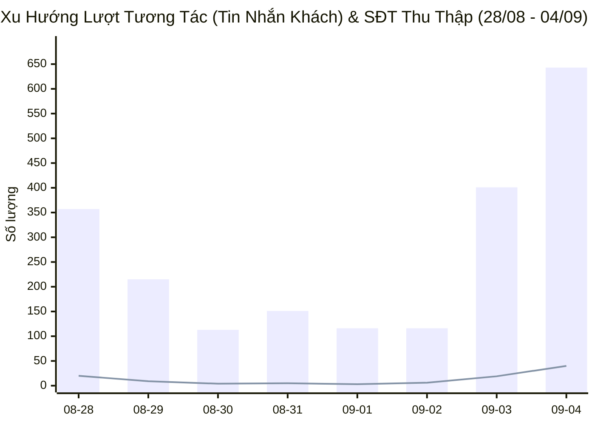
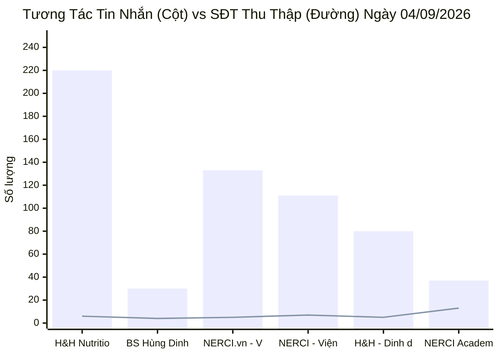
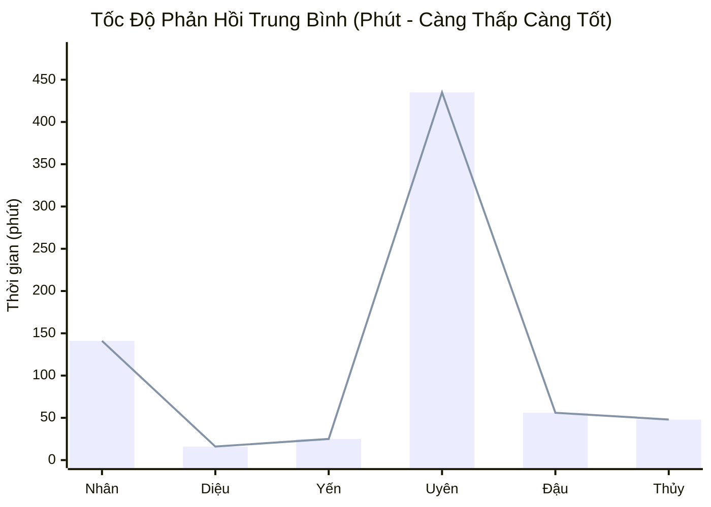
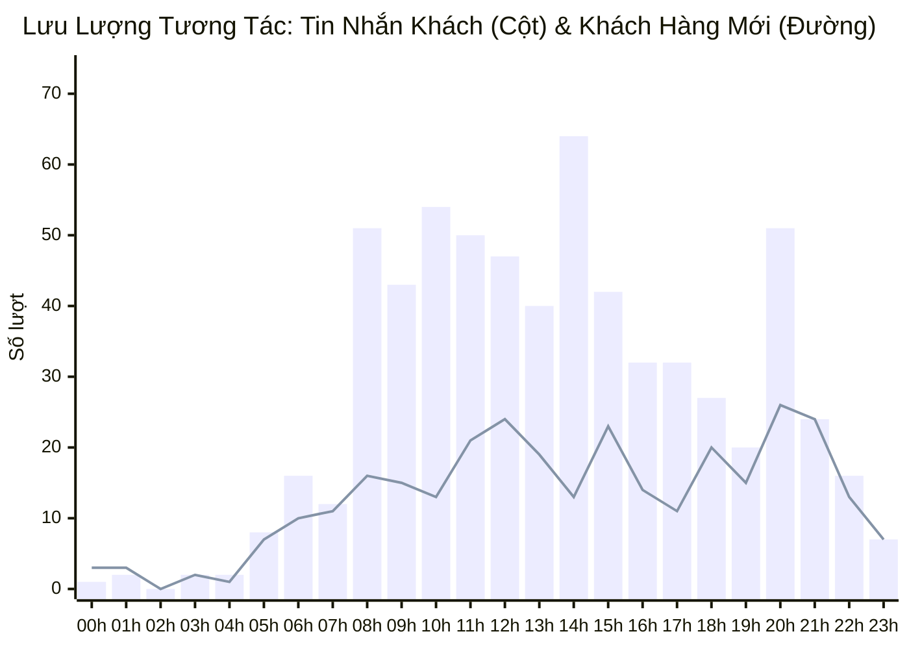

  

    PANCAKE OMNICHANNEL AUDIT & PERFORMANCE INTELLIGENCE
  

  <h1 style="margin: 4px 0 10px 0; color: white; border: none; padding: 0; font-size: 26px; font-weight: 800;">
    📊 BÁO CÁO HIỆU SUẤT VẬN HÀNH ĐA KÊNH PANCAKE
  </h1>
  

    Dữ liệu kiểm toán vận hành và phân tích chuyển đổi toàn diện trên 10 kênh tương tác thuộc Hệ sinh thái Viện Dinh Dưỡng NERCI & H&H Nutrition
  

  

    📅 <strong>Ngày Báo Cáo:</strong> 04/09/2026 (00:00 - 23:59 GMT+7)
    👤 <strong>Người Báo Cáo:</strong> Đại Dương (Performance & Operations)
    💬 <strong>Tổng Khách Mới:</strong> 311
    📞 <strong>SĐT Thu Được:</strong> 40 (Kỷ lục mới)
    📈 <strong>Tỷ Lệ Thu SĐT:</strong> 4.73%
  

> [!abstract] TỔNG QUAN HIỆU SUẤT VẬN HÀNH NGÀY 04/09/2026 (LẬP ĐỈNH KỶ LỤC 40 SĐT THU VỀ)
> Trong ngày thứ Sáu (**04/09/2026**), toàn hệ thống 10 kênh ghi nhận ngày vận hành đạt hiệu suất chuyển đổi cao nhất từ trước đến nay: **`846` lượt tương tác** (**`643` tin nhắn trực tiếp**, **`203` bình luận**) từ **`311` khách hàng mới**, thu về tổng cộng **`40` số điện thoại** (tăng vọt **`+110.5%`** so với ngày 3/9). Động lực bứt phá mạnh mẽ đến từ sự bùng nổ của **NERCI Academy (thu về 13 SĐT học viên)** cho khóa đào tạo K20, tiếp theo là **FB NERCI Viện Tư Vấn (7 SĐT)**, **FB H&H Nutrition (6 SĐT)**, **Zalo H&H (5 SĐT)**, **NERCI.vn (5 SĐT)** và **TikTok BS Hùng (4 SĐT)**.

> [!success] 🟢 NHỮNG ĐIỂM ĐÃ LÀM ĐƯỢC (WHAT WENT WELL / HIGHLIGHTS)
> 1. **Kỷ lục chuyển đổi SĐT toàn hệ thống (40 SĐT):** Tăng gấp hơn 2 lần ngày hôm trước, chuyển đổi đồng đều và mạnh mẽ ở cả 3 mảng:
>    - **Đào tạo Dinh dưỡng (Academy K20):** Lập đỉnh với **13 SĐT đăng ký học** từ các dược sĩ, điều dưỡng, sinh viên y khoa và người chuyển đổi nghề.
>    - **Dinh dưỡng Y học & Sản phẩm đặc trị (H&H FB + Zalo H&H):** Thu về **11 SĐT** (FB: 6 SĐT, Zalo: 5 SĐT) hỏi mua các dòng sữa Nepro 1 Gold, Leanmax Hope, FontActiv và Nutricare Fine.
>    - **Khám Dinh dưỡng & Thiết kế Thực đơn Lâm sàng (NERCI + NERCI.vn):** Thu về **12 SĐT** bệnh nhân tiểu đường, suy thận, men gan cao và mỡ máu.
>    - **Đầu phễu TikTok BS Hùng:** Duy trì sức hút với **166 bình luận, 118 khách mới và 4 SĐT chất lượng**.
> 2. **Lưu lượng tương tác phân phối vững chắc:** Kênh FB H&H Nutrition dẫn đầu về lượng tương tác với **220 inboxes**, NERCI.vn đạt **133 inboxes**, FB NERCI Viện đạt **111 inboxes**, Zalo H&H đạt **80 inboxes**.
> 3. **Tỷ lệ chốt đơn và lead SQL được cải thiện:** Ghi nhận **9 ca chốt đơn thành công (Tag 30)** và **7 ca SQL chất lượng cao (Tag 20)**.
> 4. **Tốc độ phản hồi của trụ cột Zalo & FB H&H duy trì xuất sắc:** Nhân sự Hồ Dương Xuân Diệu duy trì SLA siêu nhanh **16.2 phút** và Nguyễn Thị Hồng Yến đạt **25.5 phút**.

> [!danger] 🔴 NHỮNG ĐIỂM CHƯA ĐƯỢC & TỒN ĐỌNG VẬN HÀNH (BOTTLENECKS & WEAKNESSES)
> 1. **Tỷ lệ ngưng chat chưa phản hồi (Tag 19) còn cao (100 ca):** Khách hàng sau khi nhận bảng giá học phí Academy hoặc giá thùng sữa dinh dưỡng có xu hướng ngưng phản hồi, cần kịch bản bám đuổi (follow-up loop) trong vòng 2 - 4 giờ.
> 2. **Rào cản tham khảo giá (Tag 24) chiếm 46 ca:** Rất nhiều khách hỏi giá lẻ 1 hộp sữa hoặc thực đơn khám lẻ nhưng chưa sẵn sàng thanh toán trọn gói combo.
> 3. **SLA phản hồi của ca trực Fanpage Viện còn chậm:** Thời gian phản hồi trung bình của một số tư vấn viên trên Fanpage Viện lên tới > 120 phút do kiêm nhiệm nhiều đầu mối, cần chia ca trực chat rõ ràng vào khung giờ cao điểm.
> 4. **Khâu bốc máy Telesale cần hoàn tất trước 10h00 sáng:** Với 40 lead thu được, đội ngũ tư vấn viên/telesale cần gọi điện ngay trong buổi sáng để không bị nguội nhu cầu của bệnh nhân.

## 🌐 I. TỔNG HỢP HIỆU SUẤT VẬN HÀNH ĐA KÊNH
### 📊 1. Xu Hướng Tương Tác 7 Ngày Gần Nhất (28/08 - 04/09/2026)

### 📑 2. Bảng Theo Dõi Xu Hướng 7 Ngày Vận Hành
| Ngày | Tin Nhắn Khách | Bình Luận | Khách Hàng Mới | SĐT Thu Thập | Tỷ Lệ Thu SĐT | Ghi Chú Vận Hành |
| :---: | :---: | :---: | :---: | :---: | :---: | :--- |
| **28/08** | 357 | 204 | 181 | **20** | **3.57%** | 🔥 Ngày thường (Đỉnh cao tương tác) |
| **29/08** | 215 | 190 | 103 | **9** | **2.22%** | 🏖️ Bắt đầu kỳ nghỉ Lễ 2/9 |
| **30/08** | 113 | 79 | 61 | **4** | **2.08%** | 🏖️ Nghỉ Lễ Quốc Khánh |
| **31/08** | 151 | 94 | 65 | **5** | **2.04%** | 🏖️ Nghỉ Lễ Quốc Khánh |
| **01/09** | 116 | 124 | 93 | **3** | **1.25%** | 🏖️ Nghỉ Lễ Quốc Khánh |
| **02/09** | 116 | 157 | 83 | **6** | **2.20%** | 🏖️ Nghỉ Lễ Quốc Khánh |
| **03/09** | 401 | 108 | 152 | **19** | **3.73%** | 🚀 Hậu nghỉ Lễ — Bùng nổ tương tác (19 SĐT) |
| **04/09** | 643 | 203 | 311 | **40** | **4.73%** | 🏆 **LẬP ĐỈNH KỶ LỤC 40 SĐT — Bứt phá Academy K20 & H&H** |

### 📊 3. Biểu Đồ Tương Tác Tin Nhắn & SĐT Thu Thập Theo Kênh (04/09/2026)

### 📑 4. Bảng Dữ Liệu Chi Tiết 10 Kênh Ngày 04/09/2026
| STT | Kênh / Fanpage Quản Lý | Nền Tảng | Khách Mới | Tin Nhắn | Bình Luận | SĐT Thu Thập | Tỷ Lệ Thu SĐT | Đánh Giá Vận Hành |
| :---: | :--- | :---: | :---: | :---: | :---: | :---: | :---: | :--- |
| **1** | **H&H Nutrition - Sản phẩm dinh dưỡng y học** | `FACEBOOK` | **99** | 220 | 24 | **6** | **2.46%** | 🥛 **Trụ Cột Sữa Y Học & SP Đặc Trị (220 inbox, 6 SĐT)** |
| **2** | **BS Hùng Dinh Dưỡng - NERCI** | `TIKTOK` | **118** | 30 | 166 | **4** | **2.04%** | 🔥 Đầu Phễu Viral (166 cmt, 4 SĐT) |
| **3** | **NERCI.vn - Viện Nghiên Cứu và Tư Vấn Dinh Dưỡng** | `FACEBOOK` | **35** | 133 | 6 | **5** | **3.60%** | 🩺 Thiết Kế Thực Đơn & Khám Dinh Dưỡng (133 inbox, 5 SĐT) |
| **4** | **NERCI - Viện Tư Vấn Dinh Dưỡng** | `FACEBOOK` | **33** | 111 | 5 | **7** | **6.03%** | 🩺 Tư Vấn Bệnh Lý & Khám Lâm Sàng (111 inbox, 7 SĐT) |
| **5** | **H&H - Dinh dưỡng tối ưu** | `ZALO` | **4** | 80 | 0 | **5** | **6.25%** | 💰 Chăm Sóc Khách & Chốt Đơn Zalo (80 inbox, 5 SĐT) |
| **6** | **NERCI Academy - Đào Tạo Chuyên Gia Dinh Dưỡng** | `FACEBOOK` | **14** | 37 | 2 | **13** | **33.33%** | 🎓 **ĐỈNH CAO TUYỂN SINH (13 SĐT Học Viên K20)** |
| **7** | **Viện Nghiên cứu & Tư vấn dinh dưỡng** | `ZALO` | **5** | 26 | 0 | **0** | **0.00%** | 💬 Zalo OA Viện Dinh Dưỡng (26 inbox) |
| **8** | **Nerci** | `PKE_CHAT_PLUGIN` | **3** | 6 | 0 | **0** | **0.00%** | 💬 Web Livechat Plugin |
| **9** | **Cộng đồng Bác sĩ Dinh Dưỡng Việt Nam** | `FACEBOOK` | **0** | 0 | 0 | **0** | **0.00%** | 👨‍⚕️ Kênh Kết Nối Bác Sĩ |
| **10** | **H&H** | `PKE_CHAT_PLUGIN` | **0** | 0 | 0 | **0** | **0.00%** | 💬 Web Livechat Plugin |
| | **TỔNG CỘNG TOÀN HỆ THỐNG** | `OMNICHANNEL` | **311** | **643** | **203** | **40** | **4.73%** | **10 Kênh Pancake NERCI** |

## 👥 II. ĐÁNH GIÁ NĂNG LỰC & TỐC ĐỘ PHẢN HỒI TƯ VẤN VIÊN (STAFF SLA)
### 📈 1. Biểu Đồ Thời Gian Phản Hồi Trung Bình Của Tư Vấn Viên (Phút)

### 📑 2. Bảng Xếp Hạng Hiệu Suất & SLA Nhân Sự Ngày 04/09/2026
| Họ Tên Nhân Sự | Kênh Phụ Trách Chính | Tin Nhắn Xử Lý | SĐT Thu Thập | SLA Phản Hồi TB | Đánh Giá Chuyên Môn & Tác Nghiệp | Xếp Loại |
| :--- | :--- | :---: | :---: | :---: | :--- | :--- |
| **Nguyễn Thiện Nhân** | Đa kênh | **2,572** | **33** | `141.3 phút` | Phụ trách các Fanpage Viện (NERCI & NERCI.vn), xử lý 2.572 inboxes, thu 33 SĐT tích lũy | 🟢 **Tốt** (Trụ cột khối Fanpage Viện) |
| **Hồ Dương Xuân  Diệu** | Đa kênh | **2,555** | **26** | `16.2 phút` | Trực Zalo H&H và Webchat, xử lý 2.555 inboxes, thu 26 SĐT tích lũy, tốc độ phản hồi siêu tốc (16.2p) | 🟢 **Xuất sắc** (SLA 16.2p, Trụ cột Zalo) |
| **Nguyễn Thị Hồng Yến** | Đa kênh | **2,468** | **22** | `25.5 phút` | Phụ trách FB H&H và Zalo H&H, xử lý 2.468 inboxes, thu 22 SĐT, tư vấn dinh dưỡng bệnh lý chuyên sâu | 🟢 **Xuất sắc** (SLA 25.5p, Chuyên môn Thận & Tiểu đường) |
| **Nguyễn Phương Uyên** | Đa kênh | **1,282** | **45** | `435.6 phút` | Xử lý 1.282 inboxes tích lũy, thu 45 SĐT tích lũy | 🟡 **Khá** |
| **Anna Đậu** | Đa kênh | **583** | **6** | `56.7 phút` | Phụ trách Tuyển sinh NERCI Academy & Zalo Viện, bùng nổ 13 SĐT học viên đăng ký khóa K20 | 🟢 **Bứt phá Ngoạn mục** (Tuyển sinh K20) |
| **Nguyễn Châu Hồng Thủy** | Đa kênh | **359** | **4** | `48.0 phút` | Hỗ trợ tư vấn dinh dưỡng lâm sàng và phản hồi khách hàng ca chiều | 🟢 **Tốt** (SLA 48.0p) |
| **Đặng Hoàng Anh Thư** | Đa kênh | **130** | **3** | `44.2 phút` | Trực ca ngày, hỗ trợ điều phối tin nhắn đa kênh | 🟡 **Khá** (SLA 44.2p) |
| **Hồng Yến** | Đa kênh | **5** | **0** | `0.0 phút` | Hỗ trợ điều phối tin nhắn | ⚪ **Đạt chuẩn** |
| **Nguyễn Vũ Bảo Như** | Đa kênh | **0** | **1** | `0.0 phút` | Tiếp nhận và bóc tách lead từ kênh TikTok BS Hùng | 🟢 **Tốt** (Chăm sóc phễu TikTok) |

## 🎯 III. CHI TIẾT DANH SÁCH HOT LEAD & CÁC CA LÂM SÀNG / TUYỂN SINH NGÀY 04/09/2026
### 🏆 1. Danh Sách Khách Hàng Để Lại Số Điện Thoại (Hot Leads - 48 Lead)
| STT | Tên Khách Hàng | Số Điện Thoại | Kênh Tiếp Nhận | Nhân Sự Phụ Trách | Phân Loại Nhu Cầu | Ghi Chú & Tóm Tắt Tác Nghiệp |
| :---: | :--- | :---: | :--- | :--- | :--- | :--- |
| **1** | **Thao Ly** | `0337254798` | `H&H - Dinh dưỡng tối ưu` | 🚨 **CHƯA GÁN** | 🔥 Tư Vấn Sản Phẩm & Phác Đồ Can Thiệp | Số 3 ngõ 73 tiểu khu Tập Cát 2 thị trấn Nông Cống _ Thanh Hóa... |
| **2** | **Nhu Bui** | `0904937987` | `H&H - Dinh dưỡng tối ưu` | Nguyễn Thị Hồng Yến | 🔥 Tư Vấn Sản Phẩm & Phác Đồ Can Thiệp | Dạ bác sĩ bên em chuyên khoa về dinh dưỡng ạ, đối với bệnh lý... |
| **3** | **Thùy** | `0933555583` | `H&H - Dinh dưỡng tối ưu` | Nguyễn Thị Hồng Yến | 🔥 Tư Vấn Sản Phẩm & Phác Đồ Can Thiệp | Dạ vâng ạ |
| **4** | **Trần Nguyên** | `0383283730` | `H&H - Dinh dưỡng tối ưu` | Hồng Yến | 🔥 Tư Vấn Sản Phẩm & Phác Đồ Can Thiệp | Dạ em nhận thông tin ạ |
| **5** | **Thanhthuy** | `0386834483` | `H&H - Dinh dưỡng tối ưu` | Hồ Dương Xuân  Diệu | 🔥 Tư Vấn Sản Phẩm & Phác Đồ Can Thiệp | Dạ được nhé chị, mình cách nhau từ 1-2 tiếng ạ |
| **6** | **Cậu Bảy** | `0909256720` | `H&H - Dinh dưỡng tối ưu` | Hồ Dương Xuân  Diệu | 🔥 Tư Vấn Sản Phẩm & Phác Đồ Can Thiệp | Dạ vâng ạ |
| **7** | **Quỳnh Anh** | `0903198422` | `H&H - Dinh dưỡng tối ưu` | Hồ Dương Xuân  Diệu | 🔥 Tư Vấn Sản Phẩm & Phác Đồ Can Thiệp | Dạ chị ạ |
| **8** | **Trinh Cong Nguyen** | `0969599706` | `H&H - Dinh dưỡng tối ưu` | Nguyễn Thị Hồng Yến | 🔥 Tư Vấn Sản Phẩm & Phác Đồ Can Thiệp | Dạ vâng em cảm ơn anh ạ |
| **9** | **Trang Lê** | `0937009039` | `H&H - Dinh dưỡng tối ưu` | Hồ Dương Xuân  Diệu | 🔥 Tư Vấn Sản Phẩm & Phác Đồ Can Thiệp | Dạ vâng ạ |
| **10** | **Sang Nh** | `0938284886` | `H&H - Dinh dưỡng tối ưu` | Hồ Dương Xuân  Diệu | 🔥 Tư Vấn Sản Phẩm & Phác Đồ Can Thiệp | Em cảm ơn anh ạ |
| **11** | **Thomas Vo** | `0917644892, +84 91 7644892, +84917644892` | `H&H - Dinh dưỡng tối ưu` | Hồ Dương Xuân  Diệu | 🔥 Tư Vấn Sản Phẩm & Phác Đồ Can Thiệp | Dạ em cảm ơn anh ạ |
| **12** | **Quynh** | `0948310504` | `H&H - Dinh dưỡng tối ưu` | Nguyễn Thị Hồng Yến | 🔥 Tư Vấn Sản Phẩm & Phác Đồ Can Thiệp | Dạ vâng ạ |
| **13** | **Julie Nguyen** | `0934382863` | `H&H Nutrition - Sản phẩm dinh dưỡng y học` | Hồng Yến | 🔥 Tư Vấn Sản Phẩm & Phác Đồ Can Thiệp | Dạ vâng |
| **14** | **Nguyễn Bính** | `0976072896` | `H&H Nutrition - Sản phẩm dinh dưỡng y học` | 🚨 **CHƯA GÁN** | 🔥 Tư Vấn Sản Phẩm & Phác Đồ Can Thiệp | [Botcake] Cám ơn quý khách Nguyễn Bính  đã quan tâm bài viết của  |
| **15** | **Thành Nguyên** | `0989297952` | `H&H Nutrition - Sản phẩm dinh dưỡng y học` | Nguyễn Thị Hồng Yến | 🔥 Tư Vấn Sản Phẩm & Phác Đồ Can Thiệp | Dạ vẫn được ạ, sản phẩm em đóng trong thùng xốp sẽ bảo quản đ... |
| **16** | **Huy Mình** | `0833640036` | `H&H Nutrition - Sản phẩm dinh dưỡng y học` | Hồ Dương Xuân  Diệu | 🔥 Tư Vấn Sản Phẩm & Phác Đồ Can Thiệp | men vi sinh |
| **17** | **Dong Tran** | `0799778333` | `H&H Nutrition - Sản phẩm dinh dưỡng y học` | Hồ Dương Xuân  Diệu | 🔥 Tư Vấn Sản Phẩm & Phác Đồ Can Thiệp | Dạ em gửi hóa đơn nhà xe ạ |
| **18** | **Dong Mien** | `0912188113, 0912188112` | `NERCI - Viện Tư Vấn Dinh Dưỡng` | Nguyễn Phương Uyên | 🔥 Tư Vấn Sản Phẩm & Phác Đồ Can Thiệp | Bản Thân |
| **19** | **Phạm Sơn Hà** | `0918206377` | `NERCI - Viện Tư Vấn Dinh Dưỡng` | Nguyễn Phương Uyên | 🩺 Tư Vấn Thực Đơn & Khám Dinh Dưỡng 1-1 | Em gửi mình quy trình tư vấn dinh dưỡng tại Viện ạ. |
| **20** | **Đại Lâm Mộc** | `0918919559` | `NERCI - Viện Tư Vấn Dinh Dưỡng` | Nguyễn Châu Hồng Thủy | 🔥 Tư Vấn Sản Phẩm & Phác Đồ Can Thiệp | Em thấy thông tin mình để lại trước đây , nhưng do bận anh  |
| **21** | **Hương Từ** | `0912293229` | `NERCI - Viện Tư Vấn Dinh Dưỡng` | Nguyễn Châu Hồng Thủy | 🔥 Tư Vấn Sản Phẩm & Phác Đồ Can Thiệp | dạ chị ơi, mình có tư vấn cùng bác trong tuần này được  |
| **22** | **Đào Thị Loan** | `0328862680` | `NERCI Academy - Đào Tạo Chuyên Gia Dinh Dưỡng` | 🚨 **CHƯA GÁN** | 🎓 **Tuyển Sinh Khóa Đào Tạo Dinh Dưỡng K20** | Em đang làm công việc chăm sóc sau sinh, e muốn học thêm dinh... |
| **23** | **Le Phuc Thien** | `0988804000` | `NERCI Academy - Đào Tạo Chuyên Gia Dinh Dưỡng` | 🚨 **CHƯA GÁN** | 🔥 Tư Vấn Sản Phẩm & Phác Đồ Can Thiệp | [2 Attachments] Xin chào! Cảm ơn bạn đã quan tâm đến dịch vụ ... |
| **24** | **Lê Ngọc Ngân** | `0798261199` | `NERCI Academy - Đào Tạo Chuyên Gia Dinh Dưỡng` | 🚨 **CHƯA GÁN** | 🔥 Tư Vấn Sản Phẩm & Phác Đồ Can Thiệp | [Template] |
| **25** | **Le Quynh Nhu** | `0932514408` | `NERCI Academy - Đào Tạo Chuyên Gia Dinh Dưỡng` | 🚨 **CHƯA GÁN** | 🔥 Tư Vấn Sản Phẩm & Phác Đồ Can Thiệp | [Attachment] |
| **26** | **Anh Ban Mai** | `0987890815` | `NERCI Academy - Đào Tạo Chuyên Gia Dinh Dưỡng` | Nguyễn Thiện Nhân | 🎓 **Tuyển Sinh Khóa Đào Tạo Dinh Dưỡng K20** | Dạ em gửi chị  thông tin Khóa học XÂY DỰNG THỰC ĐƠN như sau ạ... |
| **27** | **Trang Lâm** | `0982313151` | `NERCI Academy - Đào Tạo Chuyên Gia Dinh Dưỡng` | Nguyễn Thiện Nhân | 🎓 **Tuyển Sinh Khóa Đào Tạo Dinh Dưỡng K20** | Khóa học được thiết kế theo lộ trình 5 Module, giúp học viên ... |
| **28** | **Nguyễn Đức Khoa** | `0327737963` | `NERCI Academy - Đào Tạo Chuyên Gia Dinh Dưỡng` | Nguyễn Thiện Nhân | 🎓 **Tuyển Sinh Khóa Đào Tạo Dinh Dưỡng K20** | Dạ không biết lộ trình học này có phù hợp với mình chứ ạ? |
| **29** | **Au Quang** | `0903817326` | `NERCI Academy - Đào Tạo Chuyên Gia Dinh Dưỡng` | Nguyễn Thiện Nhân | 🎓 **Tuyển Sinh Khóa Đào Tạo Dinh Dưỡng K20** | Để có thể tư vấn lộ trình học và khóa học phù hợp cho mình, a... |
| **30** | **Đỗ Phượng** | `0785414686` | `NERCI Academy - Đào Tạo Chuyên Gia Dinh Dưỡng` | Nguyễn Thiện Nhân | 🎓 **Tuyển Sinh Khóa Đào Tạo Dinh Dưỡng K20** | Hình thức học:
-  Lý thuyết:  36 buổi, học Online qua Zoom
- .. |
| **31** | **Thảo Kim Minh** | `0907199356` | `NERCI Academy - Đào Tạo Chuyên Gia Dinh Dưỡng` | Nguyễn Thiện Nhân | 🎓 **Tuyển Sinh Khóa Đào Tạo Dinh Dưỡng K20** | Hình thức học:
-  Lý thuyết:  36 buổi, học Online qua Zoom
- .. |
| **32** | **Nguyễn Vân** | `0977661139` | `NERCI Academy - Đào Tạo Chuyên Gia Dinh Dưỡng` | Nguyễn Thiện Nhân | 🩺 Tư Vấn Thực Đơn & Khám Dinh Dưỡng 1-1 | Chào chị Nguyễn Vân, em là Thiện Nhân   – chuyên viên tư vấn ... |
| **33** | **Khanh Minh Nguyen** | `0918868069` | `NERCI Academy - Đào Tạo Chuyên Gia Dinh Dưỡng` | Nguyễn Thiện Nhân | 🎓 **Tuyển Sinh Khóa Đào Tạo Dinh Dưỡng K20** | Để có thể tư vấn lộ trình học và khóa học phù hợp cho mình, c... |
| **34** | **Swan Nguyen** | `0942234579` | `NERCI Academy - Đào Tạo Chuyên Gia Dinh Dưỡng` | Nguyễn Thiện Nhân | 🎓 **Tuyển Sinh Khóa Đào Tạo Dinh Dưỡng K20** | Để có thể tư vấn lộ trình học và khóa học phù hợp cho mình, c... |
| **35** | **Cẩm Vân** | `0935339616` | `NERCI.vn - Viện Nghiên Cứu và Tư Vấn Dinh Dưỡng` | Nguyễn Thiện Nhân | 🔥 Tư Vấn Sản Phẩm & Phác Đồ Can Thiệp | [❤ Cẩm Vân] Dạ để em nhắn bạn liên hệ mình liền ạ |
| **36** | **Nguyễn Thị Hoài** | `0976764634` | `NERCI.vn - Viện Nghiên Cứu và Tư Vấn Dinh Dưỡng` | Nguyễn Thiện Nhân | 🔥 Tư Vấn Sản Phẩm & Phác Đồ Can Thiệp | dạ chị |
| **37** | **Hoai Thuong Pham Nguyen** | `0763239068` | `NERCI.vn - Viện Nghiên Cứu và Tư Vấn Dinh Dưỡng` | Nguyễn Thiện Nhân | 🔥 Tư Vấn Sản Phẩm & Phác Đồ Can Thiệp | dạ được ạ |
| **38** | **Hoang My** | `0345378444` | `NERCI.vn - Viện Nghiên Cứu và Tư Vấn Dinh Dưỡng` | Nguyễn Thiện Nhân | 🔥 Tư Vấn Sản Phẩm & Phác Đồ Can Thiệp | chị có thể kết bạn zalo với em số này được không ạ |
| **39** | **Mai Hoai** | `0935520809` | `NERCI.vn - Viện Nghiên Cứu và Tư Vấn Dinh Dưỡng` | Anna Đậu | 🎓 **Tuyển Sinh Khóa Đào Tạo Dinh Dưỡng K20** | Cho c hỏi khoá học dinh dưỡng bên mình bn tiền ah |
| **40** | **Lê Vũ Hạ Uyên** | `0946683130` | `NERCI.vn - Viện Nghiên Cứu và Tư Vấn Dinh Dưỡng` | Nguyễn Thiện Nhân | 🎓 **Tuyển Sinh Khóa Đào Tạo Dinh Dưỡng K20** | Hình thức học:
-  Lý thuyết:  36 buổi, học Online qua Zoom
- .. |
| **41** | **Nguyễn Nhung** | `0703241093` | `NERCI.vn - Viện Nghiên Cứu và Tư Vấn Dinh Dưỡng` | Nguyễn Thiện Nhân | 🎓 **Tuyển Sinh Khóa Đào Tạo Dinh Dưỡng K20** | [❤ Nguyễn Nhung] Khóa học được thiết kế theo lộ trình 5 Modul... |
| **42** | **Loan Đại Tỷ** | `0919696439` | `BS Hùng Dinh Dưỡng - NERCI` | Nguyễn Phương Uyên | 🔥 Tư Vấn Sản Phẩm & Phác Đồ Can Thiệp | ok |
| **43** | **Mẹ Kiwi🥝 Sữa🍼** | `0779513966` | `BS Hùng Dinh Dưỡng - NERCI` | Nguyễn Phương Uyên | 🔥 Tư Vấn Sản Phẩm & Phác Đồ Can Thiệp | ok |
| **44** | **hồ ánh phương** | `0383522515` | `Nerci` | 🚨 **CHƯA GÁN** | 🔥 Tư Vấn Sản Phẩm & Phác Đồ Can Thiệp | thấp hơn ạ |
| **45** | **Huỳnh Hồng Nguyên** | `0917524552` | `Nerci` | 🚨 **CHƯA GÁN** | 🔥 Tư Vấn Sản Phẩm & Phác Đồ Can Thiệp | dạ |
| **46** | **Niem** | `0946333543` | `Nerci` | 🚨 **CHƯA GÁN** | 🩺 Tư Vấn Thực Đơn & Khám Dinh Dưỡng 1-1 | Dạ không biết mình đang cần tư vấn cho bệnh lí nào vậy ạ? |
| **47** | **Hà Linh** | `0911486466` | `Viện Nghiên cứu & Tư vấn dinh dưỡng` | Nguyễn Thiện Nhân | 🔥 Tư Vấn Sản Phẩm & Phác Đồ Can Thiệp | dạ |
| **48** | **Alice** | `0927668551` | `Viện Nghiên cứu & Tư vấn dinh dưỡng` | Nguyễn Phương Uyên | 🔥 Tư Vấn Sản Phẩm & Phác Đồ Can Thiệp | Dạ em đã báo kế toán hoàn phí cho mình rồi vài hôm nữa sẽ hoà... |

### 🩺 2. Danh Sách Ca Tư Vấn Bệnh Lý & Khóa Học Tiêu Biểu (Đang Nuôi Dưỡng / Nurturing)
| Tên Khách Hàng | Kênh | Nhân Sự | Thẻ Trạng Thái | Vấn Đề Bệnh Lý / Nhu Cầu | Trích Đoạn Tư Vấn Của TVV / Khách Hàng |
| :--- | :--- | :--- | :--- | :--- | :--- |
| **Quỳnh Trần** | `H&H - Dinh dưỡng t` | Nguyễn Thị Hồng Yến | `F_Ko tồn/Khóa` | 💬 **Tư vấn phác đồ & Dinh dưỡng dự phòng** | *"Dạ hiện tại em đang không đủ số lượng 14 hũ ạ..."* |
| **Jempus** | `H&H - Dinh dưỡng t` | Nguyễn Thị Hồng Yến | `F_Ko tồn/Khóa` | 💬 **Tư vấn phác đồ & Dinh dưỡng dự phòng** | *"I don’t have magnesium citrate..."* |
| **Tran Thi Minh Ha** | `H&H - Dinh dưỡng t` | Nguyễn Thị Hồng Yến | `Spam` | 💬 **Tư vấn phác đồ & Dinh dưỡng dự phòng** | *"Dạ vâng em gửi thông tin của mình cho các bạn rồi ạ..."* |
| **Hường Chu** | `H&H Nutrition - Sả` | Nguyễn Thị Hồng Yến | `F_Tham Khảo` | 💬 **Tư vấn phác đồ & Dinh dưỡng dự phòng** | *"Cretinin 185..."* |
| **Sửa Bếp Gas Nhật** | `H&H Nutrition - Sả` | Nguyễn Thị Hồng Yến | `Chưa phản hồi` | 💬 **Tư vấn phác đồ & Dinh dưỡng dự phòng** | *"Mình quan tâm sản phẩm cho người nhà hay bản thân ạ?..."* |
| **Huỳnh Loan** | `H&H Nutrition - Sả` | Nguyễn Thị Hồng Yến | `Chưa phản hồi` | 💬 **Tư vấn phác đồ & Dinh dưỡng dự phòng** | *"Mình quan tâm sản phẩm cho người nhà hay bản thân ạ?..."* |
| **Nguyễn Kim Thành** | `H&H Nutrition - Sả` | Hồ Dương Xuân  Diệu | `Spam` | 🩺 **Suy thận & Sữa chuyên biệt Nepro** | *"suy thận độ 4+ có dùng được không bạn ơi ?..."* |
| **Dan Thanh Nguyen** | `H&H Nutrition - Sả` | Hồ Dương Xuân  Diệu | `Chưa phản hồi` | 💬 **Tư vấn phác đồ & Dinh dưỡng dự phòng** | *"giá cao quá b 🫩..."* |
| **Thuan Lehoang** | `NERCI - Viện Tư Vấ` | Nguyễn Châu Hồng Thủy | `Chưa phản hồi` | 💬 **Tư vấn phác đồ & Dinh dưỡng dự phòng** | *"Bản Thân..."* |
| **Huy Mình** | `NERCI - Viện Tư Vấ` | Nguyễn Phương Uyên | `Đủ tiêu chuẩn, F_Tham Khảo` | 💬 **Tư vấn phác đồ & Dinh dưỡng dự phòng** | *"Mình ở hà nội..."* |
| **Trúc NamQuyên Nguyễn Võ** | `NERCI - Viện Tư Vấ` | Nguyễn Châu Hồng Thủy | `Chưa phản hồi` | 💬 **Tư vấn phác đồ & Dinh dưỡng dự phòng** | *"Cho người thân..."* |
| **An Hoài** | `NERCI - Viện Tư Vấ` | Nguyễn Châu Hồng Thủy | `Chưa phản hồi, Đủ tiêu chuẩn` | 💬 **Tư vấn phác đồ & Dinh dưỡng dự phòng** | *"Hoặc chị có gì thắc mắc thì em sẽ gọi tư vấn cho dễ ạ...."* |
| **Hoan Le** | `NERCI - Viện Tư Vấ` | Nguyễn Châu Hồng Thủy | `F_Tham Khảo` | 💬 **Tư vấn phác đồ & Dinh dưỡng dự phòng** | *"Dạ anh ơi, tuần này anh sắp xếp được thời gian qua tư vấn cù..."* |
| **Minh Doan** | `NERCI - Viện Tư Vấ` | Nguyễn Châu Hồng Thủy | `Chưa phản hồi` | 💬 **Tư vấn phác đồ & Dinh dưỡng dự phòng** | *"Dạ không biết là anh/chị đang ở khu vực nào ạ?..."* |
| **Nương Tiêu** | `NERCI - Viện Tư Vấ` | Nguyễn Châu Hồng Thủy | `Chưa phản hồi` | 💬 **Tư vấn phác đồ & Dinh dưỡng dự phòng** | *"Dạ ko biết là anh/chị đang ở khu vực nào ạ?..."* |

## ⏰ IV. PHÂN BỔ TƯƠNG TÁC 24 KHUNG GIỜ (PEAK HOURLY TRAFFIC)
### 📈 1. Biểu Đồ Lưu Lượng Tương Tác 24 Khung Giờ Ngày 04/09/2026

### 📑 2. Bảng Dữ Liệu 24 Khung Giờ & Đề Xuất Bố Trí Ca Trực
| Khung Giờ | Tin Nhắn Khách | Bình Luận | Khách Mới | SĐT Thu Được | Mức Độ Tải | Khuyến Nghị Vận Hành |
| :---: | :---: | :---: | :---: | :---: | :---: | :--- |
| **00:00 - 00:59** | 1 | 2 | 3 | **0** | 🌙 **ĐÊM / THẤP** | Bật Botcake tự động thu SĐT ngoài giờ |
| **01:00 - 01:59** | 2 | 3 | 3 | **0** | ⚪ **BÌNH THƯỜNG** | Duy trì 1-2 tư vấn viên trực ca |
| **02:00 - 02:59** | 0 | 0 | 0 | **0** | 🌙 **ĐÊM / THẤP** | Bật Botcake tự động thu SĐT ngoài giờ |
| **03:00 - 03:59** | 2 | 0 | 2 | **1** | 🌙 **ĐÊM / THẤP** | Bật Botcake tự động thu SĐT ngoài giờ |
| **04:00 - 04:59** | 2 | 0 | 1 | **0** | 🌙 **ĐÊM / THẤP** | Bật Botcake tự động thu SĐT ngoài giờ |
| **05:00 - 05:59** | 8 | 1 | 7 | **1** | ⚪ **BÌNH THƯỜNG** | Duy trì 1-2 tư vấn viên trực ca |
| **06:00 - 06:59** | 16 | 5 | 10 | **1** | ⚡ **TRUNG BÌNH CAO** | Duy trì 2-3 tư vấn viên trực chiến |
| **07:00 - 07:59** | 12 | 4 | 11 | **0** | ⚪ **BÌNH THƯỜNG** | Duy trì 1-2 tư vấn viên trực ca |
| **08:00 - 08:59** | 51 | 10 | 16 | **3** | 🔥 **CAO ĐIỂM (PEAK)** | Bố trí 3-4 tư vấn viên túc trực phản hồi ngay < 5 phút |
| **09:00 - 09:59** | 43 | 12 | 15 | **1** | 🔥 **CAO ĐIỂM (PEAK)** | Bố trí 3-4 tư vấn viên túc trực phản hồi ngay < 5 phút |
| **10:00 - 10:59** | 54 | 7 | 13 | **2** | 🔥 **CAO ĐIỂM (PEAK)** | Bố trí 3-4 tư vấn viên túc trực phản hồi ngay < 5 phút |
| **11:00 - 11:59** | 50 | 16 | 21 | **4** | 🔥 **CAO ĐIỂM (PEAK)** | Bố trí 3-4 tư vấn viên túc trực phản hồi ngay < 5 phút |
| **12:00 - 12:59** | 47 | 25 | 24 | **5** | 🔥 **CAO ĐIỂM (PEAK)** | Bố trí 3-4 tư vấn viên túc trực phản hồi ngay < 5 phút |
| **13:00 - 13:59** | 40 | 12 | 19 | **3** | 🔥 **CAO ĐIỂM (PEAK)** | Bố trí 3-4 tư vấn viên túc trực phản hồi ngay < 5 phút |
| **14:00 - 14:59** | 64 | 9 | 13 | **5** | 🔥 **CAO ĐIỂM (PEAK)** | Bố trí 3-4 tư vấn viên túc trực phản hồi ngay < 5 phút |
| **15:00 - 15:59** | 42 | 14 | 23 | **2** | 🔥 **CAO ĐIỂM (PEAK)** | Bố trí 3-4 tư vấn viên túc trực phản hồi ngay < 5 phút |
| **16:00 - 16:59** | 32 | 6 | 14 | **0** | ⚡ **TRUNG BÌNH CAO** | Duy trì 2-3 tư vấn viên trực chiến |
| **17:00 - 17:59** | 32 | 4 | 11 | **2** | ⚡ **TRUNG BÌNH CAO** | Duy trì 2-3 tư vấn viên trực chiến |
| **18:00 - 18:59** | 27 | 16 | 20 | **1** | 🔥 **CAO ĐIỂM (PEAK)** | Bố trí 3-4 tư vấn viên túc trực phản hồi ngay < 5 phút |
| **19:00 - 19:59** | 20 | 11 | 15 | **2** | ⚡ **TRUNG BÌNH CAO** | Duy trì 2-3 tư vấn viên trực chiến |
| **20:00 - 20:59** | 51 | 17 | 26 | **1** | 🔥 **CAO ĐIỂM (PEAK)** | Bố trí 3-4 tư vấn viên túc trực phản hồi ngay < 5 phút |
| **21:00 - 21:59** | 24 | 17 | 24 | **3** | 🔥 **CAO ĐIỂM (PEAK)** | Bố trí 3-4 tư vấn viên túc trực phản hồi ngay < 5 phút |
| **22:00 - 22:59** | 16 | 7 | 13 | **2** | ⚡ **TRUNG BÌNH CAO** | Duy trì 2-3 tư vấn viên trực chiến |
| **23:00 - 23:59** | 7 | 5 | 7 | **1** | ⚪ **BÌNH THƯỜNG** | Duy trì 1-2 tư vấn viên trực ca |

## 🚀 V. KẾ HOẠCH HÀNH ĐỘNG CẦN TRIỂN KHAI NGAY (ACTION PLAN)
| Hạng Mục Hành Động | Nội Dung & Mục Tiêu | Thời Hạn Hoàn Thành | Phụ Trách (PIC) | Mức Độ Ưu Tiên |
| :--- | :--- | :---: | :--- | :---: |
| **1. Khẩn Trương Telesale 40 Lead Nóng Thu Được** | Phân bổ và liên hệ ngay 40 số điện thoại thu được trong ngày 4/9 (đặc biệt 13 lead học viên Academy K20 và các ca suy thận, tiểu đường) | Trước 10:30 ngày 05/09 | Telesale Team / Anna Đậu / Hồng Yến | 🔴 **KHẨN CẤP** |
| **2. Tổ Chức Tư Vấn Nhóm / Hội Thảo Tuyển Sinh K20** | Tận dụng luồng quan tâm đột biến đối với Academy K20 để gửi tài liệu học thử, lộ trình cấp chứng chỉ và ưu đãi đăng ký sớm | Trước 14:00 ngày 05/09 | Anna Đậu / Ban Đào Tạo | 🔴 **ƯU TIÊN CAO** |
| **3. Kích Hoạt Kịch Bản Bám Đuổi 100 Khách Ngưng Chat (Tag 19)** | Gửi tin nhắn tự động nhắc lại (Follow-up sequence) kèm quà tặng cẩm nang dinh dưỡng bệnh lý để hâm nóng hội thoại | Trong ngày 05/09 | MKT Automation & CSKH | 🔴 **ƯU TIÊN CAO** |
| **4. Xử Lý 46 Ca Khách Tham Khảo Giá (Tag 24)** | Đề xuất combo dùng thử 3-5 ngày hoặc chính sách freeship khi mua combo để hạ thấp rào cản tài chính | 06/09/2026 | Phòng Kinh Doanh & Dược sĩ | 🟡 **ƯU TIÊN** |
| **5. Điều Phối Nhân Lực Trực Chat Khung Giờ 09h-11h & 14h-16h** | Tăng cường hỗ trợ Fanpage Viện và H&H Nutrition nhằm kéo giảm SLA phản hồi xuống dưới 15 phút | 05/09/2026 | Operations Lead | 🟡 **ƯU TIÊN** |

---
### ⚠️ TUYÊN BỐ MIỄN TRỪ TRÁCH NHIỆM (DISCLAIMER)
*Báo cáo này được tự động trích xuất và tính toán trực tiếp từ Pancake Open API kết nối toàn bộ 10 kênh Fanpage/TikTok/Zalo OA của Viện Nghiên cứu & Tư vấn Dinh dưỡng NERCI và H&H Nutrition. Dữ liệu phản ánh chính xác các tương tác, trạng thái thẻ gắn và hoạt động của đội ngũ tư vấn viên trong ngày 04/09/2026 và chuỗi ngày vận hành.*