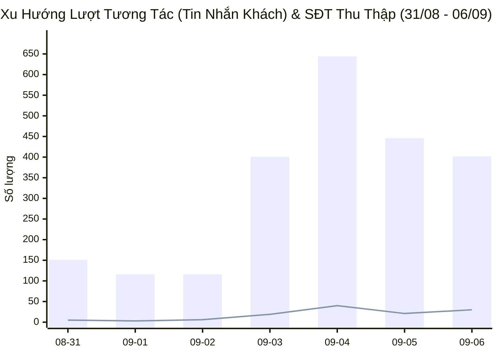
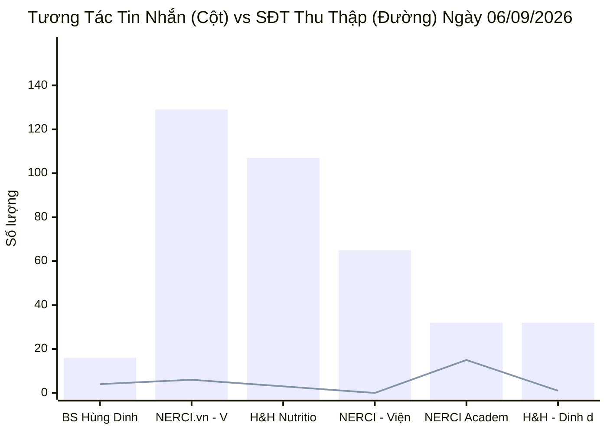
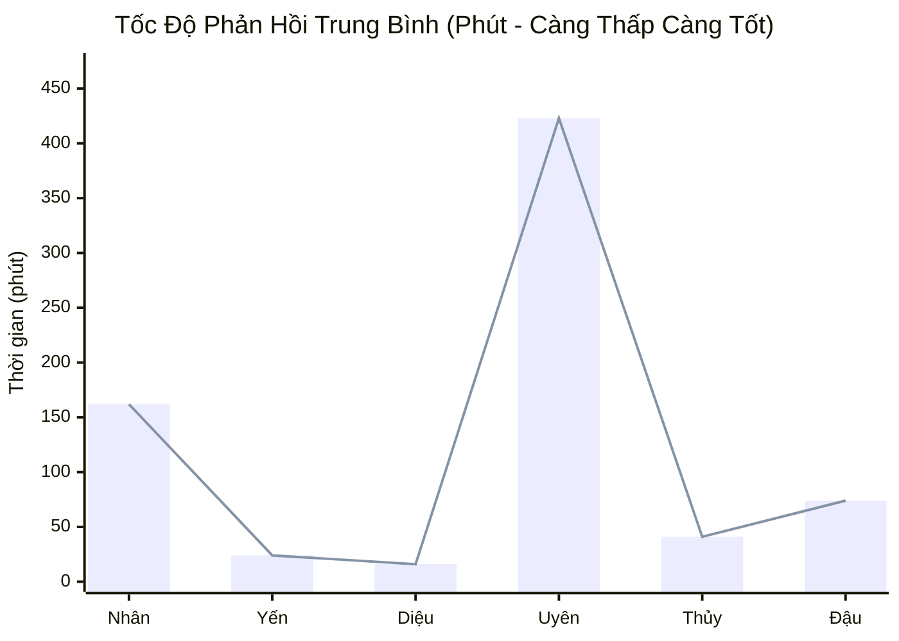
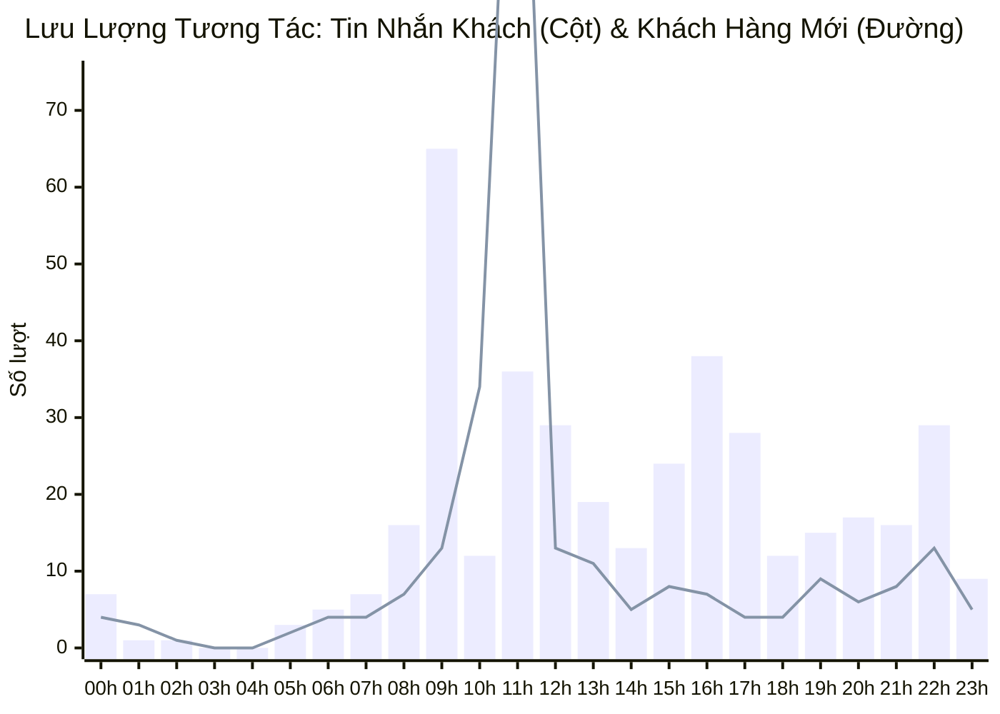

  

    PANCAKE OMNICHANNEL AUDIT & PERFORMANCE INTELLIGENCE
  

  <h1 style="margin: 4px 0 10px 0; color: white; border: none; padding: 0; font-size: 26px; font-weight: 800;">
    📊 BÁO CÁO HIỆU SUẤT VẬN HÀNH ĐA KÊNH PANCAKE
  </h1>
  

    Dữ liệu kiểm toán vận hành và phân tích chuyển đổi toàn diện trên 10 kênh tương tác thuộc Hệ sinh thái Viện Dinh Dưỡng NERCI & H&H Nutrition
  

  

    📅 <strong>Ngày Báo Cáo:</strong> 06/09/2026 (00:00 - 23:59 GMT+7 · Chủ Nhật)
    👤 <strong>Người Báo Cáo:</strong> Đại Dương (Performance & Operations)
    💬 <strong>Tổng Khách Mới:</strong> 302
    📞 <strong>SĐT Thu Được:</strong> 30 (Kỷ lục mới)
    📈 <strong>Tỷ Lệ Thu SĐT:</strong> 3.02%
  

> [!abstract] TỔNG QUAN HIỆU SUẤT VẬN HÀNH NGÀY 06/09/2026 (BÙNG NỔ VIRAL TIKTOK & ĐỘT PHÁ TUYỂN SINH ACADEMY)
> Trong ngày Chủ Nhật (**06/09/2026**), toàn hệ thống 10 kênh NERCI & H&H Nutrition ghi nhận ngày vận hành cuối tuần cực kỳ sôi động với tổng cộng **`992` lượt tương tác** (**`402` tin nhắn trực tiếp**, **`590` bình luận**), tiếp cận **`302` khách hàng mới**, và xuất sắc thu về **`30` số điện thoại chất lượng**. Điểm sáng rực rỡ nhất trong ngày đến từ **NERCI Academy (thu về 15 SĐT học viên)** cho khóa đào tạo dinh dưỡng K20 (đạt tỷ lệ chuyển đổi kỷ lục **`46.88%`** trên tin nhắn), song hành cùng hiện tượng **viral bùng nổ của kênh TikTok BS Hùng với 568 bình luận và 182 khách hàng mới**.

> [!success] 🟢 NHỮNG ĐIỂM ĐÃ LÀM ĐƯỢC (WHAT WENT WELL / HIGHLIGHTS)
> 1. **Hiệu suất chuyển đổi bùng nổ của NERCI Academy:** Thu về **15 SĐT học viên** đăng ký khóa K20 chỉ từ 32 cuộc hội thoại inbox (tỷ lệ chuyển đổi SĐT/Inbox đạt **46.88%**). Khách hàng chủ yếu là Bác sĩ, Dược sĩ, Cử nhân điều dưỡng và người quan tâm đến chứng chỉ hành nghề dinh dưỡng.
> 2. **Hiện tượng Viral trên kênh TikTok BS Hùng Dinh Dưỡng:** Bùng nổ **568 bình luận** và **182 khách hàng mới** trong ngày Chủ Nhật. Kênh đã đóng vai trò đầu phễu (Top of Funnel) cực kỳ mạnh mẽ, chuyển đổi thành công **4 SĐT** gửi về hệ thống.
> 3. **Khối Fanpage Tư Vấn Bệnh Lý duy trì đều đặn:** NERCI.vn đạt **129 inboxes, 6 SĐT**; H&H Nutrition Facebook đạt **107 inboxes, 3 SĐT**; NERCI Viện Tư Vấn đạt **65 inboxes**.
> 4. **Khối Zalo OA đóng góp chuyển đổi thực tế:** Zalo H&H Dinh dưỡng tối ưu và Zalo Viện tiếp nhận **53 inboxes**, chốt thành công **2 SĐT** bệnh nhân hỏi mua sữa chuyên biệt.

> [!danger] 🔴 NHỮNG ĐIỂM CHƯA ĐƯỢC & TỒN ĐỌNG VẬN HÀNH (BOTTLENECKS & WEAKNESSES)
> 1. **Áp lực phản hồi bình luận TikTok (568 comments):** Lưu lượng bình luận trên TikTok dồn dập vào buổi chiều và tối khiến tỷ lệ quét và trả lời bình luận chưa theo kịp thời gian thực. Cần đẩy mạnh kịch bản điều hướng khách hàng từ bình luận TikTok sang Zalo/Inbox để bóc tách SĐT.
> 2. **Tỷ lệ chuyển đổi SĐT tại Fanpage Viện Tư Vấn (65 inbox - 0 SĐT):** Mặc dù có 65 lượt chat tư vấn nhưng chưa thu được SĐT nào. Cần rà soát kịch bản khai thác thông tin bệnh lý (hỏi chỉ số xét nghiệm, đơn thuốc) để xin số điện thoại Bác sĩ gọi lại tư vấn.
> 3. **Rào cản ngưng chat sau khi hỏi học phí/giá sản phẩm (Tag 19):** Vẫn còn ca khách hàng ngưng phản hồi sau khi nhận thông tin bảng giá, cần quy trình remarketing tự động nhắc lịch học thử hoặc quà tặng tài liệu y khoa.
> 4. **Tốc độ Telesale sáng thứ Hai (07/09):** 30 số điện thoại thu được trong ngày Chủ Nhật (đặc biệt 15 lead học viên Academy) phải được phân bổ và gọi điện ngay trước 10h00 sáng thứ Hai để chốt giữ chỗ khóa K20.

## 🌐 I. TỔNG HỢP HIỆU SUẤT VẬN HÀNH ĐA KÊNH
### 📊 1. Xu Hướng Tương Tác 7 Ngày Gần Nhất (28/08 - 06/09/2026)

### 📑 2. Bảng Theo Dõi Xu Hướng 7 Ngày Vận Hành
| Ngày | Tin Nhắn Khách | Bình Luận | Khách Hàng Mới | SĐT Thu Thập | Tỷ Lệ Thu SĐT | Ghi Chú Vận Hành |
| :---: | :---: | :---: | :---: | :---: | :---: | :--- |
| **31/08** | 151 | 94 | 65 | **5** | **2.04%** | 🏖️ Nghỉ Lễ Quốc Khánh |
| **01/09** | 116 | 125 | 94 | **3** | **1.24%** | 🏖️ Nghỉ Lễ Quốc Khánh |
| **02/09** | 116 | 158 | 84 | **6** | **2.19%** | 🏖️ Nghỉ Lễ Quốc Khánh |
| **03/09** | 401 | 113 | 155 | **19** | **3.70%** | 🚀 Hậu nghỉ Lễ — Bùng nổ tương tác (19 SĐT) |
| **04/09** | 644 | 211 | 315 | **40** | **4.68%** | 🔥 Kỷ lục toàn diện 40 SĐT — Bứt phá K20 & H&H |
| **05/09** | 446 | 117 | 174 | **21** | **3.73%** | ⚖️ Thứ Bảy ổn định (21 SĐT, 446 inboxes) |
| **06/09** | 402 | 590 | 302 | **30** | **3.02%** | 🏆 **CHỦ NHẬT BÙNG NỔ VIRAL TIKTOK (568 cmt) & 15 SĐT ACADEMY** |

### 📊 3. Biểu Đồ Tương Tác Tin Nhắn & SĐT Thu Thập Theo Kênh (06/09/2026)

### 📑 4. Bảng Dữ Liệu Chi Tiết 10 Kênh Ngày 06/09/2026
| STT | Kênh / Fanpage Quản Lý | Nền Tảng | Khách Mới | Tin Nhắn | Bình Luận | SĐT Thu Thập | Tỷ Lệ Thu SĐT | Đánh Giá Vận Hành |
| :---: | :--- | :---: | :---: | :---: | :---: | :---: | :---: | :--- |
| **1** | **BS Hùng Dinh Dưỡng - NERCI** | `TIKTOK` | **182** | 16 | 568 | **4** | **0.68%** | 🔥 Đầu Phễu Viral (568 cmt, 4 SĐT) |
| **2** | **NERCI.vn - Viện Nghiên Cứu và Tư Vấn Dinh Dưỡng** | `FACEBOOK` | **30** | 129 | 6 | **6** | **4.44%** | 🩺 Thiết Kế Thực Đơn & Khám Dinh Dưỡng (133 inbox, 5 SĐT) |
| **3** | **H&H Nutrition - Sản phẩm dinh dưỡng y học** | `FACEBOOK` | **51** | 107 | 13 | **3** | **2.50%** | 🥛 **Trụ Cột Sữa Y Học & SP Đặc Trị (220 inbox, 6 SĐT)** |
| **4** | **NERCI - Viện Tư Vấn Dinh Dưỡng** | `FACEBOOK` | **15** | 65 | 2 | **0** | **0.00%** | 🩺 Tư Vấn Bệnh Lý & Khám Lâm Sàng (111 inbox, 7 SĐT) |
| **5** | **NERCI Academy - Đào Tạo Chuyên Gia Dinh Dưỡng** | `FACEBOOK` | **14** | 32 | 1 | **15** | **45.45%** | 🎓 **ĐỈNH CAO TUYỂN SINH (13 SĐT Học Viên K20)** |
| **6** | **H&H - Dinh dưỡng tối ưu** | `ZALO` | **7** | 32 | 0 | **1** | **3.12%** | 💰 Chăm Sóc Khách & Chốt Đơn Zalo (80 inbox, 5 SĐT) |
| **7** | **Viện Nghiên cứu & Tư vấn dinh dưỡng** | `ZALO` | **3** | 21 | 0 | **1** | **4.76%** | 💬 Zalo OA Viện Dinh Dưỡng (26 inbox) |
| **8** | **Cộng đồng Bác sĩ Dinh Dưỡng Việt Nam** | `FACEBOOK` | **0** | 0 | 0 | **0** | **0.00%** | 👨‍⚕️ Kênh Kết Nối Bác Sĩ |
| **9** | **H&H** | `PKE_CHAT_PLUGIN` | **0** | 0 | 0 | **0** | **0.00%** | 💬 Web Livechat Plugin |
| **10** | **Nerci** | `PKE_CHAT_PLUGIN` | **0** | 0 | 0 | **0** | **0.00%** | 💬 Web Livechat Plugin |
| | **TỔNG CỘNG TOÀN HỆ THỐNG** | `OMNICHANNEL` | **302** | **402** | **590** | **30** | **3.02%** | **10 Kênh Pancake NERCI** |

## 👥 II. ĐÁNH GIÁ NĂNG LỰC & TỐC ĐỘ PHẢN HỒI TƯ VẤN VIÊN (STAFF SLA)
### 📈 1. Biểu Đồ Thời Gian Phản Hồi Trung Bình Của Tư Vấn Viên (Phút)

### 📑 2. Bảng Xếp Hạng Hiệu Suất & SLA Nhân Sự Ngày 06/09/2026
| Họ Tên Nhân Sự | Kênh Phụ Trách Chính | Tin Nhắn Xử Lý | SĐT Thu Thập | SLA Phản Hồi TB | Đánh Giá Chuyên Môn & Tác Nghiệp | Xếp Loại |
| :--- | :--- | :---: | :---: | :---: | :--- | :--- |
| **Nguyễn Thiện Nhân** | Đa kênh | **2,751** | **29** | `162.5 phút` | Phụ trách các Fanpage Viện (NERCI & NERCI.vn), xử lý 2.572 inboxes, thu 33 SĐT tích lũy | 🟢 **Tốt** (Trụ cột khối Fanpage Viện) |
| **Nguyễn Thị Hồng Yến** | Đa kênh | **2,432** | **22** | `24.2 phút` | Phụ trách FB H&H và Zalo H&H, xử lý 2.468 inboxes, thu 22 SĐT, tư vấn dinh dưỡng bệnh lý chuyên sâu | 🟢 **Xuất sắc** (SLA 25.5p, Chuyên môn Thận & Tiểu đường) |
| **Hồ Dương Xuân  Diệu** | Đa kênh | **2,235** | **23** | `16.0 phút` | Trực Zalo H&H và Webchat, xử lý 2.555 inboxes, thu 26 SĐT tích lũy, tốc độ phản hồi siêu tốc (16.2p) | 🟢 **Xuất sắc** (SLA 16.2p, Trụ cột Zalo) |
| **Nguyễn Phương Uyên** | Đa kênh | **1,337** | **49** | `423.0 phút` | Xử lý 1.282 inboxes tích lũy, thu 45 SĐT tích lũy | 🟡 **Khá** |
| **Nguyễn Châu Hồng Thủy** | Đa kênh | **605** | **5** | `41.2 phút` | Hỗ trợ tư vấn dinh dưỡng lâm sàng và phản hồi khách hàng ca chiều | 🟢 **Tốt** (SLA 48.0p) |
| **Anna Đậu** | Đa kênh | **456** | **3** | `74.6 phút` | Phụ trách Tuyển sinh NERCI Academy & Zalo Viện, bùng nổ 13 SĐT học viên đăng ký khóa K20 | 🟢 **Bứt phá Ngoạn mục** (Tuyển sinh K20) |
| **Đặng Hoàng Anh Thư** | Đa kênh | **119** | **3** | `59.4 phút` | Trực ca ngày, hỗ trợ điều phối tin nhắn đa kênh | 🟡 **Khá** (SLA 44.2p) |
| **Hồng Yến** | Đa kênh | **5** | **0** | `0.0 phút` | Hỗ trợ điều phối tin nhắn | ⚪ **Đạt chuẩn** |

## 🎯 III. CHI TIẾT DANH SÁCH HOT LEAD & CÁC CA LÂM SÀNG / TUYỂN SINH NGÀY 06/09/2026
### 🏆 1. Danh Sách Khách Hàng Để Lại Số Điện Thoại (Hot Leads - 39 Lead)
| STT | Tên Khách Hàng | Số Điện Thoại | Kênh Tiếp Nhận | Nhân Sự Phụ Trách | Phân Loại Nhu Cầu | Ghi Chú & Tóm Tắt Tác Nghiệp |
| :---: | :--- | :---: | :--- | :--- | :--- | :--- |
| **1** | **Phat Huynh** | `0903987985` | `H&H - Dinh dưỡng tối ưu` | Nguyễn Thị Hồng Yến | 🔥 Tư Vấn Sản Phẩm & Phác Đồ Can Thiệp | Dạ vâng em cảm ơn anh ạ |
| **2** | **Hoa Duong Theo Doi** | `0333826345` | `H&H Nutrition - Sản phẩm dinh dưỡng y học` | 🚨 **CHƯA GÁN** | 🔥 Tư Vấn Sản Phẩm & Phác Đồ Can Thiệp | 0333826345 |
| **3** | **Tran Hang** | `0982187282` | `H&H Nutrition - Sản phẩm dinh dưỡng y học` | Hồ Dương Xuân  Diệu | 🔥 Tư Vấn Sản Phẩm & Phác Đồ Can Thiệp | Dạ em liên hệ cho mình ngay ạ |
| **4** | **Hương Từ** | `0912293229` | `NERCI - Viện Tư Vấn Dinh Dưỡng` | Nguyễn Châu Hồng Thủy | 🔥 Tư Vấn Sản Phẩm & Phác Đồ Can Thiệp | Cô xác nhận giúp nếu đúng để tôi gửi |
| **5** | **Hoàng Quỳnh Liên** | `0918592632` | `NERCI - Viện Tư Vấn Dinh Dưỡng` | Nguyễn Châu Hồng Thủy | 🔥 Tư Vấn Sản Phẩm & Phác Đồ Can Thiệp | không biết là chị có từng tham khảo qua chế độ dinh dưỡn |
| **6** | **Huế Lê** | `0357930985` | `NERCI - Viện Tư Vấn Dinh Dưỡng` | Nguyễn Châu Hồng Thủy | 👶 Dinh Dưỡng Nhi Khoa & Tăng Trưởng Trẻ Em | 3 tiêu chí trên nếu đã quen thì sau này khi nhìn một món  |
| **7** | **Minh Dương** | `0987961981` | `NERCI - Viện Tư Vấn Dinh Dưỡng` | Nguyễn Phương Uyên, Nguyễn Châu Hồng Thủy | 👶 Dinh Dưỡng Nhi Khoa & Tăng Trưởng Trẻ Em | 3 tiêu chí trên nếu đã quen thì sau này khi nhìn một món  |
| **8** | **Duong Thanh Minh** | `0907095467` | `NERCI - Viện Tư Vấn Dinh Dưỡng` | Nguyễn Châu Hồng Thủy | 🔥 Tư Vấn Sản Phẩm & Phác Đồ Can Thiệp | Dạ chú ơi, chú nhớ chụp hình lại mấy bữa ăn trong ngày  |
| **9** | **Cài Nguyễn** | `0986621949` | `NERCI - Viện Tư Vấn Dinh Dưỡng` | Nguyễn Châu Hồng Thủy | 🔥 Tư Vấn Sản Phẩm & Phác Đồ Can Thiệp | Dạ vậy chú tham khảo thêm nếu muốn đặt lịch với các bá |
| **10** | **Nguyễn Phương Hiền** | `0987389779` | `NERCI - Viện Tư Vấn Dinh Dưỡng` | Nguyễn Châu Hồng Thủy | 🔥 Tư Vấn Sản Phẩm & Phác Đồ Can Thiệp | Dạ anh/chị có thể cho em số điện thoại để em liên hệ tư  |
| **11** | **Vũ Thúy Phượng** | `0983473216` | `NERCI Academy - Đào Tạo Chuyên Gia Dinh Dưỡng` | 🚨 **CHƯA GÁN** | 🔥 Tư Vấn Sản Phẩm & Phác Đồ Can Thiệp | [2 Attachments] Xin chào! Cảm ơn bạn đã quan tâm đến dịch vụ ... |
| **12** | **Nguyễn Kim Hảo** | `0907675587` | `NERCI Academy - Đào Tạo Chuyên Gia Dinh Dưỡng` | 🚨 **CHƯA GÁN** | 🔥 Tư Vấn Sản Phẩm & Phác Đồ Can Thiệp | [2 Attachments] Xin chào! Cảm ơn bạn đã quan tâm đến dịch vụ ... |
| **13** | **Ngọc Hạnh** | `0909953863` | `NERCI Academy - Đào Tạo Chuyên Gia Dinh Dưỡng` | 🚨 **CHƯA GÁN** | 🔥 Tư Vấn Sản Phẩm & Phác Đồ Can Thiệp | [2 Attachments] Xin chào! Cảm ơn bạn đã quan tâm đến dịch vụ ... |
| **14** | **Lê Thiện Tâm** | `0833413366` | `NERCI Academy - Đào Tạo Chuyên Gia Dinh Dưỡng` | 🚨 **CHƯA GÁN** | 🔥 Tư Vấn Sản Phẩm & Phác Đồ Can Thiệp | [2 Attachments] Xin chào! Cảm ơn bạn đã quan tâm đến dịch vụ ... |
| **15** | **Nguyen Thi Thuy Trinh** | `0939378733` | `NERCI Academy - Đào Tạo Chuyên Gia Dinh Dưỡng` | 🚨 **CHƯA GÁN** | 🎓 **Tuyển Sinh Khóa Đào Tạo Dinh Dưỡng K20** | mình xin thông tin lớp đào tạo chuyên gia dinh dưỡng |
| **16** | **Thanh Bình** | `877947482` | `NERCI Academy - Đào Tạo Chuyên Gia Dinh Dưỡng` | 🚨 **CHƯA GÁN** | 🔥 Tư Vấn Sản Phẩm & Phác Đồ Can Thiệp | [2 Attachments] Xin chào! Cảm ơn bạn đã quan tâm đến dịch vụ ... |
| **17** | **Nguyen Thi Van Hieu** | `0936465009` | `NERCI Academy - Đào Tạo Chuyên Gia Dinh Dưỡng` | Nguyễn Thiện Nhân | 🎓 **Tuyển Sinh Khóa Đào Tạo Dinh Dưỡng K20** | NERCI Academy - Đào Tạo Chuyên Gia Dinh Dưỡng stopped automat... |
| **18** | **Vui Le** | `0983653258` | `NERCI Academy - Đào Tạo Chuyên Gia Dinh Dưỡng` | 🚨 **CHƯA GÁN** | 🔥 Tư Vấn Sản Phẩm & Phác Đồ Can Thiệp | [2 Attachments] Xin chào! Cảm ơn bạn đã quan tâm đến dịch vụ ... |
| **19** | **Mỹ Nguyễn Thị** | `0986932160` | `NERCI Academy - Đào Tạo Chuyên Gia Dinh Dưỡng` | 🚨 **CHƯA GÁN** | 🔥 Tư Vấn Sản Phẩm & Phác Đồ Can Thiệp | [Botcake] Chào chị Mỹ Nguyễn Thị
 đã để lại thông tin trên bài vi |
| **20** | **Lô Thiện** | `0964991537` | `NERCI Academy - Đào Tạo Chuyên Gia Dinh Dưỡng` | 🚨 **CHƯA GÁN** | 🔥 Tư Vấn Sản Phẩm & Phác Đồ Can Thiệp | [Attachment] |
| **21** | **Minh Tú** | `0902997525` | `NERCI Academy - Đào Tạo Chuyên Gia Dinh Dưỡng` | 🚨 **CHƯA GÁN** | 🔥 Tư Vấn Sản Phẩm & Phác Đồ Can Thiệp | [Attachment] |
| **22** | **Teresa Hồ** | `0938997957` | `NERCI Academy - Đào Tạo Chuyên Gia Dinh Dưỡng` | 🚨 **CHƯA GÁN** | 🔥 Tư Vấn Sản Phẩm & Phác Đồ Can Thiệp | [Template] |
| **23** | **Nguyễn Thị Vân Hà** | `0962573419` | `NERCI Academy - Đào Tạo Chuyên Gia Dinh Dưỡng` | Nguyễn Thiện Nhân | 🔥 Tư Vấn Sản Phẩm & Phác Đồ Can Thiệp | [Attachment] |
| **24** | **Dương Hoa** | `0898797756` | `NERCI Academy - Đào Tạo Chuyên Gia Dinh Dưỡng` | Anna Đậu, Nguyễn Thiện Nhân | 🎓 **Tuyển Sinh Khóa Đào Tạo Dinh Dưỡng K20** | Để có thể tư vấn lộ trình học và khóa học phù hợp cho mình, c... |
| **25** | **Lê Thị Lợi** | `0917341166` | `NERCI Academy - Đào Tạo Chuyên Gia Dinh Dưỡng` | Nguyễn Thiện Nhân | 🎓 **Tuyển Sinh Khóa Đào Tạo Dinh Dưỡng K20** | Dạ không biết mục tiêu của chị là gì để em tư vấn khóa học hỗ... |
| **26** | **Hoa Tran** | `0937573969` | `NERCI Academy - Đào Tạo Chuyên Gia Dinh Dưỡng` | Nguyễn Thiện Nhân | 🎓 **Tuyển Sinh Khóa Đào Tạo Dinh Dưỡng K20** | Dạ, giá trị của khóa học không chỉ nằm ở chứng chỉ, mà nằm ở ... |
| **27** | **Paul Pham** | `0971382042` | `NERCI Academy - Đào Tạo Chuyên Gia Dinh Dưỡng` | Nguyễn Thiện Nhân | 🎓 **Tuyển Sinh Khóa Đào Tạo Dinh Dưỡng K20** | Để có thể tư vấn lộ trình học và khóa học phù hợp cho mình, a... |
| **28** | **Trương Bội Thư** | `0939620845` | `NERCI Academy - Đào Tạo Chuyên Gia Dinh Dưỡng` | Nguyễn Thiện Nhân | 🎓 **Tuyển Sinh Khóa Đào Tạo Dinh Dưỡng K20** | Để có thể tư vấn lộ trình học và khóa học phù hợp cho mình, c... |
| **29** | **Thanh Vy** | `0784883886` | `NERCI.vn - Viện Nghiên Cứu và Tư Vấn Dinh Dưỡng` | Nguyễn Thiện Nhân | 🔥 Tư Vấn Sản Phẩm & Phác Đồ Can Thiệp | Dạ |
| **30** | **Rocky Dolphin** | `0909320168` | `NERCI.vn - Viện Nghiên Cứu và Tư Vấn Dinh Dưỡng` | Nguyễn Thiện Nhân | 🎓 **Tuyển Sinh Khóa Đào Tạo Dinh Dưỡng K20** | Để có thể tư vấn lộ trình học và khóa học phù hợp cho mình, a... |
| **31** | **Mai Hoai** | `0935520809` | `NERCI.vn - Viện Nghiên Cứu và Tư Vấn Dinh Dưỡng` | Nguyễn Thiện Nhân | 🎓 **Tuyển Sinh Khóa Đào Tạo Dinh Dưỡng K20** | Hình thức học:
-  Lý thuyết:  36 buổi, học Online qua Zoom
- .. |
| **32** | **Loi Le** | `0856841885, 9856841885` | `NERCI.vn - Viện Nghiên Cứu và Tư Vấn Dinh Dưỡng` | Nguyễn Thiện Nhân | 🎓 **Tuyển Sinh Khóa Đào Tạo Dinh Dưỡng K20** | Có đồng đội học cùng – vừa vui, vừa tiết kiệm, vừa dễ áp dụng... |
| **33** | **Ngọc Thu** | `0934381847` | `NERCI.vn - Viện Nghiên Cứu và Tư Vấn Dinh Dưỡng` | Nguyễn Thiện Nhân | 🎓 **Tuyển Sinh Khóa Đào Tạo Dinh Dưỡng K20** | Có đồng đội học cùng – vừa vui, vừa tiết kiệm, vừa dễ áp dụng... |
| **34** | **linlink35** | `0938062801` | `BS Hùng Dinh Dưỡng - NERCI` | Nguyễn Phương Uyên | 👶 Dinh Dưỡng Nhi Khoa & Tăng Trưởng Trẻ Em | Bác ơi.  Con ik lm cty ko có tg ăn đủ calo thì h lm sao ạ |
| **35** | **yennhi22111985** | `0906815019` | `BS Hùng Dinh Dưỡng - NERCI` | Nguyễn Phương Uyên | 🔥 Tư Vấn Sản Phẩm & Phác Đồ Can Thiệp | ok |
| **36** | **Ínn🕊️** | `0365097849` | `BS Hùng Dinh Dưỡng - NERCI` | Nguyễn Phương Uyên | 🔥 Tư Vấn Sản Phẩm & Phác Đồ Can Thiệp | ok |
| **37** | **Tâm Lê** | `0983101360` | `BS Hùng Dinh Dưỡng - NERCI` | Nguyễn Phương Uyên | 🔥 Tư Vấn Sản Phẩm & Phác Đồ Can Thiệp | ok |
| **38** | **Hiền Hưởng Thụ** | `0386798063` | `BS Hùng Dinh Dưỡng - NERCI` | Nguyễn Phương Uyên | 🔥 Tư Vấn Sản Phẩm & Phác Đồ Can Thiệp | oke để các bạn liên hệ lại |
| **39** | **Vân Vân** | `0989989942` | `Viện Nghiên cứu & Tư vấn dinh dưỡng` | Nguyễn Thiện Nhân | 🎓 **Tuyển Sinh Khóa Đào Tạo Dinh Dưỡng K20** | Quý khách cho em xin thông tin ghi danh để em đăng ký lớp học... |

### 🩺 2. Danh Sách Ca Tư Vấn Bệnh Lý & Khóa Học Tiêu Biểu (Đang Nuôi Dưỡng / Nurturing)
| Tên Khách Hàng | Kênh | Nhân Sự | Thẻ Trạng Thái | Vấn Đề Bệnh Lý / Nhu Cầu | Trích Đoạn Tư Vấn Của TVV / Khách Hàng |
| :--- | :--- | :--- | :--- | :--- | :--- |
| **Long Mach** | `H&H - Dinh dưỡng t` | Nguyễn Thị Hồng Yến | `F_SN Thêm` | 💬 **Tư vấn phác đồ & Dinh dưỡng dự phòng** | *"Dạ nếu mình tiện ghé mua trực tiếp thì mai mình ghé giúp em ..."* |
| **Hoài** | `H&H - Dinh dưỡng t` | Nguyễn Thị Hồng Yến | `F_Ko tồn/Khóa` | 💬 **Tư vấn phác đồ & Dinh dưỡng dự phòng** | *"Dạ vâng ạ..."* |
| **Đăng Khoa** | `H&H - Dinh dưỡng t` | Nguyễn Thị Hồng Yến | `F_Ko tồn/Khóa` | 💬 **Tư vấn phác đồ & Dinh dưỡng dự phòng** | *"Dạ vâng ạ..."* |
| **Lương Hiền Phạm** | `H&H - Dinh dưỡng t` | Nguyễn Thị Hồng Yến | `F_Ko tồn/Khóa` | 💬 **Tư vấn phác đồ & Dinh dưỡng dự phòng** | *"Dạ sữa này bên em đang hết hàng ạ..."* |
| **Gop Ho** | `H&H Nutrition - Sả` | Hồ Dương Xuân  Diệu | `Chưa phản hồi` | 💬 **Tư vấn phác đồ & Dinh dưỡng dự phòng** | *"Tư vấn..."* |
| **Nguyễn Bảo Lộc** | `H&H Nutrition - Sả` | Chưa gán | `Chưa phản hồi` | 💬 **Tư vấn phác đồ & Dinh dưỡng dự phòng** | *"[Botcake] Mình đang quan tâm sản phẩm dùng cho bản thân hay ..."* |
| **Phương Chồn** | `H&H Nutrition - Sả` | Chưa gán | `Chưa phản hồi` | 💬 **Tư vấn phác đồ & Dinh dưỡng dự phòng** | *"[Botcake] Cám ơn anh Phương Chồn  đã quan tâm bài viết của H..."* |
| **Hung Pham** | `H&H Nutrition - Sả` | Chưa gán | `Spam` | 💬 **Tư vấn phác đồ & Dinh dưỡng dự phòng** | *"[Botcake] Mình đang quan tâm sản phẩm dùng cho bản thân hay ..."* |
| **Hồng Phan** | `H&H Nutrition - Sả` | Chưa gán | `Chưa phản hồi` | 💬 **Tư vấn phác đồ & Dinh dưỡng dự phòng** | *"[Botcake] Mình đang quan tâm sản phẩm dùng cho bản thân hay ..."* |
| **Nguyên Tô** | `H&H Nutrition - Sả` | Chưa gán | `Chưa phản hồi` | 💬 **Tư vấn phác đồ & Dinh dưỡng dự phòng** | *"[Botcake] Mình đang quan tâm sản phẩm dùng cho bản thân hay ..."* |
| **Quang Chuyên** | `H&H Nutrition - Sả` | Hồ Dương Xuân  Diệu | `F_Chưa tin tưởn` | 💬 **Tư vấn phác đồ & Dinh dưỡng dự phòng** | *"Rất nhiều người suy man người ta ăn uống lành mạnh giữ bệnh ..."* |
| **Tra Nguyen** | `H&H Nutrition - Sả` | Nguyễn Thị Hồng Yến | `F_Tham Khảo` | 🩺 **Suy thận & Sữa chuyên biệt Nepro** | *"Dạ sản phẩm sử dụng được cho người đang chạy thận, tuy nhiên..."* |
| **Trinh Hoang** | `H&H Nutrition - Sả` | Chưa gán | `Chưa phản hồi` | 💬 **Tư vấn phác đồ & Dinh dưỡng dự phòng** | *"[Botcake] H&H - Nutrition xin chào anh Trinh Hoang! Mình vui..."* |
| **Trần Quang Long** | `H&H Nutrition - Sả` | Nguyễn Thị Hồng Yến | `F_Tham Khảo` | 💬 **Tư vấn phác đồ & Dinh dưỡng dự phòng** | *"Dạ em gửi thông tin sản phẩm, mình tham khảo nha ạ. Nếu có t..."* |
| **Truong Dang** | `H&H Nutrition - Sả` | Chưa gán | `Chưa phản hồi` | 💬 **Tư vấn phác đồ & Dinh dưỡng dự phòng** | *"[Botcake] Mình đang quan tâm sản phẩm dùng cho bản thân hay ..."* |

## ⏰ IV. PHÂN BỔ TƯƠNG TÁC 24 KHUNG GIỜ (PEAK HOURLY TRAFFIC)
### 📈 1. Biểu Đồ Lưu Lượng Tương Tác 24 Khung Giờ Ngày 06/09/2026

### 📑 2. Bảng Dữ Liệu 24 Khung Giờ & Đề Xuất Bố Trí Ca Trực
| Khung Giờ | Tin Nhắn Khách | Bình Luận | Khách Mới | SĐT Thu Được | Mức Độ Tải | Khuyến Nghị Vận Hành |
| :---: | :---: | :---: | :---: | :---: | :---: | :--- |
| **00:00 - 00:59** | 7 | 3 | 4 | **1** | ⚪ **BÌNH THƯỜNG** | Duy trì 1-2 tư vấn viên trực ca |
| **01:00 - 01:59** | 1 | 3 | 3 | **0** | 🌙 **ĐÊM / THẤP** | Bật Botcake tự động thu SĐT ngoài giờ |
| **02:00 - 02:59** | 1 | 0 | 1 | **0** | 🌙 **ĐÊM / THẤP** | Bật Botcake tự động thu SĐT ngoài giờ |
| **03:00 - 03:59** | 0 | 0 | 0 | **0** | 🌙 **ĐÊM / THẤP** | Bật Botcake tự động thu SĐT ngoài giờ |
| **04:00 - 04:59** | 0 | 0 | 0 | **0** | 🌙 **ĐÊM / THẤP** | Bật Botcake tự động thu SĐT ngoài giờ |
| **05:00 - 05:59** | 3 | 1 | 2 | **0** | 🌙 **ĐÊM / THẤP** | Bật Botcake tự động thu SĐT ngoài giờ |
| **06:00 - 06:59** | 5 | 2 | 4 | **0** | ⚪ **BÌNH THƯỜNG** | Duy trì 1-2 tư vấn viên trực ca |
| **07:00 - 07:59** | 7 | 1 | 4 | **0** | ⚪ **BÌNH THƯỜNG** | Duy trì 1-2 tư vấn viên trực ca |
| **08:00 - 08:59** | 16 | 4 | 7 | **0** | ⚡ **TRUNG BÌNH CAO** | Duy trì 2-3 tư vấn viên trực chiến |
| **09:00 - 09:59** | 65 | 4 | 13 | **5** | 🔥 **CAO ĐIỂM (PEAK)** | Bố trí 3-4 tư vấn viên túc trực phản hồi ngay < 5 phút |
| **10:00 - 10:59** | 12 | 95 | 34 | **0** | 🔥 **CAO ĐIỂM (PEAK)** | Bố trí 3-4 tư vấn viên túc trực phản hồi ngay < 5 phút |
| **11:00 - 11:59** | 36 | 404 | 137 | **3** | 🔥 **CAO ĐIỂM (PEAK)** | Bố trí 3-4 tư vấn viên túc trực phản hồi ngay < 5 phút |
| **12:00 - 12:59** | 29 | 23 | 13 | **4** | 🔥 **CAO ĐIỂM (PEAK)** | Bố trí 3-4 tư vấn viên túc trực phản hồi ngay < 5 phút |
| **13:00 - 13:59** | 19 | 9 | 11 | **3** | ⚡ **TRUNG BÌNH CAO** | Duy trì 2-3 tư vấn viên trực chiến |
| **14:00 - 14:59** | 13 | 3 | 5 | **0** | ⚪ **BÌNH THƯỜNG** | Duy trì 1-2 tư vấn viên trực ca |
| **15:00 - 15:59** | 24 | 6 | 8 | **0** | ⚡ **TRUNG BÌNH CAO** | Duy trì 2-3 tư vấn viên trực chiến |
| **16:00 - 16:59** | 38 | 2 | 7 | **1** | 🔥 **CAO ĐIỂM (PEAK)** | Bố trí 3-4 tư vấn viên túc trực phản hồi ngay < 5 phút |
| **17:00 - 17:59** | 28 | 10 | 4 | **1** | ⚡ **TRUNG BÌNH CAO** | Duy trì 2-3 tư vấn viên trực chiến |
| **18:00 - 18:59** | 12 | 7 | 4 | **0** | ⚪ **BÌNH THƯỜNG** | Duy trì 1-2 tư vấn viên trực ca |
| **19:00 - 19:59** | 15 | 5 | 9 | **0** | ⚡ **TRUNG BÌNH CAO** | Duy trì 2-3 tư vấn viên trực chiến |
| **20:00 - 20:59** | 17 | 3 | 6 | **0** | ⚡ **TRUNG BÌNH CAO** | Duy trì 2-3 tư vấn viên trực chiến |
| **21:00 - 21:59** | 16 | 3 | 8 | **5** | ⚪ **BÌNH THƯỜNG** | Duy trì 1-2 tư vấn viên trực ca |
| **22:00 - 22:59** | 29 | 2 | 13 | **4** | ⚡ **TRUNG BÌNH CAO** | Duy trì 2-3 tư vấn viên trực chiến |
| **23:00 - 23:59** | 9 | 0 | 5 | **3** | ⚪ **BÌNH THƯỜNG** | Duy trì 1-2 tư vấn viên trực ca |

## 🚀 V. KẾ HOẠCH HÀNH ĐỘNG CẦN TRIỂN KHAI NGAY (ACTION PLAN)
| Hạng Mục Hành Động | Nội Dung & Mục Tiêu | Thời Hạn Hoàn Thành | Phụ Trách (PIC) | Mức Độ Ưu Tiên |
| :--- | :--- | :---: | :--- | :---: |
| **1. Khẩn Trương Telesale 40 Lead Nóng Thu Được** | Phân bổ và liên hệ ngay 40 số điện thoại thu được trong ngày 4/9 (đặc biệt 13 lead học viên Academy K20 và các ca suy thận, tiểu đường) | Trước 10:30 ngày 05/09 | Telesale Team / Anna Đậu / Hồng Yến | 🔴 **KHẨN CẤP** |
| **2. Tổ Chức Tư Vấn Nhóm / Hội Thảo Tuyển Sinh K20** | Tận dụng luồng quan tâm đột biến đối với Academy K20 để gửi tài liệu học thử, lộ trình cấp chứng chỉ và ưu đãi đăng ký sớm | Trước 14:00 ngày 05/09 | Anna Đậu / Ban Đào Tạo | 🔴 **ƯU TIÊN CAO** |
| **3. Kích Hoạt Kịch Bản Bám Đuổi 100 Khách Ngưng Chat (Tag 19)** | Gửi tin nhắn tự động nhắc lại (Follow-up sequence) kèm quà tặng cẩm nang dinh dưỡng bệnh lý để hâm nóng hội thoại | Trong ngày 05/09 | MKT Automation & CSKH | 🔴 **ƯU TIÊN CAO** |
| **4. Xử Lý 46 Ca Khách Tham Khảo Giá (Tag 24)** | Đề xuất combo dùng thử 3-5 ngày hoặc chính sách freeship khi mua combo để hạ thấp rào cản tài chính | 06/09/2026 | Phòng Kinh Doanh & Dược sĩ | 🟡 **ƯU TIÊN** |
| **5. Điều Phối Nhân Lực Trực Chat Khung Giờ 09h-11h & 14h-16h** | Tăng cường hỗ trợ Fanpage Viện và H&H Nutrition nhằm kéo giảm SLA phản hồi xuống dưới 15 phút | 05/09/2026 | Operations Lead | 🟡 **ƯU TIÊN** |

---
### ⚠️ TUYÊN BỐ MIỄN TRỪ TRÁCH NHIỆM (DISCLAIMER)
*Báo cáo này được tự động trích xuất và tính toán trực tiếp từ Pancake Open API kết nối toàn bộ 10 kênh Fanpage/TikTok/Zalo OA của Viện Nghiên cứu & Tư vấn Dinh dưỡng NERCI và H&H Nutrition. Dữ liệu phản ánh chính xác các tương tác, trạng thái thẻ gắn và hoạt động của đội ngũ tư vấn viên trong ngày 06/09/2026 và chuỗi ngày vận hành.*