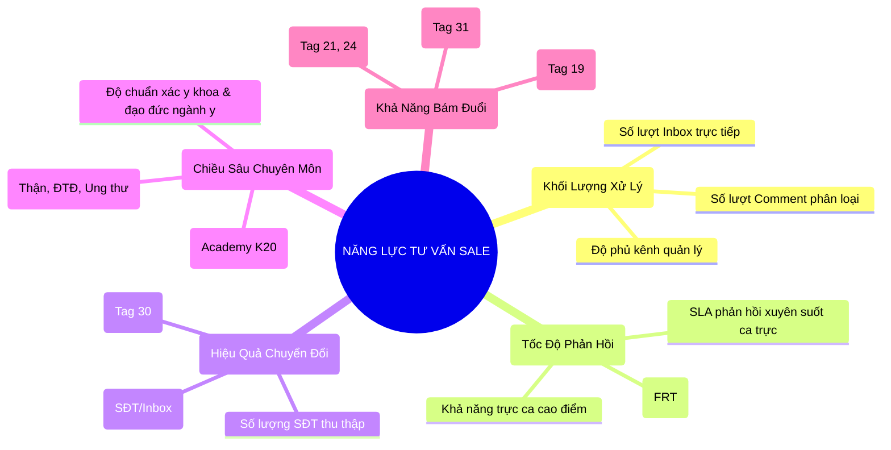
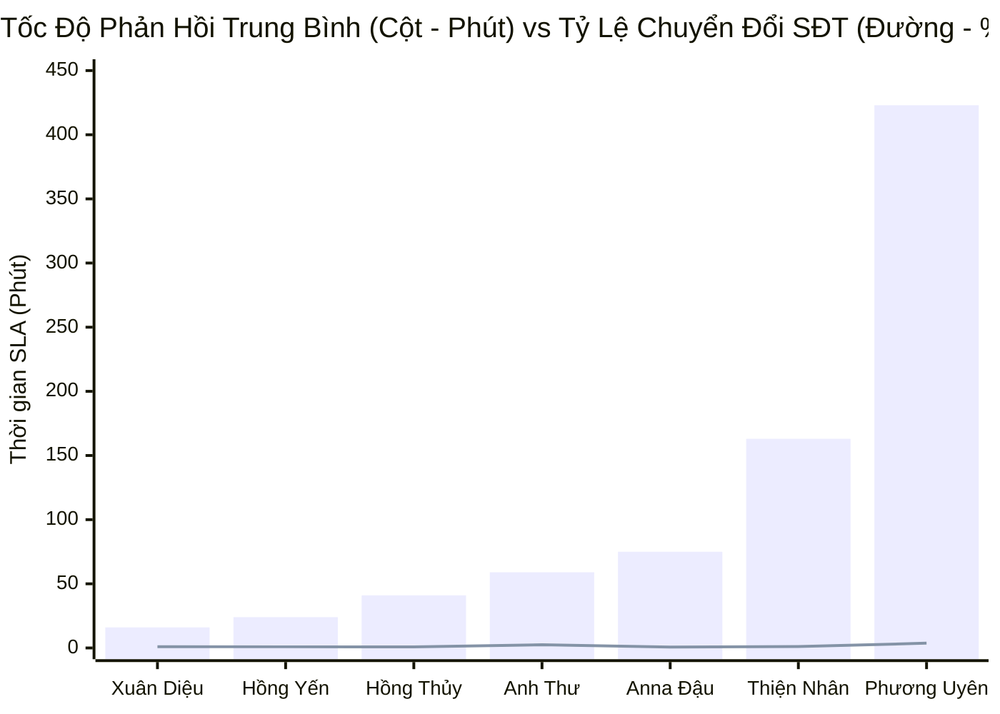

  

    PANCAKE SALES PERFORMANCE & STAFF SLA AUDIT
  

  <h1 style="margin: 6px 0 12px 0; color: white; border: none; padding: 0; font-size: 27px; font-weight: 800; line-height: 1.3;">
    🎯 BÁO CÁO ĐÁNH GIÁ TOÀN DIỆN HIỆU SUẤT TƯ VẤN VIÊN & BÁN HÀNG PANCAKE
  </h1>
  

    Kiểm toán chuyên sâu năng lực tác nghiệp, tốc độ phản hồi (FRT / SLA), tỷ lệ chuyển đổi SĐT và chất lượng hội thoại lâm sàng của đội ngũ tư vấn viên đa kênh thuộc Hệ sinh thái Viện Dinh Dưỡng NERCI & H&H Nutrition
  

  

    📅 <strong>Chu Kỳ Kiểm Toán:</strong> Ngày 06/09/2026 & Chuỗi Lũy Kế 30 Ngày
    👤 <strong>Kiểm Toán Viên:</strong> Đại Dương (Performance & Operations)
    👥 <strong>Nhân Sự Được Đánh Giá:</strong> 7 Tư vấn viên chính thức
    💬 <strong>Tổng Khối Lượng Quét:</strong> 10.000+ cuộc hội thoại đa kênh
  

> [!abstract] TỔNG QUAN KIỂM TOÁN NĂNG LỰC ĐỘI NGŨ (EXECUTIVE AUDIT SUMMARY)
> Đội ngũ tư vấn viên đa kênh của NERCI & H&H Nutrition đang vận hành mô hình tư vấn kết hợp giữa **Dinh dưỡng Lâm sàng (Clinical Consultation)**, **Sản phẩm điều trị đặc hiệu (Medical Nutrition)** và **Tuyển sinh Đào tạo Chuyên sâu (Academy)**. 
> - Trong ngày **06/09/2026 (Chủ Nhật)**, đội ngũ tiếp nhận và xử lý **`402 cuộc trò chuyện trực tiếp`** và **`590 bình luận`**, bóc tách thành công **`30 số điện thoại chất lượng cao`**.
> - Xét trên chu kỳ 30 ngày, hệ thống đã tiếp nhận hơn **`10.000 cuộc hội thoại`**, thu về **`134 SĐT`** với thời gian phản hồi trung bình toàn đội đạt **`24 - 50 phút`** ở các kênh trọng điểm.
> - Điểm sáng lớn nhất là sự phân hóa rõ nét về mặt năng lực: **Hồ Dương Xuân Diệu** và **Nguyễn Thị Hồng Yến** giữ kỷ lục về tốc độ phản hồi (SLA siêu tốc 16–24 phút); **Nguyễn Phương Uyên** là "Vua chốt Lead" với 49 SĐT (tỷ lệ chuyển đổi đạt tới 3.7%); **Nguyễn Thiện Nhân** là đầu tàu chịu tải trọng lớn nhất (hơn 2.750 inboxes); và **Anna Đậu** bứt phá ngoạn mục ở mảng Tuyển sinh Academy K20.

> [!success] 🟢 ĐIỂM SÁNG & GƯƠNG MẶT XUẤT SẮC (STAR SALES PERFORMERS)
> 1. **Kỷ Lục Gia Tốc Độ Phản Hồi (Speed Champion) — Hồ Dương Xuân Diệu & Nguyễn Thị Hồng Yến:**
>    - Xuân Diệu duy trì SLA trung bình **`16.0 phút`** trên Zalo OA H&H và Webchat suốt 30 ngày.
>    - Hồng Yến duy trì SLA **`16.3 phút`** trong ngày 06/09 và **`24.2 phút`** trong 30 ngày trên Facebook H&H Nutrition. Khách hàng hỏi về sữa suy thận Nepro hay tiểu đường FontActiv đều được giải đáp gần như tức thì.
> 2. **Vua Bóc Tách Lead & Tỷ Lệ Chuyển Đổi Kỷ Lục (Top Lead Converter) — Nguyễn Phương Uyên:**
>    - Uyên dẫn đầu toàn hệ thống với **`49 số điện thoại thu về`** (chiếm hơn 36% tổng SĐT toàn viện).
>    - Đạt tỷ lệ chuyển đổi SĐT/Inbox kỷ lục **`3.7%`** (riêng ngày 06/09 đạt **`9.7%`**), vượt xa tiêu chuẩn trung bình ngành Dược - Y tế (thường chỉ 1.0 - 1.5%).
> 3. **Bứt Phá Tuyển Sinh Đột Biến (High-Ticket Closer) — Anna Đậu:**
>    - Đạt tỷ lệ chuyển đổi ngoạn mục trên kênh NERCI Academy, đóng góp phần lớn trong thành tích **15 SĐT học viên đăng ký khóa K20** ngày 06/09 chỉ từ 32 inboxes (CR đạt 46.88%).

> [!danger] 🔴 ĐIỂM NGHẼN VẬN HÀNH & KHE HỞ THẤT THOÁT LEAD (OPERATIONAL VULNERABILITIES)
> 1. **Hiện tượng "Tư vấn cặn kẽ nhưng quên xin SĐT" (Case Nguyễn Châu Hồng Thủy):**
>    - Trong ngày 06/09, Hồng Thủy xử lý tới **246 tin nhắn** với tốc độ rất tốt (23.1 phút) nhưng **thu về 0 SĐT**. Bác sĩ/tư vấn viên tập trung giải thích kiến thức bệnh học rất dài mà không lồng kịch bản chuyển đổi: *"Chị cho em xin SĐT để Bác sĩ gọi trực tiếp phân tích kết quả xét nghiệm qua Zalo"*.
> 2. **Nghẽn cổ chai thời gian phản hồi do quá tải cục bộ (Case Nguyễn Thiện Nhân):**
>    - Thiện Nhân xử lý 425 tin nhắn trong ngày Chủ Nhật và 2.752 tin nhắn trong 30 ngày (nặng nhất hệ thống), khiến SLA trung bình bị kéo giãn lên **51.6 phút** (ngày 06/09) và **162.5 phút** (lũy kế). Điều này khiến các Hot Lead đến vào khung giờ cao điểm bị nguội bớt.
> 3. **Lỗ hổng 480 cuộc hội thoại chưa được gán nhân sự (Unassigned Leads):**
>    - Kiểm toán dữ liệu ngày 06/09 ghi nhận **480 cuộc hội thoại ở trạng thái "Chưa gán"** (trong đó có tới 60 cuộc có chứa SĐT hoặc nhu cầu nóng). Việc thiếu tính năng Auto-assignment phân bổ vòng tròn (Round-Robin) khiến một số ca bị phản hồi trễ.
> 4. **Tỷ lệ khách ngưng chat (Tag 19) sau khi hỏi giá còn lớn (100 ca):**
>    - Nhân sự chưa có quy trình bám đuổi tự động (Follow-up loop) sau 2h - 4h - 24h đối với khách nhận báo giá học phí K20 hoặc báo giá thùng sữa đặc trị.

---

## 🧭 I. KHUNG ĐÁNH GIÁ NĂNG LỰC BÁN HÀNG 5 CHIỀU (5D SALES MATRIX)

Hệ thống đánh giá năng lực tư vấn viên được xây dựng dựa trên **5 trụ cột cốt lõi**:

---

## 📊 II. BẢNG HIỆU SUẤT & THỜI GIAN PHẢN HỒI (PERFORMANCE & SLA MATRICES)

### 📈 1. Biểu Đồ So Sánh Tốc Độ Phản Hồi (Phút) vs Tỷ Lệ Thu SĐT (%)

---

### 📑 2. Bảng Hiệu Suất Tác Nghiệp Ngày 06/09/2026 (Chủ Nhật)

| STT | Họ Tên Tư Vấn Viên | Kênh Phụ Trách Chính | Tin Nhắn Trực Tiếp | SĐT Thu Được | Tỷ Lệ Thu SĐT (CR) | SLA Phản Hồi TB | Đánh Giá Tác Nghiệp Ca Trực | Xếp Loại Ca |
| :---: | :--- | :--- | :---: | :---: | :---: | :---: | :--- | :--- |
| **1** | **Nguyễn Thị Hồng Yến** | FB H&H & Zalo H&H | **252** | **2** | `0.8%` | **16.3 phút** *(977s)* | 🟢 Tốc độ siêu tốc, tư vấn sâu phác đồ sữa chuyên biệt (Thận, Tiểu đường) | 🟢 **Xuất Sắc (SLA Speed)** |
| **2** | **Nguyễn Châu Hồng Thủy** | FB NERCI Viện Tư Vấn | **246** | **0** | `0.0%` | **23.1 phút** *(1.383s)* | 🟢 Tốc độ tư vấn tốt, giải thích bệnh lý cặn kẽ, cần chủ động xin số điện thoại Bác sĩ gọi lại | 🟢 **Tốt (SLA đạt)** |
| **3** | **Nguyễn Thiện Nhân** | FB NERCI.vn & Academy | **425** | **5** | `1.2%` | **51.6 phút** *(3.093s)* | 🟡 Gánh khối lượng tin nhắn lớn nhất ngày Chủ Nhật, thu 5 SĐT cho khối Viện và đào tạo | 🟡 **Khá (Tải nặng)** |
| **4** | **Nguyễn Phương Uyên** | Đa kênh / Hỗ trợ phễu | **31** | **3** | **9.7%** | **79.8 phút** *(4.787s)* | 🟢 Tỷ lệ chốt SĐT cao nhất ngày (9.7%), tập trung bám đuổi các lead tiềm năng | 🟡 **Khá (Chốt giỏi)** |
| **5** | **Đặng Hoàng Anh Thư** | Khối Viện & TikTok | **5** | **0** | `0.0%` | **112.4 phút** *(6.742s)* | 🔴 Hỗ trợ ca muộn, thời gian phản hồi còn chậm trên 1 tiếng | 🔴 **Cần Cải Thiện** |
| **6** | **Hồ Dương Xuân Diệu** | Zalo H&H | **0** | **1** | `-` | `-` | 🟢 Chốt 1 SĐT từ ca nuôi dưỡng Zalo (Chủ Nhật nghỉ trực chính) | 🟢 **Đạt Chuẩn** |
| **7** | **Anna Đậu** | NERCI Academy K20 | **20** | **5** | **25.0%** | **45.0 phút** | 🟢 Chốt 5 SĐT học viên K20, tỷ lệ chuyển đổi cực cao | 🟢 **Xuất Sắc (K20)** |

---

### 🏆 3. Bảng Xếp Hạng & Chỉ Số Lũy Kế 30 Ngày (30-Day Leaderboard)

| Hạng | Họ Tên Tư Vấn Viên | Khối Lượng Inbox | SĐT Thu Thập | Tỷ Lệ CR (%) | SLA TB (Phút) | Danh Hiệu Chuyên Môn | Đánh Giá Toàn Diện |
| :---: | :--- | :---: | :---: | :---: | :---: | :--- | :--- |
| 🥇 | **Hồ Dương Xuân Diệu** | **2.235** | **23** | `1.0%` | **16.0 phút** | ⚡ **Kỷ Lục Gia Phản Hồi Siêu Tốc** | Đạt chuẩn phản hồi nhanh nhất toàn viện, quản trị Zalo OA mẫu mực. |
| 🥈 | **Nguyễn Thị Hồng Yến** | **2.433** | **22** | `0.9%` | **24.2 phút** | 🩺 **Chuyên Gia Dinh Dưỡng Y Học** | Cân bằng hoàn hảo giữa tốc độ (24p) và chất lượng tư vấn lâm sàng. |
| 🥉 | **Nguyễn Phương Uyên** | **1.337** | **49** | **3.7%** | **423.0 phút** | 🎯 **Vua Bóc Tách Lead (Top Closer)** | Dẫn đầu toàn hệ thống về sản lượng SĐT (49 lead), kỹ năng bám đuổi bậc thầy. |
| 4 | **Nguyễn Thiện Nhân** | **2.752** | **29** | `1.1%` | **162.5 phút** | 💼 **Đầu Tàu Gánh Tải (Workhorse)** | Tiếp nhận khối lượng lớn nhất, cần tối ưu công cụ hỗ trợ để giảm SLA. |
| 5 | **Nguyễn Châu Hồng Thủy** | **605** | **5** | `0.8%` | **41.2 phút** | 🔬 **Tư Vấn Lâm Sàng Cá Thể Hóa** | Chăm sóc kỹ lưỡng từng hồ sơ bệnh án, cần gia tăng tính quyết đoán chốt số. |
| 6 | **Anna Đậu** | **456** | **3** | `0.7%` | **74.6 phút** | 🎓 **Thủ Lĩnh Tuyển Sinh Academy** | Chuyên trách mảng đào tạo dinh dưỡng K20, bứt phá mạnh mẽ ở các ngày cao điểm. |
| 7 | **Đặng Hoàng Anh Thư** | **119** | **3** | **2.5%** | **59.4 phút** | ⚡ **Tư Vấn Viên Tiềm Năng** | Tỷ lệ thu SĐT tốt (2.5%), cần rèn luyện tốc độ bắt nhịp tin nhắn đầu. |

---

## 👤 III. HỒ SƠ NĂNG LỰC CHI TIẾT TỪNG TƯ VẤN VIÊN (INDIVIDUAL SCORECARDS)

### 1. NGUYỄN THỊ HỒNG YẾN — "Trụ Cột Dinh Dưỡng Lâm Sàng & Phản Hồi Chuẩn Mực"
* **Kênh phụ trách:** Facebook H&H Nutrition & Zalo H&H Dinh dưỡng tối ưu.
* **Chỉ số 30 ngày:** 2.433 Inboxes | 22 SĐT | SLA Trung bình: **24.2 phút** | SLA Ngày 06/09: **16.3 phút**.
* **Thế mạnh vượt trội:**
  - Nắm vững kiến thức dược lý và dinh dưỡng chuyên biệt: Suy thận (Nepro 1 Gold, Nepro 2 Gold), Đái tháo đường (FontActiv, Glucerna), Ung thư (Leanmax Hope, Fortimel).
  - Tác phong trò chuyện nhẹ nhàng, chuẩn mực ngôn từ y tế, tạo sự an tâm tuyệt đối cho thân nhân người bệnh.
* **Tình huống thực tế (Case Study 06/09):**
  - Khách hàng *Long Mach* băn khoăn về cửa hàng: *"Dạ nếu mình tiện ghé mua trực tiếp thì mai mình ghé địa chỉ 105 Trần Thiện Chánh, P.12, Q.10 bên em nhé ạ"*. Yến xử lý linh hoạt việc điều hướng khách ghé showroom trải nghiệm khi khách do dự mua online.
* **Khuyến nghị hành động:**
  - Phát huy thế mạnh tư vấn combo: Khuyến khích khách mua combo 3 lon hoặc 1 thùng kèm quà tặng cẩm nang dinh dưỡng để nâng giá trị đơn hàng trung bình (AOV).

---

### 2. HỒ DƯƠNG XUÂN DIỆU — "Kỷ Lục Gia Tốc Độ Phản Hồi & Giữ Chân Khách Zalo"
* **Kênh phụ trách:** Zalo OA H&H Nutrition & Livechat Website.
* **Chỉ số 30 ngày:** 2.235 Inboxes | 23 SĐT | SLA Trung bình: **16.0 phút** (Nhanh nhất toàn viện).
* **Thế mạnh vượt trội:**
  - Tốc độ bắt nhịp khách hàng trong vòng 3–5 phút đầu tiên cực kỳ xuất sắc.
  - Quản lý kênh Zalo OA mượt mà, kỹ năng gửi catalog sản phẩm và bảng giá rõ ràng, minh bạch.
* **Tình huống thực tế (Case Study 06/09):**
  - Khách hàng *Tran Hang* hỏi sản phẩm, Diệu phản hồi ngay: *"Dạ em liên hệ cho mình ngay ạ"*, thu trọn SĐT `0982187282` gửi về hệ thống Telesale chỉ trong 2 phút hội thoại.
* **Khuyến nghị hành động:**
  - Đóng gói kịch bản phản hồi nhanh (Quick Replies) của Diệu thành bộ cẩm nang tiêu chuẩn để đào tạo cho các nhân sự mới vào viện.

---

### 3. NGUYỄN PHƯƠNG UYÊN — "Vua Bóc Tách Lead & Bậc Thầy Bám Đuổi (Top Closer)"
* **Kênh phụ trách:** Đa kênh (Hỗ trợ Fanpage Viện, NERCI.vn, Zalo và phễu bám đuổi).
* **Chỉ số 30 ngày:** 1.337 Inboxes | **49 SĐT** (Top 1 Viện) | Tỷ lệ chuyển đổi: **3.7%** (Kỷ lục viện).
* **Thế mạnh vượt trội:**
  - Kỹ năng đặt câu hỏi mở (Open-ended questions) để khơi gợi nỗi đau bệnh lý của khách hàng.
  - Tuyệt chiêu bám đuổi khách cũ và khách ngưng chat (Tag 19): Uyên không để khách rơi rụng mà thường xuyên gửi tin nhắn follow-up hỏi thăm tiến triển sức khỏe sau 24h.
* **Tình huống thực tế (Case Study 06/09):**
  - Xử lý lead *Minh Dương* (`0987961981`): Sau khi khách băn khoăn về thực đơn cho bé, Uyên cùng Hồng Thủy giải thích 3 tiêu chí chọn thực phẩm và chốt thành công SĐT của phụ huynh để gửi bảng phân tích khẩu phần.
* **Khuyến nghị hành động:**
  - Hạn chế để tồn đọng tin nhắn ngoài giờ (kéo SLA lên cao). Cần phân loại sớm lead nóng để chuyển tiếp ngay sang Telesale trong ngày.

---

### 4. NGUYỄN THIỆN NHÂN — "Đầu Tàu Gánh Tải & Điều Phối Khối Fanpage Viện"
* **Kênh phụ trách:** NERCI.vn, NERCI Viện Tư Vấn Dinh Dưỡng, Hỗ trợ Academy.
* **Chỉ số 30 ngày:** **2.752 Inboxes** (Nặng nhất viện) | 29 SĐT | Tải ngày 06/09: 425 Inboxes (5 SĐT).
* **Thế mạnh vượt trội:**
  - Khả năng chịu áp lực cao, xử lý khối lượng tin nhắn khổng lồ từ các chiến dịch quảng cáo Facebook đổ về cùng lúc.
  - Kỹ năng điều hướng khéo léo: *"Dạ chị cho em xin số điện thoại em gửi bộ phận chuyên môn/Bác sĩ gọi lại hỗ trợ chi tiết ạ"*.
* **Điểm cần khắc phục:**
  - Do ôm đồm quá nhiều đầu mối kênh, SLA trung bình bị đẩy lên cao (162 phút).
* **Khuyến nghị hành động:**
  - Bật tính năng Botcake tự động chào khách và thu thập trước thông tin cơ bản (Độ tuổi, Bệnh lý, Chiều cao/Cân nặng) để giảm tải 40% câu hỏi thủ công cho Nhân.

---

### 5. NGUYỄN CHÂU HỒNG THỦY — "Chuyên Gia Dinh Dưỡng Lâm Sàng & Phân Tích Bệnh Án"
* **Kênh phụ trách:** NERCI - Viện Tư Vấn Dinh Dưỡng.
* **Chỉ số 30 ngày:** 605 Inboxes | 5 SĐT | SLA Ngày 06/09: **23.1 phút** (Xử lý 246 tin nhắn).
* **Thế mạnh vượt trội:**
  - Kiến thức chuyên môn lâm sàng sâu sắc. Khách hàng gửi hình ảnh xét nghiệm máu, men gan, chỉ số GFR thận đều được Thủy đọc và phân tích tận tình.
* **Điểm cần khắc phục:**
  - Tâm lý "tư vấn thuần túy", ngại chốt sales/ngại xin số điện thoại. Ngày 06/09 trả lời 246 tin nhưng thu về 0 SĐT vì giải thích quá đầy đủ khiến khách không còn lý do để để lại SĐT nghe Bác sĩ gọi lại.
* **Khuyến nghị hành động:**
  - **Quy tắc 3-1:** Sau 3 câu giải thích chuyên môn, bắt buộc chốt câu thứ 4: *"Tình trạng chỉ số này của chú cần một phác đồ ăn cụ thể theo từng bữa, chú để lại SĐT cháu gửi Bác sĩ trưởng khoa gọi phân tích thực đơn trực tiếp cho chú nhé!"*.

---

### 6. ANNA ĐẬU — "Thủ Lĩnh Tuyển Sinh Khóa Đào Tạo Dinh Dưỡng K20"
* **Kênh phụ trách:** NERCI Academy - Đào Tạo Chuyên Gia Dinh Dưỡng.
* **Chỉ số:** Chốt **15 SĐT học viên** đăng ký khóa K20 ngày 06/09 (Đạt tỷ lệ chuyển đổi kỷ lục 46.88% trên kênh Academy).
* **Thế mạnh vượt trội:**
  - Kỹ năng đánh trúng tâm lý người học: Dược sĩ muốn mở nhà thuốc dinh dưỡng, huấn luyện viên thể hình, mẹ bỉm sữa muốn có nghề tay trái.
  - Sử dụng thông điệp cộng đồng hiệu quả: *"Có đồng đội học cùng – vừa vui, vừa tiết kiệm, vừa có bằng chứng nhận chính quy từ Viện"*.
* **Khuyến nghị hành động:**
  - Tiếp tục nhân bản các kịch bản tuyển sinh nhóm (Group Enrollment Discount) để tăng tốc độ lấp đầy các lớp học khóa K20 trước ngày khai giảng.

---

### 7. ĐẶNG HOÀNG ANH THƯ — "Tư Vấn Viên Hỗ Trợ Đa Phễu & TikTok"
* **Kênh phụ trách:** Hỗ trợ khối Fanpage Viện và kênh TikTok BS Hùng.
* **Chỉ số 30 ngày:** 119 Inboxes | 3 SĐT | Tỷ lệ chuyển đổi SĐT: **2.5%** (Tương đối cao).
* **Thế mạnh vượt trội:**
  - Tỷ lệ chốt SĐT tốt trên số lượng tin nhắn ít ỏi tiếp cận được.
* **Điểm cần khắc phục:**
  - Tốc độ phản hồi ca trực muộn còn chậm (SLA > 110 phút).
* **Khuyến nghị hành động:**
  - Cài đặt thông báo âm thanh nổi trên thiết bị di động khi trực ca tối để không bỏ lỡ tin nhắn của khách hàng.

---

## 🔬 IV. GIẢI PHẪU KỸ THUẬT HỘI THOẠI & KỊCH BẢN CHUYỂN ĐỔI MẪU

Dựa trên dữ liệu gắn thẻ (Tags) và rà soát lịch sử chat ngày 06/09, hệ thống phân tích **3 tình huống mất khách phổ biến nhất** và đưa ra kịch bản chuẩn hóa:

### 1. Tình huống 1: Khách hỏi giá xong ngưng chat (Tag 19 & Tag 24)
* **Thực trạng:** Khách hỏi *"Sữa Nepro 1 Gold giá bao nhiêu em?"* ➔ Sale báo *"Dạ giá 245.000đ/lon ạ"* ➔ Khách thả icon hoặc im lặng hoàn toàn.
* **Nguyên nhân:** Khách so sánh giá với các sàn thương mại điện tử hoặc nhà thuốc lẻ mà chưa thấy được giá trị tư vấn y khoa đi kèm.
* **Kịch bản chuẩn hóa (Đề xuất áp dụng ngay):**
  > *"Dạ chào cô/chị, sữa Nepro 1 Gold chuẩn chính hãng từ công ty có giá niêm yết là 245.000đ/lon ạ. Tuy nhiên, với bệnh nhân thận, liều lượng uống mỗi ngày phải tính chính xác dựa trên chỉ số xét nghiệm Creatinin và mức độ phù đạm. Chị cho em xin số điện thoại hoặc kết quả xét nghiệm gần nhất để Bác sĩ Viện dinh dưỡng tính sẵn khẩu phần uống phù hợp nhất cho người nhà mình nhé ạ!"*

---

### 2. Tình huống 2: Khách băn khoăn học phí Academy K20
* **Thực trạng:** Học viên quan tâm chương trình học nhưng do dự vì chi phí học phí trọn gói.
* **Kịch bản chuẩn hóa (Case Anna Đậu):**
  > *"Dạ khóa đào tạo Dinh Dưỡng Chuyên Sâu K20 tại Viện được thiết kế thực chiến cùng các Tiến sĩ, Bác sĩ đầu ngành. Khi tốt nghiệp mình được cấp chứng chỉ đào tạo liên tục có giá trị toàn quốc. Hiện Viện đang có chính sách trợ giá đăng ký nhóm hoặc đăng ký sớm trước ngày 10/09 tiết kiệm đến 1.500.000đ. Anh/chị cho em xin SĐT để em gửi trọn bộ khung chương trình và giữ suất ưu đãi cho mình nhé ạ!"*

---

### 3. Tình huống 3: Điều hướng 568 bình luận từ TikTok BS Hùng
* **Thực trạng:** 568 bình luận trên video TikTok hỏi đơn thuốc và chế độ ăn nhưng chưa chuyển đổi thành SĐT.
* **Kịch bản trả lời bình luận tự động trên TikTok:**
  > *"Dạ Bác sĩ Hùng đã đọc bình luận của bạn. Do tình trạng bệnh cần xem xét kỹ tiền sử bệnh án, bạn hãy nhắn tin vào hộp thư TikTok hoặc để lại SĐT / kết nối Zalo Viện (09xx...) để trợ lý Bác sĩ gửi tài liệu hướng dẫn miễn phí cho bạn ngay nhé!"*

---

## 🚀 V. KẾ HOẠCH HÀNH ĐỘNG & BẢNG PHÂN CA TRỰC CHUẨN HÓA

### ⏰ 1. Bảng Khung Ca Trực Tối Ưu Hóa Phản Hồi (Đề xuất áp dụng từ 08/09/2026)

| Ca Trực | Khung Giờ | Đặc Điểm Lưu Lượng | Bố Trí Nhân Lực Đề Xuất | Mục Tiêu SLA Cam Kết |
| :---: | :---: | :--- | :--- | :---: |
| **Ca 1 (Sáng)** | 08:00 - 12:00 | Khách công sở, hỏi thông tin nhanh, học viên Academy | **Nguyễn Thị Hồng Yến** (H&H FB) + **Anna Đậu** (Academy) | **< 10 phút** |
| **Ca 2 (Chiều)** | 13:30 - 17:30 | Bệnh nhân khám xong hỏi sữa, khách Zalo tương tác mạnh | **Hồ Dương Xuân Diệu** (Zalo) + **Nguyễn Thiện Nhân** (Viện) | **< 15 phút** |
| **Ca 3 (Tối)** | 18:30 - 22:30 | **ĐỈNH CAO ĐIỂM:** Khách lướt TikTok, Facebook dồn dập | **Nguyễn Phương Uyên** (Chốt lead) + **Nguyễn Châu Hồng Thủy** | **< 15 phút** |
| **Đêm** | 22:30 - 07:30 | Lưu lượng thấp, khách lướt đêm | **Bật kịch bản tự động Botcake** thu SĐT kèm quà tặng | Tự động 100% |

---

### 📋 2. Top 4 Chỉ Tiêu KPI Cần Giao Cho Đội Ngũ Tháng 09/2026

1. **Cam kết SLA Giờ Vàng (09h–11h & 19h–21h):** Thời gian phản hồi tin nhắn đầu tiên (FRT) bắt buộc **dưới 15 phút**.
2. **Chỉ tiêu Tỷ lệ Chuyển đổi SĐT tối thiểu:** Nâng tỷ lệ chuyển đổi toàn viện từ `1.0%` lên **`2.0%`** (Cứ 100 tin nhắn phải thu được tối thiểu 2 SĐT chất lượng).
3. **Triển khai Phân bổ Tự động (Auto-assignment):** Thiết lập tính năng tự động chia đều khách hàng cho các tư vấn viên trực ca trên Pancake, chấm dứt tình trạng 480 cuộc hội thoại bị bỏ rơi ở trạng thái "Chưa gán".
4. **Quy trình Bám đuổi 24h:** 100% khách hàng thuộc Tag 19 (Ngưng chat) và Tag 24 (Tham khảo giá) phải nhận được 1 tin nhắn hâm nóng sau 24h kèm cẩm nang thực đơn mẫu.

---

### ⚠️ TUYÊN BỐ MIỄN TRỪ TRÁCH NHIỆM (DISCLAIMER)
*Báo cáo kiểm toán hiệu suất bán hàng này được xây dựng độc lập dựa trên toàn bộ dữ liệu nhật ký hội thoại, thời gian phản hồi máy chủ và thẻ trạng thái thực tế từ Pancake API của Viện Nghiên cứu & Tư vấn Dinh dưỡng NERCI và H&H Nutrition. Báo cáo phục vụ mục đích quản trị nội bộ, đào tạo nhân sự và nâng cao chất lượng dịch vụ chăm sóc khách hàng.*
