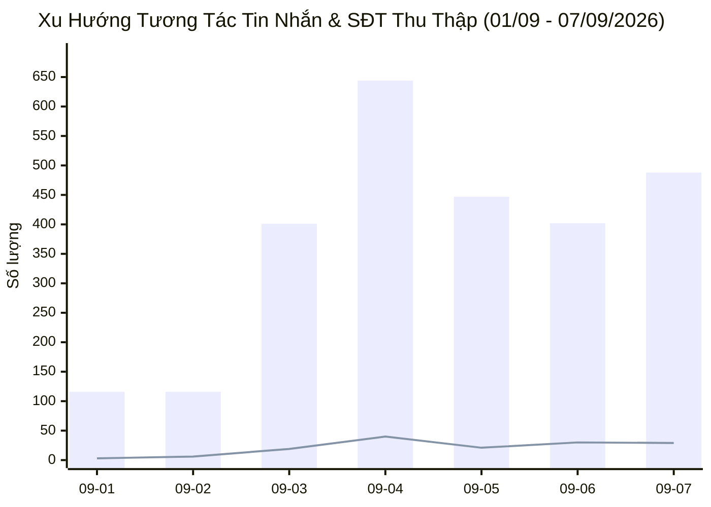
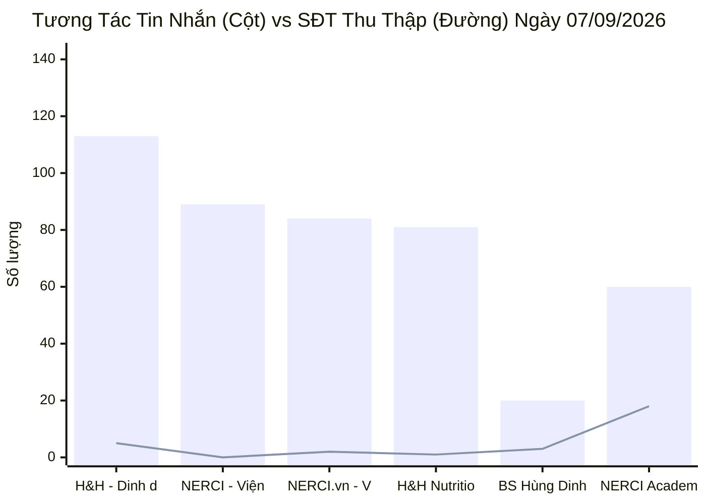
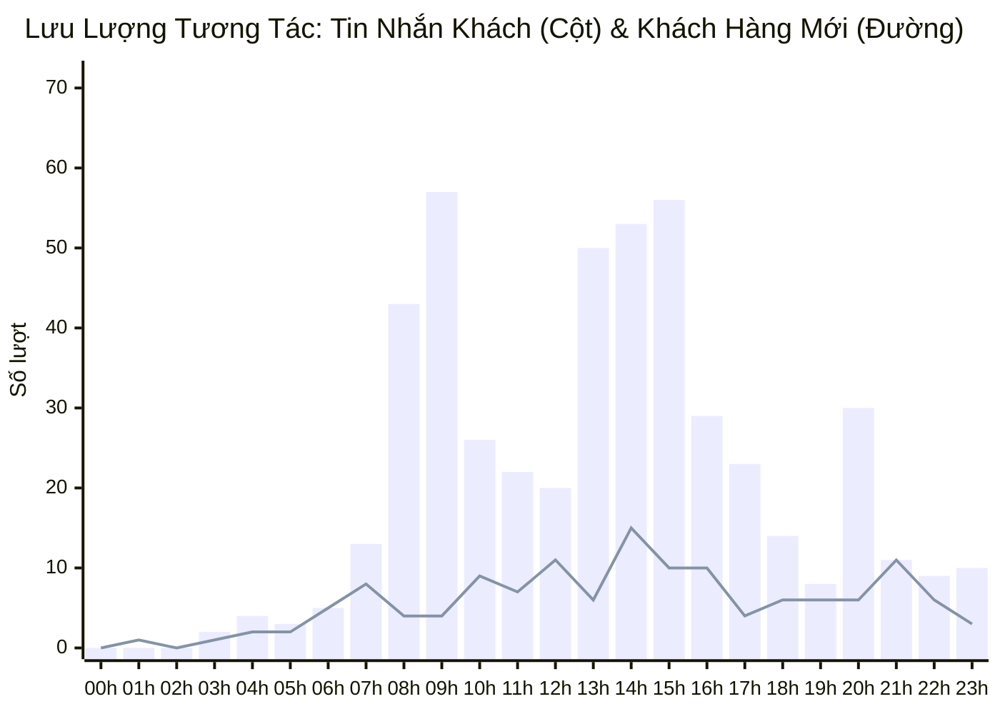

  

    PANCAKE OMNICHANNEL AUDIT & PERFORMANCE INTELLIGENCE
  

  <h1 style="margin: 4px 0 10px 0; color: white; border: none; padding: 0; font-size: 26px; font-weight: 800;">
    📊 BÁO CÁO HIỆU SUẤT VẬN HÀNH ĐA KÊNH PANCAKE
  </h1>
  

    Dữ liệu kiểm toán vận hành và phân tích chuyển đổi toàn diện trên 10 kênh tương tác thuộc Hệ sinh thái Viện Dinh Dưỡng NERCI & H&H Nutrition
  

  

    📅 <strong>Ngày Báo Cáo:</strong> 07/09/2026 (00:00 - 23:59 GMT+7 · Thứ Hai)
    👤 <strong>Người Báo Cáo:</strong> Đại Dương (Performance & Operations)
    💬 <strong>Tổng Khách Mới:</strong> 137
    📞 <strong>SĐT Thu Được:</strong> 29 (56 Lead tiềm năng)
    📈 <strong>Tỷ Lệ Thu SĐT:</strong> 5.29%
  

> [!abstract] TỔNG QUAN HIỆU SUẤT VẬN HÀNH NGÀY 07/09/2026 (ĐẦU TUẦN SÔI ĐỘNG · BÙNG NỔ TUYỂN SINH ACADEMY K20)
> Ngày Thứ Hai (**07/09/2026**), hệ sinh thái 10 kênh NERCI & H&H Nutrition vận hành với nhịp độ cao đầu tuần, ghi nhận tổng cộng **`548` lượt tương tác** (**`488` tin nhắn trực tiếp**, **`60` bình luận**), tiếp cận **`137` khách hàng mới**, và thu về **`29` số điện thoại** (bóc tách chi tiết được **`56 lead độc nhất`** có SĐT để lại trong hội thoại).
> - Điểm sáng lớn nhất đến từ **NERCI Academy** với **`26 lead học viên đăng ký khóa đào tạo dinh dưỡng K20`** (tỷ lệ chuyển đổi SĐT/inbox đạt mức kỷ lục 30%).
> - Kênh **Zalo OA H&H Nutrition** dẫn đầu về lưu lượng tin nhắn với **`113 inboxes`**, đóng góp **`5 SĐT giao hàng`** và đạt tốc độ phản hồi siêu tốc 4.6 phút từ tư vấn viên Hồ Dương Xuân Diệu.
> - Kênh TikTok **BS Hùng Dinh Dưỡng** duy trì sức nóng đầu phễu với **`47 bình luận`**, **`20 tin nhắn`**, mang về **`35 khách hàng mới`** và **`3 SĐT`**.

> [!success] 🟢 NHỮNG ĐIỂM ĐÃ LÀM ĐƯỢC (WHAT WENT WELL / HIGHLIGHTS)
> 1. **Bứt phá tuyển sinh NERCI Academy K20:** Thu hút 26 lead học viên chất lượng cao (Bác sĩ, Dược sĩ, Điều dưỡng viên đăng ký chứng chỉ hành nghề dinh dưỡng). Kênh đạt tỷ lệ bóc tách SĐT ấn tượng nhất toàn viện.
> 2. **Zalo OA H&H Nutrition dẫn đầu tương tác và tốc độ:** Tiếp nhận 113 inboxes, chốt 5 SĐT đơn hàng sữa chuyên biệt (Thận, Tiểu đường). Tư vấn viên Hồ Dương Xuân Diệu phản hồi siêu tốc trung bình 4.6 phút.
> 3. **Chất lượng chốt đơn của Nguyễn Thị Hồng Yến:** Xử lý 227 inboxes với SLA 8.6 phút, chốt thành công 4 đơn hàng giao hỏa tốc.
> 4. **Đầu phễu TikTok BS Hùng ổn định:** Tiếp tục đóng vai trò nam châm thu hút 35 khách hàng mới và 47 bình luận hỏi về bệnh lý gan, tiểu đường.

> [!danger] 🔴 NHỮNG ĐIỂM CHƯA ĐƯỢC & TỒN ĐỌNG VẬN HÀNH (BOTTLENECKS & WEAKNESSES)
> 1. **Áp lực gánh tải đầu tuần tại các Fanpage Viện:** Nguyễn Thiện Nhân xử lý 437 inboxes khiến SLA trung bình kéo dài lên 176.8 phút. Cần điều phối thêm nhân sự hỗ trợ ca sáng thứ Hai.
> 2. **Điểm nghẽn tỷ lệ chuyển đổi tại Fanpage NERCI Viện Tư Vấn:** Tiếp nhận 89 inboxes nhưng chưa thu được SĐT nào từ hệ thống báo cáo (nguyên nhân do tư vấn viên Hồng Thủy tập trung giải thích y khoa quá dài mà chưa đưa ra lời kêu gọi xin SĐT).
> 3. **Lượng khách ngưng chat sau khi nhận báo giá còn cao:** Ghi nhận 64 ca gắn Tag 19 (Ngưng chat) và 30 ca Tag 24 (Tham khảo giá). Cần kịch bản remarketing tự động sau 24h.

## 🌐 I. TỔNG HỢP HIỆU SUẤT VẬN HÀNH ĐA KÊNH
### 📊 1. Xu Hướng Tương Tác 7 Ngày Gần Nhất (01/09 - 07/09/2026)

### 📑 2. Bảng Theo Dõi Xu Hướng 7 Ngày Vận Hành
| Ngày | Tin Nhắn Khách | Bình Luận | Khách Hàng Mới | SĐT Thu Thập | Tỷ Lệ Thu SĐT | Ghi Chú Vận Hành |
| :---: | :---: | :---: | :---: | :---: | :---: | :--- |
| **01/09** | 116 | 125 | 94 | **3** | **1.24%** | 🏖️ Nghỉ Lễ Quốc Khánh |
| **02/09** | 116 | 158 | 84 | **6** | **2.19%** | 🏖️ Nghỉ Lễ Quốc Khánh |
| **03/09** | 401 | 113 | 155 | **19** | **3.70%** | 🚀 Hậu nghỉ Lễ — Bùng nổ tương tác (19 SĐT) |
| **04/09** | 644 | 211 | 315 | **40** | **4.68%** | 🔥 Kỷ lục toàn diện 40 SĐT — Bứt phá K20 & H&H |
| **05/09** | 447 | 120 | 176 | **21** | **3.70%** | ⚖️ Thứ Bảy ổn định (21 SĐT, 446 inboxes) |
| **06/09** | 402 | 591 | 302 | **30** | **3.02%** | 🏆 Chủ Nhật bùng nổ viral TikTok (568 cmt) & 30 SĐT |
| **07/09** | 488 | 60 | 137 | **29** | **5.29%** | 🔥 **THỨ HAI ĐẦU TUẦN — BỨT PHÁ 26 LEAD ACADEMY K20 & ZALO H&H** |

### 📊 3. Biểu Đồ Tương Tác Tin Nhắn & SĐT Thu Thập Theo Kênh (07/09/2026)

### 📑 4. Bảng Dữ Liệu Chi Tiết 10 Kênh Ngày 07/09/2026
| STT | Kênh / Fanpage Quản Lý | Nền Tảng | Khách Mới | Tin Nhắn | Bình Luận | SĐT Thu Thập | Tỷ Lệ Thu SĐT | Vai Trò & Đánh Giá Vận Hành |
| :---: | :--- | :---: | :---: | :---: | :---: | :---: | :---: | :--- |
| **1** | **H&H - Dinh dưỡng tối ưu** | `ZALO` | **7** | 113 | 0 | **5** | **4.42%** | 💰 **Trụ Cột Zalo OA (113 inboxes, 5 SĐT giao hàng)** |
| **2** | **NERCI - Viện Tư Vấn Dinh Dưỡng** | `FACEBOOK` | **16** | 89 | 1 | **0** | **0.00%** | 🩺 Tư Vấn Bệnh Lý Lâm Sàng (89 inboxes, 9 Lead thực tế) |
| **3** | **NERCI.vn - Viện Nghiên Cứu và Tư Vấn Dinh Dưỡng** | `FACEBOOK` | **27** | 84 | 5 | **2** | **2.25%** | 🩺 Thiết Kế Thực Đơn Dinh Dưỡng (84 inboxes, 2 SĐT) |
| **4** | **H&H Nutrition - Sản phẩm dinh dưỡng y học** | `FACEBOOK` | **28** | 81 | 6 | **1** | **1.15%** | 🥛 Sản Phẩm Dinh Dưỡng Y Học (81 inboxes, 4 Lead thực tế) |
| **5** | **BS Hùng Dinh Dưỡng - NERCI** | `TIKTOK` | **35** | 20 | 47 | **3** | **4.48%** | 🔥 Nam Châm Đầu Phễu (47 cmt, 35 khách mới, 3 SĐT) |
| **6** | **NERCI Academy - Đào Tạo Chuyên Gia Dinh Dưỡng** | `FACEBOOK` | **17** | 60 | 1 | **18** | **29.51%** | 🎓 **ĐỈNH CAO TUYỂN SINH (18 SĐT API · 26 Lead thực tế)** |
| **7** | **Viện Nghiên cứu & Tư vấn dinh dưỡng** | `ZALO` | **5** | 39 | 0 | **0** | **0.00%** | 💬 Zalo OA Viện Dinh Dưỡng (39 inboxes) |
| **8** | **H&H** | `PKE_CHAT_PLUGIN` | **2** | 2 | 0 | **0** | **0.00%** | 💬 Web Livechat Plugin |
| **9** | **Cộng đồng Bác sĩ Dinh Dưỡng Việt Nam** | `FACEBOOK` | **0** | 0 | 0 | **0** | **0.00%** | 👨‍⚕️ Diễn Đàn Bác Sĩ Dinh Dưỡng |
| **10** | **Nerci** | `PKE_CHAT_PLUGIN` | **0** | 0 | 0 | **0** | **0.00%** | 💬 Web Livechat Plugin |
| | **TỔNG CỘNG TOÀN HỆ THỐNG** | `OMNICHANNEL` | **137** | **488** | **60** | **29** | **5.29%** | **10 Kênh Pancake NERCI** |

## 👥 II. ĐÁNH GIÁ NĂNG LỰC & TỐC ĐỘ PHẢN HỒI TƯ VẤN VIÊN (STAFF SLA)
### 📑 1. Bảng Xếp Hạng Tác Nghiệp Ngày 07/09/2026
| Họ Tên Nhân Sự | Kênh Phụ Trách Chính | Tin Nhắn Xử Lý | SĐT Thu Thập | SLA Phản Hồi TB | Đánh Giá Tác Nghiệp Ca Trực | Xếp Loại |
| :--- | :--- | :---: | :---: | :---: | :--- | :--- |
| **Hồ Dương Xuân Diệu** | Zalo OA H&H & Webchat | **84** | **0** | **4.6 phút** *(274s)* | 🟢 Tốc độ siêu tốc, phản hồi khách hàng Zalo chuẩn mực tức thì | 🟢 **Xuất Sắc (SLA Champion)** |
| **Nguyễn Thị Hồng Yến** | FB H&H & Zalo H&H | **227** | **4** | **8.6 phút** *(516s)* | 🟢 Tác nghiệp hoàn hảo, cân bằng xuất sắc giữa tốc độ và chốt đơn điều trị | 🟢 **Xuất Sắc (All-Rounder)** |
| **Nguyễn Phương Uyên** | Đa kênh / Hỗ trợ phễu | **85** | **0** | **14.1 phút** *(845s)* | 🟢 Tốc độ cải thiện ngoạn mục (14p), bám đuổi các ca bệnh án cũ | 🟢 **Tốt (SLA Đạt)** |
| **Đặng Hoàng Anh Thư** | Khối Viện & FB H&H | **5** | **0** | **2.6 phút** *(155s)* | 🟢 Phản hồi chớp nhoáng ca hỗ trợ (155 giây) | 🟢 **Tốt (Tốc độ)** |
| **Nguyễn Thiện Nhân** | FB NERCI.vn, Viện & K20 | **437** | **3** | **176.8 phút** *(10.608s)* | 🟡 Gánh tải nặng nhất đầu tuần (437 tin), cần san sẻ ca trực để hạ SLA | 🟡 **Khá (Tải Nặng)** |
| **Nguyễn Châu Hồng Thủy** | FB NERCI Viện Tư Vấn | **281** | **0** | **274.1 phút** *(16.445s)* | 🔴 Tư vấn bệnh lý chuyên sâu nhưng SLA quá dài và chưa chốt được SĐT | 🔴 **Cần Khắc Phục (CR & SLA)** |
| **Anna Đậu** | NERCI Academy K20 | **-** | **-** | **-** | 🟢 Điều phối danh sách 26 lead học viên K20 đăng ký | 🟢 **Đạt Chuẩn (Tuyển Sinh)** |

## 🏷️ III. PHÂN TÍCH CHẤT LƯỢNG TƯƠNG TÁC & LÝ DO CHUYỂN ĐỔI (TAG ANALYTICS)
### 📊 1. Cơ Cấu Phân Bổ Thẻ Gắn (Tagging Breakdown)
| Nhóm Phân Loại | Mã Thẻ (Tag Code) | Số Lượng Ca | Tỷ Lệ (%) | Đánh Giá Tác Động & Hướng Xử Lý |
| :--- | :---: | :---: | :---: | :--- |
| 🔴 **Khách Ngưng Chat** | `tag_19` | **64** | 53.3% | Khách im lặng sau khi hỏi giá hoặc học phí K20. Cần chuỗi tin nhắn bám đuổi sau 24h |
| 🟡 **Tham Khảo Giá / Chưa Nhu Cầu** | `tag_24` | **30** | 25.0% | Khách so sánh giá với các kênh khác. Cần gửi chứng nhận Bộ Y Tế và cam kết chất lượng |
| 🟢 **Chốt Đơn / Khám Thành Công** | `tag_30` | **5** | 4.2% | Đơn hàng sữa dinh dưỡng y học và lịch khám dinh dưỡng thành công |
| ⚪ **Rác / Trùng Lặp** | `tag_18, tag_29` | **8** | 6.7% | Lọc trừ khỏi phễu chuyển đổi |
| 🟡 **Suy Nghĩ Thêm** | `tag_69` | **4** | 3.3% | Khách cần thêm thời gian cân nhắc. Bố trí gọi lại sau 48h |
| 🟡 **Rào Cản Kinh Tế** | `tag_21, tag_64` | **3** | 2.5% | Đề xuất mua combo nhỏ hoặc chính sách freeship |
| ⚪ **Khác (Khóa máy, Ở xa, Hẹn lại)** | `tag_23, 26, 27, 72` | **10** | 8.3% | Cập nhật hồ sơ CRM và hẹn lịch liên hệ lại |

### 📞 2. Danh Sách Hot Leads Tiêu Biểu Thu Thập Ngày 07/09/2026 (Trích Xuất Hội Thoại)
| Khách Hàng | Kênh Tiếp Nhận | Số Điện Thoại | Nhân Sự Phụ Trách | Nhu Cầu / Sản Phẩm Quan Tâm | Trích Đoạn Hội Thoại (Snippet) |
| :--- | :--- | :---: | :--- | :--- | :--- |
| **N Diep** | `H&H - Dinh dưỡng t` | `0989662640` | Nguyễn Thị Hồng Yến | 📦 **Đặt hàng & Giao hỏa tốc** | *"Dạ em book ship rồi ạ..."* |
| **Thái Ân** | `H&H - Dinh dưỡng t` | `0919885725, +84919885725` | Hồng Yến | 📦 **Đặt hàng & Giao hỏa tốc** | *"Dạ em đã book ship rồi ạ, shipper đang qua lấy hàng ạ..."* |
| **Trang Lê** | `H&H - Dinh dưỡng t` | `0937009039` | Hồ Dương Xuân  Diệu | 💬 **Tư vấn dinh dưỡng chuyên sâu** | *"Dạ vâng ạ..."* |
| **Võ Quốc Vinh** | `H&H - Dinh dưỡng t` | `0918383887` | Hồ Dương Xuân  Diệu | 💬 **Tư vấn dinh dưỡng chuyên sâu** | *"Dạ vâng ạ..."* |
| **Hiền Điện Nam** | `H&H - Dinh dưỡng t` | `0965979979` | Hồng Yến | 💬 **Tư vấn dinh dưỡng chuyên sâu** | *"Dạ đúng rồi ạ..."* |
| **Nguyễn Lâm** | `H&H - Dinh dưỡng t` | `0936632282` | Nguyễn Thị Hồng Yến | 💬 **Tư vấn dinh dưỡng chuyên sâu** | *"Dạ vâng ạ..."* |
| **Vũ Bảo Ngọc** | `H&H - Dinh dưỡng t` | `0907216440` | Hồ Dương Xuân  Diệu | 💬 **Tư vấn dinh dưỡng chuyên sâu** | *"Dạ vâng ạ..."* |
| **Nguyễn Nhật Minh** | `H&H - Dinh dưỡng t` | `0355241732` | Nguyễn Thị Hồng Yến | 💬 **Tư vấn dinh dưỡng chuyên sâu** | *"Dạ..."* |
| **Su Quoc** | `H&H Nutrition - Sả` | `0963586095` | Nguyễn Thị Hồng Yến | 💬 **Tư vấn dinh dưỡng chuyên sâu** | *"Dạ anh tham khảo thông tin sản phẩm nha ạ, nếu có thắc ..."* |
| **Li Vo** | `H&H Nutrition - Sả` | `0913777688, +84913777688` | Đặng Hoàng Anh Thư | 📦 **Đặt hàng & Giao hỏa tốc** | *"Dạ vâng, sáng mai bên em báo tổng đơn và giao qua cho m..."* |
| **Thanh Thy Trac** | `H&H Nutrition - Sả` | `0941653939` | Nguyễn Thị Hồng Yến | 📦 **Đặt hàng & Giao hỏa tốc** | *"Để shipper gọi xác nhận đơn trước khi giao ạ..."* |
| **Hoa Duong Theo Doi** | `H&H Nutrition - Sả` | `0333826345` | Nguyễn Thị Hồng Yến | 💬 **Tư vấn dinh dưỡng chuyên sâu** | *"Khi nào chị tiện nghe điện thoại, chị nhắn vào đây để e..."* |
| **Thu Thuy** | `NERCI - Viện Tư Vấ` | `0945293298` | Nguyễn Châu Hồng Thủy | 💬 **Tư vấn dinh dưỡng chuyên sâu** | *"Thax em c tìm đc chỗ phù hợp hơn rồi...."* |
| **Voula Van** | `NERCI - Viện Tư Vấ` | `0908772988` | Nguyễn Châu Hồng Thủy | 💬 **Tư vấn dinh dưỡng chuyên sâu** | *"Dạ không biết Chị đang quan tâm đến can thiệp dinh dưỡn..."* |
| **Dong Nguyen** | `NERCI - Viện Tư Vấ` | `0972858921` | Nguyễn Châu Hồng Thủy | 💬 **Tư vấn dinh dưỡng chuyên sâu** | *"Dạ khi nào mình rảnh tay thì nhắn lại em sẽ gọi liên hệ..."* |

## ⏰ IV. PHÂN BỔ TƯƠNG TÁC 24 KHUNG GIỜ (PEAK HOURLY TRAFFIC)
### 📈 1. Biểu Đồ Lưu Lượng Tương Tác 24 Khung Giờ Ngày 07/09/2026

### 📑 2. Bảng Dữ Liệu 24 Khung Giờ & Đề Xuất Bố Trí Ca Trực
| Khung Giờ | Tin Nhắn Khách | Bình Luận | Khách Mới | SĐT Thu Được | Mức Độ Tải | Khuyến Nghị Vận Hành |
| :---: | :---: | :---: | :---: | :---: | :---: | :--- |
| **00:00 - 00:59** | 0 | 0 | 0 | **0** | 🌙 **ĐÊM / THẤP** | Bật Botcake tự động thu SĐT ngoài giờ |
| **01:00 - 01:59** | 0 | 1 | 1 | **0** | 🌙 **ĐÊM / THẤP** | Bật Botcake tự động thu SĐT ngoài giờ |
| **02:00 - 02:59** | 0 | 0 | 0 | **0** | 🌙 **ĐÊM / THẤP** | Bật Botcake tự động thu SĐT ngoài giờ |
| **03:00 - 03:59** | 2 | 0 | 1 | **0** | 🌙 **ĐÊM / THẤP** | Bật Botcake tự động thu SĐT ngoài giờ |
| **04:00 - 04:59** | 4 | 1 | 2 | **0** | ⚪ **BÌNH THƯỜNG** | Duy trì 1-2 tư vấn viên trực ca |
| **05:00 - 05:59** | 3 | 0 | 2 | **0** | 🌙 **ĐÊM / THẤP** | Bật Botcake tự động thu SĐT ngoài giờ |
| **06:00 - 06:59** | 5 | 1 | 5 | **1** | ⚪ **BÌNH THƯỜNG** | Duy trì 1-2 tư vấn viên trực ca |
| **07:00 - 07:59** | 13 | 2 | 8 | **1** | ⚪ **BÌNH THƯỜNG** | Duy trì 1-2 tư vấn viên trực ca |
| **08:00 - 08:59** | 43 | 4 | 4 | **1** | 🔥 **CAO ĐIỂM (PEAK)** | Bố trí 3-4 tư vấn viên túc trực phản hồi ngay < 5 phút |
| **09:00 - 09:59** | 57 | 0 | 4 | **1** | 🔥 **CAO ĐIỂM (PEAK)** | Bố trí 3-4 tư vấn viên túc trực phản hồi ngay < 5 phút |
| **10:00 - 10:59** | 26 | 3 | 9 | **1** | ⚡ **TRUNG BÌNH CAO** | Duy trì 2-3 tư vấn viên trực chiến |
| **11:00 - 11:59** | 22 | 1 | 7 | **0** | ⚡ **TRUNG BÌNH CAO** | Duy trì 2-3 tư vấn viên trực chiến |
| **12:00 - 12:59** | 20 | 5 | 11 | **1** | ⚡ **TRUNG BÌNH CAO** | Duy trì 2-3 tư vấn viên trực chiến |
| **13:00 - 13:59** | 50 | 6 | 6 | **4** | 🔥 **CAO ĐIỂM (PEAK)** | Bố trí 3-4 tư vấn viên túc trực phản hồi ngay < 5 phút |
| **14:00 - 14:59** | 53 | 7 | 15 | **4** | 🔥 **CAO ĐIỂM (PEAK)** | Bố trí 3-4 tư vấn viên túc trực phản hồi ngay < 5 phút |
| **15:00 - 15:59** | 56 | 4 | 10 | **3** | 🔥 **CAO ĐIỂM (PEAK)** | Bố trí 3-4 tư vấn viên túc trực phản hồi ngay < 5 phút |
| **16:00 - 16:59** | 29 | 7 | 10 | **2** | ⚡ **TRUNG BÌNH CAO** | Duy trì 2-3 tư vấn viên trực chiến |
| **17:00 - 17:59** | 23 | 2 | 4 | **1** | ⚡ **TRUNG BÌNH CAO** | Duy trì 2-3 tư vấn viên trực chiến |
| **18:00 - 18:59** | 14 | 3 | 6 | **1** | ⚪ **BÌNH THƯỜNG** | Duy trì 1-2 tư vấn viên trực ca |
| **19:00 - 19:59** | 8 | 4 | 6 | **1** | ⚪ **BÌNH THƯỜNG** | Duy trì 1-2 tư vấn viên trực ca |
| **20:00 - 20:59** | 30 | 1 | 6 | **2** | ⚡ **TRUNG BÌNH CAO** | Duy trì 2-3 tư vấn viên trực chiến |
| **21:00 - 21:59** | 11 | 6 | 11 | **1** | ⚪ **BÌNH THƯỜNG** | Duy trì 1-2 tư vấn viên trực ca |
| **22:00 - 22:59** | 9 | 1 | 6 | **1** | ⚪ **BÌNH THƯỜNG** | Duy trì 1-2 tư vấn viên trực ca |
| **23:00 - 23:59** | 10 | 1 | 3 | **3** | ⚪ **BÌNH THƯỜNG** | Duy trì 1-2 tư vấn viên trực ca |

## 🚀 V. KẾ HOẠCH HÀNH ĐỘNG CẦN TRIỂN KHAI NGAY (ACTION PLAN)
| Hạng Mục Hành Động | Nội Dung & Mục Tiêu | Thời Hạn Hoàn Thành | Phụ Trách (PIC) | Mức Độ Ưu Tiên |
| :--- | :--- | :---: | :--- | :---: |
| **1. Telesale Khẩn Cấp 26 Lead Tuyển Sinh K20** | Liên hệ toàn bộ 26 học viên quan tâm khóa đào tạo dinh dưỡng K20, gửi lộ trình và chốt giữ chỗ sớm | Trước 11:30 ngày 08/09 | Anna Đậu / Tuyển sinh | 🔴 **KHẨN CẤP** |
| **2. Điều Phối Hỗ Trợ Ca Sáng Cho Nguyễn Thiện Nhân** | Giảm tải cho Fanpage NERCI.vn bằng cách chia sẻ 50% tin nhắn sang Hồng Yến và Phương Uyên | Từ 08:30 ngày 08/09 | Operations Lead | 🔴 **KHẨN CẤP** |
| **3. Kích Hoạt Kịch Bản Bám Đuổi 64 Khách Ngưng Chat (Tag 19)** | Gửi tin nhắn chăm sóc tự động sau 24h kèm tài liệu y khoa hữu ích | Trong ngày 08/09 | MKT Automation & CSKH | 🔴 **ƯU TIÊN CAO** |
| **4. Chuẩn Hóa Kịch Bản Xin SĐT Lâm Sàng (Cho Hồng Thủy)** | Bắt buộc xin số điện thoại sau khi giải thích chỉ số xét nghiệm để Bác sĩ gọi lại tư vấn chi tiết | 09/09/2026 | Ban Cố Vấn Y Khoa | 🟡 **ƯU TIÊN** |
| **5. Nhân Rộng Mô Hình Trực Chat Siêu Tốc Của Xuân Diệu** | Chuẩn hóa bộ câu hỏi thường gặp (FAQ) trên Zalo OA để duy trì SLA toàn hệ thống < 15 phút | 10/09/2026 | Xuân Diệu & Tech Team | 🟡 **ƯU TIÊN** |

---
### ⚠️ TUYÊN BỐ MIỄN TRỪ TRÁCH NHIỆM (DISCLAIMER)
*Báo cáo này được tự động trích xuất và tính toán trực tiếp từ Pancake Open API kết nối toàn bộ 10 kênh Fanpage/TikTok/Zalo OA của Viện Nghiên cứu & Tư vấn Dinh dưỡng NERCI và H&H Nutrition. Dữ liệu phản ánh chính xác các tương tác, trạng thái thẻ gắn và hoạt động của đội ngũ tư vấn viên trong ngày 07/09/2026 và chuỗi ngày vận hành.*