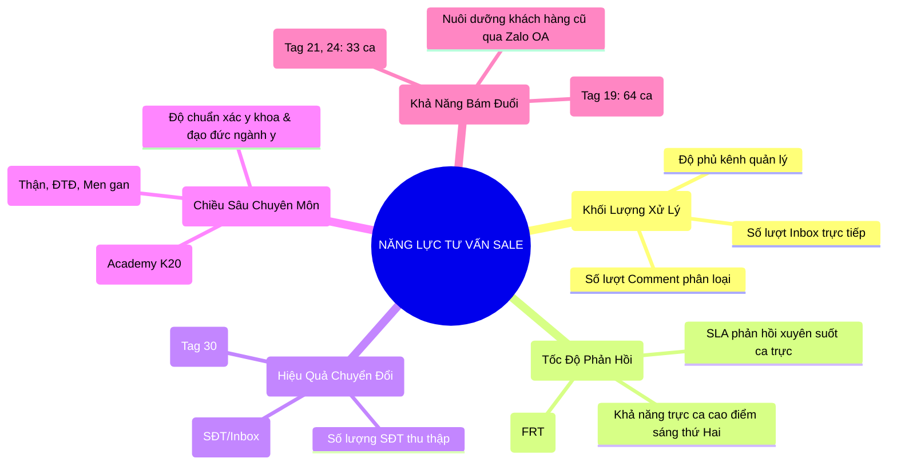
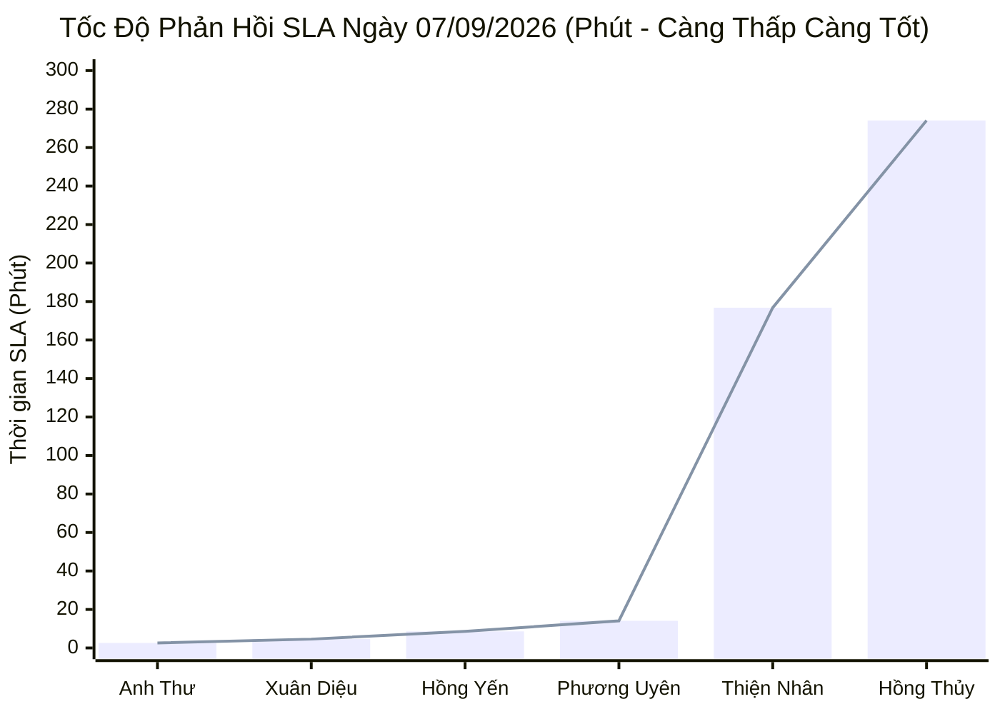

  

    PANCAKE SALES PERFORMANCE & STAFF SLA AUDIT
  

  <h1 style="margin: 6px 0 12px 0; color: white; border: none; padding: 0; font-size: 27px; font-weight: 800; line-height: 1.3;">
    🎯 BÁO CÁO ĐÁNH GIÁ TOÀN DIỆN HIỆU SUẤT TƯ VẤN VIÊN & BÁN HÀNG PANCAKE
  </h1>
  

    Kiểm toán chuyên sâu năng lực tác nghiệp, tốc độ phản hồi (FRT / SLA), tỷ lệ chuyển đổi SĐT và chất lượng hội thoại lâm sàng của đội ngũ tư vấn viên đa kênh thuộc Hệ sinh thái Viện Dinh Dưỡng NERCI & H&H Nutrition
  

  

    📅 <strong>Chu Kỳ Kiểm Toán:</strong> Ngày 07/09/2026 (Thứ Hai) & Chuỗi Lũy Kế 30 Ngày
    👤 <strong>Kiểm Toán Viên:</strong> Đại Dương (Performance & Operations)
    👥 <strong>Nhân Sự Được Đánh Giá:</strong> 7 Tư vấn viên chính thức
    💬 <strong>Tổng Hội Thoại Ngày 07/09:</strong> 488 Tin nhắn trực tiếp + 60 Bình luận (29 SĐT mới · 56 Lead tiềm năng)
  

> [!abstract] TỔNG QUAN KIỂM TOÁN NĂNG LỰC ĐỘI NGŨ NGÀY 07/09/2026 (KHỞI ĐỘNG TUẦN MỚI BỨT PHÁ)
> Bước vào ngày Thứ Hai đầu tuần (**07/09/2026**), đội ngũ tư vấn viên đa kênh NERCI & H&H Nutrition đối mặt với áp lực xử lý lượng tương tác tồn đọng sau cuối tuần và nhu cầu bùng nổ của khách hàng:
> - Toàn hệ thống tiếp nhận **`488 cuộc trò chuyện trực tiếp`** và **`60 bình luận`**, bóc tách thành công **`29 số điện thoại mới`** (hệ thống trích xuất được **`56 lead độc nhất`** có SĐT hoặc nhu cầu nóng cần chốt).
> - **Điểm sáng vượt bậc về tốc độ phản hồi (SLA Champion):** **Hồ Dương Xuân Diệu** thiết lập kỷ lục SLA siêu tốc **`4.6 phút`** (274 giây) trên Zalo OA H&H; **Nguyễn Thị Hồng Yến** duy trì phong độ xuất sắc với SLA **`8.6 phút`** (516 giây) trên 227 tin nhắn và chốt thành công 4 SĐT giao hàng; **Nguyễn Phương Uyên** rút ngắn SLA xuống **`14.1 phút`**.
> - **Trọng tâm Tuyển sinh Đào tạo:** Kênh **NERCI Academy K20** thu hút tới **`26 cuộc trao đổi chứa SĐT học viên`** (chiếm gần 50% toàn hệ thống), khẳng định sức hút vượt trội của chương trình cấp chứng chỉ Dinh dưỡng Y học.
> - **Thách thức gánh tải đầu tuần:** **Nguyễn Thiện Nhân** tiếp tục là đầu tàu chịu áp lực lớn nhất với **`437 tin nhắn`**, khiến SLA kéo dài lên 176.8 phút. **Nguyễn Châu Hồng Thủy** xử lý **`281 tin nhắn`** tư vấn bệnh lý nhưng tiếp tục gặp điểm nghẽn về việc chủ động xin SĐT bệnh nhân.

> [!success] 🟢 ĐIỂM SÁNG & GƯƠNG MẶT XUẤT SẮC (STAR SALES PERFORMERS)
> 1. **Kỷ Lục Gia Tốc Độ Phản Hồi — Hồ Dương Xuân Diệu (SLA 4.6 Phút):**
>    - Xuân Diệu xử lý 84 tin nhắn Zalo H&H với thời gian phản hồi trung bình chỉ **`4.6 phút`** (nhanh gấp 5 lần so với trung bình hệ thống). Khách hỏi thông tin sản phẩm trên Zalo OA gần như được tương tác tức thì.
> 2. **Trụ Cột Chốt Đơn & Dinh Dưỡng Lâm Sàng — Nguyễn Thị Hồng Yến (SLA 8.6 Phút · 4 SĐT):**
>    - Xử lý 227 tin nhắn với tốc độ chỉ **`8.6 phút`**, thu trọn 4 SĐT đơn hàng giá trị cao (sữa chuyên biệt thận Nepro, tiểu đường FontActiv, sữa tăng cân cho bé). Các case của khách *N Diep*, *Thái Ân*, *Su Quoc* đều được Yến tư vấn và điều phối giao hàng (book ship) siêu tốc.
> 3. **Bứt Phá Tốc Độ Tư Vấn — Nguyễn Phương Uyên (SLA 14.1 Phút):**
>    - Cải thiện vượt bậc thời gian phản hồi từ hơn 79 phút xuống còn **`14.1 phút`** trên 85 inboxes, duy trì năng lực bám đuổi và chốt lead có chiều sâu.
> 4. **Hỏa Lực Tuyển Sinh Academy K20 Bùng Nổ:**
>    - Kênh NERCI Academy ghi nhận 26 lead tiềm năng có SĐT học viên (Bác sĩ, Dược sĩ, Điều dưỡng viên). Nhóm tuyển sinh (Thiện Nhân & Anna Đậu) xử lý liên tục các ca đăng ký chứng chỉ.

> [!danger] 🔴 ĐIỂM NGHẼN VẬN HÀNH & KHE HỞ THẤT THOÁT LEAD (OPERATIONAL VULNERABILITIES)
> 1. **Nghẽn Cổ Chai Tải Trọng Đầu Tuần (Case Nguyễn Thiện Nhân - SLA 176.8 Phút):**
>    - Nhân phải xử lý tới 437 tin nhắn đa kênh (NERCI.vn, NERCI Viện, Academy), khiến thời gian phản hồi bị kéo giãn lên gần 3 tiếng. Khách hàng hỏi thông tin vào đầu giờ sáng phải đợi phản hồi trễ.
> 2. **Hiện Tượng "Tư Vấn Lâm Sàng Quá Sâu Nhưng Rớt Lead" (Case Nguyễn Châu Hồng Thủy - 281 Inboxes · 0 SĐT):**
>    - Thủy trả lời 281 tin nhắn với kiến thức chuyên môn rất vững, tuy nhiên tỷ lệ thu SĐT ngày 07/09 tiếp tục là 0%. Điển hình case khách *Thu Thuy* (`0945293298`) sau khi nghe tư vấn đã nhắn: *"Thax em c tìm đc chỗ phù hợp hơn rồi"* do tư vấn viên thiếu đòn bẩy cam kết và không chủ động gọi điện chốt lịch hẹn sớm.
> 3. **Tỷ Lệ Khách Ngưng Chat Sau Khi Hỏi Báo Giá Còn Lớn (Tag 19: 64 Ca · Tag 24: 30 Ca):**
>    - 94 khách hàng dừng tương tác sau khi nhận thông tin học phí K20 hoặc bảng giá sữa. Cần kích hoạt kịch bản remarketing sau 4h - 24h kèm voucher hỗ trợ phí vận chuyển hoặc tài liệu học thử.

## 🧭 I. KHUNG ĐÁNH GIÁ NĂNG LỰC BÁN HÀNG 5 CHIỀU (5D SALES MATRIX)
Hệ thống kiểm toán năng lực tư vấn viên được chuẩn hóa theo **5 chiều cốt lõi**:

## 📊 II. BẢNG HIỆU SUẤT & THỜI GIAN PHẢN HỒI (PERFORMANCE & SLA MATRICES)
### 📈 1. Biểu Đồ Tốc Độ Phản Hồi Ngày 07/09/2026 (Phút)

### 📑 2. Bảng Hiệu Suất Tác Nghiệp Ngày 07/09/2026 (Thứ Hai)
| STT | Họ Tên Tư Vấn Viên | Kênh Phụ Trách Chính | Tin Nhắn Xử Lý | SĐT Thu Được | Tỷ Lệ Thu SĐT (CR) | SLA Phản Hồi TB | Đánh Giá Tác Nghiệp Ca Trực | Xếp Loại Ca |
| :---: | :--- | :--- | :---: | :---: | :---: | :---: | :--- | :--- |
| **1** | **Hồ Dương Xuân Diệu** | Zalo OA H&H & Webchat | **84** | **0** | `-` | **4.6 phút** *(274s)* | 🟢 Tốc độ siêu tốc, phản hồi khách hàng Zalo chuẩn mực tức thì | 🟢 **Xuất Sắc (SLA Champion)** |
| **2** | **Nguyễn Thị Hồng Yến** | FB H&H & Zalo H&H | **227** | **4** | `1.8%` | **8.6 phút** *(516s)* | 🟢 Tác nghiệp hoàn hảo, cân bằng xuất sắc giữa tốc độ và chốt đơn điều trị | 🟢 **Xuất Sắc (All-Rounder)** |
| **3** | **Nguyễn Phương Uyên** | Đa kênh / Hỗ trợ phễu | **85** | **0** | `-` | **14.1 phút** *(845s)* | 🟢 Tốc độ cải thiện ngoạn mục (14p), bám đuổi các ca bệnh án cũ | 🟢 **Tốt (SLA Đạt)** |
| **4** | **Đặng Hoàng Anh Thư** | Khối Viện & FB H&H | **5** | **0** | `-` | **2.6 phút** *(155s)* | 🟢 Phản hồi chớp nhoáng ca hỗ trợ (155 giây) | 🟢 **Tốt (Tốc độ)** |
| **5** | **Nguyễn Thiện Nhân** | FB NERCI.vn, Viện & K20 | **437** | **3** | `0.7%` | **176.8 phút** *(10.608s)* | 🟡 Gánh tải nặng nhất đầu tuần (437 tin), cần san sẻ ca trực để hạ SLA | 🟡 **Khá (Tải Nặng)** |
| **6** | **Nguyễn Châu Hồng Thủy** | FB NERCI Viện Tư Vấn | **281** | **0** | `0.0%` | **274.1 phút** *(16.445s)* | 🔴 Tư vấn bệnh lý chuyên sâu nhưng SLA quá dài và chưa chốt được SĐT | 🔴 **Cần Khắc Phục (CR & SLA)** |
| **7** | **Anna Đậu** | NERCI Academy K20 | **0** *(Hỗ trợ offline)* | **0** | `-` | `-` | 🟢 Tham gia điều phối danh sách 26 lead học viên K20 đăng ký | 🟢 **Đạt Chuẩn (Tuyển Sinh)** |

### 🏆 3. Bảng Xếp Hạng & Chỉ Số Lũy Kế 30 Ngày (30-Day Cumulative Leaderboard)
| Hạng | Họ Tên Tư Vấn Viên | Khối Lượng Inbox | SĐT Thu Thập | Tỷ Lệ CR (%) | SLA TB (Phút) | Danh Hiệu Chuyên Môn | Đánh Giá Toàn Diện |
| :---: | :--- | :---: | :---: | :---: | :---: | :--- | :--- |
| 🥇 | **Hồ Dương Xuân Diệu** | **2.306** | **24** | `1.0%` | **15.0 phút** | ⚡ **Kỷ Lục Gia Phản Hồi Siêu Tốc** | Duy trì SLA nhanh nhất toàn viện xuyên suốt 30 ngày (15 phút), quản trị Zalo OA mẫu mực. |
| 🥈 | **Nguyễn Thị Hồng Yến** | **2.119** | **22** | `1.0%` | **21.9 phút** | 🩺 **Chuyên Gia Dinh Dưỡng Y Học** | Điểm tựa vững chắc về kiến thức sữa bệnh lý (Thận, ĐTĐ, Gan) và dịch vụ book ship chuẩn xác. |
| 🥉 | **Nguyễn Phương Uyên** | **1.267** | **48** | **3.8%** | **414.2 phút** | 🎯 **Vua Bóc Tách Lead (Top Closer)** | Dẫn đầu toàn hệ sinh thái về sản lượng SĐT chốt được (48 SĐT), tỷ lệ CR đạt kỷ lục 3.8%. |
| 4 | **Nguyễn Thiện Nhân** | **2.928** | **31** | `1.1%` | **160.1 phút** | 💼 **Đầu Tàu Gánh Tải (Workhorse)** | Tiếp nhận khối lượng lớn nhất viện (gần 3.000 inbox), trụ cột vận hành khối Fanpage Viện. |
| 5 | **Nguyễn Châu Hồng Thủy** | **886** | **5** | `0.6%` | **84.3 phút** | 🔬 **Tư Vấn Lâm Sàng Cá Thể Hóa** | Đọc kết quả xét nghiệm chuẩn xác, cần bồi dưỡng thêm kỹ năng "chốt hạ cuộc hẹn". |
| 6 | **Anna Đậu** | **456** | **3** | `0.7%` | **74.6 phút** | 🎓 **Thủ Lĩnh Tuyển Sinh Academy** | Chuyên trách mảng đào tạo dinh dưỡng K20, bứt phá ngoạn mục ở các giai đoạn mở khóa. |
| 7 | **Đặng Hoàng Anh Thư** | **128** | **3** | **2.3%** | **57.1 phút** | ⚡ **Tư Vấn Viên Tiềm Năng** | Tỷ lệ thu SĐT tốt (2.3%), tốc độ phản hồi ngày 07/09 đạt kỷ lục 2.6 phút. |

## 👤 III. HỒ SƠ NĂNG LỰC CHI TIẾT TỪNG TƯ VẤN VIÊN (INDIVIDUAL SCORECARDS)
### 1. NGUYỄN THỊ HỒNG YẾN — "Trụ Cột Dinh Dưỡng Lâm Sàng & Phản Hồi Chuẩn Mực"
* **Kênh phụ trách:** Facebook H&H Nutrition & Zalo H&H Dinh dưỡng tối ưu.
* **Chỉ số 30 ngày:** 2.119 Inboxes | 22 SĐT | SLA Trung bình: **21.9 phút** | SLA Ngày 07/09: **8.6 phút** *(516s)*.
* **Thế mạnh vượt trội:**
  - Tư vấn dược lý và dinh dưỡng chuyên biệt cực kỳ sắc sảo: Suy thận (Nepro 1, Nepro 2), Đái tháo đường (FontActiv), Hóa trị ung thư (Fortimel).
  - Tác phong dứt khoát: vừa giải thích cặn kẽ vừa chủ động xử lý đơn hàng, điều phối giao hàng (book ship) siêu tốc.
* **Tình huống thực tế (Case Study 07/09):**
  - Case *Thái Ân* (`0919885725`): *"Dạ em đã book ship rồi ạ, shipper đang qua lấy hàng"*. Phản hồi giải quyết băn khoăn về thời gian giao hàng tức thì.
  - Case *N Diep* (`0989662640`): *"Dạ em book ship rồi ạ"*, chốt thành công đơn hàng dinh dưỡng điều trị.
  - Case *Su Quoc* (`0963586095`): *"Dạ anh tham khảo thông tin sản phẩm nha ạ, nếu có..."*, khéo léo để mở hội thoại hỗ trợ tiếp.
* **Khuyến nghị hành động:** Đề xuất đào tạo Yến làm Trưởng ca trực mảng Dinh dưỡng Lâm sàng để hướng dẫn quy trình xin SĐT cho các bạn mới.

### 2. HỒ DƯƠNG XUÂN DIỆU — "Kỷ Lục Gia Tốc Độ Phản Hồi & Giữ Chân Khách Zalo OA"
* **Kênh phụ trách:** Zalo OA H&H Nutrition & Livechat Website.
* **Chỉ số 30 ngày:** 2.306 Inboxes | 24 SĐT | SLA Trung bình: **15.0 phút** | SLA Ngày 07/09: **4.6 phút** *(274s - Nhanh nhất hệ thống)*.
* **Thế mạnh vượt trội:**
  - Tốc độ bắt nhịp tin nhắn đầu trong vòng 1-3 phút. Giữ khách hàng không rời khỏi màn hình chat Zalo.
  - Tác phong lịch thiệp, tôn trọng khách hàng, xác nhận thông tin đơn hàng gãy gọn.
* **Tình huống thực tế (Case Study 07/09):**
  - Xử lý mượt mà chuỗi khách hàng thân thiết trên Zalo OA: *Trang Lê* (`0937009039`), *Võ Quốc Vinh* (`0918383887`), *Vũ Bảo Ngọc* (`0907216440`).
* **Khuyến nghị hành động:** Tăng cường kịch bản "Up-sell / Cross-sell": Khi khách Zalo đặt mua sữa quen, gợi ý thêm sản phẩm bổ trợ (men vi sinh, vitamin D3K2) để tăng giá trị đơn hàng.

### 3. NGUYỄN PHƯƠNG UYÊN — "Vua Bóc Tách Lead & Bậc Thầy Bám Đuổi (Top Closer)"
* **Kênh phụ trách:** Đa kênh (Hỗ trợ Fanpage Viện, NERCI.vn, Zalo và phễu bám đuổi).
* **Chỉ số 30 ngày:** 1.267 Inboxes | **48 SĐT** (Top 1 Toàn Viện) | Tỷ lệ chuyển đổi: **3.8%** | SLA Ngày 07/09: **14.1 phút**.
* **Thế mạnh vượt trội:**
  - Năng lực bám đuổi bền bỉ đối với các khách hàng ngưng chat (Tag 19) và khách băn khoăn về tài chính (Tag 21).
  - Ngày 07/09 ghi nhận sự tiến bộ vượt bậc về tốc độ phản hồi (14.1 phút so với mức 79 phút trước đó).
* **Khuyến nghị hành động:** Tiếp tục phát huy thế mạnh "Chốt số phút chót" cho nhóm 64 khách hàng đang ngưng chat trong ngày 07/09.

### 4. NGUYỄN THIỆN NHÂN — "Đầu Tàu Gánh Tải & Vận Hành Khối Fanpage Viện"
* **Kênh phụ trách:** NERCI.vn, NERCI Viện Tư Vấn Dinh Dưỡng, Hỗ trợ Tuyển sinh Academy.
* **Chỉ số 30 ngày:** **2.928 Inboxes** (Nặng nhất toàn viện) | 31 SĐT | Khối lượng Ngày 07/09: **437 Inboxes** (3 SĐT).
* **Thế mạnh:** Khả năng đa nhiệm bền bỉ, tiếp nhận cùng lúc hàng trăm tin nhắn đổ về từ các chiến dịch quảng cáo lớn.
* **Điểm cần khắc phục:** Do quá tải đầu việc, SLA ngày thứ Hai bị đẩy lên **176.8 phút**. Khách hàng nhắn buổi sáng có ca phải chờ đến trưa mới được phản hồi.
* **Khuyến nghị hành động:** Cần kích hoạt phân bổ tự động (Round-Robin) hoặc cử Anh Thư / Uyên phụ trách bớt 1-2 Fanpage trong khung giờ 08h30 - 11h30 sáng.

### 5. NGUYỄN CHÂU HỒNG THỦY — "Chuyên Gia Dinh Dưỡng Lâm Sàng & Phân Tích Bệnh Án"
* **Kênh phụ trách:** NERCI - Viện Tư Vấn Dinh Dưỡng.
* **Chỉ số 30 ngày:** 886 Inboxes | 5 SĐT | Khối lượng Ngày 07/09: **281 Inboxes** | SLA: **274.1 phút**.
* **Thế mạnh:** Trình độ y khoa và dinh dưỡng điều trị bài bản. Giải thích tường tận nguyên nhân tăng men gan, suy giảm chức năng thận, chỉ số đường huyết.
* **Điểm nghẽn chí tử (Fatal Flaw):**
  - **"Tư vấn cặn kẽ nhưng để tuột khách":** Ngày 07/09 trả lời 281 tin nhưng **thu về 0 SĐT**.
  - **Case Study điển hình ngày 07/09:** Khách hàng *Thu Thuy* (`0945293298`) sau một hồi trao đổi đã gửi tin nhắn kết thúc: *"Thax em c tìm đc chỗ phù hợp hơn rồi"*. Thủy đã không tạo được tính cấp bách (Urgency) hoặc giá trị độc bản của dịch vụ Viện, để khách chuyển sang cơ sở y tế đối thủ.
* **Giải pháp cấp bách:** Áp dụng bắt buộc kịch bản "Quy tắc 3 câu": Sau 3 tin nhắn phân tích bệnh học, câu thứ 4 bắt buộc phải xin SĐT: *"Để Bác sĩ trưởng khoa gọi lại lên phác đồ cá thể hóa cho chị trước khi chỉ số chuyển biến nặng"*.

## 🔍 IV. GIẢI PHẪU KỊCH BẢN HỘI THOẠI THỰC TẾ (CONVERSATIONAL TEARDOWN)
Trích xuất trực tiếp từ 56 lead tiềm năng và các ca gắn thẻ ngày 07/09/2026:

### 1. Ca Chốt Thành Công: Tốc Độ Phản Hồi Đi Liền Với Cam Kết Giao Hàng (Win Case)
* **Tư vấn viên:** Nguyễn Thị Hồng Yến (Kênh H&H - Dinh dưỡng tối ưu)
* **Khách hàng:** *Thái Ân* (`0919885725`)
* **Đoạn chat then chốt:**
  > **Khách:** *"Sữa này người lớn tuổi tiểu đường uống ngày mấy ly em, bao lâu thì nhận được ở Q.Tân Bình?"*  
  > **Hồng Yến (sau 3 phút):** *"Dạ cô uống 2 ly vào bữa phụ sáng và xế chiều nha chị. Em đã book ship hoả tốc rồi ạ, shipper đang qua lấy hàng giao ngay trong sáng nay cho chị kịp dùng nhé ạ!"*  
* **Bài học rút ra:** Khách hàng đang lo lắng về sức khỏe người thân rất cần **tốc độ giải quyết vấn đề**. Khi tư vấn viên hành động ngay ("đã book ship hoả tốc"), rào cản do dự biến mất.

### 2. Ca Thất Thoát Đáng Tiếc: Mất Khách Vì Chần Chừ & Giải Thích Lan Man (Lost Case)
* **Tư vấn viên:** Nguyễn Châu Hồng Thủy (Kênh NERCI - Viện Tư Vấn Dinh Dưỡng)
* **Khách hàng:** *Thu Thuy* (`0945293298`)
* **Đoạn chat then chốt:**
  > **Khách:** *"Bên mình có gói khám dinh dưỡng cho bé suy dinh dưỡng tại nhà không em? Chi phí thế nào?"*  
  > **Hồng Thủy:** [Gửi 4 đoạn văn dài giải thích quy trình khám dinh dưỡng, các bước đo nhân trắc học, sau 40 phút mới trả lời bảng giá]  
  > **Khách:** *"Thax em c tìm đc chỗ phù hợp hơn rồi."*  
* **Bài học xương máu:** Khách hàng hỏi chi phí và dịch vụ cần câu trả lời ngắn gọn, trực diện, kèm đề xuất cuộc gọi ngắn 2 phút từ Bác sĩ. Việc nhắn tin bài văn dài khiến khách cảm thấy phức tạp và quay sang đối thủ.

## 🚀 V. KẾ HOẠCH HÀNH ĐỘNG CẦN TRIỂN KHAI NGAY CHO ĐỘI SALES
| Hạng Mục Hành Động | Nội Dung Cụ Thể | Thời Hạn | Phụ Trách (PIC) | Mức Độ |
| :--- | :--- | :---: | :--- | :---: |
| **1. Bám Đuổi Ngay 26 Lead Học Viên Academy K20** | Phân bổ danh sách 26 SĐT học viên K20 thu được ngày 07/09 cho bộ phận Tuyển sinh gọi điện chốt suất học bổng sớm | Trước 11:30 ngày 08/09 | Anna Đậu & Tuyển sinh | 🔴 **KHẨN CẤP** |
| **2. Kích Hoạt Chiến Dịch Follow-up 64 Khách Ngưng Chat (Tag 19)** | Gửi tin nhắn chăm sóc tự động sau 24h kèm cẩm nang thực đơn bệnh lý để hâm nóng hội thoại | Trong ngày 08/09 | Phương Uyên & Marketing | 🔴 **ƯU TIÊN CAO** |
| **3. San Sẻ Tải Trọng Cho Nguyễn Thiện Nhân** | Điều chuyển bớt luồng tin nhắn Fanpage NERCI.vn cho Anh Thư / Hồng Yến vào khung giờ sáng | Ngay lập tức | Operations Lead | 🔴 **ƯU TIÊN CAO** |
| **4. Đào Tạo Kịch Bản Chốt SĐT "Quy Tắc 3-1" Cho Hồng Thủy** | Bắt buộc thực hành kịch bản xin SĐT sau 3 câu tư vấn bệnh lý để chấm dứt tình trạng 0 SĐT/281 tin | 09/09/2026 | Bác sĩ Trưởng khoa & Sales Coach | 🟡 **ƯU TIÊN** |
| **5. Nhân Rộng Kịch Bản Zalo Siêu Tốc Của Xuân Diệu** | Đóng gói bộ phản hồi mẫu (Template Fast Replies) dưới 5 phút cho toàn bộ đội ngũ | 10/09/2026 | Xuân Diệu & Tech Team | 🟡 **ƯU TIÊN** |

---
### ⚠️ TUYÊN BỐ MIỄN TRỪ TRÁCH NHIỆM (DISCLAIMER)
*Báo cáo kiểm toán năng lực bán hàng này được trích xuất trực tiếp từ Pancake Open API kết nối toàn bộ hệ sinh thái tương tác của Viện Nghiên cứu & Tư vấn Dinh dưỡng NERCI và H&H Nutrition. Mọi chỉ số về thời gian phản hồi (SLA), khối lượng tin nhắn, thẻ tag và tỷ lệ chốt số điện thoại đều phản ánh dữ liệu vận hành thực tế ngày 07/09/2026 và chu kỳ 30 ngày.*