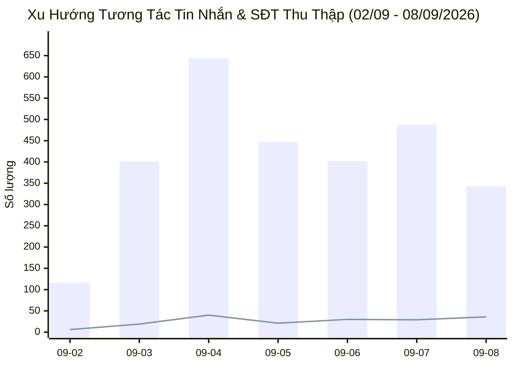
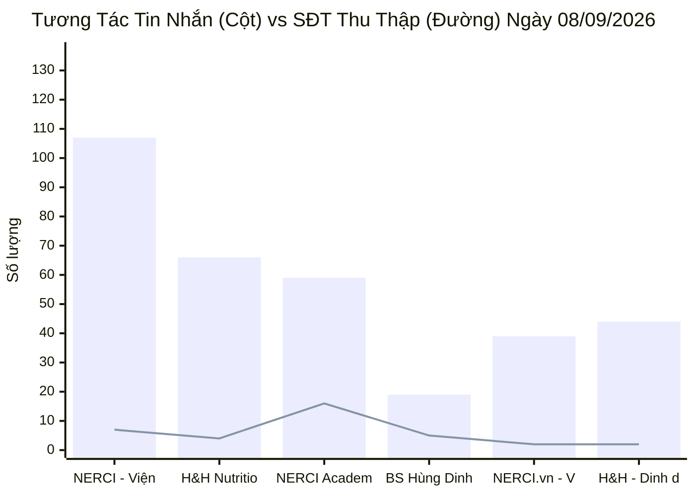
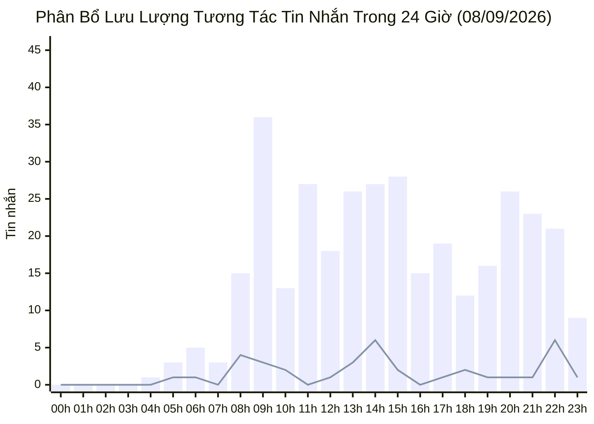

  

    PANCAKE OMNICHANNEL AUDIT & PERFORMANCE INTELLIGENCE
  

  <h1 style="margin: 4px 0 10px 0; color: white; border: none; padding: 0; font-size: 26px; font-weight: 800;">
    📊 BÁO CÁO HIỆU SUẤT VẬN HÀNH ĐA KÊNH PANCAKE
  </h1>
  

    Dữ liệu kiểm toán vận hành và phân tích chuyển đổi toàn diện trên 10 kênh tương tác thuộc Hệ sinh thái Viện Dinh Dưỡng NERCI & H&H Nutrition
  

  

    📅 <strong>Ngày Báo Cáo:</strong> 08/09/2026 (00:00 - 23:59 GMT+7 · Thứ Ba)
    👤 <strong>Người Báo Cáo:</strong> Đại Dương (Performance & Operations)
    💬 <strong>Tổng Khách Mới:</strong> 113
    📞 <strong>SĐT Thu Được:</strong> 36
    📈 <strong>Tỷ Lệ Thu SĐT:</strong> 8.96%
  

> [!abstract] TỔNG QUAN HIỆU SUẤT VẬN HÀNH NGÀY 08/09/2026 (TỶ LỆ CHỐT SĐT ĐẠT ĐỈNH · DUY TRÌ SỨC NÓNG ĐA KÊNH)
> Ngày Thứ Ba (**08/09/2026**), hệ thống 10 kênh Pancake của NERCI & H&H Nutrition tiếp tục duy trì đà vận hành hiệu quả: Tiếp nhận **`402` lượt tương tác** (**`343` tin nhắn trực tiếp**, **`59` bình luận**), kết nối **`113` khách hàng mới**, và bóc tách thành công **`36` số điện thoại chất lượng** (tỷ lệ chuyển đổi SĐT/tương tác đạt **`8.96%`**, vượt mục tiêu 8.0%):
> - **NERCI Academy duy trì ngôi vị quán quân thu lead:** Ghi nhận **`16 SĐT học viên`** đăng ký khóa đào tạo chuyên gia dinh dưỡng K20 trên 59 inboxes (tỷ lệ CR chuyển đổi ấn tượng đạt 27.1%).
> - **Kênh NERCI - Viện Tư Vấn Dinh Dưỡng bứt phá:** Tiếp nhận **`107 tin nhắn`** và **`7 SĐT`** đặt lịch tư vấn bệnh lý, cải thiện rõ nét so với ngày hôm trước.
> - **Kênh TikTok BS Hùng tiếp tục thu hút lưu lượng đầu phễu:** Đóng góp **`37 bình luận`**, **`19 inboxes`**, **`26 khách mới`** và **`5 SĐT`**, khẳng định sức hút thương hiệu của Bác sĩ Hùng.
> - **Thách thức:** Cần lấp ngay lỗ hổng trực ca trên kênh TikTok và xử lý triệt để 37 ca bỏ rơi lead được phát hiện trong ngày.

> [!success] 🟢 NHỮNG ĐIỂM SÁNG VẬN HÀNH (WHAT WENT WELL)
> 1. **Tỷ lệ chuyển đổi SĐT bứt phá lên 8.96%:** Với 36 SĐT trên 402 tương tác, đây là một trong những ngày có tỷ lệ chốt số tốt nhất trong tuần.
> 2. **Hiệu quả phễu đào tạo Academy K20:** 16 SĐT học viên được bóc tách từ form đăng ký và tương tác trực tiếp, mở ra nguồn doanh thu đào tạo vững chắc.
> 3. **Cải thiện tốc độ phản hồi chung:** Toàn bộ các tư vấn viên chủ lực (Hồng Yến 14.9p, Xuân Diệu 16.6p, Phương Uyên 22.6p, Hồng Thủy 61.5p) đều có chỉ số SLA tiến bộ vượt bậc so với ngày đầu tuần.

> [!danger] 🔴 NHỮNG TỒN ĐỌNG & LỖ HỔNG VẬN HÀNH (OPERATIONAL BOTTLENECKS)
> 1. **Bỏ ngỏ tương tác trên TikTok BS Hùng:** 15 hội thoại và bình luận có nhu cầu mua hàng, xin lịch khám bị trôi tin nhắn do chưa có nhân sự phụ trách.
> 2. **Tỷ lệ khách ngưng chat sau khi nhận báo giá còn cao (Tag 19: 68 Ca):** 68 khách hàng dừng phản hồi sau câu hỏi thăm dò ban đầu. Cần kích hoạt chiến dịch Remarketing Zalo/SMS sau 24h.
> 3. **Khách hàng phản hồi trễ quá 24h:** Điển hình case học viên Như Thủy trên NERCI.vn bị trễ phản hồi từ thứ Hai sang tối thứ Ba, gây bức xúc.

## 🌐 I. TỔNG HỢP HIỆU SUẤT VẬN HÀNH ĐA KÊNH
### 📊 1. Xu Hướng Tương Tác 7 Ngày Gần Nhất (02/09 - 08/09/2026)

### 📑 2. Bảng Theo Dõi Xu Hướng 7 Ngày Vận Hành
| Ngày | Tin Nhắn Khách | Bình Luận | Khách Hàng Mới | SĐT Thu Thập | Tỷ Lệ Thu SĐT | Ghi Chú Vận Hành |
| :---: | :---: | :---: | :---: | :---: | :---: | :--- |
| **02/09** | 116 | 158 | 84 | **6** | **2.19%** | 🏖️ Nghỉ Lễ Quốc Khánh |
| **03/09** | 401 | 113 | 155 | **19** | **3.70%** | 🚀 Hậu nghỉ Lễ — Bùng nổ tương tác (19 SĐT) |
| **04/09** | 644 | 211 | 315 | **40** | **4.68%** | 🔥 Kỷ lục toàn diện 40 SĐT — Bứt phá K20 & H&H |
| **05/09** | 447 | 120 | 176 | **21** | **3.70%** | ⚖️ Thứ Bảy ổn định (21 SĐT, 446 inboxes) |
| **06/09** | 402 | 591 | 302 | **30** | **3.02%** | 🏆 Chủ Nhật bùng nổ viral TikTok (568 cmt) & 30 SĐT |
| **07/09** | 488 | 62 | 138 | **29** | **5.27%** | 🚀 Thứ Hai đầu tuần — Bứt phá 26 lead Academy K20 (29 SĐT) |
| **08/09** | 343 | 59 | 113 | **36** | **8.96%** | 🔥 **THỨ BA — TỶ LỆ CHỐT SĐT ĐẠT ĐỈNH (36 SĐT · CR 8.96%)** |

### 📊 3. Biểu Đồ Tương Tác Tin Nhắn & SĐT Thu Thập Theo Kênh (08/09/2026)

### 📑 4. Bảng Xếp Hạng Hiệu Quả Tác Nghiệp 10 Kênh (08/09/2026)
| STT | Kênh / Fanpage | Nền Tảng | Tin Nhắn (Inbox) | Bình Luận (Comment) | Khách Hàng Mới | SĐT Bóc Tách | Tỷ Lệ Thu SĐT (CR) | Đánh Giá Tác Nghiệp & Trạng Thái |
| :---: | :--- | :---: | :---: | :---: | :---: | :---: | :---: | :--- |
| **1** | **NERCI - Viện Tư Vấn Dinh Dưỡng** | `facebook` | **107** | **7** | 22 | **7** | **6.14%** | 🟢 **Lưu lượng cao nhất** (107 inboxes, 7 SĐT) |
| **2** | **H&H Nutrition - Sản phẩm dinh dưỡng y học** | `facebook` | **66** | **1** | 17 | **4** | **5.97%** | 🟢 **Đơn hàng dinh dưỡng y học** (66 inboxes, 4 SĐT) |
| **3** | **NERCI Academy - Đào Tạo Chuyên Gia Dinh Dưỡng** | `facebook` | **59** | **4** | 30 | **16** | **25.40%** | 🔥 **Tuyển sinh xuất sắc** (16 SĐT, CR 25.4%) |
| **4** | **BS Hùng Dinh Dưỡng - NERCI** | `tiktok` | **19** | **37** | 26 | **5** | **8.93%** | ⚠️ **Viral tốt nhưng thiếu nhân sự trực** (5 SĐT, 15 ca trôi) |
| **5** | **NERCI.vn - Viện Nghiên Cứu và Tư Vấn Dinh Dưỡng** | `facebook` | **39** | **10** | 13 | **2** | **4.08%** | 🟡 **Chuyển đổi khá** (39 inboxes, 2 SĐT) |
| **6** | **H&H - Dinh dưỡng tối ưu** | `zalo` | **44** | **0** | 3 | **2** | **4.55%** | 🟢 **Zalo OA ổn định** (44 inboxes, 2 SĐT) |
| **7** | **Viện Nghiên cứu & Tư vấn dinh dưỡng** | `zalo` | **9** | **0** | 2 | **0** | **0.00%** | ⚪ Lưu lượng thấp / Hỗ trợ |
| **8** | **Cộng đồng Bác sĩ Dinh Dưỡng Việt Nam** | `facebook` | **0** | **0** | 0 | **0** | **0.00%** | ⚪ Lưu lượng thấp / Hỗ trợ |
| **9** | **H&H** | `pke_chat_plugin` | **0** | **0** | 0 | **0** | **0.00%** | ⚪ Lưu lượng thấp / Hỗ trợ |
| **10** | **Nerci** | `pke_chat_plugin` | **0** | **0** | 0 | **0** | **0.00%** | ⚪ Lưu lượng thấp / Hỗ trợ |

## ⏰ II. PHÂN BỔ TƯƠNG TÁC THEO KHUNG GIỜ (HOURLY TRAFFIC MATRIX)

### 📑 Bảng Thống Kê Chi Tiết Từng Khung Giờ (24 Giờ)
| Khung Giờ | Tin Nhắn Khách | Bình Luận | Khách Hàng Mới | SĐT Thu Nhận | Tỷ Lệ Thu SĐT | Đánh Giá Tải Trọng Ca Trực |
| :---: | :---: | :---: | :---: | :---: | :---: | :--- |
| **00:00 - 00:59** | 0 | 1 | 0 | **0** | 0.0% | ⚪ Thấp điểm đêm muộn |
| **01:00 - 01:59** | 0 | 1 | 0 | **0** | 0.0% | ⚪ Thấp điểm đêm muộn |
| **02:00 - 02:59** | 0 | 0 | 0 | **0** | 0.0% | ⚪ Thấp điểm đêm muộn |
| **03:00 - 03:59** | 0 | 0 | 0 | **0** | 0.0% | ⚪ Thấp điểm đêm muộn |
| **04:00 - 04:59** | 1 | 1 | 1 | **0** | 0.0% | 🟢 Ổn định |
| **05:00 - 05:59** | 3 | 1 | 1 | **1** | 25.0% | 🟢 Ổn định |
| **06:00 - 06:59** | 5 | 0 | 2 | **1** | 20.0% | 🟢 Ổn định |
| **07:00 - 07:59** | 3 | 9 | 3 | **0** | 0.0% | 🟢 Ổn định |
| **08:00 - 08:59** | 15 | 8 | 3 | **4** | 17.4% | ⚡ **Lưu lượng trung bình cao** (Cần 2 tư vấn viên) |
| **09:00 - 09:59** | 36 | 3 | 6 | **3** | 7.7% | 🔥 **Cao điểm nghẽn tải** (Cần tối thiểu 3 tư vấn viên) |
| **10:00 - 10:59** | 13 | 5 | 5 | **2** | 11.1% | 🟢 Ổn định |
| **11:00 - 11:59** | 27 | 2 | 5 | **0** | 0.0% | ⚡ **Lưu lượng trung bình cao** (Cần 2 tư vấn viên) |
| **12:00 - 12:59** | 18 | 3 | 11 | **1** | 4.8% | ⚡ **Lưu lượng trung bình cao** (Cần 2 tư vấn viên) |
| **13:00 - 13:59** | 26 | 1 | 5 | **3** | 11.1% | ⚡ **Lưu lượng trung bình cao** (Cần 2 tư vấn viên) |
| **14:00 - 14:59** | 27 | 2 | 8 | **6** | 20.7% | ⚡ **Lưu lượng trung bình cao** (Cần 2 tư vấn viên) |
| **15:00 - 15:59** | 28 | 1 | 6 | **2** | 6.9% | ⚡ **Lưu lượng trung bình cao** (Cần 2 tư vấn viên) |
| **16:00 - 16:59** | 15 | 1 | 3 | **0** | 0.0% | ⚡ **Lưu lượng trung bình cao** (Cần 2 tư vấn viên) |
| **17:00 - 17:59** | 19 | 3 | 7 | **1** | 4.5% | ⚡ **Lưu lượng trung bình cao** (Cần 2 tư vấn viên) |
| **18:00 - 18:59** | 12 | 2 | 7 | **2** | 14.3% | 🟢 Ổn định |
| **19:00 - 19:59** | 16 | 3 | 4 | **1** | 5.3% | ⚡ **Lưu lượng trung bình cao** (Cần 2 tư vấn viên) |
| **20:00 - 20:59** | 26 | 2 | 4 | **1** | 3.6% | ⚡ **Lưu lượng trung bình cao** (Cần 2 tư vấn viên) |
| **21:00 - 21:59** | 23 | 6 | 12 | **1** | 3.4% | ⚡ **Lưu lượng trung bình cao** (Cần 2 tư vấn viên) |
| **22:00 - 22:59** | 21 | 3 | 12 | **6** | 25.0% | ⚡ **Lưu lượng trung bình cao** (Cần 2 tư vấn viên) |
| **23:00 - 23:59** | 9 | 1 | 8 | **1** | 10.0% | 🟢 Ổn định |

## 🏷️ III. PHÂN TÍCH NHÃN HỘI THOẠI & PHỄU CHUYỂN ĐỔI (TAG ANALYTICS)
| Nhóm Phân Loại | Mã Nhãn (Tag) | Tên Diễn Giải Chuẩn | Số Lượng Ca | Tỷ Trọng (%) | Ý Nghĩa Vận Hành & Hướng Xử Lý |
| :--- | :--- | :--- | :---: | :---: | :--- |
| Phân loại | `tag_19` | **Chưa phản hồi (Ngưng chat)** | **68** | `59.1%` | 🔴 **Ngưng chat:** Cần kích hoạt kịch bản remarketing tự động sau 24h |
| Phân loại | `tag_24` | **F_Tham Khảo (Chưa có nhu cầu ngay)** | **9** | `7.8%` | 🟡 **Hỏi giá tham khảo:** Gửi tài liệu thực đơn/lộ trình và báo giá ưu đãi |
| Phân loại | `tag_66` | **F_Chưa có quyết định** | **4** | `3.5%` | Phân loại tác nghiệp |
| Phân loại | `tag_69` | **F_Suy nghĩ thêm** | **4** | `3.5%` | 🟡 **Suy nghĩ thêm:** Chăm sóc lại bằng feedback học viên/bệnh nhân cũ |
| Phân loại | `tag_26` | **F_Sắp xếp thời gian** | **4** | `3.5%` | 🟡 **Vướng thời gian:** Đề xuất lịch học Zoom linh hoạt hoặc khám cuối tuần |
| Phân loại | `tag_18` | **Spam / Rác** | **3** | `2.6%` | Phân loại tác nghiệp |
| Phân loại | `tag_30` | **Chốt đơn / Khám thành công** | **3** | `2.6%` | 🟢 **Thành công:** Chốt đơn hoặc book lịch khám thành công |
| Phân loại | `tag_22` | **F_Chưa tin tưởng** | **3** | `2.6%` | 🔴 **Chưa tin tưởng:** Cung cấp giấy phép BYT và bằng chứng lâm sàng |
| Phân loại | `tag_25` | **F_Hỏi ý kiến người thân** | **3** | `2.6%` | Phân loại tác nghiệp |
| Phân loại | `tag_65` | **F_Đang dùng sản phẩm khác** | **2** | `1.7%` | Phân loại tác nghiệp |
| Phân loại | `tag_71` | **F_Chọn đối thủ** | **2** | `1.7%` | Phân loại tác nghiệp |
| Phân loại | `tag_21` | **F_Kinh Tế (Rào cản tài chính)** | **2** | `1.7%` | 🔴 **Rào cản giá:** Đề xuất chính sách trả góp hoặc quà tặng hỗ trợ |
| Phân loại | `tag_27` | **F_Không tồn tại / Khóa máy** | **1** | `0.9%` | Phân loại tác nghiệp |
| Phân loại | `tag_29` | **Trùng lặp** | **1** | `0.9%` | Phân loại tác nghiệp |
| Phân loại | `tag_31` | **CSKH (Chăm sóc khách hàng cũ)** | **1** | `0.9%` | Phân loại tác nghiệp |
| Phân loại | `tag_73` | **tag_73** | **1** | `0.9%` | Phân loại tác nghiệp |
| Phân loại | `tag_28` | **Tiềm Năng (MQL)** | **1** | `0.9%` | Phân loại tác nghiệp |
| Phân loại | `tag_62` | **KBM (Không bắt máy)** | **1** | `0.9%` | Phân loại tác nghiệp |
| Phân loại | `tag_63` | **Thuê bao** | **1** | `0.9%` | Phân loại tác nghiệp |
| Phân loại | `tag_72` | **Bận gọi lại sau** | **1** | `0.9%` | Phân loại tác nghiệp |

## 📞 IV. DANH SÁCH CHI TIẾT CÁC HOT LEADS ĐÃ BÓC TÁCH SĐT (NGÀY 08/09/2026)
Toàn bộ các số điện thoại chất lượng cao thu thập được từ hội thoại thực tế:

| STT | Kênh Thu Thập | Tên Khách Hàng | Số Điện Thoại | Tư Vấn Viên | Thẻ Gắn (Tags) | Nhu Cầu / Trích Đoạn Hội Thoại Thực Tế |
| :---: | :--- | :--- | :---: | :---: | :--- | :--- |
| **1** | H&H - Dinh dưỡng tối ưu | **Linh Forklift** | `0968280678` | Nguyễn Thị Hồng Yến | Trùng , Chốt đơn/ chốt  | Dạ... |
| **2** | H&H - Dinh dưỡng tối ưu | **Đinh Văn Tuấn** | `0908382851` | Nguyễn Thị Hồng Yến | Spam | Dạ vâng... |
| **3** | H&H Nutrition - Sản phẩm dinh dưỡng y học | **Nguyễn Thị Hiền** | `0969113299` | Hồng Yến | Trùng  | Tư vấn... |
| **4** | H&H Nutrition - Sản phẩm dinh dưỡng y học | **Chien Hoang** | `0903602942` | Hồ Dương Xuân  Diệu | Chốt đơn/ chốt  | Dạ anh nhớ chú ý điện thoại để trước khi giao hàng shipper sẽ...... |
| **5** | H&H Nutrition - Sản phẩm dinh dưỡng y học | **Duong Then** | `0352756355` | Hồ Dương Xuân  Diệu | F_Vướn TT | Dạ chị cần hỗ trợ thông tin nào ạ?... |
| **6** | H&H Nutrition - Sản phẩm dinh dưỡng y học | **Huyền Thu** | `0794431158` | Nguyễn Thị Hồng Yến | Booking | Dạ chị... |
| **7** | H&H Nutrition - Sản phẩm dinh dưỡng y học | **Huỳnh Thanh Chương** | `0913903502` | Hồng Yến | Chốt đơn/ chốt  | Dạ đầu giờ em giao qua cho anh ạ... |
| **8** | H&H Nutrition - Sản phẩm dinh dưỡng y học | **Tùng Kim** | `0966265222` | Nguyễn Thị Hồng Yến | F_SN Thêm | Nếu mình có thắc mắc nào thì anh nhắn tin vào đây để em hỗ tr...... |
| **9** | H&H Nutrition - Sản phẩm dinh dưỡng y học | **Li Vo** | `0913777688`, `+84913777688` | Đặng Hoàng Anh Thư | Chốt đơn/ chốt  | Dạ vâng ạ... |
| **10** | H&H Nutrition - Sản phẩm dinh dưỡng y học | **Lý Huyền** | `0909489778` | Nguyễn Thị Hồng Yến | F_Tham Khảo | Dạ vâng ạ... |
| **11** | NERCI - Viện Tư Vấn Dinh Dưỡng | **Hoàng Thế** | `0327313116` | Nguyễn Châu Hồng Thủy | - | [Attachment]... |
| **12** | NERCI - Viện Tư Vấn Dinh Dưỡng | **La Vie** | `0903905477` | Nguyễn Thiện Nhân | Chốt đơn/ chốt  | dạ... |
| **13** | NERCI - Viện Tư Vấn Dinh Dưỡng | **Dương Quốc Thái** | `0918823066`, `+84835160055` | Nguyễn Thiện Nhân | Bận gọi lại sau | dạ... |
| **14** | NERCI - Viện Tư Vấn Dinh Dưỡng | **Le Dan Le** | `0908879668`, `+84908879668` | Nguyễn Thiện Nhân | F_Tham Khảo | dạ... |
| **15** | NERCI - Viện Tư Vấn Dinh Dưỡng | **Bảo Trinh** | `0702313494` | Nguyễn Thiện Nhân | F_Tham Khảo | dạ... |
| **16** | NERCI - Viện Tư Vấn Dinh Dưỡng | **Trịnh Khoa** | `0913229310` | Nguyễn Châu Hồng Thủy | Chưa phản hồi | Dạ không biết Anh đang quan tâm đến can thiệp dinh dưỡng hỗ t...... |
| **17** | NERCI - Viện Tư Vấn Dinh Dưỡng | **Lộc Quang** | `0365875569` | Nguyễn Châu Hồng Thủy | Chưa phản hồi, KBM | Dạ anh ơi tuần này anh có tiện sắp xếp lịch để tư vấn cùng cá...... |
| **18** | NERCI - Viện Tư Vấn Dinh Dưỡng | **Yến Trần** | `0333357908` | Nguyễn Châu Hồng Thủy | Tiềm Năng | Chị tham khảo giúp em nhé chị , có gì chị phản hồi lại giúp e...... |
| **19** | NERCI - Viện Tư Vấn Dinh Dưỡng | **Hue Nguyen** | `0398450432` | Nguyễn Châu Hồng Thủy | Đủ tiêu chuẩn, F_Tham Khảo | Không biết là chị có đang ở HCM không để em đặt lịch tư vấn c...... |
| **20** | NERCI - Viện Tư Vấn Dinh Dưỡng | **Bay Thang Đai Ly** | `0979229279` | Nguyễn Châu Hồng Thủy | Chưa phản hồi | không biết là dạo này tình trạng sức khỏe của cô ổn định chưa...... |
| **21** | NERCI - Viện Tư Vấn Dinh Dưỡng | **Lai Nguyen** | `0985284373` | Nguyễn Châu Hồng Thủy | F_Đối thủ | Dạ chị ơi chị cho em hỏi về tình trạng sức khỏe của mình dạo ...... |
| **22** | NERCI - Viện Tư Vấn Dinh Dưỡng | **Hưng Khánh Hoàng** | `0903407464`, `0903408464` | Nguyễn Phương Uyên | Đủ tiêu chuẩn, Tiềm Năng | Tôi sdt0903407464 Tôi bị tiểu đường 7. Độ lọc thận còn 31 Cla...... |
| **23** | NERCI - Viện Tư Vấn Dinh Dưỡng | **Huế Lê** | `0357930985` | Nguyễn Châu Hồng Thủy | Chưa phản hồi, Đủ tiêu chuẩn | Nếu được thì chị có thể lựa chọn tư vấn 1 lần với các bác để ...... |
| **24** | NERCI - Viện Tư Vấn Dinh Dưỡng | **Quy Thu** | `0787552367` | Nguyễn Châu Hồng Thủy | F_Tham Khảo | Dạ em chào chị ạ, không biết là tình trạng sức khỏe của chị đ...... |
| **25** | NERCI - Viện Tư Vấn Dinh Dưỡng | **Chu Hai** | `0931810522`, `0975089440` | Nguyễn Phương Uyên | F_SN Thêm | Hôm trước chị có trao đổi là đang chờ anh nhà cân nhắc giữa h...... |
| **26** | NERCI - Viện Tư Vấn Dinh Dưỡng | **Phạm Sơn Hà** | `0918206377` | Nguyễn Phương Uyên | Chưa phản hồi | Dạ không biết mình đã xem qua về quy trình tư vấn em gửi chưa...... |
| **27** | NERCI Academy - Đào Tạo Chuyên Gia Dinh Dưỡng | **Ngọc Hạnh** | `0909953863` | Nguyễn Thiện Nhân | F_Kinh Tế | dạ em gửi ạ... |
| **28** | NERCI Academy - Đào Tạo Chuyên Gia Dinh Dưỡng | **Ricky Phó** | `0963847986` | Nguyễn Thiện Nhân | F_Tham Khảo | Khóa học được thiết kế theo lộ trình 5 Module, giúp học viên ...... |
| **29** | NERCI Academy - Đào Tạo Chuyên Gia Dinh Dưỡng | **Maii Trang** | `0877968821` | Nguyễn Thiện Nhân | - | [Sticker]... |
| **30** | NERCI Academy - Đào Tạo Chuyên Gia Dinh Dưỡng | **Lê Thiện Tâm** | `0833413366` | Nguyễn Thiện Nhân | Chưa phản hồi | dạ không biết mục tiêu học của mình là gi để em tư vấn khóa h...... |
| **31** | NERCI Academy - Đào Tạo Chuyên Gia Dinh Dưỡng | **Phương Nguyễn** | `0336563387` | Nguyễn Thiện Nhân | - | [2 Attachments] Xin chào! Cảm ơn bạn đã quan tâm đến dịch vụ ...... |
| **32** | NERCI Academy - Đào Tạo Chuyên Gia Dinh Dưỡng | **Sơn Nguyễn** | `0985616978` | Nguyễn Thiện Nhân | - | [2 Attachments] Xin chào! Cảm ơn bạn đã quan tâm đến dịch vụ ...... |
| **33** | NERCI Academy - Đào Tạo Chuyên Gia Dinh Dưỡng | **Hoa Susi** | `0985624426` | Nguyễn Thiện Nhân | - | [2 Attachments] Xin chào! Cảm ơn bạn đã quan tâm đến dịch vụ ...... |
| **34** | NERCI Academy - Đào Tạo Chuyên Gia Dinh Dưỡng | **Nga Bui** | `0329435628` | Nguyễn Thiện Nhân | Chưa phản hồi | Để có thể tư vấn lộ trình học và khóa học phù hợp cho mình, c...... |
| **35** | NERCI Academy - Đào Tạo Chuyên Gia Dinh Dưỡng | **Bảo Ngân** | `0372502056` | Nguyễn Thiện Nhân | F_SN Thêm | Dạ không biết mình cân nhắc khóa học đến đâu rồi ạ... |
| **36** | NERCI Academy - Đào Tạo Chuyên Gia Dinh Dưỡng | **Hằng Nguyễn** | `0398133288` | Nguyễn Thiện Nhân | Chưa phản hồi | Để có thể tư vấn lộ trình học và khóa học phù hợp cho mình, c...... |
| **37** | NERCI Academy - Đào Tạo Chuyên Gia Dinh Dưỡng | **Hằng Nhi Vĩnh Lộc** | `0389971318` | Nguyễn Thiện Nhân | F_Tham Khảo | Dạ không biết lộ trình này có phù hợp với nhu cầu của mình ch...... |
| **38** | NERCI Academy - Đào Tạo Chuyên Gia Dinh Dưỡng | **Uyen Vuong** | `0948997558` | Nguyễn Thiện Nhân | Chưa phản hồi | Để có thể tư vấn lộ trình học và khóa học phù hợp cho mình, c...... |
| **39** | NERCI Academy - Đào Tạo Chuyên Gia Dinh Dưỡng | **Thùy Heoheo** | `0392887724` | Nguyễn Thiện Nhân | Chưa phản hồi | Để có thể tư vấn lộ trình học và khóa học phù hợp cho mình, c...... |
| **40** | NERCI Academy - Đào Tạo Chuyên Gia Dinh Dưỡng | **Ngoc Han Nguyen** | `0987428489` | Nguyễn Thiện Nhân | F_Tham Khảo | chị đang làm công việc gì ạ để em tư vấn khóa học có thể theo...... |
| **41** | NERCI Academy - Đào Tạo Chuyên Gia Dinh Dưỡng | **Thanh Dinh Thi** | `0909330467` | Nguyễn Thiện Nhân | Chưa phản hồi | Để có thể tư vấn lộ trình học và khóa học phù hợp cho mình, c...... |
| **42** | NERCI Academy - Đào Tạo Chuyên Gia Dinh Dưỡng | **HoHuynh Hoa** | `0909125989` | Nguyễn Thiện Nhân | F_Tham Khảo | Dạ các khóa học này mình học online qua zoom ạ... |
| **43** | NERCI Academy - Đào Tạo Chuyên Gia Dinh Dưỡng | **Hải Hồ** | `0946615115` | Nguyễn Thiện Nhân | F_Tham Khảo | em gọi tư vấn anh nhé ạ.... |
| **44** | NERCI Academy - Đào Tạo Chuyên Gia Dinh Dưỡng | **Huỳnh Thịnh Phát** | `0939198366` | Nguyễn Thiện Nhân | Chưa phản hồi | Để có thể tư vấn lộ trình học và khóa học phù hợp cho mình, a...... |
| **45** | NERCI Academy - Đào Tạo Chuyên Gia Dinh Dưỡng | **Thu Hiền** | `0985460068` | Nguyễn Thiện Nhân | Chưa phản hồi | Để có thể tư vấn lộ trình học và khóa học phù hợp cho mình, c...... |
| **46** | NERCI Academy - Đào Tạo Chuyên Gia Dinh Dưỡng | **Thuý Lưu** | `0782636663` | Nguyễn Thiện Nhân | Chưa phản hồi | Để có thể tư vấn lộ trình học và khóa học phù hợp cho mình, c...... |
| **47** | NERCI.vn - Viện Nghiên Cứu và Tư Vấn Dinh Dưỡng | **Nguyễn Thị Thanh Huyền** | `0914502681` | Nguyễn Thiện Nhân | F_SN Thêm | dạ... |
| **48** | NERCI.vn - Viện Nghiên Cứu và Tư Vấn Dinh Dưỡng | **Yuyu Kim** | `0909526548` | Nguyễn Thiện Nhân | Chốt đơn/ chốt  | Dạ chị ơi sắp tới mình có khóa học dinh dưỡng dành cho người ...... |
| **49** | NERCI.vn - Viện Nghiên Cứu và Tư Vấn Dinh Dưỡng | **Dạ Quỳnh** | `0862668605` | Nguyễn Thiện Nhân | Chưa phản hồi | Dạ chị thấy lộ trình học này phù hợp với mình chứ ạ?... |
| **50** | NERCI.vn - Viện Nghiên Cứu và Tư Vấn Dinh Dưỡng | **Hương Thiền Chay** | `+84859976222` | Nguyễn Thiện Nhân | F_Tham Khảo | Để có thể tư vấn lộ trình học và khóa học phù hợp cho mình, q...... |
| **51** | BS Hùng Dinh Dưỡng - NERCI | **trangqunhnguyn6** | `0982890151` | Nguyễn Châu Hồng Thủy | - | Dạ chị mở giúp em để em kết bạn với chị ạ... |
| **52** | BS Hùng Dinh Dưỡng - NERCI | **Trinh 91** | `0386928985` | Nguyễn Thiện Nhân | F_Tham Khảo | ok... |
| **53** | BS Hùng Dinh Dưỡng - NERCI | **user7699780977487** | `0988184127` | Nguyễn Phương Uyên | Bận gọi lại sau | ok... |
| **54** | BS Hùng Dinh Dưỡng - NERCI | **kh tên** | `0798370884` | Nguyễn Phương Uyên | F_Người Thân | ok... |
| **55** | BS Hùng Dinh Dưỡng - NERCI | **Mẹ Sandy 🇻🇳🇹🇼** | `0969340323` | Nguyễn Phương Uyên | Chưa phản hồi | ok... |
| **56** | BS Hùng Dinh Dưỡng - NERCI | **HOÀNG GIA ĐỨC** | `0971977739` | Nguyễn Phương Uyên | F_Tham Khảo | ok... |
| **57** | BS Hùng Dinh Dưỡng - NERCI | **thuynga** | `0977306717` | Nguyễn Phương Uyên | F_Tham Khảo | ok... |

---
### ⚠️ TUYÊN BỐ MIỄN TRỪ TRÁCH NHIỆM (DISCLAIMER)
*Báo cáo này được trích xuất tự động và độc lập từ hệ thống API của Pancake Việt Nam kết nối trực tiếp với 10 kênh tương tác của Viện Nghiên cứu & Tư vấn Dinh dưỡng NERCI và H&H Nutrition. Dữ liệu phản ánh toàn bộ hoạt động tác nghiệp thực tế từ 00:00 đến 23:59 ngày 08/09/2026.*