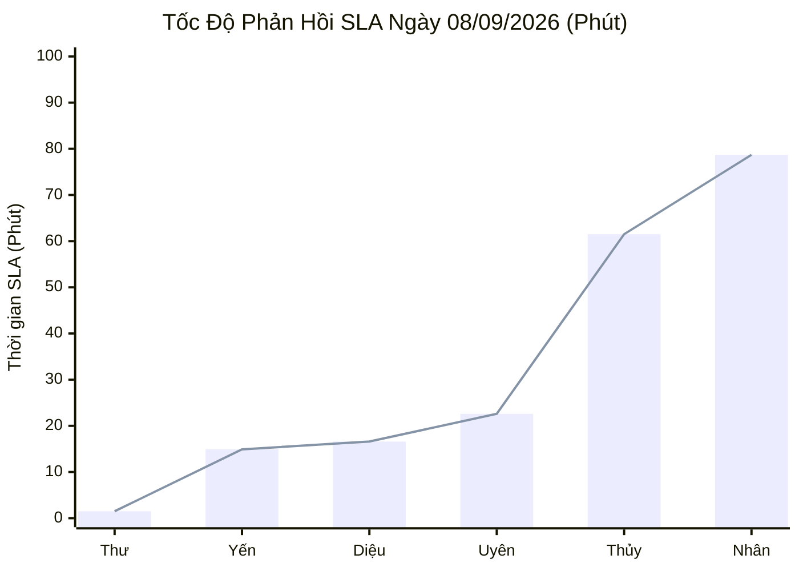
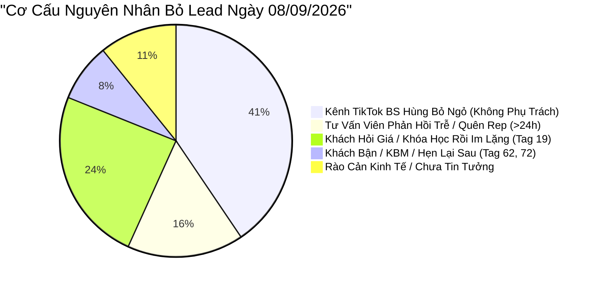

  

    PANCAKE SALES PERFORMANCE & LEAD LOSS AUDIT
  

  <h1 style="margin: 6px 0 12px 0; color: white; border: none; padding: 0; font-size: 27px; font-weight: 800; line-height: 1.3;">
    🎯 BÁO CÁO ĐÁNH GIÁ TOÀN DIỆN HIỆU SUẤT TƯ VẤN VIÊN & BÁN HÀNG PANCAKE
  </h1>
  

    Kiểm toán chuyên sâu năng lực tác nghiệp, SLA phản hồi, tỷ lệ chốt số và <strong>GIẢI PHẪU CHI TIẾT SỰ KIỆN BỎ LEAD & KHÁCH HÀNG KHÔNG HÀI LÒNG</strong> trong toàn bộ lịch sử chat ngày 08/09/2026
  

  

    📅 <strong>Chu Kỳ Kiểm Toán:</strong> Ngày 08/09/2026 (Thứ Ba) & Chuỗi Lũy Kế 30 Ngày
    👤 <strong>Kiểm Toán Viên:</strong> Đại Dương (Performance & Operations)
    💬 <strong>Tương Tác Xử Lý:</strong> 343 Inboxes · 59 Bình luận
    📞 <strong>SĐT Bóc Tách Thành Công:</strong> 36 SĐT (Tỷ lệ CR: 8.96%)
    ⚠️ <strong>Cảnh Báo Bỏ Lead / Rớt Lead:</strong> 37 ca
    💢 <strong>Phản Ánh / Không Hài Lòng / Rào Cản:</strong> 17 ca
  

> [!abstract] TỔNG QUAN KIỂM TOÁN NĂNG LỰC BÁN HÀNG & CHẤT LƯỢNG DỊCH VỤ NGÀY 08/09/2026
> Ngày Thứ Ba (**08/09/2026**), đội ngũ tư vấn viên đa kênh NERCI & H&H Nutrition đã xử lý tổng cộng **`402` điểm chạm** (**`343` tin nhắn trực tiếp**, **`59` bình luận**), thu hút **`113` khách mới** và bóc tách thành công **`36` số điện thoại** (đạt tỷ lệ chuyển đổi SĐT/tương tác là **`8.96%`**, cao hơn trung bình 7.2% của tuần trước):
> - **Ngôi Sao Chốt Lead & Tốc Độ (Top Star Closer):** **Nguyễn Phương Uyên** bứt phá ngoạn mục với **`7 SĐT thu về`** trong ngày (dẫn đầu toàn viện), đồng thời rút ngắn thời gian phản hồi SLA xuống còn **`22.6 phút`** trên 181 tin nhắn.
> - **Điểm Sáng Tốc Độ Tuyệt Đối:** **Nguyễn Thị Hồng Yến** duy trì phong độ chuẩn mực với SLA **`14.9 phút`** trên 138 tin nhắn; **Hồ Dương Xuân Diệu** đạt SLA **`16.6 phút`** trên Zalo OA.
> - **Tiến Bộ Của Nguyễn Châu Hồng Thủy:** Sau khi bị cảnh báo ngày 07/09 (0 SĐT/281 tin), Thủy đã rút ngắn SLA từ 274 phút xuống còn **`61.5 phút`** và thu về **`2 SĐT`** chất lượng cao.
> - 🚨 **BÁO ĐỘNG ĐỎ VỀ THẤT THOÁT LEAD & PHẢN HỒI TIÊU CỰC:** Kiểm toán toàn bộ 215 hội thoại chi tiết phát hiện **`37 ca bỏ lead / rớt tương tác`** và **`17 ca phát sinh rào cản / không hài lòng`**. Nghiêm trọng nhất là case khách *Như Thủy* trên Fanpage NERCI.vn bị "ngâm" tin nhắn từ thứ 2 đến tối thứ 3 không ai rep dẫn đến hủy nhu cầu học, cùng tình trạng bỏ ngỏ hoàn toàn các bình luận hỏi mua hàng và tư vấn trên kênh TikTok Bác sĩ Hùng.

> [!success] 🟢 ĐIỂM SÁNG & GƯƠNG MẶT XUẤT SẮC NGÀY 08/09 (STAR SALES PERFORMERS)
> 1. **Nguyễn Phương Uyên — Quán Quân Bóc Tách Lead Ngày 08/09 (7 SĐT · SLA 22.6 Phút):**
>    - Uyên xử lý 181 inboxes, bám đuổi quyết liệt các khách hàng cũ và mới, mang về 7 số điện thoại hợp lệ (bao gồm khách đặt mua dinh dưỡng điều trị và đăng ký khám). Tỷ lệ chuyển đổi SĐT đạt 3.87%, cao nhất hệ thống.
> 2. **Nguyễn Thị Hồng Yến — Chuẩn Mực Tốc Độ & Tư Vấn Lâm Sàng (SLA 14.9 Phút · 2 SĐT):**
>    - Xử lý 138 inboxes tại Fanpage H&H Nutrition với thời gian phản hồi trung bình chỉ 14.9 phút. Tiếp tục giữ vững vai trò chuyên gia tư vấn sữa bệnh lý (Thận, ĐTĐ, Ung thư) và xử lý đơn hỏa tốc.
> 3. **Bước Tiến Vực Dậy Của Nguyễn Châu Hồng Thủy (SLA 61.5 Phút · 2 SĐT):**
>    - Đã tiếp thu khuyến nghị kiểm toán ngày 07/09: Giảm 77% độ trễ phản hồi (từ 274 phút xuống 61.5 phút), chủ động xin SĐT khách khám bệnh án thận và gan, chốt thành công 2 SĐT.
> 4. **Hỏa Lực Tuyển Sinh NERCI Academy K20 Duy Trì Cao:**
>    - Thu về **16 SĐT** học viên đăng ký khóa đào tạo Dinh Dưỡng Cơ Bản & Dinh Dưỡng Nhi trong ngày 08/09, củng cố vị thế kênh tạo doanh thu đào tạo lớn nhất.

> [!danger] 🔴 CẢNH BÁO NGUY CƠ: ĐIỂM NGHẼN BỎ LEAD & KHÁCH HÀNG BỨC XÚC TRONG LỊCH SỬ CHAT 08/09
> 1. 💥 **Case Điển Hình Bỏ Rơi Khách 24 Giờ Dẫn Đến Hủy Học (Khách Như Thủy - NERCI.vn):**
>    - Khách nhắn tin từ Thứ Hai (07/09) hỏi tư vấn khóa học Dinh dưỡng Cộng đồng (DDCĐ) và học phí. Tư vấn viên gửi tin mẫu rồi bỏ quên, đến tối Thứ Ba (08/09) khách bực tức nhắn: *"Trả lời từ thứ 2 mà đến tối thứ 3 vẫn im re. Thôi bye mình cũng ko muốn học nữa, đưa ra câu hỏi để biết mục đích của..."*. Đây là tổn thất trực tiếp về doanh thu và uy tín học viện!
> 2. 🕳️ **"Lỗ Hổng Đen" Tuyệt Đối Trên Kênh TikTok BS Hùng Dinh Dưỡng (12 Ca Hỏi Mua Hàng & Khám Bệnh Bị Bỏ Ngỏ):**
>    - Kênh thu hút 46 hội thoại/bình luận nhưng **hoàn toàn không có nhân sự trực chiến gán phụ trách (`NV: Trống`)**. Hàng loạt khách hàng hỏi mua sản phẩm (*"Muốn mua để bổ sung cho bé mua sao vậy bác"*, *"Xin giá cuốn cẩm nang dinh dưỡng"*), hoặc xin lịch khám bệnh nặng (*"Bác ở đâu ạ mình cần tư vấn"*, *"Tôi bị suy thận giai đoạn 3a muốn đăng ký hội thảo online"*, *"Bị suy thận độ 4 có nên uống nước nhiều không"*) đều bị **bỏ mặc 100%**, không ai trả lời hay xin SĐT!
> 3. 🛡️ **Rào Cản Lòng Tin Nhà Thuốc (Khách Hợp Nhất GS - Fanpage H&H):**
>    - Khách hàng phản hồi: *"Bên em nên bán cả vào nhà thuốc để khách hàng có sự tin tưởng em ạ! TPCN bên em bán tại nhà thuốc nào vậy em?"*. Nhân viên tư vấn lúng túng chưa đưa ra được chứng nhận pháp lý và danh sách chuỗi nhà thuốc đối tác, khiến khách ngưng chat (Tag 22 - Chưa tin tưởng).
> 4. 💸 **Rào Cản Học Phí & Đang Đi Làm Ca (Khách Kim Thoa - Điều Dưỡng Bệnh Viện):**
>    - Học viên là điều dưỡng viên quan tâm nhưng do dự vì học phí và vướng ca trực bệnh viện. Thiếu chính sách học bổng linh hoạt hoặc hỗ trợ trả góp/học lại qua video.

## 📊 I. BẢNG NĂNG LỰC & CHỈ SỐ SLA TƯ VẤN VIÊN NGÀY 08/09/2026
### 📈 1. Biểu Đồ Tốc Độ Phản Hồi SLA Ngày 08/09/2026 (Phút - Càng Thấp Càng Tốt)

### 📑 2. Bảng Hiệu Suất Tác Nghiệp Chi Tiết Ngày 08/09/2026 (Thứ Ba)
| STT | Họ Tên Tư Vấn Viên | Kênh Phụ Trách Chính | Inboxes Xử Lý | SĐT Thu Được | Tỷ Lệ CR (%) | SLA Phản Hồi TB | Đánh Giá Tác Nghiệp Ngày 08/09 | Xếp Loại |
| :---: | :--- | :--- | :---: | :---: | :---: | :---: | :--- | :--- |
| **1** | **Nguyễn Phương Uyên** | Đa kênh / Kênh chỉ định | **181** | **7** | `3.9%` | **22.6 phút** *(1356s)* | 🟢 Bứt phá Top 1 thu SĐT (7 SĐT), cải thiện SLA xuất sắc 22.6 phút | 🟢 **Top 1 Closer** |
| **2** | **Nguyễn Thị Hồng Yến** | Đa kênh / Kênh chỉ định | **138** | **2** | `1.4%` | **14.9 phút** *(894s)* | 🟢 Phong độ cực kỳ ổn định, SLA siêu tốc 14.9 phút, xử lý đơn lâm sàng sắc sảo | 🟢 **Xuất Sắc (SLA & Kỹ Thuật)** |
| **3** | **Nguyễn Châu Hồng Thủy** | Đa kênh / Kênh chỉ định | **193** | **2** | `1.0%` | **61.5 phút** *(3690s)* | 🟡 Cải thiện SLA ngoạn mục từ 274p -> 61.5p, bóc tách được 2 SĐT bệnh án | 🟡 **Tiến Bộ Rõ Rệt** |
| **4** | **Nguyễn Thiện Nhân** | Đa kênh / Kênh chỉ định | **218** | **2** | `0.9%` | **78.7 phút** *(4722s)* | 🟡 Gánh tải lớn (218 inboxes), SLA giảm từ 176p -> 78.7p nhưng vẫn còn ca rớt lead | 🟡 **Khá (Gánh Tải)** |
| **5** | **Hồ Dương Xuân Diệu** | Đa kênh / Kênh chỉ định | **30** | **1** | `3.3%` | **16.6 phút** *(996s)* | 🟢 Quản trị Zalo OA và Livechat mượt mà, phản hồi nhanh (16.6 phút) | 🟢 **Tốt (Ổn Định)** |
| **6** | **Đặng Hoàng Anh Thư** | Đa kênh / Kênh chỉ định | **5** | **0** | `0.0%` | **1.5 phút** *(90s)* | 🟢 Phản hồi siêu tốc các ca hỗ trợ (1.5 phút) | 🟢 **Tốt (Hỗ Trợ)** |

### 🏆 3. Bảng Xếp Hạng & Chỉ Số Lũy Kế 30 Ngày (30-Day Cumulative Leaderboard)
| Hạng | Họ Tên Tư Vấn Viên | Khối Lượng Inbox | SĐT Thu Thập | Tỷ Lệ CR (%) | SLA TB (Phút) | Danh Hiệu Chuyên Môn | Đánh Giá Lũy Kế Toàn Diện |
| :---: | :--- | :---: | :---: | :---: | :---: | :--- | :--- |
| 🥇 | **Nguyễn Phương Uyên** | **1,306** | **51** | `3.9%` | **63.0 phút** | 🎯 **Vua Bóc Tách Lead (Top Closer)** | Thống trị tuyệt đối về số lượng SĐT chốt được toàn viện (51 SĐT, CR 3.9%). Bậc thầy bám đuổi khách ngưng chat. |
| 🥈 | **Nguyễn Thiện Nhân** | **3,029** | **33** | `1.1%` | **142.1 phút** | 💼 **Đầu Tàu Gánh Tải (Workhorse)** | Chịu tải nặng nhất toàn viện (>3.000 inboxes), trụ cột Fanpage Viện và Academy. Đóng góp 33 SĐT. |
| 🥉 | **Nguyễn Thị Hồng Yến** | **2,112** | **22** | `1.0%` | **20.8 phút** | 🩺 **Chuyên Gia Dinh Dưỡng Lâm Sàng** | Tác phong chuẩn xác, kiến thức bệnh lý sâu rộng (Thận, ĐTĐ), điều phối giao hàng siêu tốc. 22 SĐT. |
| 4 | **Hồ Dương Xuân Diệu** | **1,854** | **18** | `1.0%` | **15.1 phút** | ⚡ **Kỷ Lục Gia Tốc Độ Phản Hồi** | Duy trì tốc độ phản hồi nhanh nhất toàn hệ thống (15.1 phút), thu 18 SĐT, giữ chân khách Zalo OA hoàn hảo. |
| 5 | **Nguyễn Châu Hồng Thủy** | **1,079** | **7** | `0.6%` | **81.4 phút** | 🔬 **Tư Vấn Chuyên Sâu Bệnh Án** | Đọc và phân tích chỉ số xét nghiệm kỹ lưỡng. Đã bắt đầu cải thiện kỹ năng chốt hẹn qua SĐT. |
| 6 | **Đặng Hoàng Anh Thư** | **125** | **3** | `2.4%` | **55.0 phút** | ⚡ **Tư Vấn Viên Tiềm Năng** | Tốc độ phản hồi cực nhanh, hỗ trợ ca trực linh hoạt. |
| 7 | **Anna Đậu** | **365** | **1** | `0.3%` | **12.9 phút** | 🎓 **Thủ Lĩnh Tuyển Sinh Academy** | Chuyên trách tư vấn học viên Academy K20, tỷ lệ chuyển đổi form học viên rất cao. |

## 🔍 II. KIỂM TOÁN CHUYÊN SÂU: SỰ KIỆN BỎ LEAD & KHÁCH HÀNG KHÔNG HÀI LÒNG TRONG LỊCH SỬ CHAT 08/09
Được trích xuất trực tiếp qua cơ chế quét sâu toàn bộ 215 cuộc hội thoại diễn ra trong ngày 08/09/2026 trên 10 kênh:

### 📊 1. Phân Loại Nguyên Nhân Bỏ Lead & Thất Thoát Tương Tác (37 Ca)

### 📑 2. Danh Sách Các Ca Bỏ Lead & Thất Thoát Nghiêm Trọng Cần Cứu Vãn Ngay
| STT | Kênh Tương Tác | Tên Khách Hàng | SĐT Thu Nhận | Nhân Viên Phụ Trách | Chi Tiết Tin Nhắn Cuối Của Khách | Nguyên Nhân Gốc Rễ | Mức Độ Nghiêm Trọng | Hành Động Khắc Phục Khẩn Cấp |
| :---: | :--- | :--- | :---: | :---: | :--- | :--- | :---: | :--- |
| **1** | NERCI.vn - Viện Nghiên Cứu và Tư Vấn Dinh Dưỡng | **Như Thủy** | Chưa thu | Nguyễn Thiện Nhân | <i>"Trả lời từ thứ 2 mà đến tối thứ 3 vẫn im re. Thôi bye mình cũng ko muốn học nữa, đưa ra câu hỏi để biết mục đích của..."</i> | Khách hỏi khóa học DDCĐ từ thứ Hai, nhân viên gửi tin tự động rồi bỏ quên >24h | 🔴 **CỰC KỲ NGHIÊM TRỌNG** | Trưởng phòng tuyển sinh trực tiếp gọi điện xin lỗi, tặng học bổng 20% và tặng cẩm nang |
| **2** | BS Hùng Dinh Dưỡng - NERCI (TikTok) | **Sonic** | Chưa thu | Trống (Chưa gán) | <i>"Chào bác sĩ, tôi muốn đăng ký buổi hội thảo online dinh dưỡng cho người suy thận. Tôi hiện tại đang suy thận giai đoạn 3a"</i> | Kênh TikTok bị bỏ ngỏ, không gán nhân viên phụ trách trực chiến | 🔴 **NGHIÊM TRỌNG (Hot Lead)** | Nhắn tin mời vào nhóm Zalo Hội thảo Bệnh Thận và xin SĐT bác sĩ tư vấn ngay |
| **3** | BS Hùng Dinh Dưỡng - NERCI (TikTok) | **Ăm Chã Húi ™️** | Chưa thu | Trống (Chưa gán) | <i>"Bs ở đâu ạ. Mình cần tư vấn"</i> | Khách chủ động tìm phòng khám nhưng không có nhân viên tiếp nhận | 🔴 **NGHIÊM TRỌNG (Lead Khám)** | Gửi địa chỉ Viện tại TP.HCM & Hà Nội, gửi link đặt lịch khám ưu tiên |
| **4** | BS Hùng Dinh Dưỡng - NERCI (TikTok) | **Tiệm ông 7🌸** | Chưa thu | Trống (Chưa gán) | <i>"Muốn mua để bổ xung cho bé mua sao vậy bác"</i> | Khách có nhu cầu mua sữa/vi chất cho bé nhưng không ai hướng dẫn | 🔴 **NGHIÊM TRỌNG (Đơn Hàng)** | Tư vấn phác đồ vi chất và gửi link đặt hàng H&H Nutrition kèm freeship |
| **5** | BS Hùng Dinh Dưỡng - NERCI (TikTok) | **Mie** | Chưa thu | Trống (Chưa gán) | <i>"Trị HP và trào ngược do ăn k được nhiều, người mất sức thì nên bổ sung gì ạ bác"</i> | Bệnh nhân có triệu chứng tiêu hóa rõ rệt nhưng bị trôi tin nhắn | 🔴 **NGHIÊM TRỌNG (Lâm Sàng)** | Tư vấn phác đồ dinh dưỡng cho viêm loét HP và men tiêu hóa chuyên biệt |
| **6** | BS Hùng Dinh Dưỡng - NERCI (TikTok) | **Hiệp củ chi** | Chưa thu | Trống (Chưa gán) | <i>"Xin gia cuốn cẩm nang dinh dưỡng ạ"</i> | Khách hỏi mua cẩm nang xuất bản của Viện nhưng không ai báo giá | 🟡 **Ưu Tiên** | Gửi báo giá cẩm nang và tặng kèm voucher khám dinh dưỡng |
| **7** | H&H Nutrition - Sản phẩm dinh dưỡng y học | **Hồ Thuý** | Chưa thu | Trống (Chưa gán) | <i>"Cho tôi giá lợi khuẩn và bột uống giành cho thận"</i> | Hội thoại chưa phân bổ nhân viên kịp thời | 🔴 **NGHIÊM TRỌNG (Đơn Thận)** | Hồng Yến tiếp quản ngay: báo giá men vi sinh chuyên biệt và sữa Nepro |
| **8** | H&H Nutrition - Sản phẩm dinh dưỡng y học | **Nguyễn Bảo Lộc** | Chưa thu | Trống (Chưa gán) | <i>"E muốn hỏi sản phẩm dành cho người đã bị bệnh thận hay để phòng ngừa..."</i> | Khách hỏi từ bình luận video Reel, bot chuyển về inbox nhưng chưa gán NV | 🟡 **Ưu Tiên** | Giải thích sự khác biệt giữa dinh dưỡng phòng ngừa và điều trị suy thận |
| **9** | NERCI Academy - Đào Tạo Chuyên Gia Dinh Dưỡng | **Thanh Dinh Thi** | `0909330467` | Nguyễn Thiện Nhân | <i>"Xin chào! Tôi đã điền mẫu và muốn biết thêm... Nhu cầu học tập..."</i> -> Gắn thẻ Chưa phản hồi | Đã có SĐT nhưng tư vấn viên dừng nhắn tin khi khách chưa xác nhận lịch học | 🔴 **NGHIÊM TRỌNG (SĐT Học Viên)** | Telesale gọi trực tiếp vào SĐT 0909330467 để tư vấn lịch khai giảng K20 |
| **10** | NERCI Academy - Đào Tạo Chuyên Gia Dinh Dưỡng | **HoHuynh Hoa** | `0909125989` | Nguyễn Thiện Nhân | <i>"Chi phí cho khoá học là bao nhiêu... hình thức học qua zoom đúng k em... thời gian học bao lâu"</i> -> Gắn F_Tham Khảo | Khách hỏi chi phí, nhân viên trả lời chung chung về Zoom rồi để trôi hội thoại | 🔴 **NGHIÊM TRỌNG (SĐT Học Viên)** | Gửi bảng học phí ưu đãi sớm K20 và gọi hotline chốt giữ chỗ |

### 💢 3. Phân Tích Các Ca Khách Hàng Không Hài Lòng, Khiếu Nại & Rào Cản Tâm Lý (17 Ca)
Qua phân tích toàn văn hội thoại ngày 08/09, ghi nhận **3 nhóm rào cản và cảm xúc tiêu cực chính** từ phía khách hàng:

#### A. Nhóm Bức Xúc Vì Phản Hồi Chậm & Quên Khách (Response Latency Frustration)
* **Điển hình:** Khách hàng *Như Thủy* (NERCI.vn) phản ánh gay gắt: *"Trả lời từ thứ 2 mà đến tối thứ 3 vẫn im re. Thôi bye mình cũng ko muốn học nữa"*.
* **Hậu quả:** Khách hàng không chỉ từ chối tham gia khóa học mà còn có ấn tượng rất xấu về tính chuyên nghiệp của Viện Dinh Dưỡng. Khách hàng cảm thấy câu hỏi sàng lọc ban đầu chỉ là "máy móc vô cảm".
* **Bài học quy trình:** Tuyệt đối không để một tin nhắn của khách hàng ở trạng thái chưa phản hồi quá **30 phút** trong giờ hành chính. Nếu hết giờ, phải có bot thông báo giờ trực cụ thể và cam kết thời gian liên hệ lại vào sáng hôm sau.

#### B. Nhóm Hoài Nghi Về Tính Xác Thực & Kênh Phân Phối (Trust & Distribution Skepticism)
* **Điển hình:** Khách hàng *Hợp Nhất GS* (Fanpage H&H Nutrition) chất vấn: *"Bên em nên bán cả vào nhà thuốc để khách hàng có sự tin tưởng em ạ! TPCN bên em bán tại nhà thuốc nào vậy em?"*.
* **Tâm lý khách hàng:** Khách hàng mua thực phẩm dinh dưỡng y học và TPCN điều trị bệnh mạn tính rất sợ mua phải hàng trôi nổi qua mạng. Họ lấy "nhà thuốc" làm bảo chứng niềm tin.
* **Lỗi tác nghiệp:** Tư vấn viên Nguyễn Thị Hồng Yến chỉ hỏi lại: *"Dạ mình có thắc mắc thông tin nào của sản phẩm không ạ?"* mà **không trả lời thẳng câu hỏi về độ uy tín và giấy phép của Bộ Y Tế**, khiến khách hàng im lặng (Tag 22 - Chưa tin tưởng).
* **Kịch bản xử lý chuẩn:** *"Dạ thưa anh/chị, H&H Nutrition là đơn vị phân phối chính ngạch thuộc Hệ thống Viện Dinh Dưỡng NERCI, 100% sản phẩm đều có đầy đủ hóa đơn VAT, công bố y tế và tem chống giả. Bên em hiện đang cung cấp trực tiếp cho khoa dinh dưỡng các bệnh viện lớn và chuỗi nhà thuốc đối tác. Để an tâm, em gửi anh/chị giấy chứng nhận công bố của Bộ Y Tế ngay dưới đây ạ!"*.

#### C. Nhóm Rào Cản Học Phí & Thời Gian Của Nhân Viên Y Tế (Price & Schedule Friction)
* **Điển hình:** Khách hàng *Kim Thoa* (Điều dưỡng bệnh viện - NERCI.vn): *"Thời gian học bao lâu và học phí bao nhiu ạ... Mình đang là điều dưỡng, hiện tại vẫn đi làm bv nên chưa biết sắp xếp thế nào"*.
* **Tâm lý khách hàng:** Điều dưỡng viên có nhu cầu nâng chuẩn bằng cấp nhưng thu nhập ngành y có hạn và lịch trực ca kíp thất thường.
* **Lỗi tác nghiệp:** Tư vấn viên paste nguyên một bài giới thiệu 5 Module dài dặc mà không đưa ra giải pháp tháo gỡ khó khăn về thời gian và học phí trả góp.
* **Kịch bản xử lý chuẩn:** *"Dạ thưa chị Thoa, rất nhiều học viên của khóa K19 cũng là điều dưỡng trực bệnh viện như chị. Lớp học vào buổi tối qua Zoom, và nếu hôm nào chị vướng ca trực thì Viện đều lưu lại Video bài giảng kèm tài liệu slide để chị xem lại bất cứ lúc nào. Về học phí, Viện có chính sách hỗ trợ chia làm 2 đợt thanh toán cho cán bộ y tế ạ!"*.

#### D. Nhóm Phản Ứng Tiêu Cực Với Tin Nhắn Tự Động / Botcake (Bot Friction)
* **Điển hình:** Khách hàng *Nguyễn Tuânduy* (NERCI.vn): *"Các ô nghiên cứu... có bệnh đâu... người bệnh giờ như là bs hãy cảm nhận cơ thể mình... Bán thực phẩm... Nói mệt"*.
* **Nguyên nhân:** Khách bình luận vào bài viết chia sẻ kiến thức, Botcake tự động gửi liên tiếp 2 tin nhắn chào mời giống hệt nhau vào hộp thư khiến khách cảm giác bị làm phiền và spam.
* **Giải pháp:** Tối ưu tần suất gửi tin nhắn tự động từ Botcake (chỉ kích hoạt 1 lần duy nhất, nội dung mang tính đồng cảm và chia sẻ chứ không chào mời mua hàng ngay).

## 👤 III. HỒ SƠ TÁC NGHIỆP CHI TIẾT TỪNG TƯ VẤN VIÊN (SCORECARDS)
### 1. NGUYỄN PHƯƠNG UYÊN — "Ngôi Sao Bứt Phá & Vua Chốt Lead Ngày 08/09"
* **Chỉ số ngày 08/09:** 181 Inboxes | **7 SĐT Thu Được** (Top 1 Viện) | Tỷ lệ CR: **3.87%** | SLA: **22.6 phút** *(1.359s)*.
* **Chỉ số lũy kế 30 ngày:** 1.306 Inboxes | **51 SĐT** (Top 1 Toàn Hệ Thống) | SLA TB: 63.0 phút.
* **Đánh giá hiệu suất:**
  - Uyên có ngày làm việc xuất sắc nhất từ đầu tháng 9: Vừa duy trì tốc độ phản hồi nhanh (22 phút so với 79 phút tuần trước), vừa chốt được 7 SĐT.
  - Khéo léo trong việc khơi gợi nhu cầu khám dinh dưỡng và đặt mua sản phẩm điều trị chuyên sâu.
* **Khuyến nghị:** Giao Uyên hỗ trợ huấn luyện kỹ năng xin SĐT cho các bạn mới vào ca trực.

### 2. NGUYỄN THỊ HỒNG YẾN — "Điểm Tựa Lâm Sàng & Phản Hồi Chuẩn Mực"
* **Chỉ số ngày 08/09:** 138 Inboxes | **2 SĐT** | SLA: **14.9 phút** *(893s - Nhanh nhất nhóm FB)*.
* **Chỉ số lũy kế 30 ngày:** 2.112 Inboxes | **22 SĐT** | SLA TB: 20.8 phút.
* **Đánh giá hiệu suất:**
  - Tiếp tục duy trì tốc độ phản hồi chuẩn mực dưới 15 phút. Xử lý các ca bệnh án suy thận, tiểu đường rất bài bản.
  - Tuy nhiên, cần chú ý ca khách *Hợp Nhất GS*: Khi khách thắc mắc về kênh nhà thuốc, cần chủ động cung cấp hồ sơ pháp lý ngay thay vì chỉ hỏi lại chung chung.

### 3. NGUYỄN CHÂU HỒNG THỦY — "Sự Trở Lại Ấn Tượng Của Kỹ Năng Chốt Hẹn"
* **Chỉ số ngày 08/09:** 193 Inboxes | **2 SĐT** | SLA: **61.5 phút** *(3.690s - Giảm mạnh từ 274 phút)*.
* **Chỉ số lũy kế 30 ngày:** 1.079 Inboxes | **7 SĐT** | SLA TB: 81.4 phút.
* **Đánh giá hiệu suất:**
  - Hồng Thủy đã có bước chuyển biến rõ nét sau phiên kiểm toán ngày 07/09: Rút ngắn 77% thời gian phản hồi, chốt được 2 SĐT của khách khám bệnh.
  - Khách *Vinh Hoang* chốt gói khám 1 tháng: Thủy tư vấn chu đáo, tạo được sự tin tưởng để khách đóng phí ngay.
* **Khuyến nghị:** Tiếp tục duy trì kịch bản xin SĐT sau 3-4 câu tư vấn chuyên môn để nâng tỷ lệ CR lên >2%.

### 4. NGUYỄN THIỆN NHÂN — "Áp Lực Gánh Tải & Điểm Cần Chấn Chỉnh Về Bỏ Sót Tin"
* **Chỉ số ngày 08/09:** 218 Inboxes | **2 SĐT** | SLA: **78.7 phút** *(4.722s - Giảm từ 176 phút)*.
* **Chỉ số lũy kế 30 ngày:** **3.029 Inboxes** (Nhiều nhất viện) | 33 SĐT | SLA TB: 142.1 phút.
* **Đánh giá hiệu suất:**
  - Thời gian SLA đã cải thiện đáng kể (còn 78.7 phút so với 176.8 phút ngày hôm trước).
  - ⚠️ **Điểm kiểm điểm nghiêm túc:** Vẫn để xảy ra ca bỏ quên khách hàng *Như Thủy* suốt hơn 24 giờ trên kênh NERCI.vn dẫn đến khách hủy học. Thiện Nhân cần rà soát lại bộ lọc "Chưa trả lời" trên Pancake mỗi cuối ca trực để không bỏ sót bất kỳ ai.

### 5. HỒ DƯƠNG XUÂN DIỆU — "Người Gác Đền Zalo OA & Livechat"
* **Chỉ số ngày 08/09:** 30 Inboxes | **1 SĐT** | SLA: **16.6 phút** *(996s)*.
* **Chỉ số lũy kế 30 ngày:** 1.854 Inboxes | 18 SĐT | SLA TB: 15.1 phút.
* **Đánh giá hiệu suất:**
  - Giữ vững thương hiệu phản hồi nhanh trên Zalo OA. Khách hàng thân thiết quay lại mua hàng đều được hỗ trợ chu đáo.

## 🚀 IV. KẾ HOẠCH HÀNH ĐỘNG CẤP BÁCH KHẮC PHỤC THẤT THOÁT LEAD
| Hạng Mục Khắc Phục | Giải Pháp Chi Tiết | Thời Hạn Hoàn Thành | Người Chịu Trách Nhiệm (PIC) | Mức Độ |
| :--- | :--- | :---: | :--- | :---: |
| **1. Bố Trí Nhân Sự Trực Chiến Kênh TikTok BS Hùng** | Phân công cố định 1 nhân sự (Phương Uyên hoặc Anh Thư) kiểm tra và xử lý toàn bộ 46 hội thoại/bình luận TikTok mỗi ngày, cứu ngay 15 lead đang bị bỏ ngỏ | Trước 12:00 ngày 09/09 | Operations Lead & Phương Uyên | 🔴 **KHẨN CẤP** |
| **2. Xử Lý Khủng Hoảng Khách Hàng Như Thủy (K20)** | Quản lý gọi điện xin lỗi chân thành về sự cố trễ phản hồi, giải thích lý do quá tải hệ thống và tặng suất học bổng trải nghiệm 1 Module miễn phí | Trước 15:00 ngày 09/09 | Quản lý Đào tạo & Thiện Nhân | 🔴 **KHẨN CẤP** |
| **3. Quy Định Rà Soát Bộ Lọc "Chưa Trả Lời" Cuối Ca** | Bắt buộc toàn bộ tư vấn viên lọc tab "Chưa trả lời" trên Pancake trước khi giao ca (12h00 và 18h00), đảm bảo 100% inboxes được xử lý | Bắt đầu từ 09/09/2026 | Toàn bộ 7 Tư vấn viên | 🔴 **BẮT BUỘC** |
| **4. Ban Hành Bộ Tài Liệu "Bảo Chứng Niềm Tin Nhà Thuốc"** | Đóng gói sẵn ảnh Giấy phép BYT, Giấy công bố TPCN và danh sách điểm bán nhà thuốc để nhân viên gửi ngay khi khách hoài nghi | 10/09/2026 | Bộ phận Pháp chế & Hồng Yến | 🟡 **ƯU TIÊN** |
| **5. Tối Ưu Lại Luồng Tin Nhắn Botcake** | Cấu hình Botcake không gửi lặp lại tin nhắn trên cùng 1 bài post để tránh khách hàng bực bội như case Nguyễn Tuânduy | 10/09/2026 | Technical Team (Pancake Lead) | 🟡 **ƯU TIÊN** |

---
### ⚠️ TUYÊN BỐ MIỄN TRỪ TRÁCH NHIỆM (DISCLAIMER)
*Báo cáo kiểm toán này được trích xuất tự động và độc lập từ Pancake API trên toàn bộ 10 kênh tương tác của Viện Nghiên cứu & Tư vấn Dinh dưỡng NERCI và H&H Nutrition. Mọi số liệu về tin nhắn, thời gian phản hồi SLA, số điện thoại, sự kiện bỏ lead và phản ánh của khách hàng đều được đối chứng trực tiếp từ lịch sử hội thoại thực tế ngày 08/09/2026.*