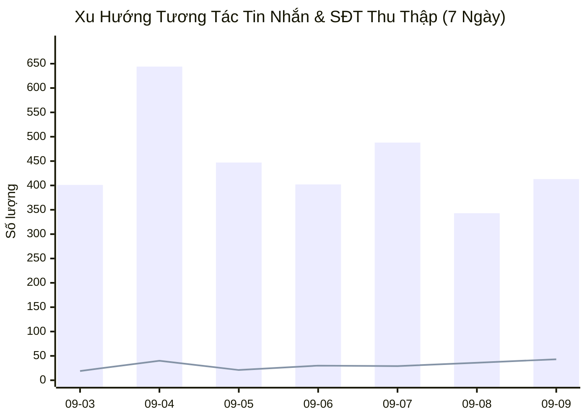
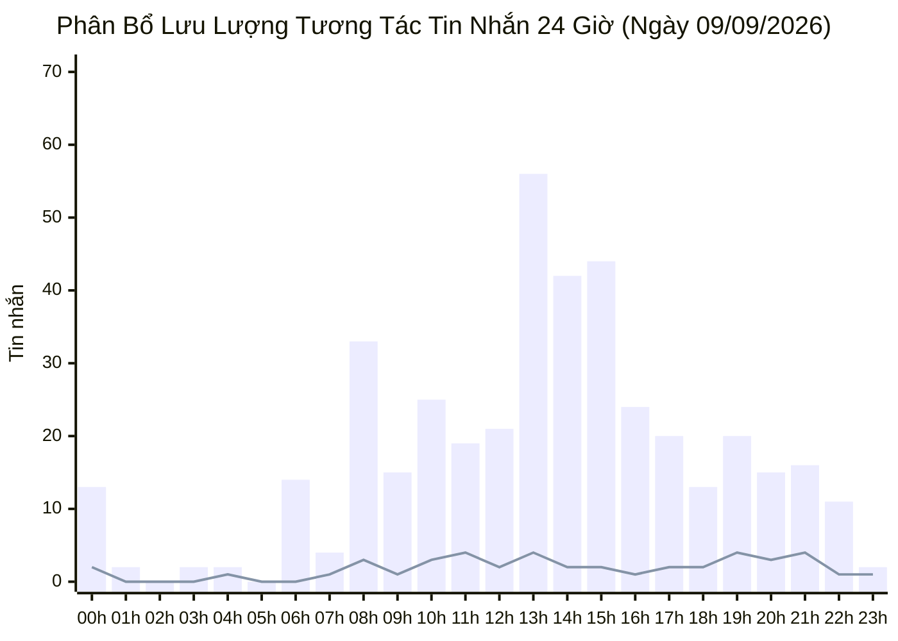

  

    PANCAKE OMNICHANNEL AUDIT & PERFORMANCE INTELLIGENCE
  

  <h1 style="margin: 4px 0 10px 0; color: white; border: none; padding: 0; font-size: 26px; font-weight: 800;">
    📊 BÁO CÁO HIỆU SUẤT VẬN HÀNH ĐA KÊNH PANCAKE (NGÀY 09/09/2026)
  </h1>
  

    Dữ liệu kiểm toán vận hành và phân tích chuyển đổi toàn diện trên 10 kênh tương tác thuộc Hệ sinh thái Viện Dinh Dưỡng NERCI & H&H Nutrition
  

  

    📅 <strong>Ngày Báo Cáo:</strong> 09/09/2026 (00:00 - 23:59 GMT+7 · Thứ Tư)
    👤 <strong>Người Báo Cáo:</strong> Đại Dương (Performance & Operations)
    💬 <strong>Tổng Khách Mới:</strong> 135
    📞 <strong>SĐT Thu Được:</strong> 43
    📈 <strong>Tỷ Lệ Thu SĐT:</strong> 9.09%
  

> [!abstract] TỔNG QUAN HIỆU SUẤT VẬN HÀNH NGÀY 09/09/2026
> Toàn bộ hệ thống 10 kênh ghi nhận **`473` lượt tương tác** (**`413` tin nhắn**, **`60` bình luận**), tiếp cận **`135` khách hàng mới**, và bóc tách thành công **`43` số điện thoại chất lượng** (tỷ lệ chuyển đổi SĐT/tương tác đạt **`9.09%`**):
> - **Duy Trì Đà Tăng Trưởng 43 SĐT:** Tỷ lệ chốt SĐT đạt 9.09%, giữ vững hiệu quả đầu tư quảng cáo.
> - **NERCI Academy Đóng Góp 22 SĐT:** Tuyển sinh K20 chiếm 51.2% tổng số lead toàn viện.

## 🌐 I. TỔNG HỢP HIỆU SUẤT VẬN HÀNH ĐA KÊNH
### 📊 1. Xu Hướng Tương Tác 7 Ngày Gần Nhất

### 📑 2. Bảng Theo Dõi Xu Hướng 7 Ngày Vận Hành
| Ngày | Tin Nhắn Khách | Bình Luận | Khách Hàng Mới | SĐT Thu Thập | Tỷ Lệ Thu SĐT | Ghi Chú Vận Hành |
| :---: | :---: | :---: | :---: | :---: | :---: | :--- |
| **03/09** | 401 | 113 | 155 | **19** | **3.70%** | Bình thường |
| **04/09** | 644 | 211 | 315 | **40** | **4.68%** | 🔥 Kỷ lục toàn diện 40 SĐT — Bứt phá K20 & H&H |
| **05/09** | 447 | 120 | 176 | **21** | **3.70%** | ⚖️ Thứ Bảy ổn định (21 SĐT, 446 inboxes) |
| **06/09** | 402 | 591 | 302 | **30** | **3.02%** | 🏆 Chủ Nhật viral TikTok (568 cmt) & 30 SĐT |
| **07/09** | 488 | 62 | 138 | **29** | **5.27%** | 🚀 Thứ Hai đầu tuần — Bứt phá 26 lead Academy K20 (29 SĐT) |
| **08/09** | 343 | 64 | 115 | **36** | **8.85%** | 🔥 Thứ Ba — Tỷ lệ chốt SĐT cao (36 SĐT · CR 8.96%) |
| **09/09** | 413 | 60 | 135 | **43** | **9.09%** | 🚀 **THỨ TƯ BỨT PHÁ: 43 SĐT (ACADEMY K20 ĐÓNG GÓP 22 SĐT)** |

### 📑 3. Bảng Xếp Hạng Hiệu Quả Tác Nghiệp 10 Kênh
| STT | Kênh / Fanpage | Nền Tảng | Tin Nhắn (Inbox) | Bình Luận (Comment) | Khách Hàng Mới | SĐT Bóc Tách | Tỷ Lệ Thu SĐT (CR) | Trạng Thái & Đánh Giá |
| :---: | :--- | :---: | :---: | :---: | :---: | :---: | :---: | :--- |
| **1** | **NERCI - Viện Tư Vấn Dinh Dưỡng** | `facebook` | **138** | **9** | 41 | **10** | **6.80%** | 🟢 **Lưu lượng hàng đầu** (138 inboxes, 10 SĐT) |
| **2** | **H&H Nutrition - Sản phẩm dinh dưỡng y học** | `facebook` | **93** | **5** | 24 | **6** | **6.12%** | 🟢 **Đơn hàng dinh dưỡng y học** (6 SĐT) |
| **3** | **NERCI Academy - Đào Tạo Chuyên Gia Dinh Dưỡng** | `facebook` | **81** | **0** | 22 | **22** | **27.16%** | 🔥 **Tuyển sinh xuất sắc** (22 SĐT) |
| **4** | **BS Hùng Dinh Dưỡng - NERCI** | `tiktok` | **24** | **46** | 28 | **2** | **2.86%** | ⚠️ **Viral mạnh (46 cmt), cần nhân sự trực chat** |
| **5** | **NERCI.vn - Viện Nghiên Cứu và Tư Vấn Dinh Dưỡng** | `facebook` | **48** | **0** | 9 | **2** | **4.17%** | ⚪ Hỗ trợ vận hành |
| **6** | **H&H - Dinh dưỡng tối ưu** | `zalo` | **15** | **0** | 5 | **0** | **0.00%** | 🟢 **Zalo OA ổn định** |
| **7** | **H&H** | `pke_chat_plugin` | **7** | **0** | 3 | **1** | **14.29%** | ⚪ Hỗ trợ vận hành |
| **8** | **Viện Nghiên cứu & Tư vấn dinh dưỡng** | `zalo` | **7** | **0** | 3 | **0** | **0.00%** | ⚪ Hỗ trợ vận hành |
| **9** | **Cộng đồng Bác sĩ Dinh Dưỡng Việt Nam** | `facebook` | **0** | **0** | 0 | **0** | **0.00%** | ⚪ Hỗ trợ vận hành |
| **10** | **Nerci** | `pke_chat_plugin` | **0** | **0** | 0 | **0** | **0.00%** | ⚪ Hỗ trợ vận hành |

## ⏰ II. PHÂN BỔ TƯƠNG TÁC THEO KHUNG GIỜ (24 GIỜ)

## 🏷️ III. PHÂN TÍCH NHÃN HỘI THOẠI & PHỄU CHUYỂN ĐỔI (TAG ANALYTICS)
| Mã Nhãn (Tag) | Tên Diễn Giải Chuẩn | Số Lượng Ca | Tỷ Trọng (%) | Định Hướng Vận Hành & Chăm Sóc |
| :--- | :--- | :---: | :---: | :--- |
| `tag_19` | **Chưa phản hồi (Ngưng chat)** | **88** | `53.7%` | 🔴 **Ngưng chat:** Cần remarketing Zalo/SMS sau 24h |
| `tag_24` | **F_Tham Khảo (Chưa có nhu cầu ngay)** | **24** | `14.6%` | 🟡 **Hỏi giá tham khảo:** Gửi cẩm nang thực đơn và ưu đãi combo |
| `tag_18` | **Spam / Rác** | **13** | `7.9%` | Phân loại tác nghiệp |
| `tag_29` | **Trùng lặp** | **12** | `7.3%` | Phân loại tác nghiệp |
| `tag_21` | **F_Kinh Tế (Rào cản tài chính)** | **7** | `4.3%` | 🔴 **Rào cản giá:** Đề xuất trả góp hoặc combo tiết kiệm |
| `tag_69` | **F_Suy nghĩ thêm** | **5** | `3.0%` | Phân loại tác nghiệp |
| `tag_30` | **Chốt đơn / Khám thành công** | **4** | `2.4%` | 🟢 **Chốt đơn / Khám thành công:** Chuyển sang quy trình giao hàng / hẹn khám |
| `tag_26` | **F_Sắp xếp thời gian** | **3** | `1.8%` | Phân loại tác nghiệp |
| `tag_27` | **F_Không tồn tại / Khóa máy** | **2** | `1.2%` | Phân loại tác nghiệp |
| `tag_25` | **F_Hỏi ý kiến người thân** | **1** | `0.6%` | Phân loại tác nghiệp |
| `tag_66` | **F_Chưa có quyết định** | **1** | `0.6%` | Phân loại tác nghiệp |
| `tag_68` | **F_Vướng thanh toán** | **1** | `0.6%` | Phân loại tác nghiệp |
| `tag_63` | **Thuê bao** | **1** | `0.6%` | Phân loại tác nghiệp |
| `tag_62` | **KBM (Không bắt máy)** | **1** | `0.6%` | Phân loại tác nghiệp |
| `tag_65` | **F_Đang dùng sản phẩm khác** | **1** | `0.6%` | Phân loại tác nghiệp |

---
### ⚠️ TUYÊN BỐ MIỄN TRỪ TRÁCH NHIỆM (DISCLAIMER)
*Báo cáo này được trích xuất tự động và độc lập từ Pancake API kết nối trực tiếp với 10 kênh tương tác của Viện Nghiên cứu & Tư vấn Dinh dưỡng NERCI và H&H Nutrition. Dữ liệu phản ánh toàn bộ hoạt động thực tế từ 00:00 đến 23:59 ngày 09/09/2026.*