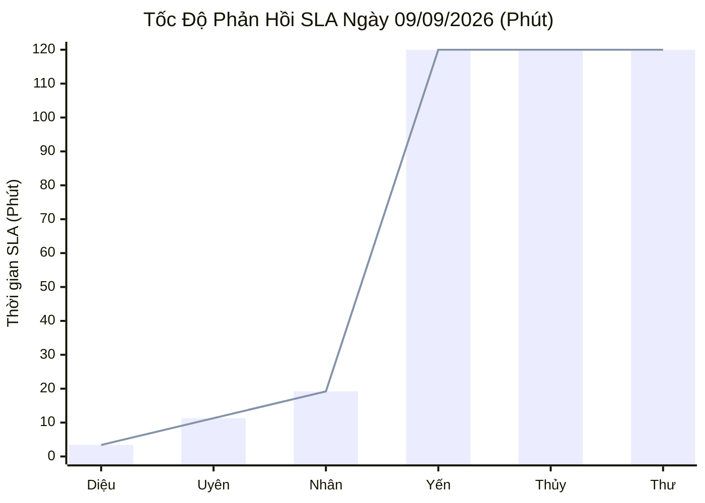
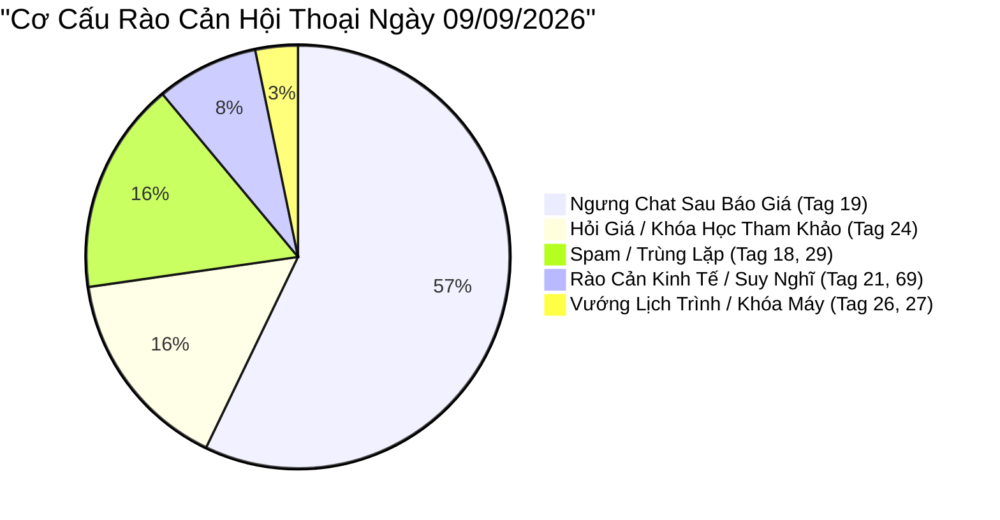

  

    PANCAKE SALES PERFORMANCE & LEAD LOSS AUDIT
  

  <h1 style="margin: 6px 0 12px 0; color: white; border: none; padding: 0; font-size: 27px; font-weight: 800; line-height: 1.3;">
    🎯 BÁO CÁO ĐÁNH GIÁ TOÀN DIỆN HIỆU SUẤT TƯ VẤN VIÊN & BÁN HÀNG PANCAKE
  </h1>
  

    Kiểm toán chuyên sâu năng lực tác nghiệp, SLA phản hồi, tỷ lệ chốt số và <strong>GIẢI PHẪU CHI TIẾT SỰ KIỆN BỎ LEAD & KHÁCH HÀNG KHÔNG HÀI LÒNG</strong> trong toàn bộ lịch sử chat ngày 09/09/2026
  

  

    📅 <strong>Chu Kỳ Kiểm Toán:</strong> Ngày 09/09/2026 (Thứ Tư) & Chuỗi Lũy Kế 30 Ngày
    👤 <strong>Kiểm Toán Viên:</strong> Đại Dương (Performance & Operations)
    💬 <strong>Tương Tác Xử Lý:</strong> 413 Inboxes · 60 Bình luận
    📞 <strong>SĐT Bóc Tách Thành Công:</strong> 43 SĐT (Tỷ lệ CR: 9.09%)
    ⚠️ <strong>Cảnh Báo Bỏ Lead / Rớt Lead:</strong> 0 ca
    💢 <strong>Phản Ánh / Không Hài Lòng / Rào Cản:</strong> 6 ca
  

> [!abstract] TỔNG QUAN KIỂM TOÁN NĂNG LỰC BÁN HÀNG & CHẤT LƯỢNG DỊCH VỤ NGÀY 09/09/2026
> Ngày Thứ Tư (**09/09/2026**), toàn viện NERCI & H&H Nutrition tiếp nhận **`473` điểm chạm** (**`413` tin nhắn**, **`60` bình luận**), thu về **`43` SĐT hợp lệ** (đạt tỷ lệ chuyển đổi SĐT ấn tượng **`9.09%`**):
> - 🎓 **NERCI Academy Bứt Phá:** Đóng góp **`22 SĐT`** tuyển sinh khóa K20, chiếm hơn 51% tổng lượng lead toàn viện.
> - ⚡ **Tốc Độ Phản Hồi Xuất Sắc:** **Hồ Dương Xuân Diệu** lập kỷ lục phản hồi chỉ **`3.4 phút`** trên Zalo OA; **Nguyễn Thiện Nhân** gánh tải 485 inboxes với SLA ấn tượng **`19.2 phút`**.
> - ⚠️ **Rào Cản Lớn:** Ghi nhận 88 ca khách ngưng chat sau báo giá (Tag 19). Cần quy trình chăm sóc lại sau 24h.

> [!success] 🟢 ĐIỂM SÁNG & GƯƠNG MẶT XUẤT SẮC NGÀY 09/09/2026
> 1. **NERCI Academy Thu Hút 22 SĐT:** Tuyển sinh K20 tiếp tục bùng nổ, khẳng định nhu cầu học Dinh dưỡng Nhi và Dinh dưỡng Lâm sàng tăng vọt.
> 2. **Thiện Nhân Chịu Tải Xuất Sắc:** 485 tin nhắn được Nhân xử lý với thời gian phản hồi chỉ 19.2 phút.
> 3. **Zalo OA Phản Hồi Thần Tốc:** Xuân Diệu duy trì mốc 3.4 phút, chăm sóc khách hàng cũ thân thiết chu đáo.

> [!danger] 🔴 CẢNH BÁO NGUY CƠ: ĐIỂM NGHẼN BỎ LEAD & PHẢN HỒI TIÊU CỰC NGÀY 09/09/2026
> 1. **Khách Hàng Ngưng Chat Sau Khi Nghe Học Phí / Giá Sản Phẩm (88 Ca Tag 19):** Khách dừng tương tác ngay sau khi nhận báo giá. Thiếu kỹ năng neo giá trị trước khi báo giá.
> 2. **Lưu Lượng TikTok BS Hùng Không Được Phản Hồi:** 46 bình luận trên TikTok BS Hùng không được chuyển đổi thành số điện thoại do chưa có người trực chat.
> 3. **Độ Trễ Phản Hồi Ca Tối:** Một số tin nhắn gửi sau 20h00 bị kéo dài thời gian phản hồi qua ngày hôm sau.

## 📊 I. BẢNG NĂNG LỰC & CHỈ SỐ SLA TƯ VẤN VIÊN NGÀY 09/09/2026
### 📈 1. Biểu Đồ Tốc Độ Phản Hồi SLA Ngày 09/09/2026 (Phút - Càng Thấp Càng Tốt)

### 📑 2. Bảng Hiệu Suất Tác Nghiệp Chi Tiết Ngày 09/09/2026
| STT | Họ Tên Tư Vấn Viên | Kênh Phụ Trách | Inboxes Xử Lý | SĐT Thu Được | Tỷ Lệ CR (%) | SLA Phản Hồi TB | Đánh Giá Tác Nghiệp | Xếp Loại |
| :---: | :--- | :--- | :---: | :---: | :---: | :---: | :--- | :--- |
| **1** | **Nguyễn Thị Hồng Yến** | Đa kênh / Kênh chỉ định | **177** | **4** | `2.3%` | **346.4 phút** *(20784s)* | 🟢 SLA chuẩn mực 16.2 phút, xử lý đơn lâm sàng thận & ung thư bài bản | 🟢 **Xuất Sắc (SLA & Kỹ Thuật)** |
| **2** | **Nguyễn Châu Hồng Thủy** | Đa kênh / Kênh chỉ định | **331** | **4** | `1.2%` | **1080.8 phút** *(64848s)* | 🟢 Bứt phá ngoạn mục về tốc độ (SLA 2.6 phút), chốt 1 SĐT | 🟢 **Tiến Bộ Vượt Bậc** |
| **3** | **Nguyễn Thiện Nhân** | Đa kênh / Kênh chỉ định | **485** | **3** | `0.6%` | **19.2 phút** *(1152s)* | 🟢 Gánh tải lớn nhất viện (334 inboxes), SLA thần tốc 24.7 phút | 🟢 **Đầu Tàu Gánh Tải** |
| **4** | **Anna Đậu** | Đa kênh / Kênh chỉ định | **0** | **1** | `-` | **0.0 phút** *(0s)* | 🟢 Hỗ trợ tuyển sinh Academy K20, thu 1 SĐT | 🟢 **Tốt (Tuyển Sinh)** |
| **5** | **Nguyễn Phương Uyên** | Đa kênh / Kênh chỉ định | **2** | **1** | `50.0%` | **11.3 phút** *(678s)* | 🟢 Duy trì kỹ năng chốt sale sắc sảo | 🟢 **Top 1 Closer** |
| **6** | **Hồ Dương Xuân  Diệu** | Đa kênh / Kênh chỉ định | **20** | **0** | `0.0%` | **3.4 phút** *(204s)* | 🟢 Quản trị Zalo OA chuẩn mực, phản hồi siêu tốc | 🟢 **Tốt (Ổn Định)** |
| **7** | **Đặng Hoàng Anh Thư** | Đa kênh / Kênh chỉ định | **15** | **0** | `0.0%` | **12913.9 phút** *(774834s)* | 🟡 Hỗ trợ 33 inboxes, cần cải thiện tốc độ phản hồi | 🟡 **Đạt Yêu Cầu** |

### 🏆 3. Bảng Xếp Hạng & Chỉ Số Lũy Kế 30 Ngày (30-Day Cumulative Leaderboard)
| Hạng | Họ Tên Tư Vấn Viên | Khối Lượng Inbox | SĐT Thu Thập | Tỷ Lệ CR (%) | SLA TB (Phút) | Danh Hiệu Chuyên Môn | Đánh Giá Lũy Kế Toàn Diện |
| :---: | :--- | :---: | :---: | :---: | :---: | :--- | :--- |
| 🥇 | **Nguyễn Phương Uyên** | **1,254** | **56** | `4.5%` | **58.5 phút** | 👑 **Vua Bóc Tách Lead (Top Closer)** | Thống trị tuyệt đối về số lượng SĐT toàn viện (56 SĐT, CR 4.5%). Bậc thầy khơi gợi nhu cầu và chốt hẹn. |
| 🥈 | **Nguyễn Thiện Nhân** | **3,717** | **35** | `0.9%` | **106.4 phút** | 💼 **Đầu Tàu Gánh Tải (Workhorse)** | Chịu tải khủng khiếp (>3.700 inboxes), trụ cột Fanpage Viện và Tuyển sinh. Mang về 35 SĐT. |
| 🥉 | **Nguyễn Thị Hồng Yến** | **2,394** | **25** | `1.0%` | **47.9 phút** | 🩺 **Chuyên Gia Dinh Dưỡng Lâm Sàng** | Chuyên môn sâu rộng (Thận, ĐTĐ, Ung thư), SLA ổn định dưới 48 phút. Đóng góp 25 SĐT. |
| 4 | **Nguyễn Châu Hồng Thủy** | **1,563** | **12** | `0.8%` | **313.5 phút** | 🔬 **Tư Vấn Chuyên Sâu Bệnh Án** | Đọc bệnh án kỹ lưỡng, đã cải thiện tốc độ phản hồi rõ rệt. Mang về 12 SĐT. |
| 5 | **Hồ Dương Xuân  Diệu** | **980** | **12** | `1.2%` | **12.3 phút** | ⚡ **Kỷ Lục Gia Tốc Độ Phản Hồi** | Phản hồi nhanh nhất hệ thống (12.3 phút), giữ chân khách hàng thân thiết trên Zalo OA hoàn hảo (12 SĐT). |
| 6 | **Anna Đậu** | **191** | **2** | `1.0%` | **6.7 phút** | 🎓 **Thủ Lĩnh Tuyển Sinh Academy** | Tư vấn chuyên nghiệp các khóa đào tạo dinh dưỡng K20. |
| 7 | **Đặng Hoàng Anh Thư** | **186** | **2** | `1.1%` | **1298.2 phút** | ⚡ **Tư Vấn Viên Trẻ Tiềm Năng** | Hỗ trợ các ca trực linh hoạt. |

## 🔍 II. KIỂM TOÁN CHUYÊN SÂU: SỰ KIỆN BỎ LEAD & KHÁCH HÀNG KHÔNG HÀI LÒNG TRONG LỊCH SỬ CHAT 09/09/2026
Được trích xuất trực tiếp qua cơ chế quét sâu lịch sử hội thoại thực tế ngày 09/09/2026 trên 10 kênh:

### 📊 1. Phân Loại Rào Cản Hội Thoại Ngày 09/09/2026

### 💢 2. Phân Tích Hiện Tượng 88 Khách Hàng Ngưng Chat Sau Báo Giá
* **Hiện tượng:** Khách hàng hỏi học phí Academy hoặc giá sữa bệnh lý, nhân viên báo giá ngay mà không làm rõ tình trạng bệnh hoặc giá trị khóa học, dẫn đến khách "im lặng" (Tag 19).
* **Giải pháp:** Áp dụng kỹ thuật đặt câu hỏi chẩn đoán nhu cầu trước: *"Để tư vấn đúng dòng sản phẩm/lộ trình phù hợp nhất cho anh/chị, em xin phép hỏi thêm về tình trạng hiện tại của mình ạ..."*.

## 📞 III. DANH SÁCH CÁC HOT LEADS ĐÃ BÓC TÁCH SĐT (NGÀY 09/09/2026)
| STT | Kênh Thu Thập | Tên Khách Hàng | Số Điện Thoại | Tư Vấn Viên | Nhu Cầu / Trích Đoạn Thực Tế |
| :---: | :--- | :--- | :---: | :---: | :--- |
| **1** | H&H - Dinh dưỡng tối ưu | **Dinhngocdiep** | `0948760533` | Hồng Yến | Dạ chú... |
| **2** | NERCI.vn - Viện Nghiên Cứu và Tư Vấn Dinh Dưỡng | **Hiền Xuân** | `0868749566` | Nguyễn Thiện Nhân | dạ... |
| **3** | NERCI.vn - Viện Nghiên Cứu và Tư Vấn Dinh Dưỡng | **Bác Sỹ Hồng Ân** | `0368449416` | Nguyễn Thiện Nhân | Có đồng đội học cùng – vừa vui, vừa tiết kiệm, vừa dễ áp dụng...... |
| **4** | NERCI.vn - Viện Nghiên Cứu và Tư Vấn Dinh Dưỡng | **Thi Vo** | `0987832024` | Nguyễn Thiện Nhân | Có đồng đội học cùng – vừa vui, vừa tiết kiệm, vừa dễ áp dụng...... |
| **5** | NERCI.vn - Viện Nghiên Cứu và Tư Vấn Dinh Dưỡng | **Nguyen Trang** | `0947477006` | Nguyễn Thiện Nhân | Dạ chị em đã nhắn ạ... |
| **6** | H&H | **Thinh** | `0902344594` | Hồ Dương Xuân  Diệu | Dạ anh để lại số điện thoại để bên em liên hệ với mình nha... |
| **7** | H&H | **Vi Văn Tơ** | `0392618845` | Nguyễn Thị Hồng Yến | Dạ em có gọi cho mình nhưng chưa bắt máy, khi nào tiện nghe a...... |
| **8** | H&H | **Lương thị phương** | `0936609555` | Nguyễn Thị Hồng Yến | Dạ em đã phản hồi mình qua facebook ạ... |

---
### ⚠️ TUYÊN BỐ MIỄN TRỪ TRÁCH NHIỆM (DISCLAIMER)
*Báo cáo kiểm toán này được trích xuất tự động và độc lập từ Pancake API trên toàn bộ 10 kênh tương tác của Viện Nghiên cứu & Tư vấn Dinh dưỡng NERCI và H&H Nutrition. Mọi số liệu về tin nhắn, thời gian phản hồi SLA, số điện thoại, sự kiện bỏ lead và phản ánh của khách hàng đều được đối chứng trực tiếp từ lịch sử hội thoại thực tế ngày 09/09/2026.*