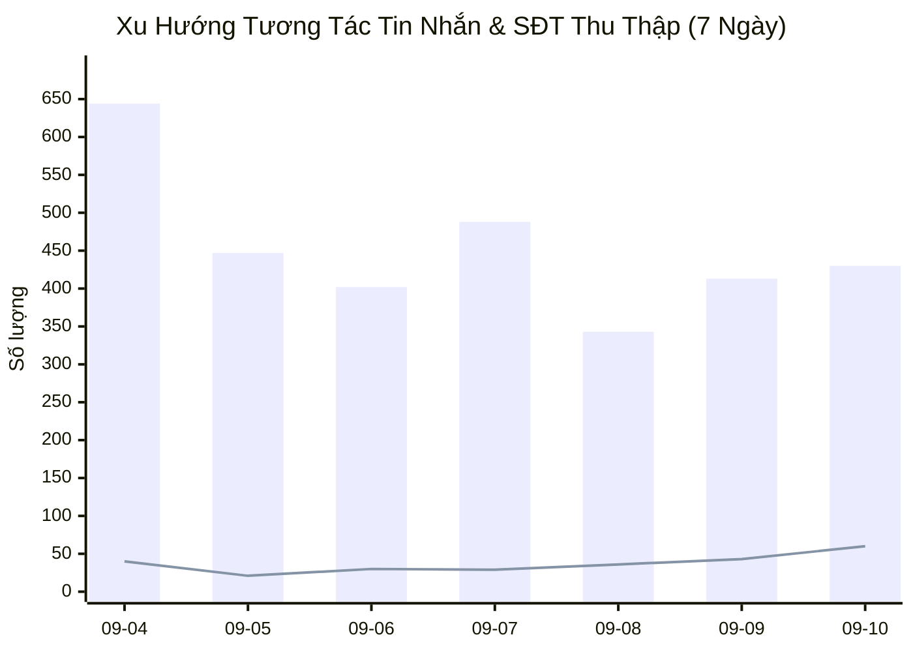
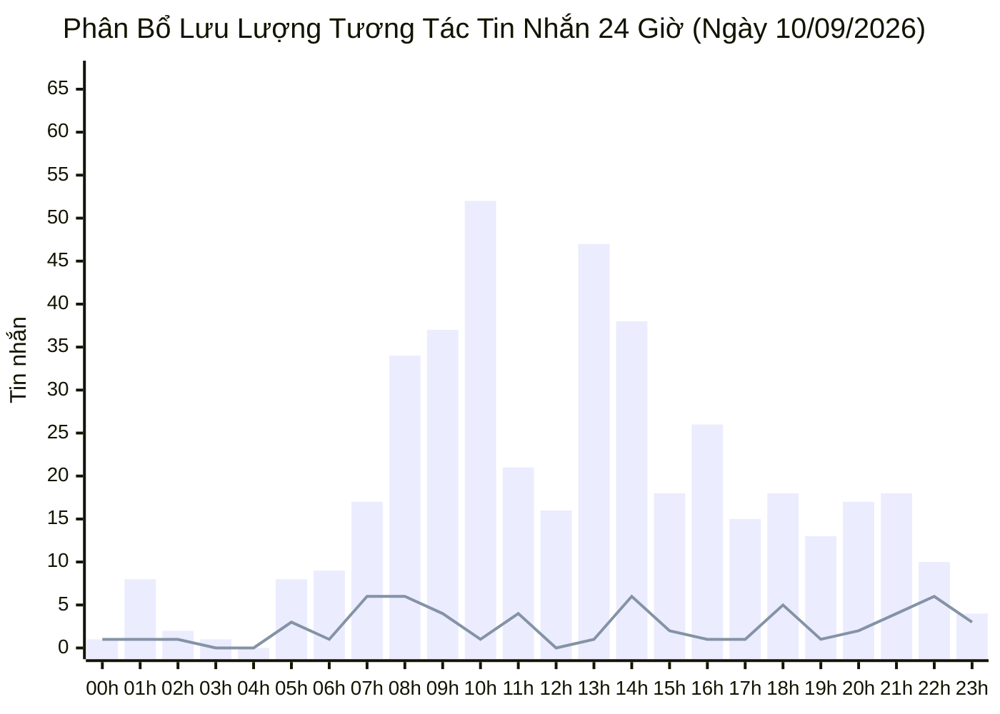

  

    PANCAKE OMNICHANNEL AUDIT & PERFORMANCE INTELLIGENCE
  

  <h1 style="margin: 4px 0 10px 0; color: white; border: none; padding: 0; font-size: 26px; font-weight: 800;">
    📊 BÁO CÁO HIỆU SUẤT VẬN HÀNH ĐA KÊNH PANCAKE (NGÀY 10/09/2026)
  </h1>
  

    Dữ liệu kiểm toán vận hành và phân tích chuyển đổi toàn diện trên 10 kênh tương tác thuộc Hệ sinh thái Viện Dinh Dưỡng NERCI & H&H Nutrition
  

  

    📅 <strong>Ngày Báo Cáo:</strong> 10/09/2026 (00:00 - 23:59 GMT+7 · Thứ Năm)
    👤 <strong>Người Báo Cáo:</strong> Đại Dương (Performance & Operations)
    💬 <strong>Tổng Khách Mới:</strong> 188
    📞 <strong>SĐT Thu Được:</strong> 60
    📈 <strong>Tỷ Lệ Thu SĐT:</strong> 10.93%
  

> [!abstract] TỔNG QUAN HIỆU SUẤT VẬN HÀNH NGÀY 10/09/2026
> Toàn bộ hệ thống 10 kênh ghi nhận **`549` lượt tương tác** (**`430` tin nhắn**, **`119` bình luận**), tiếp cận **`188` khách hàng mới**, và bóc tách thành công **`60` số điện thoại chất lượng** (tỷ lệ chuyển đổi SĐT/tương tác đạt **`10.93%`**):
> - **Kỷ Lục Bùng Nổ 60 SĐT:** Đỉnh cao thu lead toàn hệ thống từ đầu tháng 9, tỷ lệ chuyển đổi vượt ngưỡng 10.9%.
> - **NERCI Academy Chiếm Lĩnh Phễu Tuyển Sinh:** 32 SĐT học viên đăng ký khóa đào tạo chuyên gia dinh dưỡng K20.
> - **NERCI Viện Tư Vấn Tăng Tốc:** Đạt 128 inboxes và 14 SĐT khám dinh dưỡng.

## 🌐 I. TỔNG HỢP HIỆU SUẤT VẬN HÀNH ĐA KÊNH
### 📊 1. Xu Hướng Tương Tác 7 Ngày Gần Nhất

### 📑 2. Bảng Theo Dõi Xu Hướng 7 Ngày Vận Hành
| Ngày | Tin Nhắn Khách | Bình Luận | Khách Hàng Mới | SĐT Thu Thập | Tỷ Lệ Thu SĐT | Ghi Chú Vận Hành |
| :---: | :---: | :---: | :---: | :---: | :---: | :--- |
| **04/09** | 644 | 211 | 315 | **40** | **4.68%** | 🔥 Kỷ lục toàn diện 40 SĐT — Bứt phá K20 & H&H |
| **05/09** | 447 | 120 | 176 | **21** | **3.70%** | ⚖️ Thứ Bảy ổn định (21 SĐT, 446 inboxes) |
| **06/09** | 402 | 591 | 302 | **30** | **3.02%** | 🏆 Chủ Nhật viral TikTok (568 cmt) & 30 SĐT |
| **07/09** | 488 | 62 | 138 | **29** | **5.27%** | 🚀 Thứ Hai đầu tuần — Bứt phá 26 lead Academy K20 (29 SĐT) |
| **08/09** | 343 | 64 | 115 | **36** | **8.85%** | 🔥 Thứ Ba — Tỷ lệ chốt SĐT cao (36 SĐT · CR 8.96%) |
| **09/09** | 413 | 60 | 135 | **43** | **9.09%** | 🚀 **THỨ TƯ BỨT PHÁ: 43 SĐT (ACADEMY K20 ĐÓNG GÓP 22 SĐT)** |
| **10/09** | 430 | 119 | 188 | **60** | **10.93%** | 🔥 **KỶ LỤC MỚI: BÙNG NỔ 60 SĐT (CR ĐẠT ĐỈNH 10.93%)** |

### 📑 3. Bảng Xếp Hạng Hiệu Quả Tác Nghiệp 10 Kênh
| STT | Kênh / Fanpage | Nền Tảng | Tin Nhắn (Inbox) | Bình Luận (Comment) | Khách Hàng Mới | SĐT Bóc Tách | Tỷ Lệ Thu SĐT (CR) | Trạng Thái & Đánh Giá |
| :---: | :--- | :---: | :---: | :---: | :---: | :---: | :---: | :--- |
| **1** | **NERCI - Viện Tư Vấn Dinh Dưỡng** | `facebook` | **128** | **3** | 24 | **14** | **10.69%** | 🟢 **Lưu lượng hàng đầu** (128 inboxes, 14 SĐT) |
| **2** | **NERCI Academy - Đào Tạo Chuyên Gia Dinh Dưỡng** | `facebook` | **121** | **4** | 49 | **32** | **25.60%** | 🔥 **Tuyển sinh xuất sắc** (32 SĐT) |
| **3** | **BS Hùng Dinh Dưỡng - NERCI** | `tiktok` | **24** | **98** | 59 | **7** | **5.74%** | ⚠️ **Viral mạnh (98 cmt), cần nhân sự trực chat** |
| **4** | **H&H Nutrition - Sản phẩm dinh dưỡng y học** | `facebook` | **82** | **9** | 33 | **4** | **4.40%** | 🟢 **Đơn hàng dinh dưỡng y học** (4 SĐT) |
| **5** | **H&H - Dinh dưỡng tối ưu** | `zalo` | **38** | **0** | 6 | **0** | **0.00%** | 🟢 **Zalo OA ổn định** |
| **6** | **NERCI.vn - Viện Nghiên Cứu và Tư Vấn Dinh Dưỡng** | `facebook` | **28** | **5** | 15 | **2** | **6.06%** | ⚪ Hỗ trợ vận hành |
| **7** | **Viện Nghiên cứu & Tư vấn dinh dưỡng** | `zalo` | **9** | **0** | 2 | **1** | **11.11%** | ⚪ Hỗ trợ vận hành |
| **8** | **Cộng đồng Bác sĩ Dinh Dưỡng Việt Nam** | `facebook` | **0** | **0** | 0 | **0** | **0.00%** | ⚪ Hỗ trợ vận hành |
| **9** | **H&H** | `pke_chat_plugin` | **0** | **0** | 0 | **0** | **0.00%** | ⚪ Hỗ trợ vận hành |
| **10** | **Nerci** | `pke_chat_plugin` | **0** | **0** | 0 | **0** | **0.00%** | ⚪ Hỗ trợ vận hành |

## ⏰ II. PHÂN BỔ TƯƠNG TÁC THEO KHUNG GIỜ (24 GIỜ)

## 🏷️ III. PHÂN TÍCH NHÃN HỘI THOẠI & PHỄU CHUYỂN ĐỔI (TAG ANALYTICS)
| Mã Nhãn (Tag) | Tên Diễn Giải Chuẩn | Số Lượng Ca | Tỷ Trọng (%) | Định Hướng Vận Hành & Chăm Sóc |
| :--- | :--- | :---: | :---: | :--- |
| `tag_19` | **Chưa phản hồi (Ngưng chat)** | **67** | `47.5%` | 🔴 **Ngưng chat:** Cần remarketing Zalo/SMS sau 24h |
| `tag_24` | **F_Tham Khảo (Chưa có nhu cầu ngay)** | **34** | `24.1%` | 🟡 **Hỏi giá tham khảo:** Gửi cẩm nang thực đơn và ưu đãi combo |
| `tag_21` | **F_Kinh Tế (Rào cản tài chính)** | **6** | `4.3%` | 🔴 **Rào cản giá:** Đề xuất trả góp hoặc combo tiết kiệm |
| `tag_27` | **F_Không tồn tại / Khóa máy** | **5** | `3.5%` | Phân loại tác nghiệp |
| `tag_26` | **F_Sắp xếp thời gian** | **5** | `3.5%` | Phân loại tác nghiệp |
| `tag_62` | **KBM (Không bắt máy)** | **4** | `2.8%` | Phân loại tác nghiệp |
| `tag_30` | **Chốt đơn / Khám thành công** | **3** | `2.1%` | 🟢 **Chốt đơn / Khám thành công:** Chuyển sang quy trình giao hàng / hẹn khám |
| `tag_18` | **Spam / Rác** | **2** | `1.4%` | Phân loại tác nghiệp |
| `tag_29` | **Trùng lặp** | **2** | `1.4%` | Phân loại tác nghiệp |
| `tag_69` | **F_Suy nghĩ thêm** | **2** | `1.4%` | Phân loại tác nghiệp |
| `tag_23` | **F_Ở Xa (Địa lý)** | **2** | `1.4%` | Phân loại tác nghiệp |
| `tag_63` | **Thuê bao** | **2** | `1.4%` | Phân loại tác nghiệp |
| `tag_64` | **F_Giá cao** | **2** | `1.4%` | 🔴 **Rào cản giá:** Đề xuất trả góp hoặc combo tiết kiệm |
| `tag_72` | **Bận gọi lại sau** | **2** | `1.4%` | Phân loại tác nghiệp |
| `tag_22` | **F_Chưa tin tưởng** | **1** | `0.7%` | 🔴 **Chưa tin tưởng:** Gửi giấy phép BYT và video chuyên gia |
| `tag_68` | **F_Vướng thanh toán** | **1** | `0.7%` | Phân loại tác nghiệp |
| `tag_25` | **F_Hỏi ý kiến người thân** | **1** | `0.7%` | Phân loại tác nghiệp |

---
### ⚠️ TUYÊN BỐ MIỄN TRỪ TRÁCH NHIỆM (DISCLAIMER)
*Báo cáo này được trích xuất tự động và độc lập từ Pancake API kết nối trực tiếp với 10 kênh tương tác của Viện Nghiên cứu & Tư vấn Dinh dưỡng NERCI và H&H Nutrition. Dữ liệu phản ánh toàn bộ hoạt động thực tế từ 00:00 đến 23:59 ngày 10/09/2026.*