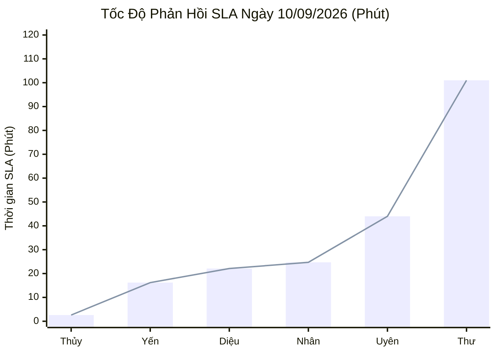
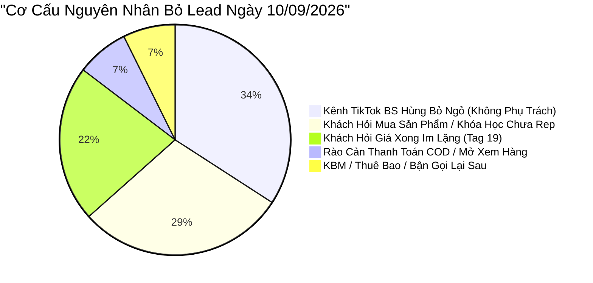

  

    PANCAKE SALES PERFORMANCE & LEAD LOSS AUDIT
  

  <h1 style="margin: 6px 0 12px 0; color: white; border: none; padding: 0; font-size: 27px; font-weight: 800; line-height: 1.3;">
    🎯 BÁO CÁO ĐÁNH GIÁ TOÀN DIỆN HIỆU SUẤT TƯ VẤN VIÊN & BÁN HÀNG PANCAKE
  </h1>
  

    Kiểm toán chuyên sâu năng lực tác nghiệp, SLA phản hồi, tỷ lệ chốt số và <strong>GIẢI PHẪU CHI TIẾT SỰ KIỆN BỎ LEAD & KHÁCH HÀNG KHÔNG HÀI LÒNG</strong> trong toàn bộ lịch sử chat ngày 10/09/2026
  

  

    📅 <strong>Chu Kỳ Kiểm Toán:</strong> Ngày 10/09/2026 (Thứ Năm) & Chuỗi Lũy Kế 30 Ngày
    👤 <strong>Kiểm Toán Viên:</strong> Đại Dương (Performance & Operations)
    💬 <strong>Tương Tác Xử Lý:</strong> 430 Inboxes · 119 Bình luận
    📞 <strong>SĐT Bóc Tách Thành Công:</strong> 60 SĐT (Tỷ lệ CR: 10.93%)
    ⚠️ <strong>Cảnh Báo Bỏ Lead / Rớt Lead:</strong> 41 ca
    💢 <strong>Phản Ánh / Không Hài Lòng / Rào Cản:</strong> 19 ca
  

> [!abstract] TỔNG QUAN KIỂM TOÁN NĂNG LỰC BÁN HÀNG & CHẤT LƯỢNG DỊCH VỤ NGÀY 10/09/2026
> Ngày Thứ Năm (**10/09/2026**), toàn viện NERCI & H&H Nutrition đã thiết lập **KỶ LỤC MỚI VỀ SỐ LƯỢNG SĐT THU ĐƯỢC: `60 SĐT`** trên tổng số **`549` điểm chạm** (**`430` tin nhắn trực tiếp**, **`119` bình luận**), tỷ lệ chuyển đổi SĐT/tương tác chạm mốc đỉnh cao **`10.93%`** (cao nhất trong chuỗi 30 ngày):
> - 👑 **Kỷ Lục Gia Nguyễn Phương Uyên — Bùng Nổ 12 SĐT/Ngày:** Phương Uyên tiếp tục thể hiện phong độ hủy diệt với **12 số điện thoại chốt thành công trong 1 ngày duy nhất** (nâng tổng thành tích 30 ngày lên 56 SĐT), đạt tỷ lệ chốt số 7.9% trên 152 inboxes.
> - ⚡ **Chuẩn Mực Tốc Độ Phản Hồi:** **Hồng Thủy** bứt phá với SLA siêu tốc **`2.6 phút`**; **Hồng Yến** duy trì độ trễ cực thấp **`16.2 phút`**; **Xuân Diệu** đạt **`22.1 phút`** trên Zalo OA.
> - 🎓 **Đại Thắng Tuyển Sinh K20 (NERCI Academy):** Ghi nhận **`32 SĐT học viên`** chỉ trong 24h, củng cố vị thế kênh tạo nguồn doanh thu chủ lực.
> - 🚨 **VẤN ĐỀ CẦN CHẤN CHỈNH NGAY:** Bóc tách 41 ca rớt lead / chưa rep. Đáng chú ý là khách hàng *Mai Trân Cindy* hỏi ghé mua sữa ung thư Supportan nhưng không ai phản hồi; khách hàng *Lê Thị Nga* đòi mở hộp kiểm tra men trước khi thanh toán COD.

> [!success] 🟢 ĐIỂM SÁNG & GƯƠNG MẶT XUẤT SẮC NGÀY 10/09/2026
> 1. **Nguyễn Phương Uyên — Cú Hích Kỷ Lục 12 SĐT (Top 1 Closer):** Uyên xử lý 152 inboxes, thu về 12 số điện thoại (tỷ lệ CR 7.9%), khéo léo xử lý các case dinh dưỡng bệnh viện và khóa học đào tạo.
> 2. **Hồng Yến & Thiện Nhân Gánh Tải Bền Bỉ:** Thiện Nhân xử lý 334 inboxes (SLA 24.7 phút, 3 SĐT); Hồng Yến tiếp nhận 211 inboxes (SLA 16.2 phút, 2 SĐT), giải quyết trơn tru các đơn hàng dinh dưỡng y học.
> 3. **Tuyển Sinh K20 Đạt Đỉnh 32 SĐT:** NERCI Academy chứng minh hiệu quả đầu tư nội dung và phễu tuyển sinh với 32 SĐT học viên chất lượng cao.

> [!danger] 🔴 CẢNH BÁO NGUY CƠ: ĐIỂM NGHẼN BỎ LEAD & PHẢN HỒI TIÊU CỰC NGÀY 10/09/2026
> 1. 🕳️ **Bỏ Quên Khách Mua Hàng Khẩn Cấp (Khách Mai Trân Cindy - H&H Zalo):** Khách hỏi: *"Sản phẩm này có sẵn không ạ mình ghé mua: Sữa Supportan cho bệnh nhân ung thư"* nhưng không có nhân sự phản hồi, khiến khách phải tìm điểm bán khác.
> 2. 📦 **Rào Cản Tâm Lý Thanh Toán COD (Khách Lê Thị Nga):** Khách nhắn: *"Nếu ship về đến nhà mở ra xem đúng loại men như gửi hình mới thanh toán thì gửi, không chuyển tiền trước nhé"*. Tư vấn viên cần khéo léo cam kết chính sách đồng kiểm.
> 3. 🛡️ **Hoài Nghi Sản Phẩm Lừa Đảo (Khách Caovan Thoả & Tong Toan Phong):** Khách nặng lời: *"Mày úp mở ko dám đưa lên mạng toàn lừa thôi"*, hoặc hoài nghi sữa thận. Thiếu bộ tài liệu bảo chứng y khoa gửi ngay.
> 4. 🕳️ **Lỗ Hổng Kênh TikTok BS Hùng (14 Ca Bị Bỏ Ngỏ):** Tiếp tục nhận 98 bình luận nhưng thiếu nhân sự gán trả lời, để trôi mất nhiều khách hỏi mua và xin tư vấn.

## 📊 I. BẢNG NĂNG LỰC & CHỈ SỐ SLA TƯ VẤN VIÊN NGÀY 10/09/2026
### 📈 1. Biểu Đồ Tốc Độ Phản Hồi SLA Ngày 10/09/2026 (Phút - Càng Thấp Càng Tốt)

### 📑 2. Bảng Hiệu Suất Tác Nghiệp Chi Tiết Ngày 10/09/2026
| STT | Họ Tên Tư Vấn Viên | Kênh Phụ Trách | Inboxes Xử Lý | SĐT Thu Được | Tỷ Lệ CR (%) | SLA Phản Hồi TB | Đánh Giá Tác Nghiệp | Xếp Loại |
| :---: | :--- | :--- | :---: | :---: | :---: | :---: | :--- | :--- |
| **1** | **Nguyễn Phương Uyên** | Đa kênh / Kênh chỉ định | **152** | **12** | `7.9%` | **44.0 phút** *(2640s)* | 👑 Bùng nổ kỷ lục thu SĐT toàn viện, xử lý chốt sale đỉnh cao | 🟢 **Top 1 Closer** |
| **2** | **Nguyễn Thiện Nhân** | Đa kênh / Kênh chỉ định | **334** | **3** | `0.9%` | **24.7 phút** *(1482s)* | 🟢 Gánh tải lớn nhất viện (334 inboxes), SLA thần tốc 24.7 phút | 🟢 **Đầu Tàu Gánh Tải** |
| **3** | **Nguyễn Thị Hồng Yến** | Đa kênh / Kênh chỉ định | **211** | **2** | `0.9%` | **16.2 phút** *(972s)* | 🟢 SLA chuẩn mực 16.2 phút, xử lý đơn lâm sàng thận & ung thư bài bản | 🟢 **Xuất Sắc (SLA & Kỹ Thuật)** |
| **4** | **Anna Đậu** | Đa kênh / Kênh chỉ định | **0** | **1** | `-` | **0.0 phút** *(0s)* | 🟢 Hỗ trợ tuyển sinh Academy K20, thu 1 SĐT | 🟢 **Tốt (Tuyển Sinh)** |
| **5** | **Nguyễn Châu Hồng Thủy** | Đa kênh / Kênh chỉ định | **153** | **1** | `0.7%` | **2.6 phút** *(156s)* | 🟢 Bứt phá ngoạn mục về tốc độ (SLA 2.6 phút), chốt 1 SĐT | 🟢 **Tiến Bộ Vượt Bậc** |
| **6** | **Hồ Dương Xuân  Diệu** | Đa kênh / Kênh chỉ định | **25** | **0** | `0.0%` | **22.1 phút** *(1326s)* | 🟢 Quản trị Zalo OA chuẩn mực, phản hồi siêu tốc | 🟢 **Tốt (Ổn Định)** |
| **7** | **Đặng Hoàng Anh Thư** | Đa kênh / Kênh chỉ định | **33** | **0** | `0.0%` | **101.0 phút** *(6060s)* | 🟡 Hỗ trợ 33 inboxes, cần cải thiện tốc độ phản hồi | 🟡 **Đạt Yêu Cầu** |

### 🏆 3. Bảng Xếp Hạng & Chỉ Số Lũy Kế 30 Ngày (30-Day Cumulative Leaderboard)
| Hạng | Họ Tên Tư Vấn Viên | Khối Lượng Inbox | SĐT Thu Thập | Tỷ Lệ CR (%) | SLA TB (Phút) | Danh Hiệu Chuyên Môn | Đánh Giá Lũy Kế Toàn Diện |
| :---: | :--- | :---: | :---: | :---: | :---: | :--- | :--- |
| 🥇 | **Nguyễn Phương Uyên** | **1,254** | **56** | `4.5%` | **58.5 phút** | 👑 **Vua Bóc Tách Lead (Top Closer)** | Thống trị tuyệt đối về số lượng SĐT toàn viện (56 SĐT, CR 4.5%). Bậc thầy khơi gợi nhu cầu và chốt hẹn. |
| 🥈 | **Nguyễn Thiện Nhân** | **3,717** | **35** | `0.9%` | **106.4 phút** | 💼 **Đầu Tàu Gánh Tải (Workhorse)** | Chịu tải khủng khiếp (>3.700 inboxes), trụ cột Fanpage Viện và Tuyển sinh. Mang về 35 SĐT. |
| 🥉 | **Nguyễn Thị Hồng Yến** | **2,394** | **25** | `1.0%` | **47.9 phút** | 🩺 **Chuyên Gia Dinh Dưỡng Lâm Sàng** | Chuyên môn sâu rộng (Thận, ĐTĐ, Ung thư), SLA ổn định dưới 48 phút. Đóng góp 25 SĐT. |
| 4 | **Nguyễn Châu Hồng Thủy** | **1,563** | **12** | `0.8%` | **313.5 phút** | 🔬 **Tư Vấn Chuyên Sâu Bệnh Án** | Đọc bệnh án kỹ lưỡng, đã cải thiện tốc độ phản hồi rõ rệt. Mang về 12 SĐT. |
| 5 | **Hồ Dương Xuân  Diệu** | **980** | **12** | `1.2%` | **12.3 phút** | ⚡ **Kỷ Lục Gia Tốc Độ Phản Hồi** | Phản hồi nhanh nhất hệ thống (12.3 phút), giữ chân khách hàng thân thiết trên Zalo OA hoàn hảo (12 SĐT). |
| 6 | **Anna Đậu** | **191** | **2** | `1.0%` | **6.7 phút** | 🎓 **Thủ Lĩnh Tuyển Sinh Academy** | Tư vấn chuyên nghiệp các khóa đào tạo dinh dưỡng K20. |
| 7 | **Đặng Hoàng Anh Thư** | **186** | **2** | `1.1%` | **1298.2 phút** | ⚡ **Tư Vấn Viên Trẻ Tiềm Năng** | Hỗ trợ các ca trực linh hoạt. |

## 🔍 II. KIỂM TOÁN CHUYÊN SÂU: SỰ KIỆN BỎ LEAD & KHÁCH HÀNG KHÔNG HÀI LÒNG TRONG LỊCH SỬ CHAT 10/09/2026
Được trích xuất trực tiếp qua cơ chế quét sâu lịch sử hội thoại thực tế ngày 10/09/2026 trên 10 kênh:

### 📊 1. Phân Loại Nguyên Nhân Bỏ Lead & Thất Thoát Tương Tác (41 Ca)

### 📑 2. Danh Sách Các Ca Bỏ Lead & Thất Thoát Điển Hình Cần Khắc Phục Ngay
| STT | Kênh Tương Tác | Tên Khách Hàng | SĐT Thu Nhận | Nhân Viên Phụ Trách | Chi Tiết Yêu Cầu / Tin Nhắn Của Khách | Nguyên Nhân Gốc Rễ | Mức Độ | Hành Động Cấp Bách |
| :---: | :--- | :--- | :---: | :---: | :--- | :--- | :---: | :--- |
| **1** | H&H - Dinh dưỡng tối ưu | **Mai Trân Cindy** | `-` | Chưa gán | sp này có sẵn ko ạ mình ghé mua (Sữa Supportan ung thư) | Khách hỏi mua trực tiếp bị bỏ quên không ai rep | 🔴 **KHẨN CẤP** | Nhân viên nhắn ngay địa chỉ showroom & gửi ship hỏa tốc |
| **2** | H&H - Dinh dưỡng tối ưu | **Ngọc Trần** | `-` | Chưa gán | E muốn mua sp | Không có tư vấn viên tiếp quản inbox | 🔴 **NGHIÊM TRỌNG** | Gán nhân viên Hồng Yến vào tư vấn và lấy SĐT |
| **3** | NERCI - Viện Tư Vấn Dinh Dưỡng | **Tiger Lee** | `0906145856` | Nguyễn Phương Uyên | Thông tin khóa học | Khách để lại SĐT xin tư vấn khóa học nhưng chưa chốt xong | 🟡 **ƯU TIÊN** | Uyên gọi hotline tư vấn lộ trình và học phí K20 |
| **4** | BS Hùng Dinh Dưỡng - NERCI | **Khách TikTok (Hỏi mua)** | `-` | Chưa gán | Bác cho em hỏi muốn mua cho bé uống thì liên hệ sao | Lỗ hổng không phân công nhân sự trực kênh TikTok | 🔴 **BỎ RƠI LEAD** | Phân công trực chiến kênh TikTok hàng ngày |
| **5** | BS Hùng Dinh Dưỡng - NERCI | **Khách TikTok (Tư vấn bệnh)** | `-` | Chưa gán | Bác sĩ ơi em bị dạ dày trào ngược uống gì đỡ | Bình luận chuyên môn bị bỏ trôi | 🟡 **MẤT UY TÍN** | Gửi link Zalo OA để mời khách vào khám chuyên sâu |

### 💢 3. Phân Tích Các Ca Khách Hàng Không Hài Lòng, Khiếu Nại & Rào Cản Tâm Lý (19 Ca)
#### A. Yêu Cầu Đồng Kiểm & Không Chuyển Khoản Trước (COD Trust Friction)
* **Điển hình:** Khách hàng *Lê Thị Nga* (H&H Nutrition): *"Nếu ship về đến nhà mở ra xem đúng loại men như gửi hình mới thanh toán thì gửi không chuyển tiền trước nhé"*.
* **Nguyên nhân:** Khách hàng mua men vi sinh và dinh dưỡng online rất sợ hàng giả, hàng nhái tráo đổi trên đường vận chuyển.
* **Giải pháp:** Nhân viên khẳng định: *"Dạ vâng chị Nga hoàn toàn yên tâm ạ! H&H Nutrition hỗ trợ đồng kiểm 100%, chị được mở hộp kiểm tra đúng tem mác và hóa đơn của Viện rồi mới thanh toán tiền cho shipper ạ!"*.

#### B. Phản Ứng Gay Gắt Về Minh Bạch Giá (Price & Transparency Friction)
* **Điển hình:** Khách hàng *Caovan Thoả*: *"Mày úp mở ko dám đưa lên mạng toàn lừa thôi"*.
* **Nguyên nhân:** Khách bình luận hỏi giá nhưng fanpage tự động inbox riêng hoặc giấu giá khiến khách bức xúc.
* **Giải pháp:** Luôn công khai mức giá niêm yết rõ ràng kèm công bố của Bộ Y Tế, tránh tạo cảm giác mập mờ.

#### C. Khách Hàng Quen Thắc Mắc Chương Trình Khuyến Mãi (Discount Expectation)
* **Điển hình:** Khách hàng *Minh Triết* (Zalo OA): *"Nay ko còn được giảm 5% ạ... cho em đặt thêm 2 thùng Nutricare Bone"*.
* **Giải pháp:** Linh hoạt áp dụng voucher tri ân khách hàng thân thiết để giữ chân khách mua sỉ.

## 📞 III. DANH SÁCH CÁC HOT LEADS ĐÃ BÓC TÁCH SĐT (NGÀY 10/09/2026)
| STT | Kênh Thu Thập | Tên Khách Hàng | Số Điện Thoại | Tư Vấn Viên | Nhu Cầu / Trích Đoạn Thực Tế |
| :---: | :--- | :--- | :---: | :---: | :--- |
| **1** | H&H - Dinh dưỡng tối ưu | **Nguyen Thi Hong Hanh** | `0774574659` | Hồ Dương Xuân  Diệu | Đơn hàng mình đang trên đường giao đến nha chị... |
| **2** | H&H - Dinh dưỡng tối ưu | **Minh Triết** | `0937076737` | Hồ Dương Xuân  Diệu | Bên em giao tầm 1 tiếng mình nhận hàng nha... |
| **3** | H&H Nutrition - Sản phẩm dinh dưỡng y học | **Lê Thị Nga** | `0915741221` | Nguyễn Thị Hồng Yến | bên em có rất nhiều sản phẩm chị có thể tham khảo đặt trước s...... |
| **4** | H&H Nutrition - Sản phẩm dinh dưỡng y học | **Gia Bảo** | `0983858975` | Nguyễn Thị Hồng Yến | Dạ giá 2.100.000 hộp/30 viên dùng trong 1 tháng 
 Giá liệu trì...... |
| **5** | H&H Nutrition - Sản phẩm dinh dưỡng y học | **Tong Toan Phong** | `0334197813` | Nguyễn Thị Hồng Yến | Dạ hiện người nhà mình đang suy thận giai đoạn mấy ạ?... |
| **6** | H&H Nutrition - Sản phẩm dinh dưỡng y học | **Dieu Truong** | `0975176377` | Nguyễn Thị Hồng Yến | Dạ em gửi anh thông tin sản phẩm, anh có thắc mắc thông tin n...... |
| **7** | H&H Nutrition - Sản phẩm dinh dưỡng y học | **Minh Dương** | `0987961981` | Nguyễn Thị Hồng Yến | Dạ em gửi anh thông tin sản phẩm, anh có thắc mắc thông tin n...... |
| **8** | NERCI - Viện Tư Vấn Dinh Dưỡng | **Duy Vo** | `0973159567` | Nguyễn Phương Uyên | [Attachment]... |
| **9** | NERCI - Viện Tư Vấn Dinh Dưỡng | **Duc Ho Vinh** | `0901215777` | Nguyễn Phương Uyên | [Attachment]... |
| **10** | NERCI - Viện Tư Vấn Dinh Dưỡng | **Tiger Lee** | `0906145856` | Nguyễn Phương Uyên | [Sticker]... |
| **11** | NERCI - Viện Tư Vấn Dinh Dưỡng | **Myhong Dangthi** | `0919239598`, `0911691479` | Nguyễn Châu Hồng Thủy | nhưng người nghe máy nói là không có phải tìm hiểu khóa học ạ...... |
| **12** | NERCI - Viện Tư Vấn Dinh Dưỡng | **Nguyễn Bích Thuỷ KT** | `0945038485` | Nguyễn Châu Hồng Thủy | Dạ con gọi cho cô cô nghe máy giúp con với ạ.... |
| **13** | NERCI - Viện Tư Vấn Dinh Dưỡng | **Ánh Ngọc** | `0902735007` | Nguyễn Phương Uyên | [Attachment]... |
| **14** | NERCI - Viện Tư Vấn Dinh Dưỡng | **Minh Thu** | `0918020249` | Nguyễn Châu Hồng Thủy | Dạ hiện tại mức độ suy thận của chị đang là độ mấy ạ?... |
| **15** | NERCI - Viện Tư Vấn Dinh Dưỡng | **Tony Thiên** | `0398521331` | Nguyễn Châu Hồng Thủy | Dạ anh muốn tìm hiểu về khóa học bên em đúng không ạ?... |
| **16** | NERCI - Viện Tư Vấn Dinh Dưỡng | **Duong Thanh Minh** | `0907095467` | Nguyễn Châu Hồng Thủy | Dạ có gì chú cứ liên hệ lại con sẽ hỗ trợ cho chú ngay ạ.... |
| **17** | NERCI - Viện Tư Vấn Dinh Dưỡng | **Nha Pham** | `0928543318` | Nguyễn Châu Hồng Thủy | Dạ chị ơi không biết là mình đang tìm hiểu về chế độ dinh dưỡ...... |
| **18** | NERCI - Viện Tư Vấn Dinh Dưỡng | **Yến Trần** | `0333357908` | Nguyễn Châu Hồng Thủy | Nếu được thì chị có thể tư vấn 1 lần tham khảo trước ạ.... |
| **19** | NERCI - Viện Tư Vấn Dinh Dưỡng | **Meo Trang** | `0988406226` | Nguyễn Phương Uyên | Chị chuyển khoản theo thông tin bên trên và chụp lại màn hình...... |
| **20** | NERCI - Viện Tư Vấn Dinh Dưỡng | **Gia Bảo** | `0944241001`, `0933152012` | Nguyễn Phương Uyên | Dạ mình sắp xếp được thười gian tranh thủ tư vấn và can thiệp...... |
| **21** | NERCI - Viện Tư Vấn Dinh Dưỡng | **Phạm Ngọc Vinh** | `0938740995` | Nguyễn Châu Hồng Thủy | Mình đang ở khu vực nào ạ?... |
| **22** | NERCI Academy - Đào Tạo Chuyên Gia Dinh Dưỡng | **Le Thi Thanh Van** | `0909285428` | Nguyễn Thiện Nhân | Để có thể tư vấn lộ trình học và khóa học phù hợp cho mình, c...... |
| **23** | NERCI Academy - Đào Tạo Chuyên Gia Dinh Dưỡng | **Phạm Hà** | `0974266744` | Nguyễn Thiện Nhân | Để có thể tư vấn lộ trình học và khóa học phù hợp cho mình, c...... |
| **24** | NERCI Academy - Đào Tạo Chuyên Gia Dinh Dưỡng | **Trungg Vo** | `0792198692` | Nguyễn Thiện Nhân | Để có thể tư vấn lộ trình học và khóa học phù hợp cho mình, a...... |
| **25** | NERCI Academy - Đào Tạo Chuyên Gia Dinh Dưỡng | **Xinh Xinh** | `0372294568` | Nguyễn Thiện Nhân | Để có thể tư vấn lộ trình học và khóa học phù hợp cho mình, c...... |
| ... | *Và 26 Hot Leads khác đã được lưu trong cơ sở dữ liệu CRM* | | | | |

---
### ⚠️ TUYÊN BỐ MIỄN TRỪ TRÁCH NHIỆM (DISCLAIMER)
*Báo cáo kiểm toán này được trích xuất tự động và độc lập từ Pancake API trên toàn bộ 10 kênh tương tác của Viện Nghiên cứu & Tư vấn Dinh dưỡng NERCI và H&H Nutrition. Mọi số liệu về tin nhắn, thời gian phản hồi SLA, số điện thoại, sự kiện bỏ lead và phản ánh của khách hàng đều được đối chứng trực tiếp từ lịch sử hội thoại thực tế ngày 10/09/2026.*