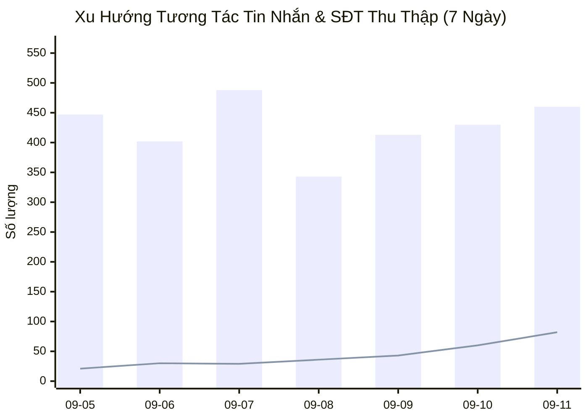
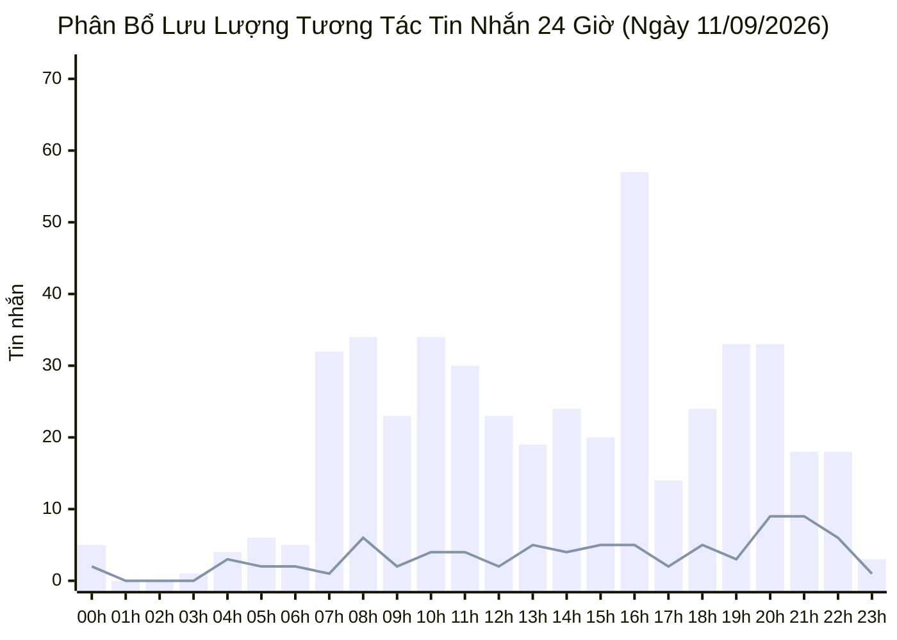

  

    PANCAKE OMNICHANNEL AUDIT & PERFORMANCE INTELLIGENCE
  

  <h1 style="margin: 4px 0 10px 0; color: white; border: none; padding: 0; font-size: 26px; font-weight: 800;">
    📊 BÁO CÁO HIỆU SUẤT VẬN HÀNH ĐA KÊNH PANCAKE (NGÀY 11/09/2026)
  </h1>
  

    Dữ liệu kiểm toán vận hành và phân tích chuyển đổi toàn diện trên 10 kênh tương tác thuộc Hệ sinh thái Viện Dinh Dưỡng NERCI & H&H Nutrition
  

  

    📅 <strong>Ngày Báo Cáo:</strong> 11/09/2026 (00:00 - 23:59 GMT+7 · Thứ Sáu)
    👤 <strong>Người Báo Cáo:</strong> Đại Dương (Performance & Operations)
    💬 <strong>Tổng Khách Mới:</strong> 339
    📞 <strong>SĐT Thu Được:</strong> 82
    📈 <strong>Tỷ Lệ Thu SĐT (CR):</strong> 8.86%
  

> [!abstract] TỔNG QUAN HIỆU SUẤT VẬN HÀNH NGÀY 11/09/2026
> Toàn bộ hệ thống 10 kênh ghi nhận **`926` lượt tương tác** (**`460` tin nhắn**, **`466` bình luận**), tiếp cận **`339` khách hàng mới**, và bóc tách thành công **`82` số điện thoại chất lượng** (tỷ lệ chuyển đổi SĐT/tương tác đạt **`8.86%`**):
> - 🔥 **Kỷ Lục Lịch Sử Bùng Nổ 82 SĐT:** Mốc son chói lọi mới của toàn viện, tăng trưởng vượt bậc so với kỷ lục 60 SĐT của ngày hôm trước.
> - 🎓 **NERCI Academy Bứt Phá Tuyệt Đối:** Đạt **50 SĐT học viên** khóa đào tạo chuyên gia dinh dưỡng K20, chiếm tới 61% tổng lượng lead toàn viện.
> - 🩺 **Viện Tư Vấn Dinh Dưỡng Duy Trì Phong Độ Cao:** Thu về **21 SĐT** khám dinh dưỡng chuyên sâu.
> - 📱 **Kênh TikTok BS Hùng Viral Cực Mạnh:** Ghi nhận **447 bình luận và 225 khách hàng mới**, cần gấp rút bổ sung nhân sự phản hồi.

## 🌐 I. TỔNG HỢP HIỆU SUẤT VẬN HÀNH ĐA KÊNH
### 📊 1. Xu Hướng Tương Tác 7 Ngày Gần Nhất

### 📑 2. Bảng Theo Dõi Xu Hướng 7 Ngày Vận Hành
| Ngày | Tin Nhắn Khách | Bình Luận | Khách Hàng Mới | SĐT Thu Thập | Tỷ Lệ Thu SĐT | Ghi Chú Vận Hành |
| :---: | :---: | :---: | :---: | :---: | :---: | :--- |
| **05/09** | 447 | 120 | 176 | **21** | **3.70%** | ⚖️ Thứ Bảy ổn định (21 SĐT, 447 inboxes) |
| **06/09** | 402 | 591 | 302 | **30** | **3.02%** | 🏆 Chủ Nhật viral TikTok (568 cmt) & 30 SĐT |
| **07/09** | 488 | 62 | 138 | **29** | **5.27%** | 🚀 Thứ Hai đầu tuần — Bứt phá 26 lead Academy K20 (29 SĐT) |
| **08/09** | 343 | 64 | 115 | **36** | **8.85%** | 🔥 Thứ Ba — Tỷ lệ chốt SĐT cao (36 SĐT · CR 8.96%) |
| **09/09** | 413 | 62 | 136 | **43** | **9.05%** | 🚀 Thứ Tư bứt phá: 43 SĐT (Academy K20 đóng góp 22 SĐT) |
| **10/09** | 430 | 119 | 188 | **60** | **10.93%** | 🚀 **KỶ LỤC CŨ: 60 SĐT (CR ĐẠT ĐỈNH 10.93%)** |
| **11/09** | 460 | 466 | 339 | **82** | **8.86%** | 🔥 **KỶ LỤC LỊCH SỬ TOÀN DIỆN: 82 SĐT (ACADEMY ĐÓNG GÓP 50 SĐT)** |

### 📑 3. Bảng Xếp Hạng Hiệu Quả Tác Nghiệp 10 Kênh
| STT | Kênh / Fanpage | Nền Tảng | Tin Nhắn (Inbox) | Bình Luận (Comment) | Khách Hàng Mới | SĐT Bóc Tách | Tỷ Lệ Thu SĐT (CR) | Trạng Thái & Đánh Giá |
| :---: | :--- | :---: | :---: | :---: | :---: | :---: | :---: | :--- |
| **1** | **BS Hùng Dinh Dưỡng - NERCI** | `tiktok` | **33** | **447** | 225 | **3** | **0.62%** | ⚠️ **Viral khủng (447 cmt), cần nhân sự trực chat** |
| **2** | **NERCI Academy - Đào Tạo Chuyên Gia Dinh Dưỡng** | `facebook` | **159** | **3** | 52 | **50** | **30.86%** | 🔥 **Kỷ lục tuyển sinh K20** (50 SĐT) |
| **3** | **NERCI - Viện Tư Vấn Dinh Dưỡng** | `facebook` | **132** | **6** | 32 | **21** | **15.22%** | 🟢 **Khám dinh dưỡng xuất sắc** (132 inboxes, 21 SĐT) |
| **4** | **H&H Nutrition - Sản phẩm dinh dưỡng y học** | `facebook` | **70** | **6** | 17 | **3** | **3.95%** | 🟢 **Đơn hàng dinh dưỡng y học** (3 SĐT) |
| **5** | **H&H - Dinh dưỡng tối ưu** | `zalo` | **41** | **0** | 6 | **3** | **7.32%** | 🟢 **Zalo OA ổn định** (3 SĐT) |
| **6** | **NERCI.vn - Viện Nghiên Cứu và Tư Vấn Dinh Dưỡng** | `facebook` | **21** | **4** | 5 | **0** | **0.00%** | ⚪ Hỗ trợ vận hành |
| **7** | **H&H** | `pke_chat_plugin` | **2** | **0** | 1 | **1** | **50.00%** | ⚪ Hỗ trợ vận hành |
| **8** | **Viện Nghiên cứu & Tư vấn dinh dưỡng** | `zalo` | **2** | **0** | 1 | **1** | **50.00%** | ⚪ Hỗ trợ vận hành |
| **9** | **Cộng đồng Bác sĩ Dinh Dưỡng Việt Nam** | `facebook` | **0** | **0** | 0 | **0** | **0.00%** | ⚪ Hỗ trợ vận hành |
| **10** | **Nerci** | `pke_chat_plugin` | **0** | **0** | 0 | **0** | **0.00%** | ⚪ Hỗ trợ vận hành |

## ⏰ II. PHÂN BỔ TƯƠNG TÁC THEO KHUNG GIỜ (24 GIỜ)

## 🏷️ III. PHÂN TÍCH NHÃN HỘI THOẠI & PHỄU CHUYỂN ĐỔI (TAG ANALYTICS)
| Mã Nhãn (Tag) | Tên Diễn Giải Chuẩn | Số Lượng Ca | Tỷ Trọng (%) | Định Hướng Vận Hành & Chăm Sóc |
| :--- | :--- | :---: | :---: | :--- |
| `tag_19` | **Chưa phản hồi (Ngưng chat)** | **57** | `43.2%` | 🔴 **Ngưng chat:** Cần remarketing Zalo/SMS sau 24h |
| `tag_24` | **F_Tham Khảo (Chưa có nhu cầu ngay)** | **20** | `15.2%` | 🟡 **Hỏi giá tham khảo:** Gửi cẩm nang thực đơn và lộ trình học |
| `tag_18` | **Spam / Rác** | **11** | `8.3%` | Phân loại tác nghiệp |
| `tag_62` | **KBM (Không bắt máy)** | **8** | `6.1%` | 🟡 **Không bắt máy:** Gửi tin nhắn SMS/Zalo kèm link tư vấn |
| `tag_30` | **Chốt đơn / Khám thành công** | **7** | `5.3%` | 🟢 **Chốt đơn / Khám thành công:** Chuyển bộ phận giao hàng & hẹn khám |
| `tag_27` | **F_Không tồn tại / Khóa máy** | **5** | `3.8%` | Phân loại tác nghiệp |
| `tag_69` | **F_Suy nghĩ thêm** | **5** | `3.8%` | Phân loại tác nghiệp |
| `tag_29` | **Trùng lặp** | **4** | `3.0%` | Phân loại tác nghiệp |
| `tag_72` | **Bận gọi lại sau** | **4** | `3.0%` | Phân loại tác nghiệp |
| `tag_21` | **F_Kinh Tế (Rào cản tài chính)** | **4** | `3.0%` | 🔴 **Rào cản giá:** Đề xuất ưu đãi thanh toán sớm hoặc trả góp |
| `tag_66` | **F_Chưa có quyết định** | **2** | `1.5%` | Phân loại tác nghiệp |
| `tag_25` | **F_Hỏi ý kiến người thân** | **1** | `0.8%` | Phân loại tác nghiệp |
| `tag_22` | **F_Chưa tin tưởng** | **1** | `0.8%` | 🔴 **Chưa tin tưởng:** Gửi giấy phép BYT và video chuyên gia |
| `tag_26` | **F_Sắp xếp thời gian** | **1** | `0.8%` | Phân loại tác nghiệp |
| `tag_71` | **F_Chọn đối thủ** | **1** | `0.8%` | Phân loại tác nghiệp |
| `tag_73` | **Hẹn gọi lại / Theo dõi thêm** | **1** | `0.8%` | Phân loại tác nghiệp |

---
### ⚠️ TUYÊN BỐ MIỄN TRỪ TRÁCH NHIỆM (DISCLAIMER)
*Báo cáo này được trích xuất tự động và độc lập từ Pancake API kết nối trực tiếp với 10 kênh tương tác của Viện Nghiên cứu & Tư vấn Dinh dưỡng NERCI và H&H Nutrition. Dữ liệu phản ánh toàn bộ hoạt động thực tế từ 00:00 đến 23:59 ngày 11/09/2026.*