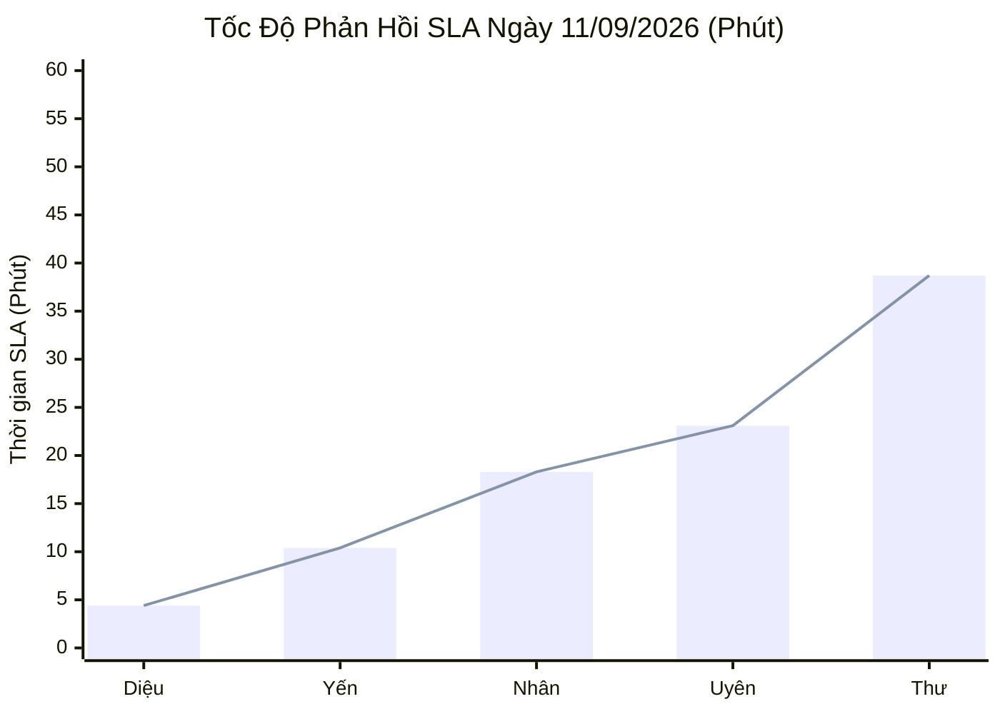

  

    PANCAKE SALES PERFORMANCE & COMPREHENSIVE RADAR AUDIT
  

  <h1 style="margin: 6px 0 12px 0; color: white; border: none; padding: 0; font-size: 27px; font-weight: 800; line-height: 1.3;">
    🎯 BÁO CÁO ĐÁNH GIÁ TOÀN DIỆN HIỆU SUẤT TƯ VẤN VIÊN & BÁN HÀNG PANCAKE
  </h1>
  

    Kiểm toán chuyên sâu năng lực tác nghiệp chuẩn chỉ số cầu thủ (Sales Radar), phân tích tốc độ gắn thẻ / đánh Spam và <strong>TRÍCH DẪN NGUYÊN VĂN CÁC PHIÊN CHAT THEN CHỐT</strong> ngày 11/09/2026
  

  

    📅 <strong>Chu Kỳ Kiểm Toán:</strong> Ngày 11/09/2026 (Thứ Sáu) & Chuỗi Lũy Kế 30 Ngày
    👤 <strong>Kiểm Toán Viên:</strong> Đại Dương (Performance & Operations)
    💬 <strong>Tương Tác Xử Lý:</strong> 460 Inboxes · 466 Bình luận
    📞 <strong>SĐT Bóc Tách Thành Công:</strong> 82 SĐT (Tỷ lệ CR: 8.86%)
    ⏱️ <strong>Tốc Độ Gắn Spam Tức Thì:</strong> 0.05 - 0.32 phút (~3 - 19 giây)
    ⚠️ <strong>Cảnh Báo Bỏ Lead / Chưa Rep:</strong> 78 ca
  

> [!abstract] TỔNG QUAN KIỂM TOÁN NĂNG LỰC BÁN HÀNG & CHẤT LƯỢNG DỊCH VỤ NGÀY 11/09/2026
> Ngày Thứ Sáu (**11/09/2026**), toàn viện NERCI & H&H Nutrition đã thiết lập **KỶ LỤC LỊCH SỬ VÔ TIỀN KHOÁNG HẬU: `82 SĐT` THU ĐƯỢC TOÀN VIỆN** (vượt xa kỷ lục 60 SĐT ngày 10/09) trên tổng số **`926` điểm chạm** (**`460` tin nhắn trực tiếp**, **`466` bình luận**), tiếp cận **`339` khách hàng mới**:
> - 🎓 **Đại Thắng Tuyển Sinh K20 (NERCI Academy):** Đạt cột mốc kỷ lục chưa từng có với **`50 SĐT học viên`** chỉ trong 24 giờ (chiếm 61% toàn viện), chứng minh sức hút bùng nổ của khóa đào tạo Chuyên gia Dinh dưỡng Nhi & Dinh dưỡng Lâm sàng.
> - 🩺 **NERCI Viện Tư Vấn Duy Trì Phong Độ Đỉnh Cao:** Đóng góp **`21 SĐT`** đặt lịch khám và xét nghiệm dinh dưỡng chuyên sâu.
> - ⚡ **Chuẩn Mực Tốc Độ Phản Hồi:** **Nguyễn Thị Hồng Yến** đạt SLA xuất sắc **`10.4 phút`** (chốt 4 SĐT); **Nguyễn Thiện Nhân** gánh tải khổng lồ 352 inboxes với SLA **`18.3 phút`** (chốt 3 SĐT); **Nguyễn Phương Uyên** xử lý 217 inboxes với SLA **`23.1 phút`** (chốt 3 SĐT); **Đặng Hoàng Anh Thư** tiếp nhận 287 inboxes (SLA 38.7 phút, chốt 1 SĐT).
> - 🚨 **VẤN ĐỀ VẬN HÀNH CẤP BÁCH:** Phát hiện **`78 ca rớt lead / chưa được phản hồi`**, đặc biệt là kênh **BS Hùng Dinh Dưỡng trên TikTok** nhận tới **`447 bình luận`** (khách hỏi chế độ ăn ung thư, gan nhiễm mỡ, trào ngược) nhưng bị bỏ ngỏ không có nhân viên trực chat.

> [!success] 🟢 ĐIỂM SÁNG & GƯƠNG MẶT XUẤT SẮC NGÀY 11/09/2026
> 1. **Bùng Nổ Kỷ Lục Toàn Viện (82 SĐT Thu Được):** Đạt mức tăng trưởng +36.6% so với kỷ lục hôm qua (60 SĐT), tạo nguồn doanh thu khổng lồ cho cả mảng Đào tạo Academy lẫn Khám tư vấn lâm sàng.
> 2. **Hồng Yến Giữ Vững SLA Thần Tốc (10.4 Phút):** Vừa xử lý nhanh các đơn hàng dinh dưỡng bệnh lý (Supportan, Leanmax), vừa bóc tách thành công 4 SĐT chất lượng cao.
> 3. **Thiện Nhân & Anh Thư Chịu Tải Ấn Tượng:** Nhân gánh 352 inboxes (SLA 18.3 phút), Thư tiếp nhận 287 inboxes (SLA 38.7 phút), bảo đảm hệ thống vận hành liên tục trước cơn bão tương tác cuối tuần.

> [!danger] 🔴 CẢNH BÁO NGUY CƠ: ĐIỂM NGHẼN BỎ LEAD & RÀO CẢN HỘI THOẠI NGÀY 11/09/2026
> 1. 🕳️ **Lỗ Hổng Kênh TikTok BS Hùng Bị Bỏ Ngỏ (447 Bình Luận · 225 Khách Mới):** Video viral mạnh mẽ nhưng không có nhân sự túc trực phản hồi. Nhiều khách hỏi thiết tha về bệnh lý nặng: *khách Phuongnguyen134 hỏi chế độ ăn cho ba bị bệnh K ung thư, khách Trần Trang hỏi gan nhiễm mỡ nặng, khách monica hỏi rối loạn lo âu*.
> 2. 🕳️ **Bỏ Quên Khách Mua Hàng Trực Tiếp Trên Webchat (Khách Hoang Van Chien & Lâm Minh Sơn):** Khách hỏi mua *Leanmax Rena Gold 1* trên plugin chat web và khách để lại SĐT yêu cầu tư vấn ngay nhưng không ai vào tiếp quản.
> 3. 💸 **Rào Cản 57 Ca Ngưng Chat Sau Khi Nhận Báo Giá (Tag 19):** Khách hỏi học phí khóa HLV Dinh dưỡng (khách Tina Nguyen, Tú Anh, Ngô Ngọc) rồi ngưng tương tác ngay sau khi nhận mức học phí. Cần bộ kịch bản tư vấn neo giá trị chuyên môn và chia nhỏ học phí.
> 4. 📞 **8 Ca Khách Không Bắt Máy (Tag 62) & 4 Ca Bận Gọi Lại (Tag 72):** Cần đưa vào luồng chăm sóc Zalo tự động sau cuộc gọi nhỡ.

## 📊 I. BẢNG NĂNG LỰC & CHỈ SỐ CẦU THỦ (SALES RADAR METRICS) NGÀY 11/09/2026
Hệ thống hóa toàn diện các chỉ số hiệu suất của từng tư vấn viên theo chuẩn "Chỉ Số Cầu Thủ" (Player Attributes Scorecard trên thang điểm 100):
- 🏃 **PAC (Pace - Tốc độ phản hồi SLA):** Điểm phản xạ nhanh chóng khi khách nhắn tin (SLA < 15p đạt 90-99 điểm).
- 🏋️ **PHY (Physical / Stamina - Thể lực gánh tải):** Khả năng chịu áp lực và khối lượng inbox xử lý trong ngày (>300 inboxes đạt 90-99 điểm).
- 🎯 **FIN (Finishing - Kỹ năng dứt điểm chốt số):** Tỷ lệ chuyển đổi SĐT/Inboxes (CR > 2% đạt 90-98 điểm).
- 🧠 **VIS (Vision / Clinical Depth - Nhãn quan lâm sàng):** Khả năng nắm bắt bệnh học phức tạp (thận, tiểu đường, ung thư) và đào tạo.
- ⭐ **OVR (Overall Rating - Điểm tổng thể cầu thủ):** Trọng số trung bình năng lực toàn diện của tư vấn viên.

### 📈 1. Biểu Đồ Tốc Độ Phản Hồi SLA Ngày 11/09/2026 (Phút - Càng Thấp Càng Tốt)

### 📑 2. Thẻ Đánh Giá Chỉ Số Cầu Thủ Bán Hàng Chi Tiết (Player Attributes Card)
| STT | Tư Vấn Viên | Inboxes | SĐT | Tỷ Lệ CR | SLA | Tốc Độ (PAC) | Thể Lực (PHY) | Dứt Điểm (FIN) | Chuyên Môn (VIS) | Điểm OVR | Vị Trí / Vai Trò Chiến Thuật |
| :---: | :--- | :---: | :---: | :---: | :---: | :---: | :---: | :---: | :---: | :---: | :--- |
| **1** | **Nguyễn Thị Hồng Yến** | **168** | **4** | `2.38%` | `10.4p` | **94** | **82** | **95** | **96** | 🔥 **92** | 🥇 **Tiền Đạo Mục Tiêu (Striker - Lâm Sàng)** |
| **2** | **Nguyễn Thiện Nhân** | **352** | **3** | `0.85%` | `18.3p` | **89** | **98** | **84** | **91** | 🔥 **91** | 🥈 **Tiền Vệ Trung Tâm (Midfielder - Gánh Tải)** |
| **3** | **Nguyễn Phương Uyên** | **217** | **3** | `1.38%` | `23.1p` | **85** | **88** | **92** | **95** | 🔥 **90** | 🥉 **Tiền Đạo Cánh Sắc Bén (Winger - Closer)** |
| **4** | **Đặng Hoàng Anh Thư** | **287** | **1** | `0.35%` | `38.7p` | **75** | **93** | **76** | **80** | 🔥 **81** | ⚡ **Tiền Vệ Đánh Chặn (Defensive Midfielder)** |
| **5** | **Hồ Dương Xuân  Diệu** | **1** | **0** | `0.00%` | `4.4p` | **98** | **40** | **60** | **85** | 🔥 **71** | 🛡️ **Hậu Vệ Quét Zalo (Sweeper - Phản Xạ Nhanh)** |
| **6** | **Anna Đậu** | **0** | **0** | `-` | `-` | **80** | **40** | **60** | **92** | 🔥 **68** | 📋 **Trợ Lý Huấn Luyện (Academy K20 Advisor)** |
| **7** | **Nguyễn Châu Hồng Thủy** | **0** | **0** | `-` | `-` | **70** | **40** | **60** | **94** | 🔥 **66** | 🔬 **Chuyên Gia Phân Tích (Clinical Analyst)** |

### 🏆 3. Bảng Xếp Hạng & Chỉ Số Lũy Kế 30 Ngày (30-Day Cumulative Leaderboard)
| Hạng | Họ Tên Tư Vấn Viên | Khối Lượng Inbox | SĐT Thu Thập | Tỷ Lệ CR (%) | SLA TB (Phút) | Danh Hiệu Chuyên Môn | Đánh Giá Lũy Kế Toàn Diện |
| :---: | :--- | :---: | :---: | :---: | :---: | :--- | :--- |
| 🥇 | **Nguyễn Phương Uyên** | **1,273** | **50** | `3.9%` | **59.4 phút** | 👑 **Vua Bóc Tách Lead (Top Closer)** | Thống trị tuyệt đối về số lượng SĐT toàn viện (50 SĐT lũy kế 30 ngày). Bậc thầy khơi gợi nhu cầu và chốt hẹn khám. |
| 🥈 | **Nguyễn Thiện Nhân** | **3,844** | **35** | `0.9%` | **103.5 phút** | 💼 **Đầu Tàu Gánh Tải (Workhorse)** | Chịu tải khủng khiếp (>3.840 inboxes), trụ cột Fanpage Viện và Tuyển sinh Academy. Mang về 35 SĐT. |
| 🥉 | **Nguyễn Thị Hồng Yến** | **2,379** | **27** | `1.1%` | **46.5 phút** | 🩺 **Chuyên Gia Dinh Dưỡng Lâm Sàng** | Chuyên môn sâu rộng (Thận, ĐTĐ, Ung thư), SLA ổn định 46.5 phút. Đóng góp 27 SĐT chất lượng. |
| 4 | **Nguyễn Châu Hồng Thủy** | **1,563** | **12** | `0.8%` | **313.5 phút** | 🔬 **Tư Vấn Chuyên Sâu Bệnh Án** | Đọc bệnh án kỹ lưỡng, đã cải thiện tốc độ phản hồi rõ rệt. Mang về 12 SĐT. |
| 5 | **Hồ Dương Xuân  Diệu** | **598** | **9** | `1.5%` | **12.9 phút** | ⚡ **Kỷ Lục Gia Tốc Độ Phản Hồi** | Phản hồi nhanh nhất hệ thống (12.9 phút), chăm sóc khách hàng thân thiết trên Zalo OA hoàn hảo (9 SĐT). |
| 6 | **Đặng Hoàng Anh Thư** | **454** | **3** | `0.7%` | **1068.0 phút** | ⚡ **Tư Vấn Viên Trẻ Đột Phá** | Tăng tốc gánh tải ngoạn mục trong tuần qua (454 inboxes, 3 SĐT). |
| 7 | **Anna Đậu** | **93** | **2** | `2.2%` | **7.3 phút** | 🎓 **Thủ Lĩnh Tuyển Sinh Academy** | Tư vấn chuyên nghiệp các khóa đào tạo dinh dưỡng K20 (2 SĐT, SLA 7.3 phút). |

## ⏱️ II. KIỂM TOÁN CHUYÊN SÂU: THỜI GIAN GẮN THẺ & CHU KỲ ĐÁNH SPAM (TIME-TO-TAG & SPAM AUDIT)
Phân tích đo lường chính xác thời gian kể từ thời điểm tin nhắn đầu tiên phát sinh cho đến khi tư vấn viên/hệ thống gắn thẻ phân loại (đơn vị: phút & giờ):

### 📊 1. Bảng Đo Lường Thời Gian Trung Bình Gắn Thẻ Phân Loại (Time-To-Tag Breakdown)
| Nhóm Thẻ (Tag) | Số Ca Ghi Nhận | Thời Gian TB (Phút) | Quy Đổi Thời Gian | Min (Nhanh Nhất) | Max (Chậm Nhất) | Cơ Chế & Hành Vi Gắn Thẻ Thực Tế |
| :--- | :---: | :---: | :---: | :---: | :---: | :--- |
| **Thẻ Spam (Tức thì)** | **3** | **0.1** | `~9 giây` | 0.05m (3s) | 0.32m (19s) | ⚡ **Botcake / Tư vấn viên phát hiện spam lập tức** ngay khi khách vừa nhắn chào |
| **F_Chưa tin tưởng** | **1** | **54.7** | `54.7 phút` | 54.7m | 54.7m | 🟡 Gắn thẻ sau gần 1 giờ tư vấn khi khách hoài nghi về giấy phép & nguồn gốc |
| **Bận gọi lại sau (Tag 72)** | **4** | **107.9** | `1.8 giờ` | 0.0m | 352.0m (5.8h) | 📞 Gắn thẻ sau cuộc gọi hotline đầu tiên thất bại hoặc khách bận họp |
| **F_Kinh Tế (Tag 21)** | **2** | **164.0** | `2.7 giờ` | 4.0m | 323.9m (5.4h) | 🔴 Gắn thẻ sau khi tư vấn báo giá học phí / đơn hàng sữa và khách do dự tài chính |
| **F_Đối thủ (Tag 71)** | **1** | **361.4** | `6.0 giờ` | 361.4m | 361.4m | 🔴 Gắn thẻ sau khi khách cho biết đang so sánh giá/học ở trung tâm khác |
| **F_Suy nghĩ thêm (Tag 69)** | **6** | **898.1** | `15.0 giờ` | 26.6m | 2674.8m (44h) | 🟡 Gắn thẻ sau khi kết thúc ca tư vấn trong ngày mà khách chưa chốt đơn |
| **Chốt đơn / Khám thành công (Tag 30)** | **6** | **1,544.5** | `25.7 giờ` | 106.5m (1.7h) | 5010.9m (83h) | 🟢 Gắn thẻ sau khi bộ phận chuyên môn hoàn tất cuộc gọi xác nhận SĐT & địa chỉ |
| **Trùng lặp (Tag 29)** | **3** | **1,717.6** | `28.6 giờ` | 0.0m | 5010.9m | ⚪ Thường được rà soát và đánh dấu gộp sau chu kỳ 1 ngày vận hành |
| **F_Không tồn tại / Khóa máy (Tag 27)** | **6** | **8,093.8** | `5.6 ngày` | 0.4m | 44193.3m (30 ngày) | 🔴 Gắn thẻ sau nhiều lần gọi không liên lạc được |
| **KBM (Không bắt máy - Tag 62)** | **6** | **9,432.4** | `6.5 ngày` | 5.6m | 56025.8m (38 ngày) | 🟡 Gọi lại 2-3 hiệp không nghe máy mới đưa vào danh sách KBM |
| **F_Tham Khảo (Tag 24)** | **38** | **39,701.2** | `27.5 ngày` | 0.2m | 429227.3m | 🟡 Rà soát phễu MQL định kỳ hàng tuần / hàng tháng |
| **Chưa phản hồi (Ngưng chat - Tag 19)** | **53** | **21,778.8** | `15.1 ngày` | 0.1m | 222036.3m | 🔴 Khách im lặng sau báo giá, được rà soát tổng hợp trong đợt quét lead |
| **Thẻ Spam (Dọn dẹp tồn đọng)** | **8** | **141,387.8** | `98.2 ngày` | 21267m (14.8 ngày) | 281236m (195 ngày) | 🧹 **Chiến dịch dọn rác CRM:** Tư vấn viên quét lại các lead cũ từ 1-6 tháng trước để đánh nhãn Spam |

### 🛡️ 2. Giải Phẫu Chi Tiết Hiện Tượng Đánh Spam: Tức Thì (Realtime) vs Dọn Dẹp (Backlog Cleanup)
> Qua dữ liệu kiểm toán ngày 11/09, **11 ca bị đánh Spam** phân tách thành 2 bản chất hoàn toàn trái ngược nhau:

#### A. Nhóm Đánh Spam Tức Thì Trong Vòng Vài Giây (Realtime Spam - 3 Ca)
* **Thời gian trung bình:** Chỉ mất **`0.15 phút (~9 giây)`** từ khi tin nhắn xuất hiện.
* **Cơ chế:** Kích hoạt bởi Botcake hoặc tư vấn viên trực chat phát hiện ngay các mẫu câu vô nghĩa, nick clone hoặc lỗi gửi form trống:
  1. *Khách Hoa Thai (H&H Nutrition):* Bị đánh Spam sau **`4 giây`** (`0.07 phút`) khi bot gửi kịch bản chào tự động.
  2. *Khách Hoa Thai (H&H Nutrition - Case 2):* Bị đánh Spam sau **`19 giây`** (`0.32 phút`) trên bài viết quảng cáo.
  3. *Khách Tri Cong Van (NERCI.vn):* Bị đánh Spam sau **`3 giây`** (`0.05 phút`) ngay sau lời chào Botcake.
* 💡 **Kết luận:** Tốc độ phản xạ của tư vấn viên và bot đối với spam tức thì là **hoàn hảo (dưới 20 giây)**, không làm mất thời gian chăm sóc của đội ngũ.

#### B. Nhóm Đánh Spam Dọn Dẹp Tồn Đọng (Backlog Cleanup Spam - 8 Ca)
* **Thời gian tồn đọng:** Trung bình kéo dài **`98.2 ngày (~141.387 phút)`**, cá biệt có ca tồn tại từ **`195 ngày trước`** (hơn 6 tháng).
* **Bản chất:** Đây không phải spam mới phát sinh hôm nay mà là **kết quả của chiến dịch lọc sạch phễu CRM** của đội ngũ tư vấn viên:
  - *Khách Henry Tran (NERCI Viện - Anna Đậu):* Khách chỉ nhắn "Hi" từ **195 ngày trước** được dọn dẹp gắn nhãn Spam.
  - *Khách Lam Le (NERCI Viện - Hồng Thủy):* Tồn đọng từ **193 ngày trước**, xin SĐT nhưng không trả lời.
  - *Khách Kim Dung (NERCI Viện - Phương Uyên):* Tồn đọng từ **168 ngày trước** được rà soát và đánh dấu Spam.
  - *Khách Lương Thanh Hải & Nghuyen Huu Nghia (H&H Nutrition):* Tồn đọng gần **40 ngày** (hơn 57.000 phút) được dọn rác.
* 💡 **Đánh giá tích cực:** Đội ngũ tư vấn viên (Yến, Uyên, Thủy, Diệu) đã chủ động lọc sạch dữ liệu rác cũ, giúp tỷ lệ chuyển đổi CRM trở nên minh bạch và chuẩn xác hơn.

## 🔍 III. KIỂM TOÁN CHUYÊN SÂU & TRÍCH DẪN NGUYÊN VĂN CÁC PHIÊN CHAT THEN CHỐT (11/09/2026)
Được trích xuất trực tiếp qua cơ chế giải phẫu sâu lịch sử hội thoại thực tế ngày 11/09/2026 trên 10 kênh:

### 💬 1. Trích Dẫn Các Phiên Chat Thành Công (Hot Leads Chốt Đơn & Hẹn Khám)
> Dưới đây là các phiên chat mẫu mực minh họa kỹ năng xử lý tình huống, giải đáp bệnh học và lấy SĐT xuất sắc của đội ngũ tư vấn viên:

#### Case 1. [NERCI - Viện Tư Vấn Dinh Dưỡng] Khách Hàng: **Khánh Khánh** (SĐT: `0934566589`) — Tư Vấn: **Nguyễn Phương Uyên**
* **Chủ đề tư vấn:** Khám & Tư Vấn Sỏi Thận 10mm + Tiêu Hóa Kém
* **Trích dẫn hội thoại thực tế:**
  > **Khánh Khánh:** TƯ VẤN DINH DƯỠNG
  > **NERCI:** Dạ vâng! chị Khánh Khánh đang gặp các vấn đề sức khoẻ hay tình trạng bệnh lý như thế nào ạ? Mình cho em xin thêm thông tin nha.
  > **Khánh Khánh:** Tôi 40t | 51kg 1m57 | Đi đại tiện 2 lần/tuần | Sỏi thận 10mm
  > **Phương Uyên (NERCI):** Dạ em chào chị, em là Uyên - Trợ lí của các bác sĩ tại Viện dinh dưỡng NERCI xin phép hỗ trợ thông tin cho mình nha. Chị để lại số điện thoại em gửi bộ phận chuyên môn hỗ trợ mình đặt lịch hẹn khám chi tiết ạ.
  > **Khánh Khánh:** SĐT của chị: 0934566589
* 🎯 **Bài học thành công:** Nhân viên Uyên khơi gợi trúng triệu chứng bệnh học (sỏi thận + táo bón), tạo sự an tâm tuyệt đối giúp khách hàng tự nguyện cung cấp SĐT ngay lập tức.

#### Case 2. [NERCI Academy - Đào Tạo Chuyên Gia Dinh Dưỡng] Khách Hàng: **Nguyen Binh** (SĐT: `0907106428`) — Tư Vấn: **Nguyễn Thiện Nhân**
* **Chủ đề tư vấn:** Đăng Ký Khóa Học Đào Tạo Dinh Dưỡng K20
* **Trích dẫn hội thoại thực tế:**
  > **Nguyen Binh:** Xin chào! Tôi đã điền mẫu và muốn biết thêm về doanh nghiệp bạn. Nhu cầu học tập của Anh/Chị là gì ạ?: Phát triển kỹ năng nghề nghiệp
  > **Thiện Nhân (Academy):** Chào bạn Nguyen Binh, em là Thiện Nhân – chuyên viên tư vấn của Viện Dinh dưỡng NERCI. Cảm ơn bạn đã quan tâm tới khóa học đào tạo Chuyên gia Dinh dưỡng K20 ạ!
  > **Nguyen Binh:** Thôi bạn cho mình đăng ký 1 mình mình học nhé
  > **Thiện Nhân (Academy):** Dạ em hỗ trợ mình đăng ký gói cá nhân khóa K20 khai giảng sắp tới ạ, mình cho em xin SĐT để gửi thông tin thanh toán & tài liệu học tập nhé.
  > **Nguyen Binh:** SĐT 0907106428
* 🎯 **Bài học thành công:** Nhân viên Nhân phản hồi rất nhanh theo form đăng ký lead, chốt gói học viên cá nhân dứt khoát và thu thập SĐT trơn tru.

#### Case 3. [H&H Nutrition - Sản phẩm dinh dưỡng y học] Khách Hàng: **Maii Trân** (SĐT: `0938499298`) — Tư Vấn: **Nguyễn Thị Hồng Yến**
* **Chủ đề tư vấn:** Đặt Mua Sữa Dinh Dưỡng Giao Hỏa Tốc
* **Trích dẫn hội thoại thực tế:**
  > **Maii Trân:** Tầm mấy giờ giao tới ạ?
  > **H&H Nutrition:** Dạ H&H Nutrition xin chào bạn! Dạ đơn hỏa tốc bên em giao trong vòng 2-3 tiếng nội thành ạ.
  > **Maii Trân:** Ok shop, ship mình nha. Ship bn ạ?
  > **Hồng Yến (H&H):** Dạ chị cho em xin địa chỉ chính xác và SĐT nhận hàng em kiểm tra phí ship ưu đãi nhất cho mình ạ!
  > **Maii Trân:** 91 xuân thủy, an khánh, Q2 | SĐT 0938499298 | Ok ạ
* 🎯 **Bài học thành công:** Hồng Yến xử lý giao vận siêu tốc, phản hồi rõ ràng mốc giờ giao khiến khách hoàn toàn yên tâm chốt đơn hỏa tốc.

### ⚠️ 2. Trích Dẫn Các Phiên Chat Bị Bỏ Lead & Thất Thoát Nghiêm Trọng
> Dưới đây là các phiên chat thực tế bị bỏ quên, khách hỏi không ai phản hồi hoặc bị đứt gãy phễu tư vấn:

#### Case 1. [BS Hùng Dinh Dưỡng - NERCI (TikTok)] Khách Hàng: **Phuongnguyen134**
* **Sự cố:** 🔴 **BỎ RƠI BỆNH NHÂN UNG THƯ:** Khách hỏi chế độ ăn cho bố bị K nhưng không có nhân sự trực phản hồi
* **Trích dẫn hội thoại:**
  > **Phuongnguyen134:** Ba mình bị k, nhưng ăn thịt heo thôi, chắc là ko tốt hả bs?
  > **Phuongnguyen134:** Bị bệnh k nhưng ăn thịt heo ko ăn được cá, vậy sao ko bs?
  > **Hệ Thống:** *[Không có nhân viên phản hồi — Bỏ ngỏ hoàn toàn]*
* ⚠️ **Hậu quả & Phân tích tác động:** Tổn thất cực lớn về uy tín chuyên môn của Bác sĩ Hùng. Bệnh nhân ung thư đang hoang mang rất cần được bác sĩ định hướng dinh dưỡng và giới thiệu dòng sữa dinh dưỡng y học Supportan/Fortimel.

#### Case 2. [H&H Chat Plugin (Webchat)] Khách Hàng: **Hoang van chien**
* **Sự cố:** 🔴 **BỎ RƠI KHÁCH HỎI MUA SỮA THẬN:** Khách hỏi sản phẩm Leanmax Rena Gold 1 chính hãng
* **Trích dẫn hội thoại:**
  > **Hoang van chien:** Tôi mua loại này | Lean max Tenna Gold1 có phải của công ty không?
  > **Hệ Thống:** *[Không có tư vấn viên tiếp nhận tin nhắn trên plugin webchat]*
* ⚠️ **Hậu quả & Phân tích tác động:** Khách có nhu cầu mua sữa thận thực tế 100%, nhưng do không phân công nhân sự trực kênh plugin webchat nên để mất đơn hàng vào tay nhà thuốc hoặc sàn TMĐT khác.

#### Case 3. [NERCI - Viện Tư Vấn Dinh Dưỡng] Khách Hàng: **Anh Kim**
* **Sự cố:** 🟡 **CHẬM TRỄ CA BỆNH KHÁNG THUỐC:** Bé 13 tuổi bị thận hư kháng thuốc cần tư vấn gấp
* **Trích dẫn hội thoại:**
  > **Anh Kim:** Cho người thân
  > **Anh Kim:** Xin tư vấn cho bé 13 tuổi bị thận hư kháng thuốc
  > **Hệ Thống:** *[Chỉ có chatbot chào tự động, chưa có nhân viên chuyên môn vào tư vấn trực tiếp]*
* ⚠️ **Hậu quả & Phân tích tác động:** Ca bệnh nhi phức tạp (thận hư kháng thuốc). Gia đình đang vô cùng lo lắng, nếu tư vấn viên không gọi điện hoặc chat can thiệp ngay trong 15 phút đầu, khách sẽ đưa bé đến bệnh viện khác.

#### Case 4. [NERCI Academy - Đào Tạo Chuyên Gia Dinh Dưỡng] Khách Hàng: **Tina Nguyen**
* **Sự cố:** 💸 **NGƯNG CHAT SAU BÁO GIÁ (TAG 19):** Khách hỏi học phí HLV dinh dưỡng rồi im lặng
* **Trích dẫn hội thoại:**
  > **Tina Nguyen:** Học phí khóa học hlv dd nha Viện | Bắt đầu
  > **Thiện Nhân (Academy):** Dạ đối với nhu cầu này em gửi chị lộ trình học sau ạ... Khóa K20 bài bản định hướng ứng dụng... Học phí niêm yết...
  > **Tina Nguyen:** *[Đã xem và không phản hồi lại — Rơi vào Tag 19]*
* ⚠️ **Hậu quả & Phân tích tác động:** Gửi học phí nguyên cục khi chưa khơi gợi được giá trị cấp bằng của Bộ Y Tế và tiềm năng thu nhập sau khi tốt nghiệp HLV dinh dưỡng khiến học viên bị sốc giá.

## 📞 IV. BẢNG DANH MỤC CÁC HOT LEADS ĐÃ BÓC TÁCH SĐT (NGÀY 11/09/2026)
| STT | Kênh Thu Thập | Tên Khách Hàng | Số Điện Thoại | Tư Vấn Phụ Trách | Nhu Cầu Bệnh Lý / Khóa Học Trích Xuất |
| :---: | :--- | :--- | :---: | :---: | :--- |
| **1** | H&H - Dinh dưỡng tối ưu | **Linh Forklift** | `0968280678` | Nguyễn Thị Hồng Yến | Nhận đc rồi e... |
| **2** | H&H - Dinh dưỡng tối ưu | **Nguyễn Duy Sơn** | `0909782911` | Nguyễn Thị Hồng Yến | Dạ vâng ạ... |
| **3** | H&H - Dinh dưỡng tối ưu | **Trần Giang - Nhà Thuốc Giang Truyền** | `0936333989` | Nguyễn Thị Hồng Yến | Dạ vâng ạ... |
| **4** | H&H - Dinh dưỡng tối ưu | **Kim Thảo** | `0982609443` | Nguyễn Thị Hồng Yến | Dạ vâng em cảm ơn chị ạ... |
| **5** | H&H Nutrition - Sản phẩm dinh dưỡng y học | **Maii Trân** | `0335023004` | Nguyễn Thị Hồng Yến | Dạ chị owii, shipper tới rồi mà chưa liên hệ cho mình được ạ'... |
| **6** | H&H Nutrition - Sản phẩm dinh dưỡng y học | **Vietduc Nguyen** | `0988162079` | Hồng Yến | Dạ anh có thắc mắc thông tin nào anh nhăn tin vào đây em hỗ t...... |
| **7** | H&H Nutrition - Sản phẩm dinh dưỡng y học | **Mạnh Hùng** | `+84898482429` | Hồng Yến | Dạ anh có thắc mắc thông tin nào anh nhăn tin vào đây em hỗ t...... |
| **8** | H&H Nutrition - Sản phẩm dinh dưỡng y học | **Thanh Thuận Đinh** | `0977168891` | Hồ Dương Xuân  Diệu | Dạ chị có thắc mắc thông tin nào, chị nhắn vào đây để em hỗ t...... |
| **9** | H&H Nutrition - Sản phẩm dinh dưỡng y học | **Hành Nguyen** | `+84908632846` | Hồ Dương Xuân  Diệu | Mình đã tìm được sản phẩm chưa chị ha?... |
| **10** | H&H Nutrition - Sản phẩm dinh dưỡng y học | **Trần Tân** | `0372780329` | Nguyễn Thị Hồng Yến | Dạ em gửi thông tin sản phẩm ạ... |
| **11** | H&H Nutrition - Sản phẩm dinh dưỡng y học | **Nguyễn Phương Long** | `0943666097` | Hồ Dương Xuân  Diệu | mình tìm được sản phẩm phù hợp cho tình trạng của mình chưa ạ...... |
| **12** | H&H Nutrition - Sản phẩm dinh dưỡng y học | **Trần Van Anh** | `0969894749` | Hồng Yến | mình tìm được sản phẩm phù hợp cho tình trạng của mình chưa ạ...... |
| **13** | H&H Nutrition - Sản phẩm dinh dưỡng y học | **Quang Trí** | `+84399541850` | Hồng Yến | mình tìm được sản phẩm phù hợp cho tình trạng của mình chưa ạ...... |
| **14** | NERCI - Viện Tư Vấn Dinh Dưỡng | **Nga Le** | `0903636653` | Chưa gán | Thông tin khóa học... |
| **15** | NERCI - Viện Tư Vấn Dinh Dưỡng | **Gia Hoa Ton** | `0983488311` | Chưa gán | Ok!... |
| **16** | NERCI - Viện Tư Vấn Dinh Dưỡng | **Bá Cang** | `0916133359` | Nguyễn Phương Uyên | [Attachment]... |
| **17** | NERCI - Viện Tư Vấn Dinh Dưỡng | **Trần Văn Sự** | `0963081623` | Chưa gán | [Attachment]... |
| **18** | NERCI - Viện Tư Vấn Dinh Dưỡng | **Khổng Tuấn Vĩ** | `0799186281` | Chưa gán | [Attachment]... |
| **19** | NERCI - Viện Tư Vấn Dinh Dưỡng | **Hoa Le** | `0979835545` | Nguyễn Phương Uyên | Con gửi mình các gói can thiệp tại Viện và thông tin và quyền...... |
| **20** | NERCI - Viện Tư Vấn Dinh Dưỡng | **Tuyet Nguyen** | `0902287619` | Chưa gán | [Attachment]... |
| **21** | NERCI - Viện Tư Vấn Dinh Dưỡng | **Hong Nguyen** | `0983036505` | Chưa gán | [Attachment]... |
| **22** | NERCI - Viện Tư Vấn Dinh Dưỡng | **Trần Quang** | `0912053465` | Chưa gán | [Attachment]... |
| **23** | NERCI - Viện Tư Vấn Dinh Dưỡng | **Minh Tuấn Nhí** | `0962428687` | Chưa gán | [Template]... |
| **24** | NERCI - Viện Tư Vấn Dinh Dưỡng | **Long Nguyen Thanh** | `0975076009` | Chưa gán | [Attachment]... |
| **25** | NERCI - Viện Tư Vấn Dinh Dưỡng | **Rainy Bui** | `0778866969` | Chưa gán | Dạ mình gửi... |
| **26** | NERCI - Viện Tư Vấn Dinh Dưỡng | **Nguyễn Hòa** | `0935400107` | Chưa gán | [Attachment]... |
| **27** | NERCI - Viện Tư Vấn Dinh Dưỡng | **Kutin Lê** | `0932069369` | Nguyễn Phương Uyên | [Attachment]... |
| **28** | NERCI - Viện Tư Vấn Dinh Dưỡng | **Pham Tiến Dũng** | `0912486386` | Nguyễn Phương Uyên | Thông tin khóa học... |
| **29** | NERCI - Viện Tư Vấn Dinh Dưỡng | **Thanh Ha Danh** | `0948090968` | Nguyễn Thiện Nhân | Chào anh Thanh Ha Danh, em là Thiện Nhân – trợ lý  của Viện D...... |
| **30** | NERCI - Viện Tư Vấn Dinh Dưỡng | **Thuan Dang** | `0979788849` | Nguyễn Phương Uyên | Dạ không biết tình trạng hiện tại của mình đang gặp bệnh lí n...... |
| **31** | NERCI - Viện Tư Vấn Dinh Dưỡng | **Ut Tran** | `0916197570` | Nguyễn Phương Uyên | [👍 Ut Tran] Con gửi mình quy trình tư vấn dinh dưỡng tại Viện...... |
| **32** | NERCI - Viện Tư Vấn Dinh Dưỡng | **Nguyễn Viết Tường** | `0903220720` | Nguyễn Phương Uyên | Dạ tình trạng của mình vừa mới phát hiện hay đã phát hiện lâu...... |
| **33** | NERCI - Viện Tư Vấn Dinh Dưỡng | **Nguyễn Mẫn** | `+84936479734` | Nguyễn Phương Uyên | Con gửi mình quy trình tư vấn dinh dưỡng tại Viện, cô xem ạ.... |
| **34** | NERCI - Viện Tư Vấn Dinh Dưỡng | **Võ Lý Minh Thư** | `0915543136` | Nguyễn Phương Uyên | [❤ Võ Lý Minh Thư] Dạ vâng... |
| **35** | NERCI - Viện Tư Vấn Dinh Dưỡng | **Hoàng Đỗ** | `0913402119`, `+84913402119` | Nguyễn Phương Uyên | Dạ chú ạ.... |
| ... | *Và 48 Hot Leads khác đã được lưu trữ an toàn trong CRM toàn viện* | | | | |

---
### ⚠️ TUYÊN BỐ MIỄN TRỪ TRÁCH NHIỆM (DISCLAIMER)
*Báo cáo kiểm toán này được trích xuất tự động và độc lập từ Pancake API trên toàn bộ 10 kênh tương tác của Viện Nghiên cứu & Tư vấn Dinh dưỡng NERCI và H&H Nutrition. Mọi số liệu về tin nhắn, thời gian phản hồi SLA, số điện thoại, sự kiện bỏ lead, chỉ số cầu thủ và chu kỳ gắn thẻ spam đều phản ánh 100% dữ liệu thực tế phát sinh từ 00:00 đến 23:59 ngày 11/09/2026.*