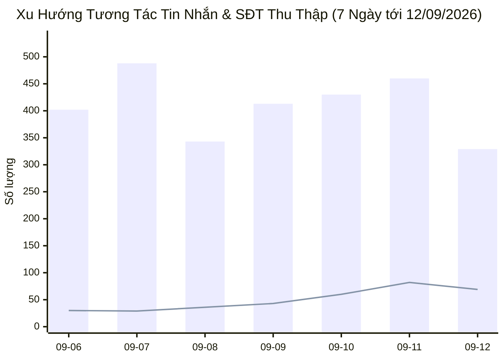
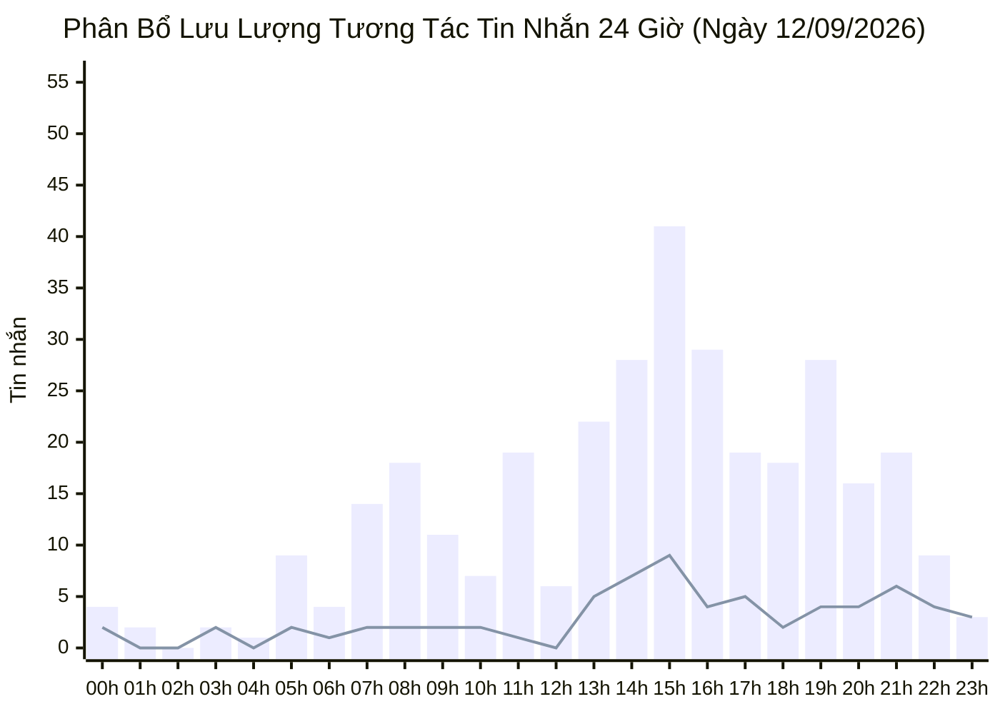

  

    PANCAKE OMNICHANNEL AUDIT & PERFORMANCE INTELLIGENCE
  

  <h1 style="margin: 4px 0 10px 0; color: white; border: none; padding: 0; font-size: 26px; font-weight: 800;">
    📊 BÁO CÁO HIỆU SUẤT VẬN HÀNH ĐA KÊNH PANCAKE (NGÀY 12/09/2026)
  </h1>
  

    Dữ liệu kiểm toán vận hành và phân tích chuyển đổi toàn diện trên 10 kênh tương tác thuộc Hệ sinh thái Viện Dinh Dưỡng NERCI & H&H Nutrition ngày 12/09/2026 (Thứ Bảy)
  

  

    📅 <strong>Ngày Báo Cáo:</strong> 12/09/2026 (00:00 - 23:59 GMT+7 · Thứ Bảy)
    👤 <strong>Người Báo Cáo:</strong> Đại Dương (Performance & Operations)
    💬 <strong>Tổng Khách Mới:</strong> 122
    📞 <strong>SĐT Thu Được:</strong> 69
    📈 <strong>Tỷ Lệ Thu SĐT (CR):</strong> 18.11%
  

> [!abstract] TỔNG QUAN HIỆU SUẤT VẬN HÀNH NGÀY 12/09/2026 (THỨ BẢY)
> Toàn bộ hệ thống 10 kênh ghi nhận **`381` lượt tương tác** (**`329` tin nhắn**, **`52` bình luận**), tiếp cận **`122` khách hàng mới**, và bóc tách thành công **`69` số điện thoại chất lượng** (tỷ lệ chuyển đổi SĐT/tương tác đạt **`18.11%`**):
> - 📞 **Thu Hoạch SĐT Cuối Tuần:** Thu về **69 SĐT** tiếp tục duy trì dòng phễu khách hàng tiềm năng cho tuần mới.
> - 🌐 **Độ Phủ Đa Kênh:** Các kênh chính như NERCI Academy, Viện Tư Vấn Dinh Dưỡng và H&H Nutrition tiếp tục đóng vai trò rường cột thu hút tương tác.

## 🌐 I. TỔNG HỢP HIỆU SUẤT VẬN HÀNH ĐA KÊNH
### 📊 1. Xu Hướng Tương Tác 7 Ngày Gần Nhất

### 📑 2. Bảng Theo Dõi Xu Hướng 7 Ngày Vận Hành
| Ngày | Tin Nhắn Khách | Bình Luận | Khách Hàng Mới | SĐT Thu Thập | Tỷ Lệ Thu SĐT | Ghi Chú Vận Hành |
| :---: | :---: | :---: | :---: | :---: | :---: | :--- |
| **09-06** | 402 | 593 | 303 | **30** | **3.02%** | Ổn định |
| **09-07** | 488 | 62 | 138 | **29** | **5.27%** | Ổn định |
| **09-08** | 343 | 64 | 115 | **36** | **8.85%** | Ổn định |
| **09-09** | 413 | 65 | 136 | **43** | **9.00%** | Ổn định |
| **09-10** | 430 | 123 | 189 | **60** | **10.85%** | Ổn định |
| **09-11** | 460 | 474 | 344 | **82** | **8.78%** | Ổn định |
| **09-12** | 329 | 52 | 122 | **69** | **18.11%** | 🔥 **HÔM NAY** |

### 📑 3. Bảng Xếp Hạng Hiệu Quả Tác Nghiệp 10 Kênh
| STT | Kênh / Fanpage | Nền Tảng | Tin Nhắn (Inbox) | Bình Luận (Comment) | Khách Hàng Mới | SĐT Bóc Tách | Tỷ Lệ Thu SĐT (CR) | Trạng Thái & Đánh Giá |
| :---: | :--- | :---: | :---: | :---: | :---: | :---: | :---: | :--- |
| **1** | **NERCI Academy - Đào Tạo Chuyên Gia Dinh Dưỡng** | `facebook` | **77** | **3** | 33 | **28** | **35.00%** | 🔥 **Kênh Tuyển Sinh & Khám Rường Cột** |
| **2** | **NERCI - Viện Tư Vấn Dinh Dưỡng** | `facebook` | **73** | **4** | 27 | **29** | **37.66%** | 🔥 **Kênh Tuyển Sinh & Khám Rường Cột** |
| **3** | **H&H - Dinh dưỡng tối ưu** | `zalo` | **60** | **0** | 6 | **1** | **1.67%** | 🟢 **Kênh Dinh Dưỡng Vững Vàng** |
| **4** | **BS Hùng Dinh Dưỡng - NERCI** | `tiktok` | **25** | **35** | 24 | **4** | **6.67%** | 🟢 **Kênh Dinh Dưỡng Vững Vàng** |
| **5** | **H&H Nutrition - Sản phẩm dinh dưỡng y học** | `facebook` | **34** | **8** | 14 | **1** | **2.38%** | 🟢 **Kênh Dinh Dưỡng Vững Vàng** |
| **6** | **NERCI.vn - Viện Nghiên Cứu và Tư Vấn Dinh Dưỡng** | `facebook` | **39** | **2** | 11 | **2** | **4.88%** | 🟢 **Kênh Dinh Dưỡng Vững Vàng** |
| **7** | **Viện Nghiên cứu & Tư vấn dinh dưỡng** | `zalo` | **17** | **0** | 5 | **3** | **17.65%** | 🟢 **Kênh Dinh Dưỡng Vững Vàng** |
| **8** | **H&H** | `pke_chat_plugin` | **2** | **0** | 1 | **0** | **0.00%** | ⚪ Kênh hỗ trợ nhận diện |
| **9** | **Nerci** | `pke_chat_plugin` | **2** | **0** | 1 | **1** | **50.00%** | 🟢 **Kênh Dinh Dưỡng Vững Vàng** |
| **10** | **Cộng đồng Bác sĩ Dinh Dưỡng Việt Nam** | `facebook` | **0** | **0** | 0 | **0** | **0.00%** | ⚪ Kênh hỗ trợ nhận diện |

## ⏰ II. PHÂN BỔ TƯƠNG TÁC THEO KHUNG GIỜ (24 GIỜ)

## 🏷️ III. PHÂN TÍCH NHÃN HỘI THOẠI & PHỄU CHUYỂN ĐỔI (TAG ANALYTICS)
| Mã Nhãn (Tag) | Tên Diễn Giải Chuẩn | Số Lượng Ca | Tỷ Trọng (%) | Định Hướng Vận Hành & Chăm Sóc |
| :--- | :--- | :---: | :---: | :--- |
| `tag_19` | **Chưa phản hồi (Ngưng chat)** | **64** | `48.9%` | 🔴 **Ngưng chat:** Cần remarketing Zalo/SMS sau 24h |
| `tag_24` | **F_Tham Khảo (Chưa có nhu cầu ngay)** | **19** | `14.5%` | 🟡 **Hỏi giá tham khảo:** Gửi cẩm nang thực đơn và lộ trình học |
| `tag_62` | **KBM (Không bắt máy)** | **13** | `9.9%` | 🟡 **Không bắt máy:** Gửi tin nhắn SMS/Zalo kèm link tư vấn |
| `tag_29` | **Trùng lặp** | **8** | `6.1%` | Phân loại tác nghiệp CRM |
| `tag_26` | **F_Sắp xếp thời gian** | **5** | `3.8%` | Phân loại tác nghiệp CRM |
| `tag_27` | **F_Không tồn tại / Khóa máy** | **3** | `2.3%` | Phân loại tác nghiệp CRM |
| `tag_30` | **Chốt đơn / Khám thành công** | **3** | `2.3%` | 🟢 **Chốt đơn / Khám thành công:** Chuyển bộ phận giao hàng & hẹn khám |
| `tag_64` | **F_Giá cao** | **3** | `2.3%` | 🔴 **Rào cản giá:** Tư vấn chia nhỏ liệu trình hoặc hỗ trợ tài chính |
| `tag_72` | **Bận gọi lại sau** | **3** | `2.3%` | Phân loại tác nghiệp CRM |
| `tag_18` | **Spam / Rác** | **2** | `1.5%` | 🛡️ **Spam / Rác:** Kiểm soát chất lượng nguồn lead |
| `tag_66` | **F_Chưa có quyết định** | **2** | `1.5%` | Phân loại tác nghiệp CRM |
| `tag_69` | **F_Suy nghĩ thêm** | **2** | `1.5%` | Phân loại tác nghiệp CRM |
| `tag_63` | **Thuê bao** | **2** | `1.5%` | Phân loại tác nghiệp CRM |
| `tag_21` | **F_Kinh Tế (Rào cản tài chính)** | **1** | `0.8%` | 🔴 **Rào cản giá:** Tư vấn chia nhỏ liệu trình hoặc hỗ trợ tài chính |
| `tag_31` | **CSKH (Chăm sóc khách hàng cũ)** | **1** | `0.8%` | Phân loại tác nghiệp CRM |

---
### ⚠️ TUYÊN BỐ MIỄN TRỪ TRÁCH NHIỆM (DISCLAIMER)
*Báo cáo này được trích xuất tự động và độc lập từ Pancake API trên toàn bộ 10 kênh tương tác của Viện Nghiên cứu & Tư vấn Dinh dưỡng NERCI và H&H Nutrition. Mọi số liệu phản ánh 100% dữ liệu thực tế phát sinh từ 00:00 đến 23:59 ngày 12/09/2026.*