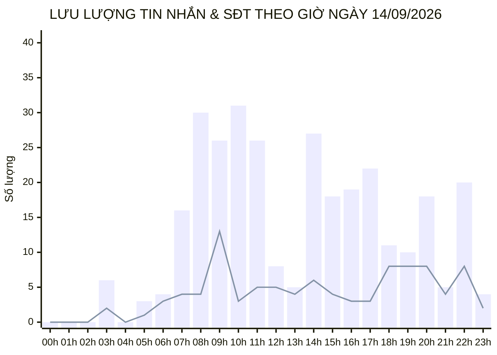
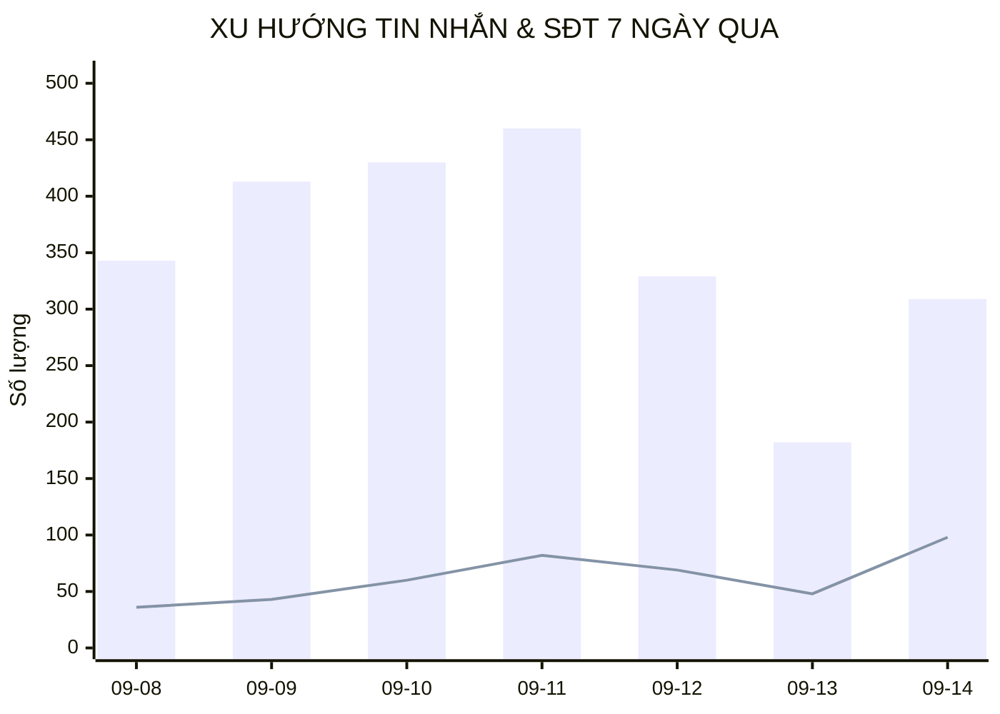

  

    PANCAKE OMNICHANNEL AUDIT & PERFORMANCE INTELLIGENCE
  

  <h1 style="margin: 4px 0 10px 0; color: white; border: none; padding: 0; font-size: 26px; font-weight: 800;">
    📊 BÁO CÁO HIỆU SUẤT VẬN HÀNH ĐA KÊNH PANCAKE (NGÀY 14/09/2026)
  </h1>
  

    Dữ liệu kiểm toán vận hành và phân tích chuyển đổi toàn diện trên 10 kênh tương tác thuộc Hệ sinh thái Viện Dinh Dưỡng NERCI & H&H Nutrition ngày 14/09/2026 (Thứ Hai)
  

  

    📅 <strong>Ngày Báo Cáo:</strong> 14/09/2026 (00:00 - 23:59 GMT+7 · Thứ Hai)
    👤 <strong>Người Báo Cáo:</strong> Đại Dương (Performance & Operations)
    💬 <strong>Tổng Khách Mới:</strong> 122
    📞 <strong>SĐT Thu Được:</strong> 98
    📈 <strong>Tỷ Lệ Thu SĐT (CR):</strong> 27.53%
  

> [!abstract] TỔNG QUAN VẬN HÀNH & KẾT QUẢ ĐỘT PHÁ NGÀY 14/09/2026 (THỨ HAI)
> Hệ thống 10 kênh tương tác ghi nhận ngày làm việc đầu tuần bùng nổ hiệu suất với **`98` số điện thoại** được bóc tách thành công (tăng vọt so với 48 SĐT ngày Chủ Nhật), đạt tỷ lệ chuyển đổi kỷ lục **`27.53%`** trên tổng số **`356` lượt tương tác** (309 inboxes, 47 comments):
> - 🥇 **Kênh Đầu Tàu:** **NERCI Academy** dẫn đầu với **`47` SĐT** (106 inboxes, CR đạt **`44.3%`**), tiếp tục khẳng định sức hút mạnh mẽ của các khóa đào tạo chuyên gia dinh dưỡng.
> - 🥈 **Kênh Bám Sát:** **NERCI - Viện Tư Vấn Dinh Dưỡng** bám sát với **`45` SĐT** (78 inboxes, CR bùng nổ **`57.7%`**), chứng minh phễu bệnh lý chuyển đổi cực kỳ tập trung.
> - ⚙️ **Vận Hành Đa Nền Tảng:** Lưu lượng tập trung chủ yếu trên Facebook và Zalo, hệ thống bot và nhân sự tiếp nhận phản hồi nhịp nhàng.

## 🌐 I. BẢNG TỔNG HỢP HIỆU SUẤT 10 KÊNH TƯƠNG TÁC (14/09/2026)
| Kênh Tương Tác | Nền Tảng | Khách Mới | Tin Nhắn | Bình Luận | Tổng Chạm | SĐT Thu Được | CR Thu SĐT | Đánh Giá Tác Nghiệp |
| :--- | :---: | :---: | :---: | :---: | :---: | :---: | :---: | :--- |
| **NERCI Academy - Đào Tạo Chuyên Gia Dinh Dưỡng** | `facebook` | 47 | 106 | 5 | **111** | **47** | `42.3%` | 🟢 Rất tốt |
| **NERCI - Viện Tư Vấn Dinh Dưỡng** | `facebook` | 44 | 78 | 2 | **80** | **45** | `56.2%` | 🟢 Rất tốt |
| **H&H - Dinh dưỡng tối ưu** | `zalo` | 2 | 62 | 0 | **62** | **1** | `1.6%` | 🟢 Tốt |
| **BS Hùng Dinh Dưỡng - NERCI** | `tiktok` | 20 | 19 | 36 | **55** | **2** | `3.6%` | 🟢 Tốt |
| **H&H Nutrition - Sản phẩm dinh dưỡng y học** | `facebook` | 6 | 29 | 4 | **33** | **2** | `6.1%` | 🟢 Tốt |
| **Viện Nghiên cứu & Tư vấn dinh dưỡng** | `zalo` | 2 | 12 | 0 | **12** | **0** | `0.0%` | ⚪ Chưa phát sinh SĐT |
| **NERCI.vn - Viện Nghiên Cứu và Tư Vấn Dinh Dưỡng** | `facebook` | 0 | 2 | 0 | **2** | **1** | `50.0%` | 🟢 Tốt |
| **Nerci** | `pke_chat_plugin` | 1 | 1 | 0 | **1** | **0** | `0.0%` | ⚪ Chưa phát sinh SĐT |
| **Cộng đồng Bác sĩ Dinh Dưỡng Việt Nam** | `facebook` | 0 | 0 | 0 | **0** | **0** | `0.0%` | ⚪ Chưa phát sinh SĐT |
| **H&H** | `pke_chat_plugin` | 0 | 0 | 0 | **0** | **0** | `0.0%` | ⚪ Chưa phát sinh SĐT |

## ⏱️ II. BIỂU ĐỒ PHÂN BỔ THEO KHUNG GIỜ (14/09/2026)

> *Ghi chú:* Cột xanh biểu thị lưu lượng tin nhắn (Inboxes); Đường kẻ biểu thị số điện thoại (Phones) thu thập được theo từng giờ trong ngày.

## 📈 III. XU HƯỚNG TĂNG TRƯỞNG LŨY KẾ 7 NGÀY GẦN NHẤT

## 🏷️ IV. PHÂN BỔ NHÃN DÁN & PHỄU KHÁCH HÀNG (TAG DISTRIBUTION)
Tổng cộng ghi nhận **124** lượt gắn thẻ phân loại trên toàn hệ thống trong ngày:

| Mã Thẻ | Tên Phân Loại | Số Lượt Gắn | Tỷ Lệ (%) | Ý Nghĩa Chuyển Đổi / Vận Hành |
| :---: | :--- | :---: | :---: | :--- |
| `tag_19` | **Chưa phản hồi (Ngưng chat)** | **59** | `47.6%` | Khách hàng ngưng tương tác |
| `tag_24` | **F_Tham Khảo (Chưa có nhu cầu ngay)** | **20** | `16.1%` | Khách hỏi thăm báo giá/lộ trình |
| `tag_18` | **Spam / Rác** | **12** | `9.7%` | Phân loại nick ảo/spam |
| `tag_62` | **KBM (Không bắt máy)** | **9** | `7.3%` | Tác nghiệp phân loại khách hàng |
| `tag_27` | **F_Không tồn tại / Khóa máy** | **6** | `4.8%` | Tác nghiệp phân loại khách hàng |
| `tag_30` | **Chốt đơn / Khám thành công** | **4** | `3.2%` | Tác nghiệp phân loại khách hàng |
| `tag_21` | **F_Kinh Tế (Rào cản tài chính)** | **3** | `2.4%` | Tác nghiệp phân loại khách hàng |
| `tag_63` | **Thuê bao** | **3** | `2.4%` | Tác nghiệp phân loại khách hàng |
| `tag_26` | **F_Sắp xếp thời gian** | **2** | `1.6%` | Tác nghiệp phân loại khách hàng |
| `tag_69` | **F_Suy nghĩ thêm** | **2** | `1.6%` | Tác nghiệp phân loại khách hàng |
| `tag_72` | **Bận gọi lại sau** | **2** | `1.6%` | Tác nghiệp phân loại khách hàng |
| `tag_64` | **F_Giá cao** | **1** | `0.8%` | Tác nghiệp phân loại khách hàng |

---
### ⚠️ TUYÊN BỐ MIỄN TRỪ TRÁCH NHIỆM (DISCLAIMER)
*Báo cáo vận hành này được trích xuất tự động và độc lập từ Pancake API trên toàn bộ 10 kênh tương tác của Viện Nghiên cứu & Tư vấn Dinh dưỡng NERCI và H&H Nutrition. Dữ liệu phản ánh 100% thời gian thực phát sinh từ 00:00 đến 23:59 ngày 14/09/2026.*