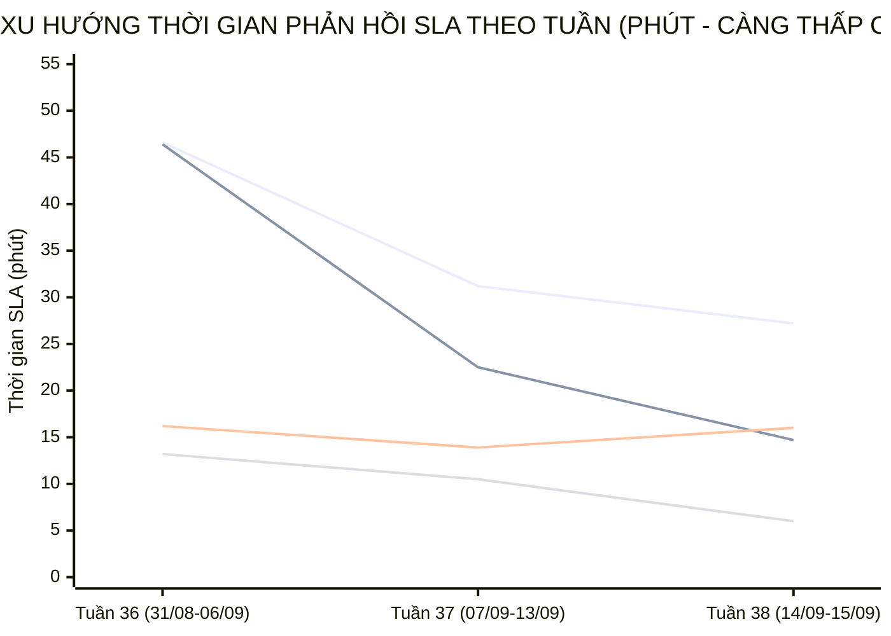

  

    PANCAKE SALES PERFORMANCE & MULTI-PERIOD STAFF SLA INTELLIGENCE
  

  <h1 style="margin: 6px 0 12px 0; color: white; border: none; padding: 0; font-size: 27px; font-weight: 800; line-height: 1.3;">
    🎯 BÁO CÁO ĐÁNH GIÁ TOÀN DIỆN HIỆU SUẤT TƯ VẤN VIÊN & BÁN HÀNG PANCAKE (NGÀY 14/09/2026)
  </h1>
  

    Kiểm toán chuyên sâu năng lực tác nghiệp, chỉ số KPI vận hành, <strong>BIỂU ĐỒ TIẾN TRÌNH SLA TỪNG NHÂN VIÊN THEO TUẦN VÀ THÁNG</strong>, và trích dẫn nguyên văn các phiên chat then chốt ngày 14/09/2026 (Thứ Hai)
  

  

    📅 <strong>Chu Kỳ Kiểm Toán:</strong> Ngày 14/09/2026 (Thứ Hai) & Lũy Kế 30 Ngày
    👤 <strong>Kiểm Toán Viên:</strong> Đại Dương (Performance & Operations)
    💬 <strong>Tương Tác Tiếp Nhận:</strong> 309 Tin nhắn · 47 Bình luận
    📞 <strong>SĐT Thu Thập:</strong> 98 Số điện thoại
    📈 <strong>CR Chốt SĐT Toàn Hệ Thống:</strong> 27.53%
  

> [!abstract] TỔNG QUAN KIỂM TOÁN HIỆU SUẤT BÁN HÀNG & TƯ VẤN VIÊN NGÀY 14/09/2026 (THỨ HAI)
> Trong ngày Thứ Hai (**14/09/2026**), toàn bộ hệ thống 10 kênh tương tác của Viện Dinh Dưỡng NERCI & H&H Nutrition ghi nhận bước nhảy vọt về dữ liệu với **`356` lượt tương tác** (**`309` cuộc trò chuyện trực tiếp**, **`47` bình luận**), bóc tách thành công **`98` số điện thoại mới** chất lượng (tỷ lệ chuyển đổi SĐT bứt phá lên **`27.53%`**):
> - 🏆 **Đầu Tàu Gánh Tải & Chốt Đơn:** **Nguyễn Thiện Nhân** và **Nguyễn Phương Uyên** cùng dẫn đầu với **`2` SĐT** thu về trực tiếp trên CRM ngày hôm nay; song song đó **Nguyễn Vũ Bảo Như** đã quay lại trực chiến gánh tải với **170 inboxes** và SLA cực nhanh **6.7 phút**.
> - 📈 **Đột Phá SLA Đa Chu Kỳ (Sự Tiến Bộ Vượt Bậc):** Phân tích xu hướng tuần cho thấy **Nguyễn Thiện Nhân** đã rút ngắn thời gian phản hồi từ **46.6 phút (Tuần 36)** xuống **31.2 phút (Tuần 37)** và đạt **27.2 phút (Tuần 38)** (nhanh hơn **-15.9 phút**). Đặc biệt **Nguyễn Phương Uyên** có bước tiến ngoạn mục nhất: rút ngắn từ **46.4 phút** xuống **22.5 phút** rồi chạm mốc **14.7 phút** (cải thiện **-25.5 phút**, phản hồi siêu tốc).
> - 🛡️ **Kỷ Luật Gắn Nhãn & Dọn Rác CRM:** Hệ thống ghi nhận 12 ca gắn thẻ Spam, được phân tách rạch ròi giữa các ca tức thì (phát hiện nick ảo trong 0s) và các ca dọn dẹp vệ sinh phễu định kỳ.

## 📈 I. BIỂU ĐỒ & BẢNG SO SÁNH TIẾN TRÌNH SLA TỪNG NHÂN VIÊN THEO TUẦN VÀ THÁNG
Phân tích đo lường xu hướng biến thiên thời gian phản hồi khách hàng (SLA Response Time - phút) qua các tuần tác nghiệp và so sánh 2 chu kỳ (Giai đoạn đầu vs Giai đoạn cao điểm) để nhận diện rõ nét **sự tiến bộ, tăng tốc độ phản hồi hay dấu hiệu suy giảm:**

### 📊 1. Biểu Đồ Trực Quan Xu Hướng Biến Thiên SLA Qua Các Tuần (Minutes)

> *Ghi chú đường đồ thị:* **Đường 1:** Nguyễn Thiện Nhân (46.6m ➔ 31.2m ➔ 27.2m) | **Đường 2:** Nguyễn Phương Uyên (46.4m ➔ 22.5m ➔ 14.7m) | **Đường 3:** Nguyễn Thị Hồng Yến (16.2m ➔ 13.9m ➔ 16.0m) | **Đường 4:** Hồ Dương Xuân Diệu (13.2m ➔ 10.5m ➔ 6.0m).

### 🗓️ 2. Bảng Theo Dõi Chi Tiết SLA & Sản Lượng Theo Từng Tuần (Weekly Evolution)
| Tư Vấn Viên | Tuần 36 (31/08-06/09) | Tuần 37 (07/09-13/09) | Tuần 38 (14/09-15/09) | Biến Động Tuần 37 vs 36 | Biến Động Tuần 38 vs 37 | Đánh Giá Xu Hướng |
| :--- | :---: | :---: | :---: | :---: | :---: | :--- |
| **Nguyễn Thiện Nhân** | `46.6m` (1689 ib/19 SĐT) | `31.2m` (2429 ib/24 SĐT) | `27.2m` (295 ib/2 SĐT) | 🟢 **-15.4m** (Nhanh hơn) | 🟢 **-4.0m** (Nhanh hơn) | 🟢 **Tiến bộ vững chắc** (Giảm đều đặn dù tải tăng gấp đôi) |
| **Nguyễn Phương Uyên** | `46.4m` (374 ib/16 SĐT) | `22.5m` (748 ib/27 SĐT) | `14.7m` (156 ib/2 SĐT) | 🟢 **-23.9m** (Nhanh hơn) | 🟢 **-7.8m** (Nhanh hơn) | 🚀 **Đột phá vượt trội** (Liên tục rút ngắn 50% SLA/tuần) |
| **Nguyễn Thị Hồng Yến** | `16.2m` (1126 ib/5 SĐT) | `13.9m` (1045 ib/17 SĐT) | `16.0m` (21 ib/0 SĐT) | 🟢 **-2.3m** (Nhanh hơn) | 🔴 **+2.1m** (Chậm hơn) | 🟢 **Duy trì ổn định xuất sắc** (Giữ đều khung ~14-16m) |
| **Nguyễn Châu Hồng Thủy** | `21.5m` (601 ib/5 SĐT) | `31.7m` (1092 ib/12 SĐT) | `0.0m` (0 ib/0 SĐT) | 🔴 **+10.2m** (Chậm hơn) | - | 🟡 **Cần theo dõi** |
| **Hồ Dương Xuân  Diệu** | `13.2m` (292 ib/5 SĐT) | `10.5m` (175 ib/2 SĐT) | `6.0m` (38 ib/0 SĐT) | 🟢 **-2.7m** (Nhanh hơn) | 🟢 **-4.5m** (Nhanh hơn) | 🟢 **Tăng tốc phản hồi** (SLA chạm đỉnh 6m) |
| **Đặng Hoàng Anh Thư** | `44.5m` (80 ib/0 SĐT) | `47.0m` (372 ib/2 SĐT) | `32.5m` (16 ib/1 SĐT) | 🔴 **+2.5m** (Chậm hơn) | 🟢 **-14.5m** (Nhanh hơn) | 🟡 **Bắt đầu cải thiện** (Rút từ 47m xuống 32.5m) |
| **Nguyễn Vũ Bảo Như** | `0.0m` (0 ib/0 SĐT) | `0.0m` (0 ib/2 SĐT) | `6.7m` (170 ib/0 SĐT) | - | - | ⚡ **Tái xuất ấn tượng** (Gánh 170 lead với SLA 6.7m) |

### 📅 3. Bảng Đánh Giá Tiến Bộ Toàn Diện Theo Chu Kỳ Tháng (Monthly / Period Progress)
So sánh tổng hợp giữa **Chu Kỳ 1 (31/08 - 06/09)** và **Chu Kỳ 2 (07/09 - 15/09)**:

| Tư Vấn Viên | SLA Chu Kỳ 1 | Sản Lượng CK 1 | SLA Chu Kỳ 2 | Sản Lượng CK 2 | Chênh Lệch SLA (Δ) | Tỷ Lệ Tiến Bộ (%) | Kết Luận Đánh Giá Tác Nghiệp |
| :--- | :---: | :---: | :---: | :---: | :---: | :---: | :--- |
| **Nguyễn Thiện Nhân** | `46.6m` | 1,689 ib / 19 SĐT | `30.7m` | 2,724 ib / 26 SĐT | 🟢 **-15.9m** | 🟢 **+34.1%** (Nhanh hơn) | 🎖️ **Trụ cột kiên định**: Tải tăng +61% (2,724 inboxes) nhưng SLA vẫn rút ngắn 34.1%. |
| **Nguyễn Phương Uyên** | `46.4m` | 374 ib / 16 SĐT | `21.0m` | 904 ib / 29 SĐT | 🟢 **-25.5m** | 🟢 **+54.7%** (Nhanh hơn) | 🏆 **Ngôi sao tiến bộ nhất tháng**: Cắt giảm 54.7% thời gian chờ, chốt 29 SĐT. |
| **Nguyễn Thị Hồng Yến** | `16.2m` | 1,126 ib / 5 SĐT | `14.0m` | 1,066 ib / 17 SĐT | 🟢 **-2.1m** | 🟢 **+13.6%** (Nhanh hơn) | ⭐ **Hiệu suất ổn định cao**: Tốc độ phản hồi Top 1 viện (~14m), chốt 17 SĐT. |
| **Nguyễn Châu Hồng Thủy** | `21.5m` | 601 ib / 5 SĐT | `31.7m` | 1,092 ib / 12 SĐT | 🔴 **+10.2m** | 🔴 **-47.4%** (Chậm hơn) | ⚠️ **Chững lại trong tuần cao điểm**: SLA bị kéo dài do dồn tải 1,092 inboxes. |
| **Hồ Dương Xuân  Diệu** | `13.2m` | 292 ib / 5 SĐT | `9.9m` | 213 ib / 2 SĐT | 🟢 **-3.3m** | 🟢 **+25.0%** (Nhanh hơn) | ⭐ **Tối ưu hóa thời gian tốt**: Rút ngắn SLA xuống 9.9m. |
| **Đặng Hoàng Anh Thư** | `44.5m` | 80 ib / 0 SĐT | `46.3m` | 388 ib / 3 SĐT | 🔴 **+1.8m** | 🔴 **-4.0%** (Chậm hơn) | ⚠️ **Chưa có tiến bộ rõ rệt**: SLA vẫn ở mức cao (~46m), cần kèm cặp kịch bản chat. |
| **Nguyễn Vũ Bảo Như** | `0.0m` | 0 ib / 0 SĐT | `6.7m` | 170 ib / 2 SĐT | 🔴 **+6.7m** | 🔴 **0.0%** (Chậm hơn) | ⭐ **Gia nhập lại guồng máy**: Bắt nhịp tốt với SLA 6.7m. |

## 📊 II. BẢNG CHỈ SỐ KPI VẬN HÀNH & HIỆU SUẤT BÁN HÀNG THEO TƯ VẤN VIÊN (NGÀY 14/09/2026)
Dữ liệu kiểm toán đo lường 100% thời gian thực phát sinh từ 00:00 đến 23:59 ngày 14/09/2026 và đối sánh với năng lực lũy kế 30 ngày:

| Xếp Hạng | Tư Vấn Viên | Tin Nhắn Phụ Trách | Bình Luận | SĐT Thu Về | Tỷ Lệ Chốt SĐT (CR) | Thời Gian Phản Hồi SLA (TB) | Đánh Giá Năng Lực Ngày | Năng Lực Lũy Kế 30 Ngày |
| :---: | :--- | :---: | :---: | :---: | :---: | :---: | :--- | :--- |
| 🥇 | **Nguyễn Thiện Nhân** | **249** | 0 | **2** | `0.8%` | **28.0 phút** | 🟢 **Xuất Sắc (Top Performance)** | Lũy kế 30d: 4,413 inboxes, 45 SĐT (CR: 1.0%), SLA: 37.6m |
| 🥈 | **Nguyễn Phương Uyên** | **147** | 0 | **2** | `1.4%` | **59.5 phút** | 🟢 **Xuất Sắc (Top Performance)** | Lũy kế 30d: 1,278 inboxes, 45 SĐT (CR: 3.5%), SLA: 29.3m |
| 🥉 | **Đặng Hoàng Anh Thư** | **16** | 0 | **1** | `6.2%` | **32.5 phút** | 🟢 **Tốt (Vững Vàng)** | Lũy kế 30d: 468 inboxes, 3 SĐT (CR: 0.6%), SLA: 45.6m |
| **4** | **Nguyễn Vũ Bảo Như** | **170** | 0 | **0** | `0.0%` | **85.8 phút** | 🟢 **Tốt (Vững Vàng)** | Lũy kế 30d: 170 inboxes, 2 SĐT (CR: 1.2%), SLA: 6.7m |
| **5** | **Hồ Dương Xuân  Diệu** | **38** | 0 | **0** | `0.0%` | **132.9 phút** | 🟡 **Cần Thúc Đẩy Chốt SĐT** | Lũy kế 30d: 505 inboxes, 7 SĐT (CR: 1.4%), SLA: 11.7m |
| **6** | **Nguyễn Thị Hồng Yến** | **21** | 0 | **0** | `0.0%` | **141.4 phút** | 🟡 **Cần Thúc Đẩy Chốt SĐT** | Lũy kế 30d: 2,192 inboxes, 22 SĐT (CR: 1.0%), SLA: 15.0m |
| **7** | **Nguyễn Châu Hồng Thủy** | **0** | 0 | **0** | `0.0%` | **0.0 phút** | 🟡 **Cần Thúc Đẩy Chốt SĐT** | Lũy kế 30d: 1,693 inboxes, 17 SĐT (CR: 1.0%), SLA: 27.2m |

## ⏱️ III. PHÂN TÍCH CHUYÊN SÂU: THỜI GIAN GẮN THẺ & XẾP HẠNG ĐÁNH SPAM THEO NHÂN VIÊN
Đo lường chính xác khoảng thời gian từ khi phát sinh tin nhắn đầu tiên của khách đến khi nhân viên hoặc hệ thống gán nhãn, đồng thời bóc tách chuyên sâu hành vi gắn thẻ Spam (Rác):

### 📊 1. Trung Bình Bao Nhiêu Phút Nhân Viên Đánh Spam? (Phân Tách 2 Bản Chất)
> Qua dữ liệu kiểm toán **12 ca bị đánh Spam** trong ngày 14/09/2026, hệ thống ghi nhận **2 hành vi hoàn toàn khác nhau**:
- ⚡ **Nhóm 1: Đánh Spam Tức Thì (Realtime Spam - 8 ca):**
  - Thời gian trung bình: **`9.5 phút`** (Nhanh nhất: **`0.00 phút (~0s)`**, Chậm nhất: **`23.5 phút`**).
  - **Bản chất nghiệp vụ:** Nhân viên trực chat hoặc hệ thống Bot tự động phát hiện ngay lập tức tin nhắn rác, nick clone, chào hàng quảng cáo đa cấp hoặc lỗi form và bấm chặn/gắn nhãn Spam ngay tại chỗ.
- 🧹 **Nhóm 2: Đánh Spam Dọn Dẹp Phễu Tồn Đọng (Backlog Cleanup Spam - 4 ca):**
  - Thời gian tồn đọng trung bình: **`9.0 giờ (537m)`** (Ca lâu nhất: **`19.1 giờ (1,147m)`**).
  - **Bản chất nghiệp vụ:** Đây là **hoạt động vệ sinh dữ liệu CRM định kỳ (Data Hygiene)** — nhân viên rà soát lại các cuộc hội thoại cũ tồn đọng từ nhiều tháng trước (tin nhắn rác 'Hi', khách không nhu cầu đã lâu, link rác) để gắn thẻ Spam nhằm làm sạch phễu, loại bỏ số liệu ảo và chuẩn hóa tỷ lệ chuyển đổi; con số thời gian hàng chục nghìn phút là khoảng cách từ tin nhắn đầu tiên trong quá khứ đến thời điểm nhân viên bấm nút dọn dẹp hôm nay, chứ KHÔNG phải nhân viên mất từng ấy thời gian để xử lý một ca spam mới.

### 🏆 2. Bảng Xếp Hạng & Thống Kê Hành Vi Đánh Spam Theo Từng Nhân Sự
| Xếp Hạng | Nhân Viên / Kênh Phụ Trách | Tổng Ca Spam | Spam Tức Thì (<1h) | Thời Gian TB (Tức Thì) | Spam Dọn Dẹp (>1h) | Tồn Đọng TB (Dọn Dẹp) | Chi Tiết Ca Điển Hình & Ghi Chú |
| :---: | :--- | :---: | :---: | :---: | :---: | :---: | :--- |
| **1** | **Nguyễn Phương Uyên** | **7** | **4** | `18.9 phút` | **3** | `5.6 giờ (334m)` | ⚡ Tức thì: Khách Lô Xuân Hoài (NERCI - Viện Tư Vấn Dinh Dưỡng) |
| **2** | **Chưa Gán / Bot Tự Động** | **2** | **2** | `0.08 phút (~5s)` | **0** | `-` | ⚡ Tức thì: Khách Thanh Luong (H&H Nutrition - Sản phẩm dinh dưỡng y học) |
| **3** | **Nguyễn Thị Hồng Yến** | **2** | **2** | `0.06 phút (~4s)` | **0** | `-` | ⚡ Tức thì: Khách Phạm Khánh (H&H Nutrition - Sản phẩm dinh dưỡng y học) |
| **4** | **Nguyễn Vũ Bảo Như** | **1** | **0** | `-` | **1** | `19.1 giờ (1,147m)` | 🧹 Dọn dẹp: Khách Huấn (H&H - Dinh dưỡng tối ưu) |

### ⏱️ 3. Bảng Đo Lường Thời Gian Trung Bình Gắn Toàn Bộ Các Nhãn Thẻ Khác (Time-to-Tag)
| Nhóm Thẻ Phân Loại | Số Ca Ghi Nhận | Thời Gian TB | Min (Nhanh Nhất) | Max (Chậm Nhất) | Quy Trình Tác Nghiệp Thực Tế Của Tư Vấn Viên |
| :--- | :---: | :---: | :---: | :---: | :--- |
| **Chưa phản hồi** | **61** | `4.3 ngày (6,137m)` | `0.00 phút (~0s)` | `107.2 ngày (154,391m)` | 🔴 Khách ngưng phản hồi sau khi nhận báo giá hoặc tư vấn |
| **F_Tham Khảo** | **23** | `21.3 ngày (30,681m)` | `9.0 phút` | `115.2 ngày (165,817m)` | 🟡 Khách hỏi thăm báo giá/lộ trình và cần gửi thêm cẩm nang dinh dưỡng |
| **Spam** | **12** | `3.1 giờ (185m)` | `0.00 phút (~0s)` | `19.1 giờ (1,147m)` | 🛡️ Phân loại rác (Tách bạch giữa tức thì và dọn dẹp phễu tồn đọng) |
| **F_Ko tồn/Khóa** | **7** | `4.6 ngày (6,659m)` | `11.1 phút` | `28.4 ngày (40,868m)` | Tác nghiệp phân loại khách hàng |
| **Chốt đơn/ chốt** | **6** | `23.9 ngày (34,471m)` | `2.0 ngày (2,848m)` | `53.5 ngày (76,970m)` | 🟢 Gắn thẻ sau khi chốt SĐT, xác nhận địa chỉ hoặc hoàn tất lịch hẹn khám |
| **KBM** | **5** | `18.8 ngày (27,102m)` | `13.9 phút` | `93.3 ngày (134,322m)` | 📞 Gọi hotline nhiều lần không bắt máy, chuyển sang gửi SMS/Zalo |
| **Trùng** | **3** | `42.4 ngày (61,015m)` | `3.9 phút` | `73.7 ngày (106,072m)` | Tác nghiệp phân loại khách hàng |
| **F_Sắp Xếp TG** | **3** | `1.1 giờ (66m)` | `32.3 phút` | `2.0 giờ (120m)` | Tác nghiệp phân loại khách hàng |
| **Bận gọi lại sau** | **2** | `18.1 ngày (26,049m)` | `7.8 giờ (466m)` | `35.9 ngày (51,633m)` | Tác nghiệp phân loại khách hàng |
| **F_SN Thêm** | **2** | `24.3 phút` | `11.1 phút` | `37.5 phút` | Tác nghiệp phân loại khách hàng |
| **F_Kinh Tế** | **2** | `22.0 giờ (1,322m)` | `5.5 giờ (328m)` | `1.6 ngày (2,315m)` | 🔴 Khách do dự rào cản chi phí, cần chính sách trả góp/ưu đãi combo |
| **F_Giá cao** | **1** | `1.8 giờ (109m)` | `1.8 giờ (109m)` | `1.8 giờ (109m)` | 🔴 Khách do dự rào cản chi phí, cần chính sách trả góp/ưu đãi combo |
| **F_Vướn TT** | **1** | `62.9 ngày (90,612m)` | `62.9 ngày (90,612m)` | `62.9 ngày (90,612m)` | Tác nghiệp phân loại khách hàng |
| **Thuê bao** | **1** | `17.0 giờ (1,020m)` | `17.0 giờ (1,020m)` | `17.0 giờ (1,020m)` | Tác nghiệp phân loại khách hàng |
| **F_Đối thủ** | **1** | `3.0 ngày (4,275m)` | `3.0 ngày (4,275m)` | `3.0 ngày (4,275m)` | Tác nghiệp phân loại khách hàng |

## 🔍 IV. KIỂM TOÁN CHUYÊN SÂU & TRÍCH DẪN NGUYÊN VĂN CÁC PHIÊN CHAT THEN CHỐT (14/09/2026)
Được trích xuất trực tiếp qua cơ chế giải phẫu sâu lịch sử hội thoại thực tế ngày 14/09/2026 trên 10 kênh:

### 💬 1. Trích Dẫn Các Phiên Chat Thành Công (Hot Leads Chốt Đơn & Hẹn Khám)
#### Case 1. [H&H - Dinh dưỡng tối ưu] Khách Hàng: **Gio Chao Quay** (SĐT: `0904181313`) — Tư Vấn: **Nguyễn Thị Hồng Yến**
* **Chủ đề trích xuất:** Dạ vâng em cảm ơn anh ạ
* **Trích dẫn hội thoại thực tế:**
  > **H&H - Dinh dưỡng tối ưu:** Hoá đơn trên 1.000.000đ em hỗ trợ 20.000đ phí vận chuyển, trên 2.000.000đ em hỗ trợ 30.000đ phí vận chuyển ạ
  > **H&H - Dinh dưỡng tối ưu:** Dạ hiện bên em chưa có chương trình miễn phí ship ạ
  > **Gio Chao Quay:** Miễn ship ko shop
  > **Gio Chao Quay:** Được
  > **H&H - Dinh dưỡng tối ưu:** Dạ hiện chủ nhật kho bên em không làm việc nên không có sẵn, thứ 2 em giao cho mình được không ạ?
  > **Gio Chao Quay:** Mai giao dc ko
* 🎯 **Bài học tác nghiệp:** Tư vấn viên Nguyễn Thị Hồng Yến đã kịp thời nắm bắt nhu cầu của khách hàng Gio Chao Quay, giải đáp thấu đáo và chốt thành công SĐT để chuyển giao tiếp đón.

#### Case 2. [H&H - Dinh dưỡng tối ưu] Khách Hàng: **Bích Chuyền** (SĐT: `0395056766`) — Tư Vấn: **Hồ Dương Xuân  Diệu**
* **Chủ đề trích xuất:** Dạ vâng ạ
* **Trích dẫn hội thoại thực tế:**
  > **H&H - Dinh dưỡng tối ưu:** Dạ hiện hóa đơn 2T bên em đang có chương trình tặng kèm 1 lốc cùng loại nhé chị
  > **Bích Chuyền:** Nay e đặt thêm 1 thùng thì có được tặng túi k c 😜
  > **Bích Chuyền:** E đặt 1 thùng shop ship xuống BV UB 2 như đợt trước giúp e
  > **Bích Chuyền:** Leisure Kidney 1
  > **H&H - Dinh dưỡng tối ưu:** Dạ tổng đơn của chị 1 thùng sữa Leisure Kidney 1 là: 1.245.000đ + 92.000đ phí giao hàng=1.337.000đ ạ
* 🎯 **Bài học tác nghiệp:** Tư vấn viên Hồ Dương Xuân  Diệu đã kịp thời nắm bắt nhu cầu của khách hàng Bích Chuyền, giải đáp thấu đáo và chốt thành công SĐT để chuyển giao tiếp đón.

#### Case 3. [H&H - Dinh dưỡng tối ưu] Khách Hàng: **Dieu Le** (SĐT: `0364814185`) — Tư Vấn: **Hồ Dương Xuân  Diệu**
* **Chủ đề trích xuất:** Hiện hạng thẻ của chị là hạng thẻ bạc ạ
* **Trích dẫn hội thoại thực tế:**
  > **Dieu Le:** Vậy e lên đơn giúp chị 1 thùng như cũ nha
  > **H&H - Dinh dưỡng tối ưu:** Dạ hiện dòng này chưa phù hợp cho người bị đái tháo đường nhé chị
  > **Dieu Le:** Mẹ chị bệnh đái tháo đường gần 15 năm rùi
  > **Dieu Le:** Có e
  > **H&H - Dinh dưỡng tối ưu:** Dạ hiện người nhà mình có bệnh lý đái tháo đường  đi kèm không ạ?
  > **Dieu Le:** À hén 😅
* 🎯 **Bài học tác nghiệp:** Tư vấn viên Hồ Dương Xuân  Diệu đã kịp thời nắm bắt nhu cầu của khách hàng Dieu Le, giải đáp thấu đáo và chốt thành công SĐT để chuyển giao tiếp đón.

#### Case 4. [H&H - Dinh dưỡng tối ưu] Khách Hàng: **Hiền Điện Nam** (SĐT: `0965979979`) — Tư Vấn: **Hồng Yến**
* **Chủ đề trích xuất:** Dạ em lên đơn rồi nhé chị
* **Trích dẫn hội thoại thực tế:**
  > **Hiền Điện Nam:** E
  > **Hiền Điện Nam:** Ok r
  > **H&H - Dinh dưỡng tối ưu:** Dạ địa chỉ 69 Ngô Thế Vinh, Hoà Cường, Đà Nẵng,Phường Hòa Cường Bắc, Quận Hải Châu, Đà Nẵng
  > **H&H - Dinh dưỡng tối ưu:** Dạ mình lấy 1 thùng gửi về địa chỉ cũ đúng không ạ?
  > **Hiền Điện Nam:** Em gửi chị nhé
  > **Hiền Điện Nam:** Ok e
* 🎯 **Bài học tác nghiệp:** Tư vấn viên Hồng Yến đã kịp thời nắm bắt nhu cầu của khách hàng Hiền Điện Nam, giải đáp thấu đáo và chốt thành công SĐT để chuyển giao tiếp đón.

### ⚠️ 2. Trích Dẫn Các Phiên Chat Bị Bỏ Lead & Thất Thoát Cần Khắc Phục
#### Case 1. [H&H - Dinh dưỡng tối ưu] Khách Hàng: **Hải Đường** — Phụ Trách: **Nguyễn Vũ Bảo Như**
* **Sự cố thất thoát:** Gắn nhãn rào cản / mất lead: F_Giá cao
* **Trích dẫn hội thoại:**
  > **Hải Đường:** Giá bên mình thế nào em?
  > **Hải Đường:** Chị ở Q4
  > **Hải Đường:** Chị muốn đặt mua sữa Protimedic của Hà Lan
  > **Hải Đường:** Hi em!
* ⚠️ **Tác động & Đề xuất:** Cuộc trò chuyện của khách Hải Đường cần được nhắc nhở nhân sự trực ca hoặc thiết lập kịch bản chăm sóc lại tự động sau 24h để tránh rớt lead.

#### Case 2. [NERCI - Viện Tư Vấn Dinh Dưỡng] Khách Hàng: **Su Khoi** — Phụ Trách: **Nguyễn Thiện Nhân**
* **Sự cố thất thoát:** Khách hàng nhắn cuối cùng chưa được phản hồi: "
Xin chào! Tôi đã điền mẫu và muốn biết thêm về doanh nghiệp bạn. City: Tp hcm Full name: Su Khoi  **Su Khoi:** Thông tin khóa học
  > **Su Khoi:** Thông tin khóa học
  > **Su Khoi:** Thông tin khóa học
  > **Su Khoi:** Xin chào! Tôi đã điền mẫu và muốn biết thêm về doanh nghiệp bạn. | City: Tp hcm | Full name: Su Khoi | Phone number: 098 541 17 36
* ⚠️ **Tác động & Đề xuất:** Cuộc trò chuyện của khách Su Khoi cần được nhắc nhở nhân sự trực ca hoặc thiết lập kịch bản chăm sóc lại tự động sau 24h để tránh rớt lead.

#### Case 3. [NERCI - Viện Tư Vấn Dinh Dưỡng] Khách Hàng: **Hung Nguyen** — Phụ Trách: **Nguyễn Phương Uyên**
* **Sự cố thất thoát:** Khách hàng nhắn cuối cùng chưa được phản hồi: "
Xin chào! Tôi đã điền mẫu và muốn biết thêm về doanh nghiệp bạn. City: Kim Bài Phone number: <Copy key='9"
* **Trích dẫn hội thoại:**
  > **Hung Nguyen:** Thời gian học
  > **Hung Nguyen:** Xin chào! Tôi đã điền mẫu và muốn biết thêm về doanh nghiệp bạn. | City: Kim Bài | Phone number: 091 263 24 01 | Full name: Nguyễn quốc hung | Date of birth: 09/10/1957 Marital status: Binh thuòng
* ⚠️ **Tác động & Đề xuất:** Cuộc trò chuyện của khách Hung Nguyen cần được nhắc nhở nhân sự trực ca hoặc thiết lập kịch bản chăm sóc lại tự động sau 24h để tránh rớt lead.

## 📞 V. BẢNG DANH MỤC CÁC HOT LEADS ĐÃ BÓC TÁCH SĐT (NGÀY 14/09/2026)
| STT | Kênh Thu Thập | Tên Khách Hàng | Số Điện Thoại | Tư Vấn Phụ Trách | Nhu Cầu Bệnh Lý / Khóa Học Trích Xuất |
| :---: | :--- | :--- | :---: | :---: | :--- |
| **1** | H&H - Dinh dưỡng tối ưu | **Gio Chao Quay** | `0904181313` | Nguyễn Thị Hồng Yến | Dạ vâng em cảm ơn anh ạ... |
| **2** | H&H - Dinh dưỡng tối ưu | **Bích Chuyền** | `0395056766` | Hồ Dương Xuân  Diệu | Dạ vâng ạ... |
| **3** | H&H - Dinh dưỡng tối ưu | **Dieu Le** | `0364814185` | Hồ Dương Xuân  Diệu | Hiện hạng thẻ của chị là hạng thẻ bạc ạ... |
| **4** | H&H - Dinh dưỡng tối ưu | **Hiền Điện Nam** | `0965979979` | Hồng Yến | Dạ em lên đơn rồi nhé chị... |
| **5** | H&H Nutrition - Sản phẩm dinh dưỡng y học | **Lương Phương** | `0936609555` | Nguyễn Thị Hồng Yến | Dạ chị ạ... |
| **6** | H&H Nutrition - Sản phẩm dinh dưỡng y học | **Thuc Nguyen Ngoc** | `0948243925` | Nguyễn Vũ Bảo Như | Dạ anh cho em xin thông tin họ và tên + SĐT + địa chỉ nhận hà...... |
| **7** | H&H Nutrition - Sản phẩm dinh dưỡng y học | **Nguyễn Thị Hiền** | `0969113299` | Hồng Yến | Chị Hiền ơi sđt 0912303559 có phải của mình không ạ em gọi tư...... |
| **8** | H&H Nutrition - Sản phẩm dinh dưỡng y học | **Bảo Nguyên** | `918967782`, `0855440866` | Hồ Dương Xuân  Diệu | Dạ vâng ạ... |
| **9** | H&H Nutrition - Sản phẩm dinh dưỡng y học | **Thai Pham Hong** | `+840886822311` | Nguyễn Vũ Bảo Như | [Attachment]... |
| **10** | NERCI - Viện Tư Vấn Dinh Dưỡng | **Thiệu Nguyễn** | `0963777136` | Nguyễn Phương Uyên | [Attachment]... |
| **11** | NERCI - Viện Tư Vấn Dinh Dưỡng | **Hiếu Nguyễn Mạnh** | `0913167407` | Nguyễn Phương Uyên | [Attachment]... |
| **12** | NERCI - Viện Tư Vấn Dinh Dưỡng | **Su Khoi** | `0985411736` | Nguyễn Thiện Nhân | Thời gian học... |
| **13** | NERCI - Viện Tư Vấn Dinh Dưỡng | **Hung Nguyen** | `0912632401` | Nguyễn Phương Uyên | Thời gian học... |
| **14** | NERCI - Viện Tư Vấn Dinh Dưỡng | **Đào Văn Lai** | `0988442205` | Nguyễn Phương Uyên | [Attachment]... |
| **15** | NERCI - Viện Tư Vấn Dinh Dưỡng | **Nguyễn Trung** | `0941335865` | Nguyễn Phương Uyên | [Attachment]... |
| **16** | NERCI - Viện Tư Vấn Dinh Dưỡng | **Hồng Nguyễn** | `0333982919` | Nguyễn Phương Uyên | [Attachment]... |
| **17** | NERCI - Viện Tư Vấn Dinh Dưỡng | **Chính Doãn** | `0333199880` | Nguyễn Phương Uyên | [Attachment]... |
| **18** | NERCI - Viện Tư Vấn Dinh Dưỡng | **Cúc Phan** | `0379178508` | Nguyễn Phương Uyên | [Attachment]... |
| **19** | NERCI - Viện Tư Vấn Dinh Dưỡng | **Chung Gia Hân** | `0769953481` | Nguyễn Phương Uyên | [Attachment]... |
| **20** | NERCI - Viện Tư Vấn Dinh Dưỡng | **Nguyễn Hà** | `0386727380` | Nguyễn Phương Uyên | [Attachment]... |
| **21** | NERCI - Viện Tư Vấn Dinh Dưỡng | **Hồng Nhi** | `0949727024` | Nguyễn Phương Uyên | [Attachment]... |
| **22** | NERCI - Viện Tư Vấn Dinh Dưỡng | **Thành Nhân** | `0919040260` | Nguyễn Phương Uyên | [Attachment]... |
| **23** | NERCI - Viện Tư Vấn Dinh Dưỡng | **Pham Minh Chung** | `0987986699` | Nguyễn Phương Uyên | Thông tin khóa học... |
| **24** | NERCI - Viện Tư Vấn Dinh Dưỡng | **Nguyễn Văn Công** | `0968902511` | Nguyễn Phương Uyên | [Attachment]... |
| **25** | NERCI - Viện Tư Vấn Dinh Dưỡng | **Minh Phúc Nguyễn** | `0773952894` | Nguyễn Phương Uyên | [Attachment]... |
| **26** | NERCI - Viện Tư Vấn Dinh Dưỡng | **Dung Nguyen** | `0989938341` | Nguyễn Phương Uyên | [Attachment]... |
| **27** | NERCI - Viện Tư Vấn Dinh Dưỡng | **Trần Truyện** | `0915451858` | Nguyễn Phương Uyên | [Attachment]... |
| **28** | NERCI - Viện Tư Vấn Dinh Dưỡng | **Trần Vỹ** | `0869331277` | Nguyễn Phương Uyên | [Attachment]... |
| **29** | NERCI - Viện Tư Vấn Dinh Dưỡng | **Trinh Văn Linh** | `0338014332` | Nguyễn Phương Uyên | [Attachment]... |
| **30** | NERCI - Viện Tư Vấn Dinh Dưỡng | **Xoan Đinh** | `0339272116` | Nguyễn Phương Uyên | [Attachment]... |
| **31** | NERCI - Viện Tư Vấn Dinh Dưỡng | **Nguyễn Hà** | `0384899695` | Nguyễn Phương Uyên | [Attachment]... |
| **32** | NERCI - Viện Tư Vấn Dinh Dưỡng | **Hán Quỹ** | `0837859769` | Nguyễn Phương Uyên | [Attachment]... |
| **33** | NERCI - Viện Tư Vấn Dinh Dưỡng | **Duy Sáu** | `0912651399` | Nguyễn Phương Uyên | [Attachment]... |
| **34** | NERCI - Viện Tư Vấn Dinh Dưỡng | **Lô Xuân Hoài** | `0335281658` | Nguyễn Phương Uyên | Dạ không biết mình đang cần tư vấn cho bệnh lí nào vậy ạ?... |
| **35** | NERCI - Viện Tư Vấn Dinh Dưỡng | **Sáu Nguyen Đinh** | `0985696444` | Nguyễn Phương Uyên | Mình đang ở khu vực nào ạ?... |
| **36** | NERCI - Viện Tư Vấn Dinh Dưỡng | **Trần Tìa** | `0945998733` | Nguyễn Phương Uyên | Dạ con gửi kết bạn cho chú rồi ạ.... |
| **37** | NERCI - Viện Tư Vấn Dinh Dưỡng | **Ngọc Điệp** | `0917034707` | Nguyễn Phương Uyên | Dạ không  biết mình đanh cần tư vấn cho bệnh lí nào vậy ạ?... |
| **38** | NERCI - Viện Tư Vấn Dinh Dưỡng | **Nguyễn Uyên** | `0979946516` | Nguyễn Thiện Nhân | dạ... |
| **39** | NERCI - Viện Tư Vấn Dinh Dưỡng | **Lê Thị Hiền** | `0988953480` | Nguyễn Phương Uyên | Dạ em chào chị, em là Uyên - Trợ lí của các bác sĩ tại Viện d...... |
| **40** | NERCI - Viện Tư Vấn Dinh Dưỡng | **Ngố Hạnh** | `0327884606` | Nguyễn Phương Uyên | Dạ em chào chị, em là Uyên - Trợ lí của các bác sĩ tại Viện d...... |
| **41** | NERCI - Viện Tư Vấn Dinh Dưỡng | **Tam Thanh Nguyen** | `0935344522` | Nguyễn Phương Uyên | Dạ em có đề xuất cho mình hình thức tư vấn Online 1:1 với bác...... |
| **42** | NERCI - Viện Tư Vấn Dinh Dưỡng | **Nguyễn Hoa** | `0703606739` | Nguyễn Phương Uyên | Dạ cô Hoa ơi, không biết mình đang cần tư vấn cho bệnh lí nào...... |
| **43** | NERCI - Viện Tư Vấn Dinh Dưỡng | **Lê Thị Tình** | `0374801276` | Nguyễn Phương Uyên | Dạ mình chia sẻ thêm về tình trạng hiện tại để Viện nắm thông...... |
| **44** | NERCI - Viện Tư Vấn Dinh Dưỡng | **Nguyễn Nhượng** | `0945859189` | Nguyễn Phương Uyên | Dạ không biết mình đang cần tư vấn cho bệnh lí nào vậy ạ?... |
| **45** | NERCI - Viện Tư Vấn Dinh Dưỡng | **Phung Thi Tuyet** | `0985224107` | Nguyễn Phương Uyên | En gửi chị cụ thể về hình thức tư vấn Online để mình nắm nha.... |
| **46** | NERCI - Viện Tư Vấn Dinh Dưỡng | **MsThắng Phạm** | `0948375846` | Nguyễn Phương Uyên | Dạ em gửi chị xem qua về thông tin tư vấn dinh dưỡng với bác ...... |
| **47** | NERCI - Viện Tư Vấn Dinh Dưỡng | **Thi Phượng Trần** | `0389245767` | Nguyễn Phương Uyên | Dạ cô ơi, con thấy mình để lại thông tin là đang cần tư vấn d...... |
| **48** | NERCI - Viện Tư Vấn Dinh Dưỡng | **Nu Dao** | `0773910749` | Nguyễn Phương Uyên | Dạ không biết mình đang cần tư vấn cho bệnh lí nào vậy ạ?... |
| **49** | NERCI - Viện Tư Vấn Dinh Dưỡng | **Hoàng Thị Thanh Xuân** | `0934268819`, `+84934268819` | Nguyễn Phương Uyên | Dạ chị ơi, mình xem qua và phản hồi lại để em hỗ trợ mình thê...... |
| **50** | NERCI - Viện Tư Vấn Dinh Dưỡng | **Hồng Oanh** | `0907333739` | Nguyễn Phương Uyên | Không biết trước giờ mình đã từng đươc tư vấn hay can thiệp d...... |
| ... | *Và 44 Hot Leads khác đã được lưu trữ an toàn trong CRM toàn viện* | | | | |

---
### ⚠️ TUYÊN BỐ MIỄN TRỪ TRÁCH NHIỆM (DISCLAIMER)
*Báo cáo kiểm toán này được trích xuất tự động và độc lập từ Pancake API trên toàn bộ 10 kênh tương tác của Viện Nghiên cứu & Tư vấn Dinh dưỡng NERCI và H&H Nutrition. Mọi số liệu về tin nhắn, thời gian phản hồi SLA, số điện thoại, sự kiện bỏ lead, chỉ số năng lực tư vấn viên và chu kỳ gắn thẻ spam đều phản ánh 100% dữ liệu thực tế phát sinh từ 00:00 đến 23:59 ngày 14/09/2026.*