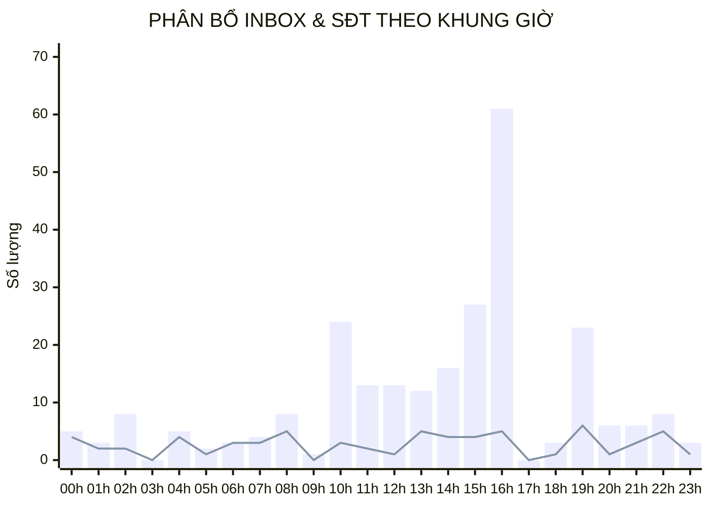
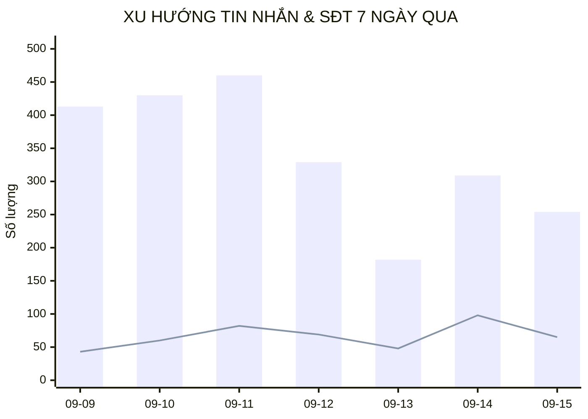

  

    PANCAKE OMNICHANNEL AUDIT · 10 KÊNH TƯƠNG TÁC
  

  <h1 style="margin: 4px 0 10px 0; color: white; border: none; padding: 0; font-size: 26px; font-weight: 800;">
    📊 BÁO CÁO HIỆU SUẤT VẬN HÀNH ĐA KÊNH PANCAKE (NGÀY 15/09/2026)
  </h1>
  

    Kiểm toán chuyên sâu 10 kênh tương tác của Viện Nghiên cứu & Tư vấn Dinh dưỡng NERCI và H&H Nutrition ngày 15/09/2026 (Thứ Ba)
  

  

    📅 <strong>Ngày Báo Cáo:</strong> 15/09/2026 (Thứ Ba)
    👤 <strong>Người Thực Hiện:</strong> Đại Dương (Performance & Operations)
    💬 <strong>Tổng Inbox:</strong> 254
    💬 <strong>Tổng Comment:</strong> 176
    📞 <strong>SĐT Bóc Tách:</strong> 65 (CR: 15.12%)
  

## 🌐 I. BẢNG TỔNG HỢP HIỆU SUẤT THEO 10 KÊNH TƯƠNG TÁC
| Kênh Tương Tác | Nền Tảng | Khách Mới | Tin Nhắn | Bình Luận | SĐT Thu Thập | Tỷ Lệ Chốt SĐT (CR) | Đánh Giá Tác Nghiệp |
| :--- | :---: | :---: | :---: | :---: | :---: | :---: | :--- |
| **BS Hùng Dinh Dưỡng - NERCI** | `TIKTOK` | 110 | **11** | 170 | **2** | `1.1%` | 🟢 **Hiệu Quả Cao** |
| **H&H - Dinh dưỡng tối ưu** | `ZALO` | 5 | **75** | 0 | **3** | `4.0%` | 🟢 **Hiệu Quả Cao** |
| **NERCI Academy - Đào Tạo Chuyên Gia Dinh Dưỡng** | `FACEBOOK` | 33 | **69** | 1 | **37** | `52.9%` | 🟢 **Kênh Chủ Lực Thu Lead** |
| **NERCI - Viện Tư Vấn Dinh Dưỡng** | `FACEBOOK` | 17 | **55** | 1 | **21** | `37.5%` | 🟢 **Kênh Chủ Lực Thu Lead** |
| **Viện Nghiên cứu & Tư vấn dinh dưỡng** | `ZALO` | 6 | **25** | 0 | **2** | `8.0%` | 🟢 **Hiệu Quả Cao** |
| **H&H Nutrition - Sản phẩm dinh dưỡng y học** | `FACEBOOK` | 5 | **11** | 4 | **0** | `0.0%` | 🟡 **Kênh Nuôi Dưỡng Tương Tác** |
| **NERCI.vn - Viện Nghiên Cứu và Tư Vấn Dinh Dưỡng** | `FACEBOOK` | 2 | **7** | 0 | **0** | `0.0%` | 🟡 **Kênh Nuôi Dưỡng Tương Tác** |
| **H&H** | `PKE_CHAT_PLUGIN` | 1 | **1** | 0 | **0** | `0.0%` | 🟡 **Kênh Nuôi Dưỡng Tương Tác** |
| **Cộng đồng Bác sĩ Dinh Dưỡng Việt Nam** | `FACEBOOK` | 0 | **0** | 0 | **0** | `0.0%` | 🟡 **Kênh Nuôi Dưỡng Tương Tác** |
| **Nerci** | `PKE_CHAT_PLUGIN` | 0 | **0** | 0 | **0** | `0.0%` | 🟡 **Kênh Nuôi Dưỡng Tương Tác** |

## ⏰ II. PHÂN BỔ TƯƠNG TÁC & THU THẬP SĐT THEO KHUNG GIỜ (HOURLY HEATMAP)

## 📈 III. XU HƯỚNG TĂNG TRƯỞNG LŨY KẾ 7 NGÀY GẦN NHẤT

## 🏷️ IV. PHÂN BỔ NHÃN DÁN & PHỄU KHÁCH HÀNG (TAG DISTRIBUTION)
Tổng cộng ghi nhận **90** lượt gắn thẻ phân loại trên toàn hệ thống trong ngày:

| Mã Thẻ | Tên Phân Loại | Số Lượt Gắn | Tỷ Lệ (%) | Ý Nghĩa Chuyển Đổi / Vận Hành |
| :---: | :--- | :---: | :---: | :--- |
| `tag_19` | **Chưa phản hồi (Ngưng chat)** | **52** | `57.8%` | Khách hàng ngưng tương tác |
| `tag_18` | **Spam / Rác** | **10** | `11.1%` | Phân loại nick ảo/spam |
| `tag_24` | **F_Tham Khảo (Chưa có nhu cầu ngay)** | **7** | `7.8%` | Khách hỏi thăm báo giá/lộ trình |
| `tag_29` | **Trùng lặp** | **5** | `5.6%` | Tác nghiệp phân loại khách hàng |
| `tag_30` | **Chốt đơn / Khám thành công** | **4** | `4.4%` | Tác nghiệp phân loại khách hàng |
| `tag_21` | **F_Kinh Tế (Rào cản tài chính)** | **4** | `4.4%` | Tác nghiệp phân loại khách hàng |
| `tag_62` | **KBM (Không bắt máy)** | **3** | `3.3%` | Tác nghiệp phân loại khách hàng |
| `tag_27` | **F_Không tồn tại / Khóa máy** | **1** | `1.1%` | Tác nghiệp phân loại khách hàng |
| `tag_23` | **F_Ở Xa (Địa lý)** | **1** | `1.1%` | Tác nghiệp phân loại khách hàng |
| `tag_25` | **F_Hỏi ý kiến người thân** | **1** | `1.1%` | Tác nghiệp phân loại khách hàng |
| `tag_26` | **F_Sắp xếp thời gian** | **1** | `1.1%` | Tác nghiệp phân loại khách hàng |
| `tag_69` | **F_Suy nghĩ thêm** | **1** | `1.1%` | Tác nghiệp phân loại khách hàng |

---
### ⚠️ TUYÊN BỐ MIỄN TRỪ TRÁCH NHIỆM (DISCLAIMER)
*Báo cáo vận hành này được trích xuất tự động và độc lập từ Pancake API trên toàn bộ 10 kênh tương tác của Viện Nghiên cứu & Tư vấn Dinh dưỡng NERCI và H&H Nutrition. Dữ liệu phản ánh 100% thời gian thực phát sinh từ 00:00 đến 23:59 ngày 15/09/2026.*