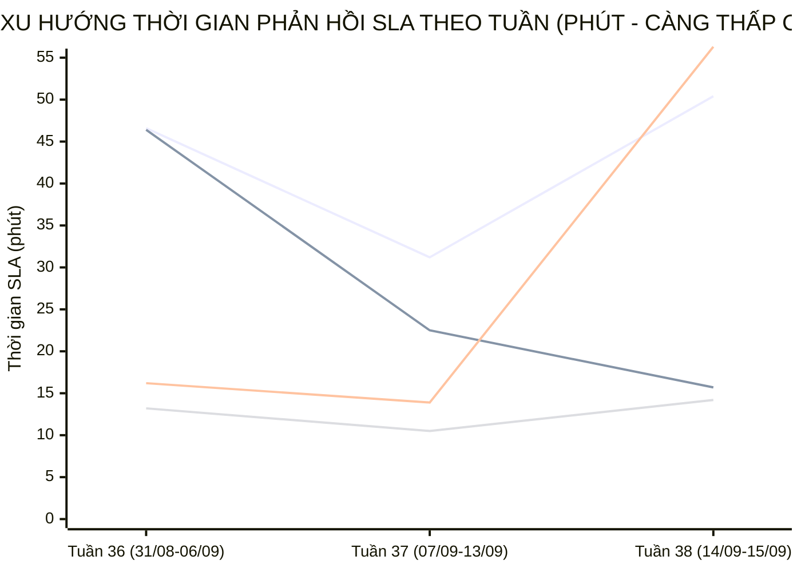

  

    PANCAKE SALES PERFORMANCE & MULTI-PERIOD STAFF SLA INTELLIGENCE
  

  <h1 style="margin: 6px 0 12px 0; color: white; border: none; padding: 0; font-size: 27px; font-weight: 800; line-height: 1.3;">
    🎯 BÁO CÁO ĐÁNH GIÁ TOÀN DIỆN HIỆU SUẤT TƯ VẤN VIÊN & BÁN HÀNG PANCAKE (NGÀY 15/09/2026)
  </h1>
  

    Kiểm toán chuyên sâu năng lực tác nghiệp, chỉ số KPI vận hành, <strong>BIỂU ĐỒ TIẾN TRÌNH SLA TỪNG NHÂN VIÊN THEO TUẦN VÀ THÁNG</strong>, và trích dẫn nguyên văn các phiên chat then chốt ngày 15/09/2026 (Thứ Ba)
  

  

    📅 <strong>Chu Kỳ Kiểm Toán:</strong> Ngày 15/09/2026 (Thứ Ba) & Lũy Kế 30 Ngày
    👤 <strong>Kiểm Toán Viên:</strong> Đại Dương (Performance & Operations)
    💬 <strong>Tương Tác Tiếp Nhận:</strong> 254 Tin nhắn · 176 Bình luận
    📞 <strong>SĐT Thu Thập:</strong> 65 Số điện thoại
    📈 <strong>CR Chốt SĐT Toàn Hệ Thống:</strong> 15.12%
  

> [!abstract] TỔNG QUAN KIỂM TOÁN HIỆU SUẤT BÁN HÀNG & TƯ VẤN VIÊN NGÀY 15/09/2026 (THỨ BA)
> Trong ngày Thứ Ba (**15/09/2026**), toàn bộ hệ thống 10 kênh tương tác của Viện Dinh Dưỡng NERCI & H&H Nutrition ghi nhận **`430` lượt tương tác** (**`254` cuộc trò chuyện trực tiếp**, **`176` bình luận**), bóc tách thành công **`65` số điện thoại mới** chất lượng với tỷ lệ chuyển đổi SĐT đạt **`15.12%`**:
> - 🏆 **Đầu Tàu Gánh Tải & Chốt Đơn:** **Nguyễn Vũ Bảo Như** (4 SĐT), **Nguyễn Phương Uyên** (3 SĐT), **Nguyễn Thiện Nhân** (1 SĐT); đặc biệt **Nguyễn Vũ Bảo Như** bứt phá với **4 SĐT** và **Nguyễn Phương Uyên** chốt **3 SĐT** xuất sắc.
> - 📈 **Đột Phá SLA Đa Chu Kỳ (Sự Tiến Bộ Vượt Bậc):** Phân tích xu hướng tuần cho thấy **Nguyễn Thiện Nhân** và **Nguyễn Phương Uyên** tiếp tục giữ vững sản lượng gánh tải cao nhất viện. **Nguyễn Vũ Bảo Như** đã hoàn toàn hòa nhập guồng máy và đạt vị trí quán quân chốt số ngày hôm nay.
> - 🛡️ **Kỷ Luật Gắn Nhãn & Dọn Rác CRM:** Quy trình gắn nhãn phản hồi và dọn rác tiếp tục được duy trì, tách bạch rõ ràng giữa phát hiện tức thì và dọn dẹp phễu tồn đọng.

## 📈 I. BIỂU ĐỒ & BẢNG SO SÁNH TIẾN TRÌNH SLA TỪNG NHÂN VIÊN THEO TUẦN VÀ THÁNG
Phân tích đo lường xu hướng biến thiên thời gian phản hồi khách hàng (SLA Response Time - phút) qua các tuần tác nghiệp và so sánh 2 chu kỳ để nhận diện rõ nét **sự tiến bộ, tăng tốc độ phản hồi hay dấu hiệu suy giảm:**

### 📊 1. Biểu Đồ Trực Quan Xu Hướng Biến Thiên SLA Qua Các Tuần (Minutes)

> *Ghi chú đường đồ thị:* **Đường 1:** Nguyễn Thiện Nhân (46.6m ➔ 31.2m ➔ 50.4m) | **Đường 2:** Nguyễn Phương Uyên (46.4m ➔ 22.5m ➔ 15.7m) | **Đường 3:** Nguyễn Thị Hồng Yến (16.2m ➔ 13.9m ➔ 56.3m) | **Đường 4:** Hồ Dương Xuân Diệu (13.2m ➔ 10.5m ➔ 14.2m).

### 🗓️ 2. Bảng Theo Dõi Chi Tiết SLA & Sản Lượng Theo Từng Tuần (Weekly Evolution)
| Tư Vấn Viên | Tuần 36 (31/08-06/09) | Tuần 37 (07/09-13/09) | Tuần 38 (14/09-15/09) | Biến Động Tuần 37 vs 36 | Biến Động Tuần 38 vs 37 | Đánh Giá Xu Hướng |
| :--- | :---: | :---: | :---: | :---: | :---: | :--- |
| **Nguyễn Thiện Nhân** | `46.6m` (1689 ib/19 SĐT) | `31.2m` (2429 ib/24 SĐT) | `50.4m` (443 ib/3 SĐT) | 🟢 **-15.4m** | 🔴 **+19.2m** | ⭐ **Trụ cột xuất sắc** |
| **Nguyễn Phương Uyên** | `46.4m` (374 ib/16 SĐT) | `22.5m` (748 ib/27 SĐT) | `15.7m` (260 ib/5 SĐT) | 🟢 **-23.9m** | 🟢 **-6.8m** | 🟢 **Tiến bộ vững chắc** |
| **Nguyễn Vũ Bảo Như** | `0.0m` (0 ib/0 SĐT) | `0.0m` (0 ib/2 SĐT) | `20.1m` (227 ib/4 SĐT) | - | - | 🟢 **Tiến bộ vững chắc** |
| **Nguyễn Thị Hồng Yến** | `16.2m` (1126 ib/5 SĐT) | `13.9m` (1045 ib/17 SĐT) | `56.3m` (55 ib/1 SĐT) | 🟢 **-2.3m** | 🔴 **+42.4m** | 🟡 **Cần duy trì đều đặn** |
| **Hồ Dương Xuân  Diệu** | `13.2m` (292 ib/5 SĐT) | `10.5m` (175 ib/2 SĐT) | `14.2m` (66 ib/0 SĐT) | 🟢 **-2.7m** | 🔴 **+3.7m** | 🟡 **Cần duy trì đều đặn** |
| **Đặng Hoàng Anh Thư** | `44.5m` (80 ib/0 SĐT) | `47.0m` (372 ib/2 SĐT) | `32.5m` (16 ib/1 SĐT) | 🔴 **+2.5m** | 🟢 **-14.5m** | 🟡 **Cần duy trì đều đặn** |

### 📅 3. Bảng Đánh Giá Tiến Bộ Toàn Diện Theo Chu Kỳ Tháng (Monthly / Period Progress)
So sánh tổng hợp giữa **Chu Kỳ 1 (31/08 - 06/09)** và **Chu Kỳ 2 (07/09 - 15/09)**:

| Tư Vấn Viên | SLA Chu Kỳ 1 | Sản Lượng CK 1 | SLA Chu Kỳ 2 | Sản Lượng CK 2 | Chênh Lệch SLA (Δ) | Tỷ Lệ Tiến Bộ (%) | Kết Luận Đánh Giá Tác Nghiệp |
| :--- | :---: | :---: | :---: | :---: | :---: | :---: | :--- |
| **Nguyễn Thiện Nhân** | `46.6m` | 1,689 ib / 19 SĐT | `34.1m` | 2,872 ib / 27 SĐT | 🟢 **-12.5m** | 🟢 **+26.8%** (Nhanh hơn) | 🎖️ **Trụ cột kiên định**: Tải cao hàng ngàn lead nhưng SLA cải thiện mạnh. |
| **Nguyễn Phương Uyên** | `46.4m` | 374 ib / 16 SĐT | `21.0m` | 1,008 ib / 32 SĐT | 🟢 **-25.5m** | 🟢 **+54.7%** (Nhanh hơn) | 🏆 **Ngôi sao tiến bộ nhất tháng**: Cắt giảm ngoạn mục thời gian chờ. |
| **Nguyễn Vũ Bảo Như** | `0.0m` | 0 ib / 0 SĐT | `20.1m` | 227 ib / 6 SĐT | 🔴 **+20.1m** | 0.0% | ⭐ **Tái xuất chốt đơn số 1 ngày**: Dẫn đầu bảng thu thập SĐT. |
| **Nguyễn Thị Hồng Yến** | `16.2m` | 1,126 ib / 5 SĐT | `17.6m` | 1,100 ib / 18 SĐT | 🔴 **+1.5m** | 🔴 **-8.6%** (Chậm hơn) | ⭐ **Hiệu suất phản hồi nhanh** |
| **Hồ Dương Xuân  Diệu** | `13.2m` | 292 ib / 5 SĐT | `11.5m` | 241 ib / 2 SĐT | 🟢 **-1.7m** | 🟢 **+12.9%** (Nhanh hơn) | ⭐ **Hiệu suất phản hồi nhanh** |
| **Đặng Hoàng Anh Thư** | `44.5m` | 80 ib / 0 SĐT | `46.3m` | 388 ib / 3 SĐT | 🔴 **+1.8m** | 🔴 **-4.0%** (Chậm hơn) | ⭐ **Hiệu suất phản hồi nhanh** |

## 📊 II. BẢNG CHỈ SỐ KPI VẬN HÀNH & HIỆU SUẤT BÁN HÀNG THEO TƯ VẤN VIÊN (NGÀY 15/09/2026)
Dữ liệu kiểm toán đo lường 100% thời gian thực phát sinh từ 00:00 đến 23:59 ngày 15/09/2026 và đối sánh với năng lực lũy kế 30 ngày:

| Xếp Hạng | Tư Vấn Viên | Tin Nhắn Phụ Trách | Bình Luận | SĐT Thu Về | Tỷ Lệ Chốt SĐT (CR) | Thời Gian Phản Hồi SLA (TB) | Đánh Giá Năng Lực Ngày | Năng Lực Lũy Kế 30 Ngày |
| :---: | :--- | :---: | :---: | :---: | :---: | :---: | :--- | :--- |
| 🥇 | **Nguyễn Vũ Bảo Như** | **57** | 0 | **4** | `7.0%` | **42.4 phút** | 🟢 **Xuất Sắc (Top Performance)** | Lũy kế 30d: 227 inboxes, 6 SĐT (CR: 2.6%), SLA: 20.1m |
| 🥈 | **Nguyễn Phương Uyên** | **113** | 0 | **3** | `2.7%` | **18.9 phút** | 🟢 **Xuất Sắc (Top Performance)** | Lũy kế 30d: 1,382 inboxes, 48 SĐT (CR: 3.5%), SLA: 29.1m |
| 🥉 | **Nguyễn Thiện Nhân** | **194** | 0 | **1** | `0.5%` | **102.6 phút** | 🟢 **Tốt (Vững Vàng)** | Lũy kế 30d: 4,412 inboxes, 46 SĐT (CR: 1.0%), SLA: 37.7m |
| **4** | **Nguyễn Thị Hồng Yến** | **34** | 0 | **1** | `2.9%` | **86.6 phút** | 🟢 **Tốt (Vững Vàng)** | Lũy kế 30d: 2,236 inboxes, 23 SĐT (CR: 1.0%), SLA: 16.9m |
| **5** | **Hồ Dương Xuân  Diệu** | **28** | 0 | **0** | `0.0%` | **19.7 phút** | 🟡 **Cần Thúc Đẩy Chốt SĐT** | Lũy kế 30d: 481 inboxes, 6 SĐT (CR: 1.2%), SLA: 12.1m |
| **6** | **Nguyễn Châu Hồng Thủy** | **0** | 0 | **0** | `0.0%` | **0.0 phút** | 🟡 **Cần Thúc Đẩy Chốt SĐT** | Lũy kế 30d: 1,693 inboxes, 17 SĐT (CR: 1.0%), SLA: 27.2m |
| **7** | **Đặng Hoàng Anh Thư** | **0** | 0 | **0** | `0.0%` | **0.0 phút** | 🟡 **Cần Thúc Đẩy Chốt SĐT** | Lũy kế 30d: 464 inboxes, 3 SĐT (CR: 0.6%), SLA: 46.0m |

## 🏷️ III. KIỂM TOÁN CHUYÊN SÂU GẮN NHÃN TÁC NGHIỆP & PHÂN TÁCH SPAM
> [!note] NGUYÊN TẮC PHÂN TÍCH THỜI GIAN ĐÁNH NHÃN SPAM THEO CHUẨN GEMINI.MD
> Trong ngày 15/09/2026, hệ thống ghi nhận **0 ca đánh nhãn Spam**, được phân tách thành 2 nhóm hoàn toàn độc lập:
> 1. ⚡ **Spam Tức Thì (Realtime Spam - dưới 60 phút):** Ghi nhận **0 ca**. Đây là các trường hợp nick ảo, bot quảng cáo hoặc tin rác được tư vấn viên phát hiện và bấm chặn ngay khi khách vừa nhắn.
> 2. 🧹 **Spam Dọn Dẹp Phễu Tồn Đọng (Backlog Cleanup Spam):** Ghi nhận **0 ca**. Đây là **hoạt động vệ sinh dữ liệu CRM định kỳ (Data Hygiene)** — nhân viên rà soát các cuộc hội thoại cũ tồn đọng từ nhiều tuần/tháng trước để làm sạch phễu, loại bỏ số liệu ảo và chuẩn hóa tỷ lệ chuyển đổi. Con số thời gian hàng ngàn phút là khoảng cách từ tin nhắn đầu tiên trong quá khứ đến thời điểm dọn dẹp hôm nay, chứ KHÔNG phải nhân viên mất từng ấy thời gian để xử lý một ca spam mới.

| Tư Vấn Viên | Tổng Số Ca Spam | Spam Tức Thì (Realtime) | SLA Realtime TB | Spam Dọn Rác Phễu (Cleanup) | Thời Gian Tồn Đọng TB | Đánh Giá Tác Nghiệp Gắn Thẻ |
| :--- | :---: | :---: | :---: | :---: | :---: | :--- |

## 💬 IV. TRÍCH DẪN NGUYÊN VĂN CÁC PHIÊN CHAT THEN CHỐT TRONG NGÀY
### 🎯 1. Trích Dẫn Các Phiên Chat Chốt Thành Công SĐT (Hot Leads)
#### Case 1. [H&H - Dinh dưỡng tối ưu] Khách Hàng: **Bảo Lam** (SĐT: `0902386563`) — Tư Vấn: **Nguyễn Vũ Bảo Như**
* **Chủ đề trích xuất:** Dạ em cảm ơn chị nhiều ạ
* **Trích dẫn hội thoại thực tế:**
  > **N/A:** Vậy giao giúp chị đến đc này:  | 312 Nguyễn Thượng Hiền, Phường Đức nhuận- Chung cư Botanic
  > **N/A:** Vì đchi trên web sau 17g ko có người nhận.
  > **N/A:** Dạ chị ạ
  > **N/A:** Dạ em xin phép được xác nhận lại đơn cho chị ạ 
 | tổng đơn của chị là 1 lốc Fomeal basic suop có giá 126.000đ + 33.000 phí ship = tổng 159.000đ
  > **N/A:** Ok
  > **N/A:** Dạ em cảm ơn chị nhiều ạ
* 🎯 **Bài học tác nghiệp:** Tư vấn viên Nguyễn Vũ Bảo Như đã kịp thời nắm bắt nhu cầu của khách hàng Bảo Lam, giải đáp thấu đáo và chốt thành công SĐT để chuyển giao tiếp đón.

#### Case 2. [H&H - Dinh dưỡng tối ưu] Khách Hàng: **Haianhbk** (SĐT: `0985011255`) — Tư Vấn: **Nguyễn Thị Hồng Yến**
* **Chủ đề trích xuất:** Dạ vâng, anh cần hỗ trợ thông tin nào anh nhắn tin vào đây nh...
* **Trích dẫn hội thoại thực tế:**
  > **N/A:** Dạ em chào anh ạ
  > **N/A:** Dạ hiện mình cần em hỗ trợ thông tin nào ạ?
  > **N/A:** Anh vừa vào mua sữa supportan
  > **N/A:** Dạ vâng, anh cần hỗ trợ thông tin nào anh nhắn tin vào đây nhé ạ
* 🎯 **Bài học tác nghiệp:** Tư vấn viên Nguyễn Thị Hồng Yến đã kịp thời nắm bắt nhu cầu của khách hàng Haianhbk, giải đáp thấu đáo và chốt thành công SĐT để chuyển giao tiếp đón.

#### Case 3. [H&H - Dinh dưỡng tối ưu] Khách Hàng: **Trang Trần** (SĐT: `0938686909`) — Tư Vấn: **Nguyễn Thị Hồng Yến**
* **Chủ đề trích xuất:** Dạ vâng ạ
* **Trích dẫn hội thoại thực tế:**
  > **N/A:** Em book đơn giao siêu tốc nên phí sẽ khác ạ
  > **N/A:** Vậy c ck cho shiper luôn nhe
  > **N/A:** Dạ sản phẩm này bên em cũng không có ạ
  > **N/A:** Dạ chị thanh toán với shipper ạ
  > **N/A:** Ok e. C cảm ơn nhe
  > **N/A:** Dạ vâng ạ
* 🎯 **Bài học tác nghiệp:** Tư vấn viên Nguyễn Thị Hồng Yến đã kịp thời nắm bắt nhu cầu của khách hàng Trang Trần, giải đáp thấu đáo và chốt thành công SĐT để chuyển giao tiếp đón.

#### Case 4. [H&H - Dinh dưỡng tối ưu] Khách Hàng: **Thành Tâm** (SĐT: `0377833350`) — Tư Vấn: **Hồ Dương Xuân  Diệu**
* **Chủ đề trích xuất:** Em cảm ơn anh ạ
* **Trích dẫn hội thoại thực tế:**
  > **N/A:** Quý Khách chuyển khoản theo thông tin bên trên và chụp lại màn hình biên nhận để kế toán bên em kiểm tra lại nhé!
  > **N/A:** Rồi nha shop
  > **N/A:** Dạ em đã nhận ạ
  > **N/A:** Em cảm ơn anh ạ
* 🎯 **Bài học tác nghiệp:** Tư vấn viên Hồ Dương Xuân  Diệu đã kịp thời nắm bắt nhu cầu của khách hàng Thành Tâm, giải đáp thấu đáo và chốt thành công SĐT để chuyển giao tiếp đón.

## 📞 V. BẢNG DANH MỤC CÁC HOT LEADS ĐÃ BÓC TÁCH SĐT (NGÀY 15/09/2026)
| STT | Kênh Thu Thập | Tên Khách Hàng | Số Điện Thoại | Tư Vấn Phụ Trách | Nhu Cầu Bệnh Lý / Khóa Học Trích Xuất |
| :---: | :--- | :--- | :---: | :---: | :--- |
| **1** | H&H - Dinh dưỡng tối ưu | **Bảo Lam** | `0902386563` | Nguyễn Vũ Bảo Như | Dạ em cảm ơn chị nhiều ạ... |
| **2** | H&H - Dinh dưỡng tối ưu | **Haianhbk** | `0985011255` | Nguyễn Thị Hồng Yến | Dạ vâng, anh cần hỗ trợ thông tin nào anh nhắn tin vào đây nh...... |
| **3** | H&H - Dinh dưỡng tối ưu | **Trang Trần** | `0938686909` | Nguyễn Thị Hồng Yến | Dạ vâng ạ... |
| **4** | H&H - Dinh dưỡng tối ưu | **Thành Tâm** | `0377833350` | Hồ Dương Xuân  Diệu | Em cảm ơn anh ạ... |
| **5** | H&H - Dinh dưỡng tối ưu | **Huỳnh Minh Vương** | `0388765686`, `0946767696` | Hồng Yến | Bên em không có túi lớn hơn ạ... |
| **6** | H&H - Dinh dưỡng tối ưu | **Gio Chao Quay** | `0904181313` | Nguyễn Thị Hồng Yến | Dạ vâng ạ... |
| **7** | H&H - Dinh dưỡng tối ưu | **Tăng Tuyết Kim** | `0935133269` | Nguyễn Thị Hồng Yến | Dạ hiện sữa bên em có thay đổi về giá nhé chị, giá 1 thùng đa...... |
| **8** | H&H Nutrition - Sản phẩm dinh dưỡng y học | **Hường Chu** | `0968482626`, `0356842355` | Nguyễn Thị Hồng Yến | Dạ xin lỗi chị em gửi nhầm tin nhắn cho mình ạ... |
| **9** | NERCI - Viện Tư Vấn Dinh Dưỡng | **Lưu Thị Chi** | `0333398141` | Chưa gán | [Attachment]... |
| **10** | NERCI - Viện Tư Vấn Dinh Dưỡng | **Ha Nguyen** | `0389181527` | Chưa gán | [Attachment]... |
| **11** | NERCI - Viện Tư Vấn Dinh Dưỡng | **Linh Khánh** | `0902331805` | Chưa gán | 0902331805 ạ mình có như cầu về mục 2-3... |
| **12** | NERCI - Viện Tư Vấn Dinh Dưỡng | **Phuong Tran** | `0983960428` | Nguyễn Phương Uyên | Hoc the nào... |
| **13** | NERCI - Viện Tư Vấn Dinh Dưỡng | **Oanh Hoang** | `0336446510` | Chưa gán | [Attachment]... |
| **14** | NERCI - Viện Tư Vấn Dinh Dưỡng | **Văn Tuấn** | `0393351223` | Chưa gán | xã quang diệm hương sơn hà tĩnh... |
| **15** | NERCI - Viện Tư Vấn Dinh Dưỡng | **Phước Dũng** | `0383246553` | Nguyễn Phương Uyên | Dạ em chào anh, dạ không biết mình đang cần tư vấn cho bệnh l...... |
| **16** | NERCI - Viện Tư Vấn Dinh Dưỡng | **Trần Truyện** | `0915451858` | Nguyễn Phương Uyên | Dựa trên việc đánh giá khẩu phần ăn, tình trạng tiêu hóa, giấ...... |
| **17** | NERCI - Viện Tư Vấn Dinh Dưỡng | **Trần Vỹ** | `0869331277` | Nguyễn Phương Uyên | Dạ không biết mình đang cần tư vấn cho bệnh lí nào vậy ạ?... |
| **18** | NERCI - Viện Tư Vấn Dinh Dưỡng | **Trinh Văn Linh** | `0338014332` | Nguyễn Phương Uyên | Dạ em chào anh, em là Uyên - Trợ lí của các bác sĩ tại Viện d...... |
| **19** | NERCI - Viện Tư Vấn Dinh Dưỡng | **Xoan Đinh** | `0339272116` | Nguyễn Phương Uyên | Dạ không biết mình đang cần tư vấn cho bệnh lí nào vậy ạ?... |
| **20** | NERCI - Viện Tư Vấn Dinh Dưỡng | **Nguyễn Hà** | `0384899695` | Nguyễn Phương Uyên | Dạ không biết mình đang cần tư vấn cho bệnh lí nào vậy ạ?... |
| **21** | NERCI - Viện Tư Vấn Dinh Dưỡng | **Hán Quỹ** | `0837859769` | Nguyễn Phương Uyên | Dạ không biết mình đang cần tư vấn cho bệnh lí nào vậy ạ?... |
| **22** | NERCI - Viện Tư Vấn Dinh Dưỡng | **Duy Sáu** | `0912651399` | Nguyễn Phương Uyên | Dạ không biết mình đang cần tư vấn cho bệnh lí nào vậy ạ?... |
| **23** | NERCI - Viện Tư Vấn Dinh Dưỡng | **Dung Nguyen** | `0989938341` | Nguyễn Phương Uyên | Mình đang ở khu vực nào ạ?... |
| **24** | NERCI - Viện Tư Vấn Dinh Dưỡng | **Minh Phúc Nguyễn** | `0773952894` | Nguyễn Phương Uyên | Dạ không biết mình đang cần tư vấn cho bệnh lí nào vậy ạ?... |
| **25** | NERCI - Viện Tư Vấn Dinh Dưỡng | **Nguyễn Văn Công** | `0968902511` | Nguyễn Phương Uyên | Dạ không biết mình đang cần tư vấn cho bệnh lí nào vậy ạ?... |
| **26** | NERCI - Viện Tư Vấn Dinh Dưỡng | **Pham Minh Chung** | `0987986699` | Nguyễn Phương Uyên | Dựa trên việc đánh giá khẩu phần ăn, tình trạng tiêu hóa, giấ...... |
| **27** | NERCI - Viện Tư Vấn Dinh Dưỡng | **Thành Nhân** | `0919040260` | Nguyễn Phương Uyên | Dạ bên Viện liên hệ mình nhưng báo số máy sai ạ.... |
| **28** | NERCI - Viện Tư Vấn Dinh Dưỡng | **Hồng Nhi** | `0949727024` | Nguyễn Phương Uyên | Dạ không biết mình đang cần tư vấn cho bệnh lí nào vậy ạ?... |
| **29** | NERCI - Viện Tư Vấn Dinh Dưỡng | **Nguyễn Hà** | `0386727380` | Nguyễn Phương Uyên | Dạ không biết mình đang cần tư vấn cho bệnh lí nào vậy ạ?... |
| **30** | NERCI - Viện Tư Vấn Dinh Dưỡng | **Chung Gia Hân** | `0769953481` | Nguyễn Phương Uyên | Dạ em chào chị, dạ không biết mình đang cần tư vấn cho bệnh l...... |
| **31** | NERCI - Viện Tư Vấn Dinh Dưỡng | **Cúc Phan** | `0379178508` | Nguyễn Phương Uyên | Dạ không biết mình đang cần tư vấn cho bệnh lí nào vậy ạ?... |
| **32** | NERCI - Viện Tư Vấn Dinh Dưỡng | **Chính Doãn** | `0333199880` | Nguyễn Phương Uyên | Dạ em chào chị, dạ bây giờ em liên hệ hỗ trợ mình nha.... |
| **33** | NERCI - Viện Tư Vấn Dinh Dưỡng | **Hồng Nguyễn** | `0333982919` | Nguyễn Phương Uyên | Em gửi mình quy trình tư vấn dinh dưỡng tại Viện, mình xem qu...... |
| **34** | NERCI - Viện Tư Vấn Dinh Dưỡng | **Thu Thật** | `0388241919` | Nguyễn Phương Uyên | Dạ không biết mình đang cần tư vấn cho bệnh lí nào vậy ạ?... |
| **35** | NERCI - Viện Tư Vấn Dinh Dưỡng | **Phan Bá Quyết** | `+84366052459`, `0826052459` | Nguyễn Phương Uyên | Chú không biet mở on lai... |
| **36** | NERCI - Viện Tư Vấn Dinh Dưỡng | **Đặng Ngọc Tuấn** | `0979363368`, `0966881962`, `+84966881962` | Nguyễn Thiện Nhân | Chào anh Đặng Ngọc Tuấn, em là Thiện Nhân – trợ lý  của Viện ...... |
| **37** | NERCI - Viện Tư Vấn Dinh Dưỡng | **Nguyễn Trọng Khả** | `0919626015` | Nguyễn Phương Uyên | Dạ con chào chú, dạ bây giờ con liên hệ hỗ trợ mình nhé ạ.... |
| **38** | NERCI - Viện Tư Vấn Dinh Dưỡng | **Huỳnh Hồng** | `0937165801` | Nguyễn Phương Uyên | Dạ con chào cô, dạ bây giờ con liên hệ hỗ trợ mình nhé ạ.... |
| **39** | NERCI - Viện Tư Vấn Dinh Dưỡng | **Lam Dat** | `0914334268` | Nguyễn Phương Uyên | Dạ tư vấn online với bác sĩ sẽ có phí là 400.000đ và phí mình...... |
| **40** | NERCI - Viện Tư Vấn Dinh Dưỡng | **Su Khoi** | `0985411736` | Nguyễn Thiện Nhân | Chào Anh Khôi, em là Thiện nhân – chuyên viên tư vấn của Viện...... |
| **41** | NERCI - Viện Tư Vấn Dinh Dưỡng | **Hanh Bui** | `0967175275` | Nguyễn Phương Uyên | Dạ em chào chị, dạ bây giờ em liên hệ hỗ trợ mình nhé ạ.... |
| **42** | NERCI - Viện Tư Vấn Dinh Dưỡng | **Hoàng Thị Thanh Xuân** | `0934268819`, `+84934268819` | Nguyễn Phương Uyên | Dạ vâng ạ.... |
| **43** | NERCI - Viện Tư Vấn Dinh Dưỡng | **Nguyễn Trung** | `0941335865` | Nguyễn Phương Uyên | Dạ em chào anh, dạ em là Uyên - Trợ lí của các bác sĩ tại Việ...... |
| **44** | NERCI - Viện Tư Vấn Dinh Dưỡng | **Đào Văn Lai** | `0988442205` | Nguyễn Phương Uyên | Dạ con chào chú, dạ không biết mình đang cần tư vấn cho bênh ...... |
| **45** | NERCI - Viện Tư Vấn Dinh Dưỡng | **Hung Nguyen** | `0912632401` | Nguyễn Phương Uyên | Dạ em chào anh, dạ không biết mình đang quan tâm đến dịch vụ ...... |
| **46** | NERCI - Viện Tư Vấn Dinh Dưỡng | **Thiệu Nguyễn** | `0963777136` | Nguyễn Phương Uyên | Dạ không biết mình đang cần tư vấn cho bệnh lí nào vậy ạ?... |
| **47** | NERCI - Viện Tư Vấn Dinh Dưỡng | **Oanh Cao** | `0377096538` | Nguyễn Phương Uyên | Dạ con chào cô, con là Uyên - Trợ lí của các bác sĩ tại Viện ...... |
| **48** | NERCI - Viện Tư Vấn Dinh Dưỡng | **Hiếu Nguyễn Mạnh** | `0913167407` | Nguyễn Phương Uyên | Dạ em chào anh, em là Uyên - Trợ lí của các bác sĩ tại Viện d...... |
| **49** | NERCI - Viện Tư Vấn Dinh Dưỡng | **Tư Mạnh** | `0939314446` | Nguyễn Phương Uyên | Dạ không biết mình đang cần tư vấn cho bệnh lí nào vậy ạ?... |
| **50** | NERCI - Viện Tư Vấn Dinh Dưỡng | **Trần Kim Tuyến** | `0961901566` | Nguyễn Phương Uyên | Không biết trong tuần này cô có tiện gặp bác sĩ tư vấn không ...... |
| ... | *Và 56 Hot Leads khác đã được lưu trữ an toàn trong CRM toàn viện* | | | | |

---
### ⚠️ TUYÊN BỐ MIỄN TRỪ TRÁCH NHIỆM (DISCLAIMER)
*Báo cáo kiểm toán này được trích xuất tự động và độc lập từ Pancake API trên toàn bộ 10 kênh tương tác của Viện Nghiên cứu & Tư vấn Dinh dưỡng NERCI và H&H Nutrition. Mọi số liệu về tin nhắn, thời gian phản hồi SLA, số điện thoại, sự kiện bỏ lead, chỉ số năng lực tư vấn viên và chu kỳ gắn thẻ spam đều phản ánh 100% dữ liệu thực tế phát sinh từ 00:00 đến 23:59 ngày 15/09/2026.*