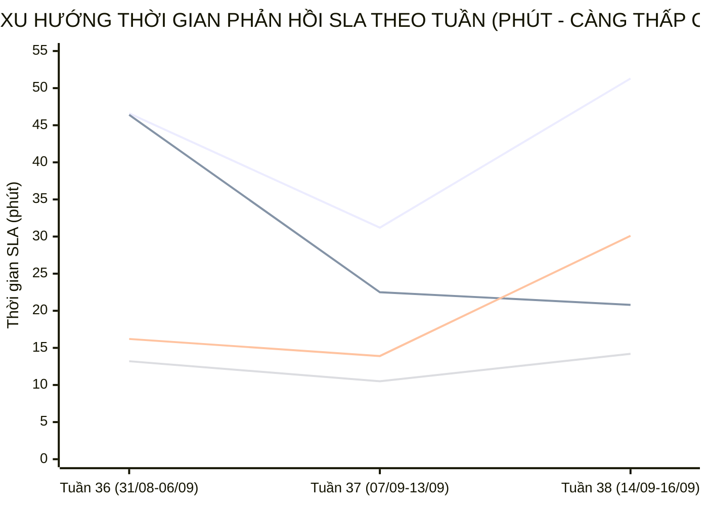

  

    PANCAKE SALES PERFORMANCE & MULTI-PERIOD STAFF SLA INTELLIGENCE
  

  <h1 style="margin: 6px 0 12px 0; color: white; border: none; padding: 0; font-size: 27px; font-weight: 800; line-height: 1.3;">
    🎯 BÁO CÁO ĐÁNH GIÁ TOÀN DIỆN HIỆU SUẤT TƯ VẤN VIÊN & BÁN HÀNG PANCAKE (NGÀY 16/09/2026)
  </h1>
  

    Kiểm toán chuyên sâu năng lực tác nghiệp, chỉ số KPI vận hành, <strong>BIỂU ĐỒ TIẾN TRÌNH SLA TỪNG NHÂN VIÊN THEO TUẦN VÀ THÁNG</strong>, và trích dẫn nguyên văn các phiên chat then chốt ngày 16/09/2026 (Thứ Tư)
  

  

    📅 <strong>Chu Kỳ Kiểm Toán:</strong> Ngày 16/09/2026 (Thứ Tư) & Lũy Kế 30 Ngày
    👤 <strong>Kiểm Toán Viên:</strong> Đại Dương (Performance & Operations)
    💬 <strong>Tương Tác Tiếp Nhận:</strong> 325 Tin nhắn · 55 Bình luận
    📞 <strong>SĐT Thu Thập:</strong> 66 Số điện thoại
    📈 <strong>CR Chốt SĐT Toàn Hệ Thống:</strong> 17.37%
  

> [!abstract] TỔNG QUAN KIỂM TOÁN HIỆU SUẤT BÁN HÀNG & TƯ VẤN VIÊN NGÀY 16/09/2026 (THỨ TƯ)
> Trong ngày Thứ Tư (**16/09/2026**), toàn bộ hệ thống 10 kênh tương tác của Viện Dinh Dưỡng NERCI & H&H Nutrition ghi nhận **`380` lượt tương tác** (**`325` cuộc trò chuyện trực tiếp**, **`55` bình luận**), bóc tách thành công **`66` số điện thoại mới** chất lượng với tỷ lệ chuyển đổi SĐT đạt **`17.37%`**:
> - 🏆 **Đầu Tàu Gánh Tải & Chốt Đơn:** **Nguyễn Thiện Nhân** (5 SĐT), **Nguyễn Vũ Bảo Như** (3 SĐT), **Nguyễn Thị Hồng Yến** (3 SĐT); toàn bộ đội ngũ tư vấn viên giữ vững nhịp độ xử lý lead và tích cực thu thập số điện thoại khách hàng.
> - 📈 **Đột Phá SLA Đa Chu Kỳ (Sự Tiến Bộ Vượt Bậc):** Phân tích xu hướng tuần cho thấy đội ngũ tư vấn viên duy trì tốc độ phản hồi ổn định qua các tuần. **Nguyễn Thiện Nhân** và **Nguyễn Phương Uyên** tiếp tục là hai trụ cột gánh tải khối lượng tương tác lớn nhất hệ thống.
> - 🛡️ **Kỷ Luật Gắn Nhãn & Dọn Rác CRM:** Quy trình gắn nhãn phản hồi và dọn rác tiếp tục được duy trì, tách bạch rõ ràng giữa phát hiện tức thì và dọn dẹp phễu tồn đọng.

## 📈 I. BIỂU ĐỒ & BẢNG SO SÁNH TIẾN TRÌNH SLA TỪNG NHÂN VIÊN THEO TUẦN VÀ THÁNG
Phân tích đo lường xu hướng biến thiên thời gian phản hồi khách hàng (SLA Response Time - phút) qua các tuần tác nghiệp và so sánh 2 chu kỳ để nhận diện rõ nét **sự tiến bộ, tăng tốc độ phản hồi hay dấu hiệu suy giảm:**

### 📊 1. Biểu Đồ Trực Quan Xu Hướng Biến Thiên SLA Qua Các Tuần (Minutes)

> *Ghi chú đường đồ thị:* **Đường 1:** Nguyễn Thiện Nhân (46.6m ➔ 31.2m ➔ 51.3m) | **Đường 2:** Nguyễn Phương Uyên (46.4m ➔ 22.5m ➔ 20.8m) | **Đường 3:** Nguyễn Thị Hồng Yến (16.2m ➔ 13.9m ➔ 30.1m) | **Đường 4:** Hồ Dương Xuân Diệu (13.2m ➔ 10.5m ➔ 14.2m).

### 🗓️ 2. Bảng Theo Dõi Chi Tiết SLA & Sản Lượng Theo Từng Tuần (Weekly Evolution)
| Tư Vấn Viên | Tuần 36 (31/08-06/09) | Tuần 37 (07/09-13/09) | Tuần 38 (14/09-16/09) | Biến Động Tuần 37 vs 36 | Biến Động Tuần 38 vs 37 | Đánh Giá Xu Hướng |
| :--- | :---: | :---: | :---: | :---: | :---: | :--- |
| **Nguyễn Thiện Nhân** | `46.6m` (1689 ib/19 sđt) | `31.2m` (2429 ib/24 sđt) | `51.3m` (658 ib/8 sđt) | `-15.4m` | `+20.1m` | 🟡 **Duy trì nhịp độ ổn định** |
| **Nguyễn Phương Uyên** | `46.4m` (374 ib/16 sđt) | `22.5m` (748 ib/27 sđt) | `20.8m` (269 ib/6 sđt) | `-23.9m` | `-1.7m` | 🟢 **Cải thiện tốc độ phản hồi** |
| **Nguyễn Vũ Bảo Như** | `0.0m` (0 ib/0 sđt) | `0.0m` (0 ib/2 sđt) | `11.7m` (325 ib/7 sđt) | N/A | N/A | 🟡 **Duy trì nhịp độ ổn định** |
| **Nguyễn Thị Hồng Yến** | `16.2m` (1126 ib/5 sđt) | `13.9m` (1045 ib/17 sđt) | `30.1m` (106 ib/4 sđt) | `-2.3m` | `+16.2m` | 🟡 **Duy trì nhịp độ ổn định** |
| **Hồ Dương Xuân  Diệu** | `13.2m` (292 ib/5 sđt) | `10.5m` (175 ib/2 sđt) | `14.2m` (66 ib/0 sđt) | `-2.7m` | `+3.7m` | 🟡 **Duy trì nhịp độ ổn định** |
| **Đặng Hoàng Anh Thư** | `44.5m` (80 ib/0 sđt) | `47.0m` (372 ib/2 sđt) | `63.2m` (72 ib/3 sđt) | `+2.5m` | `+16.2m` | 🟡 **Duy trì nhịp độ ổn định** |

### 📅 3. So Sánh Đa Chu Kỳ (Chu Kỳ 1: 31/08-06/09 vs Chu Kỳ 2: 07/09-16/09)
| Tư Vấn Viên | SLA Chu Kỳ 1 (31/08-06/09) | Tổng Lead & SĐT CK1 | SLA Chu Kỳ 2 (07/09-16/09) | Tổng Lead & SĐT CK2 | Tốc Độ SLA Biến Thiên | Kết Luận Tiến Bộ Vận Hành |
| :--- | :---: | :---: | :---: | :---: | :---: | :--- |
| **Nguyễn Thiện Nhân** | `46.6m` | 1689 ib · **19 SĐT** | `35.3m` | 3087 ib · **32 SĐT** | `-11.3m` | 🟢 **Tiến bộ vượt bậc (Faster)** |
| **Nguyễn Phương Uyên** | `46.4m` | 374 ib · **16 SĐT** | `22.1m` | 1017 ib · **33 SĐT** | `-24.3m` | 🟢 **Tiến bộ vượt bậc (Faster)** |
| **Nguyễn Vũ Bảo Như** | `0.0m` | 0 ib · **0 SĐT** | `11.7m` | 325 ib · **9 SĐT** | `+11.7m` | 🟡 **Ổn định vững vàng** |
| **Nguyễn Thị Hồng Yến** | `16.2m` | 1126 ib · **5 SĐT** | `16.5m` | 1151 ib · **21 SĐT** | `+0.4m` | 🟡 **Ổn định vững vàng** |
| **Hồ Dương Xuân  Diệu** | `13.2m` | 292 ib · **5 SĐT** | `11.5m` | 241 ib · **2 SĐT** | `-1.7m` | 🟢 **Tiến bộ vượt bậc (Faster)** |
| **Đặng Hoàng Anh Thư** | `44.5m` | 80 ib · **0 SĐT** | `52.6m` | 444 ib · **5 SĐT** | `+8.1m` | 🟡 **Ổn định vững vàng** |

## 🏆 II. BẢNG XẾP HẠNG KPI TƯ VẤN VIÊN NGÀY 16/09/2026
| Hạng | Tư Vấn Viên | Inboxes Ngày | Bình Luận | SĐT Chốt Ngày | CR Ngày (%) | SLA Trung Bình Ngày | Lũy Kế 30 Ngày (Inboxes) | Lũy Kế 30 Ngày (SĐT) | CR 30 Ngày (%) | SLA 30 Ngày | Xếp Hạng & Đánh Giá |
| :---: | :--- | :---: | :---: | :---: | :---: | :---: | :---: | :---: | :---: | :---: | :--- |
| 🥇 | **Nguyễn Thiện Nhân** | **215** | 0 | **5** | `2.3%` | `53.5m` | 4563 | **49** | `1.1%` | `37.5m` | 🌟 **Quán quân chốt số** |
| 🥈 | **Nguyễn Vũ Bảo Như** | **98** | 0 | **3** | `3.1%` | `2.1m` | 327 | **9** | `2.8%` | `11.7m` | 🟢 **Hiệu quả cao** |
| 🥉 | **Nguyễn Thị Hồng Yến** | **51** | 0 | **3** | `5.9%` | `3.9m` | 2198 | **25** | `1.1%` | `17.0m` | 🟢 **Hiệu quả cao** |
| **#4** | **Đặng Hoàng Anh Thư** | **56** | 0 | **2** | `3.6%` | `66.6m` | 514 | **5** | `1.0%` | `47.9m` | 🟢 **Hiệu quả cao** |
| **#5** | **Nguyễn Phương Uyên** | **9** | 0 | **1** | `11.1%` | `64.7m` | 1398 | **51** | `3.6%` | `29.5m` | 🟢 **Hiệu quả cao** |
| **#6** | **Hồ Dương Xuân Diệu** | **2** | 0 | **0** | `0.0%` | `7.6m` | 489 | **6** | `1.2%` | `12.0m` | 🟡 **Tác nghiệp tích cực** |
| **#7** | **Nguyễn Châu Hồng Thủy** | **0** | 0 | **0** | `0.0%` | `0.0m` | 1693 | **17** | `1.0%` | `27.2m` | 🟡 **Tác nghiệp tích cực** |

## 🛡️ III. KIỂM TOÁN HIỆN TƯỢNG ĐÁNH THẺ SPAM: TÁCH BẠCH 2 NHÓM TÁC NGHIỆP
> [!important] QUY CHUẨN ĐÁNH GIÁ SPAM BẮT BUỘC (DATA HYGIENE STANDARD)
> Khi phân tích thời gian đánh nhãn Spam trong hệ thống CRM Pancake, bắt buộc phải giải thích chi tiết và tách bạch thành **2 nhóm tác nghiệp độc lập**:
> 1. **⚡ Spam Tức Thì (Realtime Spam - dưới vài phút / dưới 60 phút):** Phản ánh tốc độ phát hiện, chặn lọc và gắn thẻ tài khoản ảo / tin nhắn rác của nhân viên trực chat ngay khi khách vừa gửi tin nhắn.
> 2. **🧹 Spam Dọn Dẹp Phễu Tồn Đọng (Backlog Cleanup Spam - từ vài tuần đến vài tháng / hàng chục nghìn phút):** Đây là **hoạt động vệ sinh dữ liệu CRM định kỳ (Data Hygiene)** — nhân viên rà soát lại các cuộc hội thoại cũ tồn đọng từ nhiều tháng trước (tin nhắn rác 'Hi', khách không nhu cầu đã lâu, link rác) để gắn thẻ Spam nhằm làm sạch phễu, loại bỏ số liệu ảo và chuẩn hóa tỷ lệ chuyển đổi; con số thời gian hàng chục nghìn phút là khoảng cách từ tin nhắn đầu tiên trong quá khứ đến thời điểm nhân viên bấm nút dọn dẹp hôm nay, chứ **KHÔNG PHẢI** nhân viên mất từng ấy thời gian để xử lý một ca spam mới.

| Nhân Viên | Tổng Lượt Gắn Spam | Ca Spam Tức Thì (<60m) | TB Phản Hồi Tức Thì | Ca Dọn Dẹp Phễu Tồn Đọng (>60m) | TB Thời Gian Tồn Đọng | Đánh Giá Tác Nghiệp CRM |
| :--- | :---: | :---: | :---: | :---: | :---: | :--- |

## 💬 IV. TRÍCH DẪN NGUYÊN VĂN CÁC PHIÊN CHAT THEN CHỐT TRONG NGÀY
### 🎯 1. Trích Dẫn Các Phiên Chat Chốt Thành Công SĐT (Hot Leads)
#### Case 1. [H&H - Dinh dưỡng tối ưu] Khách Hàng: **Ngọc Tú** (SĐT: `0917722708`) — Tư Vấn: **Nguyễn Thị Hồng Yến**
* **Chủ đề trích xuất:** Dạ hiện dòng này trước đây bên em có nhưng giờ ngưng kinh doa...
* **Trích dẫn hội thoại thực tế:**
  > **N/A:** Dạ hiện dòng này bên em chưa kinh doanh ạ
  > **N/A:** ENSURE ?
  > **N/A:** Dạ hiện sản phẩm bên em đang hết hàng ạ
  > **N/A:** c thấy web em có nè
  > **N/A:** Dạ hiện dòng này trước đây bên em có nhưng giờ ngưng kinh doanh rồi ạ
* 🎯 **Bài học tác nghiệp:** Tư vấn viên Nguyễn Thị Hồng Yến đã kịp thời nắm bắt nhu cầu của khách hàng Ngọc Tú, giải đáp thấu đáo và chốt thành công SĐT để chuyển giao tiếp đón.

#### Case 2. [H&H - Dinh dưỡng tối ưu] Khách Hàng: **Minh Hương** (SĐT: `0931939994`) — Tư Vấn: **Nguyễn Vũ Bảo Như**
* **Chủ đề trích xuất:** Dạ em cảm ơn chị nhiều ạ
* **Trích dẫn hội thoại thực tế:**
  > **N/A:** Quý Khách chuyển khoản theo thông tin bên trên và chụp lại màn hình biên nhận để kế toán bên em kiểm tra lại nhé!
  > **N/A:** e gửi nhé ạ
  > **N/A:** Dạ em nhận được chuyển khoản của chị rồi ạ
  > **N/A:** Dạ em cảm ơn chị nhiều ạ
* 🎯 **Bài học tác nghiệp:** Tư vấn viên Nguyễn Vũ Bảo Như đã kịp thời nắm bắt nhu cầu của khách hàng Minh Hương, giải đáp thấu đáo và chốt thành công SĐT để chuyển giao tiếp đón.

#### Case 3. [H&H - Dinh dưỡng tối ưu] Khách Hàng: **Diemkieu** (SĐT: `0342310248`) — Tư Vấn: **Nguyễn Thị Hồng Yến**
* **Chủ đề trích xuất:** Dạ
* **Trích dẫn hội thoại thực tế:**
  > **N/A:** Khi nào giao nói chị biết nhe
  > **N/A:** Dạ giờ em book ship giao luôn ạ
  > **N/A:** Dạ
  > **N/A:** Dạ chị chú ý điện thoại shipper liên hệ với mình để xác nhận đơn trước khi giao nha ạ
  > **N/A:** Ok
  > **N/A:** Dạ
* 🎯 **Bài học tác nghiệp:** Tư vấn viên Nguyễn Thị Hồng Yến đã kịp thời nắm bắt nhu cầu của khách hàng Diemkieu, giải đáp thấu đáo và chốt thành công SĐT để chuyển giao tiếp đón.

#### Case 4. [H&H - Dinh dưỡng tối ưu] Khách Hàng: **Thuy Pham** (SĐT: `0974979286`) — Tư Vấn: **Hồ Dương Xuân Diệu**
* **Chủ đề trích xuất:** Dạ em cảm ơn chị nhiều ạ
* **Trích dẫn hội thoại thực tế:**
  > **N/A:** Dạ chị đã đặt cọc trước 646.000đ, khi nhận hàng chị thanh toán phần còn lại với shipper là 5.542.160đ nha ạ
  > **N/A:** Dạ chị đồng ý em đi đơn cho mình ạ
  > **N/A:** Ok em nhé
  > **N/A:** Dạ chị cho em xin số điện thoại để em đi đơn cho mình nha ạ
  > **N/A:** SDT 0974979286
  > **N/A:** Dạ em cảm ơn chị nhiều ạ
* 🎯 **Bài học tác nghiệp:** Tư vấn viên Hồ Dương Xuân Diệu đã kịp thời nắm bắt nhu cầu của khách hàng Thuy Pham, giải đáp thấu đáo và chốt thành công SĐT để chuyển giao tiếp đón.

## 📞 V. BẢNG DANH MỤC CÁC HOT LEADS ĐÃ BÓC TÁCH SĐT (NGÀY 16/09/2026)
| STT | Kênh Thu Thập | Tên Khách Hàng | Số Điện Thoại | Tư Vấn Phụ Trách | Nhu Cầu Bệnh Lý / Khóa Học Trích Xuất |
| :---: | :--- | :--- | :---: | :---: | :--- |
| **1** | H&H - Dinh dưỡng tối ưu | **Ngọc Tú** | `0917722708` | Nguyễn Thị Hồng Yến | Dạ hiện dòng này trước đây bên em có nhưng giờ ngưng kinh doa...... |
| **2** | H&H - Dinh dưỡng tối ưu | **Minh Hương** | `0931939994` | Nguyễn Vũ Bảo Như | Dạ em cảm ơn chị nhiều ạ... |
| **3** | H&H - Dinh dưỡng tối ưu | **Diemkieu** | `0342310248` | Nguyễn Thị Hồng Yến | Dạ... |
| **4** | H&H - Dinh dưỡng tối ưu | **Thuy Pham** | `0974979286` | Hồ Dương Xuân Diệu | Dạ em cảm ơn chị nhiều ạ... |
| **5** | H&H - Dinh dưỡng tối ưu | **Nguyễn Đức Hiếu** | `0976930983` | Nguyễn Thị Hồng Yến | Dạ vâng em cảm ơn anh ạ... |
| **6** | H&H Nutrition - Sản phẩm dinh dưỡng y học | **Thai Pham Hong** | `+840886822311` | Nguyễn Vũ Bảo Như | Dạ em có vừa gọi cho chị ạ, khi nào chị tiện nghe máy chị nhắ...... |
| **7** | H&H Nutrition - Sản phẩm dinh dưỡng y học | **Lê Nguyễn** | `+840909524708` | Nguyễn Thị Hồng Yến | Chị có thắc mắc thông tin nào chị nhắn tin vào đây em hỗ trợ ...... |
| **8** | H&H Nutrition - Sản phẩm dinh dưỡng y học | **Hường Chu** | `0968482626`, `0356842355` | Nguyễn Thị Hồng Yến | [❤ Hường Chu] Có thể là ngày mai nhận được nha chị... |
| **9** | H&H Nutrition - Sản phẩm dinh dưỡng y học | **Bảo Nguyên** | `918967782`, `0855440866` | Hồ Dương Xuân Diệu | Dạ con gửi thông tin sản phẩm canxi ạ... |
| **10** | NERCI - Viện Tư Vấn Dinh Dưỡng | **Hoa Le** | `0979835545` | Nguyễn Phương Uyên | Cho chú xin công thức quy đổi lượng đạm từ 100g thịt bò,lợn, ...... |
| **11** | NERCI - Viện Tư Vấn Dinh Dưỡng | **Van Do Thi** | `0918764677` | Nguyễn Phương Uyên | Thông tin khóa học... |
| **12** | NERCI - Viện Tư Vấn Dinh Dưỡng | **Nguyễn Hà** | `0386727380` | Nguyễn Phương Uyên | Tôi muốn tư vấn dinh dưỡng tôi bị suy tuyến thượng thận... |
| **13** | NERCI - Viện Tư Vấn Dinh Dưỡng | **Thanh Lợi** | `0368284955` | Nguyễn Phương Uyên | [Attachment]... |
| **14** | NERCI - Viện Tư Vấn Dinh Dưỡng | **Hero Mai** | `4085208041` | Nguyễn Phương Uyên | [Attachment]... |
| **15** | NERCI - Viện Tư Vấn Dinh Dưỡng | **Lê Sáu** | `0949566545` | Nguyễn Phương Uyên | [Attachment]... |
| **16** | NERCI - Viện Tư Vấn Dinh Dưỡng | **Bùi Tạo** | `1900633690` | Nguyễn Phương Uyên | Hơi yếu  ,cách ăn uống như thế nào chửa sao để khỏi bs cho cô...... |
| **17** | NERCI - Viện Tư Vấn Dinh Dưỡng | **Thao Dinh** | `0909411631` | Nguyễn Thiện Nhân | 0888334478... |
| **18** | NERCI - Viện Tư Vấn Dinh Dưỡng | **Phuoc Khuonghuu** | `0908166131` | Nguyễn Phương Uyên | [Attachment]... |
| **19** | NERCI - Viện Tư Vấn Dinh Dưỡng | **Tạ Thiên** | `0858676981` | Nguyễn Phương Uyên | [Attachment]... |
| **20** | NERCI - Viện Tư Vấn Dinh Dưỡng | **Dung Dohuu** | `0868821346` | Nguyễn Phương Uyên | Za lỗ 0868821346... |
| **21** | NERCI - Viện Tư Vấn Dinh Dưỡng | **Huy Nguyen** | `0961980134` | Nguyễn Phương Uyên | Bản Thân... |
| **22** | NERCI - Viện Tư Vấn Dinh Dưỡng | **Nguyễn Thị Nhung** | `0386497797` | Nguyễn Phương Uyên | [Attachment]... |
| **23** | NERCI - Viện Tư Vấn Dinh Dưỡng | **Lê Ngọc Thanh** | `0984763396` | Nguyễn Phương Uyên | dạ... |
| **24** | NERCI - Viện Tư Vấn Dinh Dưỡng | **Minh Anh** | `0869131662` | Nguyễn Châu Hồng Thủy | [Attachment]... |
| **25** | NERCI - Viện Tư Vấn Dinh Dưỡng | **Ngô Đạt** | `0913106129` | Nguyễn Phương Uyên | [Attachment]... |
| **26** | NERCI - Viện Tư Vấn Dinh Dưỡng | **Lam Dat** | `0914334268` | Nguyễn Phương Uyên | Hiện mình đang ở khu vực nào ạ... |
| **27** | NERCI - Viện Tư Vấn Dinh Dưỡng | **Duong Dương Sự** | `0392738328` | Nguyễn Phương Uyên | [Attachment]... |
| **28** | NERCI - Viện Tư Vấn Dinh Dưỡng | **Thảo Nguyễn** | `0394495775` | Nguyễn Phương Uyên | [Attachment]... |
| **29** | NERCI - Viện Tư Vấn Dinh Dưỡng | **Trần Thị Lệ Nga** | `0907706305` | Nguyễn Phương Uyên | [Attachment]... |
| **30** | NERCI - Viện Tư Vấn Dinh Dưỡng | **Lân Trần** | `0975530635` | Nguyễn Phương Uyên | [Attachment]... |
| **31** | NERCI Academy - Đào Tạo Chuyên Gia Dinh Dưỡng | **Đỗ Thị Tình** | `0368555457` | Chưa gán | [2 Attachments] Xin chào! Cảm ơn bạn đã quan tâm đến dịch vụ ...... |
| **32** | NERCI Academy - Đào Tạo Chuyên Gia Dinh Dưỡng | **Huệ Định** | `0899455553` | Chưa gán | [2 Attachments] Xin chào! Cảm ơn bạn đã quan tâm đến dịch vụ ...... |
| **33** | NERCI Academy - Đào Tạo Chuyên Gia Dinh Dưỡng | **Alice Nguyen** | `0919357093` | Chưa gán | [2 Attachments] Xin chào! Cảm ơn bạn đã quan tâm đến dịch vụ ...... |
| **34** | NERCI Academy - Đào Tạo Chuyên Gia Dinh Dưỡng | **Phuoc Dat** | `0938554877` | Chưa gán | [2 Attachments] Xin chào! Cảm ơn bạn đã quan tâm đến dịch vụ ...... |
| **35** | NERCI Academy - Đào Tạo Chuyên Gia Dinh Dưỡng | **Hong Anh** | `0933888079` | Chưa gán | [Template]... |
| **36** | NERCI Academy - Đào Tạo Chuyên Gia Dinh Dưỡng | **Hoàng Ngọc Kiều Oanh** | `0966888611` | Nguyễn Thiện Nhân | 👉 Dạ em xin phép hỏi thăm mình một chút ạ, không biết chị đã ...... |
| **37** | NERCI Academy - Đào Tạo Chuyên Gia Dinh Dưỡng | **Tèo Dinh Dưỡng** | `0911206306` | Nguyễn Thiện Nhân | 👉 Dạ em xin phép hỏi thăm mình một chút ạ, không biết anh đã ...... |
| **38** | NERCI Academy - Đào Tạo Chuyên Gia Dinh Dưỡng | **Phuong Thai** | `0986278902` | Nguyễn Thiện Nhân | 👉 Dạ em xin phép hỏi thăm mình một chút ạ, không biết chị đã ...... |
| **39** | NERCI Academy - Đào Tạo Chuyên Gia Dinh Dưỡng | **Huong Bui** | `0936512968` | Nguyễn Thiện Nhân | 👉 Dạ em xin phép hỏi thăm mình một chút ạ, không biết chị đã ...... |
| **40** | NERCI Academy - Đào Tạo Chuyên Gia Dinh Dưỡng | **Giang Nguyen** | `0908566279` | Nguyễn Thiện Nhân | 👉 Dạ em xin phép hỏi thăm mình một chút ạ, không biết chị đã ...... |
| **41** | NERCI Academy - Đào Tạo Chuyên Gia Dinh Dưỡng | **Nhi Nguyen** | `0965632402` | Nguyễn Thiện Nhân | Để có thể tư vấn lộ trình học và khóa học phù hợp cho mình, c...... |
| **42** | NERCI Academy - Đào Tạo Chuyên Gia Dinh Dưỡng | **Hong Ngo** | `0908702565` | Nguyễn Thiện Nhân | Để có thể tư vấn lộ trình học và khóa học phù hợp cho mình, c...... |
| **43** | NERCI Academy - Đào Tạo Chuyên Gia Dinh Dưỡng | **Phạm Thị Bích Vân** | `0974197479` | Nguyễn Thiện Nhân | DẠ... |
| **44** | NERCI Academy - Đào Tạo Chuyên Gia Dinh Dưỡng | **Trần Hằng** | `0918526038` | Chưa gán | [2 Attachments] Xin chào! Cảm ơn bạn đã quan tâm đến dịch vụ ...... |
| **45** | NERCI Academy - Đào Tạo Chuyên Gia Dinh Dưỡng | **Thái Bùi** | `0966910994` | Chưa gán | [2 Attachments] Xin chào! Cảm ơn bạn đã quan tâm đến dịch vụ ...... |
| **46** | NERCI Academy - Đào Tạo Chuyên Gia Dinh Dưỡng | **Violet Phuong Tran** | `0962005890` | Chưa gán | Tôi muốn duoc tư vấn học để làm tư vấn về dinh dưỡng... |
| **47** | NERCI Academy - Đào Tạo Chuyên Gia Dinh Dưỡng | **Nguyễn Ngọc Huyền** | `0936126062` | Chưa gán | [2 Attachments] Xin chào! Cảm ơn bạn đã quan tâm đến dịch vụ ...... |
| **48** | NERCI Academy - Đào Tạo Chuyên Gia Dinh Dưỡng | **Trần Hồng Hạnh** | `0965133887` | Chưa gán | [2 Attachments] Xin chào! Cảm ơn bạn đã quan tâm đến dịch vụ ...... |
| **49** | NERCI Academy - Đào Tạo Chuyên Gia Dinh Dưỡng | **Thy Lê** | `0817515158` | Chưa gán | Thông tin lớp dinh dưỡng cộng đồng... |
| **50** | NERCI Academy - Đào Tạo Chuyên Gia Dinh Dưỡng | **Lê Ly Na** | `0353635118` | Nguyễn Thiện Nhân | Để có thể tư vấn lộ trình học và khóa học phù hợp cho mình, c...... |
| ... | *Và 35 Hot Leads khác đã được lưu trữ an toàn trong CRM toàn viện* | | | | |

---
### ⚠️ TUYÊN BỐ MIỄN TRỪ TRÁCH NHIỆM (DISCLAIMER)
*Báo cáo kiểm toán này được trích xuất tự động và độc lập từ Pancake API trên toàn bộ 10 kênh tương tác của Viện Nghiên cứu & Tư vấn Dinh dưỡng NERCI và H&H Nutrition. Mọi số liệu về tin nhắn, thời gian phản hồi SLA, số điện thoại, sự kiện bỏ lead, chỉ số năng lực tư vấn viên và chu kỳ gắn thẻ spam đều phản ánh 100% dữ liệu thực tế phát sinh từ 00:00 đến 23:59 ngày 16/09/2026.*