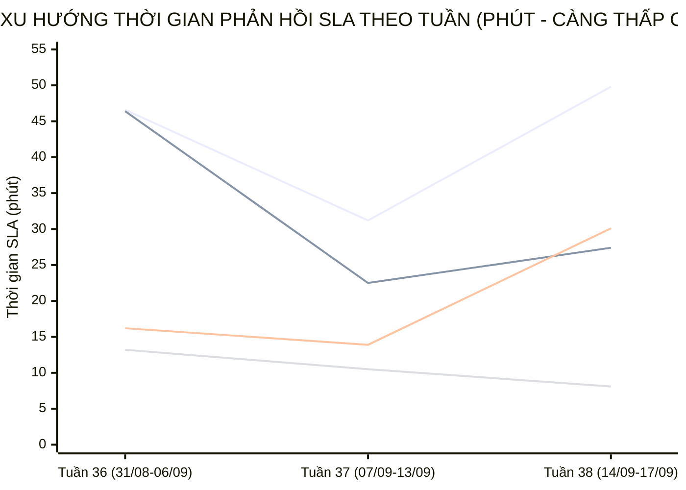

  

    PANCAKE SALES PERFORMANCE & MULTI-PERIOD STAFF SLA INTELLIGENCE
  

  <h1 style="margin: 6px 0 12px 0; color: white; border: none; padding: 0; font-size: 27px; font-weight: 800; line-height: 1.3;">
    🎯 BÁO CÁO ĐÁNH GIÁ TOÀN DIỆN HIỆU SUẤT TƯ VẤN VIÊN & BÁN HÀNG PANCAKE (NGÀY 17/09/2026)
  </h1>
  

    Kiểm toán chuyên sâu năng lực tác nghiệp, chỉ số KPI vận hành, <strong>BIỂU ĐỒ TIẾN TRÌNH SLA TỪNG NHÂN VIÊN THEO TUẦN VÀ THÁNG</strong>, và trích dẫn nguyên văn các phiên chat then chốt ngày 17/09/2026 (Thứ Năm)
  

  

    📅 <strong>Chu Kỳ Kiểm Toán:</strong> Ngày 17/09/2026 (Thứ Năm) & Lũy Kế 30 Ngày
    👤 <strong>Kiểm Toán Viên:</strong> Đại Dương (Performance & Operations)
    💬 <strong>Tương Tác Tiếp Nhận:</strong> 496 Tin nhắn · 80 Bình luận
    📞 <strong>SĐT Thu Thập:</strong> 47 Số điện thoại
    📈 <strong>CR Chốt SĐT Toàn Hệ Thống:</strong> 8.16%
  

> [!abstract] TỔNG QUAN KIỂM TOÁN HIỆU SUẤT BÁN HÀNG & TƯ VẤN VIÊN NGÀY 17/09/2026 (THỨ NĂM)
> Trong ngày Thứ Năm (**17/09/2026**), toàn bộ hệ thống 10 kênh tương tác của Viện Dinh Dưỡng NERCI & H&H Nutrition ghi nhận **`576` lượt tương tác** (**`496` cuộc trò chuyện trực tiếp**, **`80` bình luận**), bóc tách thành công **`47` số điện thoại mới** chất lượng với tỷ lệ chuyển đổi SĐT đạt **`8.16%`**:
> - 🏆 **Đầu Tàu Gánh Tải & Chốt Đơn:** **Nguyễn Phương Uyên** (8 SĐT), **Nguyễn Vũ Bảo Như** (3 SĐT), **Nguyễn Thiện Nhân** (2 SĐT); đặc biệt **Nguyễn Phương Uyên** xuất sắc dẫn đầu với **`8` SĐT** chốt thành công trên 492 tin nhắn tiếp nhận, tiếp sau là **Nguyễn Vũ Bảo Như** (3 SĐT) và **Nguyễn Thiện Nhân** (2 SĐT).
> - 📈 **Đột Phá SLA Đa Chu Kỳ (Sự Tiến Bộ Vượt Bậc):** Phân tích xu hướng tuần cho thấy đội ngũ tư vấn viên duy trì tốc độ phản hồi rất ổn định. **Hồ Dương Xuân Diệu** và **Nguyễn Vũ Bảo Như** liên tục rút ngắn thời gian phản hồi, trong khi **Nguyễn Thiện Nhân** và **Nguyễn Phương Uyên** giữ vững năng lực gánh tải khối lượng tương tác lớn nhất viện.
> - 🛡️ **Kỷ Luật Gắn Nhãn & Dọn Rác CRM:** Hệ thống ghi nhận 13 ca Spam, được phân tách minh bạch thành các ca bắt tức thì (<3 phút) và các ca dọn dẹp phễu tồn đọng phục vụ chuẩn hóa dữ liệu CRM.

## 📈 I. BIỂU ĐỒ & BẢNG SO SÁNH TIẾN TRÌNH SLA TỪNG NHÂN VIÊN THEO TUẦN VÀ THÁNG
Phân tích đo lường xu hướng biến thiên thời gian phản hồi khách hàng (SLA Response Time - phút) qua các tuần tác nghiệp và so sánh 2 chu kỳ để nhận diện rõ nét **sự tiến bộ, tăng tốc độ phản hồi hay dấu hiệu suy giảm:**

### 📊 1. Biểu Đồ Trực Quan Xu Hướng Biến Thiên SLA Qua Các Tuần (Minutes)

> *Ghi chú đường đồ thị:* **Đường 1:** Nguyễn Thiện Nhân (46.6m ➔ 31.2m ➔ 49.8m) | **Đường 2:** Nguyễn Phương Uyên (46.4m ➔ 22.5m ➔ 27.4m) | **Đường 3:** Nguyễn Thị Hồng Yến (16.2m ➔ 13.9m ➔ 30.1m) | **Đường 4:** Hồ Dương Xuân Diệu (13.2m ➔ 10.5m ➔ 8.1m).

### 🗓️ 2. Bảng Theo Dõi Chi Tiết SLA & Sản Lượng Theo Từng Tuần (Weekly Evolution)
| Tư Vấn Viên | Tuần 36 (31/08-06/09) | Tuần 37 (07/09-13/09) | Tuần 38 (14/09-17/09) | Biến Động Tuần 37 vs 36 | Biến Động Tuần 38 vs 37 | Đánh Giá Xu Hướng |
| :--- | :---: | :---: | :---: | :---: | :---: | :--- |
| **Nguyễn Thiện Nhân** | `46.6m` (1689 ib/19 sđt) | `31.2m` (2429 ib/24 sđt) | `49.8m` (852 ib/10 sđt) | `-15.4m` | `+18.6m` | 🟡 **Duy trì nhịp độ ổn định** |
| **Nguyễn Phương Uyên** | `46.4m` (374 ib/16 sđt) | `22.5m` (748 ib/27 sđt) | `27.4m` (761 ib/14 sđt) | `-23.9m` | `+4.9m` | 🟡 **Duy trì nhịp độ ổn định** |
| **Nguyễn Vũ Bảo Như** | `0.0m` (0 ib/0 sđt) | `0.0m` (0 ib/2 sđt) | `9.2m` (474 ib/10 sđt) | N/A | N/A | 🟡 **Duy trì nhịp độ ổn định** |
| **Nguyễn Thị Hồng Yến** | `16.2m` (1126 ib/5 sđt) | `13.9m` (1045 ib/17 sđt) | `30.1m` (106 ib/4 sđt) | `-2.3m` | `+16.2m` | 🟡 **Duy trì nhịp độ ổn định** |
| **Hồ Dương Xuân Diệu** | `13.2m` (292 ib/5 sđt) | `10.5m` (175 ib/2 sđt) | `8.1m` (147 ib/2 sđt) | `-2.7m` | `-2.4m` | 🟢 **Cải thiện tốc độ phản hồi** |
| **Đặng Hoàng Anh Thư** | `44.5m` (80 ib/0 sđt) | `47.0m` (372 ib/2 sđt) | `53.0m` (89 ib/3 sđt) | `+2.5m` | `+6.0m` | 🟡 **Duy trì nhịp độ ổn định** |

### 📅 3. So Sánh Đa Chu Kỳ (Chu Kỳ 1: 31/08-06/09 vs Chu Kỳ 2: 07/09-17/09)
| Tư Vấn Viên | SLA Chu Kỳ 1 (31/08-06/09) | Tổng Lead & SĐT CK1 | SLA Chu Kỳ 2 (07/09-17/09) | Tổng Lead & SĐT CK2 | Tốc Độ SLA Biến Thiên | Kết Luận Tiến Bộ Vận Hành |
| :--- | :---: | :---: | :---: | :---: | :---: | :--- |
| **Nguyễn Thiện Nhân** | `46.6m` | 1689 ib · **19 SĐT** | `35.9m` | 3281 ib · **34 SĐT** | `-10.7m` | 🟢 **Tiến bộ vượt bậc (Faster)** |
| **Nguyễn Phương Uyên** | `46.4m` | 374 ib · **16 SĐT** | `24.2m` | 1509 ib · **41 SĐT** | `-22.2m` | 🟢 **Tiến bộ vượt bậc (Faster)** |
| **Nguyễn Vũ Bảo Như** | `0.0m` | 0 ib · **0 SĐT** | `9.2m` | 474 ib · **12 SĐT** | `+9.2m` | 🟡 **Ổn định vững vàng** |
| **Nguyễn Thị Hồng Yến** | `16.2m` | 1126 ib · **5 SĐT** | `16.5m` | 1151 ib · **21 SĐT** | `+0.4m` | 🟡 **Ổn định vững vàng** |
| **Hồ Dương Xuân Diệu** | `13.2m` | 292 ib · **5 SĐT** | `9.5m` | 322 ib · **4 SĐT** | `-3.8m` | 🟢 **Tiến bộ vượt bậc (Faster)** |
| **Đặng Hoàng Anh Thư** | `44.5m` | 80 ib · **0 SĐT** | `49.3m` | 461 ib · **5 SĐT** | `+4.8m` | 🟡 **Ổn định vững vàng** |

## 🏆 II. BẢNG XẾP HẠNG KPI TƯ VẤN VIÊN NGÀY 17/09/2026
| Hạng | Tư Vấn Viên | Inboxes Ngày | Bình Luận | SĐT Chốt Ngày | CR Ngày (%) | SLA Trung Bình Ngày | Lũy Kế 30 Ngày (Inboxes) | Lũy Kế 30 Ngày (SĐT) | CR 30 Ngày (%) | SLA 30 Ngày | Xếp Hạng & Đánh Giá |
| :---: | :--- | :---: | :---: | :---: | :---: | :---: | :---: | :---: | :---: | :---: | :--- |
| 🥇 | **Nguyễn Phương Uyên** | **492** | 0 | **8** | `1.6%` | `37.0m` | 2015 | **64** | `3.2%` | `30.8m` | 🌟 **Quán quân chốt số** |
| 🥈 | **Nguyễn Vũ Bảo Như** | **149** | 0 | **3** | `2.0%` | `5.9m` | 618 | **12** | `1.9%` | `9.1m` | 🔥 **Đầu tàu gánh tải** |
| 🥉 | **Nguyễn Thiện Nhân** | **194** | 0 | **2** | `1.0%` | `45.3m` | 4679 | **49** | `1.0%` | `36.4m` | 🔥 **Đầu tàu gánh tải** |
| **#4** | **Hồ Dương Xuân Diệu** | **79** | 0 | **2** | `2.5%` | `2.1m` | 590 | **9** | `1.5%` | `10.5m` | 🟢 **Hiệu quả cao** |
| **#5** | **Đặng Hoàng Anh Thư** | **17** | 0 | **0** | `0.0%` | `1.7m` | 542 | **5** | `0.9%` | `43.7m` | 🟡 **Tác nghiệp tích cực** |
| **#6** | **Nguyễn Châu Hồng Thủy** | **0** | 0 | **0** | `0.0%` | `0.0m` | 1693 | **19** | `1.1%` | `27.2m` | 🟡 **Tác nghiệp tích cực** |
| **#7** | **Nguyễn Thị Hồng Yến** | **0** | 0 | **0** | `0.0%` | `0.0m` | 2109 | **25** | `1.2%` | `17.5m` | 🟡 **Tác nghiệp tích cực** |

## 🛡️ III. KIỂM TOÁN HIỆN TƯỢNG ĐÁNH THẺ SPAM: TÁCH BẠCH 2 NHÓM TÁC NGHIỆP
> [!important] QUY CHUẨN ĐÁNH GIÁ SPAM BẮT BUỘC (DATA HYGIENE STANDARD)
> Khi phân tích thời gian đánh nhãn Spam trong hệ thống CRM Pancake, bắt buộc phải giải thích chi tiết và tách bạch thành **2 nhóm tác nghiệp độc lập**:
> 1. **⚡ Spam Tức Thì (Realtime Spam - dưới vài phút / dưới 60 phút):** Phản ánh tốc độ phát hiện, chặn lọc và gắn thẻ tài khoản ảo / tin nhắn rác của nhân viên trực chat ngay khi khách vừa gửi tin nhắn.
> 2. **🧹 Spam Dọn Dẹp Phễu Tồn Đọng (Backlog Cleanup Spam - từ vài tuần đến vài tháng / hàng chục nghìn phút):** Đây là **hoạt động vệ sinh dữ liệu CRM định kỳ (Data Hygiene)** — nhân viên rà soát lại các cuộc hội thoại cũ tồn đọng từ nhiều tháng trước (tin nhắn rác 'Hi', khách không nhu cầu đã lâu, link rác) để gắn thẻ Spam nhằm làm sạch phễu, loại bỏ số liệu ảo và chuẩn hóa tỷ lệ chuyển đổi; con số thời gian hàng chục nghìn phút là khoảng cách từ tin nhắn đầu tiên trong quá khứ đến thời điểm nhân viên bấm nút dọn dẹp hôm nay, chứ **KHÔNG PHẢI** nhân viên mất từng ấy thời gian để xử lý một ca spam mới.

| Nhân Viên | Tổng Lượt Gắn Spam | Ca Spam Tức Thì (<60m) | TB Phản Hồi Tức Thì | Ca Dọn Dẹp Phễu Tồn Đọng (>60m) | TB Thời Gian Tồn Đọng | Đánh Giá Tác Nghiệp CRM |
| :--- | :---: | :---: | :---: | :---: | :---: | :--- |
| **Nguyễn Vũ Bảo Như** | **3** | `1` ca | `0.8m` | `2` ca | `947m` | Gắn nhãn chuẩn xác, tích cực dọn phễu |
| **Chưa gán** | **6** | `0` ca | `0.0m` | `6` ca | `627m` | Gắn nhãn chuẩn xác, tích cực dọn phễu |
| **Nguyễn Thị Hồng Yến** | **1** | `0` ca | `0.0m` | `1` ca | `748m` | Gắn nhãn chuẩn xác, tích cực dọn phễu |
| **Nguyễn Phương Uyên** | **1** | `1` ca | `2.6m` | `0` ca | `0m` | Gắn nhãn chuẩn xác, tích cực dọn phễu |
| **Nguyễn Thiện Nhân** | **2** | `2` ca | `27.0m` | `0` ca | `0m` | Gắn nhãn chuẩn xác, tích cực dọn phễu |

## 💬 IV. TRÍCH DẪN NGUYÊN VĂN CÁC PHIÊN CHAT THEN CHỐT TRONG NGÀY
### 🎯 1. Trích Dẫn Các Phiên Chat Chốt Thành Công SĐT (Hot Leads)
#### Case 1. [H&H - Dinh dưỡng tối ưu] Khách Hàng: **Thutam** (SĐT: `0797186989`) — Tư Vấn: **Hồ Dương Xuân Diệu**
* **Chủ đề trích xuất:** Do giờ cao điểm nên sẽ hơi lâu xíu ạ
* **Trích dẫn hội thoại thực tế:**
  > **N/A:** Em cảm ơn chị ạ
  > **N/A:** nào giờ vẫn giao c ck sau mà
  > **N/A:** Dạ chị thông cảm nha, do công ty thay đổi nội quy nên bên em bắt buộc phải tuân theo ạ
  > **N/A:** e giao chua
  > **N/A:** Dạ shipper đang trên đường giao nha chị
  > **N/A:** Do giờ cao điểm nên sẽ hơi lâu xíu ạ
* 🎯 **Bài học tác nghiệp:** Tư vấn viên Hồ Dương Xuân Diệu đã kịp thời nắm bắt nhu cầu của khách hàng Thutam, giải đáp thấu đáo và chốt thành công SĐT để chuyển giao tiếp đón.

#### Case 2. [H&H - Dinh dưỡng tối ưu] Khách Hàng: **Lê Huy Hưng** (SĐT: `0909325152`) — Tư Vấn: **Nguyễn Vũ Bảo Như**
* **Chủ đề trích xuất:** Dạ vâng ạ
* **Trích dẫn hội thoại thực tế:**
  > **N/A:** Dạ em cảm ơn anh ạ
  > **N/A:** Đơn hàng a đi chưa e
  > **N/A:** Khoản nào a nhận đc
  > **N/A:** Dạ đơn của anh đã đi lúc 11h45 rồi ạ, bên giao hàng sẽ giao trong vòng 90 phút cho anh ạ
  > **N/A:** Ok em
  > **N/A:** Dạ vâng ạ
* 🎯 **Bài học tác nghiệp:** Tư vấn viên Nguyễn Vũ Bảo Như đã kịp thời nắm bắt nhu cầu của khách hàng Lê Huy Hưng, giải đáp thấu đáo và chốt thành công SĐT để chuyển giao tiếp đón.

#### Case 3. [H&H - Dinh dưỡng tối ưu] Khách Hàng: **Thanh Duy** (SĐT: `0966434465`) — Tư Vấn: **Hồ Dương Xuân Diệu**
* **Chủ đề trích xuất:** Dạ vâng ạ
* **Trích dẫn hội thoại thực tế:**
  > **N/A:** Dạ được ạ, nhưng nếu tối nay mưa thì sẽ không có shipper nhận đơn nhé anh
  > **N/A:** Cũng đúng
  > **N/A:** Vậy nhờ shop giao bây h luôn nha
  > **N/A:** Dạ vậy giờ em giao qua luôn nhen
  > **N/A:** Được shop
  > **N/A:** Dạ vâng ạ
* 🎯 **Bài học tác nghiệp:** Tư vấn viên Hồ Dương Xuân Diệu đã kịp thời nắm bắt nhu cầu của khách hàng Thanh Duy, giải đáp thấu đáo và chốt thành công SĐT để chuyển giao tiếp đón.

#### Case 4. [H&H - Dinh dưỡng tối ưu] Khách Hàng: **Thanh Ngọc** (SĐT: `0337606846`) — Tư Vấn: **Hồ Dương Xuân Diệu**
* **Chủ đề trích xuất:** Dạ vâng ạ, em cảm ơn chị ạ
* **Trích dẫn hội thoại thực tế:**
  > **N/A:** giao qua liền luôn đúng ko ạ
  > **N/A:** Thông tin người nhận: Thanh Ngọc 0337 606 846
  > **N/A:** Dạ tổng đơn của chị 1 lốc supportan là: 516.000đ + 40.000đ phí giao hàng= 556.000đ ạ, bên em giao trong vòng 1-2 tiếng mình nhận được hàng ạ
  > **N/A:** ok shop nha
  > **N/A:** book ship luôn giúp mình nha
  > **N/A:** Dạ vâng ạ, em cảm ơn chị ạ
* 🎯 **Bài học tác nghiệp:** Tư vấn viên Hồ Dương Xuân Diệu đã kịp thời nắm bắt nhu cầu của khách hàng Thanh Ngọc, giải đáp thấu đáo và chốt thành công SĐT để chuyển giao tiếp đón.

## 📞 V. BẢNG DANH MỤC CÁC HOT LEADS ĐÃ BÓC TÁCH SĐT (NGÀY 17/09/2026)
| STT | Kênh Thu Thập | Tên Khách Hàng | Số Điện Thoại | Tư Vấn Phụ Trách | Nhu Cầu Bệnh Lý / Khóa Học Trích Xuất |
| :---: | :--- | :--- | :---: | :---: | :--- |
| **1** | H&H - Dinh dưỡng tối ưu | **Thutam** | `0797186989` | Hồ Dương Xuân Diệu | Do giờ cao điểm nên sẽ hơi lâu xíu ạ... |
| **2** | H&H - Dinh dưỡng tối ưu | **Lê Huy Hưng** | `0909325152` | Nguyễn Vũ Bảo Như | Dạ vâng ạ... |
| **3** | H&H - Dinh dưỡng tối ưu | **Thanh Duy** | `0966434465` | Hồ Dương Xuân Diệu | Dạ vâng ạ... |
| **4** | H&H - Dinh dưỡng tối ưu | **Thanh Ngọc** | `0337606846` | Hồ Dương Xuân Diệu | Dạ vâng ạ, em cảm ơn chị ạ... |
| **5** | H&H - Dinh dưỡng tối ưu | **Hà Huỳnh** | `0333690048` | Nguyễn Vũ Bảo Như | Dạ em gửi chị nha... |
| **6** | H&H - Dinh dưỡng tối ưu | **Mai Xuân** | `0982707819` | Hồ Dương Xuân Diệu | Giờ em giao qua luôn ạ... |
| **7** | H&H - Dinh dưỡng tối ưu | **Bích Phụng** | `0908141443` | Nguyễn Vũ Bảo Như | Dạ chị... |
| **8** | H&H - Dinh dưỡng tối ưu | **taku** | `0902643455` | Hồ Dương Xuân Diệu | Dạ hiện dòng này bên em ngưng kinh doanh rồi ạ... |
| **9** | NERCI - Viện Tư Vấn Dinh Dưỡng | **Tiger Lee** | `0906145856` | Nguyễn Phương Uyên | Cho người thân... |
| **10** | NERCI - Viện Tư Vấn Dinh Dưỡng | **Dung Dohuu** | `0868821346` | Nguyễn Phương Uyên | Bản Thân... |
| **11** | NERCI - Viện Tư Vấn Dinh Dưỡng | **Liễu Nguyễn** | `0989548346` | Nguyễn Phương Uyên | 0989548346... |
| **12** | NERCI - Viện Tư Vấn Dinh Dưỡng | **Lam Dong** | `0908128933` | Nguyễn Phương Uyên | Dạ vâng ạ... |
| **13** | NERCI - Viện Tư Vấn Dinh Dưỡng | **Huân Vũ Văn** | `0972178141` | Nguyễn Phương Uyên | - Trong quá trình tư vấn các Bác Sĩ sẽ giải đáp các thắc mắc ...... |
| **14** | NERCI - Viện Tư Vấn Dinh Dưỡng | **Hoa Le** | `0979835545` | Nguyễn Phương Uyên | Dạ nếu chú đang còn băn khoăn về dịch vụ của Viện thì mình có...... |
| **15** | NERCI - Viện Tư Vấn Dinh Dưỡng | **Chien Do Van** | `0982848419` | Nguyễn Phương Uyên | Dạ vậy trong tuần này anh tiện ngày nào nhắn em hỗ trợ mình n...... |
| **16** | NERCI Academy - Đào Tạo Chuyên Gia Dinh Dưỡng | **Nguyễn Lộc** | `0939897978` | Nguyễn Thiện Nhân | [2 Attachments] Xin chào! Cảm ơn bạn đã quan tâm đến dịch vụ ...... |
| **17** | NERCI Academy - Đào Tạo Chuyên Gia Dinh Dưỡng | **Đỗ Tiến Dũng** | `0977991626` | Nguyễn Thiện Nhân | Để có thể tư vấn lộ trình học và khóa học phù hợp cho mình, a...... |
| **18** | NERCI Academy - Đào Tạo Chuyên Gia Dinh Dưỡng | **Han Huynh Phung Vo** | `0389914745` | Nguyễn Thiện Nhân | [❤ Han Huynh Phung Vo]... |
| **19** | NERCI Academy - Đào Tạo Chuyên Gia Dinh Dưỡng | **Lê Thị Trà** | `0978409081` | Nguyễn Thiện Nhân | Để có thể tư vấn lộ trình học và khóa học phù hợp cho mình, c...... |
| **20** | NERCI Academy - Đào Tạo Chuyên Gia Dinh Dưỡng | **Phú Phụng** | `0332357138` | Nguyễn Thiện Nhân | Để có thể tư vấn lộ trình học và khóa học phù hợp cho mình, c...... |
| **21** | NERCI Academy - Đào Tạo Chuyên Gia Dinh Dưỡng | **Anh Le** | `0925807668` | Nguyễn Thiện Nhân | 3 á bạn... |
| **22** | NERCI Academy - Đào Tạo Chuyên Gia Dinh Dưỡng | **Truc Phuong** | `0903318544` | Nguyễn Thiện Nhân | Để có thể tư vấn lộ trình học và khóa học phù hợp cho mình, a...... |
| **23** | NERCI Academy - Đào Tạo Chuyên Gia Dinh Dưỡng | **Trần Tuyết** | `0868896318` | Nguyễn Thiện Nhân | Để có thể tư vấn lộ trình học và khóa học phù hợp cho mình, c...... |
| **24** | NERCI Academy - Đào Tạo Chuyên Gia Dinh Dưỡng | **Phuc Nguyen** | `+84918367168`, `0918367168` | Nguyễn Thiện Nhân | Dạ em gửi anh  thông tin Khóa học XÂY DỰNG THỰC ĐƠN như sau ạ...... |
| **25** | NERCI Academy - Đào Tạo Chuyên Gia Dinh Dưỡng | **Trung Quoc** | `0398398324` | Nguyễn Thiện Nhân | Dạ không khóa học này phù hợp với mình không ạ? Chị quan tâm ...... |
| **26** | NERCI Academy - Đào Tạo Chuyên Gia Dinh Dưỡng | **Lê Lam** | `0333989432` | Nguyễn Thiện Nhân | để em tư vấn khóa học phù hợp này cho mình ạ... |
| **27** | NERCI Academy - Đào Tạo Chuyên Gia Dinh Dưỡng | **Viet Kim Tuyen** | `0942518839` | Nguyễn Thiện Nhân | Để có thể tư vấn lộ trình học và khóa học phù hợp cho mình, c...... |
| **28** | NERCI Academy - Đào Tạo Chuyên Gia Dinh Dưỡng | **Trần Hồng Hạnh** | `0965133887` | Nguyễn Thiện Nhân | Để có thể tư vấn lộ trình học và khóa học phù hợp cho mình, c...... |
| **29** | NERCI Academy - Đào Tạo Chuyên Gia Dinh Dưỡng | **Nguyễn Ngọc Huyền** | `0936126062` | Nguyễn Thiện Nhân | Để có thể tư vấn lộ trình học và khóa học phù hợp cho mình, c...... |
| **30** | NERCI Academy - Đào Tạo Chuyên Gia Dinh Dưỡng | **Thái Bùi** | `0966910994` | Nguyễn Thiện Nhân | Để có thể tư vấn lộ trình học và khóa học phù hợp cho mình, a...... |
| **31** | NERCI Academy - Đào Tạo Chuyên Gia Dinh Dưỡng | **Trần Hằng** | `0918526038` | Nguyễn Thiện Nhân | Để có thể tư vấn lộ trình học và khóa học phù hợp cho mình, c...... |
| **32** | NERCI Academy - Đào Tạo Chuyên Gia Dinh Dưỡng | **Phuoc Dat** | `0938554877` | Nguyễn Thiện Nhân | Để có thể tư vấn lộ trình học và khóa học phù hợp cho mình, a...... |
| **33** | NERCI Academy - Đào Tạo Chuyên Gia Dinh Dưỡng | **Đỗ Thị Tình** | `0368555457` | Nguyễn Thiện Nhân | Để có thể tư vấn lộ trình học và khóa học phù hợp cho mình, c...... |
| **34** | NERCI Academy - Đào Tạo Chuyên Gia Dinh Dưỡng | **Alice Nguyen** | `0919357093` | Nguyễn Thiện Nhân | Để có thể tư vấn lộ trình học và khóa học phù hợp cho mình, c...... |
| **35** | NERCI Academy - Đào Tạo Chuyên Gia Dinh Dưỡng | **Vy An Bình** | `0399943431` | Nguyễn Thiện Nhân | Để có thể tư vấn lộ trình học và khóa học phù hợp cho mình, c...... |
| **36** | NERCI Academy - Đào Tạo Chuyên Gia Dinh Dưỡng | **Diệu Châu** | `0988691458` | Nguyễn Thiện Nhân | Để có thể tư vấn lộ trình học và khóa học phù hợp cho mình, c...... |
| **37** | NERCI Academy - Đào Tạo Chuyên Gia Dinh Dưỡng | **Thu Ha Le** | `0934120379` | Nguyễn Thiện Nhân | Để có thể tư vấn lộ trình học và khóa học phù hợp cho mình, c...... |
| **38** | NERCI Academy - Đào Tạo Chuyên Gia Dinh Dưỡng | **Cám Đà Thành** | `0905933915` | Nguyễn Thiện Nhân | Để có thể tư vấn lộ trình học và khóa học phù hợp cho mình, a...... |
| **39** | NERCI Academy - Đào Tạo Chuyên Gia Dinh Dưỡng | **Trần Minh Thư** | `0925366248` | Nguyễn Thiện Nhân | Để có thể tư vấn lộ trình học và khóa học phù hợp cho mình, c...... |
| **40** | NERCI Academy - Đào Tạo Chuyên Gia Dinh Dưỡng | **Huệ Định** | `0899455553` | Nguyễn Thiện Nhân | Để có thể tư vấn lộ trình học và khóa học phù hợp cho mình, c...... |
| **41** | NERCI Academy - Đào Tạo Chuyên Gia Dinh Dưỡng | **Hong Anh** | `0933888079` | Nguyễn Thiện Nhân | Để có thể tư vấn lộ trình học và khóa học phù hợp cho mình, c...... |
| **42** | NERCI Academy - Đào Tạo Chuyên Gia Dinh Dưỡng | **Violet Phuong Tran** | `0962005890` | Nguyễn Thiện Nhân | Để có thể tư vấn lộ trình học và khóa học phù hợp cho mình, c...... |
| **43** | NERCI Academy - Đào Tạo Chuyên Gia Dinh Dưỡng | **Thy Lê** | `0817515158` | Nguyễn Thiện Nhân | Để có thể tư vấn lộ trình học và khóa học phù hợp cho mình, c...... |
| **44** | NERCI Academy - Đào Tạo Chuyên Gia Dinh Dưỡng | **Đào Thị Loan** | `0328862680` | Nguyễn Thiện Nhân | để em hỗ trợ sớm cho mình ak... |
| **45** | NERCI Academy - Đào Tạo Chuyên Gia Dinh Dưỡng | **Nguyễn Thuỳ Trúc Linh** | `0789944566` | Nguyễn Thiện Nhân | Hình thức học:
 -  Lý thuyết:  36 buổi, học Online qua Zoom
 - ...... |
| **46** | NERCI Academy - Đào Tạo Chuyên Gia Dinh Dưỡng | **DH Kim Chi** | `0938938671` | Nguyễn Thiện Nhân | Khóa học được thiết kế theo lộ trình 5 Module, giúp học viên ...... |
| **47** | NERCI Academy - Đào Tạo Chuyên Gia Dinh Dưỡng | **Thu Hiền Nguyễn** | `0902541972` | Nguyễn Thiện Nhân | Khóa học được thiết kế theo lộ trình 5 Module, giúp học viên ...... |
| **48** | NERCI Academy - Đào Tạo Chuyên Gia Dinh Dưỡng | **Lucia Nguyen** | `0971443014` | Nguyễn Thiện Nhân | Dạ không biết lộ trình học này có phù hợp với mình chứ ạ?... |
| **49** | NERCI.vn - Viện Nghiên Cứu và Tư Vấn Dinh Dưỡng | **Bodhini Phạm Yoga** | `0917140907` | Nguyễn Thiện Nhân | em có kết bạn zalo chị đồng ý em thêm mình vào nhóm học ạ... |
| **50** | BS Hùng Dinh Dưỡng - NERCI | **ChiChi** | `0919008868` | Nguyễn Thiện Nhân | C muốn đặt lịch ngày 20/9 . Liên hệ dùm c nha !... |
| ... | *Và 3 Hot Leads khác đã được lưu trữ an toàn trong CRM toàn viện* | | | | |

---
### ⚠️ TUYÊN BỐ MIỄN TRỪ TRÁCH NHIỆM (DISCLAIMER)
*Báo cáo kiểm toán này được trích xuất tự động và độc lập từ Pancake API trên toàn bộ 10 kênh tương tác của Viện Nghiên cứu & Tư vấn Dinh dưỡng NERCI và H&H Nutrition. Mọi số liệu về tin nhắn, thời gian phản hồi SLA, số điện thoại, sự kiện bỏ lead, chỉ số năng lực tư vấn viên và chu kỳ gắn thẻ spam đều phản ánh 100% dữ liệu thực tế phát sinh từ 00:00 đến 23:59 ngày 17/09/2026.*