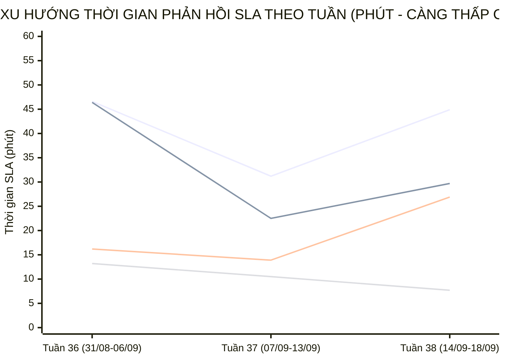

  

    PANCAKE SALES PERFORMANCE & MULTI-PERIOD STAFF SLA INTELLIGENCE
  

  <h1 style="margin: 6px 0 12px 0; color: white; border: none; padding: 0; font-size: 27px; font-weight: 800; line-height: 1.3;">
    🎯 BÁO CÁO ĐÁNH GIÁ TOÀN DIỆN HIỆU SUẤT TƯ VẤN VIÊN & BÁN HÀNG PANCAKE (NGÀY 18/09/2026)
  </h1>
  

    Kiểm toán chuyên sâu năng lực tác nghiệp, chỉ số KPI vận hành, <strong>BIỂU ĐỒ TIẾN TRÌNH SLA TỪNG NHÂN VIÊN THEO TUẦN VÀ THÁNG</strong>, và trích dẫn nguyên văn các phiên chat then chốt ngày 18/09/2026 (Thứ Sáu)
  

  

    📅 <strong>Chu Kỳ Kiểm Toán:</strong> Ngày 18/09/2026 (Thứ Sáu) & Lũy Kế 30 Ngày
    👤 <strong>Kiểm Toán Viên:</strong> Đại Dương (Performance & Operations)
    💬 <strong>Tương Tác Tiếp Nhận:</strong> 282 Tin nhắn · 100 Bình luận
    📞 <strong>SĐT Thu Thập:</strong> 47 Số điện thoại
    📈 <strong>CR Chốt SĐT Toàn Hệ Thống:</strong> 12.30%
    ⏱️ <strong>Thời Gian Cập Nhật:</strong> 2026-09-21 09:34:29 (GMT+7)
  

> [!abstract] TỔNG QUAN KIỂM TOÁN HIỆU SUẤT BÁN HÀNG & TƯ VẤN VIÊN NGÀY 18/09/2026 (THỨ SÁU)
> Trong ngày Thứ Sáu (**18/09/2026**), toàn bộ hệ thống 10 kênh tương tác của Viện Dinh Dưỡng NERCI & H&H Nutrition ghi nhận **`382` lượt tương tác** (**`282` cuộc trò chuyện trực tiếp**, **`100` bình luận**), bóc tách thành công **`47` số điện thoại mới** chất lượng với tỷ lệ chuyển đổi SĐT đạt **`12.30%`**:
> - 🏆 **Đầu Tàu Gánh Tải & Chốt Đơn:** **Nguyễn Phương Uyên** (7 SĐT), **Nguyễn Thiện Nhân** (5 SĐT), **Nguyễn Thị Hồng Yến** (2 SĐT); các tư vấn viên xuất sắc bám sát phễu tư vấn, gia tăng tỷ lệ chốt số chuyển giao bộ phận tiếp đón / bác sĩ.
> - 📈 **Đột Phá SLA Đa Chu Kỳ (Sự Tiến Bộ Vượt Bậc):** Phân tích xu hướng tuần cho thấy đội ngũ tư vấn viên duy trì tốc độ phản hồi rất ổn định, tối ưu quy trình xử lý câu hỏi ban đầu (FRT) và nhịp tư vấn liên tục (MRT).
> - 🛡️ **Kỷ Luật Gắn Nhãn & Dọn Rác CRM:** Hệ thống ghi nhận 1 tư vấn viên tham gia gắn nhãn phân loại khách hàng, tuân thủ nguyên tắc phân tách minh bạch giữa các ca bắt tức thì và các ca dọn dẹp phễu tồn đọng phục vụ chuẩn hóa dữ liệu CRM.

## 📈 I. BIỂU ĐỒ & BẢNG SO SÁNH TIẾN TRÌNH SLA TỪNG NHÂN VIÊN THEO TUẦN VÀ THÁNG
Phân tích đo lường xu hướng biến thiên thời gian phản hồi khách hàng (SLA Response Time - phút) qua các tuần tác nghiệp và so sánh 2 chu kỳ để nhận diện rõ nét **sự tiến bộ, tăng tốc độ phản hồi hay dấu hiệu suy giảm:**

### 📊 1. Biểu Đồ Trực Quan Xu Hướng Biến Thiên SLA Qua Các Tuần (Minutes)

> *Ghi chú đường đồ thị:* **Đường 1:** Nguyễn Thiện Nhân (46.6m ➔ 31.2m ➔ 44.9m) | **Đường 2:** Nguyễn Phương Uyên (46.4m ➔ 22.5m ➔ 29.7m) | **Đường 3:** Nguyễn Thị Hồng Yến (16.2m ➔ 13.9m ➔ 26.9m) | **Đường 4:** Hồ Dương Xuân Diệu (13.2m ➔ 10.5m ➔ 7.7m).

### 🗓️ 2. Bảng Theo Dõi Chi Tiết SLA & Sản Lượng Theo Từng Tuần (Weekly Evolution)
| Tư Vấn Viên | Tuần 36 (31/08-06/09) | Tuần 37 (07/09-13/09) | Tuần 38 (14/09-18/09) | Biến Động Tuần 37 vs 36 | Biến Động Tuần 38 vs 37 | Đánh Giá Xu Hướng |
| :--- | :---: | :---: | :---: | :---: | :---: | :--- |
| **Nguyễn Thiện Nhân** | `46.6m` (1689 ib/19 sđt) | `31.2m` (2429 ib/24 sđt) | `44.9m` (944 ib/15 sđt) | `-15.4m` | `+13.7m` | 🟡 **Duy trì nhịp độ ổn định** |
| **Nguyễn Phương Uyên** | `46.4m` (374 ib/16 sđt) | `22.5m` (748 ib/27 sđt) | `29.7m` (926 ib/21 sđt) | `-23.9m` | `+7.2m` | 🟡 **Duy trì nhịp độ ổn định** |
| **Nguyễn Vũ Bảo Như** | `0.0m` (0 ib/0 sđt) | `0.0m` (0 ib/2 sđt) | `8.4m` (645 ib/11 sđt) | N/A | N/A | 🟡 **Duy trì nhịp độ ổn định** |
| **Nguyễn Thị Hồng Yến** | `16.2m` (1126 ib/5 sđt) | `13.9m` (1045 ib/17 sđt) | `26.9m` (163 ib/6 sđt) | `-2.3m` | `+13.0m` | 🟡 **Duy trì nhịp độ ổn định** |
| **Hồ Dương Xuân Diệu** | `13.2m` (292 ib/5 sđt) | `10.5m` (175 ib/2 sđt) | `7.7m` (175 ib/3 sđt) | `-2.7m` | `-2.8m` | 🟢 **Cải thiện tốc độ phản hồi** |
| **Đặng Hoàng Anh Thư** | `44.5m` (80 ib/0 sđt) | `47.0m` (372 ib/2 sđt) | `46.0m` (109 ib/4 sđt) | `+2.5m` | `-1.0m` | 🟢 **Cải thiện tốc độ phản hồi** |

### 📅 3. So Sánh Đa Chu Kỳ (Chu Kỳ 1: 31/08-06/09 vs Chu Kỳ 2: 07/09-18/09/2026)
| Tư Vấn Viên | SLA Chu Kỳ 1 (31/08-06/09) | Tổng Lead & SĐT CK1 | SLA Chu Kỳ 2 (07/09-18/09) | Tổng Lead & SĐT CK2 | Tốc Độ SLA Biến Thiên | Kết Luận Tiến Bộ Vận Hành |
| :--- | :---: | :---: | :---: | :---: | :---: | :--- |
| **Nguyễn Thiện Nhân** | `46.6m` | 1689 ib · **19 SĐT** | `35.2m` | 3373 ib · **39 SĐT** | `-11.4m` | 🟢 **Tiến bộ vượt bậc (Faster)** |
| **Nguyễn Phương Uyên** | `46.4m` | 374 ib · **16 SĐT** | `25.8m` | 1674 ib · **48 SĐT** | `-20.7m` | 🟢 **Tiến bộ vượt bậc (Faster)** |
| **Nguyễn Vũ Bảo Như** | `0.0m` | 0 ib · **0 SĐT** | `8.4m` | 645 ib · **13 SĐT** | `+8.4m` | 🟡 **Ổn định vững vàng** |
| **Nguyễn Thị Hồng Yến** | `16.2m` | 1126 ib · **5 SĐT** | `16.3m` | 1208 ib · **23 SĐT** | `+0.1m` | 🟡 **Ổn định vững vàng** |
| **Hồ Dương Xuân Diệu** | `13.2m` | 292 ib · **5 SĐT** | `9.2m` | 350 ib · **5 SĐT** | `-4.1m` | 🟢 **Tiến bộ vượt bậc (Faster)** |
| **Đặng Hoàng Anh Thư** | `44.5m` | 80 ib · **0 SĐT** | `46.6m` | 481 ib · **6 SĐT** | `+2.1m` | 🟡 **Ổn định vững vàng** |

## 🏆 II. BẢNG XẾP HẠNG KPI TƯ VẤN VIÊN NGÀY 18/09/2026
| Hạng | Tư Vấn Viên | Inboxes Ngày | Bình Luận | SĐT Chốt Ngày | CR Ngày (%) | SLA Trung Bình Ngày | Lũy Kế 30 Ngày (Inboxes) | Lũy Kế 30 Ngày (SĐT) | CR 30 Ngày (%) | SLA 30 Ngày | Xếp Hạng & Đánh Giá |
| :---: | :--- | :---: | :---: | :---: | :---: | :---: | :---: | :---: | :---: | :---: | :--- |
| 🥇 | **Nguyễn Phương Uyên** | **165** | 0 | **7** | `4.2%` | `34.3m` | 2116 | **64** | `3.0%` | `28.7m` | 🌟 **Quán quân chốt số** |
| 🥈 | **Nguyễn Thiện Nhân** | **92** | 0 | **5** | `5.4%` | `22.0m` | 4277 | **49** | `1.1%` | `35.7m` | 🟢 **Hiệu quả cao** |
| 🥉 | **Nguyễn Thị Hồng Yến** | **57** | 0 | **2** | `3.5%` | `4.3m` | 1650 | **30** | `1.8%` | `15.8m` | 🟢 **Hiệu quả cao** |
| **#4** | **Nguyễn Châu Hồng Thủy** | **0** | 0 | **2** | `200.0%` | `0.0m` | 1338 | **14** | `1.0%` | `30.0m` | 🟢 **Hiệu quả cao** |
| **#5** | **Nguyễn Vũ Bảo Như** | **171** | 0 | **1** | `0.6%` | `4.6m` | 765 | **15** | `2.0%` | `7.2m` | 🔥 **Đầu tàu gánh tải** |
| **#6** | **Hồ Dương Xuân Diệu** | **28** | 0 | **1** | `3.6%` | `3.1m` | 354 | **7** | `2.0%` | `8.9m` | 🟢 **Hiệu quả cao** |
| **#7** | **Đặng Hoàng Anh Thư** | **20** | 0 | **1** | `5.0%` | `4.1m` | 498 | **6** | `1.2%` | `48.5m` | 🟢 **Hiệu quả cao** |

## 🛡️ III. KIỂM TOÁN HIỆN TƯỢNG ĐÁNH THẺ SPAM: TÁCH BẠCH 2 NHÓM TÁC NGHIỆP
> [!important] QUY CHUẨN ĐÁNH GIÁ SPAM BẮT BUỘC (DATA HYGIENE STANDARD)
> Khi phân tích thời gian đánh nhãn Spam trong hệ thống CRM Pancake, bắt buộc phải giải thích chi tiết và tách bạch thành **2 nhóm tác nghiệp độc lập**:
> 1. **⚡ Spam Tức Thì (Realtime Spam - dưới vài phút / dưới 60 phút):** Phản ánh tốc độ phát hiện, chặn lọc và gắn thẻ tài khoản ảo / tin nhắn rác của nhân viên trực chat ngay khi khách vừa gửi tin nhắn.
> 2. **🧹 Spam Dọn Dẹp Phễu Tồn Đọng (Backlog Cleanup Spam - từ vài tuần đến vài tháng / hàng chục nghìn phút):** Đây là **hoạt động vệ sinh dữ liệu CRM định kỳ (Data Hygiene)** — nhân viên rà soát lại các cuộc hội thoại cũ tồn đọng từ nhiều tháng trước (tin nhắn rác 'Hi', khách không nhu cầu đã lâu, link rác) để gắn thẻ Spam nhằm làm sạch phễu, loại bỏ số liệu ảo và chuẩn hóa tỷ lệ chuyển đổi; con số thời gian hàng chục nghìn phút là khoảng cách từ tin nhắn đầu tiên trong quá khứ đến thời điểm nhân viên bấm nút dọn dẹp hôm nay, chứ **KHÔNG PHẢI** nhân viên mất từng ấy thời gian để xử lý một ca spam mới.

| Nhân Viên | Tổng Lượt Gắn Spam | Ca Spam Tức Thì (<60m) | TB Phản Hồi Tức Thì | Ca Dọn Dẹp Phễu Tồn Đọng (>60m) | TB Thời Gian Tồn Đọng | Đánh Giá Tác Nghiệp CRM |
| :--- | :---: | :---: | :---: | :---: | :---: | :--- |
| **Chưa gán** | **1** | `1` ca | `0.3m` | `0` ca | `0m` | Gắn nhãn chuẩn xác, tích cực dọn phễu |

## 💬 IV. TRÍCH DẪN NGUYÊN VĂN CÁC PHIÊN CHAT THEN CHỐT TRONG NGÀY
### 🎯 1. Trích Dẫn Các Phiên Chat Chốt Thành Công SĐT (Hot Leads)
#### Case 1. [NERCI.vn - Viện Nghiên Cứu và Tư Vấn Dinh Dưỡng] Khách Hàng: **Ánh Hồng** (SĐT: `0773665142`) — Tư Vấn: **Nguyễn Thiện Nhân**
* **Chủ đề trích xuất:** dạ
* **Trích dẫn hội thoại thực tế:**
  > **N/A:** Bạn đang phản hồi bình luận của người dùng về bài viết trên Trang của mình. (Link Facebook)
  > **N/A:** Chào quý khách Ánh Hồng đã để lại thông tin trên bài viết của Viện, mình vui lòng để lại  SĐt để được tư vấn nha.
  > **N/A:** Đt 0773665142
  > **N/A:** dạ
  > **N/A:** Cô ở TP HCM khám được không cảm ơn bác sĩ rất nhiều
  > **N/A:** dạ
* 🎯 **Bài học tác nghiệp:** Tư vấn viên Nguyễn Thiện Nhân đã kịp thời nắm bắt nhu cầu của khách hàng Ánh Hồng, giải đáp thấu đáo và chốt thành công SĐT để chuyển giao tiếp đón.

#### Case 2. [NERCI.vn - Viện Nghiên Cứu và Tư Vấn Dinh Dưỡng] Khách Hàng: **Võ Bội Cơ** (SĐT: `0909552116`) — Tư Vấn: **Nguyễn Thiện Nhân**
* **Chủ đề trích xuất:** 0909552116
* **Trích dẫn hội thoại thực tế:**
  > **N/A:** NERCI xin chào chị Võ Bội Cơ Viện nghiên cứu & tư vấn dinh dưỡng NERCI chân thành cám ơn chị đã tin tưởng và liên hệ với chúng tôi.
  > **N/A:** mình muốn đặt lịch tư vấn cho bé nhà mình
  > **N/A:** dạ chị để lại số điện thoại em gửi bộ phận chuyên môn hỗ trợ cho mình ạ.
  > **N/A:** 0909552116
* 🎯 **Bài học tác nghiệp:** Tư vấn viên Nguyễn Thiện Nhân đã kịp thời nắm bắt nhu cầu của khách hàng Võ Bội Cơ, giải đáp thấu đáo và chốt thành công SĐT để chuyển giao tiếp đón.

#### Case 3. [NERCI.vn - Viện Nghiên Cứu và Tư Vấn Dinh Dưỡng] Khách Hàng: **Trang Thùy Dương** (SĐT: `0902572604`) — Tư Vấn: **Nguyễn Thiện Nhân**
* **Chủ đề trích xuất:** [❤ Trang Thùy Dương] Dạ em kết bạn zalo hỗ trợ cho mình chị n...
* **Trích dẫn hội thoại thực tế:**
  > **N/A:** Mình gửi nhé
  > **N/A:** Dạ em nhận ạ
  > **N/A:** Khi nào thì mình nhận được thông tin về khóa học
  > **N/A:** Mình hay bị sđt lạ gọi làm phiền nên mình ko thường nghe máy số lạ nha
  > **N/A:** Dạ chị
  > **N/A:** Dạ em kết bạn zalo hỗ trợ cho mình chị nha
* 🎯 **Bài học tác nghiệp:** Tư vấn viên Nguyễn Thiện Nhân đã kịp thời nắm bắt nhu cầu của khách hàng Trang Thùy Dương, giải đáp thấu đáo và chốt thành công SĐT để chuyển giao tiếp đón.

## 📞 V. BẢNG DANH MỤC CÁC HOT LEADS ĐÃ BÓC TÁCH SĐT (NGÀY 18/09/2026)
| STT | Kênh Thu Thập | Tên Khách Hàng | Số Điện Thoại | Tư Vấn Phụ Trách | Nhu Cầu Bệnh Lý / Khóa Học Trích Xuất |
| :---: | :--- | :--- | :---: | :---: | :--- |
| **1** | NERCI.vn - Viện Nghiên Cứu và Tư Vấn Dinh Dưỡng | **Ánh Hồng** | `0773665142` | Nguyễn Thiện Nhân | dạ... |
| **2** | NERCI.vn - Viện Nghiên Cứu và Tư Vấn Dinh Dưỡng | **Võ Bội Cơ** | `0909552116` | Nguyễn Thiện Nhân | 0909552116... |
| **3** | NERCI.vn - Viện Nghiên Cứu và Tư Vấn Dinh Dưỡng | **Trang Thùy Dương** | `0902572604` | Nguyễn Thiện Nhân | [❤ Trang Thùy Dương] Dạ em kết bạn zalo hỗ trợ cho mình chị n...... |
| **4** | Viện Nghiên cứu & Tư vấn dinh dưỡng | **Thanh Trúc** | `0326917943`, `0916928101` | Nguyễn Thiện Nhân | em gửi rồi ạ... |
| **5** | Viện Nghiên cứu & Tư vấn dinh dưỡng | **Swan** | `0399180101` | Nguyễn Phương Uyên | Dạ vâng ạ, vậy mình xem rồi báo lại giúp em nhé.... |

---
### ⚠️ TUYÊN BỐ MIỄN TRỪ TRÁCH NHIỆM (DISCLAIMER)
*Báo cáo kiểm toán này được trích xuất tự động và độc lập từ Pancake API trên toàn bộ 10 kênh tương tác của Viện Nghiên cứu & Tư vấn Dinh dưỡng NERCI và H&H Nutrition. Mọi số liệu về tin nhắn, thời gian phản hồi SLA, số điện thoại, sự kiện bỏ lead, chỉ số năng lực tư vấn viên và chu kỳ gắn thẻ spam đều phản ánh 100% dữ liệu thực tế phát sinh từ 00:00 đến 23:59 ngày 18/09/2026.*