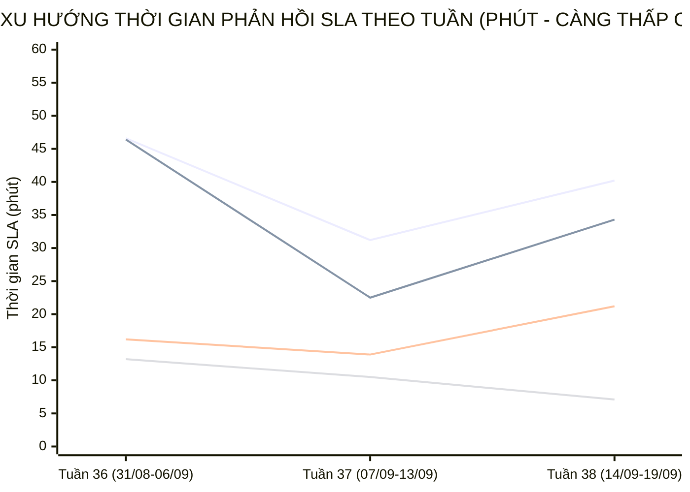

  

    PANCAKE SALES PERFORMANCE & MULTI-PERIOD STAFF SLA INTELLIGENCE
  

  <h1 style="margin: 6px 0 12px 0; color: white; border: none; padding: 0; font-size: 27px; font-weight: 800; line-height: 1.3;">
    🎯 BÁO CÁO ĐÁNH GIÁ TOÀN DIỆN HIỆU SUẤT TƯ VẤN VIÊN & BÁN HÀNG PANCAKE (NGÀY 19/09/2026)
  </h1>
  

    Kiểm toán chuyên sâu năng lực tác nghiệp, chỉ số KPI vận hành, <strong>BIỂU ĐỒ TIẾN TRÌNH SLA TỪNG NHÂN VIÊN THEO TUẦN VÀ THÁNG</strong>, và trích dẫn nguyên văn các phiên chat then chốt ngày 19/09/2026 (Thứ Bảy)
  

  

    📅 <strong>Chu Kỳ Kiểm Toán:</strong> Ngày 19/09/2026 (Thứ Bảy) & Lũy Kế 30 Ngày
    👤 <strong>Kiểm Toán Viên:</strong> Đại Dương (Performance & Operations)
    💬 <strong>Tương Tác Tiếp Nhận:</strong> 368 Tin nhắn · 149 Bình luận
    📞 <strong>SĐT Thu Thập:</strong> 61 Số điện thoại
    📈 <strong>CR Chốt SĐT Toàn Hệ Thống:</strong> 11.80%
    ⏱️ <strong>Thời Gian Cập Nhật:</strong> 2026-09-21 09:34:29 (GMT+7)
  

> [!abstract] TỔNG QUAN KIỂM TOÁN HIỆU SUẤT BÁN HÀNG & TƯ VẤN VIÊN NGÀY 19/09/2026 (THỨ BẢY)
> Trong ngày Thứ Bảy (**19/09/2026**), toàn bộ hệ thống 10 kênh tương tác của Viện Dinh Dưỡng NERCI & H&H Nutrition ghi nhận **`517` lượt tương tác** (**`368` cuộc trò chuyện trực tiếp**, **`149` bình luận**), bóc tách thành công **`61` số điện thoại mới** chất lượng với tỷ lệ chuyển đổi SĐT đạt **`11.80%`**:
> - 🏆 **Đầu Tàu Gánh Tải & Chốt Đơn:** **Nguyễn Phương Uyên** (8 SĐT), **Nguyễn Thiện Nhân** (4 SĐT), **Nguyễn Vũ Bảo Như** (2 SĐT); các tư vấn viên xuất sắc bám sát phễu tư vấn, gia tăng tỷ lệ chốt số chuyển giao bộ phận tiếp đón / bác sĩ.
> - 📈 **Đột Phá SLA Đa Chu Kỳ (Sự Tiến Bộ Vượt Bậc):** Phân tích xu hướng tuần cho thấy đội ngũ tư vấn viên duy trì tốc độ phản hồi rất ổn định, tối ưu quy trình xử lý câu hỏi ban đầu (FRT) và nhịp tư vấn liên tục (MRT).
> - 🛡️ **Kỷ Luật Gắn Nhãn & Dọn Rác CRM:** Hệ thống ghi nhận 3 tư vấn viên tham gia gắn nhãn phân loại khách hàng, tuân thủ nguyên tắc phân tách minh bạch giữa các ca bắt tức thì và các ca dọn dẹp phễu tồn đọng phục vụ chuẩn hóa dữ liệu CRM.

## 📈 I. BIỂU ĐỒ & BẢNG SO SÁNH TIẾN TRÌNH SLA TỪNG NHÂN VIÊN THEO TUẦN VÀ THÁNG
Phân tích đo lường xu hướng biến thiên thời gian phản hồi khách hàng (SLA Response Time - phút) qua các tuần tác nghiệp và so sánh 2 chu kỳ để nhận diện rõ nét **sự tiến bộ, tăng tốc độ phản hồi hay dấu hiệu suy giảm:**

### 📊 1. Biểu Đồ Trực Quan Xu Hướng Biến Thiên SLA Qua Các Tuần (Minutes)

> *Ghi chú đường đồ thị:* **Đường 1:** Nguyễn Thiện Nhân (46.6m ➔ 31.2m ➔ 40.2m) | **Đường 2:** Nguyễn Phương Uyên (46.4m ➔ 22.5m ➔ 34.3m) | **Đường 3:** Nguyễn Thị Hồng Yến (16.2m ➔ 13.9m ➔ 21.2m) | **Đường 4:** Hồ Dương Xuân Diệu (13.2m ➔ 10.5m ➔ 7.1m).

### 🗓️ 2. Bảng Theo Dõi Chi Tiết SLA & Sản Lượng Theo Từng Tuần (Weekly Evolution)
| Tư Vấn Viên | Tuần 36 (31/08-06/09) | Tuần 37 (07/09-13/09) | Tuần 38 (14/09-19/09) | Biến Động Tuần 37 vs 36 | Biến Động Tuần 38 vs 37 | Đánh Giá Xu Hướng |
| :--- | :---: | :---: | :---: | :---: | :---: | :--- |
| **Nguyễn Thiện Nhân** | `46.6m` (1689 ib/19 sđt) | `31.2m` (2429 ib/24 sđt) | `40.2m` (1158 ib/19 sđt) | `-15.4m` | `+9.0m` | 🟡 **Duy trì nhịp độ ổn định** |
| **Nguyễn Phương Uyên** | `46.4m` (374 ib/16 sđt) | `22.5m` (748 ib/27 sđt) | `34.3m` (1179 ib/29 sđt) | `-23.9m` | `+11.8m` | 🟡 **Duy trì nhịp độ ổn định** |
| **Nguyễn Vũ Bảo Như** | `0.0m` (0 ib/0 sđt) | `0.0m` (0 ib/2 sđt) | `7.2m` (765 ib/13 sđt) | N/A | N/A | 🟡 **Duy trì nhịp độ ổn định** |
| **Nguyễn Thị Hồng Yến** | `16.2m` (1126 ib/5 sđt) | `13.9m` (1045 ib/17 sđt) | `21.2m` (245 ib/8 sđt) | `-2.3m` | `+7.3m` | 🟡 **Duy trì nhịp độ ổn định** |
| **Hồ Dương Xuân Diệu** | `13.2m` (292 ib/5 sđt) | `10.5m` (175 ib/2 sđt) | `7.1m` (179 ib/4 sđt) | `-2.7m` | `-3.4m` | 🟢 **Cải thiện tốc độ phản hồi** |
| **Đặng Hoàng Anh Thư** | `44.5m` (80 ib/0 sđt) | `47.0m` (372 ib/2 sđt) | `46.0m` (117 ib/4 sđt) | `+2.5m` | `-1.0m` | 🟢 **Cải thiện tốc độ phản hồi** |

### 📅 3. So Sánh Đa Chu Kỳ (Chu Kỳ 1: 31/08-06/09 vs Chu Kỳ 2: 07/09-19/09/2026)
| Tư Vấn Viên | SLA Chu Kỳ 1 (31/08-06/09) | Tổng Lead & SĐT CK1 | SLA Chu Kỳ 2 (07/09-19/09) | Tổng Lead & SĐT CK2 | Tốc Độ SLA Biến Thiên | Kết Luận Tiến Bộ Vận Hành |
| :--- | :---: | :---: | :---: | :---: | :---: | :--- |
| **Nguyễn Thiện Nhân** | `46.6m` | 1689 ib · **19 SĐT** | `34.3m` | 3587 ib · **43 SĐT** | `-12.3m` | 🟢 **Tiến bộ vượt bậc (Faster)** |
| **Nguyễn Phương Uyên** | `46.4m` | 374 ib · **16 SĐT** | `28.5m` | 1927 ib · **56 SĐT** | `-18.0m` | 🟢 **Tiến bộ vượt bậc (Faster)** |
| **Nguyễn Vũ Bảo Như** | `0.0m` | 0 ib · **0 SĐT** | `7.2m` | 765 ib · **15 SĐT** | `+7.2m` | 🟡 **Ổn định vững vàng** |
| **Nguyễn Thị Hồng Yến** | `16.2m` | 1126 ib · **5 SĐT** | `15.6m` | 1290 ib · **25 SĐT** | `-0.6m` | 🟢 **Tiến bộ vượt bậc (Faster)** |
| **Hồ Dương Xuân Diệu** | `13.2m` | 292 ib · **5 SĐT** | `8.9m` | 354 ib · **6 SĐT** | `-4.4m` | 🟢 **Tiến bộ vượt bậc (Faster)** |
| **Đặng Hoàng Anh Thư** | `44.5m` | 80 ib · **0 SĐT** | `46.6m` | 489 ib · **6 SĐT** | `+2.1m` | 🟡 **Ổn định vững vàng** |

## 🏆 II. BẢNG XẾP HẠNG KPI TƯ VẤN VIÊN NGÀY 19/09/2026
| Hạng | Tư Vấn Viên | Inboxes Ngày | Bình Luận | SĐT Chốt Ngày | CR Ngày (%) | SLA Trung Bình Ngày | Lũy Kế 30 Ngày (Inboxes) | Lũy Kế 30 Ngày (SĐT) | CR 30 Ngày (%) | SLA 30 Ngày | Xếp Hạng & Đánh Giá |
| :---: | :--- | :---: | :---: | :---: | :---: | :---: | :---: | :---: | :---: | :---: | :--- |
| 🥇 | **Nguyễn Phương Uyên** | **253** | 0 | **8** | `3.2%` | `54.5m` | 2116 | **64** | `3.0%` | `28.7m` | 🌟 **Quán quân chốt số** |
| 🥈 | **Nguyễn Thiện Nhân** | **214** | 0 | **4** | `1.9%` | `25.1m` | 4277 | **49** | `1.1%` | `35.7m` | 🔥 **Đầu tàu gánh tải** |
| 🥉 | **Nguyễn Vũ Bảo Như** | **120** | 0 | **2** | `1.7%` | `2.7m` | 765 | **15** | `2.0%` | `7.2m` | 🔥 **Đầu tàu gánh tải** |
| **#4** | **Nguyễn Thị Hồng Yến** | **82** | 0 | **2** | `2.4%` | `3.1m` | 1650 | **30** | `1.8%` | `15.8m` | 🟢 **Hiệu quả cao** |
| **#5** | **Hồ Dương Xuân Diệu** | **4** | 0 | **1** | `25.0%` | `0.6m` | 354 | **7** | `2.0%` | `8.9m` | 🟢 **Hiệu quả cao** |
| **#6** | **Đặng Hoàng Anh Thư** | **8** | 0 | **0** | `0.0%` | `0.0m` | 498 | **6** | `1.2%` | `48.5m` | 🟡 **Tác nghiệp tích cực** |
| **#7** | **Nguyễn Châu Hồng Thủy** | **0** | 0 | **0** | `0.0%` | `0.0m` | 1338 | **14** | `1.0%` | `30.0m` | 🟡 **Tác nghiệp tích cực** |

## 🛡️ III. KIỂM TOÁN HIỆN TƯỢNG ĐÁNH THẺ SPAM: TÁCH BẠCH 2 NHÓM TÁC NGHIỆP
> [!important] QUY CHUẨN ĐÁNH GIÁ SPAM BẮT BUỘC (DATA HYGIENE STANDARD)
> Khi phân tích thời gian đánh nhãn Spam trong hệ thống CRM Pancake, bắt buộc phải giải thích chi tiết và tách bạch thành **2 nhóm tác nghiệp độc lập**:
> 1. **⚡ Spam Tức Thì (Realtime Spam - dưới vài phút / dưới 60 phút):** Phản ánh tốc độ phát hiện, chặn lọc và gắn thẻ tài khoản ảo / tin nhắn rác của nhân viên trực chat ngay khi khách vừa gửi tin nhắn.
> 2. **🧹 Spam Dọn Dẹp Phễu Tồn Đọng (Backlog Cleanup Spam - từ vài tuần đến vài tháng / hàng chục nghìn phút):** Đây là **hoạt động vệ sinh dữ liệu CRM định kỳ (Data Hygiene)** — nhân viên rà soát lại các cuộc hội thoại cũ tồn đọng từ nhiều tháng trước (tin nhắn rác 'Hi', khách không nhu cầu đã lâu, link rác) để gắn thẻ Spam nhằm làm sạch phễu, loại bỏ số liệu ảo và chuẩn hóa tỷ lệ chuyển đổi; con số thời gian hàng chục nghìn phút là khoảng cách từ tin nhắn đầu tiên trong quá khứ đến thời điểm nhân viên bấm nút dọn dẹp hôm nay, chứ **KHÔNG PHẢI** nhân viên mất từng ấy thời gian để xử lý một ca spam mới.

| Nhân Viên | Tổng Lượt Gắn Spam | Ca Spam Tức Thì (<60m) | TB Phản Hồi Tức Thì | Ca Dọn Dẹp Phễu Tồn Đọng (>60m) | TB Thời Gian Tồn Đọng | Đánh Giá Tác Nghiệp CRM |
| :--- | :---: | :---: | :---: | :---: | :---: | :--- |
| **Nguyễn Vũ Bảo Như** | **1** | `0` ca | `0.0m` | `1` ca | `2268m` | Gắn nhãn chuẩn xác, tích cực dọn phễu |
| **Hồng Yến** | **1** | `0` ca | `0.0m` | `1` ca | `6897m` | Gắn nhãn chuẩn xác, tích cực dọn phễu |
| **Nguyễn Thiện Nhân** | **1** | `0` ca | `0.0m` | `1` ca | `1496m` | Gắn nhãn chuẩn xác, tích cực dọn phễu |

## 💬 IV. TRÍCH DẪN NGUYÊN VĂN CÁC PHIÊN CHAT THEN CHỐT TRONG NGÀY
### 🎯 1. Trích Dẫn Các Phiên Chat Chốt Thành Công SĐT (Hot Leads)
#### Case 1. [H&H Nutrition - Sản phẩm dinh dưỡng y học] Khách Hàng: **Hang Vi** (SĐT: `0789816926`) — Tư Vấn: **Nguyễn Thị Hồng Yến**
* **Chủ đề trích xuất:** Dạ con gửi thông tin sản phẩm cô tham khảo nha ạ
* **Trích dẫn hội thoại thực tế:**
  > **N/A:** Cudo Forte là sản phẩm probiotic hỗ trợ riêng cho khách hàng có bệnh thận mạn (CKD), 
 | Cudo Forte chứa 90 tỷ CFU các chủng lợi khuẩn như:
 | ✔️Lactobacillus acidophilus
 | ✔️Bifidobacterium longum
 | ✔️Streptococcus thermophilus
  > **N/A:** Với cơ chế hoạt động: các lợi khuẩn sẽ đi vào trong đại tràng và sử dụng một phần các chất thải chứa nitơ (như ure, amoniac và các độc tố niệu) làm nguồn dinh dưỡng.
 | Điều này giúp tăng chuyển hóa các chất độc trong lòng ruột, tạo điều kiện để nhiều độc chất khuếch tán từ máu vào ruột rồi được đào thải qua phân.
  > **N/A:** ✅Góp phần giảm ure máu, giảm axit uric từ đó giảm gánh nặng cho thận có hiệu quả làm chậm tiến trình suy thận.
 | https://dinhduongtoiuu.com/san-pham/cudo-forte/
  > **N/A:** Dạ con gửi thông tin sản phẩm cô tham khảo nha ạ
* 🎯 **Bài học tác nghiệp:** Tư vấn viên Nguyễn Thị Hồng Yến đã kịp thời nắm bắt nhu cầu của khách hàng Hang Vi, giải đáp thấu đáo và chốt thành công SĐT để chuyển giao tiếp đón.

#### Case 2. [H&H Nutrition - Sản phẩm dinh dưỡng y học] Khách Hàng: **Đông Trà** (SĐT: `0911733461`) — Tư Vấn: **Nguyễn Vũ Bảo Như**
* **Chủ đề trích xuất:** Dạ hiện tới thứ 2 kho bên em mới làm việc lại, chị đồng ý thứ...
* **Trích dẫn hội thoại thực tế:**
  > **N/A:** Da chị cho em xin địa chỉ và số lượng hộp chị lấy để em kiểm tra phí ship cho mình nha ạ
  > **N/A:** e đặt 5 hộp
  > **N/A:** 0911733461
  > **N/A:** E62 Hoàng Bích Sơn, Phú Thuỷ, Lâm Đồng
  > **N/A:** Dạ tổng đơn của chị 5 hộp Oral Impact giá 2.900.000đ + 15.000đ phí vận chuyển ( bên em đã hỗ trợ 30.000đ )= 2.915.000đ ạ
  > **N/A:** Dạ hiện tới thứ 2 kho bên em mới làm việc lại, chị đồng ý thứ 2 em báo kho đóng đơn gửi cho mình nha ạ
* 🎯 **Bài học tác nghiệp:** Tư vấn viên Nguyễn Vũ Bảo Như đã kịp thời nắm bắt nhu cầu của khách hàng Đông Trà, giải đáp thấu đáo và chốt thành công SĐT để chuyển giao tiếp đón.

#### Case 3. [H&H Nutrition - Sản phẩm dinh dưỡng y học] Khách Hàng: **Linh Truong** (SĐT: `0913776353`) — Tư Vấn: **Nguyễn Thị Hồng Yến**
* **Chủ đề trích xuất:** Dạ khi nào chị tiện nghe điện thoại chị nhắn vào đây em gọi l...
* **Trích dẫn hội thoại thực tế:**
  > **N/A:** Chào anh Linh Truong, em là Hồng Yến – chuyên viên tư vấn của H&H Nutrition, em xin phép hỗ trợ thông tin cho mình nha ạ!
  > **N/A:** Dạ mình đang quan tâm sản phẩm nào ạ?
  > **N/A:** Sđt 0913776353
  > **N/A:** Sp Cudo Forte nhe
  > **N/A:** Dạ sẽ có nhân viên liên hệ qua SDT cho mình ạ
  > **N/A:** Dạ khi nào chị tiện nghe điện thoại chị nhắn vào đây em gọi lại cho mình nha ạ
* 🎯 **Bài học tác nghiệp:** Tư vấn viên Nguyễn Thị Hồng Yến đã kịp thời nắm bắt nhu cầu của khách hàng Linh Truong, giải đáp thấu đáo và chốt thành công SĐT để chuyển giao tiếp đón.

#### Case 4. [H&H Nutrition - Sản phẩm dinh dưỡng y học] Khách Hàng: **Bui Lang** (SĐT: `0933296919`) — Tư Vấn: **Nguyễn Vũ Bảo Như**
* **Chủ đề trích xuất:** Dạ em gửi chị một số phản hồi từ khách hàng đã mua bên em
* **Trích dẫn hội thoại thực tế:**
  > **N/A:** Em gửi mình báo cáo nghiên cứu và clip Tiến Sĩ Bác Sĩ Đặng Ngọc Hùng chia sẻ về công dụng của sản phẩm ạ.
 | https://www.facebook.com/share/v/1VayVfcoxK/
  > **N/A:** Sản phẩm có rất nhiều khách hàng tin dùng và đặt biệt các khách hàng suy thận cũng đang được các y bác sĩ kê sản phẩm này đi kèm trong quan trình hỗ trợ điều trị suy thận ạ.
  > **N/A:** Dạ em gửi chị một số phản hồi từ khách hàng đã mua bên em
* 🎯 **Bài học tác nghiệp:** Tư vấn viên Nguyễn Vũ Bảo Như đã kịp thời nắm bắt nhu cầu của khách hàng Bui Lang, giải đáp thấu đáo và chốt thành công SĐT để chuyển giao tiếp đón.

## 📞 V. BẢNG DANH MỤC CÁC HOT LEADS ĐÃ BÓC TÁCH SĐT (NGÀY 19/09/2026)
| STT | Kênh Thu Thập | Tên Khách Hàng | Số Điện Thoại | Tư Vấn Phụ Trách | Nhu Cầu Bệnh Lý / Khóa Học Trích Xuất |
| :---: | :--- | :--- | :---: | :---: | :--- |
| **1** | H&H Nutrition - Sản phẩm dinh dưỡng y học | **Hang Vi** | `0789816926` | Nguyễn Thị Hồng Yến | Dạ con gửi thông tin sản phẩm cô tham khảo nha ạ... |
| **2** | H&H Nutrition - Sản phẩm dinh dưỡng y học | **Đông Trà** | `0911733461` | Nguyễn Vũ Bảo Như | Dạ hiện tới thứ 2 kho bên em mới làm việc lại, chị đồng ý thứ...... |
| **3** | H&H Nutrition - Sản phẩm dinh dưỡng y học | **Linh Truong** | `0913776353` | Nguyễn Thị Hồng Yến | Dạ khi nào chị tiện nghe điện thoại chị nhắn vào đây em gọi l...... |
| **4** | H&H Nutrition - Sản phẩm dinh dưỡng y học | **Bui Lang** | `0933296919` | Nguyễn Vũ Bảo Như | Dạ em gửi chị một số phản hồi từ khách hàng đã mua bên em... |
| **5** | H&H Nutrition - Sản phẩm dinh dưỡng y học | **Thu Lanh Pham** | `0918133227` | Hồ Dương Xuân Diệu | Dạ cháu cảm ơn cô ạ... |
| **6** | H&H Nutrition - Sản phẩm dinh dưỡng y học | **Hero Mai** | `0862473123` | Nguyễn Vũ Bảo Như | Dạ mỗi ngày mình dùng 1 viên và dùng liều duy trì lâu dài đượ...... |
| **7** | H&H Nutrition - Sản phẩm dinh dưỡng y học | **Bảo Nguyên** | `918967782`, `0855440866` | Hồ Dương Xuân Diệu | Cô ơi nay thời tiết bên mình đã bớt mưa chưa 5a... |
| **8** | H&H Nutrition - Sản phẩm dinh dưỡng y học | **Thiết Tường** | `0935146065` | Nguyễn Vũ Bảo Như | Dạ anh ơi, em có gọi cho mình để xác nhận đơn nhưng người ngh...... |
| **9** | NERCI - Viện Tư Vấn Dinh Dưỡng | **Đặng Văn Trên** | `0918831128` | Nguyễn Phương Uyên | Trước giờ mình đã tìm hiểu về tư vấn dinh dưỡng hay đã từng t...... |
| **10** | NERCI - Viện Tư Vấn Dinh Dưỡng | **Nguyen Thị Lan** | `0984764149` | Nguyễn Phương Uyên | [❤ Nguyen Thị Lan]... |
| **11** | NERCI - Viện Tư Vấn Dinh Dưỡng | **Khánh Khánh** | `0975712567`, `0934566589` | Nguyễn Phương Uyên | dẠ... |
| **12** | NERCI - Viện Tư Vấn Dinh Dưỡng | **Van Do Thi** | `0918764677` | Nguyễn Phương Uyên | Dạ cô, dạ hôm trước con có liên hệ hỗ trợ thông tin cho mình....... |
| **13** | NERCI - Viện Tư Vấn Dinh Dưỡng | **Dung Dohuu** | `0868821346` | Nguyễn Phương Uyên | Dạ con xin phép hỗ trợ mình tiếp ở zalo nhé ạ.... |
| **14** | NERCI.vn - Viện Nghiên Cứu và Tư Vấn Dinh Dưỡng | **Thanh Thu Dang** | `0848332285` | Nguyễn Thiện Nhân | có bạn liên hệ hỗ trợ mình ạ... |
| **15** | NERCI.vn - Viện Nghiên Cứu và Tư Vấn Dinh Dưỡng | **Hoàng Huy** | `0783731046` | Nguyễn Thiện Nhân | thêm 1 tí nào... |
| **16** | Viện Nghiên cứu & Tư vấn dinh dưỡng | **Ngoc Minh** | `0399277265` | Nguyễn Thiện Nhân | 0399277265... |
| **17** | Viện Nghiên cứu & Tư vấn dinh dưỡng | **Quốc Trung** | `0564604407` | Nguyễn Phương Uyên | Để buổi tư vấn được hiệu quả nhất mình chuẩn bị giúp em:
 - Ma...... |
| **18** | Viện Nghiên cứu & Tư vấn dinh dưỡng | **Hai Yen Nguyen** | `0908391088` | Nguyễn Thiện Nhân | Dạ... |
| **19** | Viện Nghiên cứu & Tư vấn dinh dưỡng | **Thụy Kiên** | `0974397991` | Nguyễn Thiện Nhân | Bé 14 tuổi.... |

---
### ⚠️ TUYÊN BỐ MIỄN TRỪ TRÁCH NHIỆM (DISCLAIMER)
*Báo cáo kiểm toán này được trích xuất tự động và độc lập từ Pancake API trên toàn bộ 10 kênh tương tác của Viện Nghiên cứu & Tư vấn Dinh dưỡng NERCI và H&H Nutrition. Mọi số liệu về tin nhắn, thời gian phản hồi SLA, số điện thoại, sự kiện bỏ lead, chỉ số năng lực tư vấn viên và chu kỳ gắn thẻ spam đều phản ánh 100% dữ liệu thực tế phát sinh từ 00:00 đến 23:59 ngày 19/09/2026.*