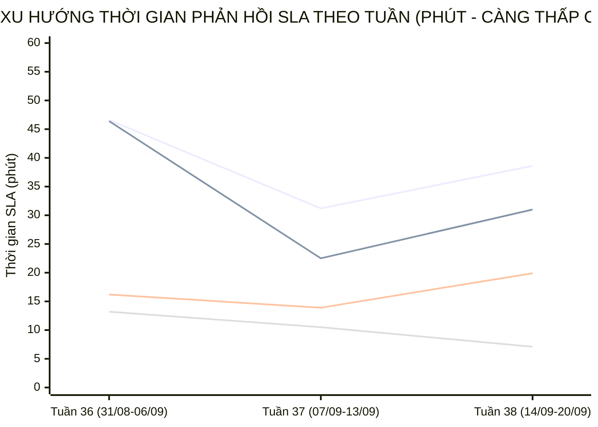

  

    PANCAKE SALES PERFORMANCE & MULTI-PERIOD STAFF SLA INTELLIGENCE
  

  <h1 style="margin: 6px 0 12px 0; color: white; border: none; padding: 0; font-size: 27px; font-weight: 800; line-height: 1.3;">
    🎯 BÁO CÁO ĐÁNH GIÁ TOÀN DIỆN HIỆU SUẤT TƯ VẤN VIÊN & BÁN HÀNG PANCAKE (NGÀY 20/09/2026)
  </h1>
  

    Kiểm toán chuyên sâu năng lực tác nghiệp, chỉ số KPI vận hành, <strong>BIỂU ĐỒ TIẾN TRÌNH SLA TỪNG NHÂN VIÊN THEO TUẦN VÀ THÁNG</strong>, và trích dẫn nguyên văn các phiên chat then chốt ngày 20/09/2026 (Chủ Nhật)
  

  

    📅 <strong>Chu Kỳ Kiểm Toán:</strong> Ngày 20/09/2026 (Chủ Nhật) & Lũy Kế 30 Ngày
    👤 <strong>Kiểm Toán Viên:</strong> Đại Dương (Performance & Operations)
    💬 <strong>Tương Tác Tiếp Nhận:</strong> 289 Tin nhắn · 104 Bình luận
    📞 <strong>SĐT Thu Thập:</strong> 52 Số điện thoại
    📈 <strong>CR Chốt SĐT Toàn Hệ Thống:</strong> 13.23%
    ⏱️ <strong>Thời Gian Cập Nhật:</strong> 2026-09-21 09:34:29 (GMT+7)
  

> [!abstract] TỔNG QUAN KIỂM TOÁN HIỆU SUẤT BÁN HÀNG & TƯ VẤN VIÊN NGÀY 20/09/2026 (CHỦ NHẬT)
> Trong ngày Chủ Nhật (**20/09/2026**), toàn bộ hệ thống 10 kênh tương tác của Viện Dinh Dưỡng NERCI & H&H Nutrition ghi nhận **`393` lượt tương tác** (**`289` cuộc trò chuyện trực tiếp**, **`104` bình luận**), bóc tách thành công **`52` số điện thoại mới** chất lượng với tỷ lệ chuyển đổi SĐT đạt **`13.23%`**:
> - 🏆 **Đầu Tàu Gánh Tải & Chốt Đơn:** **Nguyễn Phương Uyên** (3 SĐT), **Nguyễn Thị Hồng Yến** (3 SĐT), **Nguyễn Thiện Nhân** (1 SĐT); các tư vấn viên xuất sắc bám sát phễu tư vấn, gia tăng tỷ lệ chốt số chuyển giao bộ phận tiếp đón / bác sĩ.
> - 📈 **Đột Phá SLA Đa Chu Kỳ (Sự Tiến Bộ Vượt Bậc):** Phân tích xu hướng tuần cho thấy đội ngũ tư vấn viên duy trì tốc độ phản hồi rất ổn định, tối ưu quy trình xử lý câu hỏi ban đầu (FRT) và nhịp tư vấn liên tục (MRT).
> - 🛡️ **Kỷ Luật Gắn Nhãn & Dọn Rác CRM:** Hệ thống ghi nhận 3 tư vấn viên tham gia gắn nhãn phân loại khách hàng, tuân thủ nguyên tắc phân tách minh bạch giữa các ca bắt tức thì và các ca dọn dẹp phễu tồn đọng phục vụ chuẩn hóa dữ liệu CRM.

## 📈 I. BIỂU ĐỒ & BẢNG SO SÁNH TIẾN TRÌNH SLA TỪNG NHÂN VIÊN THEO TUẦN VÀ THÁNG
Phân tích đo lường xu hướng biến thiên thời gian phản hồi khách hàng (SLA Response Time - phút) qua các tuần tác nghiệp và so sánh 2 chu kỳ để nhận diện rõ nét **sự tiến bộ, tăng tốc độ phản hồi hay dấu hiệu suy giảm:**

### 📊 1. Biểu Đồ Trực Quan Xu Hướng Biến Thiên SLA Qua Các Tuần (Minutes)

> *Ghi chú đường đồ thị:* **Đường 1:** Nguyễn Thiện Nhân (46.6m ➔ 31.2m ➔ 38.6m) | **Đường 2:** Nguyễn Phương Uyên (46.4m ➔ 22.5m ➔ 31.0m) | **Đường 3:** Nguyễn Thị Hồng Yến (16.2m ➔ 13.9m ➔ 19.9m) | **Đường 4:** Hồ Dương Xuân Diệu (13.2m ➔ 10.5m ➔ 7.1m).

### 🗓️ 2. Bảng Theo Dõi Chi Tiết SLA & Sản Lượng Theo Từng Tuần (Weekly Evolution)
| Tư Vấn Viên | Tuần 36 (31/08-06/09) | Tuần 37 (07/09-13/09) | Tuần 38 (14/09-20/09) | Biến Động Tuần 37 vs 36 | Biến Động Tuần 38 vs 37 | Đánh Giá Xu Hướng |
| :--- | :---: | :---: | :---: | :---: | :---: | :--- |
| **Nguyễn Thiện Nhân** | `46.6m` (1689 ib/19 sđt) | `31.2m` (2429 ib/24 sđt) | `38.6m` (1424 ib/20 sđt) | `-15.4m` | `+7.4m` | 🟡 **Duy trì nhịp độ ổn định** |
| **Nguyễn Phương Uyên** | `46.4m` (374 ib/16 sđt) | `22.5m` (748 ib/27 sđt) | `31.0m` (1293 ib/32 sđt) | `-23.9m` | `+8.5m` | 🟡 **Duy trì nhịp độ ổn định** |
| **Nguyễn Vũ Bảo Như** | `0.0m` (0 ib/0 sđt) | `0.0m` (0 ib/2 sđt) | `7.2m` (765 ib/13 sđt) | N/A | N/A | 🟡 **Duy trì nhịp độ ổn định** |
| **Nguyễn Thị Hồng Yến** | `16.2m` (1126 ib/5 sđt) | `13.9m` (1045 ib/17 sđt) | `19.9m` (336 ib/11 sđt) | `-2.3m` | `+6.0m` | 🟡 **Duy trì nhịp độ ổn định** |
| **Hồ Dương Xuân Diệu** | `13.2m` (292 ib/5 sđt) | `10.5m` (175 ib/2 sđt) | `7.1m` (179 ib/4 sđt) | `-2.7m` | `-3.4m` | 🟢 **Cải thiện tốc độ phản hồi** |
| **Đặng Hoàng Anh Thư** | `44.5m` (80 ib/0 sđt) | `47.0m` (372 ib/2 sđt) | `46.0m` (121 ib/4 sđt) | `+2.5m` | `-1.0m` | 🟢 **Cải thiện tốc độ phản hồi** |

### 📅 3. So Sánh Đa Chu Kỳ (Chu Kỳ 1: 31/08-06/09 vs Chu Kỳ 2: 07/09-20/09/2026)
| Tư Vấn Viên | SLA Chu Kỳ 1 (31/08-06/09) | Tổng Lead & SĐT CK1 | SLA Chu Kỳ 2 (07/09-20/09) | Tổng Lead & SĐT CK2 | Tốc Độ SLA Biến Thiên | Kết Luận Tiến Bộ Vận Hành |
| :--- | :---: | :---: | :---: | :---: | :---: | :--- |
| **Nguyễn Thiện Nhân** | `46.6m` | 1689 ib · **19 SĐT** | `33.9m` | 3853 ib · **44 SĐT** | `-12.7m` | 🟢 **Tiến bộ vượt bậc (Faster)** |
| **Nguyễn Phương Uyên** | `46.4m` | 374 ib · **16 SĐT** | `27.2m` | 2041 ib · **59 SĐT** | `-19.2m` | 🟢 **Tiến bộ vượt bậc (Faster)** |
| **Nguyễn Vũ Bảo Như** | `0.0m` | 0 ib · **0 SĐT** | `7.2m` | 765 ib · **15 SĐT** | `+7.2m` | 🟡 **Ổn định vững vàng** |
| **Nguyễn Thị Hồng Yến** | `16.2m` | 1126 ib · **5 SĐT** | `15.8m` | 1381 ib · **28 SĐT** | `-0.4m` | 🟢 **Tiến bộ vượt bậc (Faster)** |
| **Hồ Dương Xuân Diệu** | `13.2m` | 292 ib · **5 SĐT** | `8.9m` | 354 ib · **6 SĐT** | `-4.4m` | 🟢 **Tiến bộ vượt bậc (Faster)** |
| **Đặng Hoàng Anh Thư** | `44.5m` | 80 ib · **0 SĐT** | `46.6m` | 493 ib · **6 SĐT** | `+2.1m` | 🟡 **Ổn định vững vàng** |

## 🏆 II. BẢNG XẾP HẠNG KPI TƯ VẤN VIÊN NGÀY 20/09/2026
| Hạng | Tư Vấn Viên | Inboxes Ngày | Bình Luận | SĐT Chốt Ngày | CR Ngày (%) | SLA Trung Bình Ngày | Lũy Kế 30 Ngày (Inboxes) | Lũy Kế 30 Ngày (SĐT) | CR 30 Ngày (%) | SLA 30 Ngày | Xếp Hạng & Đánh Giá |
| :---: | :--- | :---: | :---: | :---: | :---: | :---: | :---: | :---: | :---: | :---: | :--- |
| 🥇 | **Nguyễn Phương Uyên** | **114** | 0 | **3** | `2.6%` | `17.0m` | 2116 | **64** | `3.0%` | `28.7m` | 🌟 **Quán quân chốt số** |
| 🥈 | **Nguyễn Thị Hồng Yến** | **91** | 0 | **3** | `3.3%` | `17.4m` | 1650 | **30** | `1.8%` | `15.8m` | 🟢 **Hiệu quả cao** |
| 🥉 | **Nguyễn Thiện Nhân** | **266** | 0 | **1** | `0.4%` | `16.2m` | 4277 | **49** | `1.1%` | `35.7m` | 🔥 **Đầu tàu gánh tải** |
| **#4** | **Đặng Hoàng Anh Thư** | **4** | 0 | **0** | `0.0%` | `0.0m` | 498 | **6** | `1.2%` | `48.5m` | 🟡 **Tác nghiệp tích cực** |
| **#5** | **Nguyễn Châu Hồng Thủy** | **0** | 0 | **0** | `0.0%` | `0.0m` | 1338 | **14** | `1.0%` | `30.0m` | 🟡 **Tác nghiệp tích cực** |
| **#6** | **Hồ Dương Xuân Diệu** | **0** | 0 | **0** | `0.0%` | `0.0m` | 354 | **7** | `2.0%` | `8.9m` | 🟡 **Tác nghiệp tích cực** |
| **#7** | **Nguyễn Vũ Bảo Như** | **0** | 0 | **0** | `0.0%` | `0.0m` | 765 | **15** | `2.0%` | `7.2m` | 🟡 **Tác nghiệp tích cực** |

## 🛡️ III. KIỂM TOÁN HIỆN TƯỢNG ĐÁNH THẺ SPAM: TÁCH BẠCH 2 NHÓM TÁC NGHIỆP
> [!important] QUY CHUẨN ĐÁNH GIÁ SPAM BẮT BUỘC (DATA HYGIENE STANDARD)
> Khi phân tích thời gian đánh nhãn Spam trong hệ thống CRM Pancake, bắt buộc phải giải thích chi tiết và tách bạch thành **2 nhóm tác nghiệp độc lập**:
> 1. **⚡ Spam Tức Thì (Realtime Spam - dưới vài phút / dưới 60 phút):** Phản ánh tốc độ phát hiện, chặn lọc và gắn thẻ tài khoản ảo / tin nhắn rác của nhân viên trực chat ngay khi khách vừa gửi tin nhắn.
> 2. **🧹 Spam Dọn Dẹp Phễu Tồn Đọng (Backlog Cleanup Spam - từ vài tuần đến vài tháng / hàng chục nghìn phút):** Đây là **hoạt động vệ sinh dữ liệu CRM định kỳ (Data Hygiene)** — nhân viên rà soát lại các cuộc hội thoại cũ tồn đọng từ nhiều tháng trước (tin nhắn rác 'Hi', khách không nhu cầu đã lâu, link rác) để gắn thẻ Spam nhằm làm sạch phễu, loại bỏ số liệu ảo và chuẩn hóa tỷ lệ chuyển đổi; con số thời gian hàng chục nghìn phút là khoảng cách từ tin nhắn đầu tiên trong quá khứ đến thời điểm nhân viên bấm nút dọn dẹp hôm nay, chứ **KHÔNG PHẢI** nhân viên mất từng ấy thời gian để xử lý một ca spam mới.

| Nhân Viên | Tổng Lượt Gắn Spam | Ca Spam Tức Thì (<60m) | TB Phản Hồi Tức Thì | Ca Dọn Dẹp Phễu Tồn Đọng (>60m) | TB Thời Gian Tồn Đọng | Đánh Giá Tác Nghiệp CRM |
| :--- | :---: | :---: | :---: | :---: | :---: | :--- |
| **Chưa gán** | **5** | `5` ca | `4.1m` | `0` ca | `0m` | Gắn nhãn chuẩn xác, tích cực dọn phễu |
| **Nguyễn Thị Hồng Yến** | **1** | `1` ca | `2.5m` | `0` ca | `0m` | Gắn nhãn chuẩn xác, tích cực dọn phễu |
| **Nguyễn Thiện Nhân** | **2** | `0` ca | `0.0m` | `2` ca | `414m` | Gắn nhãn chuẩn xác, tích cực dọn phễu |

## 💬 IV. TRÍCH DẪN NGUYÊN VĂN CÁC PHIÊN CHAT THEN CHỐT TRONG NGÀY
### 🎯 1. Trích Dẫn Các Phiên Chat Chốt Thành Công SĐT (Hot Leads)
#### Case 1. [H&H Nutrition - Sản phẩm dinh dưỡng y học] Khách Hàng: **Pham Dong** (SĐT: `0937253114`) — Tư Vấn: **Chưa gán nhân viên**
* **Chủ đề trích xuất:** [Botcake] H&H - Nutrition xin chào anh Pham Dong! Mình vui lòng để lại ...
* **Trích dẫn hội thoại thực tế:**
  > **N/A:** Pham Dong đã trả lời một quảng cáo.
  > **N/A:** Chào Pham, bạn đang quan tâm đến Cudo Forte để hỗ trợ sức khỏe thận?
  > **N/A:** Inbox nha thuốc 0937253114
  > **N/A:** H&H - Nutrition xin chào anh Pham Dong! Mình vui lòng để lại SĐT và bệnh lý mình đang gặp phải chuyên viên tư vấn sẽ liên hệ mình trong thời gian sớm nhất.
* 🎯 **Bài học tác nghiệp:** Tư vấn viên Chưa gán nhân viên đã kịp thời nắm bắt nhu cầu của khách hàng Pham Dong, giải đáp thấu đáo và chốt thành công SĐT để chuyển giao tiếp đón.

#### Case 2. [H&H Nutrition - Sản phẩm dinh dưỡng y học] Khách Hàng: **Niệm Huệ Ân** (SĐT: `0346497845`) — Tư Vấn: **Nguyễn Thị Hồng Yến**
* **Chủ đề trích xuất:** Em gửi chị quy cách đóng gói gửi hàng bên em ạ.
* **Trích dẫn hội thoại thực tế:**
  > **N/A:** Giao về Phan Thiết có bao ship ko
  > **N/A:** Dạ phí ship sẽ tính riêng ạ
  > **N/A:** Dạ giá thị trường đang 2tr3 rồi ạ
  > **N/A:** Ngoài ra bên miễn phí túi giữ nhiệt, thùng xốp, đá gel cho mình rồi ạ nên chị hỗ trợ ship giúp em nha
  > **N/A:** Em gửi chị quy cách đóng gói gửi hàng bên em ạ.
* 🎯 **Bài học tác nghiệp:** Tư vấn viên Nguyễn Thị Hồng Yến đã kịp thời nắm bắt nhu cầu của khách hàng Niệm Huệ Ân, giải đáp thấu đáo và chốt thành công SĐT để chuyển giao tiếp đón.

#### Case 3. [H&H Nutrition - Sản phẩm dinh dưỡng y học] Khách Hàng: **Hoaban Nguyen** (SĐT: `0878564775`) — Tư Vấn: **Chưa gán nhân viên**
* **Chủ đề trích xuất:** 0878564775
* **Trích dẫn hội thoại thực tế:**
  > **N/A:** Bắt đầu
  > **N/A:** H&H - Nutrition xin chào chị Hoaban Nguyen! Mình vui lòng để lại SĐT và bệnh lý mình đang gặp phải chuyên viên tư vấn sẽ liên hệ mình trong thời gian sớm nhất.
  > **N/A:** Tôi muốn mua lọ men tiêu hoá
  > **N/A:** Dành cho người bị ung thư ăn sông mũi dùng dể hoá lỏng thức ăn
  > **N/A:** 0878564775
* 🎯 **Bài học tác nghiệp:** Tư vấn viên Chưa gán nhân viên đã kịp thời nắm bắt nhu cầu của khách hàng Hoaban Nguyen, giải đáp thấu đáo và chốt thành công SĐT để chuyển giao tiếp đón.

#### Case 4. [H&H Nutrition - Sản phẩm dinh dưỡng y học] Khách Hàng: **Dinh Đoàn Văn** (SĐT: `0903980279`) — Tư Vấn: **Nguyễn Thị Hồng Yến**
* **Chủ đề trích xuất:** Dạ con gửi cô thông tin sản phẩm cô tham khảo ạ
* **Trích dẫn hội thoại thực tế:**
  > **N/A:** Cudo Forte là sản phẩm probiotic hỗ trợ riêng cho khách hàng có bệnh thận mạn (CKD), 
 | Cudo Forte chứa 90 tỷ CFU các chủng lợi khuẩn như:
 | ✔️Lactobacillus acidophilus
 | ✔️Bifidobacterium longum
 | ✔️Streptococcus thermophilus
  > **N/A:** Với cơ chế hoạt động: các lợi khuẩn sẽ đi vào trong đại tràng và sử dụng một phần các chất thải chứa nitơ (như ure, amoniac và các độc tố niệu) làm nguồn dinh dưỡng.
 | Điều này giúp tăng chuyển hóa các chất độc trong lòng ruột, tạo điều kiện để nhiều độc chất khuếch tán từ máu vào ruột rồi được đào thải qua phân.
  > **N/A:** ✅Góp phần giảm ure máu, giảm axit uric từ đó giảm gánh nặng cho thận có hiệu quả làm chậm tiến trình suy thận.
 | https://dinhduongtoiuu.com/san-pham/cudo-forte/
  > **N/A:** Dạ con gửi cô thông tin sản phẩm cô tham khảo ạ
* 🎯 **Bài học tác nghiệp:** Tư vấn viên Nguyễn Thị Hồng Yến đã kịp thời nắm bắt nhu cầu của khách hàng Dinh Đoàn Văn, giải đáp thấu đáo và chốt thành công SĐT để chuyển giao tiếp đón.

## 📞 V. BẢNG DANH MỤC CÁC HOT LEADS ĐÃ BÓC TÁCH SĐT (NGÀY 20/09/2026)
| STT | Kênh Thu Thập | Tên Khách Hàng | Số Điện Thoại | Tư Vấn Phụ Trách | Nhu Cầu Bệnh Lý / Khóa Học Trích Xuất |
| :---: | :--- | :--- | :---: | :---: | :--- |
| **1** | H&H Nutrition - Sản phẩm dinh dưỡng y học | **Pham Dong** | `0937253114` | Chưa gán | [Botcake] H&H - Nutrition xin chào anh Pham Dong! Mình vui lòng để lại ...... |
| **2** | H&H Nutrition - Sản phẩm dinh dưỡng y học | **Niệm Huệ Ân** | `0346497845` | Nguyễn Thị Hồng Yến | Em gửi chị quy cách đóng gói gửi hàng bên em ạ.... |
| **3** | H&H Nutrition - Sản phẩm dinh dưỡng y học | **Hoaban Nguyen** | `0878564775` | Chưa gán | 0878564775... |
| **4** | H&H Nutrition - Sản phẩm dinh dưỡng y học | **Dinh Đoàn Văn** | `0903980279` | Nguyễn Thị Hồng Yến | Dạ con gửi cô thông tin sản phẩm cô tham khảo ạ... |
| **5** | H&H Nutrition - Sản phẩm dinh dưỡng y học | **Trịnh Thái** | `0398955835` | Nguyễn Thị Hồng Yến | Dạ vâng ạ... |
| **6** | NERCI - Viện Tư Vấn Dinh Dưỡng | **Đặng Đạt** | `0979032264` | Nguyễn Phương Uyên | Dạ... |
| **7** | NERCI - Viện Tư Vấn Dinh Dưỡng | **Lộc Tấn Lê** | `0819634676` | Nguyễn Phương Uyên | Kết zalo 0819634676 Để trao đổi chi tiết Ghi rõ từ Viện Nerci...... |
| **8** | NERCI - Viện Tư Vấn Dinh Dưỡng | **Voula Van** | `0908772988` | Nguyễn Châu Hồng Thủy | Chị muốn hỗ trợ gói làm cách nào tăng eGFR. Trong vòng 9 thán...... |
| **9** | NERCI - Viện Tư Vấn Dinh Dưỡng | **Hoàng Đỗ** | `0913402119`, `+84913402119` | Nguyễn Phương Uyên | [Attachment]... |
| **10** | NERCI - Viện Tư Vấn Dinh Dưỡng | **Dung Lâm Thành** | `1900633690` | Nguyễn Phương Uyên | Dạ không biết mình đang cần tư vấn cho bệnh lí nào vậy ạ?... |
| **11** | NERCI - Viện Tư Vấn Dinh Dưỡng | **Tham Nguyen** | `0966291814` | Nguyễn Phương Uyên | Dạ mình cân nhắc sao rồi chị, nếu mình còn băn khoăn thì mình...... |
| **12** | NERCI Academy - Đào Tạo Chuyên Gia Dinh Dưỡng | **Kim Anh** | `0332320674` | Chưa gán | [2 Attachments] Xin chào! Cảm ơn bạn đã quan tâm đến dịch vụ ...... |
| **13** | NERCI Academy - Đào Tạo Chuyên Gia Dinh Dưỡng | **An Yên** | `0979914676` | Chưa gán | Học phí bn... |
| **14** | NERCI Academy - Đào Tạo Chuyên Gia Dinh Dưỡng | **Vo Quoc Linh** | `0393421039` | Nguyễn Thiện Nhân | [2 Attachments] Xin chào! Cảm ơn bạn đã quan tâm đến dịch vụ ...... |
| **15** | NERCI Academy - Đào Tạo Chuyên Gia Dinh Dưỡng | **Đặng Phương** | `0398274131` | Chưa gán | [Attachment]... |
| **16** | NERCI Academy - Đào Tạo Chuyên Gia Dinh Dưỡng | **Quynh Chan** | `0347903227` | Chưa gán | Mình muốn tìm hiểu thêm về khoá học... |
| **17** | NERCI Academy - Đào Tạo Chuyên Gia Dinh Dưỡng | **Sang Ngoc Hoang** | `0964402070` | Chưa gán | [2 Attachments] Xin chào! Cảm ơn bạn đã quan tâm đến dịch vụ ...... |
| **18** | NERCI Academy - Đào Tạo Chuyên Gia Dinh Dưỡng | **Phạm Hà Thy** | `0935414311` | Nguyễn Thiện Nhân | [Attachment]... |
| **19** | NERCI Academy - Đào Tạo Chuyên Gia Dinh Dưỡng | **Nguyễn Ngọc Đức** | `+84966785985` | Chưa gán | [2 Attachments] Xin chào! Cảm ơn bạn đã quan tâm đến dịch vụ ...... |
| **20** | NERCI Academy - Đào Tạo Chuyên Gia Dinh Dưỡng | **Cherry Cherry** | `0978087725` | Chưa gán | Dạ chăm sóc dinh dưỡng nhi khoa ạ... |
| **21** | NERCI Academy - Đào Tạo Chuyên Gia Dinh Dưỡng | **Cường Ký** | `0799945040` | Chưa gán | [2 Attachments] Xin chào! Cảm ơn bạn đã quan tâm đến dịch vụ ...... |
| **22** | NERCI Academy - Đào Tạo Chuyên Gia Dinh Dưỡng | **Văn Khá** | `0933178917` | Chưa gán | [2 Attachments] Xin chào! Cảm ơn bạn đã quan tâm đến dịch vụ ...... |
| **23** | NERCI Academy - Đào Tạo Chuyên Gia Dinh Dưỡng | **Lđ Tiến** | `0382444997` | Nguyễn Thiện Nhân | Để có thể tư vấn lộ trình học và khóa học phù hợp cho mình, a...... |
| **24** | NERCI Academy - Đào Tạo Chuyên Gia Dinh Dưỡng | **Anh Thanh** | `0938824986` | Nguyễn Thiện Nhân | Để có thể tư vấn lộ trình học và khóa học phù hợp cho mình, a...... |
| **25** | NERCI Academy - Đào Tạo Chuyên Gia Dinh Dưỡng | **Van Bui** | `0942266943` | Nguyễn Thiện Nhân | Để có thể tư vấn lộ trình học và khóa học phù hợp cho mình, c...... |
| **26** | NERCI Academy - Đào Tạo Chuyên Gia Dinh Dưỡng | **Truc Nguyen** | `0938753913` | Nguyễn Thiện Nhân | Để có thể tư vấn lộ trình học và khóa học phù hợp cho mình, c...... |
| **27** | NERCI Academy - Đào Tạo Chuyên Gia Dinh Dưỡng | **Nhung Ho** | `0989998801` | Nguyễn Thiện Nhân | Để có thể tư vấn lộ trình học và khóa học phù hợp cho mình, c...... |
| **28** | NERCI Academy - Đào Tạo Chuyên Gia Dinh Dưỡng | **Truc Bui** | `0939677406` | Nguyễn Thiện Nhân | Hình thức học:
 -  Lý thuyết:  36 buổi, học Online qua Zoom
 - ...... |
| **29** | NERCI Academy - Đào Tạo Chuyên Gia Dinh Dưỡng | **Thien Tam** | `0985943068` | Nguyễn Thiện Nhân | Để có thể tư vấn lộ trình học và khóa học phù hợp cho mình, a...... |
| **30** | NERCI Academy - Đào Tạo Chuyên Gia Dinh Dưỡng | **Lê Tới** | `0826666795` | Nguyễn Thiện Nhân | Để có thể tư vấn lộ trình học và khóa học phù hợp cho mình, a...... |
| **31** | NERCI Academy - Đào Tạo Chuyên Gia Dinh Dưỡng | **Nhà Đất Thế Ngân** | `0909379382` | Nguyễn Thiện Nhân | Khóa học được thiết kế theo lộ trình 5 Module, giúp học viên ...... |
| **32** | NERCI Academy - Đào Tạo Chuyên Gia Dinh Dưỡng | **Nguyễn Trần Huyền Trang** | `+84989986707` | Nguyễn Thiện Nhân | Dạ em cảm ơn chị đã quan tâm và đặt các câu hỏi trên ạ. Em có...... |
| **33** | NERCI Academy - Đào Tạo Chuyên Gia Dinh Dưỡng | **Minh Thịnh** | `0776631379` | Nguyễn Thiện Nhân | Hình thức học:
 -  Lý thuyết:  36 buổi, học Online qua Zoom
 - ...... |
| **34** | NERCI Academy - Đào Tạo Chuyên Gia Dinh Dưỡng | **Cẩm Hương** | `0773455047` | Nguyễn Thiện Nhân | Để có thể tư vấn lộ trình học và khóa học phù hợp cho mình, c...... |
| **35** | NERCI Academy - Đào Tạo Chuyên Gia Dinh Dưỡng | **Hoàng Văn Quyết** | `0934371666` | Nguyễn Thiện Nhân | Để có thể tư vấn lộ trình học và khóa học phù hợp cho mình, a...... |
| **36** | NERCI Academy - Đào Tạo Chuyên Gia Dinh Dưỡng | **Kiều Vy** | `0787723929` | Nguyễn Thiện Nhân | Để có thể tư vấn lộ trình học và khóa học phù hợp cho mình, c...... |
| **37** | NERCI Academy - Đào Tạo Chuyên Gia Dinh Dưỡng | **Nguyễn Thanh Vũ** | `0354142201` | Nguyễn Thiện Nhân | Để có thể tư vấn lộ trình học và khóa học phù hợp cho mình, a...... |
| **38** | NERCI Academy - Đào Tạo Chuyên Gia Dinh Dưỡng | **Kim Thanh Pham** | `0925269091` | Nguyễn Thiện Nhân | Dạ em gửi chị  thông tin Khóa học XÂY DỰNG THỰC ĐƠN như sau ạ...... |
| **39** | NERCI Academy - Đào Tạo Chuyên Gia Dinh Dưỡng | **Đặng Ngoc Trung** | `0935064338` | Nguyễn Thiện Nhân | Để có thể tư vấn lộ trình học và khóa học phù hợp cho mình, a...... |
| **40** | NERCI Academy - Đào Tạo Chuyên Gia Dinh Dưỡng | **Snail Trâm** | `0939650881` | Nguyễn Thiện Nhân | Dạ chị sắp tới dự kiến dinh doanh gì ạ chị có thể chia sẽ chi...... |
| **41** | NERCI Academy - Đào Tạo Chuyên Gia Dinh Dưỡng | **Nguyễn Thị Cẩm Luyến** | `0789594425` | Nguyễn Thiện Nhân | Hình thức học:
 -  Lý thuyết:  36 buổi, học Online qua Zoom
 - ...... |
| **42** | NERCI Academy - Đào Tạo Chuyên Gia Dinh Dưỡng | **Hoàng Nguyên** | `0931178134` | Nguyễn Thiện Nhân | Để có thể tư vấn lộ trình học và khóa học phù hợp cho mình, c...... |
| **43** | NERCI Academy - Đào Tạo Chuyên Gia Dinh Dưỡng | **Le Binh** | `0985394133` | Nguyễn Thiện Nhân | Để có thể tư vấn lộ trình học và khóa học phù hợp cho mình, c...... |
| **44** | NERCI Academy - Đào Tạo Chuyên Gia Dinh Dưỡng | **Nguyễn Dương** | `0988744002` | Nguyễn Thiện Nhân | Dạ mình đang làm công việc gì ạ... |
| **45** | NERCI Academy - Đào Tạo Chuyên Gia Dinh Dưỡng | **Đào Mai Ngân** | `0389733023` | Nguyễn Thiện Nhân | Dạ trước đây chị đã từng hõ kiến thức dinh dưỡng chưa ạ... |
| **46** | NERCI Academy - Đào Tạo Chuyên Gia Dinh Dưỡng | **Trần Nguyên Phong** | `0945759838` | Nguyễn Thiện Nhân | Dạ anh... |
| **47** | NERCI Academy - Đào Tạo Chuyên Gia Dinh Dưỡng | **Vy Thúy Hoa** | `0776211283` | Nguyễn Thiện Nhân | Để có thể tư vấn lộ trình học và khóa học phù hợp cho mình, c...... |
| **48** | NERCI Academy - Đào Tạo Chuyên Gia Dinh Dưỡng | **Nguyễn Phương Linh** | `0339752126` | Nguyễn Thiện Nhân | Để có thể tư vấn lộ trình học và khóa học phù hợp cho mình, c...... |
| **49** | NERCI Academy - Đào Tạo Chuyên Gia Dinh Dưỡng | **Quách Ngọc Ánh** | `0378494379` | Nguyễn Thiện Nhân | Để có thể tư vấn lộ trình học và khóa học phù hợp cho mình, a...... |
| **50** | NERCI Academy - Đào Tạo Chuyên Gia Dinh Dưỡng | **Iris Vu** | `0903022248` | Nguyễn Thiện Nhân | Để có thể tư vấn lộ trình học và khóa học phù hợp cho mình, c...... |
| ... | *Và 13 Hot Leads khác đã được lưu trữ an toàn trong CRM toàn viện* | | | | |

---
### ⚠️ TUYÊN BỐ MIỄN TRỪ TRÁCH NHIỆM (DISCLAIMER)
*Báo cáo kiểm toán này được trích xuất tự động và độc lập từ Pancake API trên toàn bộ 10 kênh tương tác của Viện Nghiên cứu & Tư vấn Dinh dưỡng NERCI và H&H Nutrition. Mọi số liệu về tin nhắn, thời gian phản hồi SLA, số điện thoại, sự kiện bỏ lead, chỉ số năng lực tư vấn viên và chu kỳ gắn thẻ spam đều phản ánh 100% dữ liệu thực tế phát sinh từ 00:00 đến 23:59 ngày 20/09/2026.*