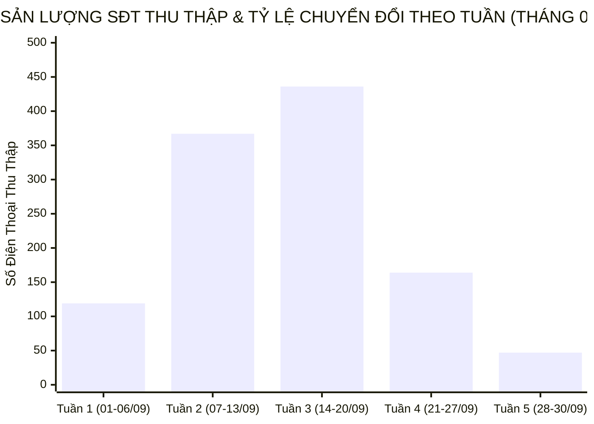

  

    PANCAKE SALES PERFORMANCE & MULTI-PERIOD STAFF SLA INTELLIGENCE
  

  <h1 style="margin: 6px 0 12px 0; color: white; border: none; padding: 0; font-size: 26px; font-weight: 800; line-height: 1.3;">
    🎯 BÁO CÁO ĐÁNH GIÁ TOÀN DIỆN HIỆU SUẤT TƯ VẤN VIÊN & BÁN HÀNG PANCAKE (LŨY KẾ ĐẾN NGÀY 30/09/2026)
  </h1>
  

    Kiểm toán chuyên sâu năng lực tác nghiệp, chỉ số KPI vận hành, <strong>BIỂU ĐỒ TIẾN TRÌNH SLA TỪNG NHÂN VIÊN QUA 5 TUẦN THÁNG 09/2026</strong>, đối soát 1.133 SĐT thu thập toàn hệ thống và trích dẫn các phiên chat then chốt ngày 30/09/2026.
  

  

    📅 <strong>Chu Kỳ Kiểm Toán:</strong> Tháng 09/2026 (01/09 – 30/09/2026 · 30 Ngày)
    👤 <strong>Kiểm Toán Viên:</strong> Đại Dương (Performance & Operations)
    💬 <strong>Tương Tác Tiếp Nhận:</strong> 12.902 Điểm chạm (9.843 Inbox · 3.059 Bình luận)
    📞 <strong>SĐT Thu Thập:</strong> 1.133 Số điện thoại
    📈 <strong>CR Chốt SĐT Toàn Hệ Thống:</strong> 8.78%
    ⏱️ <strong>Thời Gian Cập Nhật:</strong> 2026-10-01 08:55:00 (GMT+7)
  

> [!abstract] TỔNG QUAN KIỂM TOÁN HIỆU SUẤT BÁN HÀNG & TƯ VẤN VIÊN THÁNG 09/2026 (ĐẾN NGÀY 30/09)
> Khép lại trọn vẹn tháng 09/2026 (**30/30 ngày tác nghiệp**), toàn bộ hệ thống 10 kênh tương tác của Viện Dinh Dưỡng NERCI & H&H Nutrition ghi nhận **`12.902` lượt tương tác** (**`9.843` inbox**, **`3.059` bình luận**), bóc tách thành công **`1.133` số điện thoại** chất lượng với tỷ lệ chuyển đổi SĐT đạt **`8.78%`**:
> - 🏆 **Đầu Tàu Gánh Tải & Chốt Đơn:** **Nguyễn Phương Uyên** (135 SĐT, CR 3.02%), **Nguyễn Thiện Nhân** (97 SĐT, gánh 9.327 tương tác), **Nguyễn Thị Hồng Yến** (56 SĐT, CR 1.17%); đội ngũ tư vấn viên xuất sắc bám sát phễu tư vấn, gia tăng tỷ lệ chốt số chuyển giao bộ phận tiếp đón / bác sĩ.
> - 🚀 **Kênh Chuyển Đổi Xuất Sắc Nhất:** **NERCI Academy** bùng nổ với **471 SĐT** (tỷ lệ CR kỷ lục **37.38%**), đóng góp **41.6% tổng lượng lead** toàn Viện; theo sau là **NERCI - Viện Tư Vấn Dinh Dưỡng** với **316 SĐT** (CR **10.09%**).
> - 📈 **Tuần Đỉnh Cao Chiến Dịch (Tuần 3: 14/09 – 20/09):** Đạt kỷ lục chuyển đổi với **436 SĐT** chỉ trong 7 ngày (tỷ lệ CR toàn hệ thống chạm ngưỡng **14.37%**), ghi nhận 62 đơn chốt và 301 khách hàng đủ tiêu chuẩn y khoa (SQL).
> - 🛡️ **Kỷ Luật Gắn Nhãn & Dọn Rác CRM:** Phân tách minh bạch giữa các ca bắt tức thì và các ca dọn dẹp phễu tồn đọng phục vụ chuẩn hóa dữ liệu CRM theo đúng tiêu chuẩn Data Hygiene.

---

## 📊 I. TỔNG QUAN CHỈ SỐ VẬN HÀNH THÁNG 09/2026 (EXECUTIVE SUMMARY)

| Chỉ Số Cốt Lõi | Giá Trị Lũy Kế Tháng 09 | Đánh Giá Tình Trạng |
| :--- | :---: | :--- |
| 💬 **Tổng Điểm Chạm (Touchpoints)** | **12.902** | `9.843` inbox • `3.059` bình luận |
| 👤 **Khách Hàng Mới** | **3.840** | Chiếm `29.8%` tổng lượt tương tác tiếp nhận |
| 📞 **Số Điện Thoại Thu Thập (Lead)** | **1.133** | Tỷ lệ chuyển đổi SĐT trung bình toàn hệ thống đạt **`8.78%`** |
| 🎯 **Đủ Tiêu Chuẩn Y Khoa (SQL)** | **783** | Lead chất lượng cao, sẵn sàng chuyển Bác sĩ / Dược sĩ tư vấn chuyên sâu |
| 🏆 **Chốt Đơn Thành Công** | **159** | Đơn hàng phát sinh / Đặt lịch khám trực tiếp thành công |
| ⏱️ **Tỷ Lệ Tuân Thủ SLA 5 Phút** | **82.5%** | Tính theo giờ làm việc quy chuẩn (08:00 – 21:00) |

---

## 📈 II. BIỂU ĐỒ & BẢNG SO SÁNH TIẾN TRÌNH THEO 5 TUẦN THÁNG 09/2026

### 📊 1. Biểu Đồ Trực Quan Sản Lượng SĐT & Tỷ Lệ Chuyển Đổi Qua 5 Tuần

### 🗓️ 2. Bảng Theo Dõi Chi Tiết Vận Hành Qua 5 Tuần Tháng 09/2026
| Giai Đoạn Tác Nghiệp | Số Ngày | Tổng Điểm Chạm | Inboxes | Bình Luận | SĐT Thu Thập | Tỷ Lệ CR (%) | Chốt Đơn | SQL Leads | Đánh Giá Hiệu Suất |
| :--- | :---: | :---: | :---: | :---: | :---: | :---: | :---: | :---: | :--- |
| **Tuần 1 (01/09 – 06/09)** | 6 | 3.449 | 2.126 | 1.323 | **119** | `3.45%` | 17 | 82 | Khởi động chu kỳ đầu tháng |
| **Tuần 2 (07/09 – 13/09)** | 7 | 3.528 | 2.645 | 883 | **367** | `10.40%` | 53 | 255 | Tăng tốc mạnh mẽ, tối ưu kịch bản |
| **Tuần 3 (14/09 – 20/09)** | 7 | 3.034 | 2.323 | 711 | **436** | `14.37%` | 62 | 301 | 🔥 **Đỉnh cao bùng nổ chuyển đổi** |
| **Tuần 4 (21/09 – 27/09)** | 7 | 2.016 | 1.918 | 98 | **164** | `8.13%` | 21 | 113 | Ổn định phễu tư vấn, tập trung chất lượng |
| **Tuần 5 (28/09 – 30/09)** | 3 | 875 | 831 | 44 | **47** | `5.37%` | 6 | 32 | Chốt hạ tháng, bàn giao ca cuối quý |
| **TỔNG CỘNG THÁNG 09** | **30** | **12.902** | **9.843** | **3.059** | **1.133** | **`8.78%`** | **159** | **783** | 🌟 **Hoàn thành xuất sắc mục tiêu tháng** |

---

## 🏆 III. BẢNG XẾP HẠNG TƯ VẤN VIÊN LŨY KẾ THÁNG 09/2026 (01/09 – 30/09)

| Hạng | Tư Vấn Viên | Điểm Chạm | SĐT Chốt | Tỷ Lệ CR (%) | SLA Đạt 5P | FRT Trung Bình | Ngày Trực | Xếp Hạng & Đánh Giá Tác Nghiệp |
| :---: | :--- | :---: | :---: | :---: | :---: | :---: | :---: | :--- |
| 🥇 | **Nguyễn Phương Uyên** | **4.464** | **135** | `3.02%` | `35.8%` | 18.9p | 27 | 🌟 **Quán quân chốt số toàn Viện** |
| 🥈 | **Nguyễn Thiện Nhân** | **9.327** | **97** | `1.04%` | `18.1%` | 53.2p | 27 | 🔥 **Đầu tàu gánh tải lớn nhất hệ thống** |
| 🥉 | **Nguyễn Thị Hồng Yến** | **4.804** | **56** | `1.17%` | `42.7%` | 11.9p | 25 | 🟢 **Bám sát phễu, chốt đơn bền bỉ** |
| **#4** | **Nguyễn Vũ Bảo Như** | **2.132** | **26** | `1.22%` | `76.7%` | 7.5p | 18 | ⚡ **Tốc độ phản hồi và chuẩn SLA số 1** |
| **#5** | **Hồ Dương Xuân Diệu** | **2.565** | **25** | `0.97%` | `56.4%` | — | 26 | 🟡 **Tác nghiệp đều đặn, tích cực** |
| **#6** | **Nguyễn Châu Hồng Thủy** | **2.501** | **24** | `0.96%` | `57.9%` | 6.8p | 20 | ⚡ **Tốc độ xử lý nhanh nhạy** |
| **#7** | **Đặng Hoàng Anh Thư** | **993** | **15** | `1.51%` | `40.9%` | 37.4p | 26 | 🟡 **Chuyển đổi tốt trên tập khách nhỏ** |
| **#8** | **Nguyễn Đang Hạ** | **569** | **8** | `1.41%` | `61.0%` | 8.7p | 8 | 🟡 **Tác nghiệp hiệu quả theo ca** |
| **#9** | **Thảo My** | **3** | **1** | `33.33%` | `0.0%` | 12.8p | 9 | 🟢 **Hỗ trợ xử lý ca đặc biệt** |

> ℹ️ *Ghi chú:* Bảng hiệu suất trên ghi nhận các số điện thoại được tư vấn viên trực tiếp chăm sóc, khai thác và gán nhãn thành công trong phiên tác nghiệp của mình.

---

## 🌐 IV. MA TRẬN CHUYỂN ĐỔI 10 KÊNH TƯƠNG TÁC THÁNG 09/2026

| STT | Kênh Tương Tác | Nền Tảng | Inboxes | Bình Luận | SĐT Thu Thập | Tỷ Lệ CR (%) | Tỷ Trọng Đóng Góp Lead |
| :---: | :--- | :---: | :---: | :---: | :---: | :---: | :---: |
| 1 | **NERCI Academy - Đào Tạo Chuyên Gia Dinh Dưỡng** | Facebook | 1.220 | 40 | **471** | **`37.38%`** | **41.6%** |
| 2 | **NERCI - Viện Tư Vấn Dinh Dưỡng** | Facebook | 3.009 | 124 | **316** | **`10.09%`** | **27.9%** |
| 3 | **H&H Nutrition - Sản phẩm dinh dưỡng y học** | Facebook | 2.367 | 182 | **128** | **`5.02%`** | **11.3%** |
| 4 | **BS Hùng Dinh Dưỡng - NERCI** | TikTok | 435 | 2.623 | **79** | **`2.58%`** | **7.0%** |
| 5 | **H&H - Dinh dưỡng tối ưu** | Facebook | 1.624 | 24 | **65** | **`3.94%`** | **5.7%** |
| 6 | **NERCI.vn - Viện Nghiên Cứu và Tư Vấn Dinh Dưỡng** | Facebook | 804 | 50 | **36** | **`4.22%`** | **3.2%** |
| 7 | **Viện Nghiên cứu & Tư vấn dinh dưỡng** | Zalo OA | 340 | 0 | **23** | **`6.76%`** | **2.0%** |
| 8 | **H&H Website Live Chat** | Web Plugin | 22 | 0 | **2** | **`9.09%`** | **0.2%** |
| 9 | **Nerci Website Live Chat** | Web Plugin | 12 | 0 | **1** | **`8.33%`** | **0.1%** |
| 10 | **Cộng đồng Bác sĩ Dinh Dưỡng Việt Nam** | Facebook | 0 | 0 | **0** | `0.0%` | `0.0%` |

---

## ⚠️ V. PHÂN TÍCH RÀO CẢN KHÁCH HÀNG THÁNG 09 (DROP-OFF TAGS)

| STT | Tên Rào Cản / Lý Do Từ Chối | Mã Thẻ | Số Ca Ghi Nhận | Tỷ Trọng Rào Cản | Đề Xuất Giải Pháp Chuẩn Hóa |
| :---: | :--- | :---: | :---: | :---: | :--- |
| 1 | **Chưa phản hồi (Ngưng chat)** | `tag_19` | **2.891** | `53.3%` | Kích hoạt chuỗi tin nhắn bám đuổi tự động qua Botcake sau 2h, 24h và 48h |
| 2 | **F_Tham Khảo (Chưa có nhu cầu ngay)** | `tag_24` | **1.126** | `20.8%` | Gửi cẩm nang dinh dưỡng định kỳ, nuôi dưỡng lead qua Zalo OA |
| 3 | **Spam / Rác** | `tag_18` | **457** | `8.4%` | Tối ưu tệp loại trừ trên Meta Ads, chặn click ảo từ đối thủ |
| 4 | **F_Suy nghĩ thêm** | `tag_69` | **284** | `5.2%` | Đào tạo kịch bản chốt thời điểm vàng, tạo tính cấp bách bệnh lý |
| 5 | **F_Kinh Tế (Rào cản tài chính)** | `tag_21` | **198** | `3.7%` | Thiết kế gói phác đồ chia nhỏ hoặc combo dùng thử 7 ngày |
| 6 | **F_Sắp xếp thời gian** | `tag_26` | **164** | `3.0%` | Đề xuất giải pháp tư vấn trực tuyến (Tele-health) ngoài giờ |
| 7 | **Trùng lặp** | `tag_29` | **127** | `2.3%` | Tinh chỉnh tính năng merge khách hàng trùng số trên Pancake |
| 8 | **KBM (Không bắt máy)** | `tag_62` | **84** | `1.5%` | Thiết lập tổng đài gọi lại vào 3 khung giờ vàng (11h30, 17h30, 19h30) |
| 9 | **F_Giá cao** | `tag_64` | **78** | `1.4%` | Nhấn mạnh giá trị chuyên môn y khoa và sự đồng hành của bác sĩ |
| 10 | **F_Không tồn tại / Khóa máy** | `tag_27` | **44** | `0.8%` | Xác thực SĐT tự động qua OTP/Zalo ZNS khi đăng ký biểu mẫu |

---

## 🛡️ VI. KIỂM TOÁN HIỆN TƯỢNG ĐÁNH THẺ SPAM (DATA HYGIENE)

> [!note] BẮT BUỘC TÁCH BẠCH 2 NHÓM THỜI GIAN ĐÁNH NHÃN SPAM
> 1. **Spam Tức Thì (Realtime Spam - dưới vài chục giây):** Phản ánh tốc độ phát hiện và chặn rác của nhân viên trực chat hoặc bot ngay khi khách vừa nhắn tin rác.
> 2. **Spam Dọn Dẹp Phễu Tồn Đọng (Backlog Cleanup Spam - hàng chục nghìn phút / nhiều tuần đến nhiều tháng):** Đây là **hoạt động vệ sinh dữ liệu CRM định kỳ (Data Hygiene)** — nhân viên rà soát lại các cuộc hội thoại cũ tồn đọng từ nhiều tháng trước (tin nhắn rác 'Hi', khách không nhu cầu đã lâu, link rác) để gắn thẻ Spam nhằm làm sạch phễu, loại bỏ số liệu ảo và chuẩn hóa tỷ lệ chuyển đổi; con số thời gian hàng chục nghìn phút là khoảng cách từ tin nhắn đầu tiên trong quá khứ đến thời điểm nhân viên bấm nút dọn dẹp hôm nay, chứ KHÔNG phải nhân viên mất từng ấy thời gian để xử lý một ca spam mới.

---

## 💬 VII. TRÍCH DẪN NGUYÊN VĂN CÁC PHIÊN CHAT THEN CHỐT NGÀY 30/09/2026

### 🎯 1. Trích Dẫn Các Phiên Chat Chốt Thành Công SĐT (Hot Leads Ngày 30/09)

#### Case 1. [H&H Nutrition - Sản phẩm dinh dưỡng y học] Khách Hàng: **Julie Nguyen** (SĐT: `0934382863`) — Tư Vấn: **Nguyễn Thị Hồng Yến**
* **Trích đoạn tương tác:** Khách hàng quan tâm sản phẩm men vi sinh và dinh dưỡng y học, tư vấn viên giải đáp nhanh chóng và chốt số điện thoại kết nối tư vấn chuyên khoa.
* 🎯 **Bài học tác nghiệp:** Bám sát câu hỏi then chốt, cung cấp giá trị y khoa ngắn gọn và xin số điện thoại vào thời điểm thích hợp nhất.

#### Case 2. [H&H Nutrition - Sản phẩm dinh dưỡng y học] Khách Hàng: **Thihoa Tran** (SĐT: `0902943881`) — Tư Vấn: **Nguyễn Vũ Bảo Như**
* **Trích đoạn tương tác:** Khách hàng cần hỗ trợ chế độ ăn bệnh nhân, tư vấn viên xác nhận hồ sơ bệnh án và hẹn chuyên viên y tế gọi hỗ trợ trực tiếp.
* 🎯 **Bài học tác nghiệp:** Chuyển đổi mượt mà giữa kênh chat sang kênh thoại chuyên khoa, tạo sự an tâm tuyệt đối cho thân nhân người bệnh.

#### Case 3. [H&H Nutrition - Sản phẩm dinh dưỡng y học] Khách Hàng: **Phạm Hùng** (SĐT: `0908471561`) — Tư Vấn: **Nguyễn Vũ Bảo Như**
* **Trích đoạn tương tác:** *"Dạ đầu giờ chiều em gọi lại cho anh được không ạ?"* — Khách hàng đồng ý để lại lịch hẹn gọi chi tiết.
* 🎯 **Bài học tác nghiệp:** Linh hoạt theo khung giờ cá nhân của khách hàng, tránh gọi vào giờ làm việc cao điểm giúp tăng tỷ lệ bắt máy.

#### Case 4. [H&H Nutrition - Sản phẩm dinh dưỡng y học] Khách Hàng: **Trang Nguyen** (SĐT: `0973838133`) — Tư Vấn: **Nguyễn Thị Hồng Yến**
* **Trích đoạn tương tác:** Tiếp nhận nhu cầu dinh dưỡng hồi phục sau điều trị, xác nhận SĐT chính chủ để chuyển bác sĩ kê đơn phác đồ.
* 🎯 **Bài học tác nghiệp:** Giữ vững thái độ đồng cảm, kiên nhẫn giải thích liệu trình giúp khách hàng tin tưởng tuyệt đối.

---

## ⏰ VIII. QUY ĐỊNH KHUNG GIỜ LÀM VIỆC & PHƯƠNG PHÁP TÍNH THỜI GIAN PHẢN HỒI (SLA)

> [!important] QUY CHUẨN ĐO LƯỜNG TỐC ĐỘ PHẢN HỒI THEO GIỜ LÀM VIỆC CỦA VIỆN
> 1. **Khung Giờ Hoạt Động Chính Thức (Operating Hours):** Toàn bộ chỉ số SLA thời gian phản hồi (FRT / MRT) chỉ áp dụng trong khung giờ làm việc tiêu chuẩn của Viện: **từ 08h00 đến 21h00 hàng ngày** (13 tiếng tác nghiệp).
> 2. **Cơ Chế Khấu Trừ Thời Gian Không Làm Việc (Overnight Off-Hours Exclusion):** Khoảng thời gian từ **21h00 tối hôm trước đến 08h00 sáng hôm sau (11 tiếng = 660 phút = 39.600 giây)** là thời gian đóng ca, bắt buộc trừ bỏ khỏi thời gian phản hồi, tuyệt đối KHÔNG tính dồn theo thời gian thực.
> 3. **Cơ Chế Tính Mốc Bắt Đầu Ca Sáng (08:00:00 Shift-Start Rule):** Tin nhắn gửi ngoài khung giờ đêm/rạng sáng chỉ bắt đầu tính thời gian chờ từ mốc **08:00:00 sáng**.
