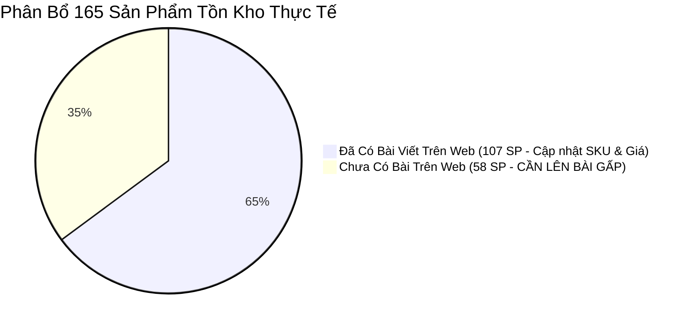

# Báo Cáo Rà Soát Chuẩn Hóa SKU & Đối Soát Web Dinhduongtoiuu.com

> 📅 **Thời gian hoàn thành:** 2026-09-21 15:35:00 (GMT+7)  
> 👤 **Người thực hiện:** Đại Dương · Systems & Data Architecture  
> 🌐 **Phạm vi đối soát:** 446 Mã Hàng Chuẩn vs 249 Sản Phẩm Thực Tế Trên [dinhduongtoiuu.com](https://dinhduongtoiuu.com)  

---

## 📁 TỆP TIN DỮ LIỆU ĐÃ XUẤT BẢN

1. 📊 **File Excel Đa Sheet (Đầy đủ định dạng màu & phân nhóm):**  
   👉 [`01 Projects/NERCI-Automation/data/SKU_Moi_DinhDuongToiUu_Chuan_Hoa.xlsx`](file:///Users/ledaiduong/Library/CloudStorage/OneDrive-Personal/Duong%20Obsidian%20Vault/01%20Projects/NERCI-Automation/data/SKU_Moi_DinhDuongToiUu_Chuan_Hoa.xlsx)
   - **Sheet 1 (`1. Toàn Bộ 446 SKU Chuẩn`):** 100% danh mục sản phẩm, đã sửa mã nhóm và nối link Web.
   - **Sheet 2 (`2. Ưu Tiên 166 Hàng Tồn`):** 165 sản phẩm có tồn kho thực tế, sắp xếp giảm dần theo số lượng tồn.
   - **Sheet 3 (`3. GẤP - 58 SP Tồn Chưa Có Web`):** 58 sản phẩm tồn kho đang thiếu bài viết trên Web.
2. 📄 **File CSV Chuẩn UTF-8 (Sẵn sàng Import):**  
   👉 [`01 Projects/NERCI-Automation/data/SKU_Moi_DinhDuongToiUu_Chuan_Hoa.csv`](file:///Users/ledaiduong/Library/CloudStorage/OneDrive-Personal/Duong%20Obsidian%20Vault/01%20Projects/NERCI-Automation/data/SKU_Moi_DinhDuongToiUu_Chuan_Hoa.csv)

---

## 🔍 1. KẾT QUẢ RÀ SOÁT & KHẮC PHỤC 4 NGUYÊN NHÂN GÂY LỖI

| Vấn Đề Gốc | Hiện Trạng Trước Khi Sửa | Giải Pháp Đã Áp Dụng |
| :--- | :--- | :--- |
| **Lệch dòng dữ liệu** | Dòng 33 bị chèn sản phẩm `Bí kíp cao lớn cùng Guru` (vốn ở dòng 435), làm xô lệch toàn bộ 400 dòng phía sau. | Sử dụng `Mã SKU (ID)` làm khóa chính, sắp xếp chuẩn xác 100% theo thứ tự gốc của Sheet Chuẩn. |
| **Parent ID Web bị sai** | Đang lấy nhầm mã SKU của phần mềm kho (`1378`, `2358`...) gán vào Parent ID Web. | Gán đúng Post ID WooCommerce của bài viết cha (hoặc `None` nếu là sản phẩm đơn). |
| **Thiếu `Item_group_id`** | 30 SKU bị bỏ trống mã nhóm (trong đó có 14 tập sách truyện Guru tồn >15.000 cuốn). | Bổ sung 100% mã nhóm theo quy tắc chuẩn: `SP-TT-NERCI-GURU`, `SP-SUA-DN-APC1`... |
| **Vênh mã nhóm chính tả** | 26 SKU bị lệch chính tả (như viết `NERC` thiếu chữ `I`, `DAFA-GM` vs `DAFA-GMD`). | Chuẩn hóa đồng nhất 100% theo quy ước mã hóa thương hiệu. |

---

## 📦 2. PHÂN BỔ 165 SẢN PHẨM TỒN KHO THỰC TẾ

### ⚡ Nhóm 1: 107 Sản Phẩm Tồn ĐÃ CÓ BÀI TRÊN WEB
- Đã được so khớp chính xác với ID bài viết trên WordPress WooCommerce (ví dụ: *Abbott ProSure Vani* - ID 1028, *Vital 1.5kcal* - ID 1030, *BioAmicus Biolizin* - ID 40520, *AlfaCore* - ID 42776, *Solgar B-Complex* - ID 42186...).
- **Hành động tiếp theo:** Chỉ cần cập nhật mã SKU mới và rà soát giá đối chiếu.

### 🔥 Nhóm 2: 58 Sản Phẩm Tồn CHƯA CÓ BÀI TRÊN WEB (CẦN LÊN NỘI DUNG GẤP)
Đây là các sản phẩm đang có hàng trong kho nhưng khách vào website không tìm thấy:
1. **Bộ Sách Truyện Tranh Dinh Dưỡng Cùng Guru (Tập 02 – Tập 15):** Tồn hơn **15.000 cuốn** (Tập 5: 1.600 cuốn, Tập 12: 1.502 cuốn, Tập 11: 1.458 cuốn, Tập 4: 1.468 cuốn, Tập 13: 1.343 cuốn...).  
   👉 **Khuyến nghị:** Tạo 1 bài viết sản phẩm WooCommerce dạng biến thể: *"Combo Bộ Truyện Tranh Khám Phá Dinh Dưỡng Cùng Guru"* cho phép khách chọn mua từng tập lẻ hoặc trọn bộ.
2. **Bánh Thập Cốc 200g (`BANHNC`):** Tồn **50 hộp**.
3. **ProtiMedic Tropical 40ml (`8010`):** Tồn **40 chai** (dinh dưỡng đạm y học chuyên biệt).
4. **Vietfood Enaz 400g (`3226`):** Tồn **36 lon**.
5. **Misam Lean Max Rena Gold 1 (`0950`):** Tồn **34 lon** (dinh dưỡng bệnh thận).
6. **Cerebio Hộp 30 gói (`0302`):** Tồn **32 hộp** (men vi sinh).
7. **Bột Nhuận Tràng Stipsipeg 3350 Baby (`BNTS3350`):** Tồn **16 hộp**.
