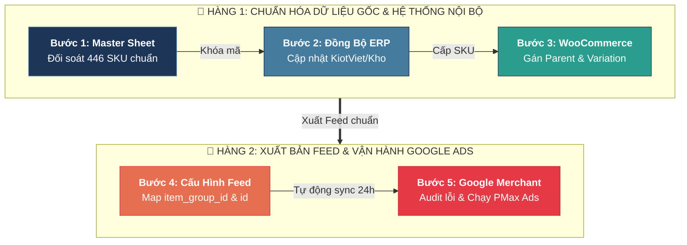

# 📦 Dự Án Chuẩn Hóa Danh Mục SKU & Google Merchant Center (GMC)
> *Dự án chuẩn hóa toàn diện 446 mã hàng lưu kho, quy chuẩn mã mẫu (`item_group_id`) và mã SKU biến thể (`item_id` / `id`) theo tiêu chuẩn của Google Merchant Center Help. Đồng bộ dữ liệu xuyên suốt giữa ERP/KiotViet, Website WooCommerce (dinhduongtoiuu.com), Pancake CRM và Google Shopping / Performance Max Ads.*

---

## 📑 Danh Sách Tài Liệu & Kế Hoạch Triển Khai

- 📘 **[[sku-standardization-gmc/quy-chuan-sku-google-merchant-center-nerci|Quy Chuẩn Cấu Trúc SKU & Mindset Quản Trị item_id / item_group_id Theo Google Merchant Center]]** 🚨 *(Tài liệu tiêu chuẩn cốt lõi)*
- 📊 **[[sku-standardization-gmc/2026-09-21-Reconciliation-DinhDuongToUu-SKU|Báo Cáo Rà Soát Chuẩn Hóa SKU & Đối Soát Web Dinhduongtoiuu.com]]**
- 📋 **[[sku-standardization-gmc/ke-hoach-chuan-hoa-va-dong-bo-sku-dinhduongtoiuu-pancake|Kế Hoạch Chuẩn Hóa & Đồng Bộ SKU Hệ Thống (Sheet Đổi SKU 17-9-26)]]**

---

### 🔄 Sơ Đồ Lộ Trình Triển Khai 2 Hàng (Tối Ưu Khổ Trang A4 / PDF)

