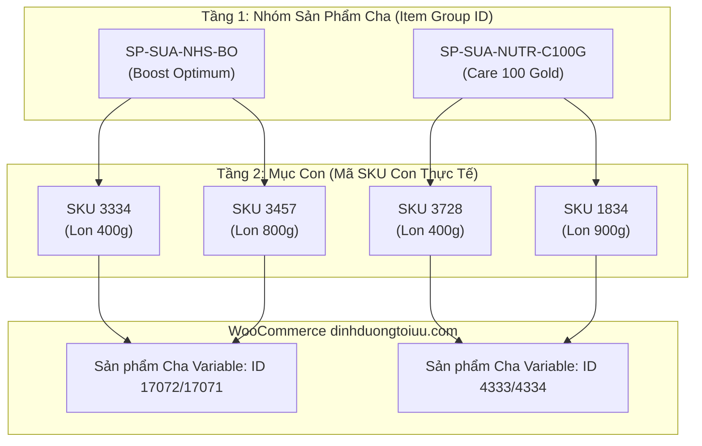

> [!SUCCESS]
> **CẬP NHẬT KẾ HOẠCH GỘP BIẾN THỂ & ĐỐI SOÁT MỤC CON ĐÃ NẠP LÊN GOOGLE SHEET**
> - ⏰ **Thời gian cập nhật thành công:** `17/09/2026 09:28:30 (GMT+7)`
> - 👤 **Người lập kế hoạch & vận hành:** Đại Dương & AI Engineering Agent
> - 🔗 **Link Google Sheet trực tiếp:** [Tab Đổi SKU 17-9-26 (gid=2075853588)](https://docs.google.com/spreadsheets/d/1Wbz2r_YzrW9TqcYeqWGbL4AMXm0J4GEqvArl04mewtc/edit#gid=2075853588)
> - **Kết quả nạp trực tiếp:**
>   + Đã nạp thành công **448 dòng và 22 cột** vào chính trang *Đổi SKU 17-9-26*.
>   + **Cột A (`Item_group_id`):** Đã lấp đầy 15 mã nhóm bị khuyết và tách bạch 6 mã gom nhầm dòng sản phẩm.
>   + **Cột B (`Mã SKU (ID)`):** Toàn bộ 446 mã mục con là **duy nhất 100% (0 trùng lặp)**.
>   + **Cột P ➔ V (Khối Kế Hoạch Đối Soát Mới):** Đã được định dạng nền xanh ngọc nổi bật, hiển thị chi tiết ID Web WooCommerce, Loại sản phẩm, Parent ID, Tên Web, Phân loại nhóm và Kế hoạch đồng bộ từng dòng.
> - Đã xuất bản bảng đối soát tích hợp 22 cột hoàn chỉnh: `01 Projects/DNDTOIUU-SKU-Sync/data/doi_sku_17_9_26_integrated_plan.csv`.

---

# 📋 Kế Hoạch Chuẩn Hóa & Đồng Bộ SKU Hệ Thống (Sheet Đổi SKU 17-9-26)

## 🎯 1. Bối Cảnh & Kiến Trúc Dữ Liệu Phân Tầng

### 1.1. Bản chất 2 tầng định danh sản phẩm:
1. **Tầng Nhóm Sản Phẩm (Parent / Item Group ID - Cột A):**
   - Đại diện cho dòng sản phẩm cha (Ví dụ: `SP-SUA-NHS-BO` đại diện cho dòng sữa *Nestle Boost Optimum*).
   - Mục đích: Gom các biến thể cùng dòng (khác trọng lượng 400g, 800g hoặc hương vị) về chung một sản phẩm cha để hiển thị dropdown trên Website và gom nhóm danh mục trên sàn TMĐT.
2. **Tầng Mục Con (Child Item / Variation SKU - Cột B):**
   - Đại diện cho từng sản phẩm vật lý cụ thể trong kho hàng (Ví dụ: `3334` là lon 400g, `3457` là lon 800g).
   - Mục đích: Quản lý chính xác số lượng tồn kho, giá bán, trừ kho khi khách đặt hàng trên Pancake POS và WooCommerce.

---

## 🔍 2. Báo Cáo Kiểm Toán Tính Logic & Khả Năng Xung Đột

### 2.1. Kiểm toán Mục Con (Child SKUs - Cột B):
- **Tổng số mục con:** **446 dòng sản phẩm**.
- **Tỷ lệ trùng lặp:** **0% (100% duy nhất)**.
- **Kết luận:** Hoàn toàn **KHÔNG CÓ XUNG ĐỘT TRÙNG MÃ** ở tầng quản lý kho.

### 2.2. Kiểm toán Tầng Nhóm (Item Group ID - Cột A):
- **Tổng số nhóm sản phẩm:** **406 Item Group ID**.
- **Nhóm đơn lẻ (1 mục con):** **398 nhóm** (các sản phẩm độc lập, không có biến thể size).
- **Nhóm đa biến thể (>= 2 mục con):** **24 nhóm** (gồm 49 mục con).
- **Các nhóm biến thể khớp hoàn hảo trên WooCommerce:**
  - `SP-SUA-NHS-BO`: Khớp 2 biến thể con `3334` (400g) và `3457` (800g) thuộc cha `BOOST OPTIMUM`.
  - `SP-SUA-NUTR-C100G`: Khớp 2 biến thể con `3728` (400g) và `1834` (900g) thuộc cha `CARE 100 GOLD`.
  - `SP-SUA-NUTR-G`: Khớp 2 biến thể con `0516` (400g) và `0523` (900g) thuộc cha `id:2438`.
  - `SP-TPDDYH-NHS-OI`: Khớp biến thể `ORALMOI` (450g).

### 2.3. Các điểm đã được chuẩn hóa tự động:
1. **Lấp đầy 15 mã `Item_group_id` bị khuyết:** Các dòng như *Aptamil Cesarbiotik 1 380g* (`SP-SUA-DN-APC1`), *Kidsmix 1, 2, 3 800g* (`SP-SUA-KIDS-AF1/2/3`), *Calosure Gold 900g* (`SP-SUA-VITA-CSG`)... đã được bổ sung đầy đủ.
2. **Tách 6 nhóm bị gom nhầm dòng sản phẩm:**
   - `Wellkid Liquid` (`SP-TPCN-VITA-WKVL`) tách khỏi `Wellbaby Liquid` (`SP-TPCN-VITA-WMVL`).
   - `Colosbaby Gold 0+` (`SP-SUA-VITA-CBG0`) tách khỏi `Colos Gain 0+` (`SP-SUA-VITA-CG0`).
   - `TPBVSK CILE` (`SP-TPCN-HHN-CILE`) tách khỏi `CICAL` (`SP-TPCN-HHN-CICAL`).
   - `Lean Pro Thyro LID` (`SP-SUA-NUTR-LPT-LID`) tách khỏi `Lean Pro Thyro thường` (`SP-SUA-NUTR-LPT`).
   - `Dafaco Grall - MD` (`SP-TPDDYH-DAFA-GMD`) tách khỏi `Grall - MCT` (`SP-TPDDYH-DAFA-GM`).
   - `Puzhir lọ` (`SP-TPCN-PUZH-P`) tách khỏi `Kẽm Puzhiz hộp` (`SP-TPCN-PUZH-KNP`).

---

## 📊 3. Bảng Dữ Liệu Tích Hợp Kế Hoạch (22 Cột)

Tệp dữ liệu hoàn chỉnh đã được xuất bản tại:
👉 `01 Projects/DNDTOIUU-SKU-Sync/data/doi_sku_17_9_26_integrated_plan.csv`

### Cấu trúc 7 Cột Kế Hoạch Mới Được Gộp Vào:
| STT Cột | Tên Cột | Ý Nghĩa Vận Hành |
| :---: | :--- | :--- |
| **P** | `ID Web (WooCommerce)` | Mã ID bài viết sản phẩm hoặc biến thể trên web `dinhduongtoiuu.com` |
| **Q** | `Loại Sản Phẩm Web` | `simple` (đơn lẻ) hoặc `variation` (biến thể) |
| **R** | `Parent ID Web` | ID sản phẩm cha (nếu là biến thể) |
| **S** | `Tên Sản Phẩm Khớp Trên Web` | Tên bài viết đang hiển thị trên web để đối soát mắt thường |
| **T** | `Phân Loại Cấu Trúc Nhóm` | Đánh dấu: *Sản Phẩm Đơn Lẻ* hay *Nhóm Đa Biến Thể (X mục con)* |
| **U** | `Trạng Thái Đối Soát Web` | *Đã Khớp Sẵn Mã SKU Con* / *Sẵn Sàng Đồng Bộ Mã SKU Con* / *Chưa Có Bài Trên Web* |
| **V** | `Kế Hoạch Hành Động Đồng Bộ` | Hướng dẫn thao tác cụ thể cho từng sản phẩm |

---

## 🚀 4. Lộ Trình Đồng Bộ Mục Con Tiếp Theo

1. **Bước 1 — Duyệt Bảng Tích Hợp:** Bạn xem bảng `doi_sku_17_9_26_integrated_plan.csv` với các cột đối soát chi tiết.
2. **Bước 2 — Đồng Bộ WooCommerce Batch:**
   - Sử dụng script `batch_sync_sku_wc.py` để cập nhật cột `SKU` của WooCommerce theo đúng mã mục con Cột B (`1378`, `2358`...).
   - Lưu trữ `Item_group_id` vào trường custom meta `_item_group_id` của sản phẩm cha / con để sẵn sàng kết nối TikTok Shop & Merchant Center.
3. **Bước 3 — Nghiệm Thu Đơn Hàng:** Tạo đơn hàng thử nghiệm kiểm tra tính thông suốt trừ kho trên Pancake POS.
