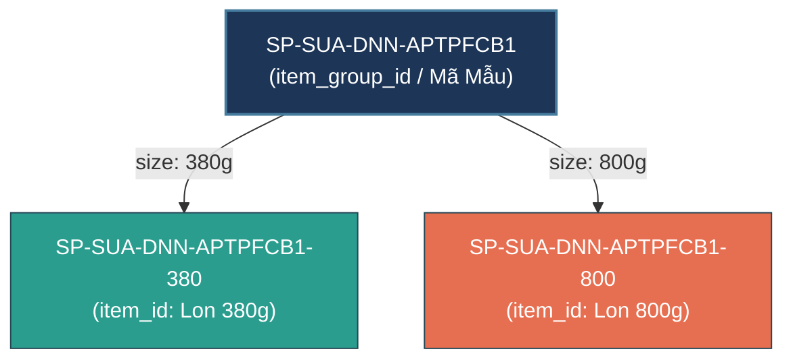
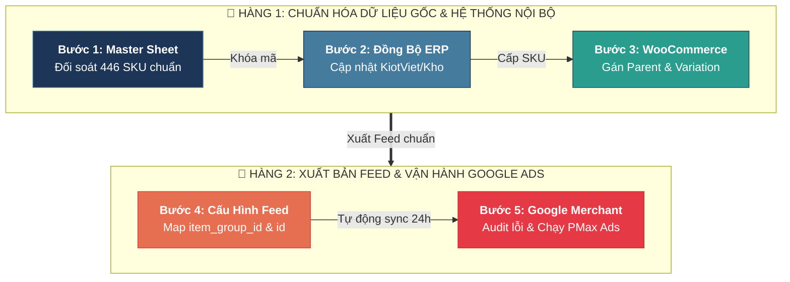

# Quy Chuẩn Cấu Trúc SKU & Mindset Quản Trị item_id / item_group_id Theo Google Merchant Center

> 📅 **Thời gian cập nhật:** 2026-09-25 08:39:30 (GMT+7)  
> 👤 **Tác giả:** Đại Dương · Systems & Data Architecture  
> 🎯 **Mục tiêu:** Định hình tiêu chuẩn mã hóa danh mục hàng hóa (SKU), liên kết hoàn hảo giữa ERP/KiotViet, Website WooCommerce (dinhduongtoiuu.com) và Nền tảng Google Merchant Center (GMC).  
> 🔗 **Tài liệu tham chiếu:** [Google Merchant Center Help - id](https://support.google.com/merchants/answer/6324405) & [item_group_id](https://support.google.com/merchants/answer/6324507), [Bảng SKU Chuẩn Hóa NERCI](https://docs.google.com/spreadsheets/d/1p2tTTWgscTDFCBtEm0JJotqeGbtRx_2w45tsSyqwL9k/edit?gid=1290278216).

---

## 🧠 1. Mindset Cốt Lõi Của Google Merchant Center Về Quản Trị Mã Hàng

Trên các sàn thương mại điện tử và Google Shopping, sự khác biệt lớn nhất giữa **quản trị kho truyền thống** và **quản trị dữ liệu số đa kênh** nằm ở việc phân biệt rạch ròi giữa:
- **Sản phẩm mẫu / Sản phẩm cha (Parent Product / Abstract Concept)**
- **Đơn vị lưu kho bán lẻ / Biến thể thực tế (Child SKU / Salable Variant)**

### 📊 Bảng Đối Chiếu Tư Duy Giữa Google và Hệ Thống NERCI

| Tiêu chí | `item_group_id` (Mã mẫu / Mã nhóm) | `id` / `item_id` (Mã SKU sản phẩm cụ thể) |
| :--- | :--- | :--- |
| **Định nghĩa Google** | Thuộc tính gom nhóm các sản phẩm là biến thể của nhau (cùng dòng nhưng khác size, màu, vị, trọng lượng). | Mã định danh duy nhất (Unique Identifier) cho từng mặt hàng có thể bỏ vào giỏ và thanh toán. |
| **Tương đương WooCommerce** | **Parent Product ID** (Bài viết sản phẩm có biến thể). | **Variation ID** (Từng phiên bản con được gán thuộc tính). |
| **Tương đương Sheet NERCI** | `Item_group_id` (Ví dụ: `SP-SUA-DNN-APTPFCB1`). | `Ma_SKU_ID` (Ví dụ: `SP-SUA-DNN-APTPFCB1-800`). |
| **Tác động hiển thị Shopping** | Gom các biến thể lại thành **1 kết quả tìm kiếm duy nhất**, hiển thị menu thả chọn (dropdown: 380g, 800g). | Hiển thị giá tiền, tình trạng tồn kho, mã vạch (GTIN) chính xác của biến thể đó. |
| **Hậu quả nếu làm sai** | Không có `item_group_id`: Google tách thành 2 quảng cáo độc lập, tự đấu giá giẫm chân nhau, lãng phí ngân sách PMax. | Trùng `id` hoặc đổi `id`: Google xóa sạch lịch sử học máy (Quality Score, CTR), sản phẩm phải xét duyệt lại từ đầu. |

---

## 🏗️ 2. Công Thức Cấu Trúc Mã Hàng Đa Phân Đoạn Chuẩn NERCI

Mã SKU của NERCI được xây dựng theo kiến trúc **5 Phân đoạn phân cấp (Hierarchical 5-Segment Syntax)** phân tách bằng dấu gạch ngang (`-`), đảm bảo tính trực quan, máy đọc hiểu được (machine-readable) và con người nhận diện tức thì:

```text
[PHÂN_LOẠI] - [NGÀNH_HÀNG] - [THƯƠNG_HIỆU] - [MÃ_SẢN_PHẨM] - [HẬU_TỐ_BIẾN_THỂ]
    │              │              │                 │                 │
    └──────────────┴──────────────┴─────────────────┘                 │
                           │                                          │
            ═══════════════════════════                               │
            👉 item_group_id (Mã Mẫu)                                 │
            ═══════════════════════════                               │
                                                                      │
    ══════════════════════════════════════════════════════════════════▼
    👉 id / item_id (Mã SKU Biến Thể Bán Lẻ Thực Tế)
    ══════════════════════════════════════════════════════════════════
```

### Chi Tiết Từng Phân Đoạn:

#### 1. Phân đoạn 1: Nhóm Phân Loại Phạm Vi (`Scope / Type`)
- `SP`: Sản phẩm thương mại bán lẻ thông thường (Standard Retail Product).
- `HKM`: Hàng khuyến mãi, quà tặng kèm, không bán lẻ (Promotional / Gift with Purchase).
- `VT`: Vật tư tiêu hao y tế, dụng cụ hỗ trợ (Medical Consumables).
- `DV`: Dịch vụ khám, tư vấn dinh dưỡng, gói điều trị.
- `TT` / `SACH`: Sách, truyện tranh, tài liệu giáo dục dinh dưỡng (ví dụ dòng Guru).

#### 2. Phân đoạn 2: Nhóm Ngành Hàng / Danh Mục (`Category`)
- `SUA`: Dòng sữa bột công thức, sữa dinh dưỡng y học pha sẵn.
- `TPCN`: Thực phẩm bảo vệ sức khỏe, vitamin, khoáng chất, vi chất.
- `MEN`: Men vi sinh, men tiêu hóa, probiotics.
- `DDY`: Dinh dưỡng y học chuyên biệt (cho bệnh nhân thận, ung thư, tiểu đường).
- `BT`: Bột dinh dưỡng, bánh ngũ cốc dinh dưỡng.

#### 3. Phân đoạn 3: Mã Viết Tắt Thương Hiệu (`Brand Acronym`)
Chuẩn hóa từ 2–4 ký tự viết hoa đại diện cho nhà sản xuất/thương hiệu chính:
- `DNN`: Danone Nutricia (Pháp / New Zealand / Ba Lan)
- `AB`: Abbott Laboratories (Hoa Kỳ)
- `FK`: Fresenius Kabi (Đức)
- `NTC`: Nutricare (Việt Nam)
- `SOL`: Solgar (Hoa Kỳ)
- `BIOA`: BioAmicus (Canada)
- `VF`: Vietfood (Việt Nam)
- `NERCI`: Viện Nghiên cứu & Tư vấn Dinh dưỡng (Đơn vị chủ quản)

#### 4. Phân đoạn 4: Mã Viết Tắt Sản Phẩm (`Product Acronym`)
Tên định danh rút gọn của sản phẩm, ghép từ chữ cái đầu của các từ khóa nhận diện:
- `APTPFCB1`: **Apt**amil **P**ro**f**utura **C**esar**b**iotik số **1**
- `APTPFCB2`: **Apt**amil **P**ro**f**utura **C**esarbiotik số **2**
- `APTPFDB1`: **Apt**amil **P**ro**f**utura **D**uo**b**iotik số **1**
- `EGV`: **E**nsure **G**old **V**anilla
- `EPLUSA15KCA`: **E**nsure **Plus** **A**dvance **1.5** **Kca**l
- `V15KCAL`: **V**ital **1.5** **Kcal**

> ⭐ **Quy Tắc Vàng 1:** Ghép 4 phân đoạn trên ta thu được:  
> **`item_group_id` = `[PHÂN_LOẠI]-[NGÀNH_HÀNG]-[THƯƠNG_HIỆU]-[MÃ_SẢN_PHẨM]`**  
> Ví dụ: `SP-SUA-DNN-APTPFCB1`

#### 5. Phân đoạn 5: Hậu Tố Biến Thể Quy Cách (`Variant Modifier Suffix`)
Đặc tả trọng lượng, thể tích hoặc quy cách đóng gói:
- Theo trọng lượng bột/viên: `-380` (lon 380g), `-800` (lon 800g), `-900` (lon 900g), `-30V` (hộp 30 viên).
- Theo thể tích nước: `-200ML` (chai 200ml), `-220ML` (chai 220ml).
- Theo đóng gói bán buôn/lốc/thùng: `-LOC6` (lốc 6), `-T24` (thùng 24 lon).

> ⭐ **Quy Tắc Vàng 2:** Ghép toàn bộ 5 phân đoạn ta thu được:  
> **`item_id` (id) = `item_group_id` + `-[HẬU_TỐ_BIẾN_THỂ]`**  
> Ví dụ: `SP-SUA-DNN-APTPFCB1-380` và `SP-SUA-DNN-APTPFCB1-800`

---

## 🎯 3. Phân Tích Điển Hình (Case Studies)

### Case Study 1: Danone Nutricia - Aptamil Profutura Cesarbiotik 1
- **Tên đầy đủ:** Aptamil Profutura Cesarbiotik 1 Infant Formula (Trẻ 0–12 tháng)
- **Đặc tính:** Dòng sữa bột sinh học cao cấp hỗ trợ trẻ sinh mổ, gồm 2 quy cách lon nhỏ và lon lớn.
- **Phân rã mã:**
  - Nhóm: `SP` (Sản phẩm)
  - Ngành: `SUA` (Sữa)
  - Hãng: `DNN` (Danone Nutricia)
  - Sản phẩm: `APTPFCB1` (Aptamil Profutura Cesarbiotik 1)
- **Mã Mẫu (`item_group_id`):** `SP-SUA-DNN-APTPFCB1`
- **Mã Sản Phẩm Biến Thể (`item_id` / `id`):**
  1. Lon 380g: `SP-SUA-DNN-APTPFCB1-380`
  2. Lon 800g: `SP-SUA-DNN-APTPFCB1-800`



### Case Study 2: Abbott Laboratories - Vital 1.5kcal
- **Tên đầy đủ:** Abbott Vital 1.5Kcal 200ml (Dinh dưỡng y học thủy phân đạm cho người kém hấp thu)
- **Mã Mẫu (`item_group_id`):** `SP-SUA-AB-V15KCAL`
- **Mã Biến Thể (`item_id`):**
  1. Chai lẻ 200ml: `SP-SUA-AB-V15KCAL-200ML`
  2. Lốc 6 chai: `SP-SUA-AB-V15KCAL-LOC6`
  3. Thùng 30 chai: `SP-SUA-AB-V15KCAL-T30`

### Case Study 3: Sách Truyện Tranh Dinh Dưỡng Cùng Guru (15 Tập)
- **Tên đầy đủ:** Bộ sách truyện tranh khám phá thế giới dinh dưỡng cùng Guru (Tập 01 – Tập 15)
- **Mã Mẫu (`item_group_id`):** `SP-TT-NERCI-GURU`
- **Mã Biến Thể (`item_id`):**
  - Tập 1: `SP-TT-NERCI-GURU-T01`
  - Tập 2: `SP-TT-NERCI-GURU-T02`
  - ...
  - Tập 15: `SP-TT-NERCI-GURU-T15`

### Case Study 4: Sản phẩm đơn (Simple Product - Không có biến thể)
- **Ví dụ:** Solgar Formula VM-75 Hộp 30 viên
- **Mã nhóm (`item_group_id`):** `SP-TPCN-SOL-VM75`
- **Mã sản phẩm (`id`):** `SP-TPCN-SOL-VM75-30V`
- *Lưu ý:* Với sản phẩm đơn, Google Merchant Center khuyến nghị **bỏ trống cột `item_group_id`** trong feed XML/Google Sheets, chỉ gửi cột `id = SP-TPCN-SOL-VM75-30V`. Nếu cố tình gửi `item_group_id` giống hệt `id` cho sản phẩm đơn lẻ, Google có thể cảnh báo cảnh báo "Single item in item group".

---

## 📋 4. Bảng Mapping Thuộc Tính Lên Google Merchant Center Feed

Khi trích xuất dữ liệu từ WooCommerce/ERP để xuất file cấp dữ liệu (Product Feed) cho Google Merchant Center, các trường cần ánh xạ tương ứng như sau:

| Trường Dữ Liệu NERCI | Thuộc tính GMC Bắt buộc | Mô tả & Quy tắc Google | Ví dụ dữ liệu thực tế |
| :--- | :--- | :--- | :--- |
| **Mã SKU Biến Thể** | `id` [mã_sản_phẩm] | Duy nhất, tối đa 50 ký tự, không chứa dấu cách, phân biệt chữ hoa chữ thường. **Bắt buộc**. | `SP-SUA-DNN-APTPFCB1-800` |
| **Mã Danh Mục Mẫu** | `item_group_id` [mã_mẫu] | Dùng chung cho tất cả các biến thể của cùng một bài viết cha. Tối đa 50 ký tự. | `SP-SUA-DNN-APTPFCB1` |
| **Tên Sản Phẩm** | `title` [tiêu_đề] | Tối đa 150 ký tự, nên chứa Thương hiệu + Dòng sản phẩm + Trọng lượng/Quy cách. | `Sữa Bột Aptamil Profutura Cesarbiotik 1 Cho Trẻ 0-12 Tháng - Lon 800g` |
| **Trọng lượng / Dung tích** | `size` [kích_thước] | Thuộc tính phân biệt biến thể chính. Với ngành sữa/dược phẩm, dùng trọng lượng/thể tích. | `800g` |
| **Thương Hiệu** | `brand` [thương_hiệu] | Tên thương hiệu chính thống đã đăng ký bản quyền. | `Danone Nutricia` |
| **Mã Vạch Toàn Cầu** | `gtin` [mã_gtin] | Mã vạch EAN-13 (893...) hoặc UPC in trên lon. Bắt buộc đối với hàng tiêu dùng FMCG/Sữa. | `9418781432198` |
| **Mã Nhà Sản Xuất** | `mpn` [mã_mpn] | Mã số của hãng sản xuất. Nếu không có, dùng chính mã `item_id`. | `APTPFCB1-800` |
| **Mức Giá** | `price` [giá] | Giá niêm yết bán lẻ gồm số tiền + mã tiền tệ ISO (`VND`). | `763000 VND` |
| **Tình Trạng Kho** | `availability` [tình_trạng_còn_hàng] | `in_stock` (còn hàng), `out_of_stock` (hết hàng), `backorder` (đặt hàng trước). | `in_stock` |

---

## ⚠️ 5. 5 Nguyên Tắc Kỹ Thuật "Sống Còn" Tránh Bị Google Phạt

1. **Tính Bất Biến Của `id` (Immutability):**
   - Không bao giờ thay đổi mã `id` khi sản phẩm đổi giá, đổi tên hiển thị hay cập nhật bao bì.
   - Nếu đổi từ `0226` sang `SP-SUA-DNN-APTPFCB1-800`, Google sẽ tính đây là một sản phẩm hoàn toàn mới. Do đó, cần có **kế hoạch chuyển đổi đồng loạt (Cut-over Plan)**, tránh sửa lắt nhắt từng ngày làm đứt gãy dữ liệu chiến dịch Google Performance Max.
2. **Đồng Bộ Hoàn Hảo Giữa Landing Page & Feed:**
   - Khi người dùng click vào quảng cáo của biến thể lon 800g (`SP-SUA-DNN-APTPFCB1-800`), trang đích (URL) phải tự động chọn sẵn biến thể 800g và hiển thị đúng mức giá 763.000đ (thông qua query string hoặc fragment, ví dụ: `dinhduongtoiuu.com/san-pham/aptamil-1/?attribute_pa_dung-tich=800g`).
   - Nếu đưa về trang chung mà mặc định hiển thị giá lon 380g (346.000đ) trong khi quảng cáo ghi 763.000đ, Google sẽ khóa tài khoản vì lỗi **Mismatched Price (Sai lệch giá giữa quảng cáo và web)**.
3. **Mỗi Biến Thể Bắt Buộc Có GTIN Độc Nhất:**
   - Lon 380g và lon 800g **phải có 2 mã vạch (Barcode EAN) hoàn toàn khác nhau**. Tuyệt đối không copy mã vạch của lon nhỏ gắn cho lon lớn.
4. **Không Sử Dụng Ký Tự Đặc Biệt:**
   - Mã SKU chỉ được chứa: chữ cái in hoa (`A-Z`), chữ số (`0-9`) và dấu gạch nối (`-`). Tuyệt đối không dùng dấu cách, dấu gạch chéo (`/`), dấu phẩy (`,`), ký tự có dấu tiếng Việt hay emoji.
5. **Độ Dài Tối Đa:**
   - Google giới hạn `id` và `item_group_id` tối đa 50 ký tự. Cú pháp của NERCI (`SP-SUA-DNN-APTPFCB1-800` = 23 ký tự) nằm trong vùng an toàn tuyệt đối (< 30 ký tự).

---

## 📈 6. Lộ Trình Triển Khai Cho NERCI & Dinhduongtoiuu.com

### 🔄 Sơ Đồ Quy Trình 2 Hàng (Tối Ưu Khổ Trang A4 / PDF)



---

### 📖 Chi Tiết Lộ Trình 5 Bước (Dạng Đọc & Checklist Thực Thi)

#### 🔹 HÀNG 1: CHUẨN HÓA DỮ LIỆU NỘI BỘ
1. **Bước 1 — Master Sheet (Khóa 446 SKU Chuẩn):**
   - **Thao tác:** Rà soát và chốt mã `item_group_id` cùng mã biến thể trên Google Sheet Master.
   - **Mục tiêu:** 100% SKU có mã nhóm, không còn lỗi chính tả (`DNN`, `AB`, `FK`...), loại bỏ trùng lặp.
2. **Bước 2 — Đồng Bộ Phần Mềm Bán Hàng / ERP (KiotViet):**
   - **Thao tác:** Cập nhật trường "Mã hàng" trên KiotViet/phần mềm kho theo đúng cấu trúc `SP-SUA-...`.
   - **Mục tiêu:** Đồng nhất dữ liệu giữa thu ngân, kế toán và bộ phận kho vận.
3. **Bước 3 — Cập Nhật Website WooCommerce (`dinhduongtoiuu.com`):**
   - **Thao tác:** Nhập mã `item_group_id` vào SKU của sản phẩm cha và mã `item_id` vào từng biến thể tương ứng.
   - **Mục tiêu:** Chuẩn bị sẵn trường dữ liệu cho plugin Product Feed tự động kéo về.

#### 🔹 HÀNG 2: XUẤT BẢN & VẬN HÀNH GOOGLE SHOPPING
4. **Bước 4 — Cấu Hình Feed Tự Động (Product Feed Pro / CTX Feed):**
   - **Thao tác:** Ánh xạ thuộc tính:
     - `item_group_id` ➔ Parent SKU
     - `id` ➔ Variation SKU
     - `size` ➔ Thuộc tính trọng lượng/dung tích (380g, 800g...)
     - `gtin` ➔ Mã vạch EAN-13
   - **Mục tiêu:** Xuất link XML Feed tự động cập nhật mỗi 24h.
5. **Bước 5 — Đẩy Lên Google Merchant Center & Khởi Chạy Ads:**
   - **Thao tác:** Nạp link Feed vào GMC, kiểm tra tab *Diagnostics* để xử lý dứt điểm các lỗi phát sinh (nếu có).
   - **Mục tiêu:** 100% SKU được Google phê duyệt trạng thái `Active (Đang hoạt động)`, sẵn sàng cho chiến dịch Performance Max.

